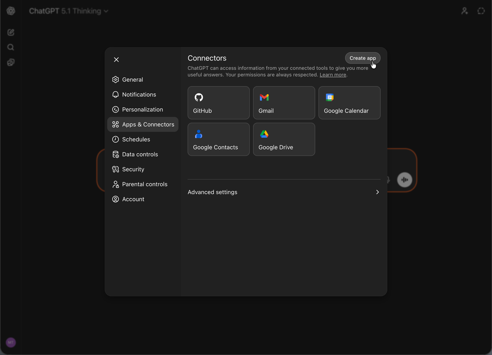

# Configuração do OpenAI ChatGPT com o AEM MCP {#setup-chatgpt}

Siga estas etapas para conectar o OpenAI ChatGPT aos servidores MCP da AEM.

* Adicione um ou mais URLs do servidor MCP do AEM na área em que as conexões ou ferramentas do MCP estão configuradas.
* Acione a conexão e faça logon com sua Adobe ID quando redirecionado.
* Em um chat, consulte as Ferramentas do AEM configuradas em seus prompts, por exemplo:

  ```
  "Using the configured AEM MCP tools, list all sites in the author environment."
  ```





