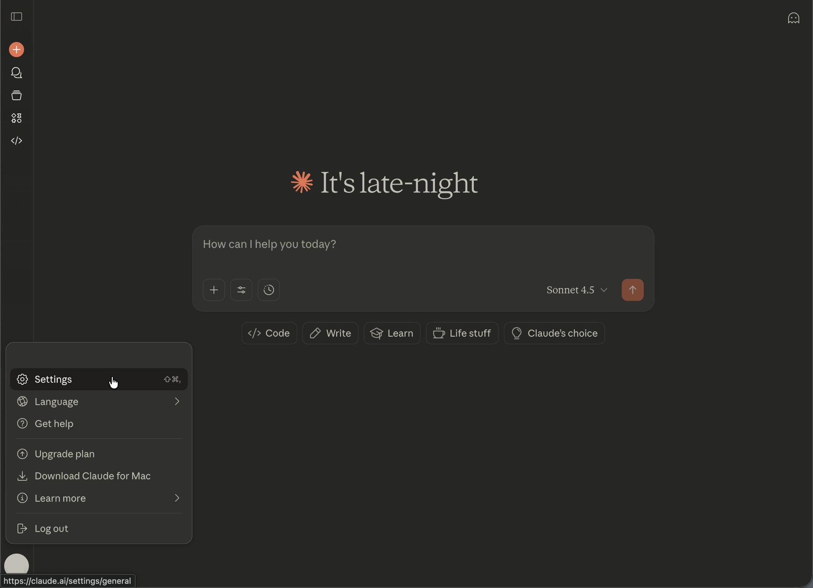
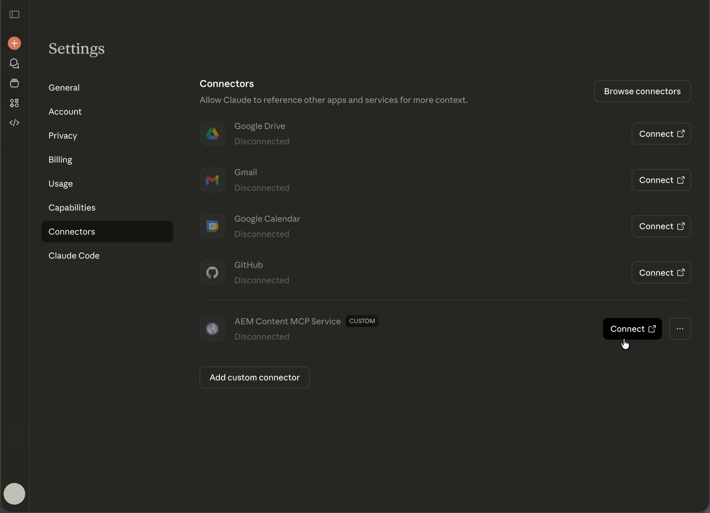

# Configuração de Claude Antrópico com AEM MCP {#setup-claude}

Este artigo aborda duas maneiras separadas de usar o Anthropic Claude com o AEM:

- Configure manualmente um ou mais dos servidores MCP do AEM no Claude (os servidores descritos em [Uso do MCP com o AEM as a Cloud Service — servidores MCP](/help/ai-in-aem/mcp-support/using-mcp-with-aem-as-a-cloud-service.md#mcp-servers)).
- Instale o Conector do Adobe Experience Manager no marketplace de conectores da Anthropic. Atualmente, ele tem paridade de recursos com o Content MCP Server e exporá um crescente subconjunto de ferramentas disponíveis nos servidores MCP da AEM.

## Configurar manualmente os servidores MCP do AEM no Claude {#manual-configure-aems-mcp-servers-in-claude}

Esta seção descreve a abordagem **configuração manual**, na qual você adiciona um ou mais servidores MCP da AEM ao Claude como conectores personalizados.

>[!NOTE]
>
>A interface do usuário do Claude está sujeita a alterações e não é definitiva. Estas instruções são para fins ilustrativos.

1. Abra o menu de conta no canto inferior esquerdo do aplicativo Web Claude e escolha **Configurações** para abrir a área Configurações.

   

1. Na barra lateral Configurações, selecione **Conectores**. Na página Conectores, escolha **Adicionar conector personalizado** para registrar um ponto de extremidade MCP personalizado.

   

1. Na caixa de diálogo **Adicionar conector personalizado**, digite um nome para exibição (por exemplo, **Serviço MCP de Conteúdo do AEM**) e a URL do servidor MCP e, em seguida, escolha **Adicionar**. Use as **Configurações avançadas** somente quando a implantação exigir opções adicionais.

   

1. Na lista Conectores, encontre sua entrada de conector personalizado (ela mostra um rótulo **PERSONALIZADO**) e escolha **Conectar** para entrar e vincular o conector à sua conta Claude.

   

1. Quando o conector aparecer na lista com sua URL, escolha **Configurar** ao lado de **Serviço MCP de Conteúdo do AEM** para abrir os detalhes do conector e continuar a instalação.

   

1. Na página **Permissões de ferramenta**, revise o padrão (por exemplo, **Precisa de aprovação**) e defina cada ferramenta do AEM como **Sempre permitir**, **Solicitar permissão** ou **Nunca permitir** de acordo com sua política de segurança.

   

1. Abra uma conversa. Selecione o menu Ferramentas e Modelo (ícone controles deslizantes) à esquerda do campo de mensagem, habilite o **Serviço de MCP de Conteúdo do AEM** em Conectores e, em seguida, insira seu prompt para que Claude possa usar as ferramentas de MCP para esse bate-papo.

   

## Instale o Adobe Experience Manager Connector (Anthropic connector marketplace) {#install-adobe-experience-manager-connector}

Esta seção descreve o **conector instalável** do marketplace de conectores da Anthropic (em vez de adicionar um URL de conector personalizado). Ele inclui um subconjunto das ferramentas disponíveis nos servidores MCP da AEM.

Para instalar o **Conector do Adobe Experience Manager**, abra **Configurações** > **Conectores** no Claude. Você também pode abrir a página Conectores diretamente em [https://claude.ai/settings/connectors](https://claude.ai/settings/connectors). O conector registra um servidor MCP que expõe um conjunto crescente de ferramentas para workflows do AEM.

