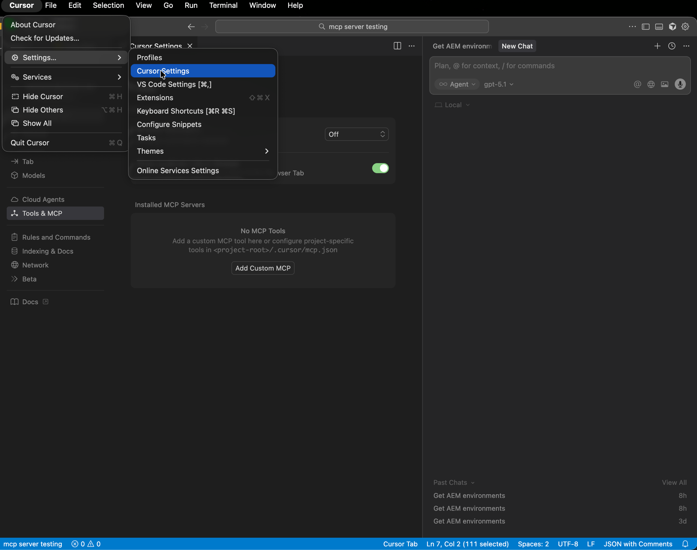
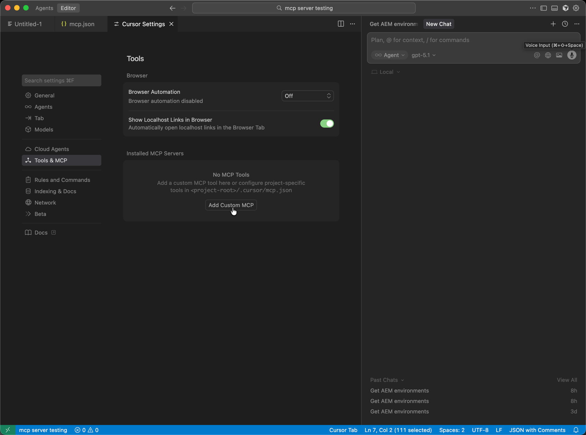
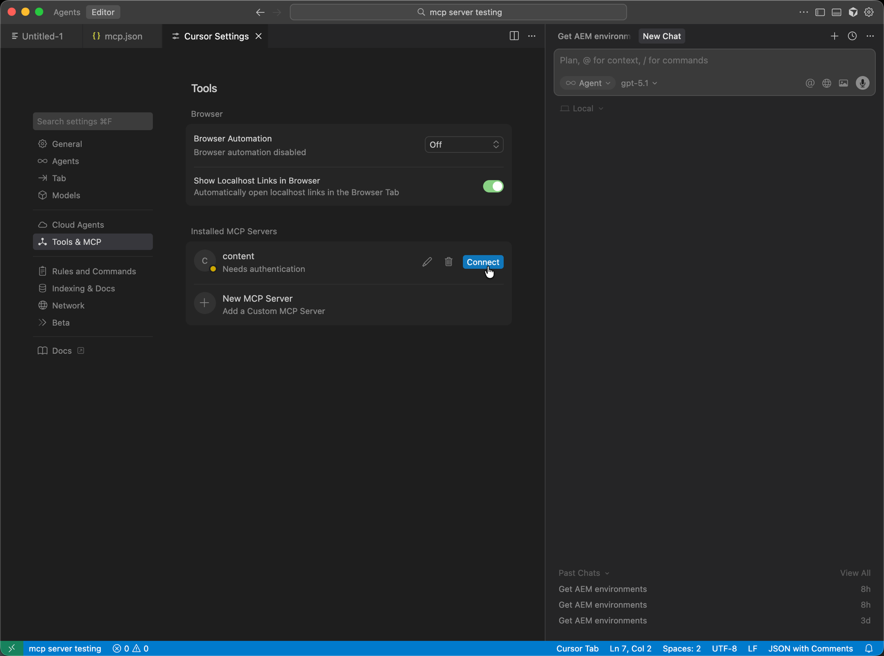

# Configurando o Cursor com o AEM MCP {#setup-cursor}

Siga estas etapas para conectar o Cursor aos servidores MCP da AEM.

* Nas configurações de MCP do cursor, crie uma nova entrada de servidor MCP com um ou mais URLs MCP do AEM.
* Autentique com seu Adobe ID quando solicitado.
* Como opção, ative ou desative ferramentas individuais clicando nos nomes das ferramentas. Todas as ferramentas são ativadas por padrão.
* Use o editor ou o chat do cursor para chamar as Ferramentas do AEM como parte dos fluxos de trabalho de desenvolvimento ou conteúdo.

