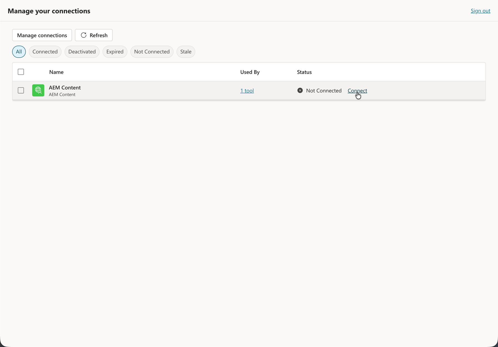

# Configuração do Microsoft Copilot Studio com AEM MCP {#setup-microsoft-copilot-studio}

Siga estas etapas para conectar o Microsoft Copilot Studio aos servidores MCP da AEM.

>[!NOTE]
>
>A interface do usuário do Microsoft Copilot Studio está sujeita a alterações e não é definitiva. Estas instruções são para fins ilustrativos.

1. Em **Agentes**, inicie o fluxo para adicionar um agente que usará ferramentas MCP do AEM.

   * Crie um novo agente.

   

1. Abra a área de ferramentas desse agente para registrar como ele chama recursos externos.

   * Navegue até a seção da ferramenta e clique em **Adicionar ferramenta**.

   

1. Decida se reutilizará uma integração existente ou definirá uma nova ferramenta com suporte de MCP.

   * Selecione uma ferramenta existente ou crie uma nova.

   

1. Ao criar uma nova ferramenta MCP, continue pela etapa do servidor **Protocolo de Contexto de Modelo**, incluindo o modo de visualização quando ele aparecer.

   * Configure uma nova ferramenta MCP apontando para um ou mais **URLs** do servidor MCP do AEM.

   

1. Defina como esse endpoint de MCP é acessado pelo agente, incluindo se o acesso é compartilhado ou dedicado.

   * Estabeleça uma conexão, que pode ser **compartilhada** ou **dedicada** entre agentes.

   

1. Em **Adicionar e configurar**, forneça ou confirme os detalhes da ferramenta MCP para que o agente possa acessar seu ambiente do AEM.

   

1. Campos de Término no formulário de ferramenta MCP (por exemplo, **URLs** do servidor e opções relacionadas à autenticação).

   * Como opção, habilite o **modo de confirmação automática** ou exija a **confirmação do usuário final** para todas as interações da ferramenta.

   

1. Valide a conectividade com o servidor MCP; conclua o logon baseado em navegador quando o Copilot Studio o redirecionar.

   * Entre usando sua **Adobe ID** quando redirecionado.

   

1. Antes de executar um teste, abra o **Gerenciar Conexões** (ou o **gerenciador de conexões**) e atribua a conexão correta à sua sessão.

   * Ao testar seu agente, abra o **gerenciador de conexões** primeiro para atribuir uma conexão à sua sessão.

   

1. Na experiência de teste, execute o agente na conexão AEM MCP.

   * Ao testar seu agente, pressione **Repetir** depois de atribuir uma conexão no **gerenciador de conexões**.

   
