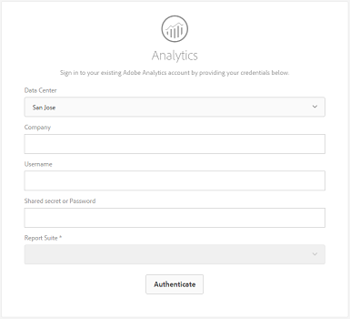

# Adicionar ativos digitais ao Adobe Experience Manager {#add-assets-to-experience-manager}

O Adobe Experience Manager enriquece o conteúdo binário dos arquivos digitais carregados com metadados avançados, tags inteligentes, execuções e outros serviços de Gerenciamento de ativos digitais (DAM). É possível carregar vários tipos de arquivos, como imagens, documentos e arquivos de imagem brutos, da pasta local ou de uma unidade de rede para os ativos do Experience Manager.

Vários métodos de upload são fornecidos. Além do upload de navegador mais usado, existem outros métodos de adicionar ativos ao repositório do Experience Manager, incluindo clientes de desktop, como o aplicativo Adobe Asset Link ou o aplicativo de desktop Experience Manager, scripts de upload e ingestão que os clientes criariam e integrações de ingestão automatizadas adicionadas como extensões AEM.

Faremos o upload de métodos para usuários finais aqui e forneceremos links para artigos que descrevem aspectos técnicos do upload e ingestão de ativos usando APIs e SDKs do Experience Manager.

Embora você possa carregar e gerenciar qualquer arquivo binário no Experience Manager, os formatos de arquivo mais usados têm suporte para serviços adicionais, como extração de metadados ou geração de pré-visualização/execução. Consulte os formatos [de arquivo](file-format-support.md) suportados para obter detalhes.

Você também pode optar por fazer um processamento adicional nos ativos carregados. Vários perfis de processamento de ativos podem ser configurados na pasta, na qual os ativos são carregados, para adicionar metadados específicos, representações ou serviços de processamento de imagens. Consulte Processamento  adicional abaixo para obter mais informações.

> [!NOTE]
>
> O Experience Manager como um serviço em nuvem aproveita uma nova maneira de fazer upload de ativos - fazer upload binário direto. Por padrão, ele é suportado pelos recursos e clientes prontos para uso do produto, como a interface do usuário do AEM, o Adobe Asset Link, o aplicativo de desktop do AEM e, portanto, transparente para os usuários finais.
>
> O código de upload personalizado ou estendido pelas equipes técnicas dos clientes precisa usar as novas APIs e protocolos de upload.

## Upload assets {#upload-assets}

Para carregar um arquivo (ou vários arquivos), você pode selecioná-los na área de trabalho e arrastar e soltar na interface do usuário (navegador da Web) na pasta de destino. Como alternativa, você pode iniciar o upload a partir da interface do usuário.

1. Na interface do usuário do Assets, navegue até o local onde deseja adicionar ativos digitais.
1. Para fazer upload dos ativos, execute um dos procedimentos a seguir:

   * Na barra de ferramentas, toque no ícone **[!UICONTROL Criar]** . Em seguida, no menu, toque em **[!UICONTROL Arquivos]**. Você pode renomear o arquivo na caixa de diálogo apresentada, se necessário.
   * Em um navegador compatível com HTML5, arraste os ativos diretamente na interface do usuário dos Ativos. A caixa de diálogo para renomear o arquivo não é exibida.
   

   Para selecionar vários arquivos, pressione a tecla Ctrl ou Command e selecione os ativos na caixa de diálogo do seletor de arquivos. Ao usar um iPad, você pode selecionar apenas um arquivo de cada vez.

<!-- #ENGCHECK do we support pausing? I couldn't get pause to show with 1.5GB upload.... If not, this should be removed#

   You can pause the uploading of large assets (greater than 500 MB) and resume it later from the same page. Tap the **[!UICONTROL Pause]** icon beside progress bar that appears when an upload starts.

   

   The size above which an asset is considered a large asset is configurable. For example, you can configure the system to consider assets above 1000 MB (instead of 500 MB) as large assets. In this case, **[!UICONTROL Pause]** appears on the progress bar when assets of size greater than 1000 MB are uploaded.

   The Pause button does not show if a file greater than 1000 MB is uploaded with a file less than 1000 MB. However, if you cancel the less than 1000 MB file upload, the **[!UICONTROL Pause]** button appears.

   To modify the size limit, configure the `chunkUploadMinFileSize` property of the `fileupload`node in the CRX repository.

   When you click the **[!UICONTROL Pause]** icon, it toggles to a **[!UICONTROL Play]** icon. To resume uploading, click the **[!UICONTROL Play]** icon.

   
-->

1. Para cancelar um upload em andamento, clique em Fechar (`X`) ao lado da barra de progresso. Ao cancelar a operação de upload, os ativos AEM excluem a parte parcialmente carregada do ativo.

   Se você cancelar a operação de upload antes que os arquivos sejam carregados, o AEM Assets interromperá o upload do arquivo atual e atualizará o conteúdo. No entanto, os arquivos que já foram carregados não são excluídos.

<!-- #ENGCHECK do we support pausing? I couldn't get pause to show with 1.5GB upload.... If not, this should be removed#
   The ability to resume uploading is especially helpful in low-bandwidth scenarios and network glitches, where it takes a long time to upload a large asset. You can pause the upload operation and continue later when the situation improves. When you resume, uploading starts from the point where you paused it.
-->

<!-- #ENGCHECK assuming this is not relevant? remove after confirming#
   During the upload operation, AEM saves the portions of the asset being uploaded as chunks of data in the CRX repository. When the upload completes, AEM consolidates these chunks into a single block of data in the repository.

   To configure the cleanup task for the unfinished chunk upload jobs, go to `https://[aem_server]:[port]/system/console/configMgr/org.apache.sling.servlets.post.impl.helper.ChunkCleanUpTask`.
-->

1. A caixa de diálogo de andamento do upload nos ativos AEM exibe a contagem de arquivos carregados com êxito e os arquivos que não foram carregados.

Além disso, a interface do usuário Ativos exibe o ativo mais recente que você carregou ou a pasta que criou primeiro.

> [!NOTE]
>
> Para fazer upload de hierarquias de pastas aninhadas para o AEM, consulte o upload [em massa de ativos](#bulk-upload).

<!-- #ENGCHECK I'm assuming this is no longer relevant.... If yes, this should be removed#

### Serial uploads {#serialuploads}

Uploading numerous assets in bulk consumes significant I/O resources, which may adversely impact the performance of your AEM Assets instance. In particular, if you have a slow internet connection, the time to upload drastically increases due to a spike in disk I/O. Moreover, your web browser may introduce additional restrictions to the number of POST requests AEM Assets can handle for concurrent asset uploads. As a result, the upload operation fails or terminate prematurely. In other words, AEM assets may miss some files while ingesting a bunch of files or altogether fail to ingest any file.

To overcome this situation, AEM Assets ingests one asset at a time (serial upload) during a bulk upload operation, instead of the concurrently ingesting all the assets.

Serial uploading of assets is enabled by default. To disable the feature and allow concurrent uploading, overlay the `fileupload` node in Crx-de and set the value of the `parallelUploads` property to `true`.

### Streamed uploads {#streamed-uploads}

If you upload many assets to AEM, the I/O requests to server increase drastically, which reduces the upload efficiency and can even cause some upload task to time out. AEM Assets supports streamed uploading of assets. Streamed uploading reduces the disk I/O during the upload operation by avoiding asset storage in a temporary folder on the server before copying it to the repository. Instead, the data is transferred directly to the repository. This way, the time to upload large assets and the possibility of timeouts is reduced. Streamed upload is enabled by default in AEM Assets.

>[!NOTE]
>
>Streaming upload is disabled for AEM running on JEE server with servlet-api version lower than 3.1.
-->

### Manuseio de uploads quando o ativo já existe {#handling-upload-existing-file}

Se você fizer upload de um ativo com o mesmo nome de um ativo já disponível no local em que você está fazendo upload do ativo, uma caixa de diálogo de aviso será exibida.

Você pode optar por substituir um ativo existente, criar outra versão ou manter ambos renomeando o novo ativo que é carregado. Se você substituir um ativo existente, os metadados do ativo e quaisquer modificações anteriores (por exemplo, anotações, recortes e assim por diante) que você fez no ativo existente serão excluídos. Se você optar por manter ambos os ativos, o novo ativo será renomeado com o número `1` anexado ao seu nome.

>[!NOTE]
>
>Quando você seleciona **[!UICONTROL Substituir]** na caixa de diálogo Conflito [!UICONTROL de] nomes, a ID do ativo é regenerada para o novo ativo. Essa ID é diferente da ID do ativo anterior.
>
>Se o Asset Insights estiver habilitado para rastrear impressões/cliques com o Adobe Analytics, a ID de ativo regenerada invalida os dados capturados para o ativo no Analytics.

Para manter o ativo do duplicado nos ativos AEM, toque/clique em **[!UICONTROL Manter]**. Para excluir o ativo de duplicado carregado, toque/clique em **[!UICONTROL Excluir]**.

### Tratamento de nomes de arquivos e caracteres proibidos {#filename-handling}

Os ativos AEM impedem que você carregue ativos com os caracteres proibidos em seus nomes de arquivo. Se você tentar carregar um ativo com um nome de arquivo contendo um caractere não permitido ou mais, os ativos AEM exibirão uma mensagem de aviso e pararão o upload até que você remova esses caracteres ou faça upload com um nome permitido.

Para adequar-se a convenções de nomenclatura de arquivos específicas para sua organização, a caixa de diálogo [!UICONTROL Carregar ativos] permite especificar nomes longos para os arquivos carregados.

No entanto, os seguintes caracteres (lista separada por espaços de) não são suportados:

* o nome do arquivo de ativo não deve conter `* / : [ \\ ] | # % { } ? &`
* o nome da pasta de ativos não deve conter `* / : [ \\ ] | # % { } ? \" . ^ ; + & \t`

## Upload em massa de ativos {#bulk-upload}

Para carregar um número maior de arquivos, especialmente se eles existirem em uma hierarquia de pastas aninhadas no disco, as seguintes abordagens podem ser usadas:

* Use um script de upload personalizado ou uma ferramenta que aproveite as APIs [de upload de](developer-reference-material-apis.md#asset-upload-technical)ativos. Essa ferramenta personalizada pode adicionar a manipulação de ativos (por exemplo, traduzir metadados ou renomear arquivos), se necessário.
* Use o aplicativo [de desktop do](https://docs.adobe.com/content/help/en/experience-manager-desktop-app/using/using.html) Experience Manager para fazer upload das hierarquias de pastas aninhadas.

> [!NOTE]
>
> O upload em massa como parte da migração de conteúdo de outros sistemas ao configurar e implantar no Experience Manager requer planejamento cuidadoso, consideração e escolha de ferramentas. Consulte o guia [de](/help/implementing/deploying/overview.md) implantação para obter orientação sobre as abordagens de migração de conteúdo.

## Fazer upload de ativos usando clientes desktop {#upload-assets-desktop-clients}

Além da interface do usuário do navegador da Web, o Experience Manager oferece suporte a outros clientes no desktop. Eles também fornecem experiência de upload sem a necessidade de acessar o navegador da Web.

* [O Adobe Asset Link](https://helpx.adobe.com/enterprise/using/adobe-asset-link.html) fornece acesso a ativos do AEM em aplicativos de desktop do Adobe Photoshop, Adobe Illustrator e Adobe InDesign. Você pode fazer upload do documento aberto no momento para o AEM diretamente da interface do usuário do Adobe Asset Link nesses aplicativos de desktop.
* [O aplicativo](https://docs.adobe.com/content/help/en/experience-manager-desktop-app/using/using.html) de desktop Experience Manager simplifica o trabalho com ativos no desktop, independentemente do tipo de arquivo ou do aplicativo nativo que os manipula. É particularmente útil fazer upload de arquivos nas hierarquias de pastas aninhadas a partir do sistema de arquivos local, já que o upload do navegador suporta apenas o upload de listas de arquivos simples.

## Processamento adicional {#additional-processing}

Para fazer um processamento adicional nos ativos carregados, você pode usar perfis de perfis de processamento de ativos na pasta, na qual os ativos são carregados. Eles estão disponíveis na caixa de diálogo **[!UICONTROL Propriedades]** da pasta.

Os seguintes perfis estão disponíveis:

* [perfis](metadata-profiles.md) de metadados permitem aplicar propriedades de metadados padrão a ativos carregados nessa pasta
* [perfis](asset-microservices-configure-and-use.md#processing-profiles) de processamento permitem aplicar processamento de representação e gerar execuções além das padrão

Além disso, se o Dynamic Media estiver ativado no seu ambiente:

* Os [perfis de imagem](dynamic-media/image-profiles.md) permitem aplicar cortes específicos (**[!UICONTROL Corte inteligente]** e corte de pixels) e configuração de nitidez aos ativos carregados
* [perfis](dynamic-media/video-profiles.md) de vídeo permitem aplicar perfis de codificação de vídeo específicos (resolução, formato, parâmetros)

> [!NOTE]
>
> O corte do Dynamic Media e outras operações em ativos não são destrutivas, ou seja, não alteram o original carregado, mas fornecem parâmetros para o corte ou transformação de mídia a ser feito ao entregar os ativos

Para pastas com um perfil de processamento atribuído, o nome do perfil aparece na miniatura na visualização do cartão. Na visualização da lista, o nome do perfil é exibido na coluna Perfil **[!UICONTROL de]** processamento.

## Fazer upload ou assimilar ativos usando APIs {#upload-using-apis}

Detalhes técnicos das APIs e protocolo de upload, além de links para SDK de código aberto e clientes de amostra, são fornecidos na seção de upload  de ativos da referência do desenvolvedor.

>[!MORELIKETHIS]
>
>* [Aplicativo de desktop do Adobe Experience Manager](https://docs.adobe.com/content/help/en/experience-manager-desktop-app/using/introduction.html)
>* [Adobe Asset Link](https://www.adobe.com/creativecloud/business/enterprise/adobe-asset-link.html)
>* [Documentação do Adobe Asset Link](https://helpx.adobe.com/enterprise/using/adobe-asset-link.html)
>* [Referência técnica para upload de ativos](developer-reference-material-apis.md#asset-upload-technical)

