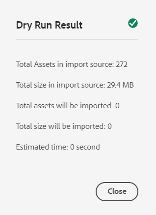

# Adicionar ativos digitais a [!DNL Adobe Experience Manager] como [!DNL Cloud Service] [!DNL Assets] {#add-assets-to-experience-manager}

[!DNL Adobe Experience Manager Assets] aceita vários tipos de ativos digitais de várias fontes. Ele armazena os binários e as representações criadas, pode fazer o processamento de ativos usando vários fluxos de trabalho e serviços do [!DNL Adobe AI], e permite a distribuição por vários canais em muitas superfícies.

O [!DNL Adobe Experience Manager] enriquece o conteúdo binário dos arquivos digitais carregados com metadados avançados, marcas inteligentes, representações e outros serviços de Gerenciamento de Ativos Digitais (DAM). Você pode carregar vários tipos de arquivos, como imagens, documentos e arquivos de imagem raw, de sua pasta local ou de uma unidade de rede para [!DNL Experience Manager Assets].

Além do upload de navegador mais usado, existem outros métodos de adicionar ativos ao repositório [!DNL Experience Manager]. Esses outros métodos incluem clientes desktop, como o Adobe Asset Link ou o aplicativo de desktop [!DNL Experience Manager], scripts de carregamento e assimilação que os clientes criariam e integrações de assimilação automatizadas adicionadas como extensões do [!DNL Experience Manager].

Embora seja possível carregar e gerenciar qualquer arquivo binário no [!DNL Experience Manager], os formatos de arquivo mais usados são compatíveis com serviços adicionais, como extração de metadados ou geração de pré-visualização/representação. Consulte [formatos de arquivo compatíveis](file-format-support.md) para obter detalhes.

Você também pode optar por concluir o processamento adicional nos ativos carregados. Vários perfis de processamento de ativos podem ser configurados na pasta, na qual os ativos são carregados, para adicionar metadados, representações ou serviços de processamento de imagens específicos. Consulte [processar ativos quando carregado](#process-when-uploaded).

[!DNL Assets] forneça os seguintes métodos de carregamento. A Adobe recomenda que você entenda seu caso de uso e a aplicabilidade de uma opção de upload antes de usá-la.

| Método de upload | Quando usar? | Persona principal |
|---------------------|----------------|-----------------|
| [Interface do usuário do Console do Assets](#upload-assets) | Upload ocasional, facilidade de pressionar e arrastar, upload localizador. Não use o para fazer upload de muitos ativos. | Todos os usuários |
| [Carregar API](#upload-using-apis) | Para decisões dinâmicas durante o upload. | Desenvolvedor |
| Aplicativo de desktop do [[!DNL Experience Manager]  ](https://experienceleague.adobe.com/docs/experience-manager-desktop-app/using/using.html) | Assimilação de ativos em baixo volume, mas não para migração. | Administrador, profissional de marketing |
| [[!DNL Adobe Asset Link]](https://helpx.adobe.com/br/enterprise/using/adobe-asset-link.html) | Útil quando profissionais de criação e marketing trabalham em ativos nos aplicativos de desktop [!DNL Creative Cloud] compatíveis. | Creative, Profissional de marketing |
| [Assimilação de ativos em massa](#asset-bulk-ingestor) | Recomendado para migrações em grande escala e assimilações ocasionais em massa. Somente para armazenamentos de dados compatíveis. | Administrador, Desenvolvedor |

## Upload de ativos {#upload-assets}

<!-- #ENGCHECK do we support pausing? I couldn't get pause to show with 1.5GB upload.... If not, this should be removed#

   You can pause the uploading of large assets (greater than 500 MB) and resume it later from the same page. Select the **[!UICONTROL Pause]** icon beside progress bar that appears when an upload starts.

   The size above which an asset is considered a large asset is configurable. For example, you can configure the system to consider assets above 1000 MB (instead of 500 MB) as large assets. In this case, **[!UICONTROL Pause]** appears on the progress bar when assets of size greater than 1000 MB are uploaded.

   The [!UICONTROL Pause] option does not show if a file greater than 1000 MB is uploaded with a file less than 1000 MB. However, if you cancel the less than 1000 MB file upload, the **[!UICONTROL Pause]** option appears.

   To modify the size limit, configure the `chunkUploadMinFileSize` property of the `fileupload` node in the CRX repository.

   When you click the **[!UICONTROL Pause]** icon, it toggles to a **[!UICONTROL Play]** icon. To resume uploading, click **[!UICONTROL Play]** option.
-->

<!-- #ENGCHECK do we support pausing? I couldn't get pause to show with 1.5GB upload.... If not, this should be removed#
   The ability to resume uploading is especially helpful in low-bandwidth scenarios and network glitches, where it takes a long time to upload a large asset. You can pause the upload operation and continue later when the situation improves. When you resume, uploading starts from the point where you paused it.
-->

<!-- #ENGCHECK assuming this is not relevant? remove after confirming#
   During the upload operation, [!DNL Experience Manager] saves the portions of the asset being uploaded as chunks of data in the CRX repository. When the upload completes, [!DNL Experience Manager] consolidates these chunks into a single block of data in the repository.

   To configure the cleanup task for the unfinished chunk upload jobs, go to `https://[aem_server]:[port]/system/console/configMgr/org.apache.sling.servlets.post.impl.helper.ChunkCleanUpTask`.
-->

Para fazer upload de um arquivo (ou de vários arquivos), você pode selecioná-los na área de trabalho e arrastar a interface do usuário (navegador da Web) para a pasta de destino. Como alternativa, você pode iniciar o upload a partir da interface.

>[!IMPORTANT]
>
>O Assets que você carrega na Experience Manager com um nome de arquivo maior que 100 caracteres terá um nome encurtado quando for usado no Dynamic Media.
>
>Os primeiros 100 caracteres no nome do arquivo são usados como estão; todos os caracteres restantes são substituídos por uma sequência alfanumérica. Esse método de renomeação garante um nome exclusivo quando o ativo é usado no Dynamic Media. Também se destina a acomodar o tamanho máximo permitido para o nome do arquivo do ativo no Dynamic Media.


1. Na interface do usuário do [!DNL Assets], navegue até o local em que deseja adicionar ativos digitais.
1. Para fazer upload dos ativos, siga um destes procedimentos:

   * Na barra de ferramentas, clique em **[!UICONTROL Criar]** > **[!UICONTROL Arquivos]**. Você pode renomear o arquivo na caixa de diálogo apresentada, se necessário.
   * Em um navegador compatível com HTML5, arraste os ativos diretamente para a interface do usuário do [!DNL Assets]. A caixa de diálogo para renomear arquivo não é exibida.

   

   Para selecionar vários arquivos, selecione a chave `Ctrl` ou `Command` e selecione os ativos na caixa de diálogo do seletor de arquivos. Ao usar uma iPad, você pode selecionar apenas um arquivo por vez.

1. Para cancelar um carregamento em andamento, clique em fechar (`X`) ao lado da barra de progresso. Quando você cancela a operação de carregamento, o [!DNL Assets] exclui a parte parcialmente carregada do ativo.
Se você cancelar uma operação de carregamento antes que os arquivos sejam carregados, o [!DNL Assets] interromperá o carregamento do arquivo atual e atualizará o conteúdo. No entanto, os arquivos que já foram carregados não são excluídos.

1. A caixa de diálogo de progresso do carregamento em [!DNL Assets] exibe a contagem de arquivos carregados com êxito e os arquivos que falharam no carregamento.
Além disso, a interface de usuário do [!DNL Assets] exibe o ativo mais recente que você carregou para a pasta que você criou primeiro.

>[!NOTE]
>
>Para carregar hierarquias de pastas aninhadas, consulte [carregar ativos em massa](#bulk-upload).

<!-- #ENGCHECK I'm assuming this is no longer relevant.... If yes, this should be removed#

### Serial uploads {#serialuploads}

Uploading numerous assets in bulk consumes significant I/O resources, which may adversely impact the performance of [!DNL Assets]. In particular, if you have a slow internet connection, the time to upload drastically increases due to a spike in disk I/O. Moreover, your web browser may introduce additional restrictions to the number of POST requests [!DNL Assets] can handle for concurrent asset uploads. As a result, the upload operation fails or terminate prematurely. In other words, [!DNL Assets] may miss some files while ingesting a bunch of files or altogether fail to ingest any file.

To overcome this situation, [!DNL Assets] ingests one asset at a time (serial upload) during a bulk upload operation, instead of the concurrently ingesting all the assets.

Serial uploading of assets is enabled by default. To disable the feature and allow concurrent uploading, overlay the `fileupload` node in CRX-DE and set the value of the `parallelUploads` property to `true`.

### Streamed uploads {#streamed-uploads}

If you upload many assets to [!DNL Experience Manager], the I/O requests to server increase drastically, which reduces the upload efficiency and can even cause some upload task to time out. [!DNL Assets] supports streamed uploading of assets. Streamed uploading reduces the disk I/O during the upload operation by avoiding asset storage in a temporary folder on the server before copying it to the repository. Instead, the data is transferred directly to the repository. This way, the time to upload large assets and the possibility of timeouts is reduced. Streamed upload is enabled by default in [!DNL Assets].

>[!NOTE]
>
>Streaming upload is disabled for [!DNL Experience Manager] running on JEE server with servlet-api version lower than 3.1.
-->

### Manuseio de uploads para ativos existentes {#handling-upload-existing-file}

É possível carregar um ativo com o mesmo caminho (mesmo nome e mesmo local) de um ativo existente. No entanto, uma caixa de diálogo de aviso é exibida com as seguintes opções:

* Substituir ativo existente: se você substituir um ativo existente, os metadados do ativo e qualquer modificação anterior (por exemplo, anotações e recorte) feita no ativo existente serão excluídos.

  >[!NOTE]
  >
  >A opção para substituir ativos não estará disponível se o ativo estiver bloqueado ou com check-out.

* Criar outra versão: uma nova versão do ativo existente é criada no repositório. Você pode exibir as duas versões na [!UICONTROL Linha do Tempo] e pode reverter para a versão existente anterior, se necessário.
* Manter ambos: se você optar por manter ambos os ativos, o novo ativo será renomeado.

Para reter o ativo duplicado em [!DNL Assets], clique em **[!UICONTROL Manter]**. Para excluir o ativo duplicado carregado, clique em **[!UICONTROL Excluir]**.

### Manuseio de nome de arquivo e caracteres proibidos {#filename-handling}

[!DNL Experience Manager Assets] impede que você carregue ativos com os caracteres proibidos em seus nomes de arquivo. Se você tentar carregar um ativo com nomes de arquivo contendo um ou mais caracteres não permitidos, o [!DNL Assets] exibirá uma mensagem de aviso e interromperá o carregamento até que você remova esses caracteres ou o carregue com um nome permitido.

Para atender às convenções de nomenclatura de arquivo específicas da sua organização, a caixa de diálogo [!UICONTROL Carregar Assets] permite que você especifique nomes longos para os arquivos carregados. Os seguintes caracteres (lista separada por espaços de) não são suportados:

* Caracteres inválidos para o nome do ativo: `* / : [ \\ ] | # % { } ? &` ou `;=` (um ponto e vírgula seguido por um sinal de igual)
* Caracteres inválidos para o nome da pasta de ativos: `* / : [ \\ ] | # % { } ? \" . ^ ; + & \t`

Exemplos de nomes de arquivo inválidos:

* `JPG_JD_small file ~!)$@;(-_=+^',..jpg`
* `JPG_JD_small file ~!)$@;=(-_+^',..jpg`

## Fazer upload de ativos em massa {#bulk-upload}

A assimilação de ativos em massa pode lidar com muitos ativos com eficiência. No entanto, uma assimilação em grande escala não é apenas um despejo de arquivo amplo ou uma migração casual. Para que uma assimilação em grande escala seja um projeto importante que atenda aos objetivos de sua empresa e seja eficiente, planeje a migração e prepare a organização de ativos. Todas as assimilações são diferentes, portanto, em vez de generalizar, considere a composição do repositório aprimorado e as necessidades de negócios. Veja a seguir algumas sugestões abrangentes para planejar e executar uma assimilação em massa:

* Preparar ativos: remova os ativos que não são necessários no DAM. Considere remover ativos não utilizados, obsoletos ou duplicados. Essa manutenção reduz os dados transferidos e os ativos assimilados, resultando em assimilações mais rápidas.
* Organizar ativos: considere organizar o conteúdo em alguma ordem lógica, por exemplo, por tamanho de arquivo, formato de arquivo, caso de uso ou prioridade. Em geral, arquivos grandes e complexos exigem mais processamento. Você também pode considerar a assimilação de arquivos grandes separadamente usando a opção de filtragem de tamanho de arquivo (descrita abaixo).
* Assimilações escalonadas: considere dividir a assimilação em vários projetos de assimilação em massa. O q permite visualizar o conteúdo mais cedo e atualizar a assimilação conforme necessário. Por exemplo, você pode assimilar ativos com processamento intensivo durante horários que não sejam de pico ou gradualmente em vários blocos. No entanto, você pode assimilar ativos menores e mais simples que não exigem muito processamento de uma só vez.

Para fazer upload de um número maior de arquivos, use uma das abordagens a seguir. Além disso, consulte os [casos de uso e métodos](#upload-methods-comparison)

* [APIs de carregamento de ativos](developer-reference-material-apis.md#asset-upload): use um script ou ferramenta de carregamento personalizado que use APIs para adicionar outras manipulações de ativos (por exemplo, traduzir metadados ou renomear arquivos), se necessário.
* [[!DNL Experience Manager] aplicativo de desktop](https://experienceleague.adobe.com/docs/experience-manager-desktop-app/using/using.html): útil para profissionais criativos e profissionais de marketing que carregam ativos de seu sistema de arquivos local. Use-o para fazer upload de pastas aninhadas disponíveis localmente.
* [Ferramenta de assimilação em massa](#asset-bulk-ingestor): use para assimilação de grandes quantidades de ativos ocasionalmente ou inicialmente ao implantar [!DNL Experience Manager].

### Ferramenta Importação de ativos em massa {#asset-bulk-ingestor}

A ferramenta é fornecida somente para o grupo de administradores para ser usada na assimilação em larga escala de ativos de armazenamentos de dados Azure ou S3. Veja um vídeo que aborda a configuração e a assimilação.

>[!VIDEO](https://video.tv.adobe.com/v/329680/?quality=12&learn=on)

A imagem a seguir ilustra os vários estágios ao assimilar ativos para a Experience Manager de um armazenamento de dados:


**Pré-requisitos**

É necessária uma conta ou bucket de armazenamento externo da Azure ou da AWS para usar esse recurso.

>[!NOTE]
>
>Crie o recipiente ou bucket da conta de armazenamento como particular e aceite conexões somente de solicitações autorizadas. No entanto, não há suporte para restrições adicionais em conexões de rede de entrada.

>[!NOTE]
>
>As contas de armazenamento externo podem ter regras de nome de arquivo/pasta diferentes da ferramenta Importação em massa. Consulte [Manipulando nomes de arquivo durante a importação em massa](#filename-handling-bulkimport) para obter mais detalhes sobre nomes não permitidos/evitados.


### Configurar a ferramenta Importação em massa {#configure-bulk-ingestor-tool}

Para configurar a ferramenta Importação em massa, siga estas etapas:

1. Navegue até **[!UICONTROL Ferramentas]** > **[!UICONTROL Assets]** > **[!UICONTROL Importação em massa]**. Selecione a opção **[!UICONTROL Criar]**.

1. Especifique um título para a configuração de importação em massa no campo **[!UICONTROL Título]**.

1. Selecione o tipo de fonte de dados na lista suspensa **[!UICONTROL Importar Source]**.

1. Forneça os valores para criar uma conexão com a fonte de dados. Por exemplo, se você selecionar **Armazenamento de blobs do Azure** como fonte de dados, especifique os valores para a conta de armazenamento do Azure, o contêiner de blobs do Azure e a chave de acesso do Azure.

1. Selecione o modo de autenticação necessário na lista suspensa. A **Chave de Acesso do Azure** fornece acesso total à conta de armazenamento do Azure, enquanto o **Token SAS do Azure** permite que o administrador limite os recursos do token usando permissões e políticas de expiração.

1. Forneça o nome da pasta raiz que contém ativos na fonte de dados no campo **[!UICONTROL Pasta de origem]**.

1. (Opcional) Forneça o tamanho mínimo de arquivo dos ativos em MB para incluí-los no processo de assimilação no campo **[!UICONTROL Filtrar por tamanho mínimo]**.

1. (Opcional) Forneça o tamanho máximo de arquivo dos ativos em MB para incluí-los no processo de ingestão no campo **[!UICONTROL Filtrar por tamanho máximo]**.

1. (Opcional) Especifique a lista separada por vírgulas de tipos MIME a serem excluídos da assimilação no campo **[!UICONTROL Excluir tipos MIME]**. Por exemplo, `image/jpeg, image/.*, video/mp4`. Consulte [todos os formatos de arquivo com suporte](/help/assets/file-format-support.md).

1. Especifique a lista separada por vírgulas de tipos MIME a serem incluídos na assimilação no campo **[!UICONTROL Incluir tipos MIME]**. Consulte [todos os formatos de arquivo com suporte](/help/assets/file-format-support.md).

1. Selecione a opção **[!UICONTROL Excluir arquivo de origem após a importação]** para excluir os arquivos originais do repositório de dados de origem após os arquivos serem importados para [!DNL Experience Manager].

1. Selecione o **[!UICONTROL Modo de importação]**. Selecione **Ignorar**, **Substituir** ou **Criar versão**. O modo Ignorar é o padrão e, nesse modo, o assimilador ignora para importar um ativo, se ele já existir. Consulte o significado de [substituir e criar opções de versão](#handling-upload-existing-file).

1. Defina um local no DAM onde os ativos devem ser importados usando o campo **[!UICONTROL Pasta de destino do Assets]**. Por exemplo, `/content/dam/imported_assets`.

1. (Opcional) Especifique o arquivo de metadados a ser importado, fornecido em formato CSV no campo **[!UICONTROL Arquivo de metadados]**. Especifique o arquivo CSV no local do blob de origem e consulte o caminho ao configurar a ferramenta Importação em massa. O formato de arquivo CSV referenciado neste campo é igual ao formato de arquivo CSV quando você [Importa e exporta metadados de ativos em massa](https://experienceleague.adobe.com/docs/experience-manager-cloud-service/content/assets/admin/metadata-import-export.html). Se você selecionar a opção **Excluir arquivo de origem após a importação**, filtre arquivos CSV usando os campos **Excluir** ou **Incluir Tipo MIME** ou **Filtrar por Caminho/Arquivo**. Você pode usar uma expressão regular para filtrar arquivos CSV nesses campos.

1. Clique em **[!UICONTROL Salvar]** para salvar a configuração.

### Gerenciar a configuração da ferramenta Importação em massa {#manage-bulk-import-configuration}

Depois de criar a configuração da ferramenta Importação em massa, você pode executar tarefas para avaliar a configuração antes de assimilar ativos em massa na instância do Experience Manager. Para exibir as opções disponíveis para gerenciar a configuração da ferramenta Importação em Massa, selecione a configuração disponível em **[!UICONTROL Ferramentas]** > **[!UICONTROL Assets]** > **[!UICONTROL Importação em Massa]**.

### Editar a configuração {#edit-configuration}

Para editar os detalhes da configuração, selecione a configuração e clique em **[!UICONTROL Editar]**. Não é possível editar o título da configuração e da fonte de dados de importação ao executar a operação de edição.

### Excluir a configuração {#delete-configuration}

Selecione a configuração e clique em **[!UICONTROL Excluir]** para excluir a configuração de importação em massa.

### Validar conexão com a fonte de dados {#validate-connection}

Para validar a conexão com a fonte de dados, selecione a configuração e clique em **[!UICONTROL verificar]**. Se a conexão for bem-sucedida, o Experience Manager exibirá a seguinte mensagem:


### Chamar uma execução de teste para o trabalho de Importação em Massa {#invoke-test-run-bulk-import}

Selecione a configuração e clique em **[!UICONTROL Dry Run]** para invocar uma execução de teste para o trabalho de Importação em Massa. O Experience Manager exibe os seguintes detalhes sobre o trabalho de Importação em massa:



### Tratamento de nomes de arquivo durante a importação em massa {#filename-handling-bulkimport}

Ao importar ativos ou pastas em massa, o [!DNL Experience Manager Assets] importa toda a estrutura existente na fonte de importação. O [!DNL Experience Manager] segue as regras incorporadas para caracteres especiais em nomes de ativos e pastas, portanto, esses nomes de arquivo precisam de limpeza. Tanto o nome da pasta quanto o nome do ativo definidos pelo usuário permanece inalterado e é armazenado em `jcr:title`.

Durante a importação em massa, o [!DNL Experience Manager] procura pelas pastas existentes para evitar a reimportação de ativos e pastas e também verifica as regras de limpeza aplicadas na pasta principal onde a importação ocorre. Se as regras de limpeza forem aplicadas na pasta principal, as mesmas regras serão aplicadas à fonte de importação. Para novas importações, as seguintes regras de limpeza são aplicadas para gerenciar os nomes de arquivo de ativos e pastas.

**Nomes não permitidos na importação em massa**

Os seguintes caracteres não são permitidos em nomes de arquivos e pastas:

* Caracteres de Controle e Uso Privado (0x00 a 0x1F, \u0081, \uE000)
* Nomes de arquivos ou pastas terminando com um ponto (.)

Os arquivos ou pastas com nomes que correspondem a essas condições são ignorados durante o processo de importação e marcados como com falha.

**Manipulando o nome do ativo na importação em massa**

Para nomes de arquivos de ativos, o nome e o caminho do JCR são limpos usando a API: `JcrUtil.escapeIllegalJcrChars`.

* Caracteres Unicode não são alterados
* Substitua os caracteres especiais pelo Código de escape da URL, por exemplo, `new%asset.png` é atualizado para `new%25asset.png`:

  ```
                  URL escape code   
  
  "               %22
  %               %25
  '               %27
  *               %2A
  /               %2F
  :               %3A
  [               %5B
  \n              %0A
  \r              %0D
  \t              %09
  ]               %5D
  |               %7C
  ```

**Manipulando o nome da pasta na importação em massa**

Para nomes de arquivo de pasta, o nome e o caminho do JCR são limpos usando a API: `DamUtil.getSanitizedFolderName`.

* Caracteres em maiúsculas são convertidos em minúsculas
* Caracteres Unicode não são alterados
* Substitua os caracteres especiais por traço (&#39;-&#39;), por exemplo, `new folder` é atualizado para `new-folder`:

  ```
  "                           
  #                         
  %                           
  &                          
  *                           
  +                          
  .                           
  :                           
  ;                          
  ?                          
  [                           
  ]                           
  ^                         
  {                         
  }                         
  |                           
  /         It is used for split folder in cloud storage and is pre-handled, no conversion here.
  \         Not allowed in Azure, allowed in AWS.
  \t
  space     It is the space character.
  ```

<!-- 
[!DNL Experience Manager Assets] manages the forbidden characters in the filenames while you upload assets or folders. [!DNL Experience Manager] updates only the node names in the DAM repository. However, the `title` of the asset or folder remains unchanged.

Following are the file naming conventions that are applied while uploading assets or folders in [!DNL Experience Manager Assets]:

| Characters &Dagger; | When occurring in file names | When occurring in folder names | Example |
|---|---|---|---|
| `. / : [ ] | *` | Replaced with `-` (hyphen). | Replaced with `-` (hyphen). A `.` (dot) in the filename extension is retained as is. | Replaced with `-` (hyphen). | `myimage.jpg` remains as is and `my.image.jpg` changes to `my-image.jpg`. |
| `% ; # , + ? ^ { } "` and whitespaces | Whitespaces are retained | Replaced with `-` (hyphen). | `My Folder.` changes to `my-folder-`. |
| `# % { } ? & .` | Replaced with `-` (hyphen). | NA. | `#My New File.` changes to `-My New File-`. |
| Uppercase characters | Casing is retained as is. | Changed to lowercase characters. | `My New Folder` changes to `my-new-folder`. |
| Lppercase characters | Casing is retained as is. | Casing is retained as is. | NA. |

&Dagger; The list of characters is a whitespace-separated list.
-->

#### Agendar uma importação única ou recorrente em massa {#schedule-bulk-import}

Para agendar uma importação em massa única ou recorrente, execute as seguintes etapas:

1. Criar uma configuração de importação em massa.
1. Selecione a configuração e selecione **[!UICONTROL Agendar]** na barra de ferramentas.
1. Defina uma ingestão única ou agende uma programação por hora, dia ou semana. Clique em **[!UICONTROL Enviar]**.

   


#### Exibir a pasta de destino do Assets {#view-assets-target-folder}

Para exibir o local de destino do Assets em que os ativos são importados após a execução do trabalho de Importação em Massa, selecione a configuração e clique em **[!UICONTROL Exibir Assets]**.

#### Executar a ferramenta Importação em massa {#run-bulk-import-tool}

Depois de [configurar a ferramenta Importação em massa](#configure-bulk-ingestor-tool) e, opcionalmente, [gerenciar a configuração da ferramenta Importação em massa](#manage-bulk-import-configuration), você poderá executar o trabalho de configuração para iniciar a assimilação em massa de ativos.

Para iniciar o processo de Importação em massa, navegue até **[!UICONTROL Ferramentas]** > **[!UICONTROL Assets]** > **[!UICONTROL Importação em massa]**, selecione a [Configuração de Importação em Massa](#configure-bulk-ingestor-tool) e clique em **[!UICONTROL Executar]**. Clique em **[!UICONTROL Executar]** novamente para confirmar.

O Experience Manager atualiza o status do trabalho para **Processando** e para **Com êxito** após a conclusão bem-sucedida do trabalho. Para exibir os ativos importados na Experience Manager, clique em **Exibir Assets**.

Quando o trabalho estiver em andamento, você também poderá selecionar a configuração e clicar em **Parar** para interromper o processo de assimilação em massa. Clique em **Executar** novamente para retomar o processo. Você também pode clicar em **Dry Run** para saber os detalhes dos ativos que ainda têm importação pendente.

#### Gerenciar trabalhos após a execução {#manage-jobs-after-execution}

O Experience Manager permite que você veja o histórico dos trabalhos de importação em massa. O histórico de Jobs compreende o status do job, seu criador, seus logs, juntamente com outros detalhes, como a data e hora de início, data e hora de criação e data e hora de término.

Para acessar o histórico de trabalhos de uma configuração, selecione a configuração e clique em **[!UICONTROL Histórico de Trabalhos]**. Selecione um trabalho e clique em **Abrir**.


O Experience Manager exibe o histórico de tarefas. Na página Histórico do trabalho de Importação em massa, você também pode clicar em **Excluir** para excluir esse trabalho da configuração de Importação em massa.


## Fazer upload de ativos usando clientes de desktop {#upload-assets-desktop-clients}

Além da interface de usuário do navegador da Web, o [!DNL Experience Manager] oferece suporte a outros clientes na área de trabalho. Eles também fornecem experiência de upload sem a necessidade de acessar o navegador da Web.

* [[!DNL Adobe Asset Link]](https://helpx.adobe.com/br/enterprise/using/adobe-asset-link.html) fornece acesso aos ativos do [!DNL Experience Manager] em aplicativos de desktop da Adobe Photoshop, Adobe Illustrator e Adobe InDesign. Você pode carregar o documento aberto no momento no [!DNL Experience Manager] diretamente da interface do usuário do Adobe Asset Link nesses aplicativos de desktop.
* O [[!DNL Experience Manager] aplicativo de desktop](https://experienceleague.adobe.com/docs/experience-manager-desktop-app/using/using.html) simplifica o trabalho com ativos no desktop, independentemente do tipo de arquivo ou aplicativo nativo que os manipula. É útil fazer upload de arquivos em hierarquias de pastas aninhadas a partir do sistema de arquivos local, pois o upload do navegador só suporta o upload de listas de arquivos simples.

## Processar ativos quando carregados {#process-when-uploaded}

Para fazer processamento adicional nos ativos carregados, aplique perfis de processamento nas pastas de upload. Os perfis estão disponíveis na página **[!UICONTROL Propriedades]** de uma pasta em [!DNL Assets]. Um ativo digital sem uma extensão ou com uma extensão incorreta não é processado conforme desejado. Por exemplo, ao fazer upload desses ativos, nada acontece ou um perfil de processamento incorreto pode se aplicar ao ativo. Os usuários ainda podem armazenar os arquivos binários no DAM.


As seguintes guias estão disponíveis:

* [Os perfis de metadados](metadata-profiles.md) permitem aplicar propriedades de metadados padrão a ativos carregados nessa pasta.
* [Processar perfis](asset-microservices-configure-and-use.md) permite gerar mais representações do que o possível por padrão.

Além disso, se [!DNL Dynamic Media] estiver habilitado na implantação, as seguintes guias estarão disponíveis:

* [[!DNL Dynamic Media] Os perfis de imagem](dynamic-media/image-profiles.md) permitem aplicar cortes específicos (**[!UICONTROL Corte inteligente]** e corte de pixels) e configuração de nitidez aos ativos carregados.
* [[!DNL Dynamic Media] Perfis de vídeo](dynamic-media/video-profiles.md) permitem que você aplique perfis de codificação de vídeo específicos (resolução, formato, parâmetros).

>[!NOTE]
>
>O corte [!DNL Dynamic Media] e outras operações nos ativos não são destrutivas, ou seja, as operações não alteram o original carregado. Em vez disso, fornece parâmetros para cortar ou transformar ao entregar os ativos.

Para pastas que têm um perfil de processamento atribuído, o nome do perfil aparece na miniatura na exibição de cartão. Na exibição de lista, o nome do perfil aparece na coluna **[!UICONTROL Processando Perfil]**.

## Fazer upload ou assimilar ativos usando APIs {#upload-using-apis}

Os detalhes técnicos das APIs e do protocolo de carregamento, bem como os links para SDK de código aberto e clientes de exemplo, são fornecidos na seção [carregamento de ativos](developer-reference-material-apis.md#asset-upload) da referência do desenvolvedor.

## Dicas, práticas recomendadas e limitações {#tips-limitations}

* O upload binário direto é um novo método para fazer upload de ativos. Por padrão, ela tem suporte nos recursos e clientes do produto, como a interface de usuário do [!DNL Experience Manager], o [!DNL Adobe Asset Link] e o aplicativo de desktop do [!DNL Experience Manager]. Qualquer código personalizado personalizado personalizado ou estendido pelas equipes técnicas dos clientes deve usar as novas APIs de upload e os protocolos.

* [!DNL Experience Manager Assets] agora oferece suporte a pastas que contêm grandes números de ativos secundários. Quando uma pasta contém mais de 1000 filhos diretos (ativos ou subpastas), a interface do usuário do administrador usa um índice atualizado de forma assíncrona para listar o conteúdo da pasta. Dessa forma, pode haver um pequeno atraso na visibilidade de pastas e ativos recém-criados (geralmente apenas alguns segundos) e, ao abri-los na Exibição do administrador, um banner será mostrado para notificar os usuários finais sobre esse comportamento, informando o seguinte: &quot;Esse diretório contém mais de 1000 itens. Os uploads e as novas criações de pasta podem ser adiadas.&quot;

* Ao selecionar **[!UICONTROL Substituir]** na caixa de diálogo [!UICONTROL Conflito de Nome], a ID do ativo é gerada novamente para o novo ativo. Essa ID é diferente da ID do ativo anterior. Se o [Assets Insights](/help/assets/assets-insights.md) estiver habilitado para rastrear impressões ou cliques com [!DNL Adobe Analytics], a ID de ativo regenerada invalida os dados capturados para o ativo em [!DNL Analytics].

* Alguns métodos de carregamento não impedem que você carregue ativos com [caracteres proibidos](#filename-handling) nos nomes de arquivo. Os caracteres são substituídos pelo símbolo `-`.

* Fazer upload de ativos usando o navegador só oferece suporte a listas de arquivos simples e não a hierarquias de pastas aninhadas. Para carregar todos os ativos dentro de uma pasta aninhada, considere usar o [aplicativo de desktop](#upload-assets-desktop-clients).

* O método de importação em massa importa toda a estrutura de pastas como ela existe na fonte de dados. No entanto, somente as pastas não vazias são criadas em [!DNL Experience Manager].


<!-- TBD: Link to file name handling in DA docs when it is documented. 
-->

**Consulte também**

* [Traduzir ativos](translate-assets.md)
* [API HTTP de ativos](mac-api-assets.md)
* [Formatos de arquivo compatíveis com os ativos](file-format-support.md)
* [Pesquisar ativos](search-assets.md)
* [Ativos conectados](use-assets-across-connected-assets-instances.md)
* [Relatórios de ativos](asset-reports.md)
* [Esquemas de metadados](metadata-schemas.md)
* [Baixar ativos](download-assets-from-aem.md)
* [Gerenciar metadados](manage-metadata.md)
* [Pesquisar aspectos](search-facets.md)
* [Gerenciar coleções](manage-collections.md)
* [Importação de metadados em massa](metadata-import-export.md)
* [Publicar o Assets no AEM e no Dynamic Media](/help/assets/publish-assets-to-aem-and-dm.md)

>[!MORELIKETHIS]
>
>* Aplicativo de desktop do [[!DNL Adobe Experience Manager]  ](https://experienceleague.adobe.com/docs/experience-manager-desktop-app/using/introduction.html?lang=pt-BR)
>* [Sobre [!DNL Adobe Asset Link]](https://www.adobe.com/br/creativecloud/business/enterprise/adobe-asset-link.html)
>* [[!DNL Adobe Asset Link] documentação](https://helpx.adobe.com/br/enterprise/using/adobe-asset-link.html)
>* [Referência técnica para o carregamento do ativo](developer-reference-material-apis.md#asset-upload)
