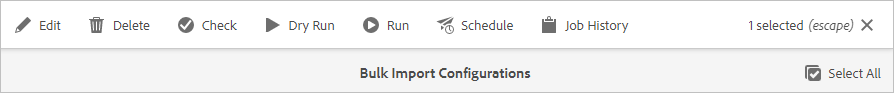

# Adicionar ativos digitais a [!DNL Adobe Experience Manager] como [!DNL Cloud Service] [!DNL Assets] {#add-assets-to-experience-manager}

[!DNL Adobe Experience Manager Assets] O aceita vários tipos de ativos digitais de várias fontes. Ele armazena os binários e as representações criadas, pode fazer o processamento de ativos usando uma variedade de workflows e serviços [!DNL Adobe Sensei], permite a distribuição por vários canais em várias superfícies.

[!DNL Adobe Experience Manager] enriquece o conteúdo binário dos arquivos digitais carregados com metadados ricos, tags inteligentes, representações e outros serviços de Gerenciamento de ativos digitais (DAM). Você pode fazer upload de vários tipos de arquivos, como imagens, documentos e arquivos de imagem brutos, da pasta local ou de uma unidade de rede para [!DNL Experience Manager Assets].

Além do upload do navegador mais usado, existem outros métodos de adicionar ativos ao repositório [!DNL Experience Manager], incluindo clientes de desktop, como o Adobe Asset Link ou [!DNL Experience Manager] aplicativo de desktop, scripts de upload e assimilação que os clientes criariam e integrações de assimilação automatizadas adicionadas como extensões [!DNL Experience Manager].

Embora você possa fazer upload e gerenciar qualquer arquivo binário em [!DNL Experience Manager], os formatos de arquivo mais usados têm suporte para serviços adicionais, como extração de metadados ou geração de visualização/representação. Consulte [formatos de arquivo suportados](file-format-support.md) para obter detalhes.

Você também pode optar por realizar processamento adicional nos ativos carregados. Vários perfis de processamento de ativos podem ser configurados na pasta, na qual os ativos são carregados, para adicionar metadados, representações ou serviços de processamento de imagens específicos. Consulte [processar ativos quando carregado](#process-when-uploaded).

[!DNL Assets] O fornece os seguintes métodos de upload. O Adobe recomenda compreender o caso de uso e a aplicabilidade de uma opção de upload antes de usá-la.

| Método de upload | Quando usar? | Persona Primária |
|---------------------|----------------|-----------------|
| [Interface do usuário do console Assets](#upload-assets) | Carregamento ocasional, facilidade de pressionar e arrastar, carregamento mais rápido. Não use o para fazer upload de um grande número de ativos. | Todos os usuários |
| [Upload da API](#upload-using-apis) | Para decisões dinâmicas durante o upload. | Desenvolvedor |
| Aplicativo de desktop do [[!DNL Experience Manager]  ](https://experienceleague.adobe.com/docs/experience-manager-desktop-app/using/using.html) | Assimilação de ativos de baixo volume, mas não para migração. | Administrador, profissional de marketing |
| [[!DNL Adobe Asset Link]](https://helpx.adobe.com/enterprise/admin-guide.html/enterprise/using/adobe-asset-link.ug.html) | Útil quando criativos e profissionais de marketing trabalham em ativos nos aplicativos de desktop [!DNL Creative Cloud] compatíveis. | Criativo, profissional de marketing |
| [Gestor em massa de ativos](#asset-bulk-ingestor) | Recomendado para migrações em larga escala e ingestões ocasionais em massa. Somente para armazenamentos de dados compatíveis. | Administrador, Desenvolvedor |

## Fazer upload de ativos {#upload-assets}

<!-- #ENGCHECK do we support pausing? I couldn't get pause to show with 1.5GB upload.... If not, this should be removed#

   You can pause the uploading of large assets (greater than 500 MB) and resume it later from the same page. Tap the **[!UICONTROL Pause]** icon beside progress bar that appears when an upload starts.

   The size above which an asset is considered a large asset is configurable. For example, you can configure the system to consider assets above 1000 MB (instead of 500 MB) as large assets. In this case, **[!UICONTROL Pause]** appears on the progress bar when assets of size greater than 1000 MB are uploaded.

   The [!UICONTROL Pause] option does not show if a file greater than 1000 MB is uploaded with a file less than 1000 MB. However, if you cancel the less than 1000 MB file upload, the **[!UICONTROL Pause]** option appears.

   To modify the size limit, configure the `chunkUploadMinFileSize` property of the `fileupload` node in the CRX repository.

   When you click the **[!UICONTROL Pause]** icon, it toggles to a **[!UICONTROL Play]** icon. To resume uploading, click **[!UICONTROL Play]** option.
-->

<!-- #ENGCHECK do we support pausing? I couldn't get pause to show with 1.5GB upload.... If not, this should be removed#
   The ability to resume uploading is especially helpful in low-bandwidth scenarios and network glitches, where it takes a long time to upload a large asset. You can pause the upload operation and continue later when the situation improves. When you resume, uploading starts from the point where you paused it.
-->

<!-- #ENGCHECK assuming this is not relevant? remove after confirming#
   During the upload operation, [!DNL Experience Manager] saves the portions of the asset being uploaded as chunks of data in the CRX repository. When the upload completes, [!DNL Experience Manager] consolidates these chunks into a single block of data in the repository.

   To configure the cleanup task for the unfinished chunk upload jobs, go to `https://[aem_server]:[port]/system/console/configMgr/org.apache.sling.servlets.post.impl.helper.ChunkCleanUpTask`.
-->

Para carregar um arquivo (ou vários arquivos), você pode selecioná-los na área de trabalho e arrastar a interface do usuário (navegador da Web) para a pasta de destino. Como alternativa, você pode iniciar o upload a partir da interface do usuário do .

1. Na interface do usuário [!DNL Assets], navegue até o local onde deseja adicionar ativos digitais.
1. Para fazer upload dos ativos, siga um destes procedimentos:

   * Na barra de ferramentas, clique em **[!UICONTROL Create]** > **[!UICONTROL Files]**. Você pode renomear o arquivo na caixa de diálogo apresentada, se necessário.
   * Em um navegador compatível com HTML5, arraste os ativos diretamente na interface do usuário [!DNL Assets]. A caixa de diálogo para renomear arquivo não é exibida.

   

   Para selecionar vários arquivos, selecione a tecla `Ctrl` ou `Command` e selecione os ativos na caixa de diálogo do seletor de arquivos. Ao usar um iPad, você pode selecionar apenas um arquivo de cada vez.

1. Para cancelar um upload em andamento, clique em fechar (`X`) ao lado da barra de progresso. Ao cancelar a operação de upload, [!DNL Assets] exclui a parte parcialmente carregada do ativo.
Se você cancelar uma operação de upload antes que os arquivos sejam carregados, [!DNL Assets] interrompe o upload do arquivo atual e atualiza o conteúdo. No entanto, os arquivos que já foram carregados não são excluídos.

1. A caixa de diálogo andamento do upload em [!DNL Assets] exibe a contagem de arquivos carregados com êxito e os arquivos que não foram carregados.
Além disso, a interface do usuário [!DNL Assets] exibe o ativo mais recente que você fez upload ou a pasta que você criou primeiro.

>[!NOTE]
>
>Para fazer upload de hierarquias de pastas aninhadas, consulte [fazer upload em massa de ativos](#bulk-upload).

<!-- #ENGCHECK I'm assuming this is no longer relevant.... If yes, this should be removed#

### Serial uploads {#serialuploads}

Uploading numerous assets in bulk consumes significant I/O resources, which may adversely impact the performance of [!DNL Assets]. In particular, if you have a slow internet connection, the time to upload drastically increases due to a spike in disk I/O. Moreover, your web browser may introduce additional restrictions to the number of POST requests [!DNL Assets] can handle for concurrent asset uploads. As a result, the upload operation fails or terminate prematurely. In other words, [!DNL Assets] may miss some files while ingesting a bunch of files or altogether fail to ingest any file.

To overcome this situation, [!DNL Assets] ingests one asset at a time (serial upload) during a bulk upload operation, instead of the concurrently ingesting all the assets.

Serial uploading of assets is enabled by default. To disable the feature and allow concurrent uploading, overlay the `fileupload` node in CRX-DE and set the value of the `parallelUploads` property to `true`.

### Streamed uploads {#streamed-uploads}

If you upload many assets to [!DNL Experience Manager], the I/O requests to server increase drastically, which reduces the upload efficiency and can even cause some upload task to time out. [!DNL Assets] supports streamed uploading of assets. Streamed uploading reduces the disk I/O during the upload operation by avoiding asset storage in a temporary folder on the server before copying it to the repository. Instead, the data is transferred directly to the repository. This way, the time to upload large assets and the possibility of timeouts is reduced. Streamed upload is enabled by default in [!DNL Assets].

>[!NOTE]
>
>Streaming upload is disabled for [!DNL Experience Manager] running on JEE server with servlet-api version lower than 3.1.
-->

### Lidar com uploads quando o ativo já existe {#handling-upload-existing-file}

É possível fazer upload de um ativo com o mesmo caminho (mesmo nome e mesmo local) de um ativo existente. No entanto, uma caixa de diálogo de aviso é exibida com as seguintes opções:

* Substituir ativo existente: Se você substituir um ativo existente, os metadados do ativo e quaisquer modificações anteriores (por exemplo, anotações, corte e assim por diante) feitas no ativo existente serão excluídos.
* Criar outra versão: Uma nova versão do ativo existente é criada no repositório. Você pode exibir as duas versões na [!UICONTROL Linha do tempo] e pode reverter para a versão existente anteriormente, se necessário.
* Mantenha ambos: Se você optar por manter ambos os ativos, o novo ativo será renomeado.

Para reter o ativo duplicado em [!DNL Assets], clique em **[!UICONTROL Keep]**. Para excluir o ativo duplicado carregado, clique em **[!UICONTROL Excluir]**.

### Tratamento do nome do arquivo e caracteres proibidos {#filename-handling}

[!DNL Experience Manager Assets] O tenta impedir que você carregue ativos com os caracteres proibidos em seus nomes de arquivo. Se você tentar fazer upload de um ativo com nome de arquivo contendo um caractere não permitido ou mais, [!DNL Assets] exibirá uma mensagem de aviso e interromperá o upload até que você remova esses caracteres ou faça upload com um nome permitido.

Para se adequar às convenções específicas de nomenclatura de arquivos para sua organização, a caixa de diálogo [!UICONTROL Fazer upload de ativos] permite especificar nomes longos para os arquivos carregados. Os seguintes caracteres (lista separada por espaços de) não são suportados:

* caracteres inválidos para o nome do arquivo de ativo `* / : [ \\ ] | # % { } ? &`
* caracteres inválidos para o nome da pasta de ativos `* / : [ \\ ] | # % { } ? \" . ^ ; + & \t`

## Fazer upload em massa de ativos {#bulk-upload}

O criador de ativos em massa pode lidar com um grande número de ativos com eficiência. No entanto, uma assimilação em grande escala não é apenas um despejo de arquivo amplo ou uma migração casual. Para que uma assimilação em grande escala seja um projeto significativo que atende ao seu objetivo comercial e seja eficiente, planeje a migração e prepare a organização de ativos. Todas as sugestões são diferentes, portanto, em vez de generalizar, fator na composição de repositório e nas necessidades comerciais avançadas. Veja a seguir algumas sugestões abrangentes para planejar e executar uma assimilação em massa:

* Preparar ativos: Remova ativos que não são necessários no DAM. Considere remover ativos não utilizados, obsoletos ou duplicados. Isso reduz os dados transferidos e os ativos assimilados, levando a ingestões mais rápidas.
* Organizar ativos: Considere organizar o conteúdo em alguma ordem lógica, por exemplo, por tamanho de arquivo, formato de arquivo, caso de uso ou prioridade. Em geral, arquivos complexos grandes exigem mais processamento. Você também pode considerar a assimilação de arquivos grandes separadamente usando a opção de filtragem do tamanho do arquivo (descrita abaixo).
* Gestões do Marcador: Considere dividir a assimilação em vários projetos de assimilação em massa. Isso permite que você veja o conteúdo antes e atualize a assimilação conforme necessário. Por exemplo, você pode assimilar ativos com processamento intensivo durante horas que não sejam de pico ou gradualmente em várias partes. No entanto, é possível assimilar ativos menores e mais simples que não exigem muito processamento de uma só vez.

Para fazer upload de um número maior de arquivos, use uma das abordagens a seguir. Além disso, consulte os [casos de uso e métodos](#upload-methods-comparison)

* [APIs](developer-reference-material-apis.md#asset-upload) de upload de ativos: Use um script de carregamento personalizado ou uma ferramenta que aproveite as APIs para adicionar manuseio adicional de ativos (por exemplo, traduzir metadados ou renomear arquivos), se necessário.
* [[!DNL Experience Manager] aplicativo](https://experienceleague.adobe.com/docs/experience-manager-desktop-app/using/using.html) de desktop: Útil para profissionais criativos e profissionais de marketing que fazem upload de ativos de seu sistema de arquivos local. Use-o para fazer upload de pastas aninhadas disponíveis localmente.
* [Ferramenta](#asset-bulk-ingestor) de assimilação em massa: Use para assimilação de grandes quantidades de ativos ocasionalmente ou inicialmente durante a implantação  [!DNL Experience Manager].

### Ferramenta de assimilação em massa de ativos {#asset-bulk-ingestor}

A ferramenta é fornecida somente ao grupo de administradores para usar na assimilação em grande escala de ativos dos armazenamentos de dados do Azure ou S3. Assista a uma apresentação em vídeo da configuração e ingestão.

>[!VIDEO](https://video.tv.adobe.com/v/329680/?quality=12&learn=on)

Para configurar a ferramenta, siga estas etapas:

1. Navegue até **[!UICONTROL Ferramentas]** > **[!UICONTROL Ativos]** > **[!UICONTROL Importação em massa]**. Selecione a opção **[!UICONTROL Create]**.

1. Na página [!UICONTROL configuração de importação em massa], forneça os valores necessários.

   * [!UICONTROL Título]: Um título descritivo.
   * [!UICONTROL Fonte] de importação: Selecione a fonte de dados aplicável.
   * [!UICONTROL Filtrar por tamanho] mínimo: Forneça o tamanho mínimo de arquivo dos ativos em MB.
   * [!UICONTROL Filtrar por tamanho] máximo: Forneça o tamanho máximo de arquivo dos ativos em MB.
   * [!UICONTROL Excluir tipos] Mime: Lista separada por vírgulas de tipos MIME a serem excluídos da assimilação. Por exemplo, `image/jpeg, image/.*, video/mp4`.
   * [!UICONTROL Incluir tipos] Mime: Lista de tipos MIME separada por vírgulas para incluir na assimilação. Consulte [todos os formatos de arquivo compatíveis](/help/assets/file-format-support.md).
   * [!UICONTROL Modo] de importação: Selecione Ignorar, Substituir ou Criar Versão. O modo Ignorar é o padrão e, nesse modo, o assimilador ignora para importar um ativo se ele já existir. Veja o significado de [substituir e criar opções de versão](#handling-upload-existing-file).
   * [!UICONTROL Pasta] do Target de ativos: Importe a pasta no DAM, onde os ativos devem ser importados. Por exemplo, `/content/dam/imported_assets`

1. Você pode excluir, modificar, executar e fazer mais com as configurações de ingresso criadas. Quando você seleciona uma configuração de assimilador de importação em massa, a seguinte opção está disponível na barra de ferramentas.

   * [!UICONTROL Editar]: Edite a configuração selecionada.
   * [!UICONTROL Excluir]: Excluir a configuração selecionada.
   * [!UICONTROL Verificar]: Valide a conexão com o armazenamento de dados.
   * [!UICONTROL Execução] prática: Chame uma execução de teste da ingestão em massa.
   * [!UICONTROL Executar]: Executar a configuração selecionada.
   * [!UICONTROL Parar]: Encerrar uma configuração ativa.
   * [!UICONTROL Programação]: Defina um agendamento único ou recorrente para assimilar ativos.
   * [!UICONTROL Status] da Tarefa: Exibir o status da configuração quando ela for usada em um trabalho de importação em andamento ou em um trabalho concluído.
   * [!UICONTROL Histórico] de tarefas: Instâncias anteriores da tarefa.
   * [!UICONTROL Exibir ativos]: Exiba a pasta de destino, se ela existir.

   

Para agendar uma importação em massa única ou recorrente, siga estas etapas:

1. Criar uma configuração de importação em massa.
1. Selecione a configuração e selecione **[!UICONTROL Schedule]** na barra de ferramentas.
1. Defina uma ingestão única ou programe uma hora, uma diária ou uma programação semanal. Clique em **[!UICONTROL Enviar]**.

   

## Fazer upload de ativos usando clientes do desktop {#upload-assets-desktop-clients}

Além da interface do usuário do navegador da Web, [!DNL Experience Manager] suporta outros clientes no desktop. Eles também fornecem experiência de upload sem a necessidade de acessar o navegador da Web.

* [[!DNL Adobe Asset Link]](https://helpx.adobe.com/br/enterprise/using/adobe-asset-link.html) fornece acesso a ativos  [!DNL Experience Manager] no Adobe Photoshop, Adobe Illustrator e aplicativos de desktop do Adobe InDesign. Você pode fazer upload do documento aberto no momento para [!DNL Experience Manager] diretamente da interface do usuário do Adobe Asset Link nesses aplicativos de desktop.
* [[!DNL Experience Manager] os ](https://experienceleague.adobe.com/docs/experience-manager-desktop-app/using/using.html) aplicativos de desktop simplificam o trabalho com ativos no desktop, independentemente do tipo de arquivo ou do aplicativo nativo que os manipula. É particularmente útil fazer upload de arquivos nas hierarquias de pastas aninhadas do seu sistema de arquivos local, pois o upload do navegador suporta apenas o upload de listas de arquivos simples.

## Processar ativos ao fazer upload {#process-when-uploaded}

Para fazer processamento adicional nos ativos carregados, você pode aplicar perfis de processamento nas pastas de upload. Os perfis estão disponíveis na página **[!UICONTROL Propriedades]** de uma pasta em [!DNL Assets]. Um ativo digital sem uma extensão ou com uma extensão incorreta não é processado conforme desejado. Por exemplo, ao fazer upload desses ativos, nada acontece ou um perfil de processamento incorreto pode se aplicar ao ativo. Os usuários ainda podem armazenar os arquivos binários no DAM.

As seguintes guias estão disponíveis:

* [Os ](metadata-profiles.md) perfis de metadados permitem aplicar propriedades de metadados padrão a ativos carregados nessa pasta.
* [O processamento de ](asset-microservices-configure-and-use.md) perfis permite gerar mais representações do que as possíveis por padrão.

Além disso, se [!DNL Dynamic Media] estiver ativado na implantação, as seguintes guias estarão disponíveis:

* [[!DNL Dynamic Media] Os ](dynamic-media/image-profiles.md) perfis de imagem permitem aplicar cortes específicos (**[!UICONTROL Corte]** inteligente e corte de pixels) e configuração de nitidez aos ativos carregados.
* [[!DNL Dynamic Media] Os ](dynamic-media/video-profiles.md) perfis de vídeo permitem aplicar perfis de codificação de vídeo específicos (resolução, formato, parâmetros).

>[!NOTE]
>
>[!DNL Dynamic Media] o corte e outras operações em ativos são não destrutivas, ou seja, as operações não alteram o original carregado. Em vez disso, fornece parâmetros para cortar ou transformar ao entregar os ativos.

Para pastas que têm um perfil de processamento atribuído, o nome do perfil aparece na miniatura na exibição de cartão. Na exibição de lista, o nome do perfil aparece na coluna **[!UICONTROL Perfil de processamento]**.

## Fazer upload ou assimilar ativos usando APIs {#upload-using-apis}

Detalhes técnicos das APIs e protocolo de upload, além de links para o SDK de código aberto e clientes de exemplo, são fornecidos na seção [upload de ativos](developer-reference-material-apis.md#asset-upload) da referência do desenvolvedor.

## Dicas, práticas recomendadas e limitações {#tips-limitations}

* O upload binário direto é um novo método para fazer upload de ativos. Por padrão, ele é compatível com os recursos e clientes do produto, como a [!DNL Experience Manager] interface do usuário, [!DNL Adobe Asset Link] e [!DNL Experience Manager] aplicativo de desktop. Qualquer código personalizado personalizado ou estendido pelas equipes técnicas do cliente deve usar as novas APIs e protocolos de upload.

* O Adobe recomenda adicionar até 1000 ativos em cada pasta em [!DNL Experience Manager Assets]. Embora seja possível adicionar mais ativos a uma pasta, é possível que você tenha problemas de desempenho, como navegação mais lenta para essas pastas.

* Quando você seleciona **[!UICONTROL Substituir]** na caixa de diálogo [!UICONTROL Nomear conflito], a ID do ativo é regenerada para o novo ativo. Essa ID é diferente da ID do ativo anterior. Se o [Assets Insights](/help/assets/assets-insights.md) estiver ativado para rastrear impressões ou cliques com [!DNL Adobe Analytics], a ID de ativo regenerada invalida os dados capturados para o ativo em [!DNL Analytics].

* Alguns métodos de upload não impedem o upload de ativos com [caracteres proibidos](#filename-handling) nos nomes de arquivo. Os caracteres são substituídos pelo símbolo `-`.

* O upload de ativos usando o navegador só oferece suporte a listas de arquivos simples e não a hierarquias de pastas aninhadas. Para fazer upload de todos os ativos dentro da pasta aninhada, considere usar [aplicativo de desktop](#upload-assets-desktop-clients).

<!-- TBD: Link to file name handling in DA docs when it is documented. 
-->

>[!MORELIKETHIS]
>
>* Aplicativo de desktop do [[!DNL Adobe Experience Manager]  ](https://experienceleague.adobe.com/docs/experience-manager-desktop-app/using/introduction.html)
>* [Sobre [!DNL Adobe Asset Link]](https://www.adobe.com/br/creativecloud/business/enterprise/adobe-asset-link.html)
>* [[!DNL Adobe Asset Link] documentação](https://helpx.adobe.com/enterprise/using/adobe-asset-link.html)
>* [Referência técnica para upload de ativos](developer-reference-material-apis.md#asset-upload)

