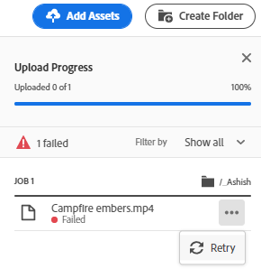

# Fazer upload de ativos {#add-assets}

Para adicionar novos ativos para trabalhar, faça upload de alguns ativos do seu sistema de arquivos local. <!-- TBD: Many of the [common file formats are supported](/help/assets/supported-file-formats-assets-view.md). -->

Você pode usar os seguintes métodos para fazer upload de um ou mais ativos ou de uma pasta que contém ativos:

* Arraste ativos ou pastas na interface e siga as instruções na tela.
* Clique em **[!UICONTROL Adicionar ativos]** na barra de ferramentas e adicione alguns arquivos à caixa de diálogo de upload.

<!-- TBD: Update this GIF
 -->

Você pode usar qualquer um desses métodos para fazer upload de ativos após criar uma pasta. Para criar uma pasta vazia, clique em **[!UICONTROL Criar pasta]** na barra de ferramentas. O [!DNL Assets view] oferece uma eficiente funcionalidade de pesquisa de texto completo, mas você também pode usar pastas para organizar melhor seus ativos.

Depois de selecionar os arquivos, você verá uma caixa de diálogo de confirmação para adicionar mais arquivos ou remover arquivos já selecionados. Para adicionar mais arquivos a uma seleção, clique em **[!UICONTROL Procurar]** e selecione **[!UICONTROL Procurar arquivos]** ou **[!UICONTROL Procurar pastas]**. Adicione mais arquivos ou pastas da mesma pasta ou de uma diferente.

Depois que todos os arquivos forem enfileirados, clique em **[!UICONTROL Fazer upload]**.

*Figura: antes de fazer upload dos ativos selecionados, é possível adicionar ou remover ativos da fila.*

>[!TIP]
>
>Caso faça upload de uma estrutura de pastas para a visualização de Ativos, não será necessário criar um arquivo .ZIP com a estrutura de pastas. Você poderá fazer upload das estruturas de pastas diretamente. Um arquivo .ZIP carregado na visualização Ativos é armazenado como um ativo ZIP e não é extraído automaticamente após o upload.

## Visualizar o progresso e o status do upload {#upload-progress}

Ao fazer upload de muitos ativos ou pastas aninhadas para o [!DNL Assets view], alguns ativos podem deixar de ser carregados por vários motivos, como ativos duplicados e problemas de rede.

Para acompanhar o progresso do upload, clique em **[!UICONTROL Progresso do upload]** na barra de ferramentas. Um painel exibirá o progresso do upload de todos os ativos.

Para exibir um subconjunto de ativos com base no progresso ou status do upload, use o filtro na barra lateral **[!UICONTROL Progresso do upload]**. Os vários filtros permitem exibir todos os ativos, uploads concluídos, uploads em andamento, ativos enfileirados para upload, uploads pausados, ativos duplicados e ativos que falharam no upload.

*Figura: filtre os ativos da fila de upload com base no status ou progresso do upload.*

Assim que o upload dos ativos é concluído, o [!DNL Assets view] processa os ativos para gerar miniaturas e processar metadados. Para muitos ativos, o processamento leva algum tempo. Se não vir uma miniatura e uma mensagem de processamento for exibida na miniatura do espaço reservado, verifique a pasta novamente após alguns minutos. Durante o processamento, entre outras coisas, o [!DNL Assets view] gera as representações, adiciona tags inteligentes e indexa os detalhes do ativo para pesquisa.

*Figura: os ativos carregados exibem o processamento no bloco que são processados.*

## Representações de ativos {#renditions}

O [!DNL Assets view] processa os ativos carregados em tempo quase real e gera representações para muitos tipos de arquivos compatíveis. Criadas para imagens, as representações são versões redimensionadas da imagem carregada. Você pode baixar não apenas o ativo, mas também as representações para usar uma versão apropriada. É possível visualizar todas as representações de um ativo ao [pré-visualizar um ativo](/help/assets/navigate-assets-view.md#preview-assets).

*Figura: visualize e baixe as representações.*

## Gerenciar uploads com falha {#resolve-upload-fails}

Se o upload de um ativo compatível falhar por algum motivo, clique em **[!UICONTROL Tentar novamente]** no painel [!UICONTROL Progresso do upload].

*Figura: tente novamente se um arquivo compatível não for carregado por algum motivo.*

Se você tentar fazer upload de ativos duplicados, os ativos não serão carregados até que você confirme explicitamente o upload. No início, os ativos duplicados são marcados como uploads com falha. Para resolver, basta criar uma versão, excluir e substituir os ativos existentes ou criar uma cópia duplicada renomeando o ativo. Você pode resolver uma falha de ativo de cada vez ou fazer isso em massa para todas as duplicatas com falha de uma só vez.

*Figura: para ativos duplicados que não são carregados por padrão, resolva o problema um ativo de cada vez.*

*Figura: para ativos duplicados que não são carregados por padrão, resolva os problemas de todos os ativos de uma só vez.*

>[!TIP]
>
>Você pode fazer upload de ativos para o repositório DAM diretamente de dentro do [!DNL Creative Cloud] aplicativos de desktop.
<!--TBD
See how [[!DNL Assets view] integrates with [!DNL Adobe Asset Link]](/help/assets/integration-assets-view.md).
-->

## Excluir ativos ou pastas {#delete-assets}

Os usuários podem excluir ativos ou pastas individuais que não são mais necessários. Para excluir um ativo ou uma pasta, siga um destes procedimentos:

* Use a opção disponível na miniatura de um ativo ou de uma pasta.

  

  *Figura: as ações para arquivos e pastas estão disponíveis no ativo ou no bloco de pastas.*

* Selecione um ativo ou uma pasta e clique em **[!UICONTROL Excluir]**  na barra de ferramentas.

## Próximas etapas {#next-steps}

* [Assista a um vídeo sobre upload de ativos na visualização de Ativos](https://experienceleague.adobe.com/docs/experience-manager-learn/assets-essentials/basics/creating.html?lang=pt-BR)

* Forneça feedback sobre o produto usando a opção [!UICONTROL Feedback] disponível na interface de visualização do Assets

* Forneça feedback sobre a documentação usando as opções [!UICONTROL Editar esta página]  ou [!UICONTROL Registrar um problema]  disponíveis na barra lateral direita

* Entre em contato com o [Atendimento ao cliente](https://experienceleague.adobe.com/?support-solution=General&amp;lang=pt-BR#support)
