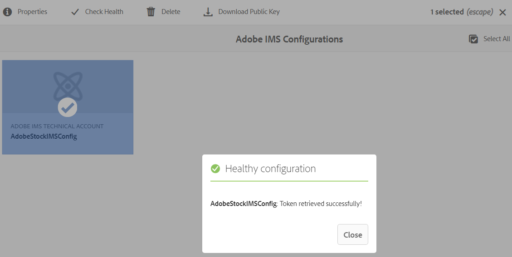
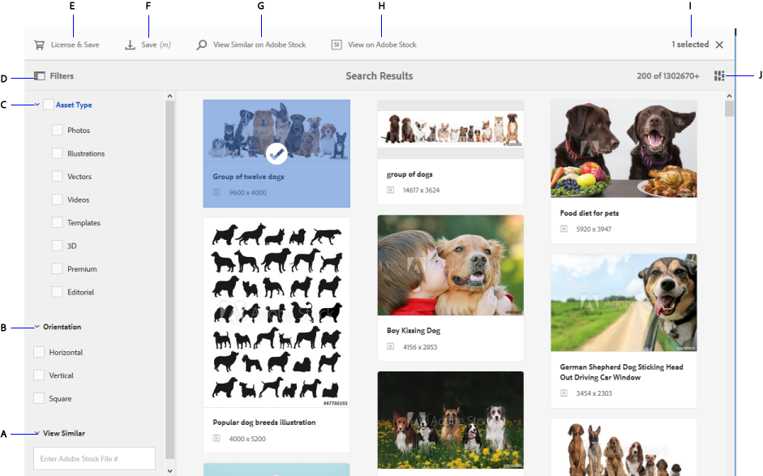

# Uso [!DNL Adobe Stock] ativos no [!DNL Adobe Experience Manager Assets] {#use-adobe-stock-assets-in-aem-assets}

| Versão | Link do artigo |
| -------- | ---------------------------- |
| AEM 6.5 | [Clique aqui](https://experienceleague.adobe.com/docs/experience-manager-65/assets/using/aem-assets-adobe-stock.html?lang=en) |
| AEM as a Cloud Service | Este artigo |

[!DNL Adobe Stock] serviço de fornece aos designers e empresas acesso a milhões de fotos, vetores, ilustrações, vídeos, modelos e ativos 3D de alta qualidade, com curadoria e isentos de royalties para todos os seus projetos criativos.

[!DNL Adobe Stock] A oferta para corporações, por padrão, inclui direitos de compartilhamento em toda a organização. Depois que um ativo é licenciado por um usuário da organização, outros usuários da organização podem identificar, baixar e usar esse ativo sem precisar licenciá-lo novamente. Depois que um ativo é licenciado pela sua organização, o direito de usá-lo é perpétuo.

As empresas podem integrar seus [!DNL Adobe Stock] planejar com [!DNL Experience Manager Assets] para garantir que os ativos licenciados estejam amplamente disponíveis para seus projetos criativos e de marketing, com os poderosos recursos de gerenciamento de ativos do [!DNL Experience Manager]. [!DNL Experience Manager] Os usuários do podem encontrar, visualizar e licenciar rapidamente os ativos do Adobe Stock que são salvos na [!DNL Experience Manager], sem sair do [!DNL Experience Manager] interface.

## Integrar [!DNL Experience Manager] e [!DNL Adobe Stock] {#integrate-aem-and-adobe-stock}

[!DNL Experience Manager Assets] O fornece aos usuários a capacidade de pesquisar, visualizar, salvar e licenciar [!DNL Adobe Stock] ativos diretamente do [!DNL Experience Manager].

**Pré-requisitos**

A integração exige:

* Uma função ativa e em execução [!DNL Experience Manager Assets] as a [!DNL Cloud Service] instância
* Um [empresa [!DNL Adobe Stock] plano](https://stockenterprise.adobe.com/)
* Um usuário com permissões no Admin Console para o perfil de produto padrão do Stock
* Um usuário com permissões para o perfil do Developer Access para criar integração no Adobe Developer Console

Uma empresa [!DNL Adobe Stock] plano,

* Fornece direitos de produto para [!DNL Adobe Stock] (Estoques conectados ao Experience Manager)
* Créditos comprados na [!DNL Adobe Admin Console] para seu direito de estoque
* Habilita a autenticação da conta de serviço (JWT) no [!DNL Adobe Developer Console] para seu direito de estoque
* Permite gerenciar os créditos e o licenciamento globalmente de dentro do [!DNL Adobe Admin Console]

No direito do, um perfil de produto padrão para [!DNL Adobe Stock] existe em [!DNL Admin Console]. Vários perfis podem ser criados, e esses perfis determinam quem pode licenciar os ativos do Stock. Um usuário com acesso direto ao perfil de produto pode acessar [https://stock.adobe.com/](https://stock.adobe.com/) e licenciar ativos do Stock. Já há outro método de usar o Developer Access para criar uma integração (API). Essa integração autentica a comunicação entre [!DNL Experience Manager Assets] e [!DNL Adobe Stock].

>[!NOTE]
>
>A autenticação da conta de serviço do Stock (JWT) vem com o direito do Enterprise Stock.
>
>A integração não oferece suporte à autenticação Oauth para o direito do Enterprise Stock.

<!--
### Create an IMS configuration {#create-an-ims-configuration}

1. In the [!DNL Experience Manager] user interface, navigate to **[!UICONTROL Tools]** > **[!UICONTROL Security]** > **[!UICONTROL Adobe IMS Configurations]**. Click **[!UICONTROL Create]** and select **[!UICONTROL Cloud Solution]** > **[!UICONTROL Adobe Stock]**.
1. Either reuse an existing certificate or select **[!UICONTROL Create new certificate]**.
1. Click **[!UICONTROL Create certificate]**. Once created, download the public key. Click **[!UICONTROL Next]**. Leave the [!UICONTROL Adobe IMS Technical Account Configuration] screen open to provide the required values shortly.
1. Access [Adobe Developer Console](https://console.adobe.io). Ensure that your account has administrator permissions for the organization for which the integration is required.
1. Click **[!UICONTROL Create new project]** and click **[!UICONTROL Add API]**. Select **[!UICONTROL Adobe Stock]** from the list of APIs that are available to you. Select [!UICONTROL OAUTH 2.0 Web].
1. Provide **[!UICONTROL Default redirect URI]** and **[!UICONTROL Redirect URI pattern]** values. Click **[!UICONTROL Save configured API]**. Copy the generated ID and secret.
1. In [!UICONTROL Adobe IMS Technical Account Configuration] screen, provide the values in the boxes titled **[!UICONTROL Title]**, **[!UICONTROL Authorization Server]**, **[!UICONTROL API Key]**, **[!UICONTROL Client Secret]**, and **[!UICONTROL Payload]**. For detailed information about these values, see [JWT authentication quick start](https://www.adobe.io/authentication/auth-methods.html#!AdobeDocs/adobeio-auth/master/JWT/JWT.md).

-->
<!-- TBD: Update the URL to update the terminology when AIO team updates their documentation URL. Logged issue github.com/AdobeDocs/adobeio-auth/issues/63.
-->

<!--
### Create [!DNL Adobe Stock] configuration in [!DNL Experience Manager] {#create-adobe-stock-configuration-in-aem}

1. In the [!DNL Experience Manager], navigate to **[!UICONTROL Tools]** > **[!UICONTROL Cloud Services]** > **[!UICONTROL Adobe Stock]**.
1. Click **[!UICONTROL Create]** to create a configuration and associate it with your existing IMS Configuration. Select `PROD` as the environment parameter.
1. In **[!UICONTROL Licensed Assets Path]** field, leave a location as is. Do not change the location where you want to store the [!DNL Adobe Stock] assets.
1. Complete creation by adding all the required properties. Click **[!UICONTROL Save & Close]**.
1. Add [!DNL Experience Manager] users or groups, who can license the assets.

>[!NOTE]
>
>If there are multiple [!DNL Adobe Stock] configurations, select the desired configuration in User Preferences panel. To access the panel from Experience Manager home page, click the user icon and then click **[!UICONTROL User Preferences]** > **[!UICONTROL Stock Configuration]**.

-->

## Etapas para integrar [!DNL Experience Manager] e [!DNL Adobe Stock] {#integration-steps}

Para integrar [!DNL Experience Manager] e [!DNL Adobe Stock], execute as seguintes etapas na sequência listada:

1. [Obter certificado público](#public-certificate)

   Entrada [!DNL Experience Manager], crie uma conta IMS e gere um certificado público (chave pública).

1. [Criar conexão de conta de serviço (JWT)](#createnewintegration)

   Entrada [!DNL Adobe Developer Console], crie um projeto para o seu [!DNL Adobe Stock] organização. No projeto, configure uma API usando a chave pública para criar uma conexão de conta de serviço (JWT). Obtenha as credenciais da conta de serviço e as informações de carga JWT.

1. [Configurar conta IMS](#create-ims-account-configuration)

   Entrada [!DNL Experience Manager], configure a conta IMS usando as credenciais da conta de serviço e a carga JWT.

1. [Configurar o serviço em nuvem](#configure-the-cloud-service)

   Entrada [!DNL Experience Manager], configurar um [!DNL Adobe Stock] Cloud Service usando a conta IMS.

### Criar uma configuração IMS {#create-an-ims-configuration}

A configuração IMS autentica o [!DNL Experience Manager Assets] instância do autor com o [!DNL Adobe Stock] direito.

A configuração IMS inclui duas etapas:

* [Obter certificado público](#public-certificate)
* [Configurar conta IMS](#create-ims-account-configuration)

### Obter certificado público {#public-certificate}

A chave pública (certificado) autentica seu perfil de produto no Console do Adobe Developer.

1. Faça logon no [!DNL Experience Manager Assets] instância da nuvem.

1. No **[!UICONTROL Ferramentas]** , navegue até **[!UICONTROL Segurança]** > **[!UICONTROL Configurações do Adobe IMS]**.

1. Na página Configurações do Adobe IMS, clique em **[!UICONTROL Criar]**. A variável **[!UICONTROL Configurações da conta técnica do Adobe IMS]** é aberta.

1. No **[!UICONTROL Certificado]** selecione **[!UICONTROL Adobe Stock]** do **[!UICONTROL Solução em nuvem]** lista suspensa.

1. Você pode criar um certificado ou reutilizar um certificado existente para a configuração.

   Para criar um certificado, selecione a **[!UICONTROL Criar novo certificado]** e especifique um **alias** para a chave pública. O alias atua como nome da chave pública.

1. Clique em **[!UICONTROL Criar certificado]**. Em seguida, clique em **[!UICONTROL OK]** para gerar a chave pública.

1. Clique em **[!UICONTROL Baixar chave pública]** e salve o arquivo de chave pública (.crt) em sua máquina. A chave pública é usada posteriormente para configurar a API do locatário do Brand Portal e gerar credenciais de conta de serviço no Adobe Developer Console.

   Clique em **[!UICONTROL Avançar]**.

   

1. No **Conta** , a conta do Adobe IMS é criada e requer as credenciais da conta de serviço.

   Abra uma nova guia e [criar uma conexão de conta de serviço (JWT) no console do Adobe Developer](#createnewintegration).

### Criar conexão de conta de serviço (JWT) {#createnewintegration}

No Adobe Developer Console, os projetos e as APIs são configurados no nível da organização. Configurar uma API cria uma conexão de conta de serviço (JWT). Há dois métodos para configurar a API: gerar um par de chaves (chaves privadas e públicas) ou carregar uma chave pública. Neste exemplo, as credenciais da conta de serviço são geradas fazendo upload da chave pública.

Para gerar as credenciais da conta de serviço e a carga JWT:

1. Faça logon no Console do Adobe Developer com privilégios de administrador do sistema. O URL padrão é [https://www.adobe.com/go/devs_console_ui](https://www.adobe.com/go/devs_console_ui).

   Verifique se você selecionou a organização IMS correta (Direito de estoque) na lista suspensa (Organização).

1. Clique em **[!UICONTROL Criar novo projeto]**. Um projeto em branco com um nome gerado pelo sistema é criado para sua organização.

   Clique em **[!UICONTROL Editar projeto]**. Atualize o **[!UICONTROL Título do projeto]** e **[!UICONTROL Descrição]** e clique em **[!UICONTROL Salvar]**.

1. No **[!UICONTROL Visão geral do projeto]** clique em **[!UICONTROL Adicionar API]**.

1. No **[!UICONTROL Adicionar uma janela de API]**, selecione **[!UICONTROL Adobe Stock]**. Clique em **[!UICONTROL Avançar]**.

1. No **[!UICONTROL Configurar API]** selecione **[!UICONTROL Conta de serviço (JWT)]** autenticação. Clique em **[!UICONTROL Avançar]**.

   

1. Clique em **[!UICONTROL Fazer upload da sua chave pública]**. Clique em **[!UICONTROL Selecionar um arquivo]** e faça upload da chave pública (arquivo .crt) que você baixou na [obter certificado público](#public-certificate) seção. Clique em **[!UICONTROL Avançar]**.

1. Verifique a chave pública e clique em **[!UICONTROL Próxima]**.

1. Selecione o padrão **[!UICONTROL Adobe Stock]** perfil do produto e clique em **[!UICONTROL Salvar API configurada]**.

1. Após configurar a API, você é redirecionado para a página Visão geral da API. Na navegação à esquerda, em **[!UICONTROL Credenciais]**, clique no link **[!UICONTROL Conta de serviço (JWT)]** opção. Aqui, você pode visualizar as credenciais e executar ações como gerar tokens JWT, copiar detalhes da credencial e recuperar segredo do cliente.

1. No **[!UICONTROL Credenciais do cliente]** , copie o **[!UICONTROL ID do cliente]**.

   Clique em **[!UICONTROL Recuperar segredo do cliente]** e copie o **[!UICONTROL segredo do cliente]**.

   

1. Navegue até a **[!UICONTROL Gerar JWT]** e copie a guia **[!UICONTROL Carga JWT]** informações.

Agora você pode usar a ID do cliente (chave de API), o segredo do cliente e a carga JWT para [configurar a conta IMS](#create-ims-account-configuration) in [!DNL Experience Manager Assets].

### Configurar conta IMS {#create-ims-account-configuration}

Você deve ter o [certificado](#public-certificate) e [credenciais da conta de serviço (JWT)](#createnewintegration) para configurar a conta IMS.

Para configurar a conta IMS:

1. Abra a Configuração IMS e navegue até o **[!UICONTROL Conta]** guia. Você manteve a página aberta enquanto [obtenção do certificado público](#public-certificate).

1. Especifique um **[!UICONTROL Título]** para a conta IMS.

   No **[!UICONTROL Servidor de autorização]** insira o URL: [https://ims-na1.adobelogin.com/](https://ims-na1.adobelogin.com/).

   Insira a ID do cliente no **[!UICONTROL Chave de API]** campo, **[!UICONTROL Segredo do cliente]**, e **[!UICONTROL Carga]** (carga JWT) que você copiou enquanto [criação da conexão da conta de serviço (JWT)](#createnewintegration).

1. Clique em **[!UICONTROL Criar]**. Uma configuração de conta IMS é criada.

   

1. Selecione a configuração da conta IMS e clique em **[!UICONTROL Verificar integridade]**.

   Clique em **[!UICONTROL Marcar]** na caixa de diálogo. Na configuração bem-sucedida, é exibida a mensagem de que a variável *O token foi recuperado com sucesso*.

   

### Configurar o serviço em nuvem {#configure-the-cloud-service}

Para configurar o [!DNL Adobe Stock] serviços na nuvem:

1. No [!DNL Experience Manager] interface do usuário, navegue até **[!UICONTROL Ferramentas]** > **[!UICONTROL Cloud Service]** > **[!UICONTROL Adobe Stock]**.

1. No [!DNL Adobe Stock Configurations] clique em **[!UICONTROL Criar]**.

1. Especificar um **[!UICONTROL Título]** para a configuração da nuvem.

   Selecione a configuração IMS criada enquanto [configuração da conta IMS](#create-ims-account-configuration).

   Selecione seu local na lista suspensa.

   

1. Clique em **[!UICONTROL Salvar e fechar]**.

   Seu [!DNL Experience Manager Assets] A instância do autor agora está integrada ao [!DNL Adobe Stock]. É possível criar vários [!DNL Adobe Stock] configurações (por exemplo, configurações baseadas em localidade). Agora você pode acessar, pesquisar e licenciar o [!DNL Adobe Stock] ativos de dentro do [!DNL Experience Manager] interface do usuário.

   

   >[!NOTE]
   >
   >Nesse estágio de integração, somente os administradores podem acessar a [!DNL Adobe Stock] ativos, pesquise ativos do Stock (usando o omnisearch) e licencie o [!DNL Adobe Stock] ativos.
   >
   >Os administradores podem adicionar usuários ou grupos à [!DNL Adobe Stock] serviço de nuvem e conceder permissões a esses usuários não administradores no [!DNL Experience Manager] para acessar a configuração do Stock.

1. Para adicionar usuários ou grupos, selecione a [!DNL Adobe Stock] configuração da nuvem e clique em **[!UICONTROL Propriedades]**.

1. Pesquise para adicionar os usuários ou grupos aos quais você atribuiu permissões para acessar a configuração do Adobe Stock. Consulte [atribuir permissões ao grupo de usuários](#assign-permissions-to-group).

## Atribuir permissões ao grupo de usuários {#assign-permissions-to-group}

Os administradores podem criar grupos de usuários e conceder permissões a determinados usuários ou grupos para acessar o [!DNL Adobe Stock] serviços na nuvem.

A seguir estão as permissões necessárias para que um usuário pesquise e licencie ativos do Adobe Stock:

* Configure o caminho: `/conf/global/settings/stock`
* Privilégios: `jcr:read`
* Tipo de permissão: `Allow`

Você pode criar um grupo de usuários ou atribuir permissões a um grupo de usuários existente. As permissões podem ser atribuídas do [!DNL Experience Manager Assets] ou na interface [!DNL User Admin] Console do.

**Para fornecer acesso a um grupo de usuários do [!DNL Experience Manager]:**

1. No [!DNL Experience Manager] interface do usuário, navegue até **[!UICONTROL Ferramentas]** > **[!UICONTROL Segurança]** > **[!UICONTROL Grupos]**. Criar um grupo de usuários para [!DNL Adobe Stock].

1. Navegue até **[!UICONTROL Ferramentas]** > **[!UICONTROL Segurança]** > **[!UICONTROL Permissões]**.

1. Procure o grupo de usuários no painel esquerdo e adicione um novo **[!UICONTROL Entrada de controle de acesso (ACE)]** para Adobe Stock.

   * Configure o caminho: `/conf/global/settings/stock`
   * Privilégios: `jcr:read`
   * Tipo de permissão: `Allow`

   Clique em **[!UICONTROL Adicionar]**.

   

1. Navegue até **[!UICONTROL Ferramentas]** > **[!UICONTROL Cloud Service]** > **[!UICONTROL Adobe Stock]**. Selecione o [!DNL Adobe Stock] configuração da nuvem e clique em **[!UICONTROL Propriedades]**.

1. Adicione o grupo de usuários recém-criado à [!DNL Adobe Stock] configuração. Clique em **[!UICONTROL Salvar e fechar]**.

   

**Para fornecer acesso a um usuário do [!DNL User Admin Console]:**

1. Abra o [!DNL Experience Manager] Admin Console do usuário. O URL padrão é `http://localhost:4502/userdamin`.

1. No painel esquerdo, pesquise pelo usuário inserindo o `user_id` ou `name`. Clique duas vezes para abrir as propriedades do usuário.

1. Navegue até a **[!UICONTROL Permissões]** e permitir `read` permissões para o [!DNL Adobe Stock] configuração na nuvem: `/conf/global/settings/stock`.

   >[!CAUTION]
   >
   >Se a configuração da nuvem não for permitida, o usuário só poderá acessar **[!UICONTROL Assets]** no [!DNL Experience Manager] interface.
   >
   >Para permitir o acesso a [!UICONTROL Assets] e [!DNL Adobe Stock] ativos, verifique se a configuração na nuvem é permitida para o usuário.

1. Clique em **[!UICONTROL Salvar]** para atualizar as permissões.

   

1. Adicione o usuário ou grupo à [!DNL Adobe Stock] configuração da nuvem.

## Acessar ativos do Adobe Stock {#access-stock-assets}

Um usuário não administrador com permissões para o [!DNL Adobe Stock] a configuração da nuvem pode pesquisar e licenciar o [!DNL Adobe Stock] ativos do [!DNL Experience Manager] interface.

O usuário precisa executar uma etapa extra para ativar o [!DNL Adobe Stock] configuração da nuvem antes de acessar [!DNL Adobe Stock] ativos. É uma atividade única. Se o usuário tiver permissões atribuídas em vários [!DNL Adobe Stock] configurações na nuvem, o usuário poderá selecionar a configuração desejada na **[!UICONTROL Preferências do usuário]**.

Para ativar o [!DNL Adobe Stock] configuração na nuvem:

1. Efetue logon no [!DNL Experience Manager].

1. Clique no ícone do usuário no canto superior direito e clique em **[!UICONTROL Minhas preferências]**. A variável **[!UICONTROL Preferências do usuário]** é aberta.

1. Selecione o desejado **[!UICONTROL Configuração do Stock]** na lista suspensa e clique em **[!UICONTROL Aceitar]** para ativar a configuração.

   

1. Navegue até **[!UICONTROL Assets]** > **[!UICONTROL Adobe Stock]**. Agora você pode exibir, pesquisar e licenciar [!DNL Adobe Stock] ativos.

A tabela a seguir explica como as permissões do usuário funcionam ao acessar o [!DNL Adobe Stock] ativos:

| Usuário | Grupo | Permissões | Aceitar a configuração do Stock nas Preferências do Usuário | Acessar ativos | Acessar o Adobe Stock |
| --- | --- | --- | --- | --- | --- |
| admin | N/A | Todos | N/A | Sim | Sim |
| test-doc1 | Usuário do DAM | /conf/global/settings/stock/cloud-config | Sim | Sim | Sim |
| test-doc1 | Usuário do DAM | /conf/global/settings/stock/cloud-config | Não | Erro: falha ao carregar dados | Não |
| test-doc1 | Usuário do DAM | **permitir**: /conf/global/settings/stock **negar**: /cloud-config | A configuração do Stock não está visível | Sim | Não |

## Usar e gerenciar [!DNL Adobe Stock] ativos no [!DNL Experience Manager] {#usemanage}

Com esse recurso, as organizações podem permitir que seus usuários trabalhem usando [!DNL Adobe Stock] ativos no [!DNL Experience Manager Assets]. De dentro do [!DNL Experience Manager] usuário, os usuários podem pesquisar [!DNL Adobe Stock] ativos e licenciar os ativos necessários.

Uma vez [!DNL Adobe Stock] o ativo é licenciado no [!DNL Experience Manager], ele pode ser usado e gerenciado como um ativo comum. Entrada [!DNL Experience Manager], os usuários podem pesquisar e visualizar os ativos, copiar e publicar os ativos, compartilhar os ativos no [!DNL Brand Portal]; acesse e use os ativos via [!DNL Experience Manager] aplicativo de desktop; e assim por diante.

![Pesquisar por [!DNL Adobe Stock] ativos e filtrar os resultados do seu [!DNL Adobe Experience Manager] espaço de trabalho](assets/adobe-stock-search-results-workspace.png)

**A.**[!DNL Adobe Stock] Pesquise ativos semelhantes aos ativos cuja ID do é fornecida. **B.** Pesquise ativos que correspondem à seleção de forma ou orientação. **C.** Procure um dos tipos de ativos mais compatíveis **D.** Abra ou recolha o painel Filtros **E.** Licencie e salve o ativo selecionado no [!DNL Experience Manager]**F.**[!DNL Experience Manager] Salve o ativo no com a marca d&#39;água **G.**[!DNL Adobe Stock] Explore os ativos no site do que são semelhantes ao ativo selecionado **H.**[!DNL Adobe Stock] Exiba os ativos selecionados no site do **I.** Número de ativos selecionados dos resultados de pesquisa **J.** Alterne entre a exibição Cartão e a exibição em Lista

### Localizar ativos {#find-assets}

Seu [!DNL Experience Manager] usuários, podem pesquisar ativos em ambos, [!DNL Experience Manager] e [!DNL Adobe Stock]. Quando o local de pesquisa não está limitado a [!DNL Adobe Stock], os resultados da pesquisa de [!DNL Experience Manager] e [!DNL Adobe Stock] são exibidos.

* Para pesquisar por [!DNL Adobe Stock] ativos, clique em **[!UICONTROL Navegação]** > **[!UICONTROL Assets]** > **[!UICONTROL Pesquisar no Adobe Stock]**.

* Para pesquisar ativos em [!DNL Adobe Stock] e [!DNL Experience Manager Assets], clique em pesquisar .

Como alternativa, comece a digitar `Location: Adobe Stock` na barra de pesquisa para selecionar [!DNL Adobe Stock] ativos. [!DNL Experience Manager] O oferece recursos avançados de filtragem nos ativos pesquisados, permitindo que os usuários definam rapidamente os ativos necessários usando filtros, como tipos de ativos compatíveis, orientação de imagem e estado licenciado.

>[!NOTE]
>
>Ativos pesquisados de [!DNL Adobe Stock] são exibidos em [!DNL Experience Manager]. [!DNL Adobe Stock] os ativos são buscados e armazenados no [!DNL Experience Manager] repositório somente depois que um usuário [salva um ativo](/help/assets/aem-assets-adobe-stock.md#saveassets) ou [licencia e salva um ativo](/help/assets/aem-assets-adobe-stock.md#licenseassets). Ativos que já estão armazenados no [!DNL Experience Manager] são exibidos e destacados para facilitar a referência e o acesso. Além disso, a variável [!DNL Stock] ativos são salvos com alguns metadados adicionais para indicar a origem como [!DNL Stock].

![Pesquisar filtros em [!DNL Experience Manager] e realçado [!DNL Adobe Stock] ativos nos resultados da pesquisa](assets/aem-search-filters2.jpg)

### Salvar e exibir os ativos necessários {#saveassets}

Selecione um ativo que deseja salvar [!DNL Experience Manager]. Clique em [!UICONTROL Salvar] na barra de ferramentas na parte superior e forneça o nome e o local do ativo. Os ativos não licenciados são salvos localmente com uma marca d&#39;água.

Na próxima vez em que você pesquisar por ativos, os ativos salvos serão destacados com um selo, para indicar que esses ativos estão disponíveis no [!DNL Experience Manager Assets].

>[!NOTE]
>
>Os ativos adicionados recentemente exibem um selo Novo em vez de um selo Licenciado.

### Ativos de licença {#licenseassets}

Usuários podem licenciar [!DNL Adobe Stock] usando a cota de seus [!DNL Adobe Stock] plano empresarial. Ao licenciar um ativo, ele é salvo sem uma marca d&#39;água e está disponível para pesquisa e uso no [!DNL Experience Manager Assets].

![Diálogo para licenciar e salvar [!DNL Adobe Stock] ativos no [!DNL Experience Manager Assets]](assets/aem-stock_licenseandsave.jpg)

### Acessar propriedades de metadados e ativos {#access-metadata-and-asset-properties}

Os usuários podem acessar e pré-visualizar os metadados, incluindo o [!DNL Adobe Stock] propriedades de metadados dos ativos salvos no [!DNL Experience Manager], e adicione **[!UICONTROL Referências de licença]** para um ativo. No entanto, as atualizações na referência de licença não são sincronizadas entre [!DNL Experience Manager] e [!DNL Adobe Stock] site.

Os usuários podem ver as propriedades de ativos licenciados e não licenciados.

## Limitações conhecidas {#known-limitations}

* **A funcionalidade para restringir usuários de licenciamento não está funcionando corretamente**: todos os usuários que têm `read` as permissões para a configuração de estoque podem pesquisar e licenciar o [!DNL Adobe Stock] ativos.

* **Usuários não administradores precisam ativar manualmente o [!DNL Adobe Stock] configuração da nuvem**: na caixa **[!UICONTROL Preferências do usuário]** janela, a janela **[!UICONTROL Configuração do Stock]** mostra o [!DNL Adobe Stock] a configuração da nuvem foi ativada, mas não funciona para um usuário não administrador. O usuário precisa clicar no link **[!UICONTROL Aceitar]** botão para ativar a configuração do Stock. Na ausência dessa etapa, o sistema reflete uma mensagem de erro ao acessar **[!UICONTROL Assets]**.

* **O aviso de imagem editorial não é exibido**: ao licenciar uma imagem, os usuários não podem verificar se uma imagem é Somente para uso editorial. Para evitar possíveis usos indevidos, os administradores podem desativar o acesso a ativos editoriais da Admin Console.

* **O tipo de licença incorreto é exibido**: É possível que um tipo de licença incorreto seja exibido no [!DNL Experience Manager] para um ativo. Os usuários podem fazer logon na [!DNL Adobe Stock] site para ver o tipo de licença.

* **Os campos de referência e os metadados não estão sincronizados**: quando um usuário atualiza um campo de referência de licença, as informações de referência de licença são atualizadas no [!DNL Experience Manager] mas não no [!DNL Adobe Stock] site. Da mesma forma, se o usuário atualizar os campos de referência no [!DNL Adobe Stock] site, as atualizações não são sincronizadas no [!DNL Experience Manager].

<!--
## Use and manage [!DNL Adobe Stock] assets in [!DNL Experience Manager] {#usemanage}

Using this capability, organizations users can work using [!DNL Adobe Stock] assets in [!DNL Experience Manager Assets]. From within the [!DNL Experience Manager] user interface, users can search [!DNL Adobe Stock] assets and license the required assets.

Once an [!DNL Adobe Stock] asset is licensed in [!DNL Experience Manager], it can be used and managed like a typical asset. In [!DNL Experience Manager], the users can search and preview the assets; copy and publish the assets; share the assets on [!DNL Brand Portal]; access and use the assets via [!DNL Experience Manager] desktop app; and so on.
-->

<!--  

*Figure: Search for [!DNL Adobe Stock] assets and filter results from your [!DNL Experience Manager] interface.*

**A.** Search assets similar to the assets whose [!DNL Adobe Stock] ID is provided. **B.** Search assets that match your selection of shape or orientation. **C.** Search for one of more supported asset types **D.** Open or collapse the filters pane **E.** License and save the selected asset in [!DNL Experience Manager] **F.** Save the asset in [!DNL Experience Manager] with watermark **G.** Explore assets on [!DNL Adobe Stock] website that are similar to the selected asset **H.** View the selected assets on [!DNL Adobe Stock] website **I.** Number of selected assets from the search results **J.** Switch between Card view and List view -->

<!--
### Find assets {#find-assets}

Your [!DNL Experience Manager] users, can search for assets in both, [!DNL Experience Manager] and [!DNL Adobe Stock]. When the search location is not limited to [!DNL Adobe Stock], the search results from [!DNL Experience Manager] and [!DNL Adobe Stock] are displayed.

* To search for [!DNL Adobe Stock] assets, click **[!UICONTROL Navigation]** > **[!UICONTROL Assets]** > **[!UICONTROL Search Adobe Stock]**.

* To search for assets across [!DNL Adobe Stock] and [!DNL Experience Manager Assets], click search .

Alternatively, start typing `Location: Adobe Stock` in the search bar to select [!DNL Adobe Stock] assets. [!DNL Experience Manager] offers advanced filtering capabilities on the searched assets, allowing users to quickly zero-in on the required assets using filters, such as types of supported assets, image orientation, and licensed state.

>[!NOTE]
>
>Assets searched from [!DNL Adobe Stock] are just displayed in [!DNL Experience Manager]. [!DNL Adobe Stock] assets are fetched and stored in [!DNL Experience Manager] repository only after a user either [saves an asset](/help/assets/aem-assets-adobe-stock.md#saveassets) or [licenses and saves an asset](/help/assets/aem-assets-adobe-stock.md#licenseassets). Assets that are already stored in [!DNL Experience Manager] are displayed and highlighted for ease of reference and access. Also, the [!DNL Stock] assets are saved with some additional metadata to indicate the source as [!DNL Stock].

*Figure: Search filters in [!DNL Experience Manager] and highlighted [!DNL Adobe Stock] assets in search results.*

### Save and view the required assets {#saveassets}

Select an asset that you want to save in [!DNL Experience Manager]. Click [!UICONTROL Save] in the toolbar at the top and provide the name and location of the asset. The unlicensed assets are saved locally with a watermark.

Next time when you search for assets, the saved assets are highlighted with a badge, to indicate that such assets are available in [!DNL Experience Manager Assets].

>[!NOTE]
>
>The recently added assets display a New badge instead of Licensed badge.

### License assets {#licenseassets}

Users can license [!DNL Adobe Stock] assets by using the quota of their [!DNL Adobe Stock] enterprise plan. When you license an asset, it is saved without a watermark and is available for searching and using in [!DNL Experience Manager Assets].

*Figure: Dialog to license and save [!DNL Adobe Stock] assets in [!DNL Experience Manager Assets].*

### Access metadata and asset properties {#access-metadata-and-asset-properties}

Users can access and preview the metadata, including the [!DNL Adobe Stock] metadata properties for the assets saved in [!DNL Experience Manager], and add **[!UICONTROL License References]** for an asset. However, the updates to license reference are not synced between [!DNL Experience Manager] and [!DNL Adobe Stock] website.

Users can see the properties for both, licensed and unlicensed assets.

*Figure: View and access metadata and license references of saved assets.*

## Known limitations {#known-limitations}

* **Editorial image warning is not displayed**: When licensing an image, users cannot check if an image is Editorial Use Only. To prevent possible misuse, the administrators can turn off the access to editorial assets from the Admin Console.

* **Wrong license type is displayed**: It is possible that an incorrect license type is displayed in [!DNL Experience Manager] for an asset. Users can log into the [!DNL Adobe Stock] website to see the license type.

* **Reference fields and metadata are not synced**: When a user updates a license reference field, the license reference information is updated in [!DNL Experience Manager] but not on the [!DNL Adobe Stock] website. Similarly, if the user updates the reference fields on the [!DNL Adobe Stock] website, the updates are not synchronized in [!DNL Experience Manager].
-->

**Consulte também**

* [Traduzir ativos](translate-assets.md)
* [API HTTP de ativos](mac-api-assets.md)
* [Formatos de arquivo compatíveis com os ativos](file-format-support.md)
* [Pesquisar ativos](search-assets.md)
* [Ativos conectados](use-assets-across-connected-assets-instances.md)
* [Relatórios de ativos](asset-reports.md)
* [Esquemas de metadados](metadata-schemas.md)
* [Baixar ativos](download-assets-from-aem.md)
* [Gerenciar metadados](manage-metadata.md)
* [Pesquisar aspectos](search-facets.md)
* [Gerenciar coleções](manage-collections.md)
* [Importação de metadados em massa](metadata-import-export.md)

>[!MORELIKETHIS]
>
>* [Tutorial em vídeo sobre o uso de ativos do Adobe Stock com o Experience Manager Assets](https://experienceleague.adobe.com/docs/experience-manager-learn/assets/creative-workflows/adobe-stock.html)
>* [Ajuda do plano corporativo da Adobe Stock](https://helpx.adobe.com/enterprise/using/adobe-stock-enterprise.html)
>* [Perguntas frequentes sobre o Adobe Stock](https://helpx.adobe.com/stock/faq.html)
