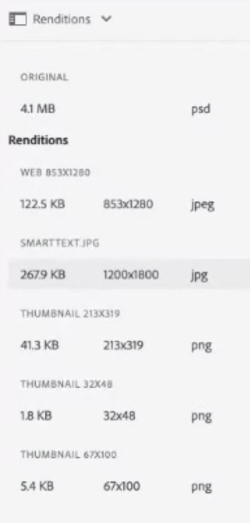

# Usar microsserviços de ativos e perfis de processamento {#get-started-using-asset-microservices}

Os microsserviços de ativos fornecem processamento escalável e resiliente de ativos usando aplicativos nativos em nuvem (também chamados de trabalhadores). O Adobe gerencia os serviços para obter o tratamento ideal de diferentes tipos de ativos e opções de processamento.

Os microsserviços de ativos permitem processar uma [ampla variedade de tipos de arquivos](/help/assets/file-format-support.md) que abrangem mais formatos prontos para uso do que o possível com versões anteriores do [!DNL Experience Manager]. Por exemplo, a extração em miniatura dos formatos PSD e PSB agora é possível, mas anteriormente era necessária para soluções de terceiros, como o [!DNL ImageMagick].

O processamento de ativos depende da configuração em **[!UICONTROL Processando Perfis]**. O Experience Manager fornece uma configuração padrão básica e permite que os administradores adicionem configurações mais específicas de processamento de ativos. Os administradores criam, mantêm e modificam as configurações dos fluxos de trabalho de pós-processamento, incluindo personalização opcional. A personalização dos fluxos de trabalho permite que os desenvolvedores estendam a oferta padrão.

<!-- Proposed DRAFT diagram for asset microservices flow - see section "asset-microservices-flow.png (asset-microservices-configure-and-use.md)" in the PPTX deck

https://adobe-my.sharepoint.com/personal/gklebus_adobe_com/_layouts/15/guestaccess.aspx?guestaccesstoken=jexDC5ZnepXSt6dTPciH66TzckS1BPEfdaZuSgHugL8%3D&docid=2_1ec37f0bd4cc74354b4f481cd420e07fc&rev=1&e=CdgElS
-->

>[!NOTE]
>
>O processamento de ativos descrito aqui substitui o modelo de fluxo de trabalho `DAM Update Asset` existente nas versões anteriores do [!DNL Experience Manager]. A maioria das etapas relacionadas à geração de representação padrão e aos metadados é substituída pelo processamento dos microsserviços de ativos, e as etapas restantes, se houver, podem ser substituídas pela configuração do fluxo de trabalho de pós-processamento.

## Entender as opções de processamento de ativos {#get-started}

[!DNL Experience Manager] permite os seguintes níveis de processamento.

| Opção | Descrição | Casos de uso abrangidos |
|---|---|---|
| [Configuração padrão](#default-config) | Ela está disponível como está e não pode ser modificada. Essa configuração fornece um recurso de geração de representação muito básico. | <ul> <li>Miniaturas padrão usadas pela interface do usuário [!DNL Assets] (48, 140 e 319 pixels) </li> <li> Visualização grande (representação da Web - 1280 pixels) </li><li> Extração de metadados e texto.</li></ul> |
| [Configuração personalizada](#standard-config) | Configurado por administradores via interface do usuário. Fornece mais opções para geração de representação estendendo a opção padrão. Estenda a opção pronta para uso para fornecer diferentes formatos e representações. | <ul><li>Representação FPO. </li> <li>Alterar formato de arquivo e resolução de imagens</li> <li> Aplicar condicionalmente a tipos de arquivos configurados. </li> </ul> |
| [Perfil personalizado](#custom-config) | Configurado por administradores via interface de usuário para usar o código personalizado por meio de aplicativos personalizados para chamar o [Serviço do Asset Compute](https://experienceleague.adobe.com/docs/asset-compute/using/introduction.html). Suporta requisitos mais complexos em um método escalável e nativo em nuvem. | Consulte [casos de uso permitidos](#custom-config). |

<!-- To create custom processing profiles specific to your custom requirements, say to integrate with other systems, see [post-processing workflows](#post-processing-workflows).
-->

## Formatos de arquivo não compatíveis {#supported-file-formats}

Os microsserviços de ativos são compatíveis com uma grande variedade de formatos de arquivo para processar, gerar representações ou extrair metadados. Consulte [formatos de arquivo com suporte](file-format-support.md) para obter a lista completa de tipos MIME e a funcionalidade com suporte para cada tipo.

## Configuração padrão {#default-config}

Alguns padrões são pré-configurados para garantir que as representações padrão necessárias no Experience Manager estejam disponíveis. A configuração padrão também garante que as operações de extração de metadados e extração de texto estejam disponíveis. Os usuários podem começar a fazer upload ou atualizar ativos imediatamente e o processamento básico está disponível por padrão.

Com a configuração padrão, somente o perfil de processamento mais básico é configurado. O perfil de processamento não está visível na interface do usuário e você não pode modificá-lo. Ele sempre é executado para processar ativos carregados. Esse perfil de processamento padrão garante que o processamento básico exigido por [!DNL Experience Manager] seja concluído em todos os ativos.

<!-- 
-->

## Configuração padrão {#standard-config}

O [!DNL Experience Manager] fornece recursos para gerar representações mais específicas para formatos comuns, de acordo com as necessidades do usuário. Um administrador pode criar [!UICONTROL Perfis de Processamento] adicionais para facilitar essa criação de representação. Os usuários atribuem um ou mais perfis disponíveis a pastas específicas para concluir o processamento adicional. Por exemplo, o processamento adicional pode gerar representações para web, dispositivos móveis e tablets. O vídeo a seguir ilustra como criar e aplicar [!UICONTROL Perfis de Processamento] e como acessar as representações criadas.

* **Largura e altura da representação**: a especificação de largura e altura da representação fornece tamanhos máximos da imagem de saída gerada. Os microsserviços de ativos tentam produzir a maior representação possível, cuja largura e altura não são maiores que a largura e a altura especificadas, respectivamente. A proporção é preservada, ou seja, a mesma do original. Um valor vazio significa que o processamento de ativos assume a dimensão em pixels do original.

* **Regras de inclusão de tipo MIME**: quando um ativo com um tipo MIME específico é processado, o tipo MIME é verificado primeiro em relação ao valor de tipos MIME excluídos para a especificação de representação. Se ele corresponder a essa lista, essa representação específica não será gerada para o ativo (lista de bloqueios). Caso contrário, o tipo MIME será verificado em relação ao tipo MIME incluído e, se ele corresponder à lista, a representação será gerada (lista de permissões).

* **Representação FPO especial**: ao colocar ativos de grande porte do [!DNL Experience Manager] em documentos do [!DNL Adobe InDesign], um profissional de criação aguarda um tempo considerável depois de [colocar um ativo](https://helpx.adobe.com/indesign/using/placing-graphics.html). Enquanto isso, o usuário não pode usar [!DNL InDesign]. Isso interrompe o fluxo de criação e afeta negativamente a experiência do usuário. O Adobe permite colocar temporariamente representações de pequeno porte em documentos do [!DNL InDesign] para começar, que podem ser substituídas por ativos de resolução completa sob demanda posteriormente. [!DNL Experience Manager] fornece representações que são usadas apenas para posicionamento (FPO). Essas representações FPO têm um tamanho de arquivo pequeno, mas têm a mesma proporção.

O perfil de processamento pode incluir uma representação FPO (somente para posicionamento). Consulte a [!DNL Adobe Asset Link] [documentação](https://helpx.adobe.com/br/enterprise/using/manage-assets-using-adobe-asset-link.html) para entender se você precisa ativá-la para o seu perfil de processamento. Para obter mais informações, consulte a [documentação completa do Link do ativo do Adobe](https://helpx.adobe.com/br/enterprise/using/adobe-asset-link.html).

### Criar um perfil padrão {#create-standard-profile}

Para criar um perfil de processamento padrão, siga estas etapas:

1. Os administradores acessam **[!UICONTROL Ferramentas]** > **[!UICONTROL Assets]** > **[!UICONTROL Processando Perfis]**. Clique em **[!UICONTROL Criar]**.
1. Forneça um nome que ajude a identificar exclusivamente o perfil ao aplicar a uma pasta.
1. Para gerar representações FPO, na guia **[!UICONTROL Imagem]**, habilite **[!UICONTROL Criar Representação FPO]**. Insira um valor de **[!UICONTROL Qualidade]** de 1-100.
1. Para gerar outras representações, clique em **[!UICONTROL Adicionar novo]** e forneça as seguintes informações:

   * Nome do arquivo de cada representação.
   * Formato de arquivo (PNG, JPEG, GIF ou WebP) de cada representação.
   * Largura e altura em pixels de cada representação. Se os valores não forem especificados, será usado o tamanho total em pixels da imagem original.
   * Qualidade em porcentagem de cada representação de JPEG e WebP.
   * Tipos MIME incluídos e excluídos para definir a aplicabilidade de um perfil.

   

1. Clique em **[!UICONTROL Salvar]**.

<!-- TBD: Update the video link when a new video is available from Tech Marketing.

The following video demonstrates the usefulness and usage of standard profile.

>[!VIDEO](https://video.tv.adobe.com/v/29832?quality=9)
-->

<!-- This image was removed per cqdoc-15624, as requested by engineering.
  
 -->

## Perfil personalizado e casos de uso {#custom-config}

O [!DNL Asset Compute Service] oferece suporte a diversos casos de uso, como processamento padrão, processamento de formatos específicos de Adobe, como arquivos Photoshop, e implementação de processamento personalizado ou específico da organização. A personalização do fluxo de trabalho do Ativo de atualização do DAM necessária no passado é realizada automaticamente ou por meio da configuração de perfis de processamento. Se essas opções de processamento não atenderem às necessidades dos negócios, a Adobe recomenda desenvolver e usar o [!DNL Asset Compute Service] para estender os recursos padrão. Para obter uma visão geral, consulte [entender a extensibilidade e quando usá-la](https://experienceleague.adobe.com/docs/asset-compute/using/extend/understand-extensibility.html).

>[!NOTE]
>
>A Adobe recomenda usar um aplicativo personalizado somente quando os requisitos comerciais não puderem ser cumpridos usando as configurações padrão ou o perfil padrão.

Ele pode transformar imagens, vídeos, documentos e outros formatos de arquivo em diferentes representações, incluindo miniaturas, texto e metadados extraídos e arquivos.

Os desenvolvedores podem usar o [!DNL Asset Compute Service] para [criar aplicativos personalizados](https://experienceleague.adobe.com/docs/asset-compute/using/extend/develop-custom-application.html) para os casos de uso com suporte. O [!DNL Experience Manager] pode chamar esses aplicativos personalizados na interface do usuário usando perfis personalizados que os administradores configuram. [!DNL Asset Compute Service] dá suporte aos seguintes casos de uso de invocação de serviços externos:

* Use a [API ImageCutout](https://developer.adobe.com/photoshop/photoshop-api-docs/) de [!DNL Adobe Photoshop] e salve o resultado como representação.
* Chame sistemas de terceiros para atualizar dados, por exemplo, um sistema PIM.
* Use a API [!DNL Photoshop] para gerar uma variedade de representações com base no modelo do Photoshop.
* Use a [API do Adobe Lightroom](https://developer.adobe.com/photoshop/photoshop-api-docs/) para otimizar os ativos assimilados e salvá-los como representações.

>[!NOTE]
>
>Não é possível editar os metadados padrão usando os aplicativos personalizados. Você só pode modificar metadados personalizados.

### Criar um perfil personalizado {#create-custom-profile}

Para criar um perfil personalizado, siga estas etapas:

1. Os administradores acessam **[!UICONTROL Ferramentas]** > **[!UICONTROL Assets]** > **[!UICONTROL Processando Perfis]**. Clique em **[!UICONTROL Criar]**.
1. Clique na guia **[!UICONTROL Personalizado]**. Clique em **[!UICONTROL Adicionar novo]**. Forneça o nome de arquivo desejado para a representação.
1. Forneça as seguintes informações.

   * Nome de arquivo de cada representação e uma extensão de arquivo compatível.
   * [URL do ponto de extremidade de um aplicativo personalizado do App Builder](https://experienceleague.adobe.com/docs/asset-compute/using/extend/deploy-custom-application.html). O aplicativo deve ser da mesma organização da conta Experience Manager.
   * Adicionar Parâmetros de Serviço a [passar informações extras ou parâmetros para o aplicativo personalizado](https://experienceleague.adobe.com/docs/asset-compute/using/extend/develop-custom-application.html#extend).
   * Tipos MIME incluídos e excluídos para limitar o processamento a alguns formatos de arquivo específicos.

   Clique em **[!UICONTROL Salvar]**.

Os aplicativos personalizados são aplicativos [Project App Builder](https://developer.adobe.com/app-builder/docs/overview/) headless. Seu aplicativo personalizado obtém todos os arquivos fornecidos se eles forem configurados com um perfil de processamento. O aplicativo deve filtrar os arquivos.

>[!CAUTION]
>
>Se o aplicativo App Builder e a conta [!DNL Experience Manager] não forem da mesma organização, a integração não funcionará.

### Exemplo de perfil personalizado {#custom-profile-example}

Para ilustrar o uso do perfil personalizado, vamos considerar um caso de uso para aplicar texto personalizado a imagens da campanha. É possível criar um perfil de processamento que use a API do Photoshop para editar as imagens.

A integração do Asset Compute Service permite que o Experience Manager passe esses parâmetros para o aplicativo personalizado usando o campo [!UICONTROL Parâmetros de Serviço]. O aplicativo personalizado chama a API do Photoshop e passa esses valores para a API. Por exemplo, você pode passar o nome da fonte, a cor do texto, a espessura e o tamanho do texto para adicionar o texto personalizado às imagens da campanha.

<!-- TBD: Check screenshot against the interface. -->

*Figura: Use o campo [!UICONTROL Parâmetros de Serviço] para transmitir informações adicionadas à compilação de parâmetros predefinidos para o aplicativo personalizado. Neste exemplo, quando as imagens da campanha são carregadas, elas são atualizadas com texto `Jumanji` na fonte `Arial-BoldMT`.*

## Usar perfis de processamento para processar ativos {#use-profiles}

Crie e aplique perfis de processamento adicionais e personalizados a pastas específicas para que o Experience Manager processe ativos carregados ou atualizados nessas pastas. O perfil de processamento padrão incorporado é sempre executado, mas não fica visível na interface do usuário do. Se você adicionar um perfil personalizado, ambos os perfis serão usados para processar os ativos carregados.

Aplique perfis de processamento a pastas usando um dos seguintes métodos:

* Os administradores podem selecionar uma definição de perfil de processamento em **[!UICONTROL Ferramentas]** > **[!UICONTROL Assets]** > **[!UICONTROL Perfis de Processamento]** e usar a ação **[!UICONTROL Aplicar Perfil às Pastas]**. Ele abre um navegador de conteúdo que permite navegar até pastas específicas, selecioná-las e confirmar a aplicação do perfil.
* Os usuários podem selecionar uma pasta na interface do usuário do Assets, usar a ação **[!UICONTROL Propriedades]** para abrir a tela de propriedades da pasta, clicar na guia **[!UICONTROL Processamento de ativos]** e, na lista [!UICONTROL Perfil de Processamento], selecionar o perfil de processamento apropriado para essa pasta. Para salvar as alterações, clique em **[!UICONTROL Salvar e fechar]**.
  

* Os usuários podem selecionar pastas ou ativos específicos na interface do Assets para aplicar um perfil de processamento e, em seguida, selecionar a opção  **[!UICONTROL Reprocessar Assets]** nas opções disponíveis na parte superior.

>[!TIP]
>
>Somente um perfil de processamento pode ser aplicado a uma pasta. Para gerar mais representações, adicione mais definições de representação ao perfil de processamento existente.

Depois que um perfil de processamento é aplicado a uma pasta, todos os novos ativos carregados (ou atualizados) nessa pasta ou em qualquer uma de suas subpastas são processados usando o perfil de processamento adicional configurado. Esse processamento é executado em adição ao do perfil padrão.

>[!NOTE]
>
>Um perfil de processamento aplicado a uma pasta funciona para toda a árvore, mas pode ser substituído por outro perfil aplicado a uma subpasta. Quando os ativos são carregados para uma pasta, o Experience Manager verifica se as propriedades da pasta que os contém têm um perfil de processamento. Se nenhum for aplicado, uma pasta principal na hierarquia será verificada em busca de um perfil de processamento para ser aplicado.

Para verificar se os ativos são processados, visualize as representações geradas na exibição [!UICONTROL Representações] no painel esquerdo. Abra a visualização de ativos e abra o painel esquerdo para acessar a exibição **[!UICONTROL Representações]**. As representações específicas no perfil de processamento, para as quais o tipo de ativo específico corresponde às regras de inclusão do tipo MIME, devem estar visíveis e acessíveis.

*Figura: Exemplo de duas representações adicionais geradas por um perfil de processamento aplicado à pasta pai.*

## Fluxos de trabalho de processamento Post {#post-processing-workflows}

Para uma situação em que é necessário um processamento adicional de ativos que não pode ser obtido usando os perfis de processamento, fluxos de trabalho de pós-processamento adicionais podem ser adicionados à configuração. O processamento Post permite adicionar processamento totalmente personalizado além do processamento configurável usando microsserviços de ativos.

Os fluxos de trabalho de processamento Post ou o [Fluxo de trabalho de início automático](https://experienceleague.adobe.com/docs/experience-manager-learn/assets/configuring/auto-start-workflows.html), se configurado, são executados automaticamente por [!DNL Experience Manager] após a conclusão do processamento dos microsserviços. Não há necessidade de adicionar iniciadores de fluxo de trabalho manualmente para acionar os fluxos de trabalho. Os exemplos incluem:

* Etapas personalizadas do fluxo de trabalho para processar ativos.
* Integrações para adicionar metadados ou propriedades a ativos de sistemas externos, por exemplo, informações de produto ou processo.
* Processamento adicional feito por serviços externos.

Para adicionar uma configuração de fluxo de trabalho de pós-processamento ao [!DNL Experience Manager], siga estas etapas:

* Crie um ou mais modelos de fluxo de trabalho. Esses modelos personalizados são chamados de *modelos de fluxo de trabalho de pós-processamento* nesta documentação. Esses são modelos de fluxo de trabalho [!DNL Experience Manager] comuns.
* Adicione as etapas de fluxo de trabalho necessárias a esses modelos. Revise as etapas do fluxo de trabalho padrão e adicione todas as etapas padrão necessárias ao fluxo de trabalho personalizado. As etapas são executadas nos ativos com base em uma configuração de modelo de fluxo de trabalho. Por exemplo, se você quiser que a marcação inteligente ocorra automaticamente no upload do ativo, adicione a etapa ao modelo de fluxo de trabalho de pós-processamento personalizado.
* A etapa Adicionar [!UICONTROL Fluxo de trabalho do Ativo de atualização do DAM concluiu o processo] no final. Adicionar esta etapa garante que o Experience Manager saiba quando o processamento termina e o ativo possa ser marcado como processado, ou seja, *Novo* é exibido no ativo.
* Crie uma configuração para o Serviço de Execução de Fluxo de Trabalho Personalizado que permita configurar a execução de um modelo de fluxo de trabalho de pós-processamento por um caminho (local da pasta) ou por uma expressão regular.

Para obter detalhes sobre qual etapa do fluxo de trabalho padrão pode ser usada no fluxo de trabalho de pós-processamento, consulte [etapas do fluxo de trabalho no fluxo de trabalho de pós-processamento](developer-reference-material-apis.md#post-processing-workflows-steps) na referência do desenvolvedor.

### Criar modelos de fluxo de trabalho de pós-processamento {#create-post-processing-workflow-models}

Os modelos de fluxo de trabalho de processamento de Post são modelos de fluxo de trabalho [!DNL Experience Manager] comuns. Crie modelos diferentes se precisar de processamento diferente para locais de repositório ou tipos de ativos diferentes.

As etapas de processamento são adicionadas conforme necessário. Você pode usar ambas as etapas, as etapas compatíveis que estão disponíveis e qualquer etapa de fluxo de trabalho personalizada implementada.

Verifique se a última etapa de cada fluxo de trabalho de pós-processamento é `DAM Update Asset Workflow Completed Process`. A última etapa ajuda a garantir que o Experience Manager saiba quando o processamento de ativos foi concluído.

### Configurar a execução do workflow de pós-processamento {#configure-post-processing-workflow-execution}

Depois que os microsserviços de ativos concluírem o processamento dos ativos carregados, você poderá definir um fluxo de trabalho de pós-processamento para processar ainda mais os ativos. Para configurar o pós-processamento usando modelos de fluxo de trabalho, siga um destes procedimentos:

* [Aplicar um modelo de fluxo de trabalho nas Propriedades da pasta](#apply-workflow-model-to-folder).
* [Configurar o serviço Executor de Fluxo de Trabalho Personalizado](#configure-custom-workflow-runner-service).

#### Aplicar um modelo de fluxo de trabalho a uma pasta {#apply-workflow-model-to-folder}

Para casos de uso típicos de pós-processamento, considere usar o método para aplicar um fluxo de trabalho a uma pasta. Para aplicar um modelo de fluxo de trabalho na pasta [!UICONTROL Propriedades], siga estas etapas:

1. Crie um modelo de fluxo de trabalho.
1. Selecione uma pasta, clique em **[!UICONTROL Propriedades]** na barra de ferramentas e clique na guia **[!UICONTROL Processamento do Assets]**.
1. Em **[!UICONTROL Fluxo de trabalho de início automático]**, selecione o fluxo de trabalho necessário, forneça um título para o fluxo de trabalho e salve as alterações.

   

#### Configurar o serviço Executor de fluxo de trabalho personalizado {#configure-custom-workflow-runner-service}

Você pode configurar o serviço de execução de fluxo de trabalho personalizado para as configurações avançadas que não podem ser prontamente atendidas ao aplicar um fluxo de trabalho a uma pasta. Por exemplo, um fluxo de trabalho que usa uma expressão regular. O Adobe CQ DAM Custom Workflow Runner (`com.adobe.cq.dam.processor.nui.impl.workflow.CustomDamWorkflowRunnerImpl`) é um serviço OSGi. Ela fornece as duas opções de configuração a seguir:

* Fluxos de trabalho de processamento Post por caminho (`postProcWorkflowsByPath`): vários modelos de fluxo de trabalho podem ser listados, com base em caminhos de repositório diferentes. Separe caminhos e modelos usando dois-pontos. Há suporte para caminhos de repositório simples. Mapeie-os para um modelo de fluxo de trabalho no caminho `/var`. Por exemplo: `/content/dam/my-brand:/var/workflow/models/my-workflow`.
* Fluxos de trabalho de processamento de Post por expressão (`postProcWorkflowsByExpression`): vários modelos de fluxo de trabalho podem ser listados, com base em diferentes expressões regulares. As expressões e os modelos devem ser separados por dois-pontos. A expressão regular deve apontar diretamente para o nó Asset e não para uma das representações ou arquivos. Por exemplo: `/content/dam(/.*/)(marketing/seasonal)(/.*):/var/workflow/models/my-workflow`.

Para saber como implantar uma configuração OSGi, consulte [implantar em [!DNL Experience Manager]](/help/implementing/deploying/overview.md).

#### Desative a execução do workflow de pós-processamento

Quando o pós-processamento não for necessário, crie e use um Modelo de Fluxo de Trabalho &quot;vazio&quot; na seleção __Fluxo de Trabalho de início automático__.

##### Criar o modelo de fluxo de trabalho de início automático desativado

1. Navegue até __Ferramentas > Fluxo de trabalho > Modelos__
1. Selecione __Criar > Criar modelo__ na barra de ações superior
1. Forneça um título e nome para o novo Modelo de fluxo de trabalho, por exemplo:
   * Título: desativar o fluxo de trabalho de início automático
   * Nome: disable-auto-start-workflow
1. Selecione __Concluído__ para criar o modelo de fluxo de trabalho
1. __Selecione__ e __Edite__ o Modelo de Fluxo de Trabalho criado
1. No editor de Modelo de Fluxo de Trabalho, selecione __Etapa 1__ da definição de modelo e exclua-a
1. Abra o __Painel Lateral__ e selecione __Etapas__
1. Arraste a etapa __Fluxo de trabalho do ativo de atualização do DAM concluído__ para a definição do modelo
1. Selecione o botão __Informações da Página__ (ao lado da opção __Painel Lateral__) e selecione __Abrir Propriedades__
1. Na guia __Básico__, selecione __Fluxo de trabalho transitório__
1. Selecione __Salvar e fechar__ na barra de ações superior
1. Selecione __Sincronizar__ na barra de ações superior
1. Fechar o editor de modelo de fluxo de trabalho

##### Aplicar o modelo de fluxo de trabalho de início automático desativado

Siga as etapas descritas em [aplicar um modelo de fluxo de trabalho a uma pasta](#apply-workflow-model-to-folder) e definir o __Desabilitar Fluxo de Trabalho de Início Automático__, pois o __Fluxo de Trabalho de Início Automático__ para pastas não requer pós-processamento de ativos.

## Práticas recomendadas e limitações {#best-practices-limitations-tips}

* Considere suas necessidades para todos os tipos de representações ao criar workflows. Se você não prever a necessidade de uma representação no futuro, remova a etapa de criação do fluxo de trabalho. As representações não podem ser excluídas em massa posteriormente. As representações indesejadas podem ocupar grandes quantidades de espaço de armazenamento após o uso prolongado de [!DNL Experience Manager]. Para ativos individuais, é possível remover representações manualmente da interface do usuário. Para vários ativos, você pode personalizar [!DNL Experience Manager] para excluir representações específicas ou excluir os ativos e carregá-los novamente.
* No momento, o suporte está limitado à geração de representações. Não há suporte para a geração de novo ativo.
* Atualmente, o limite de tamanho do arquivo para extração de metadados é de aproximadamente 15 GB. Ao fazer upload de ativos muito grandes, às vezes a operação de extração de metadados falha.

**Consulte também**

* [Traduzir ativos](translate-assets.md)
* [API HTTP de ativos](mac-api-assets.md)
* [Formatos de arquivo compatíveis com os ativos](file-format-support.md)
* [Pesquisar ativos](search-assets.md)
* [Ativos conectados](use-assets-across-connected-assets-instances.md)
* [Relatórios de ativos](asset-reports.md)
* [Esquemas de metadados](metadata-schemas.md)
* [Baixar ativos](download-assets-from-aem.md)
* [Gerenciar metadados](manage-metadata.md)
* [Pesquisar aspectos](search-facets.md)
* [Gerenciar coleções](manage-collections.md)
* [Importação de metadados em massa](metadata-import-export.md)
* [Publish Assets para AEM e Dynamic Media](/help/assets/publish-assets-to-aem-and-dm.md)

>[!MORELIKETHIS]
>
>* [Introdução ao Asset Compute Service](https://experienceleague.adobe.com/docs/asset-compute/using/introduction.html).
>* [Entenda a extensibilidade e quando usá-la](https://experienceleague.adobe.com/docs/asset-compute/using/extend/understand-extensibility.html).
>* [Como criar aplicativos personalizados](https://experienceleague.adobe.com/docs/asset-compute/using/extend/develop-custom-application.html).
>* [Tipos MIME com suporte para vários casos de uso](/help/assets/file-format-support.md).

<!-- TBD: 
* How/where can admins check what's already configured and provisioned.
* How/where to request for new provisioning/purchase.
-->
