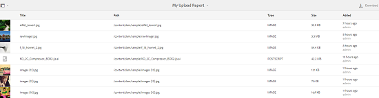

# Relatórios de ativos {#asset-reports}

| Versão | Link do artigo |
| -------- | ---------------------------- |
| AEM 6.5 | [Clique aqui](https://experienceleague.adobe.com/docs/experience-manager-65/assets/administer/asset-reports.html?lang=en) |
| AEM as a Cloud Service | Este artigo |

Os relatórios de ativos permitem avaliar a utilidade da implantação do [!DNL Adobe Experience Manager Assets]. Com o [!DNL Assets], você pode gerar vários relatórios para seus ativos digitais. Os relatórios fornecem informações úteis sobre o uso do sistema, como os usuários interagem com os ativos e quais ativos são <!-- downloaded and --> compartilhados.

Use as informações nos relatórios para obter as principais métricas de sucesso e medir a adoção do [!DNL Assets] na sua empresa e por clientes.

A estrutura de relatório [!DNL Assets] usa [!DNL Sling] trabalhos para processar de forma assíncrona solicitações de relatório de maneira ordenada. Ele é escalável para repositórios grandes. O processamento assíncrono de relatórios aumenta a eficiência e a velocidade com que os relatórios são gerados.

A interface de gerenciamento de relatórios é intuitiva e inclui opções e controles refinados para acessar relatórios arquivados e exibir status de execução de relatórios (bem-sucedido, com falha e em fila).

Quando um relatório é gerado, você é notificado via <!-- through an email (optional) and --> uma notificação da caixa de entrada. É possível visualizar, baixar ou excluir um relatório da página de listagem de relatórios, na qual todos os relatórios gerados anteriormente são exibidos.

## Gerar relatórios {#generate-reports}

[!DNL Experience Manager Assets] gera os seguintes relatórios padrão para você:

* Upload
* Download
* Expiração
* Modificação
* Publicação
* [!DNL Brand Portal] publicação
* Uso do disco
* Arquivos
* Compartilhamento de link

<!-- Removed download report.
* Upload
* Download
* Expiration
* Modification
* Publish
* [!DNL Brand Portal] publish
* Disk Usage
* Files
* Link Share
-->

Os administradores do [!DNL Adobe Experience Manager] podem facilmente gerar e personalizar esses relatórios para sua implementação. Um administrador pode seguir estas etapas para gerar um relatório:

1. Na interface do [!DNL Experience Manager], clique em **[!UICONTROL Ferramentas]** > **[!UICONTROL Assets]** > **[!UICONTROL Relatórios]**.

   

1. Na página [!UICONTROL Relatórios de ativos], clique em **[!UICONTROL Criar]** na barra de ferramentas.
1. Na página **[!UICONTROL Criar Relatório]**, escolha o relatório que deseja criar e clique em **[!UICONTROL Avançar]**.

   

1. Configure os detalhes do relatório, como título, descrição, miniatura e caminho da pasta. Por padrão, o caminho da pasta é `/content/dam`. Você pode especificar um caminho diferente para executar o relatório em uma pasta específica.

   

   Escolha o intervalo de datas do relatório. Você pode optar por gerar o relatório agora ou em uma data e hora futuras.

   >[!NOTE]
   >
   >Se optar por agendar o relatório posteriormente, certifique-se de especificar a data e a hora nos campos Data e Hora. Se você não especificar nenhum valor, o mecanismo de relatório o tratará como um relatório a ser gerado instantaneamente.

   Os campos de configuração podem diferir de acordo com o tipo de relatório que você cria. Por exemplo, o relatório **[!UICONTROL Uso de disco]** fornece opções para incluir representações de ativos ao calcular o espaço em disco usado por ativos. Você pode optar por incluir ou excluir ativos em subpastas para cálculo de uso do disco.

   >[!NOTE]
   >
   >O relatório **[!UICONTROL Uso de disco]** não inclui campos de intervalo de datas porque indica apenas o uso atual do espaço em disco.

   

   Ao criar o relatório **[!UICONTROL Arquivos]**, você pode incluir/excluir subpastas. No entanto, não é possível incluir representações de ativos neste relatório.

   

   O relatório **[!UICONTROL Compartilhamento de links]** exibe URLs de ativos que são compartilhados com usuários externos a partir do [!DNL Assets]. <!-- It includes email ids of the user who shared the assets, emails ids of users with which the assets are shared, share date, and expiration date for the link. --> As colunas não são personalizáveis.

   O relatório **[!UICONTROL Compartilhamento de links]** não inclui opções para subpastas e representações porque apenas publica as URLs compartilhadas que aparecem em `/var/dam/share`.

   

1. Clique em **[!UICONTROL Avançar]** na barra de ferramentas.

1. Na página **[!UICONTROL Configurar Colunas]**, algumas colunas são selecionadas para serem exibidas no relatório por padrão. Você pode selecionar mais colunas. Cancele a seleção de uma coluna para excluí-la no relatório.

   

   Para exibir um nome de coluna ou caminho de propriedade personalizado, configure as propriedades para o binário de ativos no nó `jcr:content` no CRX. Como alternativa, adicione-o por meio do seletor de caminho de propriedade.

   

1. Clique em **[!UICONTROL Criar]** na barra de ferramentas. Uma mensagem notifica que a geração de relatório foi iniciada.
1. Na página [!UICONTROL Relatórios de ativos], o status de geração de relatório é baseado no estado atual do trabalho de relatório, por exemplo, [!UICONTROL Sucesso], [!UICONTROL Falha], [!UICONTROL Em fila] ou [!UICONTROL Agendado]. O mesmo status aparece na caixa de entrada de notificações.Para exibir a página do relatório, clique no link do relatório. Como alternativa, selecione o relatório e clique em **[!UICONTROL Exibir]** na barra de ferramentas.

   <!---->
   

   Clique em **[!UICONTROL Baixar]** na barra de ferramentas para baixar o relatório no formato CSV.

   >[!NOTE]
   >
   >Você pode gerar relatórios com base nos eventos gerados durante os últimos 360 dias. O Experience Manager retém os dados da ID do usuário por 30 dias.

## Adicionar colunas personalizadas aos relatórios {#add-custom-columns}

Você pode adicionar colunas personalizadas aos seguintes relatórios para exibir mais dados de acordo com seus requisitos personalizados:

<!-- Remove download report.
* Upload
* Download
* Expiration
* Modification
* Publish
* [!DNL Brand Portal] publish
* Files
-->

* Upload
* Expiração
* Modificação
* Publicação
* [!DNL Brand Portal] publicação
* Arquivos

Para adicionar colunas personalizadas a esses relatórios, siga estas etapas:

1. No [!DNL Manager interface], clique em **[!UICONTROL Ferramentas]** > **[!UICONTROL Assets]** > **[!UICONTROL Relatórios]**.
1. Na página [!UICONTROL Relatórios de ativos], clique em **[!UICONTROL Criar]** na barra de ferramentas.

1. Na página **[!UICONTROL Criar Relatório]**, escolha um relatório a ser criado. Clique em **[!UICONTROL Avançar]**.

1. Configure os detalhes do relatório, como título, descrição, miniatura, caminho da pasta e intervalo de datas, conforme aplicável. Clique em **[!UICONTROL Avançar]**.

1. Selecione as informações aplicáveis na lista de **[!UICONTROL Colunas Padrão]**. Para exibir uma coluna personalizada, especifique o nome da coluna em **[!UICONTROL Colunas Personalizadas]**.

   

1. Adicione o caminho da propriedade no nó `jcr:content` no CRXDE usando o seletor de caminho de propriedade. Como alternativa, digite o caminho no campo caminho da propriedade.

   

   Para adicionar mais colunas personalizadas, clique em **[!UICONTROL Adicionar]** e repita as etapas acima.

1. Clique em **[!UICONTROL Criar]** na barra de ferramentas. Uma mensagem notifica que a geração de relatório foi iniciada.

<!-- TBD: How to configure purge now? Is it using OSGi configurations?

## Configure purging service {#configure-purging-service}

To remove reports that you no longer require, configure the DAM Report Purge service from the web console to purge existing reports based on their quantity and age.

1. Access the web console (configuration manager) from `https://[aem_server]:[port]/system/console/configMgr`.
1. Open the **[!UICONTROL DAM Report Purge Service]** configuration.
1. Specify the frequency (time interval) for the purging service in the `scheduler.expression.name` field. You can also configure the age and the quantity threshold for reports.
1. Save the changes.
-->

## Informações de solução de problemas {#tips-troubleshoot}

* Se o [!UICONTROL Relatório de Uso do Disco] não for gerado e se você estiver usando o [!DNL Dynamic Media], verifique se todos os ativos foram processados corretamente. Para resolver, reprocesse os ativos e gere o relatório novamente.

<!-- These notes were present in generate report section above. Removing commented text from in between the instructions to preserve the numbering of the ordered list.

TBD: How do enable this in CS now? Is it done using some OSGi config now?
   >[!NOTE]
   >
   >Before you can generate an **[!UICONTROL Asset Downloaded]** report, ensure that the Asset Download service is enabled. From the web console (`https://[aem_server]:[port]/system/console/configMgr`), open the **[!UICONTROL Day CQ DAM Event Recorder]** configuration, and select the **[!UICONTROL Asset Downloaded (DOWNLOADED)]** option in Event Types if not already selected.
-->

<!-- Removed download report.
   >[!NOTE]
   >
   >By default, the Content Fragments and link shares are included in the asset [!UICONTROL Download] report. Select the appropriate option to create a report of link shares or to exclude Content Fragments from the download report.

   >[!NOTE]
   >
   >The [!UICONTROL Download] report displays details of only those assets which are downloaded after selecting individually or are downloaded using Quick Action. However, it does not include the details of the assets that are inside a downloaded folder.
-->

**Consulte também**

* [Traduzir ativos](translate-assets.md)
* [API HTTP de ativos](mac-api-assets.md)
* [Formatos de arquivo compatíveis com os ativos](file-format-support.md)
* [Pesquisar ativos](search-assets.md)
* [Ativos conectados](use-assets-across-connected-assets-instances.md)
* [Esquemas de metadados](metadata-schemas.md)
* [Baixar ativos](download-assets-from-aem.md)
* [Gerenciar metadados](manage-metadata.md)
* [Pesquisar aspectos](search-facets.md)
* [Gerenciar coleções](manage-collections.md)
* [Importação de metadados em massa](metadata-import-export.md)
* [Publish Assets para AEM e Dynamic Media](/help/assets/publish-assets-to-aem-and-dm.md)
