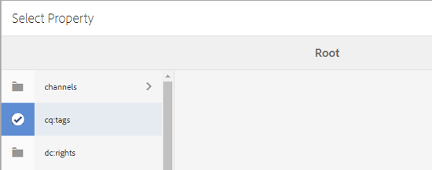

# Relatórios dos ativos {#asset-reports}

O relatórios de ativos permite que você avalie a utilidade da sua [!DNL Adobe Experience Manager Assets] implantação. Com [!DNL Assets], você pode gerar vários relatórios para seus ativos digitais. Os relatórios fornecem informações úteis sobre o uso do sistema, como os usuários interagem com ativos e quais ativos são baixados e compartilhados.

Use as informações nos relatórios para obter as métricas principais de sucesso para medir a adoção de [!DNL Assets] dentro da empresa e pelos clientes.

A estrutura do [!DNL Assets] relatórios usa [!DNL Sling] trabalhos para processar de forma assíncrona solicitações de relatório de maneira ordenada. É escalável para repositórios grandes. O processamento assíncrono de relatórios aumenta a eficiência e a velocidade com que os relatórios são gerados.

A interface de gerenciamento de relatórios é intuitiva e inclui opções e controles refinados para acessar relatórios arquivados e status de execução de relatórios de visualização (sucesso, falha e enfileirados).

Quando um relatório é gerado, você é notificado por <!-- through an email (optional) and --> uma notificação de caixa de entrada. Você pode visualização, baixar ou excluir um relatório da página de listagem do relatório, onde todos os relatórios gerados anteriormente são exibidos.

## Gerar relatórios {#generate-reports}

[!DNL Experience Manager Assets] gera os seguintes relatórios padrão para você:

* Imagem
* Download
* Expiração
* Modificação
* Publicação
* [!DNL Brand Portal] Publicar
* Uso do disco
* Arquivos
* Compartilhamento de link

[!DNL Adobe Experience Manager] os administradores podem facilmente gerar e personalizar esses relatórios para sua implementação. Um administrador pode seguir estas etapas para gerar um relatório:

1. Na [!DNL Experience Manager] interface, clique em **[!UICONTROL Ferramentas]** > **[!UICONTROL Ativos]** > **[!UICONTROL Relatórios]**.

   

1. Na página Relatórios [!UICONTROL de] ativos, clique em **[!UICONTROL Criar]** na barra de ferramentas.
1. Na página **[!UICONTROL Criar relatório]** , escolha o relatório que deseja criar e clique em **[!UICONTROL Avançar]**.

   

   >[!NOTE]
   >
   >Antes de gerar um relatório **[!UICONTROL Ativo baixado]**, verifique se o serviço de Download de ativos está ativado. No console da Web (`https://[aem_server]:[port]/system/console/configMgr`), abra a configuração **[!UICONTROL Day CQ DAM Event Recorder]** e selecione a opção **[!UICONTROL Ativo baixado (BAIXADO)]** em Tipos de evento, se ainda não estiver selecionada.

   >[!NOTE]
   >
   >Por padrão, os Fragmentos de conteúdo e compartilhamentos de link são incluídos no relatório [!UICONTROL Download] de ativos. Selecione a opção apropriada para criar um relatório de compartilhamentos de link ou para excluir Fragmentos de conteúdo do relatório de download.

   >[!NOTE]
   >
   >O relatório [!UICONTROL Download] exibe detalhes somente dos ativos que são baixados após a seleção individual ou que são baixados por meio da Ação rápida. No entanto, não inclui os detalhes dos ativos que estão dentro de uma pasta baixada.

1. Configure detalhes do relatório, como título, descrição, miniatura e caminho da pasta no repositório CRX onde o relatório é armazenado. Por padrão, o caminho da pasta é `/content/dam`. Você pode especificar um caminho diferente.

   

   Escolha o intervalo de datas para seu relatório.

   Você pode optar por gerar o relatório agora ou em uma data e hora futuras.

   >[!NOTE]
   >
   >Se você optar por agendar o relatório posteriormente, especifique a data e a hora nos campos Data e Hora. Se você não especificar nenhum valor, o mecanismo de relatório o tratará como um relatório que deve ser gerado instantaneamente.

   Os campos de configuração podem diferir com base no tipo de relatório que você cria. Por exemplo, o relatório Uso **[!UICONTROL de]** disco fornece opções para incluir representações de ativos ao calcular o espaço em disco usado pelos ativos. Você pode optar por incluir ou excluir ativos em subpastas para o cálculo de uso do disco.

   >[!NOTE]
   >
   >O relatório **[!UICONTROL Uso de disco]** não inclui campos de intervalo de datas porque indica apenas o uso atual do espaço em disco.

   

   Ao criar o relatório **[!UICONTROL Arquivos]** , você pode incluir/excluir subpastas. No entanto, não é possível incluir representações de ativos para este relatório.

   

   O relatório **[!UICONTROL Compartilhamento de links]** exibe URLs de ativos que são compartilhados com usuários externos a partir do [!DNL Assets]. <!-- It includes email ids of the user who shared the assets, emails ids of users with which the assets are shared, share date, and expiration date for the link. --> As colunas não são personalizáveis.

   The **[!UICONTROL Link Share]** report, does not include options for sub-folders and renditions because it merely publishes the shared URLs that appear under `/var/dam/share`.

   

1. Click **[!UICONTROL Next]** from the toolbar.

1. Na página **[!UICONTROL Configurar colunas]** , algumas colunas são selecionadas para aparecerem no relatório por padrão. É possível selecionar mais colunas. Desmarque uma coluna selecionada para excluí-la no relatório.

   

   Para exibir um nome de coluna ou caminho de propriedade personalizado, configure as propriedades para o binário de ativo no `jcr:content` nó no CRX. Como alternativa, adicione-o através do seletor de caminho de propriedade.

   

1. Click **[!UICONTROL Create]** from the toolbar. Uma mensagem notifica que a geração de relatórios foi iniciada.
1. Na página Relatórios [!UICONTROL de] ativos, o status de geração de relatórios se baseia no estado atual do trabalho de relatório, por exemplo, [!UICONTROL Sucesso], [!UICONTROL Falha], [!UICONTROL Enfileirado]ou [!UICONTROL Programado]. O mesmo status aparece na caixa de entrada de notificações.Para visualização na página de relatório, clique no link do relatório. Como alternativa, selecione o relatório e clique em **[!UICONTROL Visualização]** na barra de ferramentas.

   

   Clique em **[!UICONTROL Download]** na barra de ferramentas para baixar o relatório no formato CSV.

## Adicionar colunas personalizadas {#add-custom-columns}

Você pode adicionar colunas personalizadas aos seguintes relatórios para exibir mais dados para seus requisitos personalizados:

* Imagem
* Download
* Expiração
* Modificação
* Publicação
* [!DNL Brand Portal] Publicar
* Arquivos

Para adicionar colunas personalizadas a esses relatórios, siga estas etapas:

1. No [!DNL Manager interface], clique em **[!UICONTROL Ferramentas]** > **[!UICONTROL Ativos]** > **[!UICONTROL Relatórios]**.
1. Na página Relatórios [!UICONTROL de] ativos, clique em **[!UICONTROL Criar]** na barra de ferramentas.

1. Na página **[!UICONTROL Criar relatório]** , escolha o relatório que deseja criar e clique em **[!UICONTROL Avançar]**.
1. Configure detalhes do relatório, como título, descrição, miniatura, caminho da pasta e intervalo de datas, conforme aplicável.

1. Para exibir uma coluna personalizada, especifique o nome da coluna em **[!UICONTROL Colunas personalizadas]**.

   

1. Adicione o caminho da propriedade sob o `jcr:content` nó no CRXDE usando o seletor de caminho da propriedade. Como alternativa, digite o caminho no campo de caminho da propriedade.

   

   Para adicionar mais colunas personalizadas, clique em **[!UICONTROL Adicionar]** e repita as etapas 5 e 6.

1. Click **[!UICONTROL Create]** from the toolbar. Uma mensagem notifica que a geração de relatórios foi iniciada.

## Configurar o serviço de remoção {#configure-purging-service}

Para remover relatórios que não são mais necessários, configure o serviço de Expurgação de relatórios do DAM do console da Web para expurgar os relatórios existentes com base na quantidade e idade.

1. Acesse o console da Web (gerenciador de configurações) de `https://[aem_server]:[port]/system/console/configMgr`.
1. Abra a configuração do Serviço **[!UICONTROL de Expurgação de Relatório]** DAM.
1. Especifique a frequência (intervalo de tempo) do serviço de expurgação no `scheduler.expression.name` campo. Você também pode configurar a idade e o limite de quantidade para os relatórios.
1. Salve as alterações.
