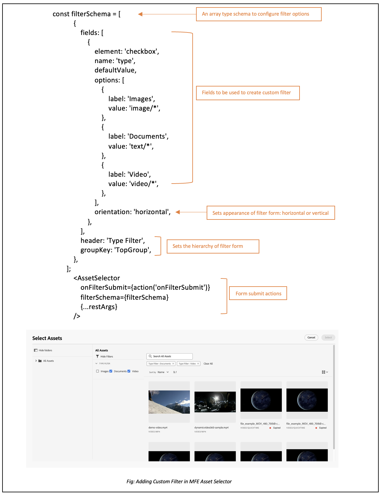

# Seletor de ativos de micro front-end {#Overview}

O Seletor de ativos de micro front-end fornece uma interface do usuário que se integra facilmente ao repositório [!DNL Experience Manager Assets] para navegar ou pesquisar ativos digitais disponíveis no repositório e usá-los na experiência de criação do aplicativo.

A interface do usuário de micro front-end é disponibilizada em sua experiência de aplicativo usando o pacote de Seletor de ativos. Quaisquer atualizações no pacote são automaticamente importadas e o Seletor de ativos implantado mais recente é automaticamente carregado no aplicativo.


O Seletor de ativos oferece muitos benefícios, como:

* Facilidade de integração com qualquer um dos [Adobe](#asset-selector-ims) ou [não Adobe](#asset-selector-non-ims) aplicativos usando a biblioteca JavaScript do Vanilla.
* Manutenção facilitada, pois as atualizações do pacote do Seletor de ativos são implantadas automaticamente no Seletor de ativos disponível para seu aplicativo. Não há atualizações necessárias no aplicativo para carregar as modificações mais recentes.
* Facilidade de personalização, pois há propriedades disponíveis que controlam a exibição do Seletor de ativos no aplicativo.
* Filtros de pesquisa de texto completo, prontos para uso e personalizados que navegam rapidamente até os ativos para uso na experiência de criação.
* Capacidade de alternar repositórios em uma organização IMS para seleção de ativos.
* Capacidade de classificar ativos por nome, dimensões e tamanho e visualizá-los na exibição de Lista, Grade, Galeria ou Cascata.

<!--Perform the following tasks to integrate and use Asset Selector with your [!DNL Experience Manager Assets] repository:

1. [Install Asset Selector](#installation)
2. [Integrate Asset Selector using Vanilla JS](#integration-using-vanilla-js)
3. [Use Asset Selector](#using-asset-selector)
-->

<!--
## Setting up Asset Selector {#asset-selector-setup}


-->

## Pré-requisitos{#prereqs}

Você deve garantir os seguintes métodos de comunicação:

* O aplicativo está sendo executado em HTTPS.
* O URL do aplicativo está na lista de permissões de URLs de redirecionamento do cliente IMS.
* O fluxo de logon do IMS é configurado e renderizado usando um pop-up no navegador da Web. Portanto, os pop-ups devem ser ativados ou permitidos no navegador de destino.

Use os pré-requisitos acima se você precisar de um fluxo de trabalho de autenticação IMS do Seletor de ativos. Como alternativa, se você já estiver autenticado com o fluxo de trabalho do IMS, é possível adicionar as informações do IMS.

>[!IMPORTANT]
>
> Este repositório serve como uma documentação complementar que descreve as APIs disponíveis e exemplos de uso para integração do Seletor de ativos. Antes de tentar instalar ou usar o Seletor de ativos, verifique se sua organização recebeu o acesso ao Seletor de ativos como parte do perfil as a Cloud Service do Experience Manager Assets. Se não tiver sido provisionado, você não poderá integrar ou usar esses componentes. Para solicitar o provisionamento, o administrador do programa deve levantar um tíquete de suporte marcado como P2 do Admin Console e incluir as seguintes informações:
>
>* Nomes de domínio em que o aplicativo de integração está hospedado.
>* Após o provisionamento, sua organização receberá `imsClientId`, `imsScope`, e uma `redirectUrl` correspondente aos ambientes solicitados que são essenciais para a configuração do Seletor de ativos. Sem essas propriedades válidas, não é possível executar as etapas de instalação.

## Instalação {#installation}

O Seletor de ativos está disponível por meio da CDN do ESM (por exemplo, [esm.sh](https://esm.sh/)/[skypack](https://www.skypack.dev/)) e [UMD](https://github.com/umdjs/umd) versão.

Nos navegadores usando a **Versão UMD** (recomendado):

```
<script src="https://experience.adobe.com/solutions/CQ-assets-selectors/static-assets/resources/assets-selectors.js"></script>

<script>
  const { renderAssetSelector } = PureJSSelectors;
</script>
```

Em navegadores com suporte a `import maps` usando a **Versão CDN do ESM**:

```
<script type="module">
  import { AssetSelector } from 'https://experience.adobe.com/solutions/CQ-assets-selectors/static-assets/resources/@assets/selectors/index.js'
</script>
```

No Deno/Webpack Module Federation usando a **Versão CDN do ESM**:

```
import { AssetSelector } from 'https://experience.adobe.com/solutions/CQ-assets-selectors/static-assets/resources/@assets/selectors/index.js'
```

## Integrar o Seletor de ativos usando o Vanilla JS {#integration-using-vanilla-js}

É possível integrar qualquer [!DNL Adobe] ou aplicativo não-Adobe com [!DNL Experience Manager Assets] repositório e selecione os ativos no aplicativo. Consulte [Seletor de ativos Integração com vários aplicativos](#asset-selector-integration-with-apps).

A integração é feita importando o pacote do Seletor de ativos e conectando ao Assets as a Cloud Service usando a biblioteca JavaScript Vanilla. Editar um `index.html` ou qualquer arquivo apropriado em seu aplicativo para:

* Definir os detalhes de autenticação
* Acessar o repositório do Assets as a Cloud Service
* Configurar as propriedades de exibição do Seletor de ativos

É possível executar a autenticação sem definir algumas das propriedades do IMS, se:

* Está integrando um aplicativo [!DNL Adobe] no [Unified Shell](https://experienceleague.adobe.com/docs/experience-manager-cloud-service/content/overview/aem-cloud-service-on-unified-shell.html?lang=pt-BR).
* Você já tem um token IMS gerado para autenticação.

## Integrar o Seletor de ativos a vários aplicativos {#asset-selector-integration-with-apps}

É possível integrar o Seletor de ativos a vários aplicativos, como:

* [Integrar o Seletor de ativos a um [!DNL Adobe] aplicativo](#adobe-app-integration-vanilla)
* [Integrar o Seletor de ativos a um aplicativo não-Adobe](#adobe-non-app-integration)

>[!BEGINTABS]

<!--Integration with an Adobe application content starts here-->

>[!TAB Integração com um aplicativo Adobe]

### Pré-requisitos{#prereqs-adobe-app}

Use os seguintes pré-requisitos se estiver integrando o Seletor de ativos a um [!DNL Adobe] aplicativo:

* [Métodos de comunicação](#prereqs)
* imsOrg
* imsToken
* apikey

### Integrar o Seletor de ativos a um [!DNL Adobe] aplicativo {#adobe-app-integration-vanilla}

O exemplo a seguir demonstra o uso do Seletor de ativos ao executar um [!DNL Adobe] aplicativo no Unified Shell ou quando você já tiver `imsToken` gerado para autenticação.

Inclua o pacote do Seletor de ativos no código usando o `script` tag, conforme mostrado em _linhas 6-15_ do exemplo abaixo. Depois que o script for carregado, a variável global `PureJSSelectors` estará disponível para uso. Definir o Seletor de ativos [propriedades](#asset-selector-properties) conforme mostrado em _linhas 16-23_. A variável `imsOrg` e `imsToken` as propriedades são necessárias para autenticação no aplicativo Adobe. A propriedade `handleSelection` é usada para manipular os ativos selecionados. Para renderizar o Seletor de ativos, chame a função `renderAssetSelector` como mencionado na _linha 17_. O Seletor de ativos é exibido no elemento de container `<div>`, conforme mostrado nas _linhas 21 e 22_.

Seguindo essas etapas, é possível usar o Seletor de ativos com a [!DNL Adobe] aplicação.

```html {line-numbers="true"}
<!DOCTYPE html>
<html>
<head>
    <title>Asset Selector</title>
    <script src="https://experience.adobe.com/solutions/CQ-assets-selectors/assets/resources/assets-selectors.js"></script>
    <script>
        // get the container element in which we want to render the AssetSelector component
        const container = document.getElementById('asset-selector-container');
        // imsOrg and imsToken are required for authentication in Adobe application
        const assetSelectorProps = {
            imsOrg: 'example-ims@AdobeOrg',
            imsToken: "example-imsToken",
            apiKey: "example-apiKey-associated-with-imsOrg",
            handleSelection: (assets: SelectedAssetType[]) => {},
        };
        // Call the `renderAssetSelector` available in PureJSSelectors globals to render AssetSelector
        PureJSSelectors.renderAssetSelector(container, assetSelectorProps);
    </script>
</head>

<body>
    <div id="asset-selector-container" style="height: calc(100vh - 80px); width: calc(100vw - 60px); margin: -20px;">
    </div>
</body>

</html>
```

<!--For detailed example, visit [Asset Selector Code Example](https://github.com/adobe/aem-assets-selectors-mfe-examples).-->

+++**ImsAuthProps**
A variável `ImsAuthProps` As propriedades do definem as informações de autenticação e o fluxo que o Seletor de ativos usa para obter uma `imsToken`. Ao definir essas propriedades, é possível controlar como o fluxo de autenticação deve se comportar e registrar ouvintes para vários eventos de autenticação.

| Nome de propriedade | Descrição |
|---|---|
| `imsClientId` | Um valor de string que representa a ID do cliente IMS usada para fins de autenticação. Esse valor é fornecido pelo Adobe e é específico para sua organização de Adobe AEM CS. |
| `imsScope` | Descreve os escopos usados na autenticação. Os escopos determinam o nível de acesso que o aplicativo tem aos recursos da organização. Vários escopos podem ser separados por vírgulas. |
| `redirectUrl` | Representa o URL para o qual o usuário é redirecionado após a autenticação. Normalmente, esse valor é definido como o URL atual do aplicativo. Se um `redirectUrl` não é fornecido, `ImsAuthService` usa o redirectUrl usado para registrar o `imsClientId` |
| `modalMode` | Um booleano que indica se o fluxo de autenticação deve ser exibido em um modal (pop-up) ou não. Se definida como `true`, o fluxo de autenticação é exibido em um pop-up. Se definida como `false`, o fluxo de autenticação é exibido em um recarregamento de página completo. _Nota:_ para obter um UX melhor, é possível controlar dinamicamente esse valor se o usuário tiver o pop-up do navegador desativado. |
| `onImsServiceInitialized` | Uma função de retorno de chamada que é chamada quando o serviço de autenticação do Adobe IMS é inicializado. Essa função aceita um parâmetro, `service`, que é um objeto que representa o serviço Adobe IMS. Consulte [`ImsAuthService`](#imsauthservice-ims-auth-service) para obter mais detalhes. |
| `onAccessTokenReceived` | Uma função de retorno de chamada que é chamada quando um `imsToken` é recebida do serviço de autenticação do Adobe IMS. Essa função aceita um parâmetro, `imsToken`, que é uma string que representa o token de acesso. |
| `onAccessTokenExpired` | Uma função de retorno de chamada chamada chamada quando um token de acesso expira. Normalmente, essa função é usada para acionar um novo fluxo de autenticação para obter um novo token de acesso. |
| `onErrorReceived` | Uma função de retorno de chamada que é chamada quando ocorre um erro durante a autenticação. Essa função usa dois parâmetros: o tipo de erro e a mensagem de erro. O tipo de erro é uma cadeia de caracteres que representa o tipo de erro, e a mensagem de erro é uma cadeia de caracteres que representa a mensagem de erro. |

+++

+++**ImsAuthService**
`ImsAuthService` A classe lida com o fluxo de autenticação do Seletor de ativos. É responsável pela obtenção de um `imsToken` do serviço de autenticação do Adobe IMS. A variável `imsToken` é usado para autenticar o usuário e autorizar o acesso à [!DNL Adobe Experience Manager] as a [!DNL Cloud Service] Repositório de ativos. O ImsAuthService usa o `ImsAuthProps` propriedades para controlar o fluxo de autenticação e registrar ouvintes de vários eventos de autenticação. Você pode usar o conveniente [`registerAssetsSelectorsAuthService`](#purejsselectorsregisterassetsselectorsauthservice) função para registrar a _ImsAuthService_ instância com o Seletor de ativos. As seguintes funções estão disponíveis no `ImsAuthService` classe. No entanto, se você estiver usando o _registerAssetsSelectorsAuthService_ não é necessário chamar essas funções diretamente.

| Nome da função | Descrição |
|---|---|
| `isSignedInUser` | Determina se o usuário está conectado ao serviço no momento e retorna um valor booleano correspondente. |
| `getImsToken` | Recupera a autenticação `imsToken` para o usuário conectado no momento, que pode ser usado para autenticar solicitações para outros serviços, como gerar _representação de ativos. |
| `signIn` | Inicia o processo de entrada do usuário. Esta função usa o `ImsAuthProps` para mostrar autenticação em um pop-up ou em um recarregamento de página completo |
| `signOut` | Desconecta o usuário do serviço, invalidando seu token de autenticação e exigindo que ele entre novamente para acessar recursos protegidos. Chamar essa função recarregará a página atual. |
| `refreshToken` | Atualiza o token de autenticação do usuário conectado no momento, evitando a expiração e garantindo acesso ininterrupto aos recursos protegidos. Retorna um novo token de autenticação que pode ser usado para solicitações subsequentes. |

+++

+++**Validação com o token IMS fornecido**

```
<script>
    const apiToken="<valid IMS token>";
    function handleSelection(selection) {
    console.log("Selected asset: ", selection);
    };
    function renderAssetSelectorInline() {
    console.log("initializing Asset Selector");
    const props = {
    "repositoryId": "delivery-p64502-e544757.adobeaemcloud.com",
    "apiKey": "ngdm_test_client",
    "imsOrg": "<IMS org>",
    "imsToken": apiToken,
    handleSelection,
    hideTreeNav: true
    }
    const container = document.getElementById('asset-selector-container');
    PureJSSelectors.renderAssetSelector(container, props);
    }
    $(document).ready(function() {
    renderAssetSelectorInline();
    });
</script>
```

+++

+++**Registrar retornos de chamada para o serviço IMS**

```
// object `imsProps` to be defined as below 
let imsProps = {
    imsClientId: <IMS Client Id>,
        imsScope: "openid",
        redirectUrl: window.location.href,
        modalMode: true,
        adobeImsOptions: {
            modalSettings: {
            allowOrigin: window.location.origin,
},
        useLocalStorage: true,
},
onImsServiceInitialized: (service) => {
            console.log("onImsServiceInitialized", service);
},
onAccessTokenReceived: (token) => {
            console.log("onAccessTokenReceived", token);
},
onAccessTokenExpired: () => {
            console.log("onAccessTokenError");
// re-trigger sign-in flow
},
onErrorReceived: (type, msg) => {
            console.log("onErrorReceived", type, msg);
},
}
```

+++

<!--Integration with non-Adobe application content starts here-->

>[!TAB Integração com um aplicativo não-Adobe]

<!--### Integrate Asset Selector with a [!DNL non-Adobe] application {#adobe-non-app-integration}-->

### Pré-requisitos {#prereqs-non-adobe-app}

Use os seguintes pré-requisitos se estiver integrando o Seletor de ativos a um aplicativo não-Adobe:

* [Métodos de comunicação](#prereqs)
* imsClientId
* imsScope
* redirectUrl
* imsOrg
* apikey

O Seletor de ativos oferece suporte à autenticação para o [!DNL Experience Manager Assets] repositório usando propriedades do Sistema Identity Management (IMS), como `imsScope` ou `imsClientID` quando estiver integrando com um aplicativo não-Adobe.

+++**Configurar o Seletor de ativos para um aplicativo não-Adobe**
Para configurar o Seletor de ativos para um aplicativo não-Adobe, primeiro registre um tíquete de suporte para provisionamento, seguido das etapas de integração.

**Registro de um tíquete de suporte**
Etapas para registrar um tíquete de suporte pela Admin Console:

1. Adicionar **Seletor de ativos com AEM Assets** no título do ticket.

1. Na descrição, forneça os seguintes detalhes:

   * [!DNL Experience Manager Assets] as a [!DNL Cloud Service] URL (ID do programa e ID do ambiente).
   * Nomes de domínio em que o aplicativo Web não-Adobe está hospedado.
+++

+++**Etapas de integração**
Use este exemplo `index.html` arquivo para autenticação ao integrar o Seletor de ativos a um aplicativo não-Adobe.

Acesse o pacote Seletor de ativos usando o `Script` Tag, conforme mostrado em *linha 9* para *linha 11* do exemplo `index.html` arquivo.

*Linha 14* para *linha 38* do exemplo descreve as propriedades de fluxo do IMS, como `imsClientId`, `imsScope`, e `redirectURL`. A função exige a definição de pelo menos um dos `imsClientId` e `imsScope` propriedades. Se você não definir um valor para `redirectURL`, o URL de redirecionamento registrado para a ID do cliente será usado.

Como você não tem um `imsToken` gerada, use o `registerAssetsSelectorsAuthService` e `renderAssetSelectorWithAuthFlow` funções, conforme mostrado nas linhas 40 a 50 do exemplo `index.html` arquivo. Use o `registerAssetsSelectorsAuthService` função antes `renderAssetSelectorWithAuthFlow` para registrar a `imsToken` com o Seletor de ativos. [!DNL Adobe] recomenda chamar `registerAssetsSelectorsAuthService` ao instanciar o componente.

Defina a autenticação e outras propriedades relacionadas ao acesso as a Cloud Service do Assets na `const props` conforme mostrado na *linha 54* para *linha 60* do exemplo `index.html` arquivo.

A variável `PureJSSelectors` variável global, mencionada em *linha 65*, é usado para renderizar o Seletor de ativos no navegador da Web.

O Seletor de ativos é renderizado no `<div>` elemento de contêiner, conforme mencionado em *linha 74* para *linha 81*. O exemplo usa uma caixa de diálogo para exibir o Seletor de ativos.

```html {line-numbers="true"}
<!DOCTYPE html>
<html>

<head>
    <meta http-equiv="X-UA-Compatible" content="IE=edge">
    <meta charset="utf-8">
    <title>Asset Selectors</title>
    <link rel="stylesheet" href="index.css">
    <script id="asset-selector"
        src="https://experience.adobe.com/solutions/CQ-assets-selectors/assets/resources/asset-selectors.js"></script>
    <script>

        const imsProps = {
            imsClientId: "<obtained from IMS team>",
            imsScope: "openid, <other scopes>",
            redirectUrl: window.location.href,
            modalMode: true, // false to open in a full page reload flow
            onImsServiceInitialized: (service) => {
                // invoked when the ims service is initialized and is ready
                console.log("onImsServiceInitialized", service);
            },
            onAccessTokenReceived: (token) => {
                console.log("onAccessTokenReceived", token);
            },
            onAccessTokenExpired: () => {
                console.log("onAccessTokenError");
                // re-trigger sign-in flow
            },
            onErrorReceived: (type, msg) => {
                console.log("onErrorReceived", type, msg);
            },
        }

        function load() {
            const registeredTokenService = PureJSSelectors.registerAssetsSelectorsAuthService(imsProps);
            imsInstance = registeredTokenService;
        };

        // initialize the IMS flow before attempting to render the asset selector
        load();
        

        //function that will render the asset selector
            const otherProps = {
            // any other props supported by asset selector
            }
            const assetSelectorProps = {
                "imsOrg": "imsorg",
                ...otherProps
            }
             // container element on which you want to render the AssetSelector/DestinationSelector component
            const container = document.getElementById('asset-selector');

            /// Use the PureJSSelectors in globals to render the AssetSelector/DestinationSelector component
            PureJSSelectors.renderAssetSelectorWithAuthFlow(container, assetSelectorProps, () => {
                const assetSelectorDialog = document.getElementById('asset-selector-dialog');
                assetSelectorDialog.showModal();
            });
        }
    </script>

</head>
<body class="asset-selectors">
    <div>
        <button onclick="renderAssetSelectorWithAuthFlowFlow()">Asset Selector - Select Assets with Ims Flow</button>
    </div>
        <dialog id="asset-selector-dialog">
            <div id="asset-selector" style="height: calc(100vh - 80px); width: calc(100vw - 60px); margin: -20px;">
            </div>
        </dialog>
    </div>
</body>

</html>
```

+++

+++**Não foi possível acessar o repositório de entrega**

>[!TIP]
>
>Se você tiver integrado o Seletor de ativos usando o fluxo de trabalho Inscrever-se, mas ainda não conseguir acessar o repositório de entrega, verifique se os cookies do navegador foram limpos. Caso contrário, você acaba conseguindo `invalid_credentials All session cookies are empty` erro no console.

>[!ENDTABS]

## Propriedades do Seletor de ativos {#asset-selector-properties}

Você pode usar as propriedades do Seletor de ativos para personalizar a forma como o Seletor de ativos é renderizado. A tabela a seguir lista as propriedades que você pode usar para personalizar e usar o Seletor de ativos.

| Propriedade | Tipo | Obrigatório | Padrão | Descrição |
|---|---|---|---|---|
| *painel* | booleano | Não | falso | Se marcado `true`, o Seletor de ativos é renderizado em uma exibição do painel à esquerda. Se estiver marcado `false`, o Seletor de ativos é renderizado na exibição modal. |
| *imsOrg* | string | Sim | | A ID do Adobe Identity Management System (IMS) atribuída durante o provisionamento do [!DNL Adobe Experience Manager] as a [!DNL Cloud Service] para sua organização. A variável `imsOrg` A chave é necessária para autenticar se a organização que você está acessando está no Adobe IMS ou não. |
| *imsToken* | string | Não | | Token de portador IMS usado para autenticação. `imsToken` é obrigatório se você estiver usando um [!DNL Adobe] aplicativo para a integração. |
| *apiKey* | string | Não | | Chave de API usada para acessar o serviço de Descoberta do AEM. `apiKey` é obrigatório se você estiver usando um [!DNL Adobe] integração de aplicativos. |
| *rootPath* | string | Não | /content/dam/ | Caminho da pasta na qual o Seletor de ativos exibe seus ativos. O `rootPath` também pode ser usado na forma de encapsulamento. Por exemplo, dado o seguinte caminho, `/content/dam/marketing/subfolder/`, o Seletor de ativos não permite que você navegue por qualquer pasta principal, mas exibe apenas as pastas secundárias. |
| *caminho* | string | Não | | Caminho usado para navegar para um diretório específico de ativos quando o Seletor de ativos é renderizado. |
| *filterSchema* | matriz | Não | | Modelo usado para configurar propriedades de filtro. Isso é útil quando quiser limitar determinadas opções de filtro no Seletor de ativos. |
| *filterFormProps* | Objeto | Não | | Especifique as propriedades de filtro que precisam ser usadas para refinar sua pesquisa. Por exemplo, tipo MIME JPG, PNG, GIF. |
| *selectedAssets* | Matriz `<Object>` | Não |                 | Especifique os ativos selecionados quando o Seletor de ativos for renderizado. É necessária uma matriz de objetos que contenha uma propriedade de id dos ativos. Por exemplo, `[{id: 'urn:234}, {id: 'urn:555'}]` Um ativo deve estar disponível no diretório atual. Se precisar usar um diretório diferente, forneça um valor para a propriedade `path` também. |
| *acvConfig* | Objeto | Não | | A propriedade Exibição da coleção do ativo que contém o objeto com a configuração personalizada para substituir os padrões. Além disso, essa propriedade é usada com `rail` propriedade para ativar a visualização do painel do visualizador de ativos. |
| *i18nSymbols* | `Object<{ id?: string, defaultMessage?: string, description?: string}>` | Não |                 | Se as traduções OOTB forem insuficientes para as necessidades do aplicativo, você poderá expor uma interface pela qual poderá passar seus próprios valores localizados e personalizados pelo `i18nSymbols` prop Transmitir um valor por meio dessa interface substitui as traduções padrão fornecidas e, em vez disso, usa suas próprias traduções. Para executar a substituição, deverá transmitir um objeto [Descritor de mensagem](https://formatjs.io/docs/react-intl/api/#message-descriptor) à chave de `i18nSymbols` que deseja substituir. |
| *intl* | Objeto | Não | | O Seletor de ativos fornece traduções OOTB padrão. Você pode selecionar o idioma de tradução fornecendo uma string de idioma válida por meio da propriedade `intl.locale`. Por exemplo: `intl={{ locale: "es-es" }}` </br></br> As strings de idioma com suporte seguem os padrões [ISO 639 - Códigos](https://www.iso.org/iso-639-language-codes.html) para a representação de nomes de idiomas. </br></br> Lista de idiomas com suporte: Inglês - “en-us” (padrão) Espanhol - “es-es” Alemão - “de-de” Francês - “fr-fr” Italiano - “it-it” Japonês - “ja-jp” Coreano - “ko-kr” Português - “pt-br” Chinês (Tradicional) - “zh-cn” Chinês (Taiwan) - “zh-tw” |
| *repositoryId* | string | Não | &#39;&#39; | Repositório de onde o Seletor de ativos carrega o conteúdo. |
| *additionalAemSolutions* | `Array<string>` | Não | [ ] | Ela permite adicionar uma lista de repositórios AEM adicionais. Se nenhuma informação for fornecida nessa propriedade, somente a biblioteca de mídia ou os repositórios do AEM Assets serão considerados. |
| *hideTreeNav* | booleano | Não |  | Especifica se deve mostrar ou ocultar a barra lateral de navegação da árvore de ativos. Usada apenas na exibição modal e, portanto, não há efeito dessa propriedade na exibição de painel. |
| *onDrop* | Função | Não | | A propriedade permite a funcionalidade soltar de um ativo. |
| *dropOptions* | `{allowList?: Object}` | Não | | Configura as opções de soltar usando “allowList”. |
| *colorScheme* | string | Não | | Configure o tema (`light` ou `dark`) do Seletor de ativos. |
| *handleSelection* | Função | Não | | Chamado com a matriz de itens do ativo quando os ativos são selecionados e o botão `Select` no modal é clicado. Essa função só é invocada na exibição modal. Para exibição do painel, use as funções `handleAssetSelection` ou `onDrop`. Exemplo: <pre>handleSelection=(assets: Asset[])=> {...}</pre> Consulte [Tipo de ativo selecionado](#selected-asset-type) para obter detalhes. |
| *handleAssetSelection* | Função | Não | | Invocado com uma matriz de itens enquanto os ativos estão sendo selecionados ou desmarcados. É útil quando você deseja acompanhar os ativos à medida que o usuário os seleciona. Exemplo: <pre>handleSelection=(assets: Asset[])=> {...}</pre> Consulte [Tipo de ativo selecionado](#selected-asset-type) para obter detalhes. |
| *onClose* | Função | Não | | Invocado quando o botão `Close` na exibição modal é pressionado. Somente é chamado na exibição `modal` e desconsiderado na exibição `rail`. |
| *onFilterSubmit* | Função | Não | | Invocado com itens de filtro à medida que o usuário altera critérios de filtro diferentes. |
| *selectionType* | string | Não | individual | Configuração para a seleção `single` ou `multiple` de ativos de cada vez. |
| *arrastarOpções.incluir na lista de permissões* | booleano | Não | | A propriedade é usada para permitir ou negar a ação de arrastar ativos que não podem ser selecionados. |
| *aemTierType* | string | Não | | Ela permite selecionar se você deseja mostrar ativos do nível de entrega, do nível de criação ou de ambos. <br><br> Sintaxe: `aemTierType:[0: "author" 1: "delivery"` <br><br> Por exemplo, se ambos `["author","delivery"]` forem usados, o alternador de repositório exibirá opções para o autor e o delivery. |
| *handleNavigateToAsset* | Função | Não | | É uma função de Retorno de chamada para lidar com a seleção de um ativo. |
| *noWrap* | booleano | Não | | A variável *noWrap* ajuda a renderizar o Seletor de ativos no painel lateral. Se essa propriedade não for mencionada, ela renderizará o *Exibição da caixa de diálogo* por padrão. |
| *dialogSize* | controle pequeno, médio, grande, tela cheia ou tela cheia | String | Opcional | Você pode controlar o layout especificando seu tamanho com as opções fornecidas. |
| *colorScheme* | claro ou escuro | Não | | Essa propriedade é usada para definir o tema de um aplicativo Seletor de ativos. Você pode escolher entre um tema claro ou escuro. |
| *filterRepoList* | Função | Não |  | Você pode usar `filterRepoList` função de retorno de chamada que chama o repositório Experience Manager e retorna uma lista filtrada de repositórios. |

## Exemplos de uso das propriedades do Seletor de ativos {#usage-examples}

É possível definir as [propriedades](#asset-selector-properties) do Seletor de ativos no arquivo `index.html` para personalizar a exibição do Seletor de ativos no aplicativo.

### Exemplo 1: Seletor de ativos na exibição do painel


Se o valor do AssetSelector `rail` está definida como `false` ou não é mencionado nas propriedades, o Seletor de ativos é exibido na visualização Modal por padrão. A variável `acvConfig` permite algumas configurações detalhadas, como Arrastar e soltar. Visita [habilitar ou desabilitar arrastar e soltar](#enable-disable-drag-and-drop) para compreender o uso do `acvConfig` propriedade.

<!--
### Example 2: Use selectedAssets property in addition to the path property

Use the `path` property to define the folder name that displays automatically when the Asset Selector is rendered. In addition, use the `selectedAssets` property to define the IDs for the assets that you need to select within the folder. Moreover, when you want to display assets that are pre-defined within the folder, you can use selectedAssets property.

   
-->

### Exemplo 2: popover de metadados

Use várias propriedades para definir os metadados de um ativo que deseja visualizar usando um ícone de informações. O popover de informações fornece a coleção de informações sobre o ativo ou a pasta, incluindo título, dimensões, data de modificação, local e descrição de um ativo. No exemplo abaixo, várias propriedades são usadas para exibir metadados de um ativo, por exemplo, a propriedade `repo:path` especifica o local de um ativo. <!--`repo` represents the repository from where the asset is showing, whereas, `path` represents the route from where the asset or folder is rendered.-->


### Exemplo 3: propriedade de filtro personalizado na exibição do painel

Além da pesquisa facetada, o Seletor de ativos permite personalizar vários atributos para refinar a pesquisa no [!DNL Adobe Experience Manager] as a [!DNL Cloud Service] aplicação. Adicione o código a seguir para adicionar filtros de pesquisa personalizados em seu aplicativo. No exemplo abaixo, a pesquisa `Type Filter` que filtra o tipo de ativo entre Imagens, Documentos ou Vídeos ou o tipo de filtro adicionado para a pesquisa.



<!--

## Customization after integrating Asset Selector 

### Custom metadata

Assets display panel shows the out of the box metadata that can be displayed in the info of the asset. In addition to this, [!DNL Adobe Experience Manager] as a [!DNL Cloud Service] application allows configuration of the asset selector by adding custom metadata that is shown in info panel of the asset.
-->

## Trechos de código de configuração funcional{#code-snippets}

Defina os pré-requisitos no `index.html` arquivo ou um arquivo semelhante na implementação do aplicativo para definir os detalhes de autenticação para acessar o [!DNL Experience Manager Assets] repositório. Depois de concluído, você pode adicionar trechos de código de acordo com sua exigência.

### Personalizar painel de filtro {#customize-filter-panel}

Você pode adicionar o seguinte fragmento de código no `assetSelectorProps` objeto para personalizar o painel de filtro:

```
filterSchema: [
    {
    header: 'File Type',
    groupKey: 'TopGroup',
    fields: [
    {
    element: 'checkbox',
    name: 'type',
    options: [
    {
    label: 'Images',
    value: '<comma separated mimetypes, without space, that denote all images, for e.g., image/>',
    },
    {
    label: 'Videos',
    value: '<comma separated mimetypes, without space, that denote all videos for e.g., video/,model/vnd.mts,application/mxf>'
    }
    ]
    }
    ]
    },
    {
    fields: [
    {
    element: 'checkbox',
    name: 'type',
    options: [
    { label: 'JPG', value: 'image/jpeg' },
    { label: 'PNG', value: 'image/png' },
    { label: 'TIFF', value: 'image/tiff' },
    { label: 'GIF', value: 'image/gif' },
    { label: 'MP4', value: 'video/mp4' }
    ],
    columns: 3,
    },
    ],
    header: 'Mime Types',
    groupKey: 'MimeTypeGroup',
    }},
    {
    fields: [
    {
    element: 'checkbox',
    name: 'property=metadata.application.xcm:keywords.value',
    options: [
    { label: 'Fruits', value: 'fruits' },
    { label: 'Vegetables', value: 'vegetables'}
    ],
    columns: 3,
    },
    ],
    header: 'Food Category',
    groupKey: 'FoodCategoryGroup',
    }
],
```

### Personalizar informações na exibição modal {#customize-info-in-modal-view}

É possível personalizar a visualização de detalhes de um ativo ao clicar no botão  ícone. Execute o código abaixo:

```
// Create an object infoPopoverMap and set the property `infoPopoverMap` with it in assetSelectorProps
const infoPopoverMap = (map) => {
// for example, to skip `path` from the info popover view
let defaultPopoverData = PureJSSelectors.getDefaultInfoPopoverData(map);
return defaultPopoverData.filter((i) => i.label !== 'Path'
};
assetSelectorProps.infoPopoverMap = infoPopoverMap;
```

### Ativar ou desativar o modo arrastar e soltar {#enable-disable-drag-and-drop}

Adicione as seguintes propriedades a `assetSelectorProp` para ativar o modo arrastar e soltar. Para desativar a função arrastar e soltar, substitua o `true` parâmetro com `false`.

```
rail: true,
acvConfig: {
dragOptions: {
allowList: {
'*': true,
},
},
selectionType: 'multiple'
}

// the drop handler to be implemented
function drop(e) {
e.preventDefault();
// following helps you get the selected assets – an array of objects.
const data = JSON.parse(e.dataTransfer.getData('collectionviewdata'));
}
```

### Seleção de ativos {#selection-of-assets}

O Tipo de ativo selecionado é uma matriz de objetos que contém as informações do ativo ao usar as funções `handleSelection`, `handleAssetSelection`, e `onDrop`.

Execute as seguintes etapas para configurar a seleção de um ou vários ativos:

```
acvConfig: {
selectionType: 'multiple' // 'single' for single selection
}
// the `handleSelection` callback, always gets you the array of selected assets
```

**Sintaxe do esquema**

```
interface SelectedAsset {
    'repo:id': string;
    'repo:name': string;
    'repo:path': string;
    'repo:size': number;
    'repo:createdBy': string;
    'repo:createDate': string;
    'repo:modifiedBy': string; 
    'repo:modifyDate': string; 
    'dc:format': string; 
    'tiff:imageWidth': number;
    'tiff:imageLength': number;
    'repo:state': string;
    computedMetadata: Record<string, any>;
    _links: {
        'https://ns.adobe.com/adobecloud/rel/rendition': Array<{
            href: string;
            type: string;
            'repo:size': number;
            width: number;
            height: number;
            [others: string]: any;
        }>;
    };
}
```

A tabela a seguir descreve algumas das propriedades importantes do objeto de ativo selecionado.

| Propriedade | Tipo | Descrição |
|---|---|---|
| *repo:repositoryId* | string | Identificador exclusivo do repositório onde o ativo está armazenado. |
| *repo:id* | string | Identificador exclusivo do ativo. |
| *repo:assetClass* | string | A classificação do ativo (por exemplo, imagem, vídeo ou documento). |
| *repo:name* | string | O nome do ativo, incluindo a extensão de arquivo. |
| *repo:size* | número | O tamanho do ativo em bytes. |
| *repo:path* | string | O local do ativo no repositório. |
| *repo:ancestors* | `Array<string>` | Uma matriz de itens ancestrais do ativo no repositório. |
| *repo:state* | string | Estado atual do ativo no repositório (Por exemplo, ativo, excluído etc.). |
| *repo:createdBy* | string | O usuário ou sistema que criou o ativo. |
| *repo:createDate* | string | A data e a hora em que o ativo foi criado. |
| *repo:modifiedBy* | string | O usuário ou sistema que modificou o ativo pela última vez. |
| *repo:modifyDate* | string | A data e a hora em que o ativo foi modificado pela última vez. |
| *dc:format* | string | O formato do ativo, como o tipo de arquivo (por exemplo, JPEG, PNG etc.). |
| *tiff:imageWidth* | número | A largura de um ativo. |
| *tiff:imageLength* | número | A altura de um ativo. |
| *computedMetadata* | `Record<string, any>` | Um objeto que representa um compartimento para todos os metadados do ativo de todos os tipos (repositório, aplicativo ou metadados incorporados). |
| *_links* | `Record<string, any>` | Links de hipermídia do ativo associado. Inclui links para recursos como metadados e representações. |
| *_links.<https://ns.adobe.com/adobecloud/rel/rendition>* | `Array<Object>` | Matriz de objetos que contém informações sobre representações do ativo. |
| *_links.<https://ns.adobe.com/adobecloud/rel/rendition[].href>* | string | O URI da representação. |
| *_links.<https://ns.adobe.com/adobecloud/rel/rendition[].type>* | string | O tipo MIME da representação. |
| *_links.<https://ns.adobe.com/adobecloud/rel/rendition[].'repo:size>&#39;* | número | O tamanho da representação em bytes. |
| *_links.<https://ns.adobe.com/adobecloud/rel/rendition[].width>* | número | A largura da representação. |
| *_links.<https://ns.adobe.com/adobecloud/rel/rendition[].height>* | número | A altura da representação. |

Para obter uma lista completa das propriedades e um exemplo detalhado, acesse [Exemplo de código do seletor de ativos](https://github.com/adobe/aem-assets-selectors-mfe-examples).

## Lidar com a seleção de ativos usando o esquema de objeto {#handling-selection}

A propriedade `handleSelection` é usada para lidar com seleções únicas ou múltiplas de ativos no Seletor de ativos. O exemplo abaixo declara a sintaxe de uso de `handleSelection`.


## Desativação da seleção de ativos {#disable-selection}

Desativar seleção é usado para ocultar ou desativar a seleção de ativos ou pastas. Ela oculta a caixa de seleção de seleção do cartão ou ativo, impedindo-o de ser selecionado. Para usar esse recurso, você pode declarar a posição de um ativo ou pasta que deseja desativar em uma matriz. Por exemplo, se você quiser desativar a seleção de uma pasta que aparece na primeira posição, poderá adicionar o seguinte código:
`disableSelection: [0]:folder`

Você pode fornecer à matriz uma lista de tipos MIME (como imagem, pasta, arquivo ou outros tipos MIME, por exemplo, image/jpeg) que deseja desativar. Os tipos MIME declarados são mapeados em `data-card-type` e `data-card-mimetype` atributos de um ativo.

Além disso, os Ativos com seleção desativada podem ser arrastados. Para desativar o arrastar e soltar de um tipo de ativo específico, é possível usar `dragOptions.allowList` propriedade.

A sintaxe de desabilitar seleção é a seguinte:

```
(args)=> {
    return(
        <ASDialogWrapper
            {...args}
            disableSelection={args.disableSelection}
            handleAssetSelection={action('handleAssetSelection')}
            handleSelection={action('handleSelection')}
            selectionType={args.selectionType}
        />
    );
}
```

>[!NOTE]
>
> No caso de um ativo, a caixa de seleção Selecionar fica oculta, enquanto no caso de uma pasta, a pasta não pode ser selecionada, mas a navegação da pasta mencionada ainda é exibida.

## Utilização do Seletor de ativos {#using-asset-selector}

Depois que o Seletor de ativos estiver configurado e você for autenticado para usar o Seletor de ativos com o aplicativo [!DNL Adobe Experience Manager] as a [!DNL Cloud Service], você poderá selecionar ativos ou executar várias outras operações para pesquisar seus ativos no repositório.


* **A**: [Ocultar/Mostrar painel](#hide-show-panel)
* **B**: [Alternador de repositório](#repository-switcher)
* **C**: [Ativos](#repository)
* **D**: [Filtros](#filters)
* **E**: [Barra de pesquisa](#search-bar)
* **F**: [Classificação](#sorting)
* **G**: [Classificação em ordem crescente ou decrescente](#sorting)
* **H**: [Exibição](#types-of-view)

### Ocultar/Mostrar painel {#hide-show-panel}

Para ocultar pastas na navegação à esquerda, clique no ícone **[!UICONTROL Ocultar pastas]**. Para desfazer as alterações, clique no ícone **[!UICONTROL Ocultar pastas]** novamente.

### Alternador de repositório {#repository-switcher}

O Seletor de ativos também permite alternar repositórios para seleção de ativos. Você pode selecionar o repositório de sua escolha no menu suspenso disponível no painel esquerdo. As opções de repositório disponíveis na lista suspensa se baseiam na propriedade `repositoryId` definida no arquivo `index.html`. Ela se baseia no ambiente da organização IMS selecionada que é acessado pelo usuário conectado. Os consumidores podem transmitir um `repositoryID` de sua preferência e, nesse caso, o Seletor de ativos interrompe a renderização do alternador de repositório e renderiza ativos somente do repositório especificado.
<!--
It is based on the `imsOrg` that is provided in the application. If you want to see the list of repositories, then `repositoryId` is required to view those specific repositories in your application.
-->

### Repositório de ativos

É uma coleção de pastas de ativos que você pode usar para executar operações.

### Filtros prontos para uso {#filters}

O Seletor de ativos também fornece opções de filtro prontas para uso para refinar os resultados da pesquisa. Os filtros disponíveis são os seguintes:

* `File type`: inclui pasta, arquivo, imagens, documentos ou vídeo
* `MIME type`: inclui JPG, GIF, PPTX, PNG, MP4, DOCX, TIFF, PDF, XLSX
* `Image Size`: inclui largura mínima/máxima, altura mínima/máxima da imagem

  

### Pesquisa personalizada

Além da pesquisa de texto completo, o Seletor de ativo permite pesquisar ativos em arquivos usando a pesquisa personalizada. Você pode usar filtros de pesquisa personalizados nos modos de exibição Modal e Painel.


Também é possível criar um filtro de pesquisa padrão para salvar os campos que você pesquisa com frequência e usá-los depois. Para criar uma pesquisa personalizada para seus ativos, você pode usar a propriedade `filterSchema`.

### Barra de pesquisa {#search-bar}

O Seletor de ativos permite executar uma pesquisa de texto completo dos ativos no repositório selecionado. Por exemplo, se você digitar a palavra-chave `wave` na barra de pesquisa, todos os ativos com a palavra-chave `wave` mencionada em qualquer uma das propriedades de metadados serão exibidos.

### Classificação {#sorting}

Você pode classificar ativos no Seletor de ativos por nome, dimensões ou tamanho de um ativo. Também é possível classificar os ativos em ordem crescente ou decrescente.

### Tipos de visualização {#types-of-view}

O Seletor de ativos permite exibir o ativo em quatro exibições diferentes:

* ** [!UICONTROL Exibição em lista]**: a exibição em lista exibe arquivos e pastas roláveis em uma única coluna.
* ** [!UICONTROL Exibição em grade]**: a exibição em grade exibe arquivos e pastas roláveis em uma grade de linhas e colunas.
* ** [!UICONTROL Exibição em galeria]**: a exibição em galeria exibe arquivos ou pastas em uma lista horizontal com bloqueio central.
* ** [!UICONTROL Exibição em cascata]**: a exibição em cascata exibe arquivos ou pastas no formato de uma ponte.

<!--
### Modes to view Asset Selector

Asset Selector supports two types of out of the box views:

**  Modal view or Inline view:** The modal view or inline view is the default view of Asset Selector that represents Assets folders in the front area. The modal view allows users to view assets in a full screen to ease the selection of multiple assets for import. Use `<AssetSelector rail={false}>` to enable modal view.

    

**  Rail view:** The rail view represents Assets folders in a left panel. The drag and drop of assets can be performed in this view. Use `<AssetSelector rail={true}>` to enable rail view.

    
-->
<!--

### Application Integration

Asset Selector is flexible and can be integrated within your existing [!DNL Adobe Experience Manager] as a [!DNL Cloud Service] application. It is accessible and localized to add, search, and select assets in your application. With Asset Selector you can:
*   **Configure** You can configure the files/folders that you want to show at the upfront. The assets that are chosen to view can be of any supported formats, for example, JPEG. It lets you control the display of various text or symbols as per your choice.
*   **Perfect fit** Asset selector easily fits in your existing [!DNL Adobe Experience Manager] as a [!DNL Cloud Service] application and choose the way you want to view. The mode of view can be inline, rail, or modal view.
*   **Accessible** With Asset Selector, you can reach the desired asset in an easy manner.
*   **Localize** Assets can be availed for the various locales available as per Adobe's localization standards.
-->
<!--

### Support for multiple instances

The micro front-end design supports the display of multiple instances of Asset Selector on a single screen.


-->

<!--

### Controlled selection with multi-select

You can make default multi-selection of assets by specifying the assets to the component using `selectedAssets` property. You should specify an array of asset IDs. For example, `[{id: 'urn:234}, {id: 'urn:555'}].`
-->
<!--

### Action buttons

When you customize your application with Asset Selector based on ReactJS, you are provided with the following action buttons to perform various actions:
*   **Open in media library** Lets you open the asset in media library.
*   **Upload** Lets you upload an asset directly.
*   **Download** Downloads the asset in [!DNL Adobe Experience Manager] as a [!DNL Cloud Service].
-->
<!--

### Status of an asset

Asset Selector lets you know the status of your uploaded assets. The status can be `Approved`, `Rejected`, or `Expired` of the asset. 
-->
<!--

### Localization

The integration of Asset Selector with [!DNL Adobe Experience Manager] as a [!DNL Cloud Service] allows localized content appear in your application.
-->


<!--Best Practice-->
<!--
+++**Control default selection of the filter**
You can make the selection of filter default by implementing the following code snippet:

```
"defaultValue": [
    "image/*",
    "application/*"
],

{
    "label": "Documents",
    "value": "application/*"
}
```

+++
-->
