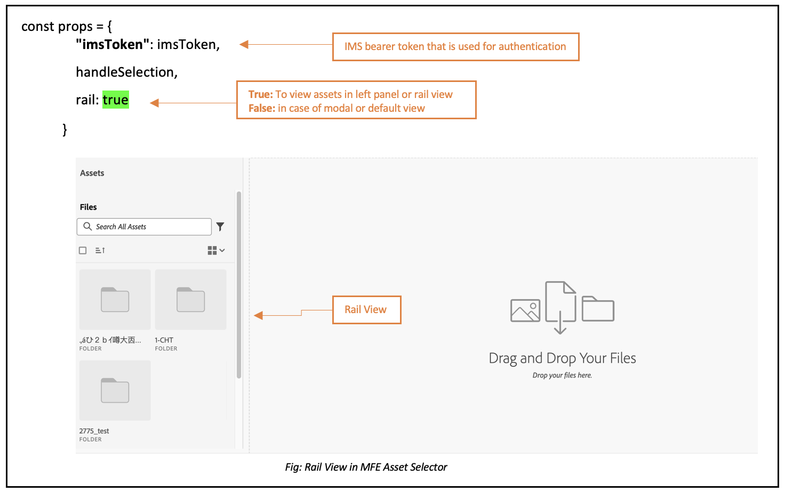

# Seletor de ativo micro-fronteira {#Overview}

O Seletor de ativos de micro-fronteira fornece uma interface de usuário que se integra facilmente ao [!DNL Experience Manager Assets as a Cloud Service] repositório para que você possa navegar ou pesquisar ativos digitais disponíveis no repositório e usá-los em sua experiência de criação de aplicativos.

A interface do usuário do MicroFrontend é disponibilizada na experiência do aplicativo usando o pacote Seletor de ativo. Todas as atualizações no pacote são automaticamente importadas e o Seletor de ativos implantado mais recente é carregado automaticamente em seu aplicativo.


O Seletor de ativo oferece muitos benefícios, como:

* Facilidade de integração com qualquer um dos aplicativos Adobe ou não Adobe usando a biblioteca JavaScript Vanilla.
* Fácil de manter como atualizações no pacote Seletor de ativos são implantadas automaticamente no Seletor de ativos disponível para seu aplicativo. Não são necessárias atualizações no seu aplicativo para carregar as modificações mais recentes.
* Facilidade de personalização, pois há propriedades disponíveis que controlam a exibição do Seletor de ativo no aplicativo.

* Pesquisa de texto completo, filtros prontos e personalizados para navegar rapidamente até ativos para uso na experiência de criação.

* Capacidade de alternar repositórios em uma organização IMS para seleção de ativos.

* Capacidade de classificar ativos por nome, dimensões e tamanho e exibi-los em Lista, Grade, Galeria ou Visualização de cascata.

Execute as seguintes tarefas para integrar e usar o Seletor de ativos com seu [!DNL Experience Manager Assets as a Cloud Service] repositório:

* [Integrar o Seletor de ativos usando o Vanilla JS](#integration-with-vanilla-js)
* [Definir propriedades de exibição do Seletor de ativos](#asset-selector-properties)
* [Usar o Seletor de ativos](#using-asset-selector)

## Integrar o Seletor de ativos usando o Vanilla JS {#integration-with-vanilla-js}

É possível integrar qualquer [!DNL Adobe] ou não Adobe com [!DNL Experience Manager Assets] como [!DNL Cloud Service] e selecione ativos no aplicativo.

A integração é feita importando o pacote Seletor de ativos e se conectando aos Ativos as a Cloud Service usando a biblioteca JavaScript Baunilha. Você precisa editar um `index.html` ou qualquer arquivo apropriado em seu aplicativo para -
* Definir os detalhes de autenticação
* Acesse o repositório as a Cloud Service do Assets
* Configurar as propriedades de exibição do Seletor de ativos

<!--
Asset Selector supports authentication to the [!DNL Experience Manager Assets] as a [!DNL Cloud Service] repository using Identity Management System (IMS) properties such as `imsScope` or `imsClientID`. Authentication using these IMS properties is referred to as SUSI (Sign Up Sign In) flow in this article.

You can perform authentication without defining some of the IMS properties, such as `imsScope` or `imsClientID`, if:

*   You are integrating an [!DNL Adobe] application on [Unified Shell](https://experienceleague.adobe.com/docs/experience-manager-cloud-service/content/overview/aem-cloud-service-on-unified-shell.html?lang=en).
*   You already have an IMS token generated for authentication.

Accessing [!DNL Experience Manager Assets] as a [!DNL Cloud Service] repository without defining `imsScope` or `imsClientID` IMS properties is referred to as a non-SUSI flow in this article.
-->

Você pode realizar a autenticação sem definir algumas propriedades do IMS, se:

* Você está integrando um [!DNL Adobe] pedido em [Shell Unificado](https://experienceleague.adobe.com/docs/experience-manager-cloud-service/content/overview/aem-cloud-service-on-unified-shell.html?lang=en).
* Você já tem um token IMS gerado para autenticação.

## Pré-requisitos {#prerequisites}

<!--
If your application requires user based authentication, out-of-the-box Asset Selector also supports a flow for authentication to the [!DNL Experience Manager Assets] as a [!DNL Cloud Service] repository using Identity Management System (IMS.)

You can use properties such as `imsScope` or `imsClientID` to retrieve `imsToken` automatically. You can use SUSI (Sign Up Sign In) flow and IMS properties. Also, you can obtain your own imsToken and pass it to Asset Selector by integrating within [!DNL Adobe] application on Unified Shell or if you already have an imsToken obtained via other methods (for example, using technical account). Accessing [!DNL Experience Manager Assets] as a [!DNL Cloud Service] repository without defining IMS properties (For example, `imsScope` and `imsClientID`) is referred to as a non-SUSI flow.
-->

Defina os pré-requisitos na variável `index.html` arquivo ou arquivo semelhante na implementação do aplicativo para definir os detalhes de autenticação para acessar o [!DNL Experience Manager Assets] como [!DNL Cloud Service] repositório. Os pré-requisitos incluem:
* imsOrg
* imsToken
* apikey

<!--
The prerequisites vary if you are authenticating using a SUSI flow or a non-SUSI flow.

**Non-SUSI flow**

*   imsOrg
*   imsToken
*   apikey

For more information on these properties, refer to [Asset Selector Properties](#asset-selector-properties).

**SUSI flow**

*   imsClientId
*   imsScope
*   redirectUrl
*   imsOrg
*   apikey

For more information on these properties, refer to [Example for the SUSI flow](#susi-vanilla) and [Asset Selector Properties](#asset-selector-properties).
-->

## Instalação {#installation}

Os Seletores de ativos estão disponíveis por meio do ESM CDN (por exemplo, [esm.sh](https://esm.sh/)/[skypack](https://www.skypack.dev/)) e [UMD](https://github.com/umdjs/umd) versão.

Em navegadores que usam **Versão UMD** (recomendado):

```
<script src="https://experience.adobe.com/solutions/CQ-assets-selectors/assets/resources/assets-selectors.js"></script>

<script>
  const { renderAssetSelector } = PureJSSelectors;
</script>
```

Em navegadores com `import maps` suporte usando **Versão do ESM CDN**:

```
<script type="module">
  import { AssetSelector } from 'https://experience.adobe.com/solutions/CQ-assets-selectors/assets/resources/@assets/selectors/index.js'
</script>
```

No Deno/Webpack Module Federation usando **Versão do ESM CDN**:

```
import { AssetSelector } from 'https://experience.adobe.com/solutions/CQ-assets-selectors/assets/resources/@assets/selectors/index.js'
```

### Tipo de ativo selecionado {#selected-asset-type}

O Tipo de ativo selecionado é uma matriz de objetos que contém as informações do ativo ao usar o `handleSelection`, `handleAssetSelection`e `onDrop` funções.

**Sintaxe do esquema**

```
interface SelectedAsset {
    'repo:id': string;
    'repo:name': string;
    'repo:path': string;
    'repo:size': number;
    'repo:createdBy': string;
    'repo:createDate': string;
    'repo:modifiedBy': string; 
    'repo:modifyDate': string; 
    'dc:format': string; 
    'tiff:imageWidth': number;
    'tiff:imageLength': number;
    'repo:state': string;
    computedMetadata: Record<string, any>;
    _links: {
        'http://ns.adobe.com/adobecloud/rel/rendition': Array<{
            href: string;
            type: string;
            'repo:size': number;
            width: number;
            height: number;
            [others: string]: any;
        }>;
    };
}
```

A tabela a seguir descreve algumas das propriedades importantes do objeto Ativos selecionados .

| Propriedade | Tipo | Explicação |
|---|---|---|
| *repo:repositoryId* | string | Identificador exclusivo para o repositório onde o ativo está armazenado. |
| *repo:id* | string | Identificador exclusivo para o ativo. |
| *repo:assetClass* | string | A classificação do ativo (por exemplo, imagem ou vídeo, documento). |
| *repo:name* | string | O nome do ativo, incluindo a extensão de arquivo. |
| *acordo de recompra:tamanho* | número | O tamanho do ativo em bytes. |
| *repo:path* | string | O local do ativo no repositório. |
| *repo:ancestrais* | `Array<string>` | Uma matriz de itens ancestrais para o ativo no repositório. |
| *repo:state* | string | Estado atual do ativo no repositório (por exemplo, ativo, excluído etc.). |
| *repo:createdBy* | string | O usuário ou sistema que criou o ativo. |
| *repo:createDate* | string | A data e a hora em que o ativo foi criado. |
| *repo:modifiedBy* | string | O usuário ou sistema que modificou o ativo pela última vez. |
| *repo:modifyDate* | string | A data e a hora em que o ativo foi modificado pela última vez. |
| *dc:format* | string | O formato do ativo, como o tipo de arquivo (por exemplo, JPEG, PNG etc.). |
| *tiff:imageWidth* | número | A largura de um ativo. |
| *tiff:imageLength* | número | A altura de um ativo. |
| *computedMetadata* | `Record<string, any>` | Um objeto que representa um compartimento para todos os metadados do ativo de todos os tipos (repositório, aplicativo ou metadados incorporados). |
| *_links* | `Record<string, any>` | Links de hipermídia para o ativo associado. Inclui links para recursos, como metadados e representações. |
| *_links.http://ns.adobe.com/adobecloud/rel/rendition* | `Array<Object>` | Matriz de objetos que contém informações sobre representações do ativo. |
| *_links.http://ns.adobe.com/adobecloud/rel/rendition[].href* | string | O URI para a representação. |
| *_links.http://ns.adobe.com/adobecloud/rel/rendition[].type* | string | O tipo MIME da representação. |
| *_links.http://ns.adobe.com/adobecloud/rel/rendition[].&quot;repo:size&#39;* | número | O tamanho da representação em bytes. |
| *_links.http://ns.adobe.com/adobecloud/rel/rendition[].width* | número | A largura da representação. |
| *_links.http://ns.adobe.com/adobecloud/rel/rendition[].height* | número | A altura da representação. |

Para obter uma lista completa das propriedades e um exemplo detalhado, visite [Exemplo de código do seletor de ativos](https://github.com/adobe/aem-assets-selectors-mfe-examples).

<!--
### ImsAuthProps {#ims-auth-props}

The `ImsAuthProps` properties define the authentication information and flow that the Asset Selector uses to obtain an `imsToken`. By setting these properties, you can control how the authentication flow should behave and register listeners for various authentication events.

| Property Name | Description|
|---|---|
| `imsClientId`| A string value representing the IMS client ID used for authentication purposes. This value is provided by Adobe and is specific to your Adobe AEM CS organization.|
| `imsScope`| Describes the scopes used in authentication. The scopes determine the level of access that the application has to your organization resources. Multiple scopes can be separated by commas.|
| `redirectUrl` | Represents the URL where the user is redirected after authentication. This value is typically set to the current URL of the application. If a `redirectUrl` is not supplied, `ImsAuthService` will use the redirectUrl used to register the `imsClientId`|
| `modalMode`| A boolean indicating whether the authentication flow should be displayed in a modal (pop-up) or not. If set to `true`, the authentication flow is displayed in a pop-up. If set to `false`, the authentication flow is displayed in a full page reload. _Note:_ for better UX, you can dynamically control this value if the user has browser pop-up disabled. |
| `onImsServiceInitialized`| A callback function that is called when the Adobe IMS authentication service is initialized. This function takes one parameter, `service`, which is an object representing the Adobe IMS service. See [`ImsAuthService`](#imsauthservice-ims-auth-service) for more details.|
| `onAccessTokenReceived`| A callback function that is called when an `imsToken` is received from the Adobe IMS authentication service. This function takes one parameter, `imsToken`, which is a string representing the access token. |
| `onAccessTokenExpired`| A callback function that is called when an access token has expired. This function is typically used to trigger a new authentication flow to obtain a new access token. |
| `onErrorReceived`| A callback function that is called when an error occurs during authentication. This function takes two parameters: the error type and error message. The error type is a string representing the type of error and the error message is a string representing the error message. |

### ImsAuthService {#ims-auth-service}

`ImsAuthService` class handles the authentication flow for the Asset Selector. It is responsible for obtaining an `imsToken` from the Adobe IMS authentication service. The `imsToken` is used to authenticate the user and authorize access to the Adobe Experience Manager (AEM) CS Assets repository. ImsAuthService uses the `ImsAuthProps` properties to control the authentication flow and register listeners for various authentication events. You can use the convenient [`registerAssetsSelectorsAuthService`](#purejsselectorsregisterassetsselectorsauthservice) function to register the _ImsAuthService_ instance with the Asset Selector. The following functions are available on the `ImsAuthService` class. However, if you're using the _registerAssetsSelectorsAuthService_ function, you do not need to call these functions directly.

| Function Name | Description |
|---|---|
| `isSignedInUser` | Determines whether the user is currently signed in to the service and returns a boolean value accordingly.|
| `getImsToken`    | Retrieves the authentication `imsToken` for the currently signed-in user, which can be used to authenticate requests to other services such as generating asset _rendition.|
| `signIn`| Initiates the sign-in process for the user. This function uses the `ImsAuthProps` to show authentication in either a pop-up or a full page reload |
| `signOut`| Signs the user out of the service, invalidating their authentication token and requiring them to sign in again to access protected resources. Invoking this function will reload the current page.|
| `refreshToken`| Refreshes the authentication token for the currently signed-in user, preventing it from expiring and ensuring uninterrupted access to protected resources. Returns a new authentication token that can be used for subsequent requests. |
-->

### Exemplo para o fluxo não-SUSI {#non-susi-vanilla}

Este exemplo demonstra como usar o Seletor de ativo com um fluxo não SUSI ao executar um [!DNL Adobe] aplicativo no Unified Shell ou quando você já tiver `imsToken` gerado para autenticação.

Inclua o pacote do Seletor de ativos no seu código usando a `script` conforme mostrado em _linhas 6 a 15_ do exemplo abaixo. Depois que o script for carregado, a variável `PureJSSelectors` a variável global está disponível para uso. Definir o Seletor de ativos [propriedades](#asset-selector-properties) conforme mostrado em _linhas 16 a 23_. O `imsOrg` e `imsToken` ambas as propriedades são necessárias para autenticação em fluxo que não seja SUSI. O `handleSelection` é usada para lidar com os ativos selecionados. Para renderizar o Seletor de ativos, chame a função `renderAssetSelector` como mencionado em _linha 17_. O Seletor de ativos é exibido na `<div>` elemento do contêiner, como mostrado em _linhas 21 e 22_.

Ao seguir essas etapas, você pode usar o Seletor de ativos com um fluxo não SUSI em [!DNL Adobe] aplicativo.

```html {line-numbers="true"}
<!DOCTYPE html>
<html>
<head>
    <title>Asset Selector</title>
    <script src="https://experience.adobe.com/solutions/CQ-assets-selectors/assets/resources/assets-selectors.js"></script>
    <script>
        // get the container element in which we want to render the AssetSelector component
        const container = document.getElementById('asset-selector-container');
        // imsOrg and imsToken are required for authentication in non-SUSI flow
        const assetSelectorProps = {
            imsOrg: 'example-ims@AdobeOrg',
            imsToken: "example-imsToken",
            apiKey: "example-apiKey-associated-with-imsOrg",
            handleSelection: (assets: SelectedAssetType[]) => {},
        };
        // Call the `renderAssetSelector` available in PureJSSelectors globals to render AssetSelector
        PureJSSelectors.renderAssetSelector(container, assetSelectorProps);
    </script>
</head>

<body>
    <div id="asset-selector-container" style="height: calc(100vh - 80px); width: calc(100vw - 60px); margin: -20px;">
    </div>
</body>

</html>
```

Para obter um exemplo detalhado, visite [Exemplo de código do seletor de ativos](https://github.com/adobe/aem-assets-selectors-mfe-examples).

<!--
### Example for the SUSI flow {#susi-vanilla}

Use this example `index.html` file for authentication if you are integrating your application using SUSI flow.

Access the Asset Selector package using the `Script` Tag, as shown in *line 9* to *line 11* of the example `index.html` file.

*Line 14* to *line 38* of the example describes the IMS flow properties, such as `imsClientId`, `imsScope`, and `redirectURL`. The function requires that you define at least one of the `imsClientId` and `imsScope` properties. If you do not define a value for `redirectURL`, the registered redirect URL for the client ID is used.

As you do not have an `imsToken` generated, use the `registerAssetsSelectorsAuthService` and `renderAssetSelectorWithAuthFlow` functions, as shown in line 40 to line 50 of the example `index.html` file. Use the `registerAssetsSelectorsAuthService` function before `renderAssetSelectorWithAuthFlow` to register the `imsToken` with the Asset Selector. [!DNL Adobe] recommends to call `registerAssetsSelectorsAuthService` when you instantiate the component.

Define the authentication and other Assets as a Cloud Service access-related properties in the `const props` section, as shown in *line 54* to *line 60* of the example `index.html` file.

The `PureJSSelectors` global variable, mentioned in *line 65*, is used to render the Asset Selector in the web browser.

Asset Selector is rendered on the `<div>` container element, as mentioned in *line 74* to *line 81*. The example uses a dialog to display the Asset Selector.

```html {line-numbers="true"}
<!DOCTYPE html>
<html>

<head>
    <meta http-equiv="X-UA-Compatible" content="IE=edge">
    <meta charset="utf-8">
    <title>Asset Selectors</title>
    <link rel="stylesheet" href="index.css">
    <script id="asset-selector"
        src="https://experience.adobe.com/solutions/CQ-assets-selectors/assets/resources/asset-selectors.js"></script>
    <script>

        const imsProps = {
            imsClientId: "<obtained from IMS team>",
            imsScope: "openid, <other scopes>",
            redirectUrl: window.location.href,
            modalMode: true, // false to open in a full page reload flow
            onImsServiceInitialized: (service) => {
                // invoked when the ims service is initialized and is ready
                console.log("onImsServiceInitialized", service);
            },
            onAccessTokenReceived: (token) => {
                console.log("onAccessTokenReceived", token);
            },
            onAccessTokenExpired: () => {
                console.log("onAccessTokenError");
                // re-trigger sign-in flow
            },
            onErrorReceived: (type, msg) => {
                console.log("onErrorReceived", type, msg);
            },
        }

        function load() {
            const registeredTokenService = PureJSSelectors.registerAssetsSelectorsAuthService(imsProps);
            imsInstance = registeredTokenService;
        };

        // initialize the IMS flow before attempting to render the asset selector
        load();
        

        //function that will render the asset selector
            const otherProps = {
            // any other props supported by asset selector
            }
            const assetSelectorProps = {
                "imsOrg": "imsorg",
                ...otherProps
            }
             // container element on which you want to render the AssetSelector/DestinationSelector component
            const container = document.getElementById('asset-selector');

            /// Use the PureJSSelectors in globals to render the AssetSelector/DestinationSelector component
            PureJSSelectors.renderAssetSelectorWithAuthFlow(container, assetSelectorProps, () => {
                const assetSelectorDialog = document.getElementById('asset-selector-dialog');
                assetSelectorDialog.showModal();
            });
        }
    </script>

</head>
<body class="asset-selectors">
    <div>
        <button onclick="renderAssetSelectorWithAuthFlowFlow()">Asset Selector - Select Assets with Ims Flow</button>
    </div>
        <dialog id="asset-selector-dialog">
            <div id="asset-selector" style="height: calc(100vh - 80px); width: calc(100vw - 60px); margin: -20px;">
            </div>
        </dialog>
    </div>
</body>

</html>

```
-->

## Usar as propriedades do Seletor de ativos {#asset-selector-properties}

Você pode usar as propriedades do Seletor de ativos para personalizar a forma como o Seletor de ativos é renderizado. A tabela a seguir lista as propriedades que podem ser usadas para personalizar e usar o Seletor de ativos.

| Propriedade | Tipo | Obrigatório | Padrão | Descrição |
|---|---|---|---|---|
| *trilho* | booleano | Não | falso | Se marcada `true`, o Seletor de ativos será renderizado em uma exibição no painel esquerdo. Se estiver marcado `false`, o Seletor de ativos será renderizado na exibição modal. |
| *imsOrg* | string | Sim |  | ID do Sistema Adobe Identity Management (IMS) atribuída durante o provisionamento [!DNL Adobe Experience Manager] como [!DNL Cloud Service] para sua organização. O `imsOrg` é necessária para autenticar se a organização que você está acessando está ou não no Adobe IMS. |
| *imsToken* | string | Não |  | Token portador IMS usado para autenticação. `imsToken` não é necessário se você estiver usando o fluxo SUSI. No entanto, é necessário se você estiver usando o fluxo não-SUSI. |
| *apiKey* | string | Não |  | Chave da API usada para acessar o serviço AEM Discovery. `apiKey` não é necessário se você estiver usando o fluxo SUSI. No entanto, é necessário em fluxo não-SUSI. |
| *rootPath* | string | Não | /content/dam/ | Caminho da pasta a partir da qual o Seletor de ativos exibe seus ativos. `rootPath` também pode ser usado na forma de encapsulamento. Por exemplo, considerando o seguinte caminho, `/content/dam/marketing/subfolder/`, o Seletor de ativos não permite navegar por qualquer pasta pai, mas exibe apenas as pastas filhas. |
| *caminho* | string | Não |  | Caminho usado para navegar até um diretório específico de ativos quando o Seletor de ativos é renderizado. |
| *filterSchema* | array | Não |  | Modelo usado para configurar propriedades de filtro. Isso é útil quando você deseja limitar determinadas opções de filtro no Seletor de ativo. |
| *filterFormProps* | Objeto | Não |  | Especifique as propriedades de filtro que você precisa usar para refinar sua pesquisa. Por exemplo, JPG do tipo MIME, PNG, GIF. |
| *seletedAssets* | Matriz `<Object>` | Não |  | Especifique os ativos selecionados quando o Seletor de ativos for renderizado. É necessária uma matriz de objetos que contenha uma propriedade id dos ativos. Por exemplo, `[{id: 'urn:234}, {id: 'urn:555'}]` Um ativo deve estar disponível no diretório atual. Se precisar usar um diretório diferente, forneça um valor para a variável `path` também. |
| *acvConfig* | Objeto | Não |  | Propriedade Exibição da coleção de ativos que contém o objeto que contém a configuração personalizada para substituir os padrões. |
| *i18nSymbols* | `Object<{ id?: string, defaultMessage?: string, description?: string}>` | Não |  | Se as traduções do OOTB forem insuficientes para as necessidades do seu aplicativo, você poderá expor uma interface através da qual poderá passar seus próprios valores localizados personalizados através do `i18nSymbols` prop. Passar um valor por essa interface substitui as traduções padrão fornecidas e, em vez disso, usa as suas próprias.  Para executar a substituição, você deve passar um valor válido [Descritor de Mensagens](https://formatjs.io/docs/react-intl/api/#message-descriptor) à chave de `i18nSymbols` que você deseja substituir. |
| *intl* | Objeto | Não |  | O Seletor de ativo fornece traduções padrão de OOTB. Você pode selecionar o idioma de tradução fornecendo uma string de local válida por meio do `intl.locale` prop. Por exemplo: `intl={{ locale: "es-es" }}` </br></br> As strings de localidade compatíveis seguem o [ISO 639 - Códigos](https://www.iso.org/iso-639-language-codes.html) para a representação dos nomes das normas linguísticas. </br></br> Lista de localidades suportadas: Inglês - &#39;en-us&#39; (padrão) Espanhol - &#39;es-es&#39; Alemão - &#39;de-de&#39; Francês - &#39;fr-fr&#39; Italiano - &#39;it-it&#39; Japonês - &#39;ja-jp&#39; Coreano - &#39;ko-kr&#39; Português - &#39;pt-br&#39; Chinês (Tradicional) - &#39;zh-cn&#39; Chinês (Taiwan) - &#39;zh-tw&#39; |
| *repositoryId* | string | Não | &#39;&#39; | Repositório de onde o Seletor de ativos carrega o conteúdo. |
| *additionalAemSolutions* | `Array<string>` | Não | [ ] | Ele permite adicionar uma lista de repositórios de AEM adicionais. Se nenhuma informação for fornecida nessa propriedade, somente biblioteca de mídia ou repositórios AEM Assets serão considerados. |
| *hideTreeNavigation* | booleano | Não |  | Especifica se exibe ou oculta a barra lateral de navegação da árvore de ativos. Ela é usada somente na exibição modal e, portanto, não há efeito dessa propriedade na exibição do painel. |
| *onDrop* | Função | Não |  | A propriedade permite a funcionalidade de soltar de um ativo. |
| *dropOptions* | `{allowList?: Object}` | Não |  | Configura as opções de soltar usando &#39; lista de permissões&#39;. |
| *colorScheme* | string | Não |  | Configurar tema (`light` ou `dark`) para o Seletor de ativos. |
| *handleSelection* | Função | Não |  | Invocado com matriz de itens de Ativo quando os ativos são selecionados e o `Select` no modal é clicado. Essa função só é invocada na exibição modal. Para exibição de painel, use a variável `handleAssetSelection` ou `onDrop` funções. Exemplo: <pre>handleSelection=(assets: Ativo[])=> {...}</pre> Consulte [Tipo de ativo selecionado](#selected-asset-type) para obter detalhes. |
| *handleAssetSelection* | Função | Não |  | Invocado com matriz de itens, pois os ativos estão sendo selecionados ou não. Isso é útil quando você deseja acompanhar os ativos conforme o usuário os seleciona. Exemplo: <pre>handleSelection=(assets: Ativo[])=> {...}</pre> Consulte [Tipo de ativo selecionado](#selected-asset-type) para obter detalhes. |
| *onClose* | Função | Não |  | Invocado quando `Close` na exibição modal é pressionado. Isso só é chamado em `modal` e ignoradas em `rail` exibir. |
| *onFilterSubmit* | Função | Não |  | Invocado com itens de filtro quando o usuário altera critérios de filtro diferentes. |
| *selectionType* | string | Não | individual | Configuração para `single` ou `multiple` seleção de ativos de cada vez. |

## Exemplos para usar as propriedades do Seletor de ativos {#usage-examples}

É possível definir o Seletor de ativos [propriedades](#asset-selector-properties) no `index.html` arquivo para personalizar a exibição do Seletor de ativo em seu aplicativo.

### Exemplo 1: Seletor de ativos na exibição do painel



Se o valor do AssetSeletor `rail` está definida como `false` ou não for mencionado nas propriedades, o Seletor de ativo é exibido na exibição Modal por padrão.

<!--
### Example 2: Use selectedAssets property in addition to the path property

Use the `path` property to define the folder name that displays automatically when the Asset Selector is rendered. In addition, use the `selectedAssets` property to define the IDs for the assets that you need to select within the folder. Moreover, when you want to display assets that are pre-defined within the folder, you can use selectedAssets property.

   
-->

### Exemplo 2: Fornecedor de metadados

Use várias propriedades para definir metadados de um ativo que deseja exibir usando um ícone de informações. O provedor de informações fornece a coleção de informações sobre o ativo ou a pasta, incluindo o título, as dimensões, a data de modificação, o local e a descrição de um ativo. No exemplo abaixo, várias propriedades são usadas para exibir metadados de um ativo, por exemplo, `repo:path` especifica o local de um ativo. <!--`repo` represents the repository from where the asset is showing, whereas, `path` represents the route from where the asset or folder is rendered.-->


### Exemplo 3: Propriedade de filtro personalizada na exibição de painel

Além da pesquisa facetada, o Seletor de ativos permite personalizar vários atributos para refinar sua pesquisa do [!DNL Adobe Experience Manager] como [!DNL Cloud Service] aplicativo. Você precisa adicionar o seguinte código para adicionar filtros de pesquisa personalizados em seu aplicativo. No exemplo abaixo, a variável `Type Filter` pesquise que filtra o tipo de ativo entre Imagens, Documentos ou Vídeos ou o tipo de filtro adicionado para a pesquisa.


<!--

## Customization after integrating Asset Selector 

### Custom metadata

Assets display panel shows the out of the box metadata that can be displayed in the info of the asset. In addition to this, [!DNL Adobe Experience Manager] as a [!DNL Cloud Service] application allows configuration of the asset selector by adding custom metadata that is shown in info panel of the asset.
-->

<!-- Property details to be added here. Referred the ticket https://jira.corp.adobe.com/browse/ASSETS-19023-->

<!--
## Asset Selector Object Schema {#object-schema}

Schema describes the object properties associated with an asset selected using Asset Selector. It uses the combination of data types and their values to validate the object describing the selected Asset using an Asset Selector.

**Schema Syntax**
````
interface SelectedAsset {
    'repo:id': string;
    'repo:name': string;
    'repo:path': string;
    'repo:size': number;
    'repo:createdBy': string;
    'repo:createDate': string;
    'repo:modifiedBy': string; 
    'repo:modifyDate': string; 
    'dc:format': string; 
    'tiff:imageWidth': number;
    'tiff:imageLength': number;
    'repo:state': string;
    computedMetadata: Record<string, any>;
    _links: {
        'http://ns.adobe.com/adobecloud/rel/rendition': Array<{
            href: string;
            type: string;
            'repo:size': number;
            width: number;
            height: number;
            [others: string]: any;
        }>;
    };
}
````

**Query Parameters**

| Parameter | Type | Description |
|---|---|---|
| repo:id | string | ID of an Asset |
| repo:name | string | The name of an Asset |
| repo:path | string | The path of an Asset |
| repo:size | number | Size of an Asset (in bytes) |
| repo:createdBy | string | ID of a user who created an Asset |
| repo: createdDate | string | The timestamp when an asset was created |
| repo:modifiedBy | string | ID of a user who modified the asset recently |
| repo:modifyDate | string | The timestamp when the asset was last modified |
| dc:format | string | MIME type of an Asset |
| tiff:imageWidth | number | The width of an image type of Asset |
| tiff:imageLength | number | The height of an image type of Asset |
| repo:state | string | The `Approved`, `Rejected`, or `Expired`state of an Asset |
| computedMetadata | string | It is an object that represents a bucket for all the Asset's metadata of all kinds (repository, application or embedded metadata) |
| _links | string | It represents the collection of links used in the Asset Selector. The links are represented in the form of an array. The parameters of an array include: `href`, `type`, `repo:size`, `width`, `height`, etc.  |

For the detailed example of Object Schema, click 
-->

## Manipulação da seleção de Ativos usando o Esquema de Objeto {#handling-selection}

O `handleSelection` é usada para lidar com seleções únicas ou múltiplas de Ativos no Seletor de ativos. O exemplo abaixo indica a sintaxe do uso de `handleSelection`.


## Uso do Seletor de ativos {#using-asset-selector}

Depois que o Seletor de ativos estiver configurado e você estiver autenticado para usar o Seletor de ativos com seu [!DNL Adobe Experience Manager] como [!DNL Cloud Service] , você pode selecionar ativos ou executar várias outras operações para pesquisar seus ativos no repositório.


* **A**: [Ocultar/Mostrar painel](#hide-show-panel)
* **B**: [Seletor de repositório](#repository-switcher)
* **C**: [Ativos](#repository)
* **D**: [Filtros](#filters)
* **E**: [Barra de pesquisa](#search-bar)
* **F**: [Classificação](#sorting)
* **G**: [Classificação em ordem crescente ou decrescente](#sorting)
* **H**: [Exibir](#types-of-view)

### Ocultar/Mostrar painel {#hide-show-panel}

Para ocultar pastas na navegação à esquerda, clique em **[!UICONTROL Ocultar pastas]** ícone . Para desfazer as alterações, clique no botão **[!UICONTROL Ocultar pastas]** ícone novamente.

### Seletor de repositório {#repository-switcher}

O Seletor de ativos também permite alternar repositórios para a seleção de ativos. Você pode selecionar o repositório de sua escolha no menu suspenso disponível no painel esquerdo. As opções de repositório disponíveis na lista suspensa são baseadas no `repositoryId` definida na variável `index.html` arquivo. É baseado nos ambientes da organização IMS selecionada, acessada pelo usuário conectado. Os consumidores podem passar uma `repositoryID` e, nesse caso, o Seletor de ativos para de renderizar o alternador de acordos de recompra e renderizar ativos somente do repositório em questão.
<!--
It is based on the `imsOrg` that is provided in the application. If you want to see the list of repositories, then `repositoryId` is required to view those specific repositories in your application.
-->

### Repositório de ativos

É uma coleção de pastas de ativos que você pode usar para executar operações.

### Filtros prontos para uso {#filters}

O Seletor de ativo também fornece opções de filtro prontas para uso para refinar seus resultados de pesquisa. Os seguintes filtros estão disponíveis:

* `File type`: inclui pasta, arquivo, imagens, documentos ou vídeo
* `MIME type`: inclui JPG, GIF, PPTX, PNG, MP4, DOCX, TIFF, PDF, XLSX
* `Image Size`: inclui largura mínima/máxima, altura mínima/máxima da imagem


### Pesquisa personalizada

Além da pesquisa de texto completo, o Seletor de ativos permite pesquisar ativos nos arquivos usando a pesquisa personalizada. Você pode usar filtros de pesquisa personalizados nos modos de exibição Modal e Exibição de painel .


Também é possível criar um filtro de pesquisa padrão para salvar os campos que você procura com frequência e usá-los posteriormente. Para criar uma pesquisa personalizada para seus ativos, você pode usar `filterSchema` propriedade.

### Barra de pesquisa {#search-bar}

O Seletor de ativos permite executar a pesquisa de texto completo de ativos no repositório selecionado. Por exemplo, se você digitar a palavra-chave `wave` na barra de pesquisa, todos os ativos com a variável `wave` palavra-chave mencionada em qualquer uma das propriedades de metadados é exibida.

### Classificação {#sorting}

Você pode classificar ativos no Seletor de ativo por nome, dimensões ou tamanho de um ativo. Também é possível classificar os ativos em ordem crescente ou decrescente.

### Tipos de visualização {#types-of-view}

O Seletor de ativo permite exibir o ativo em quatro exibições diferentes:

* ** [!UICONTROL Exibição de lista]**: A exibição de lista exibe arquivos e pastas roláveis em uma única coluna.
* ** [!UICONTROL Exibição de Grade]**: A exibição em grade exibe arquivos e pastas roláveis em uma grade de linhas e colunas.
* ** [!UICONTROL Exibição da Galeria]**: A exibição de galeria exibe arquivos ou pastas em uma lista horizontal bloqueada no centro.
* ** [!UICONTROL Exibição de cascata]**: A exibição de cascata exibe arquivos ou pastas no formato de um Bridge.

<!--
### Modes to view Asset Selector

Asset Selector supports two types of out of the box views:

**  Modal view or Inline view:** The modal view or inline view is the default view of Asset Selector that represents Assets folders in the front area. The modal view allows users to view assets in a full screen to ease the selection of multiple assets for import. Use `<AssetSelector rail={false}>` to enable modal view.

    

**  Rail view:** The rail view represents Assets folders in a left panel. The drag and drop of assets can be performed in this view. Use `<AssetSelector rail={true}>` to enable rail view.

    
-->
<!--

### Application Integration

Asset Selector is flexible and can be integrated within your existing [!DNL Adobe Experience Manager] as a [!DNL Cloud Service] application. It is accessible and localized to add, search, and select assets in your application. With Asset Selector you can:
*   **Configure** You can configure the files/folders that you want to show at the upfront. The assets that are chosen to view can be of any supported formats, for example, JPEG. It allows you to control the display of various text or symbols as per your choice.
*   **Perfect fit** Asset selector easily fits in your existing [!DNL Adobe Experience Manager] as a [!DNL Cloud Service] application and choose the way you want to view. The mode of view can be inline, rail, or modal view.
*   **Accessible** With Asset Selector, you can reach the desired asset in an easy manner.
*   **Localize** Assets can be availed for the various locales available as per Adobe's localization standards.
-->
<!--

### Support for multiple instances

The micro front-end design supports the display of multiple instances of Asset Selector on a single screen.


-->

<!--

### Controlled selection with multi-select

You can make default multi-selection of assets by specifying the assets to the component using `selectedAssets` property. You should specify an array of asset IDs. For example, `[{id: 'urn:234}, {id: 'urn:555'}].`
-->
<!--

### Action buttons

When you customize your application with Asset Selector based on ReactJS, you are provided with the following action buttons to perform various actions:
*   **Open in media library** Allows you to open the asset in media library.
*   **Upload** Allows you to upload an asset directly.
*   **Download** Downloads the asset in [!DNL Adobe Experience Manager] as a [!DNL Cloud Service].
-->
<!--

### Status of an asset

Asset Selector allows you to know the status of your uploaded assets. The status can be `Approved`, `Rejected`, or `Expired` of the asset. 
-->
<!--

### Localization

The integration of Asset Selector with [!DNL Adobe Experience Manager] as a [!DNL Cloud Service] allows localized content appear in your application.
-->