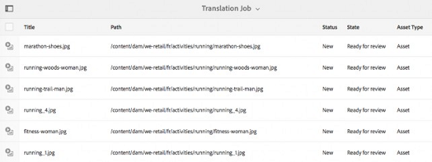

# Insights de ativos {#asset-insights}

| Versão | Link do artigo |
| -------- | ---------------------------- |
| AEM 6.5 | [Clique aqui](https://experienceleague.adobe.com/docs/experience-manager-65/assets/managing/asset-insights.html?lang=en) |
| AEM as a Cloud Service | Este artigo |

A funcionalidade do Assets Insights permite rastrear classificações de usuários e estatísticas de uso de imagens usadas em sites de terceiros, campanhas de marketing e soluções criativas de Adobe. Ele ajuda a fornecer insights sobre o desempenho e a popularidade das imagens.

O Assets Insights captura detalhes da atividade do usuário, como o número de vezes que uma imagem é classificada, clicada e impressões (número de vezes que uma imagem é carregada no site). Ele atribui pontuações a imagens com base nessas estatísticas. Você pode usar as pontuações e as estatísticas de desempenho para selecionar imagens populares para inclusão em catálogos, campanhas de marketing e assim por diante. Você pode até mesmo formular políticas de arquivamento e renovação de licença com base nessas estatísticas.

Para que o Assets Insights capture estatísticas de uso de imagens de um site, você deve incluir o código incorporado da imagem no código do site.

Para permitir que o Assets Insights exiba estatísticas de uso de ativos, primeiro configure o recurso para buscar dados de relatórios do [!DNL Adobe Analytics]. Para obter detalhes, consulte [Configurar insights do Assets](#configure-asset-insights). Para usar este recurso, compre [!DNL Adobe Analytics] licença separadamente.

>[!NOTE]
>
>Os insights são compatíveis e fornecidos apenas para imagens.

## Exibir estatísticas de uma imagem {#viewing-statistics-for-an-image}

Você pode exibir as pontuações dos Insights do Assets na página de metadados.

1. Na interface do Assets, selecione a imagem e clique em **[!UICONTROL Propriedades]** na barra de ferramentas.
1. Na página Propriedades, clique em **[!UICONTROL Insights]**.
1. Revise os detalhes de uso do ativo no **[!UICONTROL Insights]** guia. A variável **[!UICONTROL Pontuação]** A seção descreve o uso total de ativos e os repositórios de desempenho de um ativo.

   A pontuação de uso descreve o número de vezes que o ativo é usado em várias soluções.

   A variável **[!UICONTROL Impressões]** pontuação é o número de vezes que o ativo é carregado no site. O número exibido em **[!UICONTROL Cliques]** é o número de vezes em que o ativo é clicado.

1. Revise o **[!UICONTROL Estatísticas de uso]** para saber de quais entidades o ativo fazia parte e quais soluções criativas o usaram recentemente. Quanto maior for o uso, maior será a probabilidade de o ativo ser popular entre os usuários. Os dados de uso são exibidos abaixo dos seguintes cabeçalhos:

   * **[!UICONTROL Ativo]**: o número de vezes que o ativo fez parte de uma coleção ou de um ativo composto.
   * **[!UICONTROL Web e móvel]**: o número de vezes que o ativo fez parte de sites e aplicativos.
   * **[!UICONTROL Social]**: o número de vezes que o ativo foi usado em outras soluções, como uma [!DNL Adobe Campaign].
   * **[!UICONTROL E-mail]**: o número de vezes que o ativo foi usado em campanhas de email.

   

   >[!NOTE]
   >
   >Como o recurso Insights do Assets normalmente busca os dados de Soluções do [!DNL Adobe Analytics] periodicamente, a seção Soluções pode não exibir os dados mais recentes. O período para o qual os dados são exibidos depende do agendamento da operação de busca que o Assets Insights executa para recuperar os dados do Analytics.

1. Para exibir estatísticas de desempenho do ativo graficamente durante um período de tempo, selecione o período na seção **[!UICONTROL Estatísticas de desempenho]**. Detalhes, incluindo cliques e impressões, são exibidos como linhas de tendência de um gráfico.

   

   >[!NOTE]
   >
   >Ao contrário dos dados na seção Soluções, a seção Estatísticas de desempenho exibe os dados mais recentes.

1. Para obter o código incorporado para o ativo incluído em sites para obter dados de desempenho, clique em **[!UICONTROL Obter código de inserção]** abaixo da miniatura do ativo. <!-- For more information on how to include your Embed code in third-party web pages, see [Using Page Tracker and Embed code in web pages](/help/assets/use-page-tracker.md). -->

   

## Exibir estatísticas agregadas para imagens {#viewing-aggregate-statistics-for-images}

Exiba pontuações de todos os ativos em uma pasta simultaneamente usando a **[!UICONTROL Exibição do Insights]**.

1. Na interface do usuário do Assets, navegue até a pasta que contém os ativos para os quais deseja exibir insights.
1. Clique em **[!UICONTROL Layout]** na barra de ferramentas e escolha **[!UICONTROL Visualização de insights]**.
1. A página exibe as pontuações de uso dos ativos. Compare as classificações dos vários ativos e obtenha insights.

<!-- TBD: Commenting as Web Console is not available. Document the appropriate OSGi config method if available in CS.

## Schedule background job {#scheduling-background-job}

Assets Insights fetches usage data for assets from Adobe Analytics report suites in a periodic manner. By default, Assets Insights runs a background job every 24 hours at 2 AM to the fetch data. However, you can modify both the frequency and the time by configuring the **[!UICONTROL Adobe CQ DAM Asset Performance Report Sync Job]** service from the web console.

1. Click the [!DNL Experience Manager] logo, and go to **[!UICONTROL Tools]** > **[!UICONTROL Operations]** > **[!UICONTROL Web Console]**.
1. Open the **[!UICONTROL Adobe CQ DAM Asset Performance Report Sync Job]** service configuration.

   

1. Specify the desired scheduler frequency and the start time for the job in the property scheduler expression. Save the changes.
-->

## Configurar insights do Assets {#configure-asset-insights}

[!DNL Experience Manager Assets] O busca dados de uso sobre ativos digitais usados por sites de terceiros no [!DNL Adobe Analytics]. Para permitir que o Assets Insights recupere esses dados e gere insights, primeiro configure o recurso para integrar ao [!DNL Adobe Analytics].

>[!NOTE]
>
>Os insights só são aceitos e fornecidos para imagens.

1. Entrada [!DNL Experience Manager], clique em **[!UICONTROL Ferramentas]** > **[!UICONTROL Assets]**.

   

1. Clique no cartão **[!UICONTROL Configuração do Insights]**.

1. Para obter as informações de acesso ao serviço da Web do Analytics, acesse **[!UICONTROL Analytics]** > **[!UICONTROL Admin]** > **[!UICONTROL Ferramentas administrativas]** > **[!UICONTROL Configurações da empresa]** > **[!UICONTROL Serviços da Web]** e copie o **[!UICONTROL Segredo compartilhado]** chave.

   No assistente, selecione a variável **[!UICONTROL Centro de dados]** e fornecer o nome de exibição do **[!UICONTROL Empresa]**, Serviços da Web **[!UICONTROL Nome de usuário]** e cole a variável **[!UICONTROL Segredo compartilhado]** chave.

   Clique em **[!UICONTROL Autenticar]**.

   ![Configurar o Adobe Analytics para insights do Assets no [!DNL Experience Manager]](assets/analytics-insight-config.png)

   *Figura: Configurar o Adobe Analytics para insights do Assets no[!DNL Experience Manager]*

1. Após a autenticação bem-sucedida, os conjuntos de relatórios serão listados no menu suspenso. Selecione o Adobe Analytics **[!UICONTROL Report Suite]** de onde deseja que o Assets Insights busque dados. Clique em **[!UICONTROL Adicionar]**.

1. Depois [!DNL Experience Manager] configurar seu conjunto de relatórios, clique em **[!UICONTROL Concluído]**.

Para obter mais informações, consulte [Serviços da Web da Adobe Analytics](https://experienceleague.adobe.com/docs/analytics/admin/company-settings/web-services-admin.html#api-access-information).

### Rastreador de páginas {#page-tracker}

Após configurar sua conta do Adobe Analytics, o código do Rastreador de páginas é gerado para você. Para permitir que o Assets Insights rastreie a [!DNL Experience Manager] os ativos usados em sites de terceiros incluem o código do rastreador de página no código do site. Use o utilitário Rastreador de páginas no Assets para gerar o código do rastreador de páginas. <!--  For more information on how to include your Page Tracker code in third-party web pages, see [Using Page Tracker and Embed code in web pages](/help/assets/use-page-tracker.md). -->

1. Entrada [!DNL Experience Manager], clique em **[!UICONTROL Ferramentas]** > **[!UICONTROL Assets]**.

   

1. Na página **[!UICONTROL Navegação]**, clique no cartão do **[!UICONTROL Rastreador de páginas do Insights]**.
1. Clique em **[!UICONTROL Baixar]** para baixar o código do rastreador de página.

<!--
Add page tracker code, CQDOC-18045, 30/07/2021
-->
O trecho de código de exemplo a seguir exibe o código do Rastreador de páginas incluído em uma página da Web de exemplo:

```xml
 <head>
            <script type="text/javascript" src="http://localhost:4502/xxxx/etc.clientlibs/dam/clientlibs/sitecatalyst/appmeasurement.js"></script>
            <script type="text/javascript" src="http://localhost:4502/xxxx/etc.clientlibs/dam/clientlibs/foundation/assetinsights/pagetracker.js"></script>
            <script type="text/javascript">
                                assetAnalytics.attrTrackable = 'trackable';
                assetAnalytics.defaultTrackable = false;
                assetAnalytics.attrAssetID = 'aem-asset-id';
                assetAnalytics.assetImpressionPollInterval = 200; // interval in millis
                assetAnalytics.charsLimitForGET = 2000; // bytes
                assetAnalytics.dispatcher.init("assetstesting","abc.net","bee","list1","eVar3","event8","event7");
            </script>

 </head>
```


<!--

## Using demo package for Assets Insights {#using-demo-package-for-asset-insights}

Using the demo package, you can enable Adobe Assets Insights to capture data from and generate insights for a sample web page.

1. Configure Assets Insights using the instructions in [Configure Assets Insights](#configure-asset-insights).
1. Download the sample [!DNL Experience Manager Assets] package from below and install the package from CRXDE package manager.

   [Get File](assets/insightsdemo.zip)

1. Download the ZIP file containing the sample web page from below and extract on your local file system.

   [Get File](assets/demosite.zip)

1. Click the web page to open it in the web browser.

   >[!CAUTION]
   >
   >Web Page is configured to load asset from the localhost server . In case your server is running somewhere else change server address from localhost to server address in the HTML content of the web page.

   >[!NOTE]
   >
   >The external web page can be in [!DNL Experience Manager] itself.

-->

**Consulte também**

* [Traduzir ativos](translate-assets.md)
* [API HTTP de ativos](mac-api-assets.md)
* [Formatos de arquivo compatíveis com os ativos](file-format-support.md)
* [Pesquisar ativos](search-assets.md)
* [Ativos conectados](use-assets-across-connected-assets-instances.md)
* [Relatórios de ativos](asset-reports.md)
* [Esquemas de metadados](metadata-schemas.md)
* [Baixar ativos](download-assets-from-aem.md)
* [Gerenciar metadados](manage-metadata.md)
* [Pesquisar aspectos](search-facets.md)
* [Gerenciar coleções](manage-collections.md)
* [Importação de metadados em massa](metadata-import-export.md)
