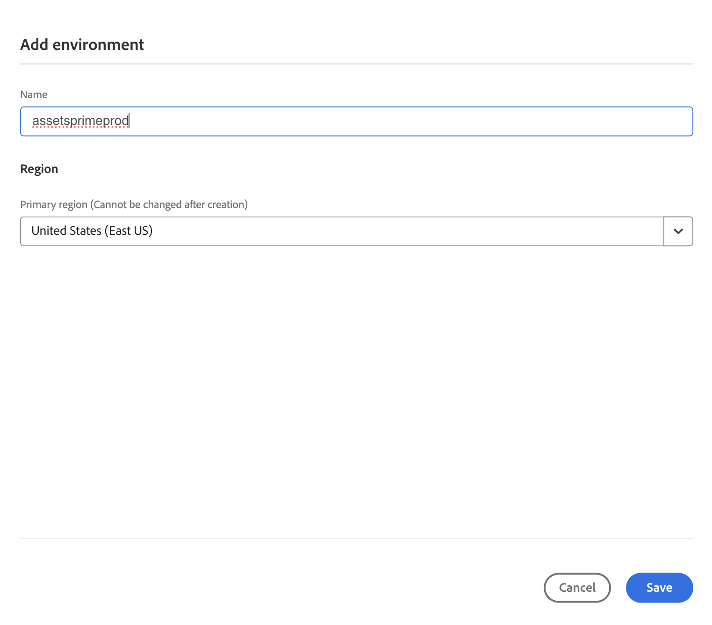

# [!DNL Assets] Prime as a Cloud Service  {#assets-prime}

| [Pesquisar Práticas Recomendadas](/help/assets/search-best-practices.md) | [Práticas recomendadas de metadados](/help/assets/metadata-best-practices.md) | [Content Hub](/help/assets/product-overview.md) | [Dynamic Media com recursos OpenAPI](/help/assets/dynamic-media-open-apis-overview.md) | [documentação para desenvolvedores do AEM Assets](https://developer.adobe.com/experience-cloud/experience-manager-apis/) |
| ------------- | --------------------------- |---------|----|-----|

Assets as a Cloud Service Prime includes a lightweight DAM that enables you to perform various key capabilities, such as:

* ****

* ****

* ****

* ****

* **Conexões Experience Cloud**: ferramentas para suportar o acesso nativo a ativos digitais de outros aplicativos e serviços Experience Cloud.

* **Experiência do Portal de Distribuição sem opções de extensibilidade (Content Hub)**: ferramentas para expandir o acesso aos ativos digitais aprovados de uma marca para participantes estendidos, a fim de garantir a consistência da marca e o uso.

* **Integrações**: integrações com outros aplicativos Adobe e não Adobe.

* **Dynamic Media (complemento)**: ferramentas para transformar e entregar imagens, vídeos e outros conteúdos emergentes para experiências multimídia avançadas e interativas para qualquer dispositivo em escala.

This article provides an end-to-end workflow to enable Assets as a Cloud Service Prime.

## Ativar o Assets as a Cloud Service{#enable-assets-prime}

Ative o Assets Prime ao criar um novo programa usando o Cloud Manager. Execute as seguintes etapas:

1. Como administrador do sistema, faça logon no Cloud Manager. Certifique-se de selecionar a organização correta ao fazer logon.

   >[!NOTE]
   >
   >Verifique se você foi adicionado ao perfil de produto apropriado do Cloud Manager para adicionar um novo programa. Para obter mais informações, consulte [Permissões baseadas em função no Cloud Manager](/help/onboarding/cloud-manager-introduction.md#role-based-permissions).

1. [Criar um novo programa](/help/journey-onboarding/create-program.md).

   Ao criar o novo programa, na guia **[!UICONTROL Soluções e Complementos]**, selecione **[!UICONTROL Assets Prime]**. Você também pode expandir o **[!UICONTROL Assets Prime]** e selecionar o **[!UICONTROL Content Hub]** para habilitar o [Content Hub](/help/assets/product-overview.md) para distribuição de ativos.

   

1. Clique em **[!UICONTROL Criar]** para criar o programa.

1. Clique no cartão do programa e em **[!UICONTROL Adicionar ambiente]**.

1. ****

   

>[!NOTE]
>
>Assets Prime only allows you to create a production environment. The option to Add environment is no longer available once the production environment is created successfully.

O Assets Prime agora está habilitado para o Experience Manager Assets as a Cloud Service.

O administrador do sistema é automaticamente qualificado como administrador de AEM e recebe um email para navegar até o Admin Console para gerenciar perfis de produto.

A instância do AEM as a Cloud Service no Admin Console inclui os seguintes perfis de produto:

* AEM Administrators

* Usuários do AEM

* [AEM Assets Collaborator Users](#onboard-collaborator-users)

* [AEM Assets Power Users](#onboard-power-users)

Você pode começar a adicionar usuários ou grupos de usuários aos perfis de produtos Usuários do AEM Assets Collaborator e Usuários Avançados do AEM Assets. Para obter mais informações, consulte [Integrar usuários do AEM Assets Collaborator](#onboard-collaborator-users) e [Integrar usuários avançados do AEM Assets](#onboard-power-users).

Se você habilitou o Content Hub para Assets as a Cloud Service, há uma nova instância criada no Admin Console as a Cloud Service do AEM Assets com `delivery` como sufixo:

>[!NOTE]
>
>Se você tiver provisionado o Content Hub antes de 14 de agosto de 2024, a nova instância será criada com `contenthub` como sufixo.

`author``publish`

`AEM Assets Limited Users`

You can start adding users or user groups to this product profile to provide them access to Content Hub.

>[!NOTE]
>
>`contenthub``Limited Users``delivery`

## Integrar usuários do AEM Assets Collaborator {#onboard-collaborator-users}

Os usuários do AEM Assets Collaborator podem trabalhar com ativos do Experience Manager por meio de integrações da Assets disponíveis para sua organização em outros produtos de Adobe e aplicativos que não sejam Adobe, criar e editar ativos usando Adobe Express e Firefly integrados, aproveitando modelos profissionalmente projetados, kits de marca, ativos da Adobe Stock e assim por diante, e acessar e aproveitar ativos aprovados de sua organização usando o portal AEM Assets Content Hub.

Para integrar usuários do Collaborator:

1. Para acessar os perfis de produto do Experience Manager Assets, clique no nome de produto do AEM as a Cloud Service na lista de produtos do Admin Console.

1. Clique na instância do autor de produção para o AEM as a Cloud Service:
   

1. Clique no perfil de produto Usuários do Collaborators e clique em **[!UICONTROL Adicionar usuários]** para adicionar o usuário ao perfil de produto.
   

1. Clique em **[!UICONTROL Salvar]** para salvar as alterações.

Você também pode acessar e exibir os serviços atribuídos aos usuários do Collaborator, conforme mostrado na imagem a seguir:

Os serviços `Adobe Express` e `AEM Assets Collaborator Users` estão habilitados por padrão. Você pode desativar e ativar o, de acordo com seus requisitos. No entanto, a Adobe recomenda usar os serviços padrão ativados para os perfis de produto.

## Integração de usuários avançados do AEM Assets {#onboard-power-users}

Os usuários avançados da AEM Assets podem acessar todos os recursos da AEM Assets, incluindo o gerenciamento de ativos, permissões, metadados e a governança e automação geral em torno de ativos digitais, trabalhar com ativos do Experience Manager por meio de integrações da Assets disponíveis para sua organização em outros aplicativos Adobe e não Adobe, criar e editar ativos usando o Adobe Express e o Firefly integrados, aproveitando modelos projetados profissionalmente, kits de marca, ativos da Adobe Stock e assim por diante, e acessar e aproveitar os ativos aprovados da sua organização usando o portal AEM Assets da Content Hub.

Para integrar Usuários avançados:

1. Para acessar os perfis de produto do Experience Manager Assets, clique no nome de produto do AEM as a Cloud Service na lista de produtos do Admin Console.

1. Click the production author instance for AEM as a Cloud Service:
   

1. ****
   

1. ****

Você também pode acessar e visualizar os serviços atribuídos aos usuários avançados, conforme ilustrado na imagem a seguir:

Os serviços `Adobe Express` e `AEM Assets Power Users` estão habilitados por padrão. Você pode desativar e ativar o, de acordo com seus requisitos. No entanto, a Adobe recomenda usar os serviços padrão ativados para os perfis de produto.
