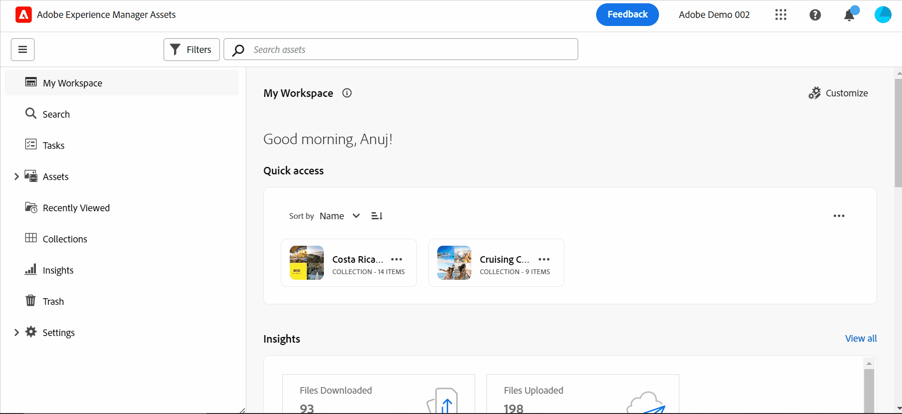

# Introdução à visualização de ativos {#assets-view}

No cenário atual de lançamento digital acelerado, onde a criação e a entrega de conteúdo em tempo real são essenciais, é fundamental ter uma experiência de Gerenciamento de ativos digitais (DAM) projetada para a velocidade de marketing de downstream. O Adobe, aproveitando sua experiência em capacitação de profissionais de marketing e criativos, apresenta uma nova experiência de usuário que muda o jogo. Essa abordagem de primeiro fluxo de trabalho revoluciona como as empresas lidam com seus ativos digitais dinâmicos, capacitando os profissionais de marketing para maximizar a eficiência na localização, colaboração, personalização e entrega de ativos. Esses fluxos de trabalho simplificados aceleram a velocidade do conteúdo e impulsionam seus esforços de marketing para novos patamares.

Para saber mais sobre as experiências com base em persona disponíveis para o Assets as a Cloud Service, consulte [Apresentação do Assets as a Cloud Service](/help/assets/overview.md#persona-based-experiences).

## Como acessar a visualização de Ativos? {#access-assets-view}

É possível acessar a visualização de Ativos das seguintes maneiras:

<!--

* **Toggle in Admin view**

    * Log into [!DNL Experience Manager] using Cloud Manager.
    * Navigate to **[!UICONTROL Assets]** > **[!UICONTROL Files]**.
    * Click the profile icon on the top right corner.
    * Click **[!UICONTROL Switch View]** from the **[!UICONTROL Profile Settings]** section.
    Repeat these steps to switch back to the Admin view.

* **Product Switcher**
    * Log into [!DNL Experience Manager] and click .
    * Select **[!UICONTROL Experience Manager Assets]** to access the Assets view.
    * Select **[!UICONTROL Experience Manager]** to access the Admin view.

* **Quick Links** 
    * Log into experience.adobe.com.
    * Click **[!UICONTROL Experience Manager Assets]** to access the Assets view.
    * Click **[!UICONTROL Experience Manager Assets]** to access the Assets view.

    -->

## Por que exibir o Assets?

A exibição de Ativos fornece os seguintes benefícios principais que não estão disponíveis na exibição de Administrador:

* [Painel Meu espaço de trabalho para fornecer experiências otimizadas](#my-workspace-for-streamlined-experience)
* [Abordagem de pesquisa para aumentar a eficiência](#search-first)
* [Insights para tomar decisões orientadas por dados](#insights-data)
* [Integração do Adobe Photoshop Express para acelerar a colaboração](#accelerate-collaboration)
* [Uploads de pasta para configurar a estrutura hierárquica da organização](#folder-uploads)
* [Inscrever-se no conteúdo do repositório para um gerenciamento eficiente de ativos](#subscribe-content)
* [Excluir ativos de forma reversível para oferecer melhor controle aos administradores](#soft-delete-assets)

### Painel Meu espaço de trabalho para fornecer experiências otimizadas {#my-workspace-for-streamlined-experience}

Dê as boas-vindas a uma solução de gerenciamento de ativos digitais que compreenda as diversas necessidades das diferentes funções organizacionais. A nova visualização elegante do Assets prioriza a facilidade de uso e a velocidade, atendendo à preferência dos profissionais de marketing por apelo visual e espaços de trabalho desorganizados. Com um painel personalizável específico do usuário do Meu espaço de trabalho, os profissionais de marketing podem encontrar, visualizar, editar, gerenciar e fornecer ativos com eficiência notável. Despeça-se das horas infinitas gastas procurando ativos específicos e receba com prazer uma experiência simplificada que coloque tudo o que você precisa ao seu alcance.

### Insights para tomar decisões orientadas por dados {#insights-data}

Para acompanhar a velocidade do conteúdo, insights acionáveis são essenciais. A nova experiência de exibição do Assets oferece insights avançados no Meu espaço de trabalho, fornecendo dados valiosos sobre desempenho de ativos, uso de público-alvo e envolvimentos. Os profissionais de marketing podem tomar decisões orientadas por dados, otimizar estratégias de conteúdo e refinar a entrega downstream para alcançar resultados ideais. Com acesso a insights significativos, as empresas podem se manter à frente da concorrência e impulsionar resultados excepcionais.

### Integração do Adobe Photoshop Express para acelerar a colaboração {#accelerate-collaboration}

A nova experiência oferece um conjunto robusto de recursos de colaboração, incluindo edição em tempo real com recursos incorporados do Adobe Photoshop, controles de versão e ferramentas de anotação. Isso permite uma colaboração contínua entre equipes de design, criação, marca e marketing, permitindo que superem gargalos e agilizem o processo de operações de marketing. Os profissionais de marketing agora têm ferramentas eficientes à disposição para acelerar a entrega de projetos e aumentar sua produtividade geral.

Assista a este vídeo para entender o poder do Assets visualizar a integração com o Adobe Photoshop Express:

>[!VIDEO](https://video.tv.adobe.com/v/3420922)

As próximas versões do Assets as a Cloud Service também incluirão [integração de Adobe Firefly via Adobe Express](https://firefly.adobe.com/?gclid=EAIaIQobChMIlZeKuNfj_wIVeyCtBh3e5g2cEAAYASAAEgL56_D_BwE&amp;sdid=JM4FW6VL&amp;mv=search&amp;mv2=paidsearch&amp;ef_id=EAIaIQobChMIlZeKuNfj_wIVeyCtBh3e5g2cEAAYASAAEgL56_D_BwE:G:s&amp;s_kwcid=AL!3085!3!652077237594!g!adobe%20firefly!19870733758!148140507838).

### Uploads de pasta para configurar a estrutura hierárquica da organização {#folder-uploads}

Configure rapidamente uma estrutura de pastas para sua organização usando a visualização Ativos carregando pastas existentes em seu sistema de arquivos local. Não é necessário criar pastas na pasta raiz e, em seguida, fazer o upload de ativos para essas pastas manualmente para manter a estrutura hierárquica lógica. Todas as pastas e ativos na pasta raiz são carregados automaticamente no Experience Manager Assets.

### Abordagem de pesquisa para aumentar a eficiência {#search-first}

Libere o potencial da biblioteca de ativos digitais da sua organização com o poder da pesquisa com funcionalidade de última geração. Você pode se despedir do incômodo de examinar manualmente inúmeros arquivos e pastas. Qualquer usuário pode localizar instantaneamente a imagem, o vídeo ou o documento perfeito de que você precisa para criar campanhas de marketing impressionantes, apresentações cativantes e conteúdo envolvente. Nosso primeiro mecanismo de pesquisa permite navegar facilmente por tipos de ativos, metadados, tags inteligentes e até mesmo pelo conteúdo em si, sem saber a palavra-chave exata. Adote o futuro do DAM com nosso Search-First e libere todo o potencial de sua biblioteca de ativos digitais.

### Inscrever-se no conteúdo do repositório para um gerenciamento eficiente de ativos {#subscribe-content}

A exibição de Ativos fornece a capacidade de monitorar as operações realizadas nos ativos, pastas ou coleções disponíveis no repositório. Você precisa selecionar e assinar o conteúdo sobre o qual deseja receber notificações. Você também pode configurar os tipos de evento, como exclusão do conteúdo que você assinou, modificações no conteúdo que você assinou etc. As notificações são enviadas a você somente para esses tipos de evento.

### Excluir ativos de forma reversível para oferecer melhor controle aos administradores {#soft-delete-assets}

A pasta Lixeira, disponível na visualização Ativos, lista os ativos excluídos da pasta raiz Ativos. Você pode selecionar um ativo da pasta Lixeira para restaurá-lo no local original ou excluí-lo permanentemente. Você também pode especificar uma palavra-chave ou aplicar filtros padrão ou personalizados para pesquisar ativos apropriados na pasta Lixeira.

Além desses recursos, a exibição Ativos também permite executar os seguintes recursos que não estão disponíveis na exibição Administração:

* Faça upload de uma nova versão de um ativo, com um nome diferente, do sistema de arquivos local para o repositório de ativos. O ativo carregado está disponível como uma nova versão com o mesmo nome do ativo original.

* Renomeie ativos e pastas disponíveis no repositório.

Use estes links para começar a usar a exibição de Ativos rapidamente:

* [Meu espaço de trabalho](/help/assets/my-workspace-assets-view.md)
* [Introdução ao uso da visualização de Ativos](/help/assets/get-started-assets-view.md)

## Conclusão {#conclusion}

Chegou a era do digital-first e é hora de transformar nossas ferramentas de marketing para respaldar o cenário empresarial em evolução. A nova visualização do Adobe Experience Manager Assets é personalizada para simplificar fluxos de trabalho, promover colaboração e acelerar a entrega de ativos. Ao adotar a velocidade do conteúdo, os profissionais de marketing podem desbloquear todo o potencial de seus ativos digitais e liberar a criatividade como nunca antes. Prepare-se para aproveitar o potencial da nova experiência de visualização do Adobe Assets e impulsionar resultados excepcionais em suas campanhas de marketing. É hora de abraçar o futuro do DAM e impulsionar seus negócios.

