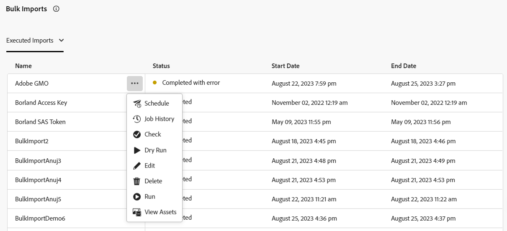

# Importação de ativos em massa usando a visualização do Assets  {#bulk-import-assets-view}

A Importação em massa na visualização do AEM Assets fornece a capacidade de importar um grande número de ativos de uma fonte de dados para o AEM Assets. Não é mais necessário fazer upload de ativos ou pastas individuais para o AEM Assets.

>[!NOTE]
>
>O importador de itens em massa de exibição do Assets usa o mesmo back-end do importador em massa de exibição do administrador. No entanto, ele oferece mais fontes de dados para importar do e uma experiência do usuário mais simplificada.

É possível importar ativos das seguintes fontes de dados:

* Azure
* AWS
* Google Cloud
* Dropbox
* OneDrive

## Pré-requisitos {#prerequisites}

| Fonte de Dados | Pré-requisitos |
|-----|------|
| Azure | <ul> <li>Conta de armazenamento do Azure </li> <li> Container do Blob Azure <li> Chave de Acesso do Azure ou Token SAS com base no modo de autenticação </li></ul> |
| AWS | <ul> <li>Região do AWS </li> <li> Classificação AWS <li> Chave de acesso do AWS </li><li> Segredo de acesso do AWS </li></ul> |
| Google Cloud | <ul> <li>Compartimento de GCP </li> <li> Email da conta de serviço GCP <li> Chave privada da conta de serviço GCP</li></ul> |
| Dropbox | <ul> <li>ID do cliente do Dropbox (chave do aplicativo) </li> <li> Segredo do cliente do Dropbox (segredo do aplicativo)</li></ul> |
| OneDrive | <ul> <li>ID de locatário do OneDrive  </li> <li> ID de cliente do OneDrive</li><li> Segredo de cliente do OneDrive</li></ul> |

Além desses pré-requisitos da fonte de dados, você deve saber o nome da pasta de origem disponível na fonte de dados que contém todos os ativos que precisam ser importados para o AEM Assets.

## Configurar o aplicativo para desenvolvedores do Dropbox {#dropbox-developer-application}

Antes de importar ativos da sua conta do Dropbox para o AEM Assets, crie e configure o aplicativo para desenvolvedores do Dropbox.

Execute as seguintes etapas:

1. Faça logon no [conta Dropbox](https://www.dropbox.com/developers) e clique em **[!UICONTROL Criar aplicativos]**.  Se você estiver usando uma conta Dropbox Enterprise, precisará ter acesso à função Administrador de conteúdo.

1. Na seção **[!UICONTROL Escolher uma API]**, selecione o único botão de opção disponível.

1. Na seção **[!UICONTROL Escolha o tipo de acesso necessário]**, selecione uma das seguintes opções:

   * Selecione **[!UICONTROL Pasta do aplicativo]** se precisar acessar uma única pasta criada no seu aplicativo na conta do Dropbox.

   * Selecione **[!UICONTROL Dropbox completo]** se precisar de acesso a todos os arquivos e pastas da sua conta do Dropbox.

1. Especifique um nome para o aplicativo e clique em **[!UICONTROL Criar aplicativo]**.

1. No **[!UICONTROL Configurações]** do aplicativo, adicione https://experience.adobe.com à guia **[!UICONTROL URIs de redirecionamento]** seção.

1. Copie os valores para os campos **[!UICONTROL Chave do aplicativo]** e **[!UICONTROL Segredo do aplicativo]**. Os valores são necessários ao configurar a ferramenta de importação em massa no AEM Assets.

1. Na guia **[!UICONTROL Permissões]**, adicione as seguintes permissões na seção **[!UICONTROL Escopos individuais]**.

   * account_info.read

   * files.metadata.read

   * files.content.read

   * files.content.write

1. Clique em **[!UICONTROL Enviar]** para salvar as alterações.

## Configurar o aplicativo para desenvolvedores do OneDrive {#onedrive-developer-application}

Antes de importar ativos da sua conta do OneDrive para o AEM Assets, crie e configure o aplicativo para desenvolvedores do OneDrive.

### Criar um aplicativo

1. Faça logon no [Conta do OneDrive](https://portal.azure.com/#view/Microsoft_AAD_RegisteredApps/ApplicationsListBlade) e clique em **[!UICONTROL Novo registro]**.

1. Especifique um nome para o aplicativo e selecione **[!UICONTROL Contas somente neste diretório organizacional (somente Adobe - locatário único)]** de **[!UICONTROL Tipos de conta compatíveis]**.

1. Execute as etapas a seguir para adicionar URIs de redirecionamento:

   1. No **[!UICONTROL Selecionar uma plataforma]** selecione **[!UICONTROL Web]**.

   1. Adicione https://experience.adobe.com à **[!UICONTROL URIs de redirecionamento]** seção.
   <!-- Add the first URI and click **[!UICONTROL Configure]** to add it. You can add more by clicking **[!UICONTROL Add URI]** option available in the **[!UICONTROL Web]** section on the **[!UICONTROL Authentication]** page. -->

1. Clique em **[!UICONTROL Registrar]**. O aplicativo foi criado com sucesso.

1. Copie os valores para a variável **[!UICONTROL ID do aplicativo (cliente)]** e **[!UICONTROL ID do diretório (locatário)]** campos. Os valores são necessários ao configurar a ferramenta de importação em massa no AEM Assets.

1. Clique em **[!UICONTROL Adicionar um certificado ou segredo]** correspondente a **[!UICONTROL Credenciais do cliente]** opção.

1. Clique em **[!UICONTROL Novo segredo do cliente]**, forneça a descrição secreta do cliente, a expiração e clique em **[!UICONTROL Adicionar]**.

1. Depois de criar o segredo de cliente, copie o campo **[!UICONTROL Valor]** (não copie o campo ID do segredo). Isso é necessário ao configurar a importação em massa no AEM Assets.

### Adicionar permissões de API

Execute as seguintes etapas para adicionar permissões de API no aplicativo:

1. Clique em **[!UICONTROL Permissões de API]** no painel esquerdo e selecione **[!UICONTROL Adicionar uma permissão]**.
1. Clique em **[!UICONTROL Gráfico da Microsoft]** > **[!UICONTROL Permissões delegadas]**. A seção **[!UICONTROL Selecionar permissão]** exibe as permissões disponíveis.
1. Selecione a permissão `offline_access` em `OpenId permissions` e a permissão `Files.ReadWrite.All` em `Files`.
1. Clique em **[!UICONTROL Adicionar permissões]** para salvar as atualizações.

## Criação de uma configuração de importação em massa {#create-bulk-import-configuration}

Execute as seguintes etapas para criar uma configuração de importação em massa no [!DNL Experience Manager Assets]:

1. Clique em **[!UICONTROL Importação em massa]** no painel esquerdo e clique em **[!UICONTROL Criar importação]**.
1. Selecione a fonte de dados. As opções disponíveis incluem **[!UICONTROL Azure]**, **[!UICONTROL AWS]**, **[!UICONTROL Google Cloud]**, **[!UICONTROL Dropbox]** e **[!UICONTROL OneDrive]**.
1. Especifique um nome para a configuração de importação em massa no campo **[!UICONTROL Nome]**.
1. Especifique as credenciais específicas da fonte de dados, conforme mencionado em [Pré-requisitos](#prerequisites).
1. Forneça o nome da pasta raiz que contém ativos na fonte de dados na **[!UICONTROL Pasta de origem]** campo.

   >[!NOTE]
   >
   >Se estiver usando o Dropbox como fonte de dados, especifique o caminho da pasta de origem com base nas seguintes regras:
   >* Se você selecionar **Dropbox completo** ao criar o aplicativo do Dropbox e a pasta que contiver os ativos existir em `https://www.dropbox.com/home/bulkimport-assets`, especifique `bulkimport-assets` no campo **[!UICONTROL Pasta de origem]**.
   >* Se você selecionar **Pasta do aplicativo** ao criar o aplicativo do Dropbox e a pasta que contiver os ativos existir em `https://www.dropbox.com/home/Apps/BulkImportAppFolderScope/bulkimport-assets`, especifique `bulkimport-assets` no campo **[!UICONTROL Pasta de origem]**, onde `BulkImportAppFolderScope` refere-se ao nome do aplicativo. Neste caso, o `Apps` é adicionado automaticamente após `home`.

1. (Opcional) Selecione a opção **[!UICONTROL Excluir arquivo de origem após a importação]** para excluir os arquivos originais do armazenamento de dados de origem após os arquivos serem importados para o Experience Manager Assets.
1. Selecione o **[!UICONTROL Modo de importação]**. Selecione **[!UICONTROL Ignorar]**, **[!UICONTROL Substituir]** ou **[!UICONTROL Criar versão]**. O modo Ignorar é o padrão e nesse modo, o assimilador ignora a importação de um ativo, caso já exista.
   

1. (Opcional) Especifique o arquivo de metadados a ser importado, fornecido no formato CSV na **[!UICONTROL Arquivo de metadados]** campo. O arquivo de origem de metadados deve estar na pasta de origem. Clique em **[!UICONTROL Próxima]** para navegar até **[!UICONTROL Localização e filtros]**.
1. Defina um local no DAM onde os ativos devem ser importados usando o campo **[!UICONTROL Pasta de destino do Assets]**. Por exemplo, `/content/dam/imported_assets`.
1. (Opcional) Na seção **[!UICONTROL Escolher filtros]**, forneça o tamanho mínimo de arquivo dos ativos em MB para incluí-los no processo de assimilação no campo **[!UICONTROL Filtrar por tamanho mínimo]**.
1. (Opcional) Forneça o tamanho máximo de arquivo dos ativos em MB para incluí-los no processo de assimilação no campo **[!UICONTROL Filtrar por tamanho máximo]**.
1. (Opcional) Selecione os tipos MIME a serem incluídos no processo de assimilação usando o campo **[!UICONTROL Incluir tipo MIME]**. É possível selecionar vários tipos MIME nesse campo. Se não definir um valor, todos os tipos MIME serão incluídos no processo de assimilação.

1. (Opcional) Selecione os tipos MIME a serem excluídos no processo de assimilação usando o campo **[!UICONTROL Excluir tipo MIME]**. É possível selecionar vários tipos MIME nesse campo. Se não definir um valor, todos os tipos MIME serão incluídos no processo de assimilação.

   

1. Clique em **[!UICONTROL Avançar]**. Selecione uma das seguintes opções de acordo com sua preferência:

   * **[!UICONTROL Salvar importação]** para salvar a configuração por enquanto e poder executá-la posteriormente.
   * **[!UICONTROL Salvar e executar a importação]** para salvar a configuração e executar a importação em massa.
   * **[!UICONTROL Salvar e agendar a importação]** para salvar a configuração e agendar a importação em massa para um momento posterior. Você pode escolher a frequência da importação em massa e definir a data e a hora da importação. A importação em massa será executada na data e hora definidas na frequência escolhida.

   

1. Clique em **[!UICONTROL Salvar]** para executar a opção selecionada.

### Tratamento de nomes de arquivo durante a importação em massa {#filename-handling-bulkimport-assets-view}

Ao importar ativos ou pastas em massa, o [!DNL Experience Manager Assets] importa toda a estrutura existente na fonte de importação. O [!DNL Experience Manager] segue as regras incorporadas para caracteres especiais em nomes de ativos e pastas, portanto, esses nomes de arquivo precisam de limpeza. Tanto o nome da pasta quanto o nome do ativo definidos pelo usuário permanece inalterado e é armazenado em `jcr:title`.

Durante a importação em massa, o [!DNL Experience Manager] procura pelas pastas existentes para evitar a reimportação de ativos e pastas e também verifica as regras de limpeza aplicadas na pasta principal onde a importação ocorre. Se as regras de limpeza forem aplicadas na pasta principal, as mesmas regras serão aplicadas à fonte de importação. Para novas importações, as seguintes regras de limpeza são aplicadas para gerenciar os nomes de arquivo de ativos e pastas.

Para obter mais informações sobre nomes não permitidos, tratamento de nomes de ativos e tratamento de nomes de pastas durante a importação em massa, consulte [Manipulação de nomes de arquivo durante a importação em massa na exibição de Administração](add-assets.md##filename-handling-bulkimport).

## Exibir configurações de importação em massa já existentes {#view-import-configuration}

Para exibir as importações em massa existentes, selecione o **[!UICONTROL Importações em massa]** no painel esquerdo. A página de importações em massa é exibida com a lista de **[!UICONTROL Importações Executadas]**.  
Também é possível exibir a variável **[!UICONTROL Importações Gravadas]** e **[!UICONTROL Importações Agendadas]** na opção suspensa.

## Edição de configurações de importação em massa {#edit-import-configuration}

Para editar os detalhes da configuração, clique em  correspondente ao nome da configuração e clique em **[!UICONTROL Editar]**. Não é possível editar o título da configuração e a fonte de dados de importação. Você pode editar as configurações nas guias Importações executadas, programadas ou salvas.

## Agendar importações únicas ou recorrentes {#schedule-imports}

Para agendar uma importação em massa única ou recorrente, execute as seguintes etapas:

1. Clique em  correspondente ao nome de configuração disponível no **[!UICONTROL Importações Executadas]** ou **[!UICONTROL Importações Gravadas]** e clique em **[!UICONTROL Agendar]**. Também é possível reagendar uma importação navegando até a guia **[!UICONTROL Importações programadas]** e clicando em **[!UICONTROL Programar]**.

1. Defina uma assimilação única ou agende uma programação por hora, dia ou semana. Clique em **[!UICONTROL Enviar]**.

   

## Execução de uma verificação de integridade de importação {#import-health-check}

Para validar a conexão com a fonte de dados, clique em  correspondente ao nome da configuração e clique em **[!UICONTROL Marcar]**. Se a conexão for bem-sucedida, o Experience Manager Assets exibirá a seguinte mensagem:

## Faça uma execução de prática antes de executar uma importação {#dry-run-bulk-import}

Clique em  correspondente ao nome da configuração e clique em **[!UICONTROL Dry Run]** para chamar uma execução de teste para o trabalho de Importação em massa. O Experience Manager Assets exibe os seguintes detalhes sobre a tarefa de importação em massa:

## Execução de uma importação em massa {#run-bulk-import}

Se tiver salvo a importação ao criar a configuração, você poderá navegar até a guia Importações salvas, clique em  ícone correspondente à configuração e clique em **[!UICONTROL Executar]**.

Da mesma forma, se precisar executar uma importação já executada, navegue até a guia Importações Executadas e clique em  correspondente ao nome da configuração e clique em **[!UICONTROL Executar]**.

## Interrupção ou agendamento de uma importação em andamento {#schedule-stop-ongoing-report}

É possível agendar ou interromper uma importação em massa em andamento usando a caixa de diálogo Status da importação em massa que é exibida na página inicial da Importação em massa durante a importação.

Também é possível visualizar os ativos que foram importados na pasta de destino clicando em **[!UICONTROL Exibir ativos]**.

## Exclusão de uma configuração de importação em massa {#delete-bulk-import-configuration}

Clique em  correspondente ao nome da configuração existente em **[!UICONTROL Importações Executadas]**, **[!UICONTROL Importações Agendadas]** ou **[!UICONTROL Importações Gravadas]** guias e clique em **[!UICONTROL Excluir]** para excluir a configuração de Importação em massa.

## Navegação até os ativos após a execução de uma importação em massa {#view-assets-after-bulk-import}

Para exibir o local de destino do Assets no qual os ativos são importados após a execução do trabalho de Importação em massa, clique em  correspondente ao nome da configuração e clique em **[!UICONTROL Exibir ativos]**.

## Vídeo: importar ativos em massa usando a Exibição de ativos

>[!VIDEO](https://video.tv.adobe.com/v/3428012)
