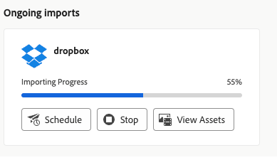

# Importar ativos em massa usando a exibição Ativos  {#bulk-import-assets-view}

A Importação em massa na visualização do AEM Assets fornece aos administradores a capacidade de importar um grande número de ativos de uma fonte de dados para o AEM Assets. Os administradores não precisam mais fazer upload de ativos ou pastas individuais para o AEM Assets.

Você pode importar ativos das seguintes fontes de dados:

* Azure
* AWS
* Google Cloud
* Dropbox

## Pré-requisitos {#prerequisites}

| Fonte de Dados | Pré-requisitos |
|-----|------|
| Azure | <ul> <li>Conta de armazenamento do Azure </li> <li> Container do Blob Azure <li> Chave de Acesso do Azure ou Token SAS com base no modo de autenticação </li></ul> |
| AWS | <ul> <li>Região do AWS </li> <li> Classificação AWS <li> Chave de acesso AWS </li><li> Segredo de acesso do AWS </li></ul> |
| Google Cloud | <ul> <li>Compartimento de GCP </li> <li> Email da conta de serviço GCP <li> Chave privada da conta de serviço GCP</li></ul> |
| Dropbox | <ul> <li>ID de cliente do Dropbox </li> <li> Segredo do cliente do Dropbox</li></ul> |

Além desses pré-requisitos com base na fonte de dados, você deve estar ciente do nome da pasta de origem disponível em sua fonte de dados que contém todos os ativos que precisam ser importados para o AEM Assets.

## Criar configuração de importação em massa {#create-bulk-import-configuration}

Execute as seguintes etapas para criar uma configuração de importação em massa:

1. Navegue até **[!UICONTROL Configurações]** > **[!UICONTROL Importação em massa]** e clique em **[!UICONTROL Criar importação]**.
1. Selecione a fonte de dados. As opções disponíveis incluem Azure, AWS, Google Cloud e Dropbox.
1. Especifique um nome para a configuração de importação em massa no **[!UICONTROL Nome]** campo.
1. Especifique as credenciais específicas da fonte de dados, conforme mencionado em [Pré-requisitos](#prerequisites).
1. Forneça o nome da pasta raiz que contém ativos na fonte de dados na **[!UICONTROL Pasta de origem]** campo.
1. (Opcional) Selecione a **[!UICONTROL Excluir arquivo de origem após a importação]** opção para excluir os arquivos originais do armazenamento de dados de origem após os arquivos serem importados para o Experience Manager Assets.
1. Selecione o **[!UICONTROL Modo de importação]**. Selecionar **[!UICONTROL Ignorar]**, **[!UICONTROL Substituir]** ou **[!UICONTROL Criar versão]**. O modo Ignorar é o padrão e, nesse modo, o assimilador ignora para importar um ativo, se ele já existir.
   

1. (Opcional) Especifique o arquivo de metadados a ser importado, fornecido no formato CSV, no campo Arquivo de Metadados e clique em **[!UICONTROL Próxima]** para navegar até **[!UICONTROL Localização e filtros]**.
1. Para definir um local no DAM em que os ativos devem ser importados usando o **[!UICONTROL Pasta de destino do Assets]** especifique um caminho. Por exemplo, `/content/dam/imported_assets`.
1. (Opcional) Na **[!UICONTROL Escolher filtros]** forneça o tamanho mínimo de arquivo dos ativos em MB para incluí-los no processo de assimilação na **[!UICONTROL Filtrar por tamanho mínimo]** campo.
1. (Opcional) Forneça o tamanho máximo de arquivo dos ativos em MB para incluí-los no processo de assimilação na **[!UICONTROL Filtrar por tamanho máximo]** campo.
1. (Opcional) Selecione os tipos MIME a serem incluídos no processo de assimilação usando a variável **[!UICONTROL Incluir tipo de MIME]** campo. Você pode selecionar vários tipos MIME nesse campo. Se você não definir um valor, todos os tipos MIME serão incluídos no processo de assimilação.

1. (Opcional) Selecione os tipos MIME a serem excluídos no processo de assimilação usando a variável **[!UICONTROL Excluir tipo de MIME]** campo. Você pode selecionar vários tipos MIME nesse campo. Se você não definir um valor, todos os tipos MIME serão incluídos no processo de assimilação.

   

1. Clique em **[!UICONTROL Avançar]**. Selecionar **[!UICONTROL Salvar e executar a importação]** para salvar a configuração e executar a importação em massa. Selecionar **[!UICONTROL Salvar importação]** para salvar a configuração por enquanto e poder executá-la posteriormente.

   

1. Clique em **[!UICONTROL Salvar]** para executar a opção selecionada.

## Exibir configurações de importação em massa existentes {#view-import-configuration}

Se você optar por salvar a configuração após criá-la, a configuração será exibida na janela **[!UICONTROL Importações Gravadas]** guia.

Se você optar por salvar e executar a importação, a configuração de importação será exibida na **[!UICONTROL Importações Executadas]** guia.

Se você agendar uma importação, ela será exibida no **[!UICONTROL Importações Agendadas]** guia.

## Editar configuração de importação em massa {#edit-import-configuration}

Para editar os detalhes da configuração, clique em ... correspondente ao nome da configuração e clique em **[!UICONTROL Editar]**. Não é possível editar o título da configuração e da fonte de dados de importação ao executar a operação de edição. Você pode editar a configuração usando as guias Executado, Programado ou Salvo Importações.

## Agendar importações ocasionais ou recorrentes {#schedule-imports}

Para agendar uma importação única ou recorrente em massa, execute as seguintes etapas:

1. clique em ... correspondente ao nome da configuração disponível na **[!UICONTROL Importações Executadas]** ou **[!UICONTROL Importações Gravadas]** e clique em **[!UICONTROL Agendar]**. Você também pode reagendar uma importação agendada existente navegando até **[!UICONTROL Importações Agendadas]** e clicando em **[!UICONTROL Agendar]**.

1. Defina uma assimilação única ou programe uma programação por hora, dia ou semana. Clique em **[!UICONTROL Enviar]**.

   

## Executar uma verificação de integridade de importação {#import-health-check}

Para validar a conexão com a fonte de dados, clique em ... correspondente ao nome da configuração e clique em **[!UICONTROL Marcar]**. Se a conexão for bem-sucedida, o Experience Manager Assets exibirá a seguinte mensagem:

## Executar uma simulação antes de executar uma importação {#dry-run-bulk-import}

Clique em ... correspondente ao nome da configuração e clique em **[!UICONTROL Dry Run]** para chamar uma execução de teste para o trabalho de Importação em massa. O Experience Manager Assets exibe os seguintes detalhes sobre o trabalho de Importação em massa:

## Executar uma importação em massa {#run-bulk-import}

Se tiver salvo a importação ao criar a configuração, você poderá navegar até a guia Importações salvas, clicar em ... correspondente à configuração e clicar em **[!UICONTROL Executar]**.

Da mesma forma, se precisar executar uma importação já executada, navegue até a guia Importações executadas, clique em ... correspondente ao nome da configuração e clique em **[!UICONTROL Executar]**.

## Interromper ou agendar uma importação em andamento {#schedule-stop-ongoing-report}

Você pode agendar ou interromper uma importação em massa em andamento usando a caixa de diálogo de status da importação em massa que é exibida na home page Importação em massa durante uma importação.

Você também pode exibir os ativos que foram importados na pasta de destino clicando em **[!UICONTROL Exibir ativos]**.

## Excluir uma configuração de importação em massa {#delete-bulk-import-configuration}

Clique em ... correspondente ao nome da configuração existente em **[!UICONTROL Importações Executadas]**, **[!UICONTROL Importações Agendadas]** ou **[!UICONTROL Importações Gravadas]** guias e clique em **[!UICONTROL Excluir]** para excluir a configuração de Importação em massa.

## Navegar até os ativos depois de executar a importação em massa {#view-assets-after-bulk-import}

Para exibir o local de destino dos Ativos em que os ativos são importados depois de executar o trabalho de Importação em massa, clique em ... correspondente ao nome da configuração e clique em **[!UICONTROL Exibir ativos]**.

