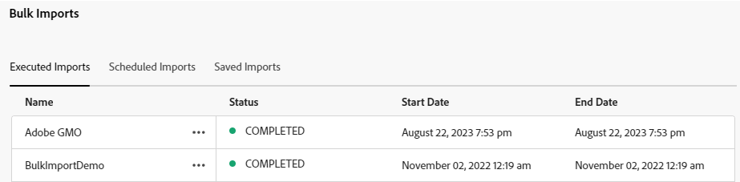

# Importação de ativos em massa usando a visualização do Assets  {#bulk-import-assets-view}

A Importação em massa na visualização do AEM Assets fornece a capacidade de importar um grande número de ativos de uma fonte de dados para o AEM Assets. Não é mais necessário fazer upload de ativos ou pastas individuais para o AEM Assets.

>[!NOTE]
>
>O importador de itens em massa de exibição do Assets usa o mesmo back-end do importador em massa de exibição do administrador. No entanto, ele oferece mais fontes de dados para importar do e uma experiência do usuário mais simplificada.

É possível importar ativos das seguintes fontes de dados:

* Azure
* AWS
* Google Cloud
* Dropbox
* OneDrive

## Pré-requisitos {#prerequisites}

| Fonte de Dados | Pré-requisitos |
|-----|------|
| Azure | <ul> <li>Conta de armazenamento do Azure </li> <li> Container do Blob Azure <li> Chave de Acesso do Azure ou Token SAS com base no modo de autenticação </li></ul> |
| AWS | <ul> <li>Região do AWS </li> <li> Classificação AWS <li> Chave de acesso do AWS </li><li> Segredo de acesso do AWS </li></ul> |
| Google Cloud | <ul> <li>Compartimento de GCP </li> <li> Email da conta de serviço GCP <li> Chave privada da conta de serviço GCP</li></ul> |
| Dropbox | <ul> <li>ID do cliente do Dropbox (Chave do aplicativo) </li> <li> Segredo do cliente do Dropbox (segredo do aplicativo)</li></ul> |
| OneDrive | <ul> <li>ID de Locatário do OneDrive  </li> <li> ID do cliente do OneDrive</li><li> Segredo do cliente do OneDrive</li></ul> |

Além desses pré-requisitos com base na fonte de dados, você deve estar ciente do nome da pasta de origem disponível na fonte de dados que contém todos os ativos que precisam ser importados para o AEM Assets.

## Configurar o aplicativo para desenvolvedor de Dropbox {#dropbox-developer-application}

Antes de importar ativos da sua conta do Dropbox para o AEM Assets, crie e configure o aplicativo do desenvolvedor do Dropbox.

Execute as seguintes etapas:

1. Faça logon no [conta Dropbox](https://www.dropbox.com/developers) e clique em **[!UICONTROL Criar aplicativos]**.

1. No **[!UICONTROL Escolher uma API]** selecione o único botão de opção disponível.

1. No **[!UICONTROL Escolha o tipo de acesso necessário]** selecione uma das seguintes opções:

   * Selecionar **[!UICONTROL Pasta do aplicativo]**, se precisar de acesso a uma única pasta criada no aplicativo na conta Dropbox.

   * Selecionar **[!UICONTROL Dropbox completo]**, se precisar de acesso a todos os arquivos e pastas da sua conta Dropbox.

1. Especifique um nome para o aplicativo e clique em **[!UICONTROL Criar aplicativo]**.

1. No **[!UICONTROL Configurações]** do aplicativo, adicione o seguinte à **[!UICONTROL URIs de redirecionamento]** seção:

   * https://exc-unifiedcontent.experience.adobe.net

   * https://exc-unifiedcontent.experience-stage.adobe.net (válido apenas para ambientes de preparo)

1. Copie os valores para a variável **[!UICONTROL Chave do aplicativo]** e **[!UICONTROL Segredo do aplicativo]** campos. Os valores são necessários ao configurar a ferramenta de importação em massa no AEM Assets.

1. No **[!UICONTROL Permissões]** adicione as seguintes permissões na guia **[!UICONTROL Escopos individuais]** seção.

   * account_info.read

   * files.metadata.read

   * files.content.read

   * files.content.write

1. Clique em **[!UICONTROL Enviar]** para salvar as alterações.

## Configurar o aplicativo do desenvolvedor do OneDrive {#onedrive-developer-application}

Antes de importar ativos da sua conta do OneDrive para o AEM Assets, crie e configure o aplicativo para desenvolvedores do OneDrive.

Execute as seguintes etapas:

1. Faça logon no [Conta do OneDrive](https://portal.azure.com/#view/Microsoft_AAD_RegisteredApps/ApplicationsListBlade) e clique em **[!UICONTROL Novo registro]**.

1. Especifique um nome para o aplicativo e selecione **[!UICONTROL Contas somente neste diretório organizacional (somente Adobe - locatário único)]** de **[!UICONTROL Tipos de conta compatíveis]** e clique em **[!UICONTROL Registrar]**. O aplicativo foi criado com sucesso.

1. Copie os valores dos campos ID do cliente da aplicação e ID do locatário. Os valores são necessários ao configurar a ferramenta de importação em massa no AEM Assets.

1. Execute as seguintes etapas para adicionar um certificado:
   1. Na página de visão geral do aplicativo, clique em **[!UICONTROL Adicionar um certificado ou segredo]** e clique em **[!UICONTROL Novo segredo do cliente]**.
   1. Especifique a descrição e a expiração do segredo do cliente e clique em **[!UICONTROL Adicionar]**.
   1. Depois de criar o Segredo do cliente, copie o **[!UICONTROL Valor]** (Não copie o campo ID secreta). É necessário ao configurar a importação em massa no AEM Assets.

1. Execute as seguintes etapas para adicionar URIs de redirecionamento:
   1. Na página de visão geral do aplicativo, clique em **[!UICONTROL Adicionar um URI de redirecionamento]** > **[!UICONTROL Adicionar uma plataforma]** > **[!UICONTROL Web]**.
   1. Adicione o seguinte à **[!UICONTROL URIs de redirecionamento]** seção:

      * https://exc-unifiedcontent.experience.adobe.net

      * https://exc-unifiedcontent.experience-stage.adobe.net (válido apenas para ambientes de preparo)

      Adicione o primeiro URI e clique em **[!UICONTROL Configurar]** para adicioná-lo. É possível adicionar mais clicando em **[!UICONTROL Adicionar URI]** opção disponível no **[!UICONTROL Web]** seção no **[!UICONTROL Autenticação]** página.

1. Execute as seguintes etapas para adicionar permissões de API ao aplicativo:
   1. Clique em **[!UICONTROL Permissões de API]** no painel esquerdo e clique em **[!UICONTROL Adicionar uma permissão]**.
   1. Clique em **[!UICONTROL Gráfico do Microsoft]** > **[!UICONTROL Permissões delegadas]**. A variável **[!UICONTROL Selecionar permissão]** exibe as permissões disponíveis.
   1. Selecionar `offline_access` permissão de `OpenId permissions` e `Files.ReadWrite.All` permissão de `Files`.
   1. Clique em **[!UICONTROL Adicionar permissões]** para salvar as atualizações.

## Criação de uma configuração de importação em massa {#create-bulk-import-configuration}

Siga as seguintes etapas para criar uma configuração de importação em massa:

1. Navegue até **[!UICONTROL Configurações]** > **[!UICONTROL Importação em massa]** e clique em **[!UICONTROL Criar importação]**.
1. Selecione a fonte de dados. As opções disponíveis incluem Azure, AWS, Google Cloud e Dropbox.
1. Especifique um nome para a configuração de importação em massa no campo **[!UICONTROL Nome]**.
1. Especifique as credenciais específicas da fonte de dados, conforme mencionado em [Pré-requisitos](#prerequisites).
1. Forneça o nome da pasta que contém ativos na fonte de dados na **[!UICONTROL Pasta de origem]** campo.

   >[!NOTE]
   >
   >Se estiver usando o Dropbox como fonte de dados, especifique o caminho da pasta de origem com base nas seguintes regras:
   >* Se você selecionar **Dropbox completo** ao criar o aplicativo Dropbox e a pasta que contém os ativos existe em `https://www.dropbox.com/home/bulkimport-assets`e, em seguida, especificar `bulkimport-assets` no **[!UICONTROL Pasta de origem]** campo.
   >* Se você selecionar **Pasta do aplicativo** ao criar o aplicativo Dropbox e a pasta que contém os ativos existe em `https://www.dropbox.com/home/Apps/BulkImportAppFolderScope/bulkimport-assets`e, em seguida, especificar `bulkimport-assets` no **[!UICONTROL Pasta de origem]** campo, onde `BulkImportAppFolderScope` refere-se ao nome do aplicativo. `Apps` é adicionado automaticamente após `home` neste caso.

1. (Opcional) Selecione a opção **[!UICONTROL Excluir arquivo de origem após a importação]** para excluir os arquivos originais do armazenamento de dados de origem após os arquivos serem importados para o Experience Manager Assets.
1. Selecione o **[!UICONTROL Modo de importação]**. Selecione **[!UICONTROL Ignorar]**, **[!UICONTROL Substituir]** ou **[!UICONTROL Criar versão]**. O modo Ignorar é o padrão e nesse modo, o assimilador ignora a importação de um ativo, caso já exista.
   

1. (Opcional) Especifique o arquivo de metadados a ser importado, fornecido no formato CSV, no campo Arquivo de metadados e clique em **[!UICONTROL Próximo]** para navegar até **[!UICONTROL Localização e filtros]**.
1. Defina um local no DAM onde os ativos devem ser importados usando o campo **[!UICONTROL Pasta de destino do Assets]**. Por exemplo, `/content/dam/imported_assets`.
1. (Opcional) Na seção **[!UICONTROL Escolher filtros]**, forneça o tamanho mínimo de arquivo dos ativos em MB para incluí-los no processo de assimilação no campo **[!UICONTROL Filtrar por tamanho mínimo]**.
1. (Opcional) Forneça o tamanho máximo de arquivo dos ativos em MB para incluí-los no processo de assimilação no campo **[!UICONTROL Filtrar por tamanho máximo]**.
1. (Opcional) Selecione os tipos MIME a serem incluídos no processo de assimilação usando o campo **[!UICONTROL Incluir tipo MIME]**. É possível selecionar vários tipos MIME nesse campo. Se não definir um valor, todos os tipos MIME serão incluídos no processo de assimilação.

1. (Opcional) Selecione os tipos MIME a serem excluídos no processo de assimilação usando o campo **[!UICONTROL Excluir tipo MIME]**. É possível selecionar vários tipos MIME nesse campo. Se não definir um valor, todos os tipos MIME serão incluídos no processo de assimilação.

   

1. Clique em **[!UICONTROL Avançar]**. Selecione **[!UICONTROL Salvar e executar importação]** para salvar a configuração e executar a importação em massa. Selecione **[!UICONTROL Salvar importação]** para salvar a configuração a fim de executá-la posteriormente.

   

1. Clique em **[!UICONTROL Salvar]** para executar a opção selecionada.

### Manipulação de nomes de arquivo durante a importação em massa {#filename-handling-bulkimport-assets-view}

Ao importar ativos ou pastas em massa, [!DNL Experience Manager Assets] importa toda a estrutura do que existe na fonte de importação. [!DNL Experience Manager] O segue as regras incorporadas para caracteres especiais nos nomes de ativos e pastas, portanto, esses nomes de arquivos precisam de limpeza. Tanto para o nome da pasta quanto para o nome do ativo, o título definido pelo usuário permanece inalterado e é armazenado em `jcr:title`.

Durante a importação em massa, [!DNL Experience Manager] procure as pastas existentes para evitar a reimportação de ativos e pastas e também verifique as regras de limpeza aplicadas na pasta principal onde a importação ocorre. Se as regras de limpeza forem aplicadas na pasta principal, as mesmas regras serão aplicadas à origem de importação. Para novas importações, as seguintes regras de limpeza são aplicadas para gerenciar os nomes de arquivos de ativos e pastas.

Para obter mais informações sobre nomes não permitidos, tratamento de nomes de ativos e tratamento de nomes de pastas durante a importação em massa, consulte [Manipulação de nomes de arquivo durante a importação em massa na exibição de Administração](add-assets.md##filename-handling-bulkimport).

## Exibir configurações de importação em massa já existentes {#view-import-configuration}

Se optar por salvar a configuração após criá-la, a configuração será exibida na guia **[!UICONTROL Importações salvas]**.

Se você optar por salvar e executar a importação, a configuração de importação será exibida na guia **[!UICONTROL Importações executadas]**.

Se você agendar uma importação, ela será exibida na guia **[!UICONTROL Importações programadas]**.

## Edição de configurações de importação em massa {#edit-import-configuration}

Para editar os detalhes da configuração, clique em Mais opções (...) correspondentes ao nome da configuração e clique em **[!UICONTROL Editar]**. Não é possível editar o título da configuração e a fonte de dados de importação. Você pode editar as configurações nas guias Importações executadas, programadas ou salvas.

## Agendar importações únicas ou recorrentes {#schedule-imports}

Para agendar uma importação em massa única ou recorrente, execute as seguintes etapas:

1. clique em Mais opções (...) correspondente ao nome de configuração disponível na **[!UICONTROL Importações Executadas]** ou **[!UICONTROL Importações Gravadas]** e clique em **[!UICONTROL Agendar]**. Também é possível reagendar uma importação navegando até a guia **[!UICONTROL Importações programadas]** e clicando em **[!UICONTROL Programar]**.

1. Defina uma assimilação única ou agende uma programação por hora, dia ou semana. Clique em **[!UICONTROL Enviar]**.

   

## Execução de uma verificação de integridade de importação {#import-health-check}

Para validar a conexão com a fonte de dados, clique em Mais opções (...) correspondente ao nome da configuração e clique em **[!UICONTROL Marcar]**. Se a conexão for bem-sucedida, o Experience Manager Assets exibirá a seguinte mensagem:

## Faça uma execução de prática antes de executar uma importação {#dry-run-bulk-import}

Clique em Mais opções (...) correspondente ao nome da configuração e clique em **[!UICONTROL Dry Run]** para chamar uma execução de teste para o trabalho de Importação em massa. O Experience Manager Assets exibe os seguintes detalhes sobre a tarefa de importação em massa:

## Execução de uma importação em massa {#run-bulk-import}

Se tiver salvo a importação ao criar a configuração, você poderá navegar até a guia Importações salvas, clicar em Mais opções (...) correspondente à configuração e clicar em **[!UICONTROL Executar]**.

Da mesma forma, se precisar executar uma importação já executada, navegue até a guia Importações executadas, clique em Mais opções (...) correspondente ao nome da configuração e clique em **[!UICONTROL Executar]**.

## Interrupção ou agendamento de uma importação em andamento {#schedule-stop-ongoing-report}

É possível agendar ou interromper uma importação em massa em andamento usando a caixa de diálogo Status da importação em massa que é exibida na página inicial da Importação em massa durante a importação.

Também é possível visualizar os ativos que foram importados na pasta de destino clicando em **[!UICONTROL Exibir ativos]**.

## Exclusão de uma configuração de importação em massa {#delete-bulk-import-configuration}

Clique em Mais opções (...) correspondentes ao nome de configuração existente no **[!UICONTROL Importações Executadas]**, **[!UICONTROL Importações Agendadas]** ou **[!UICONTROL Importações Gravadas]** guias e clique em **[!UICONTROL Excluir]** para excluir a configuração de Importação em massa.

## Navegação até os ativos após a execução de uma importação em massa {#view-assets-after-bulk-import}

Para exibir o local de destino dos Ativos em que os ativos são importados depois de executar o trabalho de Importação em massa, clique em Mais opções (...), correspondente ao nome da configuração, e clique em **[!UICONTROL Exibir ativos]**.
