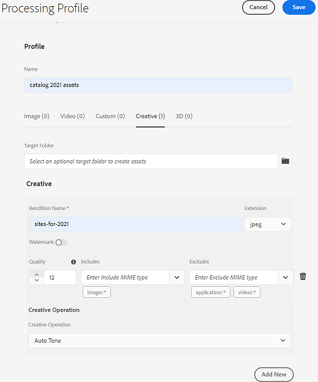

# Gerar variações de ativos usando a integração [!DNL Adobe Creative Cloud] {#content-automation}

O complemento de automação de conteúdo integra APIs [!DNL Adobe Experience Manager Assets as a Cloud Service] e [!DNL Adobe Creative Cloud] para processar seus ativos em escala de forma criativa. [!DNL Experience Manager] O usa microsserviços de  [ativos baseados em nuvem para usar os ](/help/assets/asset-microservices-overview.md)   [!DNL Adobe Creative Cloud] recursos e automatizar a criação e o manuseio de mídia de ativos.

Para editar ativos em [!DNL Adobe Photoshop] e [!DNL Adobe Lightroom], não é necessário baixar ativos de [!DNL Experience Manager Assets], editá-los e carregá-los novamente. Crie e configure um perfil de processamento em [!DNL Experience Manager], aplique o perfil a uma pasta e faça upload dos ativos para a pasta. Os ativos carregados são reprocessados com base nos perfis de processamento e você obtém variações desses ativos. O processamento em massa consistente e sem esforço salva esforços e aumenta a velocidade do conteúdo, também sem a necessidade de habilidades criativas excepcionais. Além disso, os desenvolvedores e os parceiros podem estender os microsserviços de ativos com acesso direto a essas APIs e incluir a lógica personalizada.

Os usuários podem criar perfis de processamento para automatizar as seguintes operações criativas em seus ativos:\

* **Toque** automático: Usa inteligência artificial para analisar o conteúdo da imagem e faz correções de luz e cor de forma inteligente com base nos atributos únicos da imagem.
* **Direita** automaticamente: Usa inteligência artificial para analisar o conteúdo da imagem e corrigir a perspectiva distorcida nas imagens. Por exemplo, para criar horizontes de nível.
* **Predefinições** do Lightroom: Aplica uma aparência definida pelo usuário a imagens para obter uma aparência consistente usando predefinições personalizadas.
* **Recorte** da imagem: Usa inteligência artificial para criar seleção em torno de objetos salientes e remover o plano de fundo com um único comando.
* **Máscara** de imagem: Usa inteligência artificial para criar máscara em torno de objetos salientes com um único comando.
* **Ações** do Photoshop: Aplica uma série de tarefas (no Photoshop) a um arquivo ou lote de arquivos.
* **Substituição** de objeto inteligente: A personalização em escala permite trocar imagens enquanto mantém todos os efeitos e ajustes aplicados em um arquivo PSD.

## Use um perfil de processamento para editar seus ativos de criação em massa {#process-assets}

Para usar perfis de processamento para criar variações automaticamente, siga estas etapas:

1. Entre em contato com o [Adobe Customer Care](https://experienceleague.adobe.com/#support) para receber a licença.

1. Navegue até **[!UICONTROL Ferramentas]** > **[!UICONTROL Ativos]** > **[!UICONTROL Perfis de processamento]**.

1. Selecione **[!UICONTROL Criar]** e especifique um **[!UICONTROL Nome]**.

1. Selecione a guia **[!UICONTROL Creative]**, especifique a pasta de saída, selecione **[!UICONTROL Adicionar Novo]** para adicionar uma configuração criativa.

1. Forneça **[!UICONTROL Nome da representação]** (ou nome da saída), **[!UICONTROL Extensão]** (ou tipo de arquivo), selecione **[!UICONTROL Qualidade]** (ou parâmetros de saída), selecione **[!UICONTROL Inclui]** e **[!UICONTROL Exclui]** listas do tipo MIME (ou filtro de ativo de entrada) e selecione a operação criativa necessária.  

   

1. Algumas operações exigem parâmetros extras (ativo). Forneça valores para esses parâmetros extras, se necessário.

1. Adicione mais operações criativas como parte do mesmo perfil de processamento ou Salve o perfil.

1. Aplique o perfil de processamento a uma pasta. Na página **[!UICONTROL Properties]** de uma pasta, selecione **[!UICONTROL Asset Processing]** e selecione o perfil de processamento a ser aplicado.

Depois que o perfil de processamento é aplicado a uma pasta DAM, todos os ativos carregados ou atualizados nessa pasta executam as operações definidas, além do processamento padrão. As subpastas herdam os mesmos perfis que foram aplicados nas pastas pai. Os usuários podem substituir essa herança.

Para processar os ativos existentes, selecione os ativos, selecione a opção **[!UICONTROL Reprocessar]** e selecione o perfil de processamento necessário.

## Dicas e limitações {#limitations-best-practices}

* [!DNL Experience Manager] limita o processamento de ativos a 300 solicitações por minuto e por ambiente e 700 solicitações por minuto por organização.
* O tamanho do arquivo é limitado a 4 GB para operações de API [!DNL Adobe Photoshop] e 1 GB para operações [!DNL Adobe Lightroom].

>[!MORELIKETHIS]
>
>* [Configure e use microsserviços de ativos por meio de perfis](/help/assets/asset-microservices-configure-and-use.md) de processamento.
>* [ [!DNL Experience Manager] Integrar com [!DNL Creative Cloud]](/help/assets/aem-cc-integration-best-practices.md).
>* [Assimilação e processamento de ativos com microsserviços de ativos: Uma visão geral](/help/assets/asset-microservices-overview.md).

