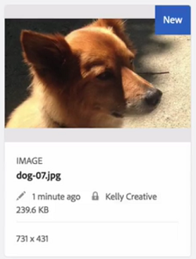

# Arquivos de check-in e check-out no [!DNL Experience Manager] DAM {#check-in-and-check-out-files-in-assets}

[!DNL Adobe Experience Manager Assets] permite fazer check-out dos ativos para edição e check-in deles novamente depois de concluir a realização das alterações. Após fazer check-out de um ativo, somente você pode editar, anotar, publicar, mover ou excluir o ativo. Fazer check-out de um ativo bloqueia o ativo. Outros usuários não podem executar nenhuma dessas operações no ativo até que você verifique o ativo de volta para [!DNL Assets]. No entanto, eles ainda podem alterar os metadados do ativo bloqueado.

Para fazer check-out/in de ativos, você precisa ter acesso de gravação.

Esse recurso ajuda a impedir que outros usuários substituam as alterações feitas por um autor, onde vários usuários colaboram na edição de fluxos de trabalho entre equipes.

## Verificar ativos {#checking-out-assets}

1. Na interface do usuário [!DNL Assets], selecione o ativo que deseja fazer check-out. Você também pode selecionar vários ativos para fazer check-out.

1. Na barra de ferramentas, clique em **[!UICONTROL Check-out]**. A opção **[!UICONTROL Check-out]** alterna para **[!UICONTROL Check-in]**.
Para verificar se outros usuários podem editar o ativo com check-out, faça logon como um usuário diferente. O ícone  é exibido na miniatura do ativo que você fez o check-out.

   

   Selecione o ativo. Observe que a barra de ferramentas não exibe opções que permitem editar, anotar, publicar ou excluir o ativo.

   

   Para editar os metadados do ativo bloqueado, clique em **[!UICONTROL Exibir propriedades]**.

1. Clique em **[!UICONTROL Editar]** para abrir o ativo no modo de edição.

1. Edite o ativo e salve as alterações. Por exemplo, corte a imagem e salve. Também é possível optar por anotar ou publicar o ativo.

1. Selecione o ativo editado na interface [!DNL Assets] e clique em **[!UICONTROL Check-in]** na barra de ferramentas. O ativo modificado é passado para [!DNL Assets] e está disponível para edição por outros usuários.

## Check-in forçado {#forced-check-in}

Os administradores podem verificar ativos com check-out feito por outros usuários.

1. Faça logon em [!DNL Assets] como administrador.
1. Na interface do usuário [!DNL Assets], selecione um ou mais ativos que foram verificados por outros usuários.

   

1. Na barra de ferramentas, clique em **[!UICONTROL Liberar Bloqueio]**. O ativo é retornado e está disponível para edição para outros usuários.

## Práticas recomendadas e limitações {#tips-limitations}

* É possível excluir uma *pasta* que contém arquivos de ativos com check-out. Antes de excluir uma pasta, verifique se não há check-out de ativos digitais para os usuários.

>[!MORELIKETHIS]
>
>* [Entender check-in e check-out  [!DNL Experience Manager] no aplicativo de desktop](https://experienceleague.adobe.com/docs/experience-manager-desktop-app/using/using.html?lang=en#how-app-works2)
>* [Tutorial em vídeo para entender o check-in e o check-out [!DNL Assets]](https://experienceleague.adobe.com/docs/experience-manager-learn/assets/collaboration/check-in-and-check-out.html)

