# Gerenciar coleções em [!DNL Content Hub] {#manage-collections}

Uma coleção se refere a um conjunto de ativos que podem ser compartilhados entre usuários. Uma coleção pode incluir ativos de diferentes locais, mantendo sua integridade referencial.

[!DNL Content Hub] permite que você crie coleções públicas. Essas coleções são acessíveis a todos os usuários autorizados, criando um espaço compartilhado em que vários usuários podem acessar e utilizar o conteúdo com eficiência. As coleções promovem o uso colaborativo de recursos para aumentar a eficiência e a comodidade. Na página de navegação da coleção, é possível:

* **Criar**: crie uma ou mais coleções.
* **Exibir**: exibir os ativos e suas propriedades.
* **Compartilhar**: compartilhar ativos como um link com outras pessoas.
* **Baixar**: baixe os ativos.
* **Remover**: remover ativos específicos de uma coleção.
* **Excluir**: excluir toda a coleção.
* **Fixar/Desfixar**: Fixar ou desafixar a coleção.
* **Favorito**: marcar coleção como favorita.

Ele ajuda os usuários a acessar e gerenciar facilmente os diversos ativos disponíveis no [!DNL Content Hub].

>[!VIDEO](https://video.tv.adobe.com/v/3435687/?learn=on){transcript=true}

## Pré-requisitos {#prerequisites}

[Usuários do Content Hub](deploy-content-hub.md#onboard-content-hub-users) podem executar as ações mencionadas neste artigo.

## Criar coleções{#create-collections}

Você pode optar por [criar uma nova coleção](#create-new-collection) ou [adicionar ativos a uma coleção existente](#add-assets-to-existing-collection) ao gerenciar a governança.

### Criar uma nova coleção{#create-new-collection}

Execute as etapas abaixo para controlar o acesso ao criar coleções:

1. Vá para a guia **[!DNL Collections]** e clique em **[!UICONTROL Criar Coleção]**. Uma nova janela Coleta é exibida.

1. Adicionar **[!UICONTROL Título]** e **[!UICONTROL Descrição]** à coleção.

   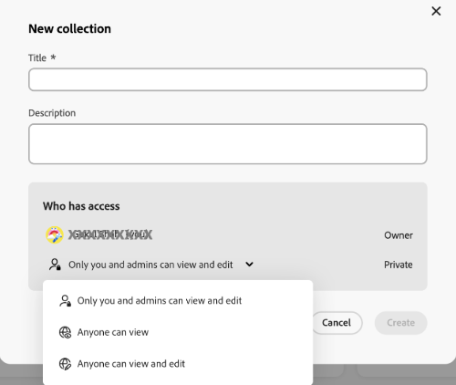

1. Em **[!UICONTROL Quem pode acessar]** lista suspensa > selecione o tipo de controle de acesso. As opções disponíveis são as seguintes:

   | Método de acesso | Tipo de acesso | Descrição |
   |---|---|---|
   | **Somente você e administradores podem editar** | Privado | Somente o criador e os administradores podem editar e acessar esta coleção. |
   | **Qualquer pessoa pode visualizar** | Público | Todos podem acessar esta coleção, mas somente o criador e os administradores podem editar. |
   | **Qualquer pessoa pode visualizar e editar** | Público | Esta coleção está aberta a todos, com permissões de acesso total e edição concedidas sem restrições. |

   >[!NOTE]
   >
   > O administrador do [!DNL Content Hub] pode exibir todas as opções disponíveis na lista suspensa **[!UICONTROL Quem pode acessar]**, enquanto que para os usuários comuns, é necessário [especificar e configurar](configure-content-hub-ui-options.md) quais opções eles podem acessar.

1. Clique em **[!UICONTROL Criar]**. Depois de concluído, você pode [adicionar ativos à coleção](#add-assets-to-existing-collection).

>[!VIDEO](https://video.tv.adobe.com/v/3463336)

<!--
>[!NOTE]
>
>Collections governance is a limited availability feature. You can get it enabled  by creating a support ticket. Once enabled, you need to [Configure Collections in Content Hub](configure-content-hub-ui-options.md#configure-collections-content-hub).-->

<!--To create a new collection, navigate to the **[!UICONTROL Collections]** tab and click **[!UICONTROL Create new collection]**. Enter the **[!UICONTROL Title]** and provide an optional **[!UICONTROL Description]** for the assets. Click **[!UICONTROL Create]**.
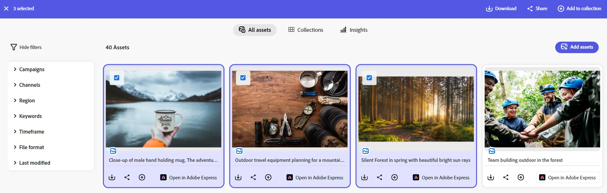          
-->

### Adicionar ativos a uma coleção existente{#add-assets-to-existing-collection}

Para adicionar ativos a uma coleção existente, selecione os ativos que precisam ser adicionados à coleção. Clique em **[!UICONTROL Adicionar à coleção]**. Será solicitado que você selecione a coleção.

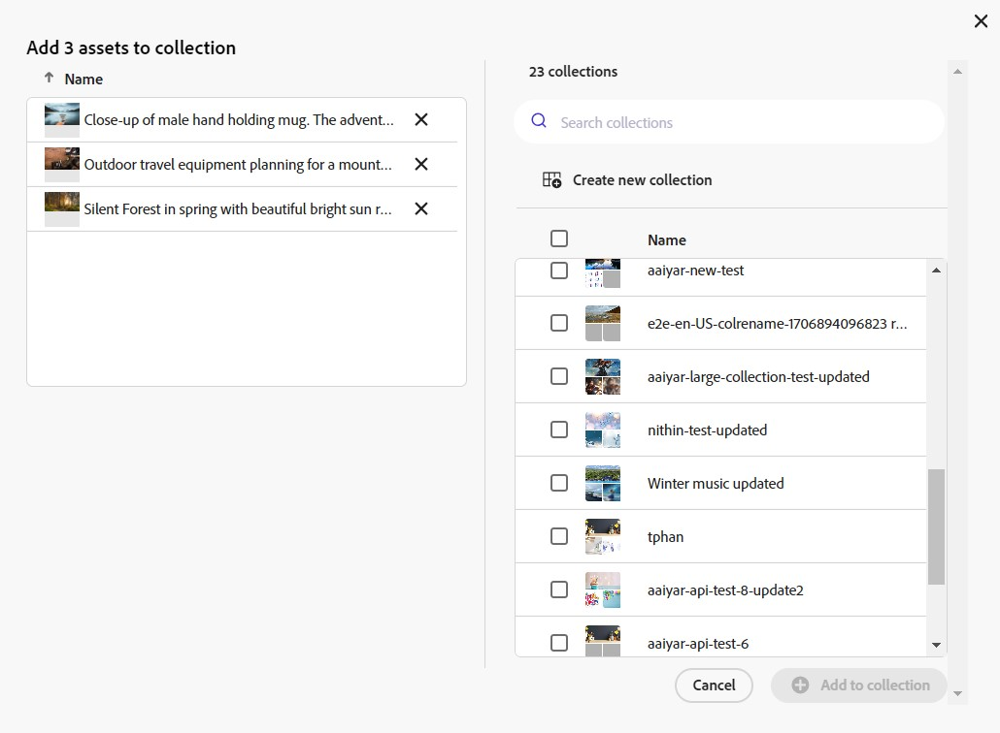

Escolha a coleção à qual você precisa adicionar o ativo. Também é possível pesquisar a coleção existente usando a barra de pesquisa.  Selecione as coleções às quais você precisa adicionar os ativos e clique em **[!UICONTROL Adicionar à coleção]**.

## Exibir coleções{#view-collections}

Navegue até a guia **[!UICONTROL Coleções]** e procure o nome da coleção. Você pode usar filtros para refinar os resultados da pesquisa selecionando critérios específicos, ajudando você a encontrar rapidamente as coleções mais relevantes.

Para exibir a lista de ativos disponíveis em uma coleção, clique no nome da coleção. Também é possível aplicar filtros em uma coleção para restringir os resultados do ativo. Clique no ativo que você precisa visualizar em uma coleção. [!DNL Content Hub] exibe a exibição detalhada do ativo. [Ver detalhes do ativo](asset-properties-content-hub.md).

### Filtrar exibição de coleções {#filter-collections-view}

O Content Hub permite filtrar a exibição de coleções para encontrar facilmente exatamente o que você está procurando, restringindo as opções com base em suas preferências. Verifique a [configuração de Coleções no Content Hub](configure-content-hub-ui-options.md#configure-collections-content-hub).

Para filtrar a exibição de coleções, vá para a guia **[!DNL Collections]** e navegue até o menu suspenso Coleções. Escolha entre as seguintes opções:

* **[!UICONTROL Todas as Coleções]:** selecione esta opção para exibir e editar todas as coleções, inclusive aquelas que são privadas ou compartilhadas com você.
* **[!UICONTROL Somente eu]:** selecione esta opção para exibir as coleções que são acessíveis a você.
* **[!UICONTROL Qualquer pessoa pode visualizar]:** Essa opção permite que você filtre coleções que podem ser acessadas por todos, mas que só podem ser editadas pelo criador.
* **[!UICONTROL Qualquer pessoa pode editar]:** Selecione esta opção para filtrar coleções que possam ser acessadas e editadas por todos.

  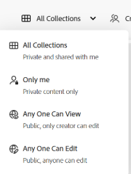

Além disso, para filtrar a exibição de coleções com base nas permissões de acesso, vá para a guia **[!DNL Collections]** e navegue até uma das seguintes opções:

* **[!UICONTROL Criado por qualquer pessoa]:** este filtro restringe você a visualizar coleções criadas por qualquer usuário.

* **[!UICONTROL Criado por mim]:** este filtro restringe você a exibir coleções criadas por você.

  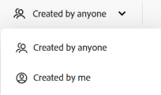

<!--
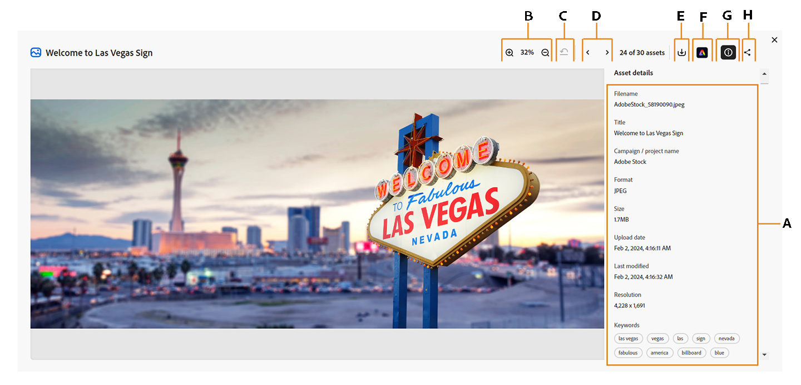

* **A**: Details and metadata of the asset 
* **B**: Zoom In or Zoom Out the asset 
* **C**: Reset Zoom view 
* **D**: View the previous or next asset 
* **E**: Download the asset 
* **F**: Open the asset in Adobe Express 
* **G**: Hide the metadata of the asset 
* **H**: Share the asset as a link 
-->

## Baixar ativos disponíveis em uma coleção{#download-assets-within-collection}

Para baixar os ativos disponíveis em uma coleção, navegue até a guia **[!UICONTROL Coleções]**.\
Clique no ícone  no cartão de coleção.

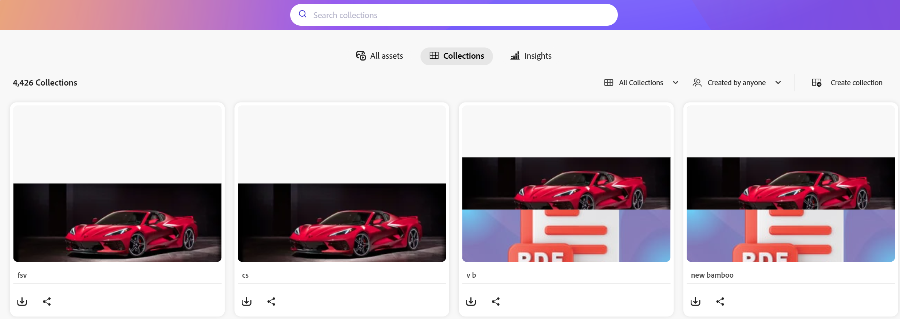

Todos os ativos na coleção são baixados.

Também é possível abrir a coleção para baixar os ativos individualmente. Clique na coleção que contém os ativos que você precisa baixar. Selecione os ativos e clique em **[!UICONTROL Baixar]**.

Saiba como [baixar um ativo do [!DNL Content Hub]](download-assets-content-hub.md).

## Compartilhar ativos disponíveis em uma coleção {#share-assets-available-within-collection}

Você também pode compartilhar os ativos disponíveis em uma coleção. [habilite o compartilhamento de link público no Content Hub](configure-content-hub-ui-options.md#configure-collections-content-hub). Navegue até a guia **[!UICONTROL Coleções]**. Selecione o ícone  no cartão de ativos. O link de compartilhamento é copiado. Você pode compartilhar o link copiado com o recipient. Saiba mais sobre o [compartilhamento de ativos no [!DNL Content Hub]](share-assets-content-hub.md).

O Content Hub Collections fornece ferramentas de governança abrangentes para um gerenciamento eficiente de ativos, incluindo permissões de compartilhamento personalizáveis e recursos de colaboração. Do acesso somente leitura ao controle administrativo completo, essas configurações suportam controle fino sobre a distribuição de ativos. Ao compartilhar um ativo individualmente ou como parte de uma coleção, o escopo do acesso é determinado pelo nível de acesso atual da coleção atribuído ao usuário. Como alternativa, não é possível compartilhar uma coleção privada.

## Editar detalhes de uma coleção {#edit-details-of-collection}

Para editar o **[!UICONTROL Título]** e a **[!UICONTROL Descrição]** de uma coleção, clique no nome da coleção e no ícone . A tela [!UICONTROL Detalhes da Coleção] é exibida e permite editar o **[!UICONTROL Título]** e a **[!UICONTROL Descrição]** de uma coleção. Clique em **[!UICONTROL Salvar alterações]** para confirmar as modificações. Além disso, você pode atualizar o acesso à coleção por meio da caixa de diálogo Editar coleção, dependendo da configuração.

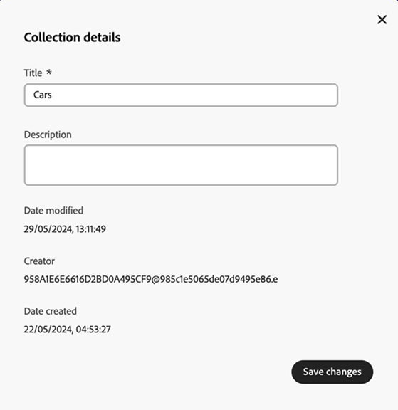

## Remover ativos de uma coleção{#remove-assets-from-a-collection}

Os seguintes usuários podem remover um ou vários ativos de uma coleção:

* Um administrador
* Um proprietário de coleção
* Um usuário não administrador com direitos de edição

Para remover ativos de uma coleção, clique na coleção da qual você precisa remover ativos, selecione os ativos e clique em **[!UICONTROL Remover da coleção]**.

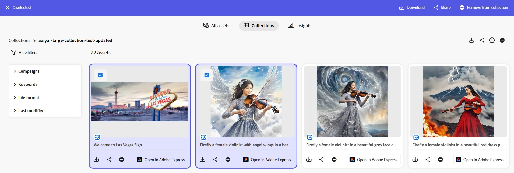

Será solicitado que você confirme a remoção do ativo. Clique em **[!UICONTROL Remover]**.\
Os ativos selecionados foram removidos com êxito da coleção.

## Excluir uma coleção{#delete-collection}

Somente administradores e criadores podem excluir uma coleção. Para excluir uma coleção, navegue até a guia **[!UICONTROL Coleções]** e clique na coleção que você precisa excluir. Clique no ícone  para excluir a coleção.

## Fixar ou desafixar coleção {#pin-unpin-collection}

Os administradores do Content Hub podem fixar coleções no Content Hub para acesso rápido. As coleções fixadas são exibidas em uma seção Fixa dedicada na página inicial Coleções, facilitando o alcance de coleções importantes. Para obter acesso rápido, você pode fixar ou desfixar uma coleção executando as etapas abaixo:

1. Navegue pelas coleções que deseja fixar ou desfixar.

1. Clique em **[!UICONTROL Mais ações]**  e selecione **[!UICONTROL Fixar para acesso rápido]**. Uma caixa de confirmação é exibida.

   

1. Clique em **[!UICONTROL Fixar]** para confirmar. A mensagem de aviso é exibida ao fixar uma coleção privada.

   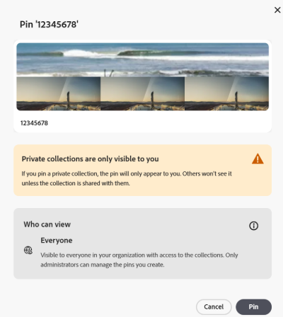

   As coleções fixadas aparecem na parte superior para acesso rápido. Como alternativa, para desafixar a coleção, clique em **[!UICONTROL Mais ações]**  e selecione **[!UICONTROL Desafixar]**.

   

## Marcar coleções como favoritas {#favorite-collection}

Você pode marcar Coleções como Favoritas no Content Hub, facilitando sua organização e recuperação. Depois de adicionadas, suas coleções favoritas ficam convenientemente disponíveis na guia Favoritos na página inicial do Content Hub. Além disso, você pode pesquisar ativos em Coleções favoritas. Para marcar coleções como Favoritos, siga estas etapas:

1. Procure as coleções que deseja marcar como Favoritos.

1. Clique em **[!UICONTROL Mais ações]**  e selecione **[!UICONTROL Adicionar aos Favoritos]** para marcar a coleção como Favorita.

   

   As coleções marcadas como Favoritos agora são exibidas na guia **[!UICONTROL Meus Favoritos]**. Como alternativa, você pode remover as coleções de **[!UICONTROL Meus favoritos]**. Para fazer isso, clique em **[!UICONTROL Mais ações]**  e selecione **[!UICONTROL Remover dos favoritos]**.

   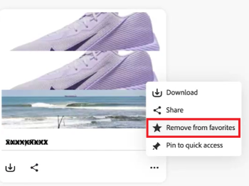

## Perguntas frequentes {#faqs-manage-collections-content-hub}

### A que se refere como coleções no AEM Assets Content Hub?

Uma coleção no AEM Assets Content Hub se refere a um conjunto de ativos que podem ser compartilhados entre os usuários. As coleções podem incluir ativos de diferentes locais, mantendo sua integridade referencial. Eles criam um espaço compartilhado para que os usuários acessem e utilizem o conteúdo com eficiência.

### Como posso criar uma nova coleção no AEM Assets Content Hub?

Para criar uma nova coleção no AEM Assets Content Hub, vá para a guia Coleções e clique em **Criar Coleção**. Na nova janela Coleção, adicione um Título e Descrição, selecione o tipo de controle de acesso na lista suspensa **Quem pode acessar** e clique em **Criar**. Em seguida, é possível adicionar ativos à coleção.

### Que tipos de controle de acesso estão disponíveis ao criar uma coleção?

Há três tipos de controle de acesso: **Privado** - Somente o criador e os administradores podem editar e acessar, **Público** - Somente exibição - Todos podem exibir, mas somente o criador e os administradores podem editar, e **Público** - Exibir e editar - todos podem acessar e editar a coleção sem restrições.

### Quem pode executar ações em coleções no Content Hub?

Os usuários do Content Hub podem executar ações como criar, exibir, compartilhar, baixar, remover, excluir, fixar coleções e marcá-las como favoritos. Os administradores têm privilégios adicionais, como visualizar todas as opções de acesso e excluir coleções.

### Como adicionar ativos a uma coleção existente no AEM Assets Content Hub?

Selecione os ativos que deseja adicionar, clique em **Adicionar à coleção** e escolha a coleção na lista. Também é possível pesquisar coleções usando a barra de pesquisa. Clique em **Adicionar à coleção** para confirmar a ação.

### As coleções podem ser filtradas e pesquisadas no AEM Assets Content Hub?

Sim, as coleções podem ser filtradas e pesquisadas no AEM Assets Content Hub por nome, permissões de acesso ou criador. Os filtros incluem opções como **Todas as coleções**, **Somente eu**, **Qualquer pessoa pode exibir**, **Qualquer pessoa pode editar**, **Criado por qualquer pessoa** e **Criado por mim**.

### Como baixar ativos de uma coleção no AEM Assets Content Hub?

Para baixar ativos de uma coleção no AEM Assets Content Hub, navegue até a guia **Coleções** e clique no ícone de download no cartão de coleção para baixar todos os ativos. Você também pode abrir a coleção, selecionar ativos individuais e clicar em **Baixar** para baixá-los separadamente.

### Como os ativos podem ser compartilhados a partir de uma coleção no AEM Assets Content Hub?

O Assets pode ser compartilhado ao ativar o compartilhamento de link público no Content Hub. Selecione o ícone de compartilhamento no cartão de ativos para copiar o link de compartilhamento, que pode ser enviado para os recipients. Observe que coleções privadas não podem ser compartilhadas.

### Quem pode remover ativos de uma coleção no AEM Assets Content Hub?

Um proprietário da coleção, um administrador ou um usuário não administrador com direitos de edição pode remover um ou vários ativos de uma coleção. Para remover, selecione os ativos e clique em **Remover da coleção**. Em seguida, confirme a remoção.

### Quem tem permissão para excluir uma coleção do AEM Assets Content Hub e como isso é feito?

Somente administradores e o criador de uma coleção podem excluí-la. Para excluir, navegue até a guia Coleções, selecione a coleção e clique no ícone excluir. A coleção é removida do AEM Assets Content Hub.

### Quais todas as opções um administrador pode configurar para coleções no AEM Assets Content Hub?

O administrador pode ativar ou desativar as seguintes opções para coleções no AEM Assets Content Hub:

* Habilite a opção **Exibir Somente Coleções** para permitir coleções que sejam acessíveis a todos, mas editáveis apenas pelo criador e administrador.

* Habilite a opção **Coleções Públicas** para permitir coleções que sejam acessíveis e editáveis por todos. Se as opções de alternância **Exibir Somente Coleções** e **Coleções Públicas** estiverem desabilitadas, por padrão, os usuários não administradores poderão criar somente coleções privadas.

