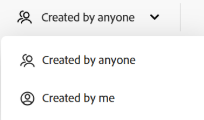
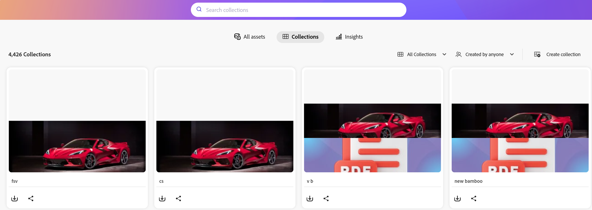

# Gerenciar coleções em [!DNL Content Hub] {#manage-collections}

<table>
    <tr>
        <td>
            <i>Novo</i> <a href="/help/assets/dynamic-media/dm-prime-ultimate.md"><b>Dynamic Media Prime e Ultimate</b></a>
        </td>
        <td>
            <i>Novo</i> <a href="/help/assets/assets-ultimate-overview.md"><b>AEM Assets Ultimate</b></a>
        </td>
        <td>
            <i>Nova</i> <a href="/help/assets/integrate-aem-assets-edge-delivery-services.md"><b>integração do AEM Assets com o Edge Delivery Services</b></a>
        </td>
        <td>
            <i>Novo</i> <a href="/help/assets/aem-assets-view-ui-extensibility.md"><b>Extensibilidade da Interface do Usuário</b></a>
        </td>
          <td>
            <i>Novo</i> <a href="/help/assets/dynamic-media/enable-dynamic-media-prime-and-ultimate.md"><b>Habilitar o Dynamic Media Prime e o Ultimate</b></a>
        </td>
    </tr>
    <tr>
        <td>
            <a href="/help/assets/search-best-practices.md"><b>Práticas recomendadas de pesquisa</b></a>
        </td>
        <td>
            <a href="/help/assets/metadata-best-practices.md"><b>Práticas recomendadas para metadados</b></a>
        </td>
        <td>
            <a href="/help/assets/product-overview.md"><b>Centro de conteúdo</b></a>
        </td>
        <td>
            <a href="/help/assets/dynamic-media-open-apis-overview.md"><b>Dynamic Media com recursos da OpenAPI</b></a>
        </td>
        <td>
            <a href="https://developer.adobe.com/experience-cloud/experience-manager-apis/"><b>Documentação do AEM Assets para desenvolvedores</b></a>
        </td>
    </tr>
</table>
<!--  -->

>[!AVAILABILITY]
>
>O guia do Content Hub agora está disponível no formato PDF. Baixe o guia inteiro e use o Assistente de IA da Adobe Acrobat para responder às suas consultas.
>
>[!BADGE PDF do Guia do Content Hub]{type=Informative url="https://helpx.adobe.com/content/dam/help/en/experience-manager/aem-assets/content-hub.pdf"}

Uma coleção se refere a um conjunto de ativos que podem ser compartilhados entre usuários. Uma coleção pode incluir ativos de diferentes locais, mantendo sua integridade referencial.

[!DNL Content Hub] permite que você crie coleções públicas. Essas coleções são acessíveis a todos os usuários autorizados, criando um espaço compartilhado em que vários usuários podem acessar e utilizar o conteúdo com eficiência. As coleções promovem o uso colaborativo de recursos para aumentar a eficiência e a comodidade. Na página de navegação da coleção, é possível:

* **Criar**: crie uma ou mais coleções.
* **Exibir**: exibir os ativos e suas propriedades.
* **Compartilhar**: compartilhar ativos como um link com outras pessoas.
* **Baixar**: baixe os ativos.
* **Remover**: remover ativos específicos de uma coleção.
* **Excluir**: excluir toda a coleção.

Ele ajuda os usuários a acessar e gerenciar facilmente os diversos ativos disponíveis no [!DNL Content Hub].

## Pré-requisitos {#prerequisites}

[Usuários do Content Hub](deploy-content-hub.md#onboard-content-hub-users) podem executar as ações mencionadas neste artigo.

## Criar coleções{#create-collections}

Você pode optar por [criar uma nova coleção](#create-new-collection) ou [adicionar ativos a uma coleção existente](#add-assets-to-existing-collection) ao gerenciar a governança.

### Criar uma nova coleção{#create-new-collection}

Execute as etapas abaixo para controlar o acesso ao criar coleções:

1. Vá para a guia **[!DNL Collections]** e clique em **[!UICONTROL Criar Coleção]**. A janela Nova coleção é exibida.

1. Adicionar **[!UICONTROL Título]** e **[!UICONTROL Descrição]** à coleção.

   

1. Em **[!UICONTROL Quem pode acessar]** lista suspensa > selecione o tipo de controle de acesso. As opções disponíveis são as seguintes:

   | Método de acesso | Tipo de acesso | Descrição |
   |---|---|---|
   | **Somente você e administradores podem acessar** | Privado | Somente o Criador e os administradores podem editar e acessar essa coleção. |
   | **Qualquer pessoa pode acessar** | Público | Todos podem acessar esta coleção, mas somente o criador e os administradores podem editar. |
   | **Qualquer pessoa pode acessar e editar** | Público | Esta coleção está aberta a todos, com permissões de acesso total e edição concedidas sem restrições. |

1. Clique em **[!UICONTROL Criar]**. Depois de concluído, você pode [adicionar ativos à coleção](#add-assets-to-existing-collection).

>[!VIDEO](https://video.tv.adobe.com/v/3463336)

>[!NOTE]
>
>A governança de coleções é um recurso de disponibilidade limitada. Você pode ativá-lo criando um tíquete de suporte. Depois de habilitado, você precisa [Configurar Coleções no Content Hub](configure-content-hub-ui-options.md#configure-collections-content-hub).

<!--To create a new collection, navigate to the **[!UICONTROL Collections]** tab and click **[!UICONTROL Create new collection]**. Enter the **[!UICONTROL Title]** and provide an optional **[!UICONTROL Description]** for the assets. Click **[!UICONTROL Create]**.
          
-->

### Adicionar ativos a uma coleção existente{#add-assets-to-existing-collection}

Para adicionar ativos a uma coleção existente, selecione os ativos que precisam ser adicionados à coleção. Clique em **[!UICONTROL Adicionar à coleção]**. Será solicitado que você selecione a coleção.

Escolha a coleção à qual você precisa adicionar o ativo. Também é possível pesquisar a coleção existente usando a barra de pesquisa.  Selecione as coleções às quais você precisa adicionar os ativos e clique em **[!UICONTROL Adicionar à coleção]**.

## Exibir coleções{#view-collections}

Navegue até a guia **[!UICONTROL Coleções]** e procure o nome da coleção. Você pode usar filtros para refinar os resultados da pesquisa selecionando critérios específicos, ajudando você a encontrar rapidamente as coleções mais relevantes.

Para exibir a lista de ativos disponíveis em uma coleção, clique no nome da coleção. Também é possível aplicar filtros em uma coleção para restringir os resultados do ativo. Clique no ativo que você precisa visualizar em uma coleção. [!DNL Content Hub] exibe a exibição detalhada do ativo. [Ver detalhes do ativo](asset-properties-content-hub.md).

### Filtrar exibição de coleções {#filter-collections-view}

O Content Hub permite filtrar a exibição de coleções para encontrar facilmente exatamente o que você está procurando, restringindo as opções com base em suas preferências. Verifique a [configuração de Coleções no Content Hub](configure-content-hub-ui-options.md#configure-collections-content-hub).

Para filtrar a exibição de coleções, vá para a guia **[!DNL Collections]** e navegue até o menu suspenso Coleções. Escolha entre as seguintes opções:

* **[!UICONTROL Todas as coleções]:** selecione essa opção para exibir todas as coleções que são privadas e compartilhadas com você.
* **[!UICONTROL Somente eu]:** selecione esta opção para exibir as coleções que são acessíveis a você.
* **[!UICONTROL Qualquer pessoa pode visualizar]:** Essa opção permite que você filtre coleções que podem ser acessadas por todos, mas que só podem ser editadas pelo criador.
* **[!UICONTROL Qualquer pessoa pode editar]:** Selecione esta opção para filtrar coleções que possam ser acessadas e editadas por todos.

  

Além disso, para filtrar a exibição de coleções com base nas permissões de acesso, vá para a guia **[!DNL Collections]** e navegue até uma das seguintes opções:

* **[!UICONTROL Criado por qualquer pessoa]:** este filtro restringe você a visualizar coleções criadas por qualquer usuário.

* **[!UICONTROL Criado por mim]:** este filtro restringe você a exibir coleções criadas por você.

  

<!--

* **A**: Details and metadata of the asset 
* **B**: Zoom In or Zoom Out the asset 
* **C**: Reset Zoom view 
* **D**: View the previous or next asset 
* **E**: Download the asset 
* **F**: Open the asset in Adobe Express 
* **G**: Hide the metadata of the asset 
* **H**: Share the asset as a link 
-->

## Baixar ativos disponíveis em uma coleção{#download-assets-within-collection}

Para baixar os ativos disponíveis em uma coleção, navegue até a guia **[!UICONTROL Coleções]**.\
Clique no ícone  no cartão de coleção.

Todos os ativos na coleção são baixados.

Também é possível abrir a coleção para baixar os ativos individualmente. Clique na coleção que contém os ativos que você precisa baixar. Selecione os ativos e clique em **[!UICONTROL Baixar]**.

Saiba como [baixar um ativo do [!DNL Content Hub]](download-assets-content-hub.md).

## Compartilhar ativos disponíveis em uma coleção {#share-assets-available-within-collection}

Você também pode compartilhar os ativos disponíveis em uma coleção. [habilite o compartilhamento de link público no Content Hub](configure-content-hub-ui-options.md#enable-public-link-sharing). Navegue até a guia **[!UICONTROL Coleções]**. Selecione o ícone  no cartão de coleção. O link de compartilhamento é copiado. Você pode compartilhar o link copiado com o recipient. Saiba mais sobre o [compartilhamento de ativos no [!DNL Content Hub]](share-assets-content-hub.md).

Ao compartilhar coleções no Content Hub, é possível definir o escopo de acesso e as ações que os recipients podem executar em recursos digitais no sistema. O Content Hub Collections fornece ferramentas de governança abrangentes para um gerenciamento eficiente de ativos, incluindo permissões de compartilhamento personalizáveis e recursos de colaboração. Do acesso somente leitura ao controle administrativo completo, essas configurações suportam controle fino sobre a distribuição de ativos.

## Editar detalhes de uma coleção {#edit-details-of-collection}

Para editar o **[!UICONTROL Título]** e a **[!UICONTROL Descrição]** de uma coleção, clique no nome da coleção e no ícone . A tela [!UICONTROL Detalhes da Coleção] é exibida e permite editar o **[!UICONTROL Título]** e a **[!UICONTROL Descrição]** de uma coleção. Clique em **[!UICONTROL Salvar alterações]** para confirmar as modificações.

## Remover ativos de uma coleção{#remove-assets-from-a-collection}

Você pode remover um ou vários ativos de uma coleção. Para remover ativos de uma coleção, clique na coleção da qual você precisa remover ativos, selecione os ativos e clique em **[!UICONTROL Remover da coleção]**.

Será solicitado que você confirme a remoção do ativo. Clique em **[!UICONTROL Remover]**.\
Os ativos selecionados foram removidos com êxito da coleção.

## Excluir uma coleção{#delete-collection}

Para excluir uma coleção, navegue até a guia **[!UICONTROL Coleções]** e clique na coleção que você precisa excluir. Clique no ícone  para excluir a coleção.

