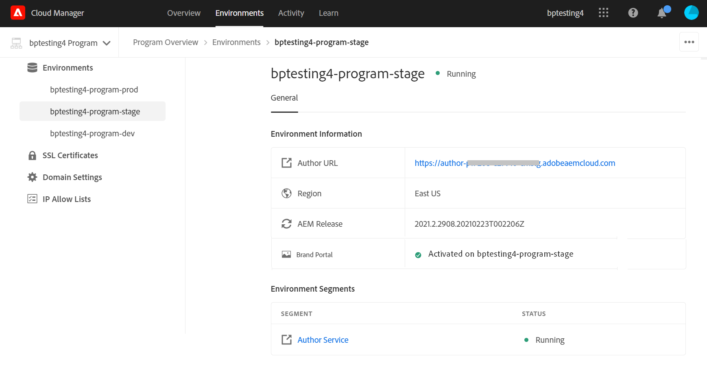
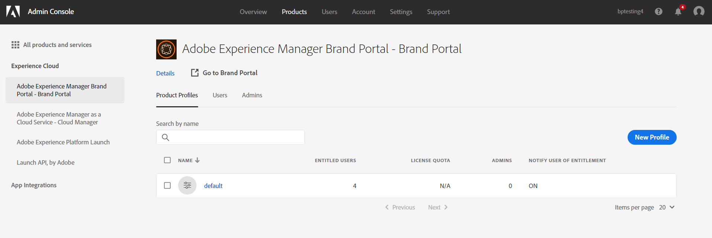
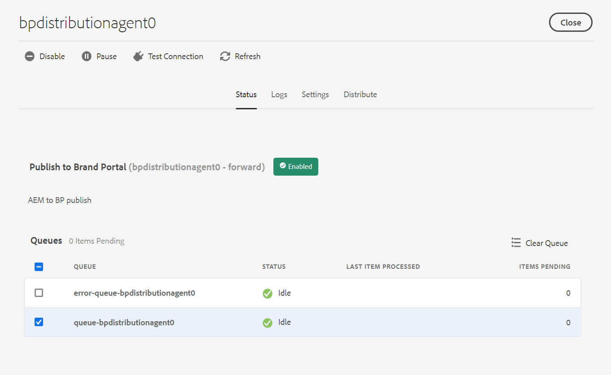

# Configurar o Experience Manager Assets com o Brand Portal {#configure-aem-assets-with-brand-portal}

| Versão | Link do artigo |
| -------- | ---------------------------- |
| AEM 6.5 | [Clique aqui](https://experienceleague.adobe.com/docs/experience-manager-65/assets/brandportal/configure-aem-assets-with-brand-portal.html?lang=pt-BR) |
| AEM as a Cloud Service | Este artigo |

A configuração do Adobe Experience Manager Assets Brand Portal permite publicar ativos de marca aprovados do Adobe Experience Manager Assets as a [!DNL Cloud Service] para o Brand Portal e distribuí-los aos usuários do Brand Portal.

## Ativar o Brand Portal usando o Cloud Manager {#activate-brand-portal}

O usuário do Cloud Manager ativa o Brand Portal para um Experience Manager Assets as a [!DNL Cloud Service] instância. O fluxo de trabalho de ativação cria as configurações necessárias (token de autorização, configuração do IMS e Brand Portal Cloud Service) no back-end e reflete o status do locatário do Brand Portal no Cloud Manager. A ativação do Brand Portal permite que os usuários do Experience Manager Assets publiquem ativos no Brand Portal e os distribuam aos usuários do Brand Portal.

**Pré-requisitos**

Você precisa do seguinte para ativar o Brand Portal no seu Experience Manager Assets as a [!DNL Cloud Service] instância:

* Um Experience Manager Assets as a [!DNL Cloud Service] instância.
* Um usuário com acesso ao Cloud Manager, atribuído aos Perfis do Cloud Manager Product. Consulte [acesso ao Cloud Manager](https://experienceleague.adobe.com/docs/experience-manager-cloud-service/security/ims-support.html#accessing-cloud-manager) para obter mais informações.

>[!NOTE]
>
>Um ambiente de produção configurado é necessário para um Experience Manager Assets as a [!DNL Cloud Service] instância para se conectar com o locatário do Brand Portal.

**Etapas para ativar o Brand Portal**

Você pode ativar o Brand Portal ao criar os ambientes de produção para o seu Experience Manager Assets as a [!DNL Cloud Service] instância ou separadamente. Vamos supor que o ambiente já tenha sido criado e que agora você seja solicitado a ativar o Brand Portal.

1. Faça logon no Adobe Cloud Manager e acesse **[!UICONTROL Ambientes]**.

   A variável **[!UICONTROL Ambientes]** exibe a lista de todos os ambientes existentes.

1. Selecione os ambientes (um por um) na lista para exibir os detalhes do ambiente.

   O Brand Portal tem direito a um dos ambientes disponíveis e é refletido na variável **[!UICONTROL Informações do ambiente]**.

   Depois de encontrar o ambiente associado ao Brand Portal, clique no link **[!UICONTROL Ativar Brand Portal]** para iniciar o fluxo de trabalho de ativação.

   

1. Leva alguns minutos para ativar o locatário do Brand Portal, pois o fluxo de trabalho de ativação cria as configurações necessárias no back-end. Depois que o locatário do Brand Portal é ativado, o status muda para Ativated.

   

>[!NOTE]
>
>O Brand Portal deve ser ativado na mesma organização IMS do Experience Manager Assets como um [!DNL Cloud Service] instância.
>
>Se você tiver uma configuração de nuvem existente do Brand Portal ([configurado manualmente usando o console do Adobe Developer](#manual-configuration)) para uma organização IMS (org1-existing) e seu Experience Manager Assets as a [!DNL Cloud Service] estiver configurada para outra organização IMS (org2-new), ativar o Brand Portal no Cloud Manager redefinirá a organização IMS do Brand Portal para `org2-new`. Embora a configuração de nuvem definida manualmente em `org1-existing` está visível na instância do autor do Experience Manager Assets, mas não estará mais em uso após ativar o Brand Portal no Cloud Manager.
>
>Se a configuração de nuvem existente do Brand Portal e o Experience Manager Assets as a [!DNL Cloud Service] As instâncias do usam a mesma organização IMS (org1). Você só precisa ativar o Brand Portal no Cloud Manager.
>
>Não modifique nenhuma configuração gerada automaticamente.

**Consulte também**:

* [Adicionar usuários e funções no Experience Manager Assets as a Cloud Service](https://experienceleague.adobe.com/docs/experience-manager-cloud-manager/using/requirements/setting-up-users-and-roles.html)

* [Gerenciar ambientes no Cloud Manager](https://experienceleague.adobe.com/docs/experience-manager-cloud-service/implementing/using-cloud-manager/manage-environments.html#adding-environments)

**Faça logon no seu locatário do Brand Portal**:

Após a ativação do locatário do Brand Portal no Cloud Manager, você poderá fazer logon no Brand Portal pelo Admin Console ou usando diretamente o URL do locatário.

O URL padrão do seu locatário do Brand Portal é: `https://<tenant-id>.brand-portal.adobe.com/`.

Onde, a ID do locatário é a Organização IMS.

Execute as seguintes etapas se não tiver certeza do URL do Brand Portal:

1. Fazer logon em [Admin Console](https://adminconsole.adobe.com/) e navegue até **[!UICONTROL Produtos]**.
1. No painel esquerdo, selecione **[!UICONTROL ADOBE EXPERIENCE MANAGER BRAND PORTAL - BRAND PORTAL]**.
1. Clique em **[!UICONTROL Ir para o Brand Portal]** para abrir o Brand Portal diretamente no navegador.

   Ou copie o URL do locatário do Brand Portal da **[!UICONTROL Ir para o Brand Portal]** vincule-o e cole-o no navegador para abrir a interface do Brand Portal.

   

**Testar conexão**

Execute as seguintes etapas para validar a conexão entre seu Experience Manager Assets as a [!DNL Cloud Service] instância e locatário do Brand Portal:

1. Faça logon no Experience Manager Assets.

1. No **Ferramentas** , navegue até **[!UICONTROL Implantação]** > **[!UICONTROL Distribuição]**.

   

   Um agente de distribuição da Brand Portal (**[!UICONTROL bpdistributionagent0]**) é criado em **[!UICONTROL Publicar no Brand Portal]**.

   

1. Clique em **[!UICONTROL Publicar no Brand Portal]** para abrir o agente de distribuição.

   Você pode ver as filas de distribuição no **[!UICONTROL Status]** guia.

   Um agente de distribuição contém duas filas:
   * **fila de processamento**: para distribuição de ativos no Brand Portal.

   * **fila de erros**: para os ativos em que a distribuição falhou.

   >[!NOTE]
   >
   >É recomendável analisar as falhas e limpar a **fila de erros** periodicamente.

   

1. Para verificar a conexão entre o Experience Manager Assets as a [!DNL Cloud Service] e Brand Portal, clique no link **[!UICONTROL Testar conexão]** ícone.

   

   Será exibida uma mensagem informando que o *o pacote de teste foi entregue com sucesso*.

   >[!NOTE]
   >
   >Evite desativar o agente de distribuição, pois isso pode causar falha na distribuição dos ativos (em execução na fila).

Para verificar a conexão entre o Experience Manager Assets as a [!DNL Cloud Service] instância e o locatário do Brand Portal, publique um ativo do Experience Manager Assets na Brand Portal. Se a conexão for bem-sucedida, o ativo publicado ficará visível na interface do Brand Portal.

Agora você pode:

* [Publicar ativos do Experience Manager Assets no Brand Portal](publish-to-brand-portal.md)
* [Publicar pastas do Experience Manager Assets no Brand Portal](publish-to-brand-portal.md#publish-folders-to-brand-portal)
* [Publicar coleções do Experience Manager Assets no Brand Portal](publish-to-brand-portal.md#publish-collections-to-brand-portal)
* [Publicar ativos do Brand Portal no Experience Manager Assets](https://experienceleague.adobe.com/docs/experience-manager-brand-portal/using/asset-sourcing-in-brand-portal/brand-portal-asset-sourcing.html?lang=pt-BR) - Origem de ativos no Brand Portal
* [Publicar predefinições, esquemas e aspectos no Brand Portal](https://experienceleague.adobe.com/docs/experience-manager-brand-portal/using/publish/publish-schema-search-facets-presets.html)
* [Publicar marcações no Brand Portal](https://experienceleague.adobe.com/docs/experience-manager-brand-portal/using/publish/brand-portal-publish-tags.html)

Consulte [Documentação do Brand Portal](https://experienceleague.adobe.com/docs/experience-manager-brand-portal/using/home.html) para obter mais informações.

**Logs de distribuição**

É possível monitorar os logs do agente de distribuição para o fluxo de trabalho de publicação de ativos.

Vamos publicar um ativo do Experience Manager Assets no Brand Portal e ver os logs.

1. Siga as etapas (de 1 a 4) conforme mostrado na **Testar conexão** e navegue até a página do agente de distribuição.
1. Clique em **[!UICONTROL Logs]** para visualizar os logs de processamento e de erros.

   

O agente de distribuição gerou os seguintes registros:

* INFO: é um registro gerado pelo sistema que é acionado na configuração bem-sucedida do agente de distribuição.
* DSTRQ1 (Solicitação 1): acionado na conexão de teste.

Ao publicar o ativo, os seguintes registros de solicitação e resposta são gerados:

**Solicitação do agente de distribuição**:

* DSTRQ2 (Solicitação 2): a solicitação de publicação de ativo é acionada.
* DSTRQ3 (Solicitação 3): o sistema aciona outra solicitação para publicar a pasta do Experience Manager Assets (na qual o ativo existe) e replicar a pasta no Brand Portal.

**Resposta do agente de distribuição**:

* queue-bpdistributionagent0 (DSTRQ2): o ativo é publicado no Brand Portal.
* queue-bpdistributionagent0 (DSTRQ3): o sistema replica a pasta do Experience Manager Assets (que contém o ativo) no Brand Portal.

No exemplo acima, uma solicitação e uma resposta adicionais são acionadas. O sistema não pôde localizar a pasta principal (Adicionar caminho) no Brand Portal porque o ativo foi publicado pela primeira vez. Portanto, acionou uma solicitação adicional para criar uma pasta principal com o mesmo nome no Brand Portal onde o ativo é publicado.

>[!NOTE]
>
>A solicitação adicional é gerada caso a pasta principal não exista no Brand Portal ou tenha sido modificada no Experience Manager Assets.

Juntamente com o fluxo de trabalho de automação para ativar o Brand Portal no Experience Manager Assets as a [!DNL Cloud Service], existe outro método para configurar manualmente o Experience Manager Assets as a [!DNL Cloud Service] com o Brand Portal usando o Adobe Developer Console, o que não é mais recomendado.

>[!NOTE]
>
>Entre em contato com o Suporte ao cliente se estiver enfrentando algum problema ao ativar seu locatário do Brand Portal.

## Configuração manual usando o console do Adobe Developer {#manual-configuration}

A seção a seguir descreve como configurar manualmente o Experience Manager Assets as a [!DNL Cloud Service] com o Brand Portal usando o Adobe Developer Console.

Anteriormente, o Experience Manager Assets as a [!DNL Cloud Service] O foi configurado manualmente com o Brand Portal por meio do Adobe Developer Console, que obtém um token de conta do Adobe Identity Management Services (IMS) para autorização do locatário do Brand Portal. Ele requer configurações no Experience Manager Assets e no Adobe Developer Console.

1. No Experience Manager Assets, crie uma conta IMS e gere uma chave pública (certificado).
1. No Console do Adobe Developer, crie um projeto para seu locatário do Brand Portal (organização).
1. No projeto, configure uma API usando a chave pública para criar uma conexão de conta de serviço.
1. Obtenha as credenciais da conta de serviço e as informações de carga do JSON Web Token (JWT).
1. No Experience Manager Assets, configure a conta IMS usando as credenciais da conta de serviço e a carga JWT.
1. No Experience Manager Assets, configure o serviço em nuvem da Brand Portal usando a conta IMS e o terminal Brand Portal (URL da organização).
1. Teste sua configuração publicando um ativo do Experience Manager Assets no Brand Portal.

>[!NOTE]
>
>Um Experience Manager Assets as a [!DNL Cloud Service] instância só deve ser configurada com um locatário do Brand Portal.

**Pré-requisitos**

Você precisa do seguinte para configurar o Experience Manager Assets com o Brand Portal:

* Um Experience Manager Assets as a [!DNL Cloud Service] instância
* Um URL de locatário do Brand Portal
* Um usuário com privilégios de administrador do sistema na organização IMS do locatário do Brand Portal

## Criar configuração {#create-new-configuration}

Execute as seguintes etapas na sequência especificada para configurar o Experience Manager Assets com o Brand Portal.

1. [Obter certificado público](#public-certificate)
1. [Criar conexão de conta de serviço (JWT)](#createnewintegration)
1. [Configurar conta IMS](#create-ims-account-configuration)
1. [Configurar o serviço em nuvem](#configure-the-cloud-service)

### Criar configuração IMS {#create-ims-configuration}

A configuração IMS autentica seu Experience Manager Assets as a [!DNL Cloud Service] instância com o locatário do Brand Portal.

A configuração IMS inclui duas etapas:

* [Obter certificado público](#public-certificate)
* [Configurar conta IMS](#create-ims-account-configuration)

### Obter certificado público {#public-certificate}

A chave pública (certificado) autentica seu perfil no Console do Adobe Developer.

1. Faça logon no Experience Manager Assets.
1. No **Ferramentas** , navegue até **[!UICONTROL Segurança]** > **[!UICONTROL Configurações do Adobe IMS]**.
1. Na página Configurações do Adobe IMS, clique em **[!UICONTROL Criar]**. Ele será redirecionado para a **[!UICONTROL Configurações da conta técnica do Adobe IMS]** página. Por padrão, a variável **Certificado** é aberta.
1. Selecionar **[!UICONTROL Adobe Brand Portal]** no **[!UICONTROL Solução em nuvem]** lista suspensa.
1. Selecione o **[!UICONTROL Criar novo certificado]** e especifique um **alias** para a chave pública. O alias atua como nome da chave pública.
1. Clique em **[!UICONTROL Criar certificado]**. Em seguida, clique em **[!UICONTROL OK]** para gerar a chave pública.

   

1. Clique em **[!UICONTROL Baixar chave pública]** e salve o arquivo de chave pública (CRT) em sua máquina.

   A chave pública é usada posteriormente para configurar a API do locatário do Brand Portal e gerar credenciais de conta de serviço no Adobe Developer Console.

   

1. Clique em **[!UICONTROL Avançar]**.

   No **Conta** , a conta do Adobe IMS é criada e requer as credenciais da conta de serviço geradas no Console do Adobe Developer. Mantenha esta página aberta por enquanto.

   Abra uma nova guia e [criar uma conexão de conta de serviço (JWT) no console do Adobe Developer](#createnewintegration) para obter as credenciais e a carga JWT para configurar a conta IMS.

### Criar conexão de conta de serviço (JWT) {#createnewintegration}

No Console do Adobe Developer, os projetos e as APIs são configurados no nível do locatário da Brand Portal (organização). Configurar uma API cria uma conexão de conta de serviço (JWT). Há dois métodos para configurar a API: gerar um par de chaves (chaves privadas e públicas) ou carregar uma chave pública. Para configurar o Experience Manager Assets com o Brand Portal, você deve gerar uma chave pública (certificado) no Experience Manager Assets e criar credenciais no Console do Adobe Developer fazendo upload da chave pública. Essas credenciais são necessárias para configurar a conta do IMS no Experience Manager Assets. Depois que a conta IMS é configurada, você pode configurar o serviço de nuvem da Brand Portal no Experience Manager Assets.

Execute as seguintes etapas para gerar as credenciais da conta de serviço e a carga JWT:

1. Faça logon no Adobe Developer Console com privilégios de administrador de sistema na organização IMS (locatário do Brand Portal). O URL padrão é [https://www.adobe.com/go/devs_console_ui](https://www.adobe.com/go/devs_console_ui).

   >[!NOTE]
   >
   >Verifique se você selecionou a organização IMS correta (locatário do Brand Portal) na lista suspensa (organização) localizada no canto superior direito.

1. Clique em **[!UICONTROL Criar novo projeto]**. Um projeto em branco com um nome gerado pelo sistema é criado para sua organização.

   Clique em **[!UICONTROL Editar projeto]** para atualizar o **[!UICONTROL Título do projeto]** e **[!UICONTROL Descrição]** e clique em **[!UICONTROL Salvar]**.

1. No **[!UICONTROL Visão geral do projeto]** clique em **[!UICONTROL Adicionar API]**.

1. No **[!UICONTROL Adicionar uma janela de API]**, selecione **[!UICONTROL AEM Brand Portal]** e clique em **[!UICONTROL Próxima]**.

   Verifique se você tem acesso ao serviço Experience Manager Brand Portal.

1. No **[!UICONTROL Configurar API]** clique em **[!UICONTROL Fazer upload da sua chave pública]**. Em seguida, clique em **[!UICONTROL Selecionar um arquivo]** e faça upload da chave pública (arquivo .crt) que você baixou na [obter certificado público](#public-certificate) seção.

   Clique em **[!UICONTROL Avançar]**.

   

1. Verifique a chave pública e clique em **[!UICONTROL Próxima]**.

1. Selecionar **[!UICONTROL Assets Brand Portal]** como o perfil de produto padrão e clique em **[!UICONTROL Salvar API configurada]**.

   

1. Após configurar a API, você é redirecionado para a página Visão geral da API. Na navegação à esquerda, em **[!UICONTROL Credenciais]**, clique no link **[!UICONTROL Conta de serviço (JWT)]** opção.

   >[!NOTE]
   >
   >* Você pode visualizar as credenciais e executar ações como gerar tokens JWT, copiar detalhes da credencial, recuperar segredo do cliente e assim por diante.
   >* No momento, somente o tipo de credencial Conta de serviço (JWT) do Console do desenvolvedor do Adobe é compatível. Não use o tipo de credencial OAuth de servidor para servidor até que seja compatível em meados de abril. Leia mais em [Descontinuação de credenciais JWT no console do Adobe Developer](https://experienceleague.adobe.com/docs/experience-manager-cloud-service/content/security/jwt-credentials-deprecation-in-adobe-developer-console.html).

1. No **[!UICONTROL Credenciais do cliente]** , copie o **[!UICONTROL ID do cliente]**.

   Clique em **[!UICONTROL Recuperar segredo do cliente]** e copie o **[!UICONTROL segredo do cliente]**.

   

1. Navegue até a **[!UICONTROL Gerar JWT]** e copie a guia **[!UICONTROL Carga JWT]** informações.

Agora você pode usar a ID do cliente (chave de API), o segredo do cliente e a carga JWT para [configurar a conta IMS](#create-ims-account-configuration) no Experience Manager Assets.

<!--
1. Click **[!UICONTROL Create Integration]**.

1. Select **[!UICONTROL Access an API]**, and click **[!UICONTROL Continue]**.

   

1. Create an integration page. 
   
   Select your organization from the drop-down list.

   In **[!UICONTROL Experience Cloud]**, Select **[!UICONTROL AEM Brand Portal]** and click **[!UICONTROL Continue]**. 

   If the Brand Portal option is disabled for you, ensure that you have selected correct organization from the drop-down box above the **[!UICONTROL Adobe Services]** option. If you do not know your organization, contact your administrator.

   

1. Specify a name and description for the integration. Click **[!UICONTROL Select a File from your computer]** and upload the `AEM-Adobe-IMS.crt` file downloaded in the [obtain public certificates](#public-certificate) section.

1. Select the profile of your organization. 

   Or, select the default profile **[!UICONTROL Assets Brand Portal]** and click **[!UICONTROL Create Integration]**. The integration is created.

1. Click **[!UICONTROL Continue to integration details]** to view the integration information. 

   Copy the **[!UICONTROL API Key]** 
   
   Click **[!UICONTROL Retrieve Client Secret]** and copy the Client Secret key.

   

1. Navigate to **[!UICONTROL JWT]** tab, and copy the **[!UICONTROL JWT payload]**.

   The API Key, Client Secret key, and JWT payload information is used to create IMS account configuration.

-->

### Configurar conta IMS {#create-ims-account-configuration}

Verifique se você executou as seguintes etapas:

* [Obter certificado público](#public-certificate)
* [Criar conexão de conta de serviço (JWT)](#createnewintegration)

Execute as seguintes etapas para configurar a conta IMS.

1. Abra a Configuração IMS e navegue até o **[!UICONTROL Conta]** guia. Você manteve a página aberta enquanto [obtenção do certificado público](#public-certificate).

1. Especifique um **[!UICONTROL Título]** para a conta IMS.

   No **[!UICONTROL Servidor de autorização]** especifique o URL: [https://ims-na1.adobelogin.com/](https://ims-na1.adobelogin.com/)

   Especifique a ID do cliente no **[!UICONTROL Chave de API]** campo, **[!UICONTROL Segredo do cliente]**, e **[!UICONTROL Carga]** (carga JWT) que você copiou enquanto [criação da conexão da conta de serviço (JWT)](#createnewintegration).

   Clique em **[!UICONTROL Criar]**.

   A conta IMS está configurada.

   

1. Selecione a configuração da conta IMS e clique em **[!UICONTROL Verificar integridade]**.

   Clique em **[!UICONTROL Marcar]** na caixa de diálogo. Na configuração bem-sucedida, é exibida a mensagem de que a variável *O token foi recuperado com sucesso*.

   

>[!CAUTION]
>
>Você deve ter apenas uma configuração IMS.
>
>A configuração IMS deve ser aprovada na verificação de integridade. Se a configuração não for aprovada na verificação de integridade, ela será inválida. Você deve excluí-la e criar outra configuração válida.

### Configurar o serviço em nuvem {#configure-the-cloud-service}

Execute as seguintes etapas para configurar o Brand Portal Cloud Service:

1. Faça logon no Experience Manager Assets.

1. No **Ferramentas** , navegue até **[!UICONTROL Cloud Service]** > **[!UICONTROL AEM Brand Portal]**.

1. Na página Configurações do Brand Portal, clique em **[!UICONTROL Criar]**.

1. Especifique um **[!UICONTROL Título]** para a configuração.

   Selecione a configuração IMS criada enquanto [configuração da conta IMS](#create-ims-account-configuration).

   No **[!UICONTROL URL do serviço]** especifique o URL do locatário (organização) do Brand Portal.

   

1. Clique em **[!UICONTROL Salvar e fechar]**. A configuração da nuvem é criada.

   Seu Experience Manager Assets as a [!DNL Cloud Service] agora a instância está configurada com o locatário do Brand Portal.

Agora você pode testar a configuração verificando o agente de distribuição e publicando ativos no Brand Portal.

**➡ Incluir na lista de permissões IPs de saída em SPS se a visualização segura estiver ativada**
Se estiver usando o Dynamic Media-Scene7 com [visualização segura ativada](#https://experienceleague.adobe.com/docs/dynamic-media-classic/using/upload-publish/testing-assets-making-them-public.html?lang=en) para uma empresa), recomenda-se que o administrador da empresa do Scene7 [incluir na lista de permissões os IPs de saída públicos](#https://experienceleague.adobe.com/docs/dynamic-media-classic/using/upload-publish/testing-assets-making-them-public.html?lang=en#testing-the-secure-testing-service) para as respectivas regiões usando a interface flash do SPS (Scene7 Publishing System).
Os IPs de saída são os seguintes:

| **Região** | **IP de saída** |
|--- |--- |
| ND | 130 248 160 68 20 94 203 130 |
| EMEA | 51.132.146.75, 130.248.244.202, 130.248.244.203, 130.248.244.204, 130.248.244.210, 130.248.244.211, 130.248.244.212 |
| APAC | 63.140.44.54 |

<!--
### Test configuration {#test-configuration}

Perform the following steps to validate the configuration:

1. Login to AEM Assets.

1. From the **Tools** panel, navigate to **[!UICONTROL Deployment]** > **[!UICONTROL Distribution]**.

    

   A Brand Portal distribution agent (**[!UICONTROL bpdistributionagent0]**) is created under **[!UICONTROL Publish to Brand Portal]**.

   

1. Click **[!UICONTROL Publish to Brand Portal]** to open the distribution agent. 

   You can see the distribution queues under the **[!UICONTROL Status]** tab. 
   
   A distribution agent contains two queues: 
   * **processing-queue**: for the distribution of assets to Brand Portal. 

   * **error-queue**: for the assets where distribution has failed. 
   
   >[!NOTE]
   >
   >It is recommended to review the failures and  clear the **error-queue** periodically.  

   

1. To verify the connection between AEM Assets as a [!DNL Cloud Service] and Brand Portal, click the **[!UICONTROL Test Connection]** icon.

   

   A message appears that your *test package is successfully delivered*.

   >[!NOTE]
   >
   >Avoid disabling the distribution agent, as it can cause the distribution of the assets (running-in-queue) to fail.

You can now:

* [Publish assets from AEM Assets to Brand Portal](publish-to-brand-portal.md)
* [Publish folders from AEM Assets to Brand Portal](publish-to-brand-portal.md#publish-folders-to-brand-portal)
* [Publish collections from AEM Assets to Brand Portal](publish-to-brand-portal.md#publish-collections-to-brand-portal)
* [Publish assets from Brand Portal to AEM Assets](https://experienceleague.adobe.com/docs/experience-manager-brand-portal/using/asset-sourcing-in-brand-portal/brand-portal-asset-sourcing.html) - Asset Sourcing in Brand Portal
* [Publish presets, schemas, and facets to Brand Portal](https://experienceleague.adobe.com/docs/experience-manager-brand-portal/using/publish/publish-schema-search-facets-presets.html)
* [Publish tags to Brand Portal](https://experienceleague.adobe.com/docs/experience-manager-brand-portal/using/publish/brand-portal-publish-tags.html)

See [Brand Portal documentation](https://experienceleague.adobe.com/docs/experience-manager-brand-portal/using/home.html) for more information.

## Distribution logs {#distribution-logs}

You can monitor the distribution agent logs for the asset publishing workflow. 

For example, we have published an asset from AEM Assets to Brand Portal to validate the configuration. 

1. Follow the steps (from 1 to 4) as shown in the [Test Configuration](#test-configuration) section and navigate to the distribution agent page.
1. Click **[!UICONTROL Logs]** to view the processing and error logs.

   

The distribution agent has generated the following logs:

* INFO: This is a system-generated log that triggers on successful configuration of the distribution agent. 
* DSTRQ1 (Request 1): Triggers on test connection.

On publishing the asset, the following request and response logs are generated:

**Distribution agent request**:

* DSTRQ2 (Request 2): The asset publishing request is triggered.
* DSTRQ3 (Request 3): The system triggers another request to publish the AEM Assets folder (in which the asset exists) and replicates the folder in Brand Portal.

**Distribution agent response**:

* queue-bpdistributionagent0 (DSTRQ2): The asset is published to Brand Portal.
* queue-bpdistributionagent0 (DSTRQ3): The system replicates the AEM Assets folder (containing the asset) in Brand Portal.

In the above example, an additional request and response is triggered. The system could not find the parent folder (Add Path) in Brand Portal because the asset was published for the first time, therefore, it triggered an additional request to create a parent folder with the same name in Brand Portal where the asset is published.  

>[!NOTE]
>
>Additional request is generated in case the parent folder does not exist in Brand Portal or has been modified in AEM Assets. 
-->

<!--

## Additional information {#additional-information}

Go to `/system/console/slingmetrics` for statistics related to the distributed content:

1. **Counter metrics**
   * sling: `mac_sync_request_failure`
   * sling: `mac_sync_request_received`
   * sling: `mac_sync_request_success`

1. **Time metrics**
   * sling: `mac_sync_distribution_duration`
   * sling: `mac_sync_enqueue_package_duration`
   * sling: `mac_sync_setup_request_duration`

-->

<!--
   Comment Type: draft

   <li> </li>
   -->

<!--
   Comment Type: draft

   <li>Step text</li>
-->

**Consulte também**

* [Traduzir ativos](translate-assets.md)
* [API HTTP de ativos](mac-api-assets.md)
* [Formatos de arquivo compatíveis com os ativos](file-format-support.md)
* [Pesquisar ativos](search-assets.md)
* [Ativos conectados](use-assets-across-connected-assets-instances.md)
* [Relatórios de ativos](asset-reports.md)
* [Esquemas de metadados](metadata-schemas.md)
* [Baixar ativos](download-assets-from-aem.md)
* [Gerenciar metadados](manage-metadata.md)
* [Pesquisar aspectos](search-facets.md)
* [Gerenciar coleções](manage-collections.md)
* [Importação de metadados em massa](metadata-import-export.md)
