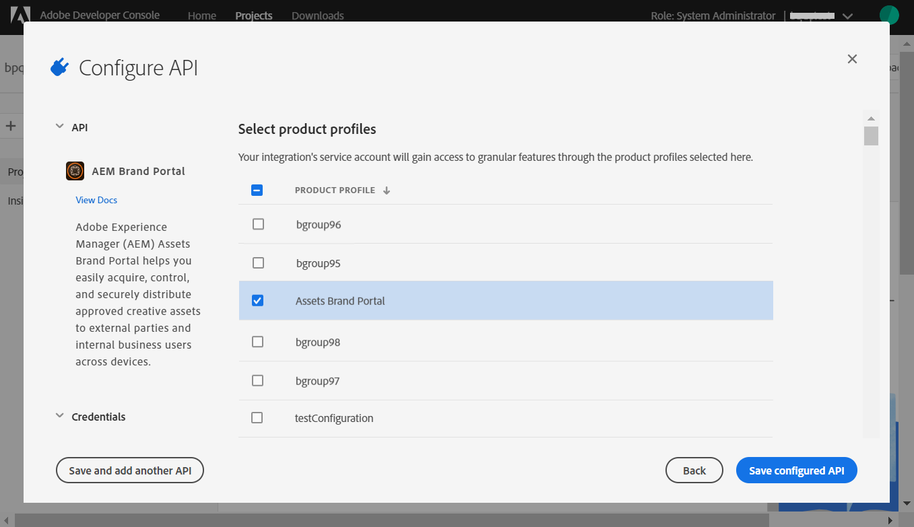

# Configure o AEM Assets como [!DNL Cloud Service] com o Brand Portal {#configure-aem-assets-with-brand-portal}

A configuração do Portal de marcas dos ativos Adobe Experience Manager permite que você publique ativos de marca aprovados dos ativos Adobe Experience Manager como uma instância [!DNL Cloud Service] no Portal de marcas e os distribua aos usuários do Portal de marcas.

**Fluxo de trabalho de configuração**

A AEM Assets como [!DNL Cloud Service] é configurada com o Brand Portal via Adobe Developer Console, que obtém um token de conta Adobe Identity Management Services (IMS) para autorização do locatário do Brand Portal. Requer configurações tanto no AEM Assets quanto no Adobe Developer Console.

1. No AEM Assets, crie uma conta IMS e gere uma chave pública (certificado).
1. No Console do desenvolvedor do Adobe, crie um projeto para seu locatário do Brand Portal (organização).
1. No projeto, configure uma API usando a chave pública para criar uma conexão de conta de serviço.
1. Obtenha as credenciais da conta de serviço e as informações de carga do JSON Web Token (JWT).
1. No AEM Assets, configure a conta IMS usando as credenciais da conta de serviço e a carga JWT.
1. No AEM Assets, configure o serviço em nuvem do Brand Portal usando a conta IMS e o terminal do Brand Portal (URL da organização).
1. Teste sua configuração publicando um ativo do AEM Assets para o Brand Portal.

>[!NOTE]
>
>Uma instância do AEM Assets como [!DNL Cloud Service] só deve ser configurada com um locatário do Brand Portal.

## Pré-requisitos {#prerequisites}

Você precisa do seguinte para configurar o AEM Assets com o Brand Portal:

* Um AEM Assets ativo e em execução como uma instância [!DNL Cloud Service]
* Um URL de locatário do Brand Portal
* Um usuário com privilégios de administrador do sistema na organização IMS do locatário do Brand Portal

## Criar configuração {#create-new-configuration}

Execute as seguintes etapas na sequência especificada para configurar o AEM Assets com o Brand Portal.

1. [Obter certificado público](#public-certificate)
1. [Criar conexão de conta de serviço (JWT)](#createnewintegration)
1. [Configurar conta IMS](#create-ims-account-configuration)
1. [Configurar o serviço em nuvem](#configure-the-cloud-service)
1. [Testar configuração](#test-configuration)

### Criar configuração IMS {#create-ims-configuration}

A configuração do IMS autentica seu AEM Assets como uma instância [!DNL Cloud Service] com o locatário do Brand Portal.

A configuração IMS inclui duas etapas:

* [Obter certificado público](#public-certificate)
* [Configurar conta IMS](#create-ims-account-configuration)

### Obter certificado público {#public-certificate}

A chave pública (certificado) autentica seu perfil no Adobe Developer Console.

1. Faça logon no AEM Assets.
1. No painel **Ferramentas**, navegue até **[!UICONTROL Segurança]** > **[!UICONTROL Configurações IMS de Adobe]**.
1. Na página Configurações de Adobe IMS, clique em **[!UICONTROL Criar]**. Ele redirecionará para a página **[!UICONTROL Configuração técnica de conta do Adobe IMS]**. Por padrão, a guia **Certificado** é aberta.
1. Selecione **[!UICONTROL Portal de marca de Adobe]** na lista suspensa **[!UICONTROL Solução de nuvem]**.
1. Marque a caixa de seleção **[!UICONTROL Criar novo certificado]** e especifique um **alias** para a chave pública. O alias serve como nome da chave pública.
1. Clique em **[!UICONTROL Criar certificado]**. Em seguida, clique em **[!UICONTROL OK]** para gerar a chave pública.

   

1. Clique no ícone **[!UICONTROL Baixar chave pública]** e salve o arquivo de chave pública (.crt) em seu computador.

   A chave pública será usada posteriormente para configurar a API para o locatário do Brand Portal e gerar credenciais de conta de serviço no Console do desenvolvedor do Adobe.

   

1. Clique em **[!UICONTROL Avançar]**.

   Na guia **Account**, é criada a conta Adobe IMS que exige as credenciais da conta de serviço geradas no Console do Desenvolvedor do Adobe. Mantenha esta página aberta por enquanto.

   Abra uma nova guia e [crie uma conexão de conta de serviço (JWT) no Console do desenvolvedor do Adobe](#createnewintegration) para obter as credenciais e a carga JWT para configurar a conta IMS.

### Criar conexão de conta de serviço (JWT) {#createnewintegration}

No Console do desenvolvedor do Adobe, os projetos e as APIs são configurados no nível locatário (organização) do Brand Portal. Configurar uma API cria uma conexão de conta de serviço (JWT). Há dois métodos para configurar a API, gerando um par de chaves (chaves privadas e públicas) ou carregando uma chave pública. Para configurar o AEM Assets com o Brand Portal, você deve gerar uma chave pública (certificado) no AEM Assets e criar credenciais no Adobe Developer Console fazendo upload da chave pública. Essas credenciais são necessárias para configurar a conta IMS no AEM Assets. Depois que a conta IMS for configurada, você poderá configurar o serviço em nuvem do Brand Portal no AEM Assets.

Execute as seguintes etapas para gerar as credenciais da conta de serviço e a carga JWT:

1. Faça logon no Adobe Developer Console com privilégios de administrador do sistema na organização IMS (locatário do Brand Portal). O URL padrão é [https://www.adobe.com/go/devs_console_ui](https://www.adobe.com/go/devs_console_ui).

   >[!NOTE]
   >
   >Verifique se você selecionou a organização IMS correta (locatário do Brand Portal) na lista suspensa (organização) localizada no canto superior direito.

1. Clique em **[!UICONTROL Criar novo projeto]**. Um projeto em branco com um nome gerado pelo sistema é criado para sua organização.

   Clique em **[!UICONTROL Editar projeto]** para atualizar o **[!UICONTROL Título do projeto]** e **[!UICONTROL Descrição]** e clique em **[!UICONTROL Guardar]**.

1. Na guia **[!UICONTROL Visão geral do projeto]**, clique em **[!UICONTROL Adicionar API]**.

1. Na **[!UICONTROL janela Adicionar uma API]**, selecione **[!UICONTROL AEM Brand Portal]** e clique em **[!UICONTROL Próximo]**.

   Verifique se você tem acesso ao serviço Portal de marcas AEM.

1. Na janela **[!UICONTROL Configurar API]**, clique em **[!UICONTROL Carregar sua chave pública]**. Em seguida, clique em **[!UICONTROL Selecione um Arquivo]** e carregue a chave pública (arquivo .crt) que você baixou na seção [obter certificado público](#public-certificate).

   Clique em **[!UICONTROL Avançar]**.

   

1. Verifique a chave pública e clique em **[!UICONTROL Next]**.

1. Selecione **[!UICONTROL Assets Brand Portal]** como o perfil de produto padrão e clique em **[!UICONTROL Salvar API configurada]**.

   <!-- 
   In Brand Portal, a default profile is created for each organization. The Product Profiles are created in admin console for assigning users to groups (based on the roles and permissions). For configuration with Brand Portal, the OAuth token is created at organization level. Therefore, you must configure the default Product Profile for your organization. 
   -->

   

1. Depois que a API for configurada, você será redirecionado para a página de visão geral da API. Na navegação à esquerda em **[!UICONTROL Credenciais]**, clique na opção **[!UICONTROL Conta de Serviço (JWT)]**.

   >[!NOTE]
   >
   >Você pode visualização as credenciais e executar ações como gerar tokens JWT, copiar detalhes das credenciais, recuperar o segredo do cliente e assim por diante.

1. Na guia **[!UICONTROL Credenciais do cliente]**, copie a **[!UICONTROL ID do cliente]**.

   Clique em **[!UICONTROL Recuperar segredo do cliente]** e copie o **[!UICONTROL segredo do cliente]**.

   

1. Navegue até a guia **[!UICONTROL Gerar JWT]** e copie as informações **[!UICONTROL JWT Payload]**.

Agora você pode usar a ID do cliente (chave da API), o segredo do cliente e a carga JWT para [configurar a conta IMS](#create-ims-account-configuration) no AEM Assets.

<!--
1. Click **[!UICONTROL Create Integration]**.

1. Select **[!UICONTROL Access an API]**, and click **[!UICONTROL Continue]**.

   

1. Create a new integration page opens. 
   
   Select your organization from the drop-down list.

   In **[!UICONTROL Experience Cloud]**, Select **[!UICONTROL AEM Brand Portal]** and click **[!UICONTROL Continue]**. 

   If the Brand Portal option is disabled for you, ensure that you have selected correct organization from the drop-down box above the **[!UICONTROL Adobe Services]** option. If you do not know your organization, contact your administrator.

   

1. Specify a name and description for the integration. Click **[!UICONTROL Select a File from your computer]** and upload the `AEM-Adobe-IMS.crt` file downloaded in the [obtain public certificates](#public-certificate) section.

1. Select the profile of your organization. 

   Or, select the default profile **[!UICONTROL Assets Brand Portal]** and click **[!UICONTROL Create Integration]**. The integration is created.

1. Click **[!UICONTROL Continue to integration details]** to view the integration information. 

   Copy the **[!UICONTROL API Key]** 
   
   Click **[!UICONTROL Retrieve Client Secret]** and copy the Client Secret key.

   

1. Navigate to **[!UICONTROL JWT]** tab, and copy the **[!UICONTROL JWT payload]**.

   The API Key, Client Secret key, and JWT payload information will be used to create IMS account configuration.

-->

### Configurar conta IMS {#create-ims-account-configuration}

Verifique se você executou as seguintes etapas:

* [Obter certificado público](#public-certificate)
* [Criar conexão de conta de serviço (JWT)](#createnewintegration)

Execute as seguintes etapas para configurar a conta IMS.

1. Abra a Configuração IMS e navegue até a guia **[!UICONTROL Account]**. Você manteve a página aberta enquanto [obtinha o certificado público](#public-certificate).

1. Especifique um **[!UICONTROL Título]** para a conta IMS.

   No campo **[!UICONTROL Servidor de Autorização]**, especifique o URL: [https://ims-na1.adobelogin.com/](https://ims-na1.adobelogin.com/)

   Especifique a ID do cliente no campo **[!UICONTROL chave da API]**, **[!UICONTROL Segredo do cliente]** e **[!UICONTROL Carga]** (Carga JWT) que copiou enquanto [cria a ligação de conta de serviço (JWT)](#createnewintegration).

   Clique em **[!UICONTROL Criar]**.

   A conta IMS está configurada.

   

1. Selecione a configuração da conta IMS e clique em **[!UICONTROL Verificar integridade]**.

   Clique em **[!UICONTROL Verificar]** na caixa de diálogo. Na configuração bem-sucedida, uma mensagem é exibida informando que o *Token foi recuperado com êxito*.

   

>[!CAUTION]
>
>Você deve ter apenas uma configuração IMS.
>
>A configuração IMS deve ser aprovada na verificação de integridade. Se a configuração não for aprovada na verificação de integridade, ela será inválida. Você deve excluí-la e criar uma configuração nova e válida.

### Configurar o serviço em nuvem {#configure-the-cloud-service}

Execute as seguintes etapas para configurar o serviço em nuvem do Brand Portal:

1. Faça logon no AEM Assets.

1. No painel **Ferramentas**, navegue até **[!UICONTROL Cloud Services]** > **[!UICONTROL AEM Portal de marcas]**.

1. Na página Configurações do Brand Portal, clique em **[!UICONTROL Criar]**.

1. Especifique um **[!UICONTROL Título]** para a configuração.

   Selecione a configuração IMS que você criou ao [configurar a conta IMS](#create-ims-account-configuration).

   No campo **[!UICONTROL URL do serviço]**, especifique o URL do locatário (organização) do Brand Portal.

   

1. Clique em **[!UICONTROL Salvar e fechar]**. A configuração da nuvem é criada.

   Seu AEM Assets como uma instância [!DNL Cloud Service] agora está configurado com o locatário do Brand Portal.

### Testar configuração{#test-configuration}

Execute as seguintes etapas para validar a configuração:

1. Faça logon no AEM Assets.

1. No painel **Ferramentas**, navegue até **[!UICONTROL Implantação]** > **[!UICONTROL Distribuição]**.

   

   Um agente de distribuição do Brand Portal (**[!UICONTROL bpdistributionagent0]**) é criado em **[!UICONTROL Publicar no Brand Portal]**.

   

1. Clique em **[!UICONTROL Publicar no Brand Portal]** para abrir o agente de distribuição.

   Você pode ver as filas de distribuição na guia **[!UICONTROL Status]**.

   Um agente de distribuição contém duas filas:
   * **fila de processamento**: para distribuição de ativos no Brand Portal.

   * **fila de erros**: para os ativos em que a distribuição falhou.
   >[!NOTE]
   >
   >É recomendável analisar as falhas e limpar a **fila de erros** periodicamente.

   

1. Para verificar a conexão entre a AEM Assets como um [!DNL Cloud Service] e o Brand Portal, clique no ícone **[!UICONTROL Testar conexão]**.

   

   Aparece uma mensagem informando que o pacote de teste *foi entregue com êxito*.

   >[!NOTE]
   >
   >Evite desativar o agente de distribuição, pois isso pode causar falha na distribuição dos ativos (em execução na fila).

Agora você pode:

* [Publicar ativos do AEM Assets no Brand Portal](publish-to-brand-portal.md)
* [Publicar pastas do AEM Assets no Brand Portal](publish-to-brand-portal.md#publish-folders-to-brand-portal)
* [Publicar coleções do AEM Assets no Brand Portal](publish-to-brand-portal.md#publish-collections-to-brand-portal)
* [Publicar predefinições, esquemas e aspectos no Brand Portal](https://docs.adobe.com/content/help/br/experience-manager-brand-portal/using/publish/publish-schema-search-facets-presets.html)
* [Publicar marcações no Brand Portal](https://docs.adobe.com/content/help/br/experience-manager-brand-portal/using/publish/brand-portal-publish-tags.html)

Consulte [Documentação do Brand Portal](https://docs.adobe.com/content/help/br/experience-manager-brand-portal/using/home.html) para obter mais informações.

## Registros de distribuição {#distribution-logs}

Você pode monitorar os logs do agente de distribuição para o fluxo de trabalho de publicação de ativos.

Por exemplo, publicamos um ativo do AEM Assets para o Brand Portal para validar a configuração.

1. Siga as etapas (de 1 a 4) conforme mostrado na seção [Testar configuração](#test-configuration) e navegue até a página do agente de distribuição.
1. Clique em **[!UICONTROL Logs]** para visualização nos registros de processamento e erro.

   

O agente de distribuição gerou os seguintes registros:

* INFORMAÇÕES: Este é um log gerado pelo sistema que aciona uma configuração bem-sucedida do agente de distribuição.
* DSTRQ1 (Solicitação 1): acionado na conexão de teste.

Ao publicar o ativo, os seguintes registros de solicitação e resposta são gerados:

**Solicitação do agente de distribuição**:

* DSTRQ2 (Solicitação 2): a solicitação de publicação de ativo é acionada.
* DSTRQ3 (Solicitação 3): O sistema aciona outra solicitação para publicar a pasta AEM Assets (na qual o ativo existe) e replicar a pasta no Brand Portal.

**Resposta do agente de distribuição**:

* queue-bpdistributionagent0 (DSTRQ2): o ativo é publicado no Brand Portal.
* queue-bpdistributionagent0 (DSTRQ3): O sistema replica a pasta AEM Assets (que contém o ativo) no Brand Portal.

No exemplo acima, uma solicitação e uma resposta adicionais são acionadas. O sistema não pôde localizar a pasta pai (Adicionar caminho) no Brand Portal porque o ativo foi publicado pela primeira vez, portanto, ele disparou uma solicitação adicional para criar uma pasta pai com o mesmo nome no Brand Portal onde o ativo é publicado.

>[!NOTE]
>
>Solicitação adicional é gerada caso a pasta pai não exista no Brand Portal ou tenha sido modificada no AEM Assets.

<!--

## Additional information {#additional-information}

Go to `/system/console/slingmetrics` for statistics related to the distributed content:

1. **Counter metrics**
   * sling: `mac_sync_request_failure`
   * sling: `mac_sync_request_received`
   * sling: `mac_sync_request_success`

1. **Time metrics**
   * sling: `mac_sync_distribution_duration`
   * sling: `mac_sync_enqueue_package_duration`
   * sling: `mac_sync_setup_request_duration`

-->

<!--
   Comment Type: draft

   <li> </li>
   -->

<!--
   Comment Type: draft

   <li>Step text</li>
-->
