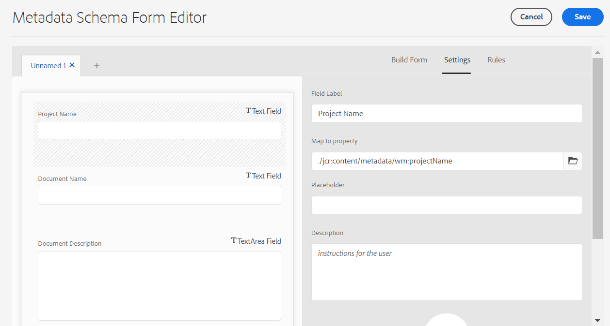

# Configurar o mapeamento de metadados de ativos entre o Adobe Workfront e o Experience Manager Assets {#asset-metadata-mapping-workfront-aem-assets}

Você pode mapear os campos de metadados de ativos entre os aplicativos as a Cloud Service Adobe Workfront e Experience Manager. Como resultado do mapeamento de campos de metadados, ao enviar um ativo do Workfront para o Experience Manager Assets, você pode visualizar os metadados do ativo mapeados no Experience Manager Assets.

Por exemplo, se você precisar manter os campos de metadados de uma imagem, como nome, descrição e o projeto ao qual ela pertence no Workfront, ao enviar a imagem para o Experience Manager Assets, configure e mapeie esses campos para as propriedades do Experience Manager Assets.

**Caso de uso**

Uma imagem `add-users-workfront.png` existe no `Metadata Syncs` projeto no aplicativo Adobe Workfront. É necessário enviar essa imagem para o Experience Manager Assets as a Cloud Service com os seguintes metadados:

* Nome do projeto

* Nome do documento

* Descrição do documento

## Pré-requisitos {#prerequisites}

* Um acesso de administrador a aplicativos as a Cloud Service do Workfront e Experience Manager Assets.

* Uma integração entre [Aplicativos as a Cloud Service do Workfront e Experience Manager Assets](https://one.workfront.com/s/document-item?bundleId=the-new-workfront-experience&amp;topicId=Content%2FDocuments%2FAdobe_Workfront_for_Experience_Manager_Assets_Essentials%2Fsetup-asset-essentials.htm&amp;_LANG=enus).

## Configurar o mapeamento de metadados no Workfront {#set-up-metadata-mapping}

Para definir o mapeamento de metadados para os campos Nome do projeto, Nome do documento e Descrição do documento no Workfront:

1. Clique no ícone Menu principal  disponível no canto superior direito do aplicativo do Adobe Workfront e, em seguida, clique em **[!UICONTROL Configuração]**.

1. Selecionar **[!UICONTROL Documentos]** no painel esquerdo, selecione **[!UICONTROL Experience Manager Assets]**.

1. Selecione a integração do Experience Manager Assets e clique em **[!UICONTROL Editar]**.

1. Clique em **[!UICONTROL Metadados]**. No **[!UICONTROL Assets]** , mapeie o [!UICONTROL Projeto] > [!UICONTROL Nome] Campo do Workfront para o `wm:projectName` Campo do Experience Manager Assets. Se você não encontrar a correspondência exata, o Adobe recomenda que você procure a melhor correspondência para mapear o campo do Workfront e do Experience Manager Assets. Você pode evitar o mapeamento de campos de diferentes tipos de dados. Por exemplo, mapear um campo de data do Workfront para um campo de descrição do Assets.
1. Mapeie o [!UICONTROL Documento] > [!UICONTROL Nome] Campo do Workfront para o `wm:documentName` Campo do Experience Manager Assets.

   

1. Mapeie o [!UICONTROL Documento] > [!UICONTROL Descrição] Campo do Workfront para o `dc:description` Campo do Experience Manager Assets.

   >[!VIDEO](https://video.tv.adobe.com/v/344255)

## Enviar a imagem do Workfront para o Experience Manager Assets {#send-image-workfront-assets}

Para enviar a imagem do Workfront para o Experience Manager Assets:

1. Clique no ícone Menu principal  disponível no canto superior direito do aplicativo do Adobe Workfront e, em seguida, clique em **[!UICONTROL Projetos]**.

1. Clique em **[!UICONTROL Novo projeto]** para criar um projeto.

1. Clique em **[!UICONTROL Documentos]** opção disponível no painel esquerdo, arraste e selecione a imagem que precisa enviar para o Experience Manager Assets.

1. Clique em **[!UICONTROL Enviar para]** e escolha o nome da integração do Experience Manager Assets Essentials.

   

1. Escolha a pasta de destino para o ativo e clique em **[!UICONTROL Selecionar pasta]**.

1. Clique em **[!UICONTROL Salvar]**.

## Configurar o mapeamento de metadados de ativos no Experience Manager as a Cloud Service {#metadata-mapping-aem}

Depois [configuração do mapeamento de metadados de ativos no Adobe Workfront](#set-up-metadata-mapping), você deve usar o mesmo mapeamento no aplicativo Experience Manager Assets as a Cloud Service para exibir os resultados de metadados apropriados para a imagem.

O mapeamento de metadados é executado usando Esquemas de metadados no Experience Manager Assets. Você pode editar um formulário de esquema de metadados recém-adicionado ou existente. O formulário de esquema de metadados inclui guias e itens de formulário em guias. Você pode mapear/configurar esses itens de formulário para um campo em um nó de metadados no repositório CRX. Você pode adicionar guias ou itens de formulário ao formulário de esquema de metadados. Para obter mais informações, consulte [Esquemas de metadados](metadata-schemas.md).

Para configurar o mapeamento de metadados usando um novo formulário de metadados no Experience Manager Assets as a Cloud Service:

1. Navegue até **[!UICONTROL Ferramentas]** > **[!UICONTROL Assets]** > **[!UICONTROL Esquemas de metadados]**.

1. Clique em **[!UICONTROL Criar]** na barra de ferramentas. Na caixa de diálogo, forneça o título do formulário do esquema e clique em **[!UICONTROL Criar]** para concluir o processo de criação do formulário.

1. Selecione o formulário de esquema e clique em **[!UICONTROL Editar]**.

1. (Opcional) No Editor de formulário de esquema de metadados, clique em `+` para criar uma guia para os campos do Workfront.

1. Clique em **[!UICONTROL Formulário de criação]** e arraste a **[!UICONTROL Texto em linha única]** componente ao formulário. Clique no componente no formulário. No **[!UICONTROL Formulário de criação]** guia:

   1. Especificar `Project Name` no **[!UICONTROL Rótulo do campo]** campo.

   1. Especificar `./jcr:content/metadata/wm:projectName` no **[!UICONTROL Mapear para a propriedade]** campo. Como diretriz, use o seguinte modelo para definir os mapeamentos de campo no Experience Manager Assets:
      `./jcr:content/metadata/<mapping defined for the field in workfront>`.

      Ao configurar mapeamentos no Workfront, você mapeou `wm:projectName` Campo do Experience Manager Assets para Projeto > Nome Campo do Workfront.

      `wm` refere-se ao nome do namespace e `projectName` refere-se ao título da propriedade. Use o `namespace:propertyTitle` formato para definir mapeamentos de campos de metadados.

      

1. Clique em **[!UICONTROL Formulário de criação]** e arraste a **[!UICONTROL Texto em linha única]** componente ao formulário. Clique no componente no formulário. No **[!UICONTROL Formulário de criação]** guia:

   1. Especificar `Document Name` no **[!UICONTROL Rótulo do campo]** campo.

   1. Especificar `./jcr:content/metadata/wm:documentName` no **[!UICONTROL Mapear para a propriedade]** campo.
Ao configurar mapeamentos no Workfront, você mapeou `wm:documentName` campo Experience Manager Assets para documento > campo Nome Workfront.

1. Clique em **[!UICONTROL Formulário de criação]** e arraste a **[!UICONTROL Texto multilinha]** componente ao formulário. Clique no componente no formulário. No **[!UICONTROL Formulário de criação]** guia:

   1. Especificar `Document Description` no **[!UICONTROL Rótulo do campo]** campo.

   1. Especificar `./jcr:content/metadata/dc:description` no **[!UICONTROL Mapear para a propriedade]** campo.
Ao configurar mapeamentos no Workfront, você mapeou `dc:description` Campo Experience Manager Assets para Documento > Descrição Campo Workfront.

1. Clique em **[!UICONTROL Salvar]** para salvar as alterações.

   >[!VIDEO](https://video.tv.adobe.com/v/344314)

## Aplicar configurações de metadados à pasta de imagens {#apply-metadata-settings-image-folder}

Após definir as configurações de metadados no aplicativo Experience Manager as a Cloud Service, aplique essas configurações ao [pasta que contém a imagem enviada do aplicativo Workfront](#send-image-workfront-assets).

Para aplicar configurações de metadados à pasta de imagens:

1. Navegue até **[!UICONTROL Ferramentas]** > **[!UICONTROL Assets]** > **[!UICONTROL Esquemas de metadados]**.

1. Selecione o esquema de metadados na lista disponível e clique em **[!UICONTROL Aplicar a pastas]**.

1. Selecione a pasta de destino para a qual [a imagem é enviada do aplicativo Adobe Workfront](#send-image-workfront-assets) e clique em **[!UICONTROL Aplicar]**.

Você pode navegar até a imagem no Experience Manager Assets e visualizar os metadados associados à imagem. Selecione a imagem e clique em **[!UICONTROL Propriedades]** para exibir os metadados da imagem.

**Consulte também**

* [Traduzir ativos](translate-assets.md)
* [API HTTP de ativos](mac-api-assets.md)
* [Formatos de arquivo compatíveis com os ativos](file-format-support.md)
* [Pesquisar ativos](search-assets.md)
* [Ativos conectados](use-assets-across-connected-assets-instances.md)
* [Relatórios de ativos](asset-reports.md)
* [Esquemas de metadados](metadata-schemas.md)
* [Baixar ativos](download-assets-from-aem.md)
* [Gerenciar metadados](manage-metadata.md)
* [Pesquisar aspectos](search-facets.md)
* [Gerenciar coleções](manage-collections.md)
* [Importação de metadados em massa](metadata-import-export.md)
* [Publicar ativos no AEM e no Dynamic Media](/help/assets/publish-assets-to-aem-and-dm.md)
