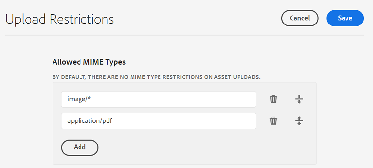

# Configurar restrições de upload de ativos {#configure-asset-upload-restrictions}

Você pode configurar o Adobe Experience Manager Assets para restringir os tipos de ativos que os usuários podem carregar com base no tipo MIME.

>[!IMPORTANT]
>
>Por padrão, o Experience Manager Assets permite que os usuários façam upload de ativos de todos os tipos MIME. No entanto, você pode definir as configurações para impedir que os usuários façam upload de arquivos apenas de tipos MIME específicos.

## Pré-requisitos {#prerequisites-asset-upload-restrictions}

É necessário ter privilégios de administrador para configurar restrições de upload de ativos.

## Aplicar restrições a uploads de ativos {#apply-restrictions-asset-uploadsssssss}

Para configurar o [!DNL Experience Manager] para impedir que usuários carreguem arquivos de tipos MIME específicos:

1. Navegue até **[!UICONTROL Ferramentas > Assets > Configurações do Assets]**.

1. Clique em **[!UICONTROL Restrições de Carregamento]**.

1. Clique em **[!UICONTROL Adicionar]** para definir os tipos MIME permitidos.

1. Especifique o tipo MIME na caixa de texto. Você pode clicar em **[!UICONTROL Adicionar]** novamente para especificar mais tipos MIME permitidos. Você também pode clicar no  para excluir qualquer tipo MIME da lista.

1. Clique em **[!UICONTROL Salvar]**.

**Exemplo 1: permitir o carregamento de todas as imagens e arquivos PDF para o Experience Manager Assets**

Para permitir o upload de imagens em todos os formatos e arquivos PDF para o Experience Manager Assets, faça as seguintes configurações:

`image/*` como tipo MIME permite o carregamento de imagens em todos os formatos. `application/pdf` como tipo MIME permite o carregamento de arquivos PDF para o Experience Manager Assets.

Se você tentar fazer upload de um arquivo que não está incluído na lista de tipos MIME permitidos, o Experience Manager Assets exibirá a seguinte mensagem de erro:

`Screen Recording 2022-08-31 at 3.36.09 PM.mov` refere-se a um nome de arquivo que não está incluído nos tipos MIME permitidos.

**Exemplo 2: Permitir carregamento de formatos de imagem específicos para o Experience Manager Assets**

Para adicionar formatos de imagem específicos aos tipos MIME permitidos e restringir o upload de todos os outros formatos de ativo, faça as seguintes configurações:

Com base nas configurações representadas na imagem, você pode fazer upload de imagens nos formatos .JPG, .PNG e .GIF no Experience Manager Assets.

**Consulte também**

* [Traduzir ativos](translate-assets.md)
* [API HTTP de ativos](mac-api-assets.md)
* [Formatos de arquivo compatíveis com os ativos](file-format-support.md)
* [Pesquisar ativos](search-assets.md)
* [Ativos conectados](use-assets-across-connected-assets-instances.md)
* [Relatórios de ativos](asset-reports.md)
* [Esquemas de metadados](metadata-schemas.md)
* [Baixar ativos](download-assets-from-aem.md)
* [Gerenciar metadados](manage-metadata.md)
* [Pesquisar aspectos](search-facets.md)
* [Gerenciar coleções](manage-collections.md)
* [Importação de metadados em massa](metadata-import-export.md)
* [Publicar o Assets no AEM e no Dynamic Media](/help/assets/publish-assets-to-aem-and-dm.md)
