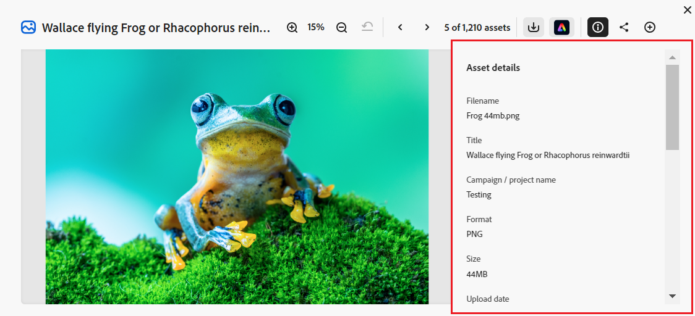

# Configurar a interface do usuário do Content Hub {#configure-content-hub-user-interface}

<!--  -->

O Experience Manager Assets permite que os administradores configurem as opções disponíveis na interface do usuário do Content Hub. Com base nas opções de configuração selecionadas pelos administradores, os usuários do Content Hub podem exibir campos no Content Hub. As opções de configuração incluem:

* Filtros disponíveis para usuários ao pesquisar ativos.

* Detalhes ou propriedades de ativos disponíveis para cada ativo.

* Campos de metadados disponíveis para usuários ao adicionar ativos ao Content Hub.

* Campos de metadados de ativos disponíveis para pesquisa no Content Hub.

* Conteúdo de marca que você precisa exibir para sua organização.

* Quaisquer links personalizados que você precise incluir no Content Hub, além de ativos, coleções e insights.

## Pré-requisitos {#prerequisites-configuration-ui}

[Os administradores do Content Hub](/help/assets/deploy-content-hub.md#step-3-onboard-content-hub-administrator) podem definir as opções de configuração para outros usuários em sua organização.

## Acessar opções de configuração no Content Hub {#access-configuration-options-content-hub}

Para acessar as opções de configuração no Content Hub:

1. Clique no ícone do usuário no painel direito.

1. Na seção **[!UICONTROL Configurações do Produto]**, selecione **[!UICONTROL Configurações]**.

   

## Gerenciar opções de configuração no Content Hub {#manage-configuration-options}

Gerencie as seguintes opções de configuração para seus usuários:

* [Importar](#configure-import-options-content-hub)

* [Filtros](#configure-filters-content-hub)

* [Detalhes do ativo](#configure-asset-details-content-hub)

* [Pesquisar](#configure-metadata-search-content-hub)

* [Identidade visual](#configure-branding-content-hub)

* [Links personalizados](#configure-custom-links-content-hub)

### Importar {#configure-import-options-content-hub}

Você pode configurar os campos de metadados exibidos para os usuários ao fazer upload ou importar ativos para o portal do Content Hub, como Nome da campanha, Palavras-chave, Canais, Período, Região etc. Para desabilitá-la, siga estas etapas:

1. Na interface de usuário [Configurações](#access-configuration-options-content-hub), clique em **[!UICONTROL Importar]**.

1. Clique em **[!UICONTROL Adicionar metadados]**.

1. Especifique um rótulo para a propriedade, mapeie-o para uma propriedade usando o campo **[!UICONTROL Metadados]** e selecione o tipo de entrada para os novos metadados do ativo.

1. Clique no botão **[!UICONTROL Campo obrigatório]** para tornar o novo campo de metadados obrigatório para especificação para usuários ao carregar novos ativos.

1. Clique em **[!UICONTROL Confirmar]**. Os novos metadados são exibidos na lista das propriedades de ativos existentes.

1. Clique em **[!UICONTROL Salvar]** para aplicar as alterações.

Da mesma forma, você pode clicar no , disponível ao lado de cada propriedade disponível, para editar os rótulos, tornar esses campos obrigatórios ou não obrigatórios para os usuários ao carregar ativos usando a opção **[!UICONTROL Campo obrigatório]** ou clicar no ícone Excluir para excluir qualquer propriedade de metadados.

Clique na opção **[!UICONTROL Aprovação automática]** se precisar que todos os ativos adicionados ao repositório do Experience Manager Assets sejam aprovados automaticamente para que estejam disponíveis no Content Hub imediatamente. Os autores ou administradores do DAM precisam aprovar manualmente os ativos para disponibilizá-los no Content Hub. Por padrão, o botão está definido como Desligado.

Clique em **[!UICONTROL Salvar]** depois de fazer todas as modificações para aplicar as alterações.

Metadados ativados na interface do usuário de configuração são exibidos na página de upload de ativos:

### Filtros {#configure-filters-content-hub}

O Content Hub permite que os administradores configurem filtros que são exibidos ao pesquisar ativos. Execute as seguintes etapas para adicionar um novo filtro:

1. Na interface de usuário [Configurações](#access-configuration-options-content-hub), clique em **[!UICONTROL Filtros]**.

1. Clique em **[!UICONTROL Adicionar filtros]**.

1. Especifique um rótulo para o filtro, mapeie-o para uma propriedade usando o campo **[!UICONTROL Metadados]** e selecione o tipo de entrada para o novo filtro.
1. Clique em **[!UICONTROL Confirmar]**. O novo filtro é exibido na lista dos filtros existentes.

1. Clique em **[!UICONTROL Salvar]** para aplicar as alterações para que o novo filtro seja exibido na página Pesquisar ao filtrar ativos.

   >[!NOTE]
   >
   >O novo filtro é exibido na página Pesquisar somente se houver pelo menos um ativo no repositório que corresponda aos critérios do filtro.

Da mesma forma, você pode clicar no , disponível ao lado de cada filtro disponível, para editar os rótulos ou clicar no ícone excluir para excluir qualquer filtro existente. Clique em **[!UICONTROL Salvar]** depois de fazer todas as modificações para aplicar as alterações.

Os filtros ativados na Interface do Usuário de Configuração são exibidos na página Pesquisar:

### Detalhes do ativo {#configure-asset-details-content-hub}

Você também pode configurar as propriedades de ativos exibidas para cada ativo, como nome do arquivo, título, formato, tamanho e assim por diante. Para desabilitá-la, siga estas etapas:

1. Na interface do usuário [Configurações](#access-configuration-options-content-hub), clique em **[!UICONTROL Detalhes do ativo]**.

1. Clique em **[!UICONTROL Adicionar metadados]**.

1. Especifique um rótulo para a propriedade, mapeie-o para uma propriedade usando o campo **[!UICONTROL Metadados]** e selecione o tipo de entrada para os novos metadados do ativo.
1. Clique em **[!UICONTROL Confirmar]**. Os novos metadados são exibidos na lista das propriedades de ativos existentes.

1. Clique em **[!UICONTROL Salvar]** para aplicar as alterações para que a nova propriedade seja exibida na página de detalhes do ativo.

Da mesma forma, você pode clicar no , disponível ao lado de cada propriedade disponível, para editar os rótulos ou clicar no ícone excluir para excluir qualquer detalhe de ativo existente. Clique em **[!UICONTROL Salvar]** depois de fazer todas as modificações para aplicar as alterações.

As propriedades ativadas na Interface do Usuário da Configuração são exibidas na página Detalhes do ativo:

### Pesquisar {#configure-metadata-search-content-hub}

Os administradores podem definir os campos de metadados que são pesquisados quando um usuário especifica um critério de pesquisa no Content Hub. Execute as seguintes etapas:

1. Na interface de usuário [Configurações](#access-configuration-options-content-hub), clique em **[!UICONTROL Adicionar metadados]**.

1. Especifique o campo de metadados e clique em **[!UICONTROL Confirmar]**.

1. Clique em **[!UICONTROL Salvar]** para aplicar as alterações para que a nova propriedade de metadados seja exibida na lista de campos de metadados.

Da mesma forma, você pode clicar no , disponível ao lado de cada propriedade de metadados disponível, para editar a propriedade ou clicar no ícone excluir para excluir qualquer propriedade existente. Clique em **[!UICONTROL Salvar]** depois de fazer todas as modificações para aplicar as alterações.

### Identidade visual {#configure-branding-content-hub}

Os administradores também podem personalizar o título e o texto do corpo no banner do portal do Content Hub, de acordo com seus requisitos de marca. Para desabilitá-la, siga estas etapas:

1. Na interface de usuário [Configurações](#access-configuration-options-content-hub), clique em **[!UICONTROL Identidade Visual]**.

1. Especifique o texto no **[!UICONTROL Texto do título no banner]** e **[!UICONTROL Texto do corpo nos campos do banner]**.

1. Clique em **[!UICONTROL Salvar]** para aplicar as alterações.

As atualizações de marca ativadas na interface do usuário de configuração são exibidas no banner do portal do Content Hub:

### Links personalizados {#configure-custom-links-content-hub}

Você também pode adicionar guias personalizadas além das guias padrão **[!UICONTROL Todas as Assets]**, **[!UICONTROL Coleções]** e **[!UICONTROL Insights]** no portal do Content Hub logo abaixo do banner. Para desabilitá-la, siga estas etapas:

1. Na interface de usuário [Configurações](#access-configuration-options-content-hub), clique em **[!UICONTROL Links Personalizados]**.

1. Clique em **[!UICONTROL Adicionar link]**.

1. Especifique o texto nos campos **[!UICONTROL Rótulo]** e **[!UICONTROL URL]**. O rótulo definido é exibido como uma guia e, quando você clica no rótulo, navega até a URL definida no campo **[!UICONTROL URL]**.

1. Clique em **[!UICONTROL Confirmar]**.

1. Clique em **[!UICONTROL Salvar]** para aplicar as alterações.

Da mesma forma, você pode clicar no , disponível ao lado de cada URL, para editar os links ou clicar no ícone excluir para excluir qualquer URL existente. Clique em **[!UICONTROL Salvar]** depois de fazer todas as modificações para aplicar as alterações.

O link personalizado é exibido como uma nova guia ao lado da guia Insights na página inicial do Content Hub.

