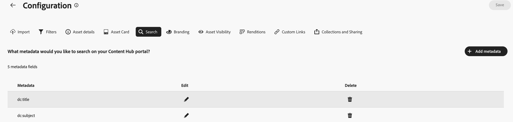
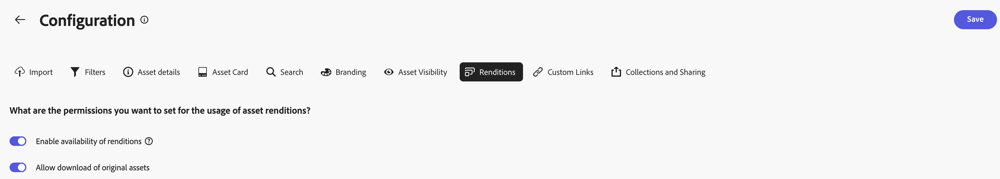
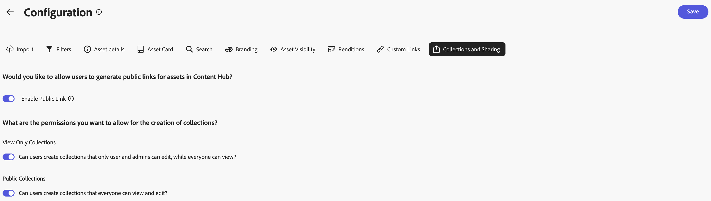

# Configurar a interface do usuário do Centro de conteúdo {#configure-content-hub-user-interface}

>[!CONTEXTUALHELP]
>id="configure_content_hub"
>title="Configurar a interface do usuário do Centro de conteúdo"
>abstract="O Experience Manager Assets permite que os administradores configurem as opções disponíveis na interface do usuário do Centro de conteúdo. Com base nas opções de configuração selecionadas pelos administradores, os usuários do Centro de conteúdo podem exibir campos no Centro de conteúdo. As opções de configuração incluem metadados ao importar ativos, filtros, propriedades de ativos, metadados ao pesquisar ativos, marcas personalizadas e links personalizados."
>additional-url="https://images-tv.adobe.com/mpcv3/4477/74a81d1c-0cfe-41f4-8a06-18ff70604e45_1732023385.854x480at800_h264.mp4" text="Assistir ao vídeo"

<!--  -->

O Experience Manager Assets permite que os administradores configurem as opções disponíveis na interface do usuário do Centro de conteúdo. Com base nas opções de configuração selecionadas pelos administradores, os usuários do Centro de conteúdo podem exibir campos no Centro de conteúdo. As opções de configuração incluem:

* Filtros disponíveis para usuários ao pesquisar ativos.

* Detalhes ou propriedades de ativos disponíveis para cada ativo.

* Campos de metadados disponíveis para usuários ao adicionar ativos ao Content Hub.

* Campos de metadados de ativos disponíveis para pesquisa no Content Hub.

* Conteúdo de marca que você precisa exibir para sua organização.

* Quaisquer links personalizados que você precise incluir no Content Hub, além de ativos, coleções e insights.

>[!VIDEO](https://video.tv.adobe.com/v/3472917/?learn=on&enablevpops){transcript=true}

## Pré-requisitos {#prerequisites-configuration-ui}

[Os administradores do Content Hub](/help/assets/deploy-content-hub.md#step-3-onboard-content-hub-administrator) podem definir as opções de configuração para outros usuários em sua organização.

## Acessar opções de configuração no Content Hub {#access-configuration-options-content-hub}

Para acessar as opções de configuração no Content Hub:

1. Clique no ícone do usuário no painel direito.

1. Na seção **[!UICONTROL Configurações do Produto]**, selecione **[!UICONTROL Configurações]**.

   

## Gerenciar opções de configuração no Content Hub {#manage-configuration-options}

Como administrador, gerencie as seguintes opções de configuração para seus usuários:

* [Importar](#configure-import-options-content-hub)

* [Filtros](#configure-filters-content-hub)

* [Detalhes do ativo](#configure-asset-details-content-hub)
* [Cartão de ativos](#asset-card)

* [Pesquisar](#configure-metadata-search-content-hub)

* [Identidade visual](#configure-branding-content-hub)

* [Ativos expirados](#expired-assets-content-hub)

* [Representações](#renditions-content-hub)

* [Links personalizados](#configure-custom-links-content-hub)

* [Coleções e compartilhamento](#configure-collections-content-hub)

<!--* [Enable public link sharing](#enable-public-link-sharing)-->

### Importar {#configure-import-options-content-hub}

Você pode configurar os campos de metadados exibidos para os usuários ao fazer upload ou importar ativos para o portal do Content Hub, como Nome da campanha, Palavras-chave, Canais, Período, Região etc. Para desabilitá-la, siga estas etapas:

1. Na interface de usuário [Configurações](#access-configuration-options-content-hub), clique em **[!UICONTROL Importar]**.

1. Clique em **[!UICONTROL Adicionar metadados]**.

1. Especifique um rótulo para a propriedade, mapeie-o para uma propriedade usando o campo **[!UICONTROL Metadados]** e selecione o tipo de entrada para os novos metadados do ativo.

1. Clique no botão **[!UICONTROL Campo obrigatório]** para tornar o novo campo de metadados obrigatório para especificação para usuários ao carregar novos ativos.

1. Clique em **[!UICONTROL Confirmar]**. Os novos metadados são exibidos na lista das propriedades de ativos existentes.

1. Clique em **[!UICONTROL Salvar]** para aplicar as alterações.

Da mesma forma, você pode clicar no  disponível ao lado de cada propriedade disponível, para editar os rótulos, tornar esses campos obrigatórios ou não obrigatórios para os usuários ao carregar ativos usando a opção **[!UICONTROL Campo obrigatório]** ou clicar no ícone Excluir para excluir qualquer propriedade de metadados.

Clique na opção **[!UICONTROL Aprovação automática]** se precisar que todos os ativos adicionados ao repositório do Experience Manager Assets sejam aprovados automaticamente para que estejam disponíveis no Content Hub imediatamente. Os autores ou administradores do DAM precisam aprovar manualmente os ativos para disponibilizá-los no Content Hub. Por padrão, o botão está definido como Desligado.

Clique em **[!UICONTROL Salvar]** depois de fazer todas as modificações para aplicar as alterações.

Metadados ativados na interface do usuário de configuração são exibidos na página de upload de ativos:

### Filtros {#configure-filters-content-hub}

O Content Hub permite que os administradores configurem filtros que são exibidos ao pesquisar ativos. Execute as seguintes etapas para adicionar um novo filtro:

1. Na interface de usuário [Configurações](#access-configuration-options-content-hub), clique em **[!UICONTROL Filtros]**.

1. Clique em **[!UICONTROL Adicionar filtros]**.

1. Especifique um rótulo para o filtro, mapeie-o para uma propriedade usando o campo **[!UICONTROL Metadados]** e selecione o tipo de entrada para o novo filtro.
1. Clique em **[!UICONTROL Confirmar]**. O novo filtro é exibido na lista dos filtros existentes.

1. Clique em **[!UICONTROL Salvar]** para aplicar as alterações para que o novo filtro seja exibido na página Pesquisar ao filtrar ativos.

   >[!NOTE]
   >
   >O novo filtro é exibido na página Pesquisar somente se houver pelo menos um ativo no repositório que corresponda aos critérios do filtro.

Da mesma forma, você pode clicar no , disponível ao lado de cada filtro disponível, para editar os rótulos ou clicar no ícone excluir para excluir qualquer filtro existente. Clique em **[!UICONTROL Salvar]** depois de fazer todas as modificações para aplicar as alterações.

Os filtros ativados na Interface do Usuário de Configuração são exibidos na página Pesquisar:

#### Pesquisar em massa {#bulk-search-configuration}

Para habilitar a pesquisa de vários ativos de uma só vez no [!DNL Content Hub], execute as etapas a seguir:

1. Na interface de usuário [Configurações](#access-configuration-options-content-hub), clique em **[!UICONTROL Filtros]**.

1. Clique no disponível ao lado de cada filtro disponível.

1. Habilitar alternância de **[!UICONTROL Pesquisa em Massa]**. Os delimitadores padrão `[ , | \t | \r\n | \r | \n ]` são exibidos automaticamente. Além disso, também é possível adicionar outros delimitadores. Para fazer isso, especifique delimitadores na caixa de entrada separados por um `pipe symbol (|)`.

   

1. Clique em **[!UICONTROL Confirmar]** para salvar as alterações. Veja [Pesquisa em Massa no Content Hub](search-assets-content-hub.md#bulk-search) em ação.

### Detalhes do ativo {#configure-asset-details-content-hub}

Você também pode configurar as propriedades de ativos exibidas para cada ativo, como nome do arquivo, título, formato, tamanho e assim por diante. Para desabilitá-la, siga estas etapas:

1. Na interface do usuário [Configurações](#access-configuration-options-content-hub), clique em **[!UICONTROL Detalhes do ativo]**.

1. Clique em **[!UICONTROL Adicionar metadados]**.

1. Especifique um rótulo para a propriedade, mapeie-o para uma propriedade usando o campo **[!UICONTROL Metadados]** e selecione o tipo de entrada para os novos metadados do ativo.
1. Clique em **[!UICONTROL Confirmar]**. Os novos metadados são exibidos na lista das propriedades de ativos existentes.

1. Clique em **[!UICONTROL Salvar]** para aplicar as alterações para que a nova propriedade seja exibida na página de detalhes do ativo.

Da mesma forma, você pode clicar no , disponível ao lado de cada propriedade disponível, para editar os rótulos ou clicar no ícone excluir para excluir qualquer detalhe de ativo existente. Clique em **[!UICONTROL Salvar]** depois de fazer todas as modificações para aplicar as alterações.

As propriedades ativadas na Interface do Usuário da Configuração são exibidas na página Detalhes do ativo:

### Cartão de ativos {#asset-card}

Você também pode configurar as propriedades dos metadados principais que precisam ser exibidos no **Cartão de ativos** até um máximo de 6 campos.

Execute as seguintes etapas para configurar as propriedades de metadados e exibi-las no **[!UICONTROL Cartão de ativos]**:

1. Na interface de usuário [Configurações](#access-configuration-options-content-hub), clique em **Cartão de ativos**.
2. Clique em **Adicionar metadados**. A caixa de diálogo **Adicionar metadados do cartão de ativos** é exibida.
3. Especifique o nome dos metadados no campo **Rótulo** e selecione uma propriedade de metadados no campo **Metadados**.
4. Clique em **Confirmar** e em **Salvar** para aplicar as alterações de forma que a nova propriedade seja exibida na página de detalhes do ativo.
   
Da mesma forma, clique em  que está disponível ao lado de cada propriedade disponível, para fazer as modificações necessárias ou clique em  para excluir qualquer propriedade de metadados existente. Clique em **Salvar** depois de fazer todas as modificações para aplicar as alterações.

### Pesquisar {#configure-metadata-search-content-hub}

Os administradores podem definir os campos de metadados que são pesquisados quando um usuário especifica um critério de pesquisa no Content Hub. Execute as seguintes etapas:

1. Na interface de usuário [Configurações](#access-configuration-options-content-hub), clique em **[!UICONTROL Adicionar metadados]**.

1. Especifique o campo de metadados e clique em **[!UICONTROL Confirmar]**.

1. Clique em **[!UICONTROL Salvar]** para aplicar as alterações para que a nova propriedade de metadados seja exibida na lista de campos de metadados.

Da mesma forma, você pode clicar no , disponível ao lado de cada propriedade de metadados disponível, para editar a propriedade ou clicar no ícone excluir para excluir qualquer propriedade existente. Clique em **[!UICONTROL Salvar]** depois de fazer todas as modificações para aplicar as alterações.

### Identidade visual {#configure-branding-content-hub}

Como administrador, personalize o portal do [!DNL Content Hub] para atender aos requisitos de marca.

Na página  **[!UICONTROL Marcas]**, use o **[!UICONTROL Banner]**, **[!UICONTROL Cores]** e **[!UICONTROL Imagem do banner]** para executar as seguintes personalizações:

1. [Alterar a imagem do logotipo da seção [!UICONTROL Imagem de logotipo]](#Change-the-logo-image)
1. [Alterar a imagem do banner da seção [!UICONTROL Imagem do banner]](#Change-the-banner-image)
1. [Atualize o título e o texto do corpo no banner e altere a cor do texto da seção [!UICONTROL Banner]](#Add-title-and-body-text-to-your-banner-and-change-the-text-color)
1. [Altere as cores primária e secundária da seção [!UICONTROL Cores] para aplicar um esquema de cores que se alinhe ao tema da sua marca](#Change-the-primary-and-secondary-color)

Selecione a opção **[!UICONTROL Redefinir Padrões]** para reverter suas alterações e restaurar o tema padrão.

#### Alterar a imagem do logotipo{#change-the-logo-image}

Na página  **[!UICONTROL Marcas]**, execute as seguintes etapas para alterar a imagem do logotipo da sua implantação do [!DNL Content Hub]:

1. Clique em  **[!UICONTROL Selecionar imagem]** para selecionar uma imagem de logotipo usando a caixa de diálogo seletor de ativos. O seletor de ativos exibe somente imagens aprovadas.
1. Selecione a imagem, clique em **[!UICONTROL Selecionar]** e em **[!UICONTROL Salvar]** para exibi-la como a imagem do logotipo da sua implantação do [!DNL Content Hub].
   

#### Alterar a imagem do banner{#Change-the-banner-image}

Na página  **[!UICONTROL Marcas]**, execute as seguintes etapas para alterar a imagem do banner da sua implantação do [!DNL Content Hub]:

1. Clique em  **[!UICONTROL Selecionar da galeria]** para selecionar uma imagem de banner usando a caixa de diálogo do seletor de ativos. O seletor de ativos exibe somente imagens aprovadas.
1. Selecione a imagem, clique em **[!UICONTROL Selecionar]** e em **[!UICONTROL Salvar]** para exibi-la como a imagem de banner da sua implantação do [!DNL Content Hub].
   

>[!NOTE]
>
> * O tamanho recomendado para **Imagem do banner** é `height = 200 to 450px` e `width = 1920 to 2560px`.
> * O tamanho recomendado para **Imagem de logotipo** é `height = 80 to 120px` e `width = 120 to 200px`.
> * Os **tipos MIME** com suporte para as imagens de banner e logotipo são `'JPG', value: 'image/jpeg'`, `'PNG', value: 'image/png'`, `'WEBP', value: 'image/webp'`, `'TIFF', value: 'image/tiff'`, `'SVG', value: 'image/svg+xml'`, `'GIF', value: 'image/gif'`.

#### Adicionar título e texto de corpo ao banner e alterar a cor do texto{#Add-title-and-body-text-to-your-banner-and-change-the-text-color}

Na página  **[!UICONTROL Marcas]**, use os respectivos campos na seção **[!UICONTROL Banner]** para adicionar títulos e textos de corpo ao seu banner.
Clique na caixa quadrada ao lado da **[!UICONTROL Cor do texto do banner]** para selecionar uma cor de texto no seletor de cores para o texto do banner ou especifique o código hexadecimal da cor no campo ao lado da caixa quadrada do seletor de cores.

#### Alterar as cores primária e secundária{#Change-the-primary-and-secondary-color}

Na página  **[!UICONTROL Marcas]**, use a seção **[!UICONTROL Cores]** para definir as cores primária e secundária, selecionando-as com o seletor de cores ou definindo o código hexadecimal da cor. Essas cores definem as cores do plano de fundo, do texto e dos ícones dos elementos da interface do usuário para alinhar a interface do usuário do [!DNL Content Hub] com o tema da sua marca.

**[!UICONTROL Cor primária]:** O esquema de cores primário se aplica a ações de seleção, elementos interativos, como caixas de seleção, barras de pesquisa e opções de alternância entre [!DNL Content Hub], incluindo a página inicial [!DNL Content Hub] e a página [!UICONTROL Configuração]. Também se aplica às opções de ação disponíveis nas interfaces [!DNL Content Hub] principais, como as opções disponíveis nas páginas **[!UICONTROL Todas as Assets]** e **[!UICONTROL Coleções]**.

**[!UICONTROL Cor secundária]:** Na página inicial [!DNL Content Hub], o esquema de cor secundário aplica-se às opções de interface do usuário e aos campos de entrada disponíveis nas caixas de diálogo. Ela se aplica a todas as opções de menu de configuração disponíveis na página [!UICONTROL Configuração], exceto ações de seleção, caixas de seleção, barras de pesquisa e opções de alternância.

### Visibilidade do ativo{#asset-visibility-content-hub}

Os administradores podem controlar se precisam que os ativos expirados estejam visíveis no Content Hub. Se os ativos expirados se tornarem visíveis, eles também poderão definir se os usuários podem baixá-los.

Por padrão, os ativos expirados não são exibidos no Content Hub.

Para desabilitá-la, siga estas etapas:

1. Na interface de usuário [Configurações](#access-configuration-options-content-hub), clique em **[!UICONTROL Visibilidade de ativos]**.

1. Na seção **[!UICONTROL Visível]**, habilite o botão **[!UICONTROL Permitir que usuários exibam ativos expirados]** para tornar todos os ativos expirados visíveis no Content Hub.

1. Depois de habilitar a visibilidade dos ativos, você pode habilitar ou desabilitar a capacidade de baixar ativos expirados usando a opção **[!UICONTROL Permitir que os usuários baixem ativos expirados]**.
1. Habilite a opção **[!UICONTROL Permitir que os usuários vejam ativos aprovados para entrega]** para exibir todos os ativos aprovados para entrega no Content Hub.
1. Clique em **[!UICONTROL Salvar]** para aplicar as alterações.

   

Depois de ativar a visibilidade dos ativos, você pode visualizá-los no Content Hub, conforme mostrado na imagem a seguir:

Se o administrador tiver ativado o download, os usuários do Content Hub também poderão baixá-los, conforme realçado na imagem.

Se a visibilidade dos ativos expirados estiver habilitada, a Content Hub também destacará os ativos que expiram nos próximos 15 dias usando a mensagem `Expiring in n days` no Cartão de ativos.

### Representações {#renditions-content-hub}

As representações são versões personalizadas de ativos digitais, como imagens, documentos etc., projetadas para diferentes dispositivos e plataformas para garantir um desempenho ideal. Veja mais sobre [execuções no Adobe Experience Manager Assets](https://experienceleague.adobe.com/pt-br/docs/experience-manager-cloud-service/content/assets/assets-view/renditions).

Para desabilitá-la, siga estas etapas:

Na interface de usuário [Configurações](#access-configuration-options-content-hub), clique em **[!UICONTROL Representações]**. As opções disponíveis são as seguintes:

* Habilite o botão [!UICONTROL Habilitar disponibilidade de representações] para tornar todas as representações visíveis no Content Hub.

* Habilite ou desabilite **[!UICONTROL Permitir que os usuários baixem ativos originais]** para controlar a disponibilidade para baixar ativos originais.

  

Para obter informações sobre como exibir e baixar representações no Content Hub, consulte [baixar ativos no Content Hub](/help/assets/download-assets-content-hub.md).

### Links personalizados {#configure-custom-links-content-hub}

Você também pode adicionar guias personalizadas além das guias padrão **[!UICONTROL Todas as Assets]**, **[!UICONTROL Coleções]** e **[!UICONTROL Insights]** no portal do Content Hub logo abaixo do banner. Para desabilitá-la, siga estas etapas:

1. Na interface de usuário [Configurações](#access-configuration-options-content-hub), clique em **[!UICONTROL Links Personalizados]**.

1. Clique em **[!UICONTROL Adicionar link]**.

1. Especifique o texto nos campos **[!UICONTROL Rótulo]** e **[!UICONTROL URL]**. O rótulo definido é exibido como uma guia e, quando você clica no rótulo, navega até a URL definida no campo **[!UICONTROL URL]**.

1. Clique em **[!UICONTROL Confirmar]**.

1. Clique em **[!UICONTROL Salvar]** para aplicar as alterações.

Da mesma forma, você pode clicar no , disponível ao lado de cada URL, para editar os links ou clicar no ícone excluir para excluir qualquer URL existente. Clique em **[!UICONTROL Salvar]** depois de fazer todas as modificações para aplicar as alterações.

O link personalizado é exibido como uma nova guia ao lado da guia Insights na página inicial do Content Hub.

### Coleções e compartilhamento {#configure-collections-content-hub}

Os administradores podem definir permissões de usuário ao criar coleções. Para ativar essas configurações, siga estas etapas:

1. Na interface de usuário [Configurações](#access-configuration-options-content-hub), clique em **[!UICONTROL Coleções]**.

1. Habilite o botão de alternância **[!UICONTROL Habilitar Link Público]** para permitir a criação de links públicos que os usuários externos podem usar para acessar e baixar ativos sem fazer logon na Content Hub.

1. Habilite a opção **[!UICONTROL Exibir Somente Coleções]** para permitir coleções que sejam acessíveis a todos, mas editáveis apenas pelo criador e administrador.

1. Habilite a opção **[!UICONTROL Coleções Públicas]** para permitir coleções que sejam acessíveis e editáveis por todos. Se as opções de alternância **[!UICONTROL Exibir Somente Coleções]** e **[!UICONTROL Coleções Públicas]** estiverem desabilitadas, por padrão, os usuários não administradores poderão criar somente coleções privadas.

1. Clique em **[!UICONTROL Salvar]** para aplicar as alterações.

   

<!--
### Enable public link sharing {#enable-public-link-sharing}

Enable the following setting on the Configurations user interface to allow Content Hub users to generate a public link:

1. On the [Configurations](#access-configuration-options-content-hub) user interface, click **[!UICONTROL Collections and Sharing]**.

1. Enable the **[!UICONTROL Enable Public Link]** toggle and click **[!UICONTROL Save]** to apply the changes.

    

-->

Saiba mais sobre o [compartilhamento de ativos no [!DNL Content Hub]](share-assets-content-hub.md).

