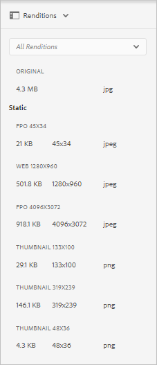

# Gerar para representações somente de posicionamento para o Adobe InDesign {#fpo-renditions}

<table>
    <tr>
        <td>
            <i>Novo</i> <a href="/help/assets/dynamic-media/dm-prime-ultimate.md"><b>Dynamic Media Prime e Ultimate</b></a>
        </td>
        <td>
            <i>Novo</i> <a href="/help/assets/assets-ultimate-overview.md"><b>AEM Assets Ultimate</b></a>
        </td>
        <td>
            <i>Nova</i> <a href="/help/assets/integrate-aem-assets-edge-delivery-services.md"><b>integração do AEM Assets com o Edge Delivery Services</b></a>
        </td>
        <td>
            <i>Novo</i> <a href="/help/assets/aem-assets-view-ui-extensibility.md"><b>Extensibilidade da Interface do Usuário</b></a>
        </td>
          <td>
            <i>Novo</i> <a href="/help/assets/dynamic-media/enable-dynamic-media-prime-and-ultimate.md"><b>Habilitar o Dynamic Media Prime e o Ultimate</b></a>
        </td>
    </tr>
    <tr>
        <td>
            <a href="/help/assets/search-best-practices.md"><b>Pesquisar Práticas Recomendadas</b></a>
        </td>
        <td>
            <a href="/help/assets/metadata-best-practices.md"><b>Práticas recomendadas de metadados</b></a>
        </td>
        <td>
            <a href="/help/assets/product-overview.md"><b>Content Hub</b></a>
        </td>
        <td>
            <a href="/help/assets/dynamic-media-open-apis-overview.md"><b>Dynamic Media com recursos OpenAPI</b></a>
        </td>
        <td>
            <a href="https://developer.adobe.com/experience-cloud/experience-manager-apis/"><b>documentação para desenvolvedores do AEM Assets</b></a>
        </td>
    </tr>
</table>

| Versão | Link do artigo |
| -------- | ---------------------------- |
| AEM 6.5 | [Clique aqui](https://experienceleague.adobe.com/en/docs/experience-manager-65/content/assets/administer/configure-fpo-renditions) |
| AEM as a Cloud Service | Este artigo |

Ao inserir ativos de grande porte do Experience Manager em documentos do Adobe InDesign, um profissional criativo deve aguardar um tempo considerável depois de [colocar um ativo](https://helpx.adobe.com/indesign/using/placing-graphics.html). Enquanto isso, o usuário não pode mais usar o InDesign. Isso interrompe o fluxo de criação e afeta negativamente a experiência do usuário. O Adobe permite colocar temporariamente representações de pequeno porte em documentos do InDesign para começar. Quando a saída final é necessária, digamos para workflows de impressão e publicação, os ativos originais e de resolução completa substituem a representação temporária em segundo plano. Essa atualização assíncrona em segundo plano acelera o processo de design para melhorar a produtividade e não dificulta o processo criativo.

A Assets fornece representações usadas Somente para posicionamento (FPO). Essas representações FPO têm um tamanho de arquivo pequeno, mas têm a mesma proporção. Se uma representação FPO não estiver disponível para um ativo, a Adobe InDesign usará o ativo original. Esse mecanismo de fallback garante que o workflow criativo continue sem interrupções.

O Experience Manager as a Cloud Service oferece recursos de processamento de ativos nativos em nuvem para gerar as representações FPO. Use os microsserviços de ativos para geração de representação. É possível configurar a geração de representação de ativos recém-carregados e dos ativos que existem no Experience Manager.

Veja a seguir as etapas para gerar representações FPO:

1. [Criar um perfil de processamento](#create-processing-profile).

1. Configure o Experience Manager para usar este perfil para [processar novos ativos](#generate-renditions-of-new-assets).
1. Use os perfis para [processar ativos existentes](#generate-renditions-of-existing-assets).

## Criar um perfil de processamento {#create-processing-profile}

Para gerar representações FPO, crie um **[!UICONTROL Perfil de Processamento]**. Os perfis usam microsserviços de ativos nativos em nuvem para processamento. Para obter instruções, consulte [criar perfis de processamento para microsserviços de ativos](asset-microservices-configure-and-use.md).

Selecione **[!UICONTROL Criar representação FPO]** para gerar a representação FPO. Opcionalmente, clique em **[!UICONTROL Adicionar Novo]** para adicionar outras configurações de representação ao mesmo perfil.

## Gerar representações de novos ativos {#generate-renditions-of-new-assets}

Para gerar representações FPO de novos ativos, aplique o **[!UICONTROL Perfil de Processamento]** à pasta nas propriedades da pasta. Na página Propriedades de uma pasta, clique na guia **[!UICONTROL Processamento de ativos]**, selecione o **[!UICONTROL Perfil FPO]** como **[!UICONTROL Perfil de processamento]** e salve as alterações. Todos os novos ativos carregados na pasta são processados usando este perfil.

## Gerar representações de ativos existentes {#generate-renditions-of-existing-assets}

Para gerar representações, selecione os ativos e siga essas etapas.

## Exibir representações FPO {#view-fpo-renditions}

Você pode verificar se as representações FPO geradas após a conclusão do fluxo de trabalho. Na interface do usuário do Experience Manager Assets, clique no ativo para abrir uma visualização grande. Abra o painel à esquerda e selecione **[!UICONTROL Representações]**. Como alternativa, use o atalho de teclado `Alt + 3` quando a visualização estiver aberta.

Clique em **[!UICONTROL Representação FPO]** para carregar sua visualização. Como opção, você pode clicar com o botão direito do mouse na representação e salvá-la em seu sistema de arquivos. Verifique se há representações disponíveis no painel esquerdo.

**Consulte também**

* [Traduzir ativos](translate-assets.md)
* [API HTTP de ativos](mac-api-assets.md)
* [Formatos de arquivo compatíveis com os ativos](file-format-support.md)
* [Pesquisar ativos](search-assets.md)
* [Ativos conectados](use-assets-across-connected-assets-instances.md)
* [Relatórios de ativos](asset-reports.md)
* [Esquemas de metadados](metadata-schemas.md)
* [Baixar ativos](download-assets-from-aem.md)
* [Gerenciar metadados](manage-metadata.md)
* [Pesquisar aspectos](search-facets.md)
* [Gerenciar coleções](manage-collections.md)
* [Importação de metadados em massa](metadata-import-export.md)
* [Publicar o Assets no AEM e no Dynamic Media](/help/assets/publish-assets-to-aem-and-dm.md)