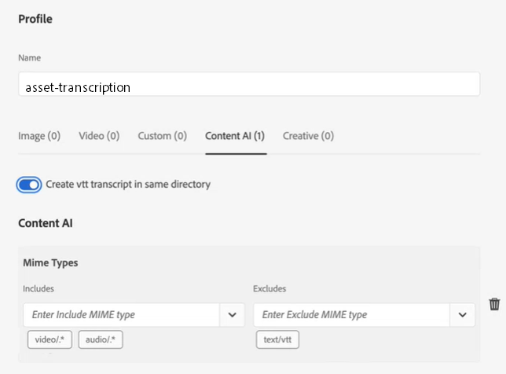
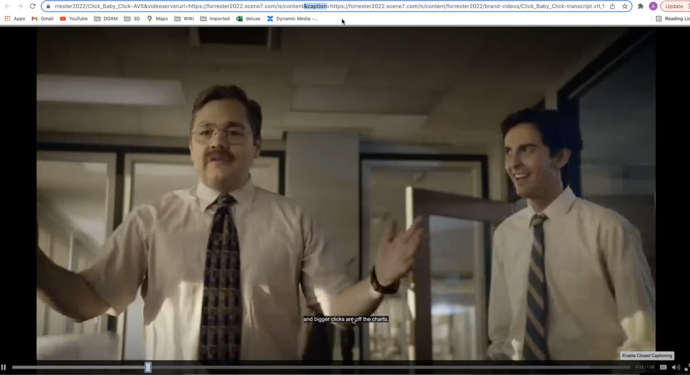

# Configurar transcrição no [!DNL Experience Manager Assets] {#configure-transcription-service}

A transcrição é o processo de traduzir o áudio de um arquivo de áudio ou vídeo em texto (fala para texto) usando a tecnologia de reconhecimento de voz.
O [!DNL Adobe Experience Manager Assets] está configurado com o [!DNL Azure Media Services], que gera automaticamente uma transcrição de texto do idioma falado em um arquivo de áudio ou vídeo compatível no formato WebVTT (.vtt). Quando um ativo de áudio ou vídeo é processado no [!DNL Experience Manager Assets], o serviço de transcrição gera automaticamente a representação da transcrição de texto do ativo de áudio ou vídeo e o armazena no mesmo local no repositório do Assets, onde o ativo original está. O serviço de transcrição do [!DNL Experience Manager Assets] permite que os profissionais de marketing gerenciem efetivamente o conteúdo de áudio e vídeo com mais capacidade de descoberta do conteúdo de texto, além de aumentar o ROI desses ativos ao oferecer suporte à acessibilidade e localização.

As transcrições são versões em texto do conteúdo falado; um exemplo é um filme que você está assistindo em qualquer plataforma OTT, que geralmente inclui legendas ou legendas ocultas para ajudar na acessibilidade ou no consumo do conteúdo em outros idiomas. Ou qualquer arquivo de áudio ou vídeo usado para fins de marketing, aprendizado ou entretenimento. Essas experiências começam com uma transcrição que é formatada ou traduzida conforme apropriado. A transcrição de áudio ou vídeo é um processo que exige muito tempo e pode causar erros quando executado manualmente. Também é um desafio escalar o processo manual, dada a necessidade cada vez maior de conteúdo de áudio e vídeo. [!DNL Experience Manager Assets] O usa a transcrição com IA do Azure, que permite o processamento em alta escala dos ativos de áudio e vídeo e gera as transcrições de texto (arquivos .vtt) junto com detalhes de carimbo de data e hora. Além do Assets, o recurso de transcrição também é compatível com o Dynamic Media.

O recurso de transcrição está disponível sem nenhum custo no [!DNL Experience Manager Assets]. No entanto, os administradores exigem as credenciais do Azure do usuário para configurar o serviço de transcrição no [!DNL Experience Manager Assets]. Você também pode [obter credenciais de avaliação](https://azure.microsoft.com/en-us/pricing/details/media-services/) diretamente da Microsoft® para experimentar o recurso de transcrição de áudio ou vídeo no Assets.

## Pré-requisitos de transcrição {#prerequisites}

1. Uma instância ativa e em execução do [!DNL Experience Manager Assets as a Cloud Service].
1. As credenciais do Azure a seguir são necessárias para configuração no [!DNL Experience Manager Assets]:

   * ID do cliente (chave de API)
   * Chave secreta do cliente
   * Endpoint do locatário (domínio)
   * Conta de mídia
   * Grupo de recursos
   * ID de assinatura

   Consulte a [Documentação do Azure](https://docs.microsoft.com/pt-BR/azure/media-services/latest/access-api-howto?tabs=portal) para obter as credenciais de acesso à API dos serviços de mídia do Azure.

1. Verifique se a conta do Azure tem crédito suficiente para processar novas solicitações.

## Configurar transcrição no [!DNL Experience Manager Assets] {#configure-transcription}

A seguir estão as configurações necessárias para habilitar o recurso de transcrição no [!DNL Experience Manager Assets]:

1. [Configurar os serviços de mídia do Azure](#configure-azure-media-service)
1. [Configurar perfil de processamento para transcrição de áudio/vídeo](#configure-processing-profile-for-transcription)

### Configurar os serviços de mídia do Azure {#configure-azure-media-services}

O [!DNL Experience Manager Assets] usa o [!DNL Azure Media Services] que gera automaticamente transcrições de texto do idioma falado em um [arquivo de áudio ou vídeo compatível](#supported-file-formats-for-transcription) no formato WebVTT (.vtt). Os administradores podem configurar o [!DNL Azure Media Services] no [!DNL Experience Manager Assets] usando as credenciais do Azure. Os [pré-requisitos de transcrição](#transcription-prerequisites) listam as credenciais do [!DNL Azure] necessárias para a configuração. Se você não tiver uma conta e as credenciais do [!DNL Azure], consulte [Documentação dos serviços de mídia do Azure](https://azure.microsoft.com/en-us/pricing/details/media-services/) para obter credenciais de avaliação.

Acesse **[!UICONTROL Ferramentas]** > **[!UICONTROL Serviços de nuvem]** > **[!UICONTROL Configuração dos serviços de mídia do Azure]**. Selecione uma pasta (local) no painel esquerdo e clique no botão [!UICONTROL Criar] para configurar a conexão com sua conta do [!DNL Azure]. Esta pasta é o local onde a configuração em nuvem do [!DNL Azure] é armazenada no Experience Manager Assets. Insira as credenciais do [!DNL Azure] e clique em **[!UICONTROL Salvar e fechar]**.

### Configurar perfil de processamento para transcrição {#configure-processing-profile}

Assim que o [!DNL Azure Media Services] for configurado no Experience Manager Assets, a próxima etapa é criar um perfil de processamento de ativo para gerar uma transcrição baseada em IA dos ativos de áudio e vídeo. O perfil de processamento baseado em IA gera transcrições do [ativo de áudio ou vídeo compatível](#supported-file-formats-for-transcription) como uma representação no Experience Manager Assets e armazena a transcrição (arquivo .vtt) na mesma pasta em que o ativo original está. Assim, é mais fácil para os usuários pesquisar e localizar o ativo e sua representação de transcrição.

Acesse **[!UICONTROL Ferramentas]** > **[!UICONTROL Ativos]** > **[!UICONTROL Perfis de processamento]** e clique no botão **[!UICONTROL Criar]** para criar um perfil de processamento baseado em IA e gerar a transcrição dos arquivos de áudio e vídeo. Por padrão, a página do perfil de processamento apresenta apenas três guias (Imagem, Vídeo e Personalizado). No entanto, a guia **[!UICONTROL IA de conteúdo]** ficará visível se você tiver configurado o [!DNL Azure Media Services] na instância do [!DNL Experience Manager Assets]. Verifique as credenciais do [!DNL Azure] se a guia **[!UICONTROL IA de conteúdo]** não estiver sendo exibida ao criar um perfil de processamento.

Na guia **[!UICONTROL IA de conteúdo]**, clique no botão **[!UICONTROL Adicionar novo]** para configurar a transcrição. Aqui, você pode incluir e excluir os formatos de arquivo (tipos MIME) para gerar transcrições selecionando tipos de arquivo na lista suspensa. Na ilustração a seguir, todos os arquivos de áudio e vídeo compatíveis estão incluídos e os arquivos de texto foram excluídos.

Ative a opção **[!UICONTROL Criar transcrição em VTT no mesmo diretório]** para criar e armazenar a representação de transcrição (arquivo .vtt) na mesma pasta em que o ativo original está. As outras representações também são geradas pelo fluxo de trabalho de processamento de ativos do DAM padrão, independentemente dessa configuração.

A ilustração a seguir detalha um perfil de vídeo personalizado criado no Experience Manager Assets.

O perfil de vídeo também contém as seguintes configurações personalizadas. Consulte a [documentação do perfil de processamento](/help/assets/asset-microservices-configure-and-use.md) para obter detalhes sobre como criar um perfil de processamento personalizado.

Vamos configurar a transcrição neste perfil de vídeo. Navegue até a guia **[!UICONTROL IA de conteúdo]** e clique no botão **[!UICONTROL Adicionar novo]**. Inclua todos os arquivos de áudio e vídeo e exclua os arquivos de imagem e aplicativo. Ative a opção **[!UICONTROL Criar transcrição em VTT no mesmo diretório]** e salve a configuração.

Depois que o perfil de processamento for configurado para transcrição de arquivos de áudio e vídeo, você poderá aplicar esse perfil de processamento às pastas usando um dos seguintes métodos:

* Selecione uma definição de perfil de processamento em **[!UICONTROL Ferramentas]** > **[!UICONTROL Ativos]** > **[!UICONTROL Perfis de processamento]** e use a ação **[!UICONTROL Aplicar perfil à(s) pasta(s)]**. O navegador de conteúdo permite navegar até uma pasta específica, selecioná-la e confirmar a aplicação do perfil.
* Selecione uma pasta na interface do Assets e clique na ação **[!UICONTROL Propriedades]** para abrir as propriedades da pasta. Clique na guia **[!UICONTROL Processamento de ativos]** e selecione o perfil de processamento apropriado para a pasta na lista **[!UICONTROL Perfil de processamento]**. Para salvar as alterações, clique em **[!UICONTROL Salvar e fechar]**.

   

* Os usuários podem selecionar pastas ou ativos específicos na interface do Assets para aplicar um perfil de processamento e, em seguida, selecionar **[!UICONTROL Reprocessar ativos]** nas opções disponíveis na parte superior.

>[!TIP]
>Somente um perfil de processamento pode ser aplicado a uma pasta.
>
>Depois que um perfil de processamento é aplicado a uma pasta, todos os novos ativos carregados (ou atualizados) para essa pasta ou para qualquer uma de suas subpastas são processados usando o perfil de processamento adicional configurado. Esse processamento é executado em adição ao do perfil padrão.

>[!NOTE]
>
>Um perfil de processamento aplicado a uma pasta funciona para toda a árvore, no entanto, pode ser substituído por outro perfil aplicado a uma subpasta.
>
>Quando os ativos são carregados para uma pasta, o Experience Manager se comunica com as propriedades da pasta que os contém para identificar o perfil de processamento. Se nenhum for aplicado, uma pasta principal na hierarquia será verificada em busca de um perfil de processamento para ser aplicado.

## Gerar transcrição dos ativos de áudio ou vídeo {#generate-transcription}

Ao processar um ativo de vídeo, o [Perfil de processamento baseado em IA](#configure-processing-profile-for-transcription) gera automaticamente a transcrição (arquivo .vtt) como uma representação junto com o ativo original na mesma pasta.

Você também pode visualizar a representação da transcrição acessando as representações do ativo de vídeo original. Para acessar o painel **[!UICONTROL Representações]**, selecione o ativo de vídeo original e abra o painel à esquerda. Você verá que a representação da transcrição (arquivo .vtt) está visível sob o cabeçalho **[!UICONTROL TRANSCRIPTVTT]**.

É possível baixar a transcrição (arquivo de texto .vtt) diretamente da pasta como uma representação de ativo separada, ou por meio do painel **[!UICONTROL Representações]** do ativo original baixando todas as representações do ativo.

Atualmente, o Experience Manager não oferece suporte à pré-visualização ou edição de texto completo de arquivos VTT nativamente. No entanto, é possível baixar a representação da transcrição e usar qualquer editor de texto para editar ou verificar a transcrição. A transcrição reflete o idioma falado como um texto no carimbo de data e hora especificado no vídeo com a pontuação de confiança (precisão) da transcrição.

## Utilização de transcrição no Dynamic Media {#using-transcription-in-dynamic-media}

Se você tiver [configurado o Dynamic Media](/help/assets/dynamic-media/config-dm.md) na instância do Experience Manager Assets, é possível publicar o ativo (arquivo de áudio ou vídeo) e sua transcrição (arquivo .vtt) no Dynamic Media. Ao fazer isso, o ativo original (arquivo de áudio ou vídeo) e sua representação transcrita (arquivo .vtt) são publicados no Dynamic Media, ambos na mesma pasta. O administrador do Dynamic Media pode [habilitar a experiência de legenda oculta (CC)](/help/assets/dynamic-media/video.md#adding-captions-to-video) para o arquivo de áudio ou vídeo usando a representação da transcrição (arquivo .vtt).

Consulte também:

* [Tutorial em vídeo sobre como adicionar legendas ocultas (CC) aos vídeos do Dynamic Media](https://experienceleague.adobe.com/docs/experience-manager-learn/assets/dynamic-media/dynamic-media-overview-feature-video-use.html?lang=pt-BR#add-cc-closed-captioning-to-dynamic-media-video)
* [Publicar vídeos do Dynamic Media no YouTube](/help/assets/dynamic-media/video.md#publishing-videos-to-youtube)

Na ilustração a seguir, o URL reflete a parte da legenda que se refere à transcrição (arquivo .vtt). O vídeo reflete o idioma falado (texto transcrito) como uma **[!UICONTROL Legenda oculta]** no carimbo de data e hora fornecido no vídeo. O usuário pode ativar ou desativar a legenda usando o botão **[!UICONTROL CC]**.

## Formatos de arquivo compatíveis com a transcrição {#supported-file-format}

Os formatos de arquivo de áudio e vídeo a seguir são compatíveis com a transcrição:

| Formatos de áudio/vídeo compatíveis | Extensões  |
|----|----|
| FLV (com codecs H.264 e AAC) | (.flv) |
| MXF | (.mxf) |
| MPEG2-PS, MPEG2-TS, 3GP | (.ts, .ps, .3gp, .3gpp, .mpg) |
| Vídeo do Windows Media (WMV)/ASF | (.wmv, .asf) |
| AVI (8 bits/10 bits descompactados) | (.avi) |
| MP4 | (.mp4, .m4a, .m4v) |
| Gravação de vídeo digital da Microsoft® (DVR-MS) | (.dvr-ms) |
| Matroska/WebM | (.mkv) |
| WAVE/WAV | (.wav) |
| QuickTime | (.mov) |

>[!NOTE]
>
>Os ativos (arquivos de áudio ou vídeo) do tipo de aplicativo não são compatíveis com a transcrição.

## Limitações conhecidas {#known-limitations}

* O recurso de transcrição é compatível com vídeos de duração máxima de 10 minutos.
* O título do vídeo deve ter menos de 80 caracteres.
* O tamanho de arquivo permitido é de até 15 GB.
* A duração máxima de processamento permitida é de 60 minutos.
* Em uma conta paga do [!DNL Azure], você pode fazer upload de até 50 filmes por minuto. No entanto, em uma conta de avaliação, você pode fazer upload de até cinco filmes por minuto.

## Dicas de solução de problemas {#troubleshooting}

Faça logon na conta do [!DNL Azure Media Services] com as mesmas credenciais (usadas para configuração) para verificar o status da solicitação. Entre em contato com o suporte do [!DNL Azure] caso sua solicitação não seja processada.

**Consulte também**

* [Traduzir ativos](translate-assets.md)
* [API HTTP de ativos](mac-api-assets.md)
* [Formatos de arquivo compatíveis com os ativos](file-format-support.md)
* [Pesquisar ativos](search-assets.md)
* [Ativos conectados](use-assets-across-connected-assets-instances.md)
* [Relatórios de ativos](asset-reports.md)
* [Esquemas de metadados](metadata-schemas.md)
* [Baixar ativos](download-assets-from-aem.md)
* [Gerenciar metadados](manage-metadata.md)
* [Pesquisar aspectos](search-facets.md)
* [Gerenciar coleções](manage-collections.md)
* [Importação de metadados em massa](metadata-import-export.md)
