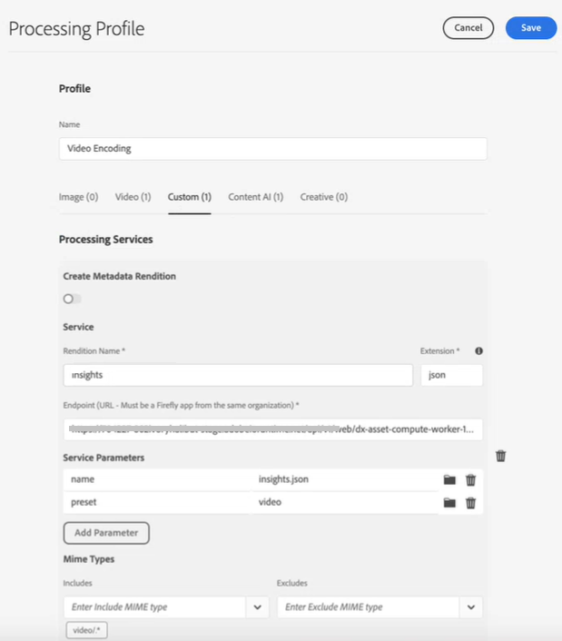

# Configurar transcrição em [!DNL Experience Manager Assets] {#configure-transcription-service}

A transcrição é o processo de traduzir o áudio de um arquivo de áudio ou vídeo em texto (voz para texto) usando a tecnologia de reconhecimento de voz.
[!DNL Adobe Experience Manager Assets] é configurado com [!DNL Azure Media Services] que gera automaticamente transcrição de texto do idioma falado em um arquivo de áudio ou vídeo suportado no formato WebVTT (.vtt). Quando um ativo de áudio ou vídeo é processado em [!DNL Experience Manager Assets], o serviço de transcrição gera automaticamente a renderização de transcrição de texto do ativo de áudio ou vídeo e o armazena no mesmo local no repositório de Ativos, onde o ativo original reside. O [!DNL Experience Manager Assets] o serviço de transcrição permite que os profissionais de marketing gerenciem efetivamente seu conteúdo de áudio e vídeo com mais capacidade de descoberta do conteúdo de texto, bem como aumentar o ROI desses ativos ao oferecer suporte à acessibilidade e localização.

As transcrições são versões de texto de conteúdo falado; um exemplo é um filme que você está assistindo em qualquer plataforma OTT, que geralmente inclui legendas ou legendas para ajudar na acessibilidade ou no consumo do conteúdo em outros idiomas. Ou qualquer arquivo de áudio ou vídeo usado para fins de marketing, aprendizado ou entretenimento. Essas experiências começam com uma transcrição que é formatada ou traduzida conforme apropriado. A transcrição de áudio ou vídeo é um processo que requer muito tempo e pode causar erros quando executado manualmente. Também é um desafio escalar o processo manual, dada a necessidade cada vez maior de conteúdo de áudio-vídeo. [!DNL Experience Manager Assets] O usa a transcrição baseada em AI do Azure, que permite o processamento em alta escala dos ativos de áudio e vídeo e gera as transcrições de texto (arquivos .vtt) junto com os detalhes do carimbo de data e hora. Junto com Ativos, o recurso de transcrição também é compatível com o Dynamic Media.

O recurso de transcrição está disponível sem nenhum custo em [!DNL Experience Manager Assets]. No entanto, os administradores exigem as credenciais do Azure do usuário para configurar o serviço de transcrição em [!DNL Experience Manager Assets]. Você também pode [obter as credenciais de avaliação](https://azure.microsoft.com/en-us/pricing/details/media-services/) diretamente da Microsoft® para experimentar o recurso de transcrição de áudio ou vídeo no Assets.

## Pré-requisitos de transcrição {#prerequisites}

1. Uma atividade ativa e em execução [!DNL Experience Manager Assets as a Cloud Service] instância.
1. As credenciais do Azure a seguir são necessárias para configuração em [!DNL Experience Manager Assets]:

   * ID do cliente (chave da API)
   * Chave Segredo do Cliente
   * Ponto de extremidade do locatário (domínio)
   * Conta de mídia
   * Grupo de recursos
   * ID de assinatura

   Consulte [Documentação do Azure](https://docs.microsoft.com/en-us/azure/media-services/latest/access-api-howto?tabs=portal) para obter credenciais para acessar a API do Azure Media Services.

1. Certifique-se de que a conta do Azure tenha crédito suficiente para processar novas solicitações.

## Configurar transcrição em [!DNL Experience Manager Assets] {#configure-transcription}

A seguir estão as configurações necessárias para habilitar o recurso de transcrição em [!DNL Experience Manager Assets]:

1. [Configurar o Azure Media Services](#configure-azure-media-service)
1. [Configurar perfil de processamento para transcrição de áudio/vídeo](#configure-processing-profile-for-transcription)

### Configurar o Azure Media Services {#configure-azure-media-services}

[!DNL Experience Manager Assets] usa a variável [!DNL Azure Media Services] que gera automaticamente transcrições de texto do idioma falado em um [arquivo de áudio ou vídeo suportado](#supported-file-formats-for-transcription) no formato WebVTT (.vtt). Os administradores podem configurar [!DNL Azure Media Services] em [!DNL Experience Manager Assets] usando as credenciais do Azure. O [pré-requisitos de transcrição](#transcription-prerequisites) listar os [!DNL Azure] credenciais necessárias para a configuração. Se você não tiver [!DNL Azure] conta e credenciais, consulte [Documentação do Azure Media Services](https://azure.microsoft.com/en-us/pricing/details/media-services/) para obter credenciais de avaliação.

Ir para **[!UICONTROL Ferramentas]** > **[!UICONTROL Cloud Services]** > **[!UICONTROL Configuração do Azure Media Services]**. Selecione uma pasta (local) no painel esquerdo e clique no botão [!UICONTROL Criar] para configurar a conexão com seu [!DNL Azure] conta. Esta pasta é o local onde seu [!DNL Azure] a configuração da nuvem é armazenada no Experience Manager Assets. Insira o [!DNL Azure] credenciais e clique em **[!UICONTROL Salvar e fechar]**.

### Configurar perfil de processamento para transcrição {#configure-processing-profile}

Uma vez [!DNL Azure Media Services] for configurado no Experience Manager Assets, a próxima etapa é criar um Perfil de processamento de ativo para gerar uma transcrição baseada em IA dos ativos de áudio e vídeo. O perfil de processamento baseado em AI gera transcrições do [ativo de áudio ou vídeo suportado](#supported-file-formats-for-transcription) como uma representação no Experience Manager Assets e armazena a transcrição (arquivo .vtt) na mesma pasta em que o ativo original reside. Assim, é mais fácil para os usuários pesquisar e localizar o ativo e sua representação de transcrição.

Ir para **[!UICONTROL Ferramentas]** > **[!UICONTROL Ativos]** > **[!UICONTROL Processando perfis]** e clique no botão **[!UICONTROL Criar]** para criar um perfil de processamento baseado em AI para gerar transcrição de seus arquivos de áudio e vídeo. Por padrão, a página de perfil de processamento reflete apenas três guias (Imagem, Vídeo e Personalizado). No entanto, uma **[!UICONTROL Content AI]** estiver visível se tiver configurado [!DNL Azure Media Services] em seu [!DNL Experience Manager Assets] instância. Verifique seu [!DNL Azure] credenciais se você não vir a variável **[!UICONTROL Content AI]** ao criar um Perfil de processamento.

No **[!UICONTROL Content AI]** clique no botão **[!UICONTROL Adicionar novo]** para configurar a transcrição. Aqui, você pode incluir e excluir os formatos de arquivo (tipos MIME) para geração de transcrições selecionando tipos de arquivo na lista suspensa. Na ilustração a seguir, todos os arquivos de áudio e vídeo suportados são incluídos e os arquivos de texto são excluídos.

Ative o **[!UICONTROL Criar transcrição de VTT no mesmo diretório]** alterne para criar e armazenar a representação de transcrição (arquivo .vtt) na mesma pasta em que o ativo original reside. As outras representações também são geradas pelo fluxo de trabalho de processamento de ativos DAM padrão, independentemente dessa configuração.

A ilustração a seguir detalha um perfil de vídeo personalizado criado no Experience Manager Assets.

O perfil de vídeo também contém as seguintes configurações personalizadas. Consulte [documentação do perfil de processamento](/help/assets/asset-microservices-configure-and-use.md) para obter detalhes sobre como criar um perfil de processamento personalizado.

Vamos configurar a transcrição neste perfil de vídeo. Navegue até o **[!UICONTROL Content AI]** e clique no botão **[!UICONTROL Adicionar novo]** botão. Inclua todos os arquivos de áudio e vídeo e exclua a imagem e os arquivos do aplicativo. Ative o **[!UICONTROL Criar transcrição de VTT no mesmo diretório]** alterne e salve a configuração.

Depois que o perfil de processamento for configurado para transcrição de arquivos de áudio e vídeo, você poderá aplicar esse perfil de processamento a pastas usando um dos seguintes métodos:

* Selecione uma definição de perfil de processamento em **[!UICONTROL Ferramentas]** > **[!UICONTROL Ativos]** > **[!UICONTROL Processando perfis]** e use **[!UICONTROL Aplicar perfil às pastas]** ação. O navegador de conteúdo permite navegar até uma pasta específica, selecionar pasta e confirmar o aplicativo do perfil.
* Selecione uma pasta na interface do usuário do Assets e clique em **[!UICONTROL Propriedades]** para abrir as propriedades da pasta. Clique no botão **[!UICONTROL Processamento de ativos]** e selecione o perfil de processamento apropriado para a pasta no **[!UICONTROL Perfil de processamento]** lista. Para salvar as alterações, clique em **[!UICONTROL Salvar e fechar]**.

   

* Os usuários podem selecionar pastas ou ativos específicos na interface do usuário do Assets para aplicar um perfil de processamento e, em seguida, selecionar **[!UICONTROL Reprocessar ativos]** nas opções disponíveis na parte superior.

>[!TIP]
>Somente um perfil de processamento pode ser aplicado a uma pasta.
>
>Depois que um perfil de processamento é aplicado a uma pasta, todos os novos ativos carregados (ou atualizados) nessa pasta ou em qualquer uma de suas subpastas são processados usando o perfil de processamento adicional configurado. Esse processamento está além do perfil padrão.

>[!NOTE]
>
>Um perfil de processamento aplicado a uma pasta funciona para toda a árvore, no entanto, pode ser substituído por outro perfil aplicado a uma subpasta.
>
>Quando os ativos são carregados em uma pasta, o Experience Manager se comunica com as propriedades da pasta contêiner para identificar o perfil de processamento. Se nenhuma for aplicada, uma pasta pai na hierarquia será verificada em busca de um perfil de processamento a ser aplicado.

## Gerar transcrição dos ativos de áudio ou vídeo {#generate-transcription}

Ao processar um ativo de vídeo, a variável [Perfil de processamento baseado em IA](#configure-processing-profile-for-transcription) O gera automaticamente a transcrição (arquivo .vtt) como uma representação junto com o ativo original na mesma pasta.

Você também pode ver a representação de transcrição acessando as Representações do ativo de vídeo original. Para acessar o **[!UICONTROL Representações]** , selecione o ativo de vídeo original e abra o painel à esquerda. Você pode ver que a representação da transcrição (arquivo .vtt) está visível sob a variável **[!UICONTROL TRANSCRIPTVTT]** cabeça.

Você pode baixar a transcrição (arquivo de texto .vtt) diretamente da pasta como uma representação de ativo separada, ou de dentro do **[!UICONTROL Representações]** painel do ativo original baixando todas as representações do ativo.

Atualmente, o Experience Manager não oferece suporte à visualização ou edição de texto completo de arquivos VTT nativamente. No entanto, é possível baixar a representação de transcrição e usar qualquer editor de texto para editar ou verificar a transcrição. The transcript reflects the spoken language as a text at the given timestamp in the video with the confidence score (accuracy) of the transcription.

## Uso de transcrição no Dynamic Media {#using-transcription-in-dynamic-media}

Se tiver [Dynamic Media configurado](/help/assets/dynamic-media/config-dm.md) na instância do Experience Manager Assets, é possível publicar o ativo (arquivo de áudio ou vídeo) e sua transcrição (arquivo .vtt) no Dynamic Media. Ao fazer isso, o ativo original (arquivo de áudio ou vídeo) e sua representação transcrita (arquivo .vtt) são publicados no Dynamic Media na mesma pasta. O administrador do Dynamic Media pode [habilitar a experiência de Legenda oculta CC](/help/assets/dynamic-media/video.md#adding-captions-to-video) para o arquivo de áudio ou vídeo usando a representação de transcrição (arquivo .vtt).

Consulte também:

* [Vídeo tutorial sobre como adicionar legendas ocultas CC ao vídeo do Dynamic Media](https://experienceleague.adobe.com/docs/experience-manager-learn/assets/dynamic-media/dynamic-media-overview-feature-video-use.html#add-cc-closed-captioning-to-dynamic-media-video)
* [Publicar vídeos do Dynamic Media no YouTube](/help/assets/dynamic-media/video.md#publishing-videos-to-youtube)

Na ilustração a seguir, o URL reflete a parte da legenda que se refere à transcrição (arquivo .vtt). O vídeo reflete o idioma falado (texto transcrito) como um **[!UICONTROL Legenda oculta]** no carimbo de data e hora fornecido no vídeo. O usuário pode ativar ou desativar a legenda usando a variável **[!UICONTROL CC]** botão.

## Formatos de arquivo suportados para transcrição {#supported-file-format}

Os formatos de arquivo de áudio e vídeo a seguir são suportados para transcrição:

| Formatos de áudio/vídeo compatíveis | Extensões |
|----|----|
| FLV (com codecs H.264 e AAC) | (.flv) |
| MXF | (.mxf) |
| MPEG2-PS, MPEG2-TS, 3GP | (.ts, .ps, .3gp, .3gpp, .mpg) |
| Windows Media Video (WMV)/ASF | (.wmv, .asf) |
| AVI (8 bits/10 bits descompactados) | (.avi) |
| MP4 | (.mp4, .m4a, .m4v) |
| Gravação de vídeo digital Microsoft® (DVR-MS) | (.dvr-ms) |
| Matroska/WebM | (.mkv) |
| WAVE/WAV | (.wav) |
| QuickTime | (.mov) |

>[!NOTE]
>
>Os ativos (arquivos de áudio ou vídeo) do tipo de aplicativo não são suportados para transcrição.

## Limitações conhecidas {#known-limitations}

* O recurso de transcrição é compatível com vídeos de duração máxima de 10 minutos.
* O título do vídeo deve ter menos de 80 caracteres.
* O tamanho de arquivo suportado é de até 15 GB.
* A duração máxima de processamento suportada é de 60 minutos.
* Em um [!DNL Azure] você pode fazer upload de até 50 filmes por minuto. No entanto, em uma conta de avaliação, você pode fazer upload de até cinco filmes por minuto.

## Dicas de solução de problemas {#troubleshooting}

Faça logon no [!DNL Azure Media Services] conta com as mesmas credenciais (usadas para configuração) para verificar o status da solicitação. Contato [!DNL Azure] suporte se sua solicitação não for processada com êxito.

