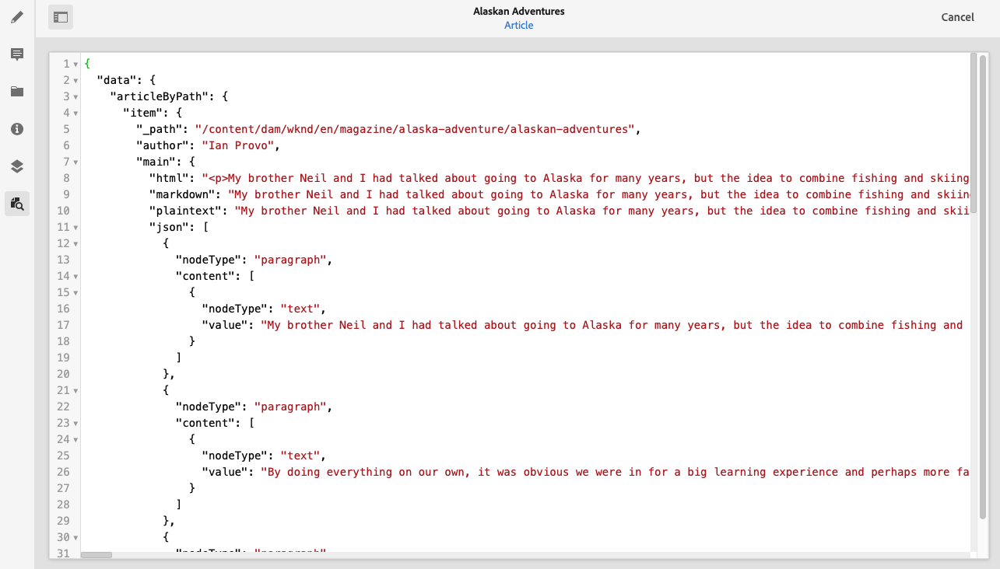

# Visualização - Representação JSON {#preview-json-representation}

Ao desenvolver os modelos para fragmentos de conteúdo como parte de sua implementação do AEM Headless, você pode querer visualizar uma amostra da saída em JSON para um fragmento de conteúdo, conforme baseada em um modelo. Por exemplo, para ter uma ideia de como a saída final será. Isso pode ser útil ao validar a estrutura JSON do modelo, talvez com conteúdo de amostra padrão por tipo de dados.

>[!NOTE]
>
>Os Fragmentos de conteúdo são um recurso do Sites, mas são armazenados como **Assets**.
>
>Há dois editores para a criação de fragmentos de conteúdo; embora a funcionalidade básica seja a mesma, há algumas diferenças. Esta seção abrange o editor original, acessado principalmente do console **Assets**. Consulte a documentação do Sites, [Fragmentos de conteúdo - Criação](/help/sites-cloud/administering/content-fragments/authoring.md), para obter detalhes do novo editor (acessado principalmente do console **Fragmentos de conteúdo**).

Ao usar o ícone **Visualizar**:

É possível visualizar a representação em JSON do fragmento atual. Por exemplo:

<!--
**Copy URL** lets you copy to clipboard the URL for either author or publish.
-->