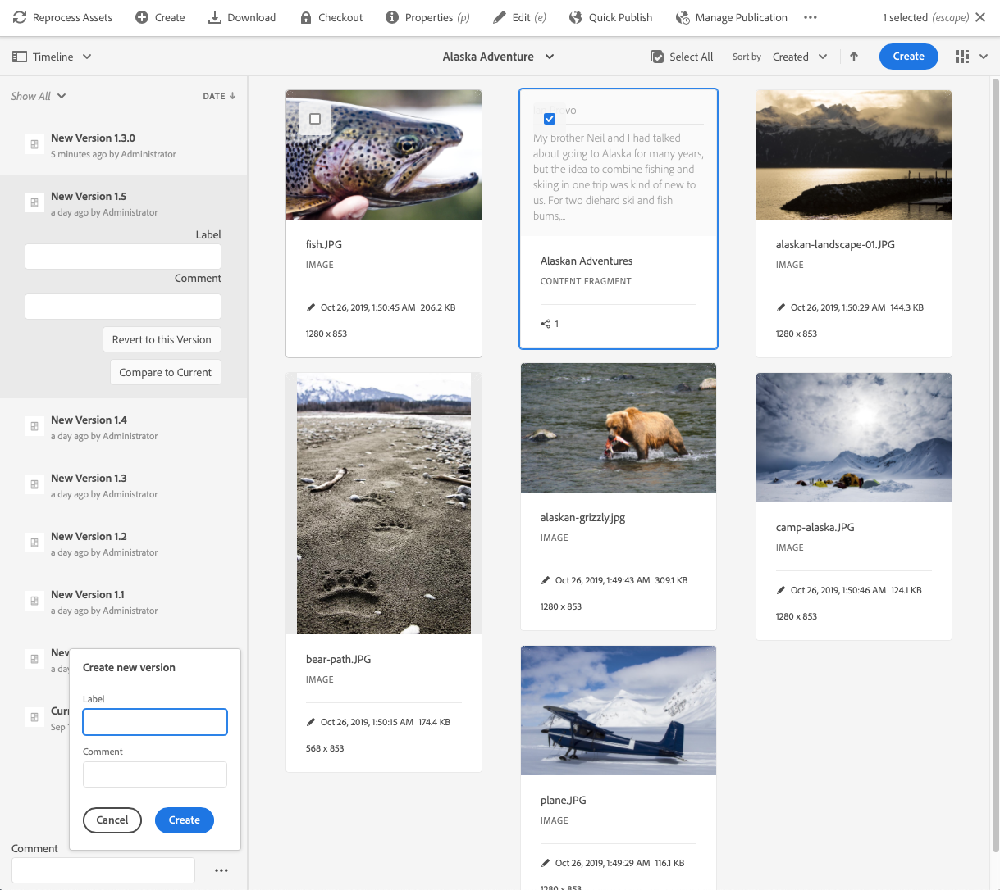

# Gerenciamento de fragmentos de conteúdo{#managing-content-fragments}

Os Fragmentos de conteúdo são armazenados como **Ativos**, portanto, são gerenciados principalmente no console **Ativos** .

>[!NOTE]
>
>Fragmentos de conteúdo são usados com páginas de criação; consulte Criação [de página com fragmentos](/help/sites-cloud/authoring/fundamentals/content-fragments.md)de conteúdo.

## Criação de fragmentos de conteúdo {#creating-content-fragments}

### Criação de um modelo de conteúdo {#creating-a-content-model}

[Os modelos](/help/assets/content-fragments/content-fragments-models.md) de fragmento de conteúdo podem ser ativados e criados antes da criação de fragmentos de conteúdo com conteúdo estruturado.

>[!NOTE]
>
>Consulte Desenvolvimento de fragmentos de conteúdo para obter mais informações sobre modelos; usado para fragmentos de conteúdo simples.

<!--
>[!NOTE]
>
>See [Developing Content Fragments](/help/sites-developing/customizing-content-fragments.md) for further information on templates; used for simple content fragments.
-->

### Criação de um fragmento de conteúdo {#creating-a-content-fragment}

O método de criação de um fragmento de conteúdo é (basicamente) o mesmo para fragmentos simples e estruturados:

1. Navegue até a pasta **Ativos** na qual deseja criar o fragmento.
2. Selecione **Criar** e Fragmento **de** conteúdo para abrir o assistente.
3. A primeira etapa do assistente requer que você especifique a base do novo fragmento.

   * Isso pode ser:

      * Modelo - por exemplo, Fragmento **simples**<!-- [Template](/help/sites-developing/content-fragment-templates.md) - for example **Simple Fragment** -->

      * [Modelo](/help/assets/content-fragments/content-fragments-models.md) - usado para criar um fragmento que requer conteúdo estruturado; por exemplo, o modelo **Airports**
   * Todos os modelos e modelos disponíveis são exibidos.
   Após a seleção, use **Próximo** para continuar.

   

4. Na etapa **Propriedades** , especifique:

   * **Básico**

      * **Título**

         O título do fragmento.

         Obrigatório.

      * **Descrição**

      * **Tags**
   * **Avançado**

      * **Nome**

         O nome; será usada para formar o URL.

         Obrigatório; serão derivadas automaticamente do título, mas poderão ser atualizadas.

5. Selecione **Criar** para concluir a ação e, em seguida, **Abrir** o fragmento para edição ou retornar ao console com **Concluído**.

## Ações para um fragmento de conteúdo {#actions-for-a-content-fragment}

No console **Ativos** , várias ações estão disponíveis para seus fragmentos de conteúdo:

* Na barra de ferramentas; após a seleção do fragmento, todas as ações apropriadas estarão disponíveis.
* Como ações [rápidas](/help/sites-cloud/authoring/getting-started/basic-handling.md#quick-actions); um subconjunto de ações disponível para os cartões de fragmento individuais.

Selecione o fragmento para revelar a barra de ferramentas com as ações aplicáveis:

* **Criar**
* **Download**

   * Salve o fragmento como um arquivo ZIP; você pode definir se deseja incluir Elementos, Variações, Metadados.

* **Check-out**
* **Propriedades**

   * Permite exibir e/ou editar os metadados do fragmento.

* **Editar**

   * Permite [abrir o fragmento para edição de conteúdo](/help/assets/content-fragments/content-fragments-variations.md) junto com seus elementos, variações, conteúdo associado e metadados.

* **Gerenciar tags**
* **Para a coleção**

   * Adicione o fragmento a uma coleção.
   * Isso também pode ser feito ao [associar uma coleção ao fragmento](/help/assets/content-fragments/content-fragments-assoc-content.md#adding-associated-content).

* **Copiar**/**colar**

* **Mover**
* **Publicação rápida**
* **Gerenciar publicação**
* **Excluir**

>[!NOTE]
>
>Muitas dessas ações são [padrão para os Ativos](/help/assets/manage-digital-assets.md) e/ou o aplicativo [de desktop do](https://helpx.adobe.com/experience-manager/desktop-app/aem-desktop-app.html)AEM.

## Abrir o Editor de fragmentos {#opening-the-fragment-editor}

Para abrir o fragmento para edição:

<!--
>[!CAUTION]
>
>To edit a content fragment you need [the appropriate permissions](/help/sites-developing/customizing-content-fragments.md#asset-permissions). Please contact your system administrator if you are experiencing issues.
-->

>[!CAUTION]
>
>Para editar um fragmento de conteúdo, você precisa das permissões apropriadas. Entre em contato com o administrador do sistema se tiver problemas.

1. Use o console **Ativos** para navegar até o local do fragmento do conteúdo.
2. Abra o fragmento para edição ao:

   * Clicar/tocar no fragmento ou link do fragmento (isso depende da exibição do console).
   * Selecionando o fragmento, em seguida, **Editar** na barra de ferramentas.
   O editor de fragmentos abrirá:

   

   >[!NOTE]
   >
   >1. Uma mensagem será exibida quando o fragmento já estiver referenciado em uma página de conteúdo.
      >
      >
      >

   2. O painel lateral pode ser oculto/exibido usando o ícone **Alternar painel** lateral.

3. Navegue pelos três modos usando os ícones no painel lateral:

   * Variações: [Editar o conteúdo](#editing-the-content-of-your-fragment) e [gerenciar suas variações](#creating-and-managing-variations-within-your-fragment)

   * [Anotações](/help/assets/content-fragments/content-fragments-variations.md#annotating-a-content-fragment)
   * [Conteúdo associado](#associating-content-with-your-fragment)
   * [Metadados](#viewing-and-editing-the-metadata-properties-of-your-fragment)
   

4. Depois de fazer alterações, use **Salvar** ou **Cancelar** , conforme necessário.

   >[!NOTE]
   >
   >Tanto **Salvar** quanto **Cancelar** sairão do editor - consulte [Salvar, Cancelar e Versões](#save-cancel-and-versions) para obter informações completas sobre como ambas as opções operam para fragmentos de conteúdo.

## Salvar, Cancelar e Versões {#save-cancel-and-versions}

>[!NOTE]
>
>As versões também podem ser [criadas, comparadas e revertidas na Linha do tempo](/help/assets/content-fragments/content-fragments-managing.md#timeline-for-content-fragments).

O editor tem duas opções:

* **Salvar**

   Salva as alterações mais recentes e saia do editor.

   >[!CAUTION]
   >
   >Para editar um fragmento de conteúdo, você precisa das permissões apropriadas. Entre em contato com o administrador do sistema se tiver problemas.

   <!-- 
  >[!CAUTION]
  >
  >To edit a content fragment you need [the appropriate permissions](/help/sites-developing/customizing-content-fragments.md#asset-permissions). Please contact your system administrator if you are experiencing issues. 
  -->

   >[!NOTE]
   >
   >É possível permanecer no editor, fazendo uma série de alterações, antes de selecionar **Salvar**.

   >[!CAUTION]
   >
   >Além de salvar suas alterações, o **Save** também atualiza quaisquer referências e garante que o dispatcher seja liberado conforme necessário. Essas mudanças podem levar tempo para serem processadas. Devido a isso, pode haver um impacto no desempenho em um sistema grande/complexo/com carga intensa.
   >
   >
   >Lembre-se disso ao usar **Salvar** e, em seguida, reinserir rapidamente o editor de fragmentos para fazer e salvar outras alterações.

* **Cancelar**

   Sairá do editor sem salvar as alterações mais recentes.

Ao editar seu fragmento de conteúdo, o AEM cria automaticamente versões para garantir que o conteúdo anterior possa ser restaurado se você **Cancelar** suas alterações:

1. Quando um fragmento de conteúdo é aberto para edição, o AEM verifica a existência do token baseado em cookie que indica se existe uma sessão *de* edição:

   1. Se o token for encontrado, o fragmento será considerado parte da sessão de edição existente.
   2. Se o token *não* estiver disponível e o usuário iniciar a edição do conteúdo, uma versão será criada e um token para essa nova sessão de edição será enviado ao cliente, onde será salvo em um cookie.

2. Enquanto há uma sessão de edição *ativa* , o conteúdo que está sendo editado é salvo automaticamente a cada 600 segundos (padrão).

   >[!NOTE]
   >
   >O intervalo de salvamento automático é configurável usando o `/conf` mecanismo.
   >
   >Valor padrão, consulte:
   >  `/libs/settings/dam/cfm/jcr:content/autoSaveInterval`

3. Se o usuário selecionar **Cancelar** a edição, a versão criada no início da sessão de edição será restaurada e o token será removido para encerrar a sessão de edição.
4. Se o usuário selecionar **Salvar** as edições, os elementos/variações atualizados serão mantidos e o token será removido para encerrar a sessão de edição.

## Editar o conteúdo do fragmento {#editing-the-content-of-your-fragment}

Após abrir o fragmento, use a guia [Variações](/help/assets/content-fragments/content-fragments-variations.md) para criar o conteúdo.

## Criação e gerenciamento de variações no fragmento {#creating-and-managing-variations-within-your-fragment}

Depois de criar o conteúdo mestre, você pode criar e gerenciar [variações](/help/assets/content-fragments/content-fragments-variations.md) desse conteúdo.

## Associar conteúdo ao fragmento {#associating-content-with-your-fragment}

Também é possível [associar conteúdo](/help/assets/content-fragments/content-fragments-assoc-content.md) a um fragmento. Isso fornece uma conexão para que os ativos (ou seja, imagens) possam ser usados (opcionalmente) com o fragmento quando ele for adicionado a uma página de conteúdo.

## Visualização e edição dos metadados (propriedades) do fragmento {#viewing-and-editing-the-metadata-properties-of-your-fragment}

É possível exibir e editar as propriedades de um fragmento usando a guia [Metadados](/help/assets/content-fragments/content-fragments-metadata.md) .

## Linha do tempo para fragmentos de conteúdo {#timeline-for-content-fragments}

Além das opções padrão, a [Linha do tempo](/help/assets/manage-digital-assets.md#timeline) fornece informações e ações específicas para fragmentos de conteúdo:

* Exibir informações sobre versões, comentários e anotações
* Ações para versões

   * **[Reverter para esta versão](#reverting-to-a-version)**(selecione um fragmento existente e, em seguida, uma versão específica)

   * **[Comparar com Atual](#comparing-fragment-versions)**(selecione um fragmento existente e, em seguida, uma versão específica)

   * Adicionar um **Rótulo** e/ou **Comentário** (selecione um fragmento existente e, em seguida, uma versão específica)

   * **Salvar como versão** (selecione um fragmento existente e a seta para cima na parte inferior da Linha do tempo)

* Ações para anotações

   * **Excluir**

>[!NOTE]
Os comentários são:
* Funcionalidade padrão para todos os ativos
* Feito na Linha do tempo
* Relacionado ao ativo de fragmento

As anotações (para Fragmentos de conteúdo) são:
* Inserido no editor de fragmentos
* Específico para um segmento selecionado de texto no fragmento

Por exemplo:

## Comparação de versões de fragmento {#comparing-fragment-versions}

A ação **Comparar com o atual** está disponível na [Linha](/help/assets/content-fragments/content-fragments-managing.md#timeline-for-content-fragments) do tempo depois que você seleciona uma versão específica.

Isso abrirá:

* a versão **Atual** (mais recente) (à esquerda)

* a versão selecionada **v&lt;*x.y*>** (direita)

Elas serão mostradas lado a lado, onde:

* Quaisquer diferenças são destacadas

   * Texto excluído - vermelho
   * Texto inserido - verde
   * Texto substituído - azul

* O ícone de tela cheia permite que você abra qualquer versão por conta própria; em seguida, alterne de volta para a exibição paralela
* Você pode **Reverter** para a versão específica
* **Concluído** retornará ao console

>[!NOTE]
Não é possível editar o conteúdo do fragmento ao comparar fragmentos.

## Reverting to a Version  {#reverting-to-a-version}

É possível reverter para uma versão específica do fragmento:

* Diretamente da [Linha do tempo](/help/assets/content-fragments/content-fragments-managing.md#timeline-for-content-fragments).

   Selecione a versão necessária e, em seguida, a ação **Reverter para esta versão** .

* Ao [comparar uma versão com a versão](/help/assets/content-fragments/content-fragments-managing.md#comparing-fragment-versions) atual, é possível **Reverter** para a versão selecionada.

## Publicação e referência de um fragmento {#publishing-and-referencing-a-fragment}

>[!CAUTION]
Se o fragmento for baseado em um modelo, verifique se o [modelo foi publicado](/help/assets/content-fragments/content-fragments-models.md#publishing-a-content-fragment-model).
Se você publicar um fragmento de conteúdo para o qual o modelo ainda não foi publicado, uma lista de seleção indicará isso e o modelo será publicado com o fragmento.

Fragmentos de conteúdo devem ser publicados para uso no ambiente de publicação. Podem ser publicados:

* Após a criação; no console **Ativos** .
* Ao [publicar uma página que usa o fragmento](/help/sites-cloud/authoring/fundamentals/content-fragments.md#publishing); o fragmento será listado nas referências de página.

>[!CAUTION]
Após a publicação e/ou referência de um fragmento, o AEM exibirá um aviso quando um autor abrir o fragmento para edição novamente. Isso serve para avisar que as alterações no fragmento também afetarão as páginas referenciadas.

## Excluir um fragmento {#deleting-a-fragment}

Para excluir um fragmento:

1. No console **Ativos** , navegue até o local do fragmento de conteúdo.
2. Selecione o fragmento.

   >[!NOTE]
   The **Delete** action is not available as a quick action.

3. Select **Delete** from the toolbar.
4. Confirme a ação **Excluir** .

   >[!CAUTION]
   Se o fragmento já estiver referenciado em uma página, você verá uma mensagem de aviso e será solicitado a confirmar que deseja continuar com uma **Forçar exclusão**. O fragmento, juntamente com seu componente de fragmento de conteúdo, será excluído de qualquer página de conteúdo.
