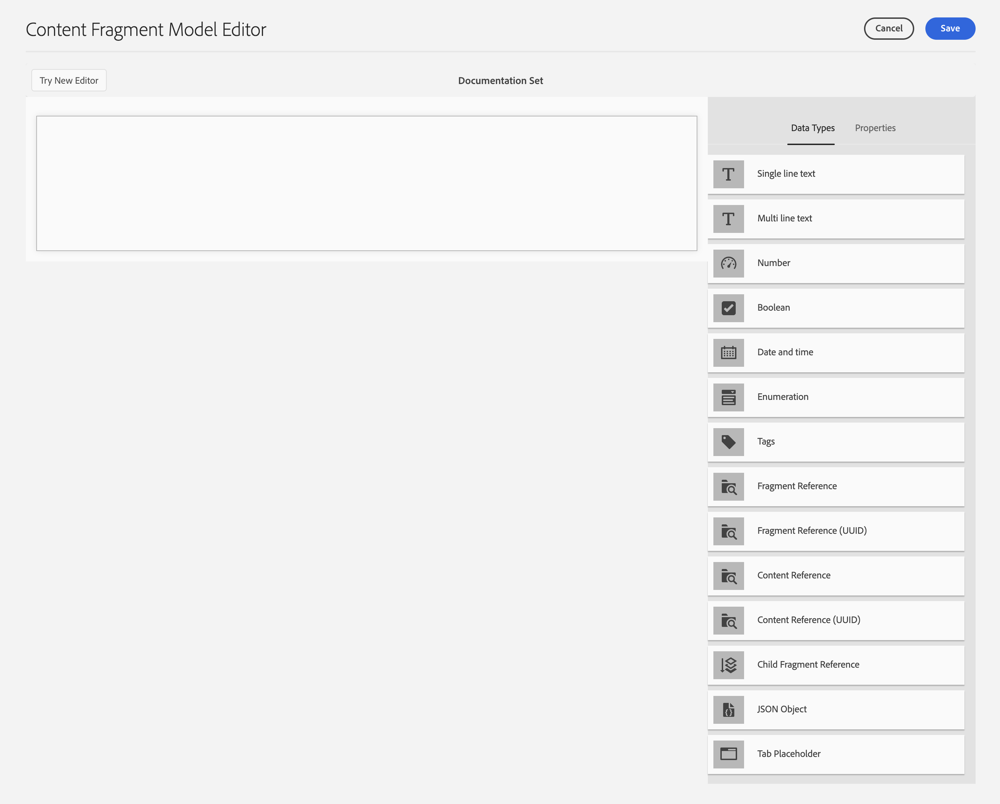
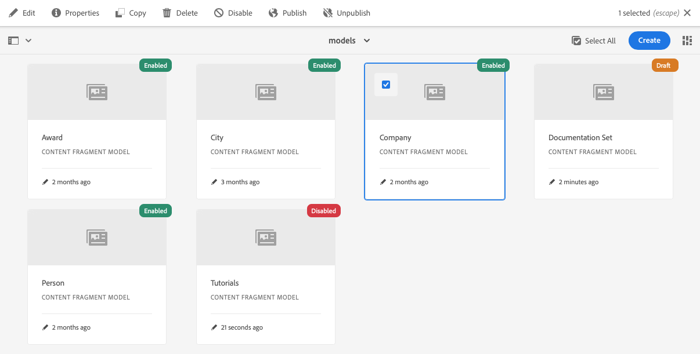
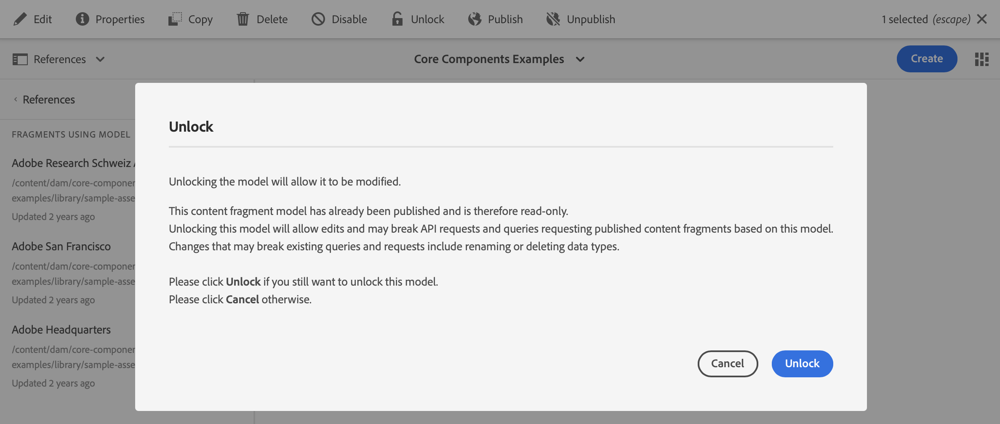
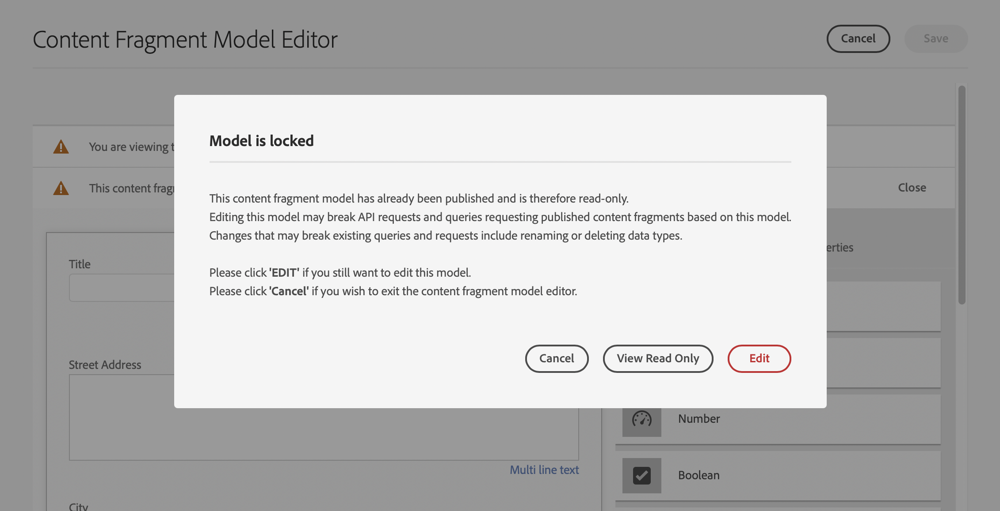

# Modelos de fragmentos do conteúdo {#content-fragment-models}

Os modelos de fragmento de conteúdo no AEM definem a estrutura do conteúdo para os seus [fragmentos de conteúdo](/help/assets/content-fragments/content-fragments.md), servindo como base para o seu conteúdo headless.

Para usar modelos de fragmento de conteúdo, você pode:

1. [Habilitar a funcionalidade de modelo de fragmento de conteúdo para sua instância](/help/assets/content-fragments/content-fragments-configuration-browser.md)
1. [Criar](#creating-a-content-fragment-model) e [configurar](#defining-your-content-fragment-model) os modelos de fragmento de conteúdo
1. [Habilitar os Modelos de fragmento de conteúdo](#enabling-disabling-a-content-fragment-model) para uso ao criar Fragmentos de conteúdo
1. [Autorizar os modelos de fragmento de conteúdo nas pastas de ativos necessárias](#allowing-content-fragment-models-assets-folder) ao configurar as **Políticas**.

>[!NOTE]
>
>Os Fragmentos de conteúdo são um recurso do Sites, mas são armazenados como **Assets**.
>
>Os Fragmentos de conteúdo e os Modelos de fragmento de conteúdo agora são gerenciados principalmente com o console **[Fragmentos de conteúdo](/help/sites-cloud/administering/content-fragments/overview.md#content-fragments-console)**, embora os Fragmentos de conteúdo ainda possam ser gerenciados no console **Assets** e os Modelos de fragmento de conteúdo no console **Ferramentas**. Esta seção aborda o gerenciamento dos consoles **Assets** e **Ferramentas**.

>[!NOTE]
>
>Se um modelo foi criado com o [novo editor de modelo](/help/sites-cloud/administering/content-fragments/content-fragment-models.md), você sempre deve usar esse editor para o modelo.
>
>Se você abrir o modelo com esse editor de modelo (original), verá a mensagem:
>
>* &quot;Este modelo tem um esquema de interface do usuário personalizado configurado. A ordem dos campos exibidos nesta interface pode não corresponder ao esquema da interface do usuário. Para exibir os campos alinhados ao esquema da interface do usuário, é necessário alternar para o novo Editor de fragmento de conteúdo.&quot;

## Criação de um modelo de fragmento de conteúdo {#creating-a-content-fragment-model}

1. Navegue até **Ferramentas**, **Geral** e, em seguida, abra **Modelos de fragmentos de conteúdo**.
1. Navegue até a pasta apropriada à sua [configuração ou subconfiguração](/help/assets/content-fragments/content-fragments-configuration-browser.md).
1. Use **Criar** para abrir o assistente.

   >[!CAUTION]
   >
   >Se o [uso de modelos de fragmento de conteúdo não foi habilitado](/help/assets/content-fragments/content-fragments-configuration-browser.md), a opção **Criar** não estará disponível.

1. Especifique o **Título do Modelo**.
Você também pode definir várias propriedades; por exemplo, adicionar **Marcas**, uma **Descrição** e selecionar **Habilitar modelo** para [habilitar o modelo](#enabling-disabling-a-content-fragment-model) se necessário.

   >[!NOTE]
   >
   >Para obter detalhes sobre o **Padrão de URL de Visualização Padrão**, consulte [Modelo de Fragmento de Conteúdo - Propriedades](#content-fragment-model-properties).

   

1. Use **Criar** para salvar o modelo vazio. Uma mensagem indicará o sucesso da ação. Você poderá selecionar **Abrir** para editar imediatamente o modelo, ou **Concluído** para retornar ao console.

## Definição do modelo de fragmento de conteúdo {#defining-your-content-fragment-model}

O modelo de fragmento de conteúdo define efetivamente a estrutura dos fragmentos de conteúdo resultantes usando uma seleção de **[Tipos de dados](#data-types)**. Usando o editor do modelo, é possível adicionar instâncias dos tipos de dados e configurá-las para criar os campos necessários:

>[!CAUTION]
>
>A edição de um modelo de fragmento de conteúdo existente pode afetar fragmentos dependentes.

1. Navegue até **Ferramentas**, **Geral** e, em seguida, abra **Modelos de fragmentos de conteúdo**.

1. Navegue até a pasta que contém o modelo de fragmento de conteúdo.
1. Abra o modelo necessário para **Edição**; use a ação rápida ou selecione o modelo e depois a ação na barra de ferramentas.

   Uma vez aberto, o editor de modelo mostra:

   * à esquerda: campos já definidos
   * à direita: **Tipos de dados** disponíveis para criar campos (e **Propriedades** para uso depois que os campos forem criados)
   * topo: uma opção para experimentar o [novo editor](/help/sites-cloud/administering/content-fragments/content-fragment-models.md)

   >[!NOTE]
   >
   >Quando um campo é **obrigatório**, o **rótulo** indicado no painel à esquerda é marcado com um asterisco (**&#42;**).



1. **Para adicionar um campo**

   * Arraste um tipo de dados necessário para o local exigido de um campo:

     

   * Depois que um campo é adicionado ao modelo, o painel direito mostrará as **Propriedades** que podem ser definidas para esse tipo de dados específico. Aqui é possível definir o que é necessário para esse campo.

      * Muitas propriedades são autoexplicativas. Para obter mais detalhes, consulte [Propriedades](#properties).
      * Digitar um **Rótulo de campo** preencherá automaticamente o **Nome da propriedade** se estiver vazio, e pode ser atualizado manualmente posteriormente.

        >[!CAUTION]
        >
        >Ao atualizar manualmente a propriedade **Nome da propriedade** de um tipo de dados, observe que os nomes devem conter somente caracteres latinos (A-Z, a-z), dígitos numéricos (0-9) e o underline (“_”) como caractere especial.
        >
        >Se os modelos criados em versões anteriores do AEM contiverem caracteres ilegais, remova ou atualize esses caracteres.

     Por exemplo:

     

1. **Para remover um campo**

   Selecione o campo obrigatório e, em seguida, o ícone da lixeira. Você receberá uma solicitação para confirmar a ação.

   

1. Adicione todos os campos obrigatórios e defina as propriedades relacionadas, conforme necessário. Por exemplo:

   

1. Selecione **Salvar** para salvar a definição.

## Tipos de dados {#data-types}

Uma variedade de tipos de dados está disponível para a definição do seu modelo:

* **Texto em linha única**
   * Adicionar um campo para uma única linha de texto; o comprimento máximo pode ser definido
   * O campo pode ser configurado para permitir que os autores de fragmento criem novas instâncias do campo

* **Texto multilinha**
   * Uma área de texto que pode ser Rich Text, Texto sem formatação ou Markdown
   * O campo pode ser configurado para permitir que os autores de fragmento criem novas instâncias do campo

  >[!NOTE]
  >
  >Se a área de texto é Rich Text, Texto sem formatação ou Markdown, é definida no modelo pela propriedade **Tipo padrão**.
  >
  >Este formato não pode ser alterado do [editor de Fragmento de Conteúdo](/help/sites-cloud/administering/content-fragments/authoring.md), mas somente do Modelo.

* **Número**
   * Adicionar um campo numérico
   * O campo pode ser configurado para permitir que os autores de fragmento criem novas instâncias do campo

* **Booleano**
   * Adicionar uma caixa de seleção booleana

* **Data e hora**
   * Adicionar um campo de data e/ou hora

* **Enumeração**
   * Adicionar um conjunto de caixas de seleção, botões de opção ou campos suspensos
      * É possível especificar as opções disponíveis para o autor do fragmento

* **Tags**
   * Permite que os autores de fragmentos acessem e selecionem áreas de tags

* **Referência do fragmento**
   * Faz referência a outros fragmentos de conteúdo; pode ser usado para [criar conteúdo aninhado](#using-references-to-form-nested-content)
   * O tipo de dados pode ser configurado para permitir que os autores de fragmento:
      * Editem o fragmento referenciado diretamente.
      * Crie um novo Fragmento de conteúdo, com base no modelo apropriado
      * Criar novas instâncias do campo
   * A referência especifica o caminho para o recurso referenciado; por exemplo `/content/dam/path/to/resource`

* **Referência de fragmento (UUID)**
   * Faz referência a outros fragmentos de conteúdo; pode ser usado para [criar conteúdo aninhado](#using-references-to-form-nested-content)
   * O tipo de dados pode ser configurado para permitir que os autores de fragmento:
      * Editem o fragmento referenciado diretamente.
      * Crie um novo Fragmento de conteúdo, com base no modelo apropriado
      * Criar novas instâncias do campo
   * No editor, a referência especifica o caminho para o recurso referenciado; internamente, a referência é mantida como uma ID universalmente exclusiva (UUID) que faz referência ao recurso
      * Não é necessário conhecer a UUID; no editor de fragmentos, é possível navegar até o fragmento necessário

  >[!NOTE]
  >
  >Os UUIDs são específicos do repositório. Se você usar a [Ferramenta de cópia de conteúdo](/help/implementing/developing/tools/content-copy.md) para copiar fragmentos de conteúdo, as UUIDs serão recalculadas no ambiente de destino.

* **Referência de conteúdo**
   * Faz referência a outros conteúdos, de qualquer tipo; pode ser usado para [criar conteúdo aninhado](#using-references-to-form-nested-content)
   * Se uma imagem for referenciada, você pode optar por mostrar uma miniatura
   * O campo pode ser configurado para permitir que os autores de fragmento criem novas instâncias do campo
   * A referência especifica o caminho para o recurso referenciado; por exemplo `/content/dam/path/to/resource`

* **Referência de conteúdo (UUID)**
   * Faz referência a outros conteúdos, de qualquer tipo; pode ser usado para [criar conteúdo aninhado](#using-references-to-form-nested-content)
   * Se uma imagem for referenciada, você pode optar por mostrar uma miniatura
   * O campo pode ser configurado para permitir que os autores de fragmento criem novas instâncias do campo
   * No editor, a referência especifica o caminho para o recurso referenciado; internamente, a referência é mantida como uma ID universalmente exclusiva (UUID) que faz referência ao recurso
      * Não é necessário conhecer a UUID; no editor de fragmentos, é possível navegar até o recurso de ativo necessário

  >[!NOTE]
  >
  >Os UUIDs são específicos do repositório. Se você usar a [Ferramenta de cópia de conteúdo](/help/implementing/developing/tools/content-copy.md) para copiar fragmentos de conteúdo, as UUIDs serão recalculadas no ambiente de destino.

* **Objeto JSON**
   * Permite que o autor do Fragmento de conteúdo insira a sintaxe JSON nos elementos correspondentes de um fragmento.
      * Para permitir que o AEM armazene o JSON direto que você tenha copiado/colado de outro serviço.
      * O JSON será transmitido e emitido como JSON no GraphQL.
      * Inclui o realce da sintaxe JSON, o preenchimento automático e o realce de erros no editor de Fragmento de conteúdo.

* **Espaço reservado da guia**
   * Permite a introdução de guias para uso ao editar o conteúdo do fragmento de conteúdo.
      * Eles são mostrados como divisores no editor de modelo, separando seções da lista de tipos de dados de conteúdo. Cada instância representa o início de uma nova guia.
      * No editor de fragmentos, cada instância aparece como uma guia.

     >[!NOTE]
     >
     >Esse tipo de dados é usado apenas para formatação e é ignorado pelo esquema GraphQL do AEM.

## Propriedades {#properties}

Muitas propriedades são autoexplicativas. Para certas propriedades, os detalhes adicionais são os seguintes:

* **Nome da Propriedade**

  Ao atualizar manualmente essa propriedade para um tipo de dados, observe que os nomes **devem** conter *somente* caracteres latinos (A-Z, a-z), dígitos numéricos (0-9) e o underline (“_”) como caractere especial.

  >[!CAUTION]
  >
  >Se os modelos criados em versões anteriores do AEM contiverem caracteres ilegais, remova ou atualize esses caracteres.

* **Renderizar como**
As várias opções para realizar/renderizar o campo em um fragmento. Geralmente, essa propriedade permite definir se o autor vê uma única instância do campo ou se tem permissão para criar várias instâncias. Quando **Vários Campos** for usado, você poderá definir o número mínimo e máximo de itens - consulte [Validação](#validation) para obter mais detalhes.

* **Rótulo do campo**
Inserir um **Rótulo de Campo** gerará automaticamente um **Nome de Propriedade**, que pode ser atualizado manualmente se necessário.

* **Validação**
A validação básica está disponível por meio de mecanismos como a propriedade **Obrigatório**. Alguns tipos de dados têm campos de validação de adição. Consulte [Validação](#validation) para obter mais detalhes.

* No tipo de dados **Texto multilinha**, é possível definir o **Tipo padrão** como:

   * **Rich Text**
   * **Markdown**
   * **Texto sem formatação**

  Se não for especificado, o valor padrão **Rich Text** é usado para esse campo.

  Alterar o **Tipo padrão** em um modelo de fragmento de conteúdo só terá efeito em um fragmento de conteúdo existente relacionado depois que esse fragmento for aberto no editor e salvo.

* **Exclusivo**
O conteúdo (para o campo específico) deve ser exclusivo em todos os fragmentos de conteúdo criados a partir do modelo atual.

  Isso é usado para garantir que os autores de conteúdo não possam repetir o conteúdo já adicionado em outro fragmento do mesmo modelo.

  Por exemplo, um campo **Texto de linha única** chamado de `Country` no modelo de fragmento de conteúdo não pode ter o valor `Japan` em dois fragmentos de conteúdo dependentes. Um aviso será emitido na tentativa da segunda instância.

  >[!NOTE]
  >
  >A exclusividade é assegurada por raiz de idioma.

  >[!NOTE]
  >
  >As variações podem ter o mesmo valor *exclusivo* como variações do mesmo fragmento, mas não o mesmo valor usado em qualquer variação de outros fragmentos.

  >[!CAUTION]
  >
  >Se você quiser usar o MSM (que cria cópias de Fragmentos de conteúdo), qualquer restrição **única** deverá ser removida de qualquer Tipo de dados usado nos respectivos Modelos de fragmento de conteúdo.

* Consulte **[Referência de conteúdo](#content-reference)** para obter mais detalhes sobre esse tipo de dados específico e suas propriedades.

* Consulte **[Referência de fragmento (fragmentos aninhados)](#fragment-reference-nested-fragments)** para obter mais detalhes sobre esse tipo de dados específico e suas propriedades.

* **Traduzível**

  Marcar a caixa de seleção **Traduzível** em um campo no editor do modelo de fragmento de conteúdo:

   * Garantirá que o nome da propriedade do campo seja adicionado à configuração de tradução, no contexto `/content/dam/<sites-configuration>`, se ainda não estiver presente.
   * Para GraphQL: definirá uma propriedade `<translatable>` no campo Fragmento de conteúdo para `yes`, permitindo o uso do filtro de consulta GraphQL para saída de JSON somente para conteúdo traduzível.

## Validação {#validation}

Vários tipos de dados agora incluem a possibilidade de definir requisitos de validação para quando o conteúdo é inserido no fragmento resultante:

* **Texto em linha única**
   * Comparar com uma expressão regular predefinida.
* **Número**
   * Verificar valores específicos.
* **Referência de conteúdo**
   * Testar tipos específicos de conteúdo.
   * Somente ativos de tamanho de arquivo especificado ou menores podem ser referenciados.
   * Somente imagens dentro de um intervalo predefinido de largura e/ou altura (em pixels) podem ser referenciadas.
* **Referência do fragmento**
   * Testar um modelo de fragmento de conteúdo específico.
* **Número mínimo de itens** / **Número máximo de itens**

  Os campos que foram definidos como **Vários Campos** (definidos com **Renderizar como**) têm as seguintes opções:

   * **Número mínimo de itens**
   * **Número Máximo de Itens**

  Eles são validados:

   * O valor máximo é validado no [Editor original de fragmento de conteúdo](/help/assets/content-fragments/content-fragments-variations.md).
   * Ambos são validados no [Editor de fragmento de conteúdo](/help/sites-cloud/administering/content-fragments/authoring.md).

## Usar referências para formar conteúdo aninhado {#using-references-to-form-nested-content}

Os fragmentos de conteúdo podem formar conteúdo aninhado, usando um dos seguintes tipos de dados:

* [Referência de conteúdo](#content-reference)
   * Fornece uma referência simples a outro conteúdo, de qualquer tipo.
   * Fornecidos pelos tipos de dados:
      * **Referência de conteúdo** - baseada em caminho
      * **Referência de conteúdo (UUID)** - baseada em UUID
   * Pode ser configurado para uma ou várias referências (no fragmento resultante).

* [Referência de fragmento](#fragment-reference-nested-fragments) (fragmentos aninhados)
   * Faz referência a outros fragmentos, dependendo dos modelos especificados.
   * Fornecidos pelos tipos de dados:
      * **Referência de fragmento** - baseada em caminho
      * **Referência de fragmento (UUID)** - baseada em UUID
   * Permite incluir/recuperar dados estruturados.

     >[!NOTE]
     >
     >Este método é especialmente interessante quando você está usando a [Entrega de conteúdo headless usando fragmentos de conteúdo com o GraphQL](/help/sites-cloud/administering/content-fragments/content-delivery-with-graphql.md).

   * Pode ser configurado para uma ou várias referências (no fragmento resultante).

>[!NOTE]
>
>Consulte [Atualizar os fragmentos de conteúdo para referências UUID](/help/headless/graphql-api/uuid-reference-upgrade.md) para obter mais informações sobre a referência de conteúdo/fragmento e a referência de conteúdo/fragmento (UUID), além de atualizar para os tipos de dados baseados em UUID.

>[!NOTE]
>
>O AEM tem proteção de recorrência para:
>
>* Referências do conteúdo
>  Isso impede que o usuário adicione uma referência ao fragmento atual. Isso pode resultar em uma caixa de diálogo vazia do seletor de referência de fragmento.
>
>* Referências de fragmento no GraphQL
>  Se você criar uma consulta profunda que retorna vários fragmentos de conteúdo referenciados uns pelos outros, ele retornará um valor nulo na primeira ocorrência.

### Referência de conteúdo {#content-reference}

Os tipos de dados **Referência de Conteúdo** e **Referência de Conteúdo (UUID)** permitem renderizar o conteúdo de outra fonte; por exemplo, imagem, página ou Fragmento de Experiência.

Além das propriedades padrão, é possível especificar:

* O **Caminho raiz** para qualquer conteúdo referenciado
* Os tipos de conteúdo que podem ser referenciados
* Limitações para tamanhos de arquivo
* Se uma imagem for referenciada:
   * Mostrar miniatura
   * Restrições de altura e largura da imagem


### Referência de fragmento (fragmentos aninhados) {#fragment-reference-nested-fragments}

Os tipos de dados **Referência de Fragmento** e **Referência de Fragmento (UUID)** podem fazer referência a um ou mais Fragmentos de Conteúdo. Esse recurso é especialmente interessante ao recuperar conteúdo para uso no aplicativo, pois permite recuperar dados estruturados com várias camadas.

Por exemplo:

* Um modelo que define os detalhes de um funcionário. Isso inclui:
   * Uma referência ao modelo que define o empregador (empresa)

```xml
type EmployeeModel {
    name: String
    firstName: String
    company: CompanyModel
}

type CompanyModel {
    name: String
    street: String
    city: String
}
```

>[!NOTE]
>
>Isso é especialmente interessante em conjunto com a [Entrega de conteúdo headless usando fragmentos de conteúdo com o GraphQL](/help/assets/content-fragments/content-fragments-graphql.md).

Além das propriedades padrão, você pode definir:

* **Renderizar como**:

   * **multifield** — o autor do fragmento pode criar várias referências individuais

   * **fragmentreference** — permite que o autor do fragmento selecione uma única referência a um fragmento

* **Tipo de modelo**
Vários modelos podem ser selecionados. Ao criar o fragmento de conteúdo, qualquer fragmento referenciado deve ter sido criado usando esses modelos.

* **Caminho raiz**
Especifica um caminho raiz para qualquer fragmento referenciado.

* **Permitir criação de fragmentos**

  Isso permite que o autor do fragmento crie um fragmento com base no modelo apropriado.

   * **fragmentreferencecomposite** — permite que o autor do fragmento crie uma composição ao selecionar vários fragmentos

  

>[!NOTE]
>
>Um mecanismo de proteção contra recorrências está em vigor. Ele proíbe que o usuário selecione o fragmento de conteúdo atual na referência do fragmento. Isso pode resultar em uma caixa de diálogo vazia do seletor de referência de fragmento.
>
>Também há uma proteção de recorrência para referências de fragmento em GraphQL. Se você criar uma consulta profunda em dois fragmentos de conteúdo que fazem referência um ao outro, ela retornará um valor nulo.

## Modelo do fragmento de conteúdo — Propriedades {#content-fragment-model-properties}

É possível editar as **Propriedades** de um modelo do fragmento de conteúdo:

* **Básico**
   * **Título do modelo**
   * **Tags**
   * **Descrição**
   * **Fazer upload de imagem**
   * **Padrão de URL de Visualização Padrão**

     >[!NOTE]
     >
     >Isto só é usado pelo *novo* Editor de Fragmento de Conteúdo. Consulte [Modelos de fragmentos do conteúdo](/help/sites-cloud/administering/content-fragments/content-fragment-models.md#content-fragment-model-properties) para obter mais informações.


## Habilitar ou desabilitar um Modelo de fragmento de conteúdo {#enabling-disabling-a-content-fragment-model}

Para ter controle total sobre o uso dos modelos de fragmento de conteúdo, eles têm um status que pode ser definido.

### Habilitar um modelo de fragmento de conteúdo {#enabling-a-content-fragment-model}

Quando um modelo é criado, ele deve ser ativado para:

* Está disponível para seleção ao criar um fragmento de conteúdo.
* Poder ser referenciado a partir de um modelo de fragmento de conteúdo.
* Estar disponível no GraphQL; assim, o esquema é gerado.

Para habilitar um modelo que esteja sinalizado como:

* **Rascunho**: novo (nunca habilitado).
* **Desativado**: foi especificamente desativado.

Você usa a opção **Habilitar** a partir:

* Da barra de ferramentas superior, quando o modelo necessário estiver selecionado.
* Da ação rápida correspondente (passa o mouse sobre o modelo necessário).


### Desativar um modelo de fragmento de conteúdo {#disabling-a-content-fragment-model}

Um modelo também pode ser desativado para que:

* O modelo não fique mais disponível como base para a criação de *novos* fragmentos de conteúdo.
* No entanto:
   * O esquema de GraphQL continua sendo gerado e ainda pode ser consultado (para evitar impacto na API JSON).
   * Quaisquer fragmentos de conteúdo baseados no modelo ainda podem ser consultados e retornados a partir do ponto de acesso do GraphQL.
* O modelo não pode mais ser referenciado, mas as referências existentes são mantidas e ainda podem ser consultadas e retornadas a partir do ponto de acesso do GraphQL.

Para desabilitar um Modelo que esteja sinalizado como **Habilitado**, você usa a opção **Desabilitar**:

* Da barra de ferramentas superior, quando o modelo necessário estiver selecionado.
* Da ação rápida correspondente (passa o mouse sobre o modelo necessário).



## Permitir modelos de fragmentos de conteúdo na pasta de ativos {#allowing-content-fragment-models-assets-folder}

Para implementar a governança de conteúdo, você pode configurar **Políticas** na pasta de ativos para controlar quais modelos de fragmento de conteúdo são permitidos na criação de fragmentos dessa pasta.

>[!NOTE]
>
>O mecanismo é semelhante ao de [permitir modelos de página](/help/sites-cloud/authoring/page-editor/templates.md#allowing-a-template-author) para uma página e suas filhas nas suas propriedades avançadas.

Para configurar as **políticas** para **modelos de fragmento de conteúdo permitidos**:

1. Navegue e abra as **Propriedades** da pasta de ativos necessária.

1. Abra a guia **Políticas**, onde é possível configurar:

   * **Herdado de`<folder>`**

     As políticas são automaticamente herdadas ao criar novas pastas filhas; a política pode ser reconfigurada (e a herança quebrada) se as subpastas precisarem permitir modelos diferentes da pasta pai.

   * **Modelos de fragmento de conteúdo permitidos por caminho**

     Vários modelos podem ser permitidos.

   * **Modelos de fragmento de conteúdo permitidos por tag**

     Vários modelos podem ser permitidos.

   

1. **Salve** quaisquer alterações.

Os modelos de fragmento de conteúdo permitidos para uma pasta são resolvidos da seguinte maneira:

* As **políticas** para **modelos de fragmento do conteúdo permitidos**.
* Se estiver vazia, tente determinar a política usando as regras de herança.
* Se a cadeia de herança não fornecer um resultado, verifique a configuração de **Cloud Services** dessa pasta (diretamente e, em seguida, por herança).
* Se nenhuma das opções acima fornecer resultados, então não há modelos permitidos para essa pasta.

## Exclusão de um modelo de fragmento de conteúdo {#deleting-a-content-fragment-model}

>[!CAUTION]
>
>A exclusão de um modelo de fragmento de conteúdo pode afetar fragmentos dependentes.

Para excluir um modelo de fragmento de conteúdo:

1. Navegue até **Ferramentas**, **Geral** e, em seguida, abra os **Modelos de fragmentos do conteúdo**.

1. Navegue até a pasta que contém o modelo de fragmento de conteúdo.
1. Selecione seu modelo e, em seguida, **Excluir** na barra de ferramentas.

   >[!NOTE]
   >
   >Se o modelo for referenciado, um aviso será exibido. Tome as medidas apropriadas.

## Publicação de um modelo de fragmento de conteúdo {#publishing-a-content-fragment-model}

Os modelos de fragmento de conteúdo precisam ser publicados quando/antes de qualquer fragmento de conteúdo dependente ser publicado.

Para publicar um modelo de fragmento de conteúdo:

1. Navegue até **Ferramentas**, **Geral** e, em seguida, abra os **Modelos de fragmentos do conteúdo**.

1. Navegue até a pasta que contém o modelo de fragmento de conteúdo.
1. Selecione seu modelo e, em seguida, **Publicar** na barra de ferramentas.
O status publicado é indicado no console.

   >[!NOTE]
   >
   >Se você publicar um fragmento de conteúdo cujo modelo ainda não tenha sido publicado, uma lista de seleção indicará isso e o modelo será publicado junto com o fragmento.

## Desfazer a publicação de um modelo de fragmento de conteúdo {#unpublishing-a-content-fragment-model}

Os modelos de fragmento de conteúdo podem ter sua publicação desfeita se não forem referenciados por nenhum fragmento.

Para desfazer a publicação de um modelo de fragmento de conteúdo:

1. Navegue até **Ferramentas**, **Geral** e, em seguida, abra os **Modelos de fragmentos do conteúdo**.

1. Navegue até a pasta que contém o modelo de fragmento de conteúdo.
1. Selecione seu modelo e, em seguida, **Desfazer publicação** na barra de ferramentas.
O status publicado é indicado no console.

Se você tentar desfazer a publicação de um modelo que é usado atualmente por um ou mais fragmentos, um aviso de erro informará sobre isso:


A mensagem sugerirá que você verifique o painel [Referências](/help/sites-cloud/authoring/basic-handling.md#references) para investigar mais detalhadamente:


## Modelos de fragmentos de conteúdo bloqueados (publicados) {#locked-published-content-fragment-models}

Esse recurso fornece o controle dos modelos de fragmento de conteúdo que foram publicados.

### O desafio {#the-challenge}

* Os modelos de fragmento de conteúdo determinam o esquema para consultas GraphQL no AEM.

   * Os esquemas GraphQL do AEM são criados assim que um modelo de fragmento de conteúdo é criado e podem existir em ambientes do autor e de publicação.

   * Os esquemas em publicação são os mais críticos, pois fornecem a base para a entrega em tempo real do conteúdo do fragmento de conteúdo no formato JSON.

* Problemas podem ocorrer quando os modelos de fragmento de conteúdo são modificados ou, em outras palavras, editados. Isso significa que o esquema é alterado, o que, por sua vez, pode afetar as consultas GraphQL existentes.

* A adição de novos campos a um modelo de fragmento de conteúdo (normalmente) não deve ter efeitos prejudiciais. No entanto, a modificação de campos de dados existentes (por exemplo, seu nome) ou a exclusão de definições de campos quebrará as consultas GraphQL existentes quando estas solicitarem esses campos.

### Os requisitos {#the-requirements}

* Conscientizar os usuários sobre os riscos de se editar modelos que já são usados para a entrega de conteúdo em tempo real, em outras palavras, modelos que foram publicados.

* Além disso, evitar alterações não intencionais.

Qualquer uma dessas ações pode quebrar as consultas se os modelos modificados forem publicados novamente.

### A solução {#the-solution}

Para solucionar esses problemas, os modelos de fragmento de conteúdo são *bloqueados* em um modo SOMENTE LEITURA na criação — assim que são publicados. Isso é indicado pela descrição **Bloqueado**:


Quando o modelo está **bloqueado** (no modo SOMENTE LEITURA ), é possível visualizar o conteúdo e a estrutura dos modelos, mas não editá-los.

É possível gerenciar modelos **Bloqueados** no console ou no editor de modelos:

* Console

  No console, é possível gerenciar o modo SOMENTE LEITURA com as ações **Desbloquear** e **Bloquear** da barra de ferramentas:

  

   * É possível **desbloquear** um modelo para permitir a edição.

     Se você selecionar **Desbloquear**, um aviso será exibido, e você deverá confirmar a ação **Desbloquear**:
     

     Em seguida, você pode abrir o modelo para edição.

   * Também é possível **bloquear** o modelo depois.
   * Publicar o modelo novamente imediatamente o colocará de volta no modo **Bloqueado** (SOMENTE LEITURA).

* Editor de modelos

   * Ao abrir um modelo bloqueado, você será avisado, e três ações serão apresentadas: **Cancelar**, **Visualizar no modo de somente leitura** e **Editar**:

     

   * Se você selecionar **Visualizar somente leitura**, é possível ver o conteúdo e a estrutura do modelo:

     

   * Se você selecionar **Editar**, poderá editar e salvar suas atualizações:

     

     >[!NOTE]
     >
     >Ainda pode haver um aviso na parte superior, mas isso acontece quando o modelo já está em uso pelos fragmentos de conteúdo existentes.

   * **Cancelar** retornará ao console.
