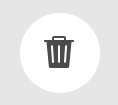

# Modelos de fragmentos do conteúdo {#content-fragment-models}

Modelos de fragmentos do conteúdo no AEM definem a estrutura do conteúdo para o [fragmentos de conteúdo,](/help/assets/content-fragments/content-fragments.md) servir como base do seu conteúdo sem periféricos.

Para usar os Modelos de fragmento do conteúdo, você pode:

1. [Ativar a funcionalidade do Modelo de fragmento de conteúdo para sua instância](/help/assets/content-fragments/content-fragments-configuration-browser.md)
1. [Criar](#creating-a-content-fragment-model)e [configure](#defining-your-content-fragment-model), os Modelos de fragmento de conteúdo
1. [Ativar os modelos de fragmento de conteúdo](#enabling-disabling-a-content-fragment-model) para uso ao criar Fragmentos de conteúdo para uso ao criar Fragmentos de conteúdo
1. [Permitir os modelos de fragmento de conteúdo nas pastas de Ativos necessárias](#allowing-content-fragment-models-assets-folder) ao configurar **Políticas**.

## Criação de um modelo de fragmento de conteúdo {#creating-a-content-fragment-model}

1. Navegar para **Ferramentas**, **Ativos**, depois abra **Modelos de fragmentos do conteúdo**.
1. Navegue até a pasta apropriada para sua [configuração](/help/assets/content-fragments/content-fragments-configuration-browser.md).
1. Use **Criar** para abrir o assistente.

   >[!CAUTION]
   >
   >Se o [uso de modelos de fragmento de conteúdo não foi habilitado](/help/assets/content-fragments/content-fragments-configuration-browser.md), a opção **Criar** não estará disponível.

1. Especifique o **título do modelo**. Você também pode adicionar **Tags**, a **Descrição** e selecione **Ativar modelo** para [habilitar o modelo](#enabling-disabling-a-content-fragment-model) se necessário.

   

1. Use **Criar** para salvar o modelo vazio. Uma mensagem indicará o sucesso da ação; você poderá selecionar **Abrir** para editar imediatamente o modelo, ou **Concluído** para retornar ao console.

## Definição do modelo de fragmento de conteúdo {#defining-your-content-fragment-model}

O modelo de fragmento de conteúdo define efetivamente a estrutura dos fragmentos de conteúdo resultantes usando uma seleção de **[Tipos de dados](#data-types)**. Usando o editor de modelo, você pode adicionar instâncias dos tipos de dados e configurá-las para criar os campos necessários:

>[!CAUTION]
>
>A edição de um modelo de fragmento de conteúdo existente pode afetar fragmentos dependentes.

1. Navegar para **Ferramentas**, **Ativos**, depois abra **Modelos de fragmentos do conteúdo**.

1. Navegue até a pasta que contém o modelo de fragmento de conteúdo.
1. Abra o modelo necessário para **Editar**; use a ação rápida ou selecione o modelo e depois a ação na barra de ferramentas.

   Uma vez aberto, o editor de modelo mostra:

   * esquerda: campos já definidos
   * direito: **Tipos de dados** disponíveis para criar campos (e **Propriedades** para uso depois que os campos forem criados)

   >[!NOTE]
   >
   >Quando um campo é **Obrigatório**, o **Rótulo** indicado no painel à esquerda é marcado com um asterisco (*****).


1. **Para adicionar um campo**

   * Arraste um tipo de dados necessário para o local necessário para um campo:

      

   * Depois que um campo é adicionado ao modelo, o painel direito mostrará a variável **Propriedades** que pode ser definido para esse tipo de dados específico. Aqui, é possível definir o que é necessário para esse campo.

      * Muitas propriedades são autoexplicativas, para obter mais detalhes, consulte [Propriedades](#properties).
      * Digitar um **Rótulo do campo** O preencherá automaticamente o **Nome da propriedade**  - se estiver vazio e puder ser atualizado manualmente posteriormente.

         >[!CAUTION]
         Ao atualizar manualmente a propriedade **Nome da propriedade** para um tipo de dados, observe que os nomes devem conter somente caracteres latinos, dígitos numéricos e sublinhado &quot;_&quot; como caractere especial.
         Se os modelos criados em versões anteriores do AEM contiverem caracteres ilegais, remova ou atualize esses caracteres.
      Por exemplo:

      


1. **Para remover um campo**

   Selecione o campo desejado e clique/toque no ícone da lixeira. Você receberá uma solicitação para confirmar a ação.

   

1. Adicione todos os campos obrigatórios e defina as propriedades relacionadas, conforme necessário. Por exemplo:

   

1. Selecionar **Salvar** para manter a definição.

## Tipos de dados {#data-types}

Uma seleção de tipos de dados está disponível para definir seu modelo:

* **Texto em linha única**
   * Adicione um ou mais campos de uma única linha de texto; o comprimento máximo pode ser definido
* **Texto multilinha**
   * Uma área de texto que pode ser Rich Text, Plain Text ou Markdown
* **Número**
   * Adicionar um ou mais campos numéricos
* **Booleano**
   * Adicionar uma caixa de seleção booleana
* **Data e hora**
   * Adicionar uma data e/ou hora
* **Enumeração**
   * Adicionar um conjunto de caixas de seleção, botões de opção ou campos suspensos
* **Tags**
   * Permite que os autores de fragmentos acessem e selecionem áreas de tags
* **Referência de conteúdo**
   * Referências a outros conteúdos, de qualquer tipo; pode ser usada para [criar conteúdo aninhado](#using-references-to-form-nested-content)
   * Se uma imagem for referenciada, você pode optar por mostrar uma miniatura
* **Referência do fragmento**
   * Faz referência a outros fragmentos de conteúdo; pode ser usada para [criar conteúdo aninhado](#using-references-to-form-nested-content)
   * O tipo de dados pode ser configurado para permitir que os autores de fragmento:
      * Edite o fragmento referenciado diretamente.
      * Crie um novo fragmento de conteúdo, com base no modelo apropriado
* **Objeto JSON**
   * Permite que o autor do fragmento de conteúdo insira a sintaxe JSON nos elementos correspondentes de um fragmento.
      * Para permitir que AEM armazene JSON direto que você tenha copiado/colado de outro serviço.
      * O JSON será transmitido e emitido como JSON no GraphQL.
      * Inclui o realce da sintaxe JSON, o preenchimento automático e o realce de erros no editor de fragmentos de conteúdo.
* **Espaço reservado da guia**
   * Permite a introdução de guias para uso ao editar o conteúdo do Fragmento de conteúdo.
Isso será mostrado como um divisor no editor de modelo, separando seções da lista de tipos de dados de conteúdo. Cada instância representa o início de uma nova guia.
No editor de fragmentos, cada instância será exibida como uma guia.

      >[!NOTE]
      Esse tipo de dados é usado apenas para formatação e é ignorado pelo esquema GraphQL AEM.

## Propriedades {#properties}

Muitas propriedades são autoexplicativas, para certas propriedades os detalhes adicionais são os seguintes:

* **Nome da Propriedade**

   Ao atualizar manualmente essa propriedade para um tipo de dados, observe que os nomes **must** contain *only* Caracteres latinos, dígitos numéricos e sublinhado &quot;_&quot; como caractere especial.

   >[!CAUTION]
   Se os modelos criados em versões anteriores do AEM contiverem caracteres ilegais, remova ou atualize esses caracteres.

* **Renderizar como**
As várias opções para realizar/renderizar o campo em um fragmento. Geralmente, isso permite definir se o autor verá uma única instância do campo ou poderá criar várias instâncias.

* **Rótulo do campo**
Inserir um 
**Rótulo do campo** gerará automaticamente uma **Nome da propriedade**, que pode ser atualizado manualmente se necessário.

* **Validação**
A validação básica está disponível por mecanismos como o **Obrigatório** propriedade. Alguns tipos de dados têm campos de validação de adição. Consulte [Validação](#validation) para obter mais detalhes.

* No tipo de dados **Texto de várias linhas**, é possível definir o **Tipo padrão** como:

   * **Texto formatado**
   * **Markdown**
   * **Texto sem formatação**

   Se não especificado, o valor padrão **Texto formatado** é usada para esse campo.

   Alterar o **Tipo padrão** em um modelo de fragmento de conteúdo só terá efeito em um fragmento de conteúdo existente relacionado depois que esse fragmento for aberto no editor e salvo.

* **Exclusivo**
O conteúdo (para o campo específico) deve ser exclusivo em todos os fragmentos de conteúdo criados a partir do modelo atual.

   Isso é usado para garantir que os autores de conteúdo não possam repetir o conteúdo já adicionado em outro fragmento do mesmo modelo.

   Por exemplo, um **Texto de linha única** campo chamado `Country` no Modelo de fragmento de conteúdo não pode ter o valor `Japan` em dois Fragmentos de conteúdo dependentes. Um aviso será emitido quando a segunda instância for tentada.

   >[!NOTE]
   A exclusividade é assegurada por raiz de idioma.

   >[!NOTE]
   As variações podem ter o mesmo *único* como variações do mesmo fragmento, mas não o mesmo valor usado em qualquer variação de outros fragmentos.

* Consulte **[Referência de conteúdo](#content-reference)** para obter mais detalhes sobre esse tipo de dados específico e suas propriedades.

* Consulte **[Referência de fragmento (Fragmentos aninhados)](#fragment-reference-nested-fragments)** para obter mais detalhes sobre esse tipo de dados específico e suas propriedades.

* **Traduzível**

   >[!NOTE]
   Esse recurso está disponível no canal de pré-lançamento.
   Consulte a [Documentação do Canal de pré-lançamento](https://experienceleague.adobe.com/docs/experience-manager-cloud-service/content/release-notes/prerelease.html#enable-prerelease) para obter informações sobre como habilitar o recurso para seu ambiente.

   Verificar o **Traduzível** caixa de seleção em um campo no editor do Modelo de fragmento de conteúdo :

   * Verifique se o nome da propriedade do campo foi adicionado à configuração de tradução, contexto `/content/dam/<sites-configuration>`, se ainda não estiver presente.
   * Para GraphQL: defina um `<translatable>` no campo Fragmento de conteúdo para `yes`, para permitir o filtro de consulta GraphQL para saída JSON com somente conteúdo traduzível.

## Validação {#validation}

Vários tipos de dados agora incluem a possibilidade de definir requisitos de validação para quando o conteúdo é inserido no fragmento resultante:

* **Texto em linha única**
   * Compare com um regex predefinido.
* **Número**
   * Verifique valores específicos.
* **Referência de conteúdo**
   * Teste tipos específicos de conteúdo.
   * Somente ativos de tamanho de arquivo especificado ou menor podem ser referenciados.
   * Somente imagens dentro de um intervalo predefinido de largura e/ou altura (em pixels) podem ser referenciadas.
* **Referência do fragmento**
   * Teste um modelo de fragmento de conteúdo específico.

## Usar referências para formar conteúdo aninhado {#using-references-to-form-nested-content}

Os Fragmentos de conteúdo podem formar conteúdo aninhado, usando um dos seguintes tipos de dados:

* **[Referência de conteúdo](#content-reference)**
   * Fornece uma referência simples a outro conteúdo; de qualquer tipo.
   * Pode ser configurado para uma ou várias referências (no fragmento resultante).

* **[Referência do fragmento](#fragment-reference-nested-fragments)** (Fragmentos aninhados)
   * Faz referência a outros fragmentos, dependendo dos modelos específicos especificados.
   * Permite incluir/recuperar dados estruturados.

      >[!NOTE]
      Este método tem um interesse especial em conjunção com [Entrega de conteúdo sem cabeçalho usando Fragmentos de conteúdo com GraphQL](/help/assets/content-fragments/content-fragments-graphql.md).
   * Pode ser configurado para uma ou várias referências (no fragmento resultante).

>[!NOTE]
AEM tem proteção de recorrência para:
* Referências de conteúdo Isso impede que o usuário adicione uma referência ao fragmento atual. Isso pode levar a uma caixa de diálogo vazia do seletor de referência de fragmento.
* Referências de fragmento em GraphQL Se você criar uma consulta profunda que retorne vários Fragmentos de conteúdo referenciados uns pelos outros, ela retornará um valor nulo na primeira ocorrência.


### Referência de conteúdo {#content-reference}

A Referência de conteúdo permite renderizar o conteúdo de outra fonte; por exemplo, imagem ou fragmento de conteúdo.

Além das propriedades padrão, você pode especificar:

* O **Caminho raiz** para qualquer conteúdo referenciado
* Os tipos de conteúdo que podem ser referenciados
* Limitações para tamanhos de arquivo
* Se uma imagem for referenciada:
   * Mostrar miniatura
   * Sistemas de retenção de imagens em altura e largura


### Referência de fragmento (Fragmentos aninhados) {#fragment-reference-nested-fragments}

A Referência do fragmento faz referência a um ou mais fragmentos de conteúdo. Esse recurso de especial interesse ao recuperar conteúdo para uso no aplicativo, pois permite recuperar dados estruturados com várias camadas.

Por exemplo:

* Um modelo que define os detalhes de um funcionário; estes incluem:
   * Uma referência ao modelo que define o empregador (empresa)

```xml
type EmployeeModel {
    name: String
    firstName: String
    company: CompanyModel
}

type CompanyModel {
    name: String
    street: String
    city: String
}
```

>[!NOTE]
Este aspecto reveste-se de especial interesse em conjugação com [Entrega de conteúdo sem cabeçalho usando Fragmentos de conteúdo com GraphQL](/help/assets/content-fragments/content-fragments-graphql.md).

Além das propriedades padrão, você pode definir:

* **Renderizar como**:

   * **multifield** - o autor do fragmento pode criar várias referências, individuais

   * **fragmentreference** - permite que o autor do fragmento selecione uma única referência a um fragmento

* **Tipo de modelo**
Vários modelos podem ser selecionados. Ao criar o Fragmento de conteúdo, qualquer fragmento referenciado deve ter sido criado usando esses modelos.

* **Caminho raiz**
Especifica um caminho raiz para qualquer fragmento referenciado.

* **Permitir criação de fragmentos**

   Isso permitirá que o autor do fragmento crie um novo fragmento com base no modelo apropriado.

   * **fragmentreferencecomposite** - permite que o autor do fragmento crie um composto selecionando vários fragmentos

   

>[!NOTE]
Está em vigor um mecanismo de proteção contra as recorrências. Ela proíbe que o usuário selecione o Fragmento de conteúdo atual na Referência de fragmento. Isso pode levar a uma caixa de diálogo vazia do seletor de referência de fragmento.
Também há uma proteção de recorrência para Referências de fragmento em GraphQL. Se você criar uma consulta profunda em dois Fragmentos de conteúdo que fazem referência um ao outro, ela retornará um valor nulo.

## Modelo de fragmento de conteúdo - Propriedades {#content-fragment-model-properties}

Você pode editar o **Propriedades** de um modelo de fragmento de conteúdo:

* **Básico**
   * **Título do modelo**
   * **Tags**
   * **Descrição**
   * **Carregar imagem**

## Ativar ou desativar um modelo de fragmento de conteúdo {#enabling-disabling-a-content-fragment-model}

Para ter controle total sobre o uso dos Modelos de fragmento de conteúdo, eles têm um status que pode ser definido.

### Ativar um modelo de fragmento de conteúdo {#enabling-a-content-fragment-model}

Depois que um modelo é criado, ele precisa ser ativado para que ele:

* Está disponível para seleção ao criar um novo Fragmento do conteúdo.
* Pode ser referenciado a partir de um Modelo de fragmento de conteúdo.
* Está disponível para GraphQL; assim, o schema é gerado.

Para ativar um Modelo que esteja sinalizado como:

* **Rascunho** : mw (nunca habilitado).
* **Desabilitado** : foi especificamente desativado.

Você usa a variável **Habilitar** de:

* A barra de ferramentas superior, quando o Modelo necessário estiver selecionado.
* A Ação rápida correspondente (passe o mouse sobre o Modelo necessário).


### Desabilitação de um modelo de fragmento de conteúdo {#disabling-a-content-fragment-model}

Um modelo também pode ser desativado para que:

* O modelo não está mais disponível como base para a criação *novo* Fragmentos de conteúdo.
* No entanto:
   * O esquema GraphQL continua sendo gerado e ainda pode ser consultado (para evitar impacto na API JSON).
   * Todos os Fragmentos de conteúdo baseados no modelo ainda podem ser consultados e retornados do ponto de extremidade GraphQL.
* O modelo não pode mais ser referenciado, mas as referências existentes são mantidas intocadas e ainda podem ser consultadas e retornadas do ponto de extremidade GraphQL.

Para desativar um Modelo que esteja sinalizado como **Ativado** você usa a variável **Desativar** de:

* A barra de ferramentas superior, quando o Modelo necessário estiver selecionado.
* A Ação rápida correspondente (passe o mouse sobre o Modelo necessário).


## Permitir modelos de fragmentos de conteúdo na pasta Ativos {#allowing-content-fragment-models-assets-folder}

Para implementar a governança de conteúdo, você pode configurar **Políticas** na pasta Ativos para controlar quais Modelos de fragmento de conteúdo são permitidos para a criação de Fragmento nessa pasta.

>[!NOTE]
O mecanismo é semelhante ao [como permitir modelos de página](/help/sites-cloud/authoring/features/templates.md#allowing-a-template-author) para uma página e seus filhos, nas propriedades avançadas de uma página.

Para configurar o **Políticas** para **Modelos permitidos de fragmento do conteúdo**:

1. Navegar e abrir **Propriedades** para a pasta Ativos necessária.

1. Abra o **Políticas** , onde é possível configurar:

   * **Herdado de`<folder>`**

      As políticas são automaticamente herdadas ao criar novas pastas secundárias; a política pode ser reconfigurada (e a herança quebrada) se as subpastas precisarem permitir modelos diferentes da pasta pai.

   * **Modelos de fragmento de conteúdo permitidos por caminho**

      Vários modelos podem ser permitidos.

   * **Modelos de fragmento de conteúdo permitidos por tag**

      Vários modelos podem ser permitidos.
   

1. **Salvar** quaisquer alterações.

Os Modelos de fragmento de conteúdo permitidos para uma pasta são resolvidos da seguinte maneira:
* O **Políticas** para **Modelos permitidos de fragmento do conteúdo**.
* Se estiver vazio, tente determinar a política usando as regras de herança.
* Se a cadeia de herança não fornecer um resultado, verifique a **Cloud Services** configuração dessa pasta (também diretamente e, em seguida, por herança).
* Se nenhuma das opções acima fornecer resultados, então não há modelos permitidos para essa pasta.

## Exclusão de um modelo de fragmento de conteúdo {#deleting-a-content-fragment-model}

>[!CAUTION]
A exclusão de um modelo de fragmento de conteúdo pode afetar fragmentos dependentes.

Para excluir um modelo de fragmento de conteúdo:

1. Navegar para **Ferramentas**, **Ativos**, depois abra **Modelos de fragmentos do conteúdo**.

1. Navegue até a pasta que contém o modelo de fragmento de conteúdo.
1. Selecione seu modelo, seguido por **Excluir** na barra de ferramentas.

   >[!NOTE]
   Se o modelo for referenciado, um aviso será dado. Agir adequadamente.

## Publicação de um modelo de fragmento de conteúdo {#publishing-a-content-fragment-model}

Os modelos de fragmento de conteúdo precisam ser publicados quando/antes de qualquer fragmento de conteúdo dependente ser publicado.

Para publicar um modelo de fragmento de conteúdo:

1. Navegar para **Ferramentas**, **Ativos**, depois abra **Modelos de fragmentos do conteúdo**.

1. Navegue até a pasta que contém o modelo de fragmento de conteúdo.
1. Selecione seu modelo, seguido por **Publicar** na barra de ferramentas.
O status publicado será indicado no console.

   >[!NOTE]
   Se você publicar um fragmento de conteúdo para o qual o modelo ainda não foi publicado, uma lista de seleção indicará isso e o modelo será publicado com o fragmento.

## Desfazer a publicação de um modelo de fragmento de conteúdo {#unpublishing-a-content-fragment-model}

Os modelos de fragmento de conteúdo podem ter a publicação cancelada se não estiverem referenciados por nenhum fragmento.

Para cancelar a publicação de um modelo de fragmento de conteúdo:

1. Navegar para **Ferramentas**, **Ativos**, depois abra **Modelos de fragmentos do conteúdo**.

1. Navegue até a pasta que contém o modelo de fragmento de conteúdo.
1. Selecione seu modelo, seguido por **Cancelar publicação** na barra de ferramentas.
O status publicado será indicado no console.

Se você tentar desfazer a publicação de um modelo que é usado atualmente por um ou mais fragmentos, um aviso de erro informará você sobre:


A mensagem sugerirá que você verifique a [Referências](/help/sites-cloud/authoring/getting-started/basic-handling.md#references) painel para investigar mais detalhadamente:


## Modelos de fragmentos de conteúdo bloqueados (publicados) {#locked-published-content-fragment-models}

Esse recurso fornece o controle dos Modelos de fragmento de conteúdo que foram publicados.

### O desafio {#the-challenge}

* Os Modelos de fragmento de conteúdo determinam o esquema para consultas GraphQL em AEM.

   * AEM esquemas GraphQL são criados assim que um Modelo de fragmento de conteúdo é criado e podem existir em ambientes do autor e de publicação.

   * Os esquemas em publicação são os mais críticos, pois fornecem a base para a entrega ao vivo do conteúdo do Fragmento de conteúdo no formato JSON.

* Problemas podem ocorrer quando os Modelos de fragmento de conteúdo são modificados ou, em outras palavras, editados. Isso significa que o esquema é alterado, o que, por sua vez, pode afetar as consultas GraphQL existentes.

* A adição de novos campos a um Modelo de fragmento de conteúdo (normalmente) não deve ter efeitos prejudiciais. No entanto, a modificação de campos de dados existentes (por exemplo, seu nome) ou a exclusão de definições de campos quebrará as consultas GraphQL existentes ao solicitar esses campos.

### Os requisitos {#the-requirements}

* Para conscientizar os usuários sobre os riscos ao editar modelos que já são usados para a entrega de conteúdo ao vivo - em outras palavras, modelos que foram publicados).

* Além disso, para evitar alterações não intencionais.

Qualquer uma dessas opções pode interromper consultas se os modelos modificados forem publicados novamente.

### A solução {#the-solution}

Para solucionar esses problemas, os Modelos de fragmento de conteúdo são *bloqueado* em um modo SOMENTE LEITURA no autor - assim que forem publicados. Isso é indicado por **Bloqueado**:


Quando o modelo é **Bloqueado** (no modo SOMENTE LEITURA ), é possível visualizar o conteúdo e a estrutura dos modelos, mas não pode editá-los.

Você pode gerenciar **Bloqueado** modelos do console ou do editor de modelo:

* Console

   No console, é possível gerenciar o modo SOMENTE LEITURA com o **Desbloquear** e **Bloquear** na barra de ferramentas:

   

   * Você pode **Desbloquear** um modelo para ativar as edições.

      Se você selecionar **Desbloquear** um aviso será exibido e você deverá confirmar a variável **Desbloquear** ação:
      

      Em seguida, você pode abrir o modelo para edição.

   * Você também pode **Bloquear** o modelo depois.
   * A republicação do modelo imediatamente o colocará de volta **Bloqueado** Modo (SOMENTE LEITURA).

* Editor de modelo

   * Ao abrir um modelo bloqueado, você será avisado e terá três ações: **Cancelar**, **Exibir somente leitura**, **Editar**:

      

   * Se você selecionar **Exibir somente leitura** é possível ver o conteúdo e a estrutura do modelo:

      

   * Se você selecionar **Editar** você pode editar e salvar suas atualizações:

      

      >[!NOTE]
      Ainda pode haver um aviso na parte superior, mas é quando o modelo já está em uso pelos Fragmentos de conteúdo existentes.

   * **Cancelar** retornará ao console.
