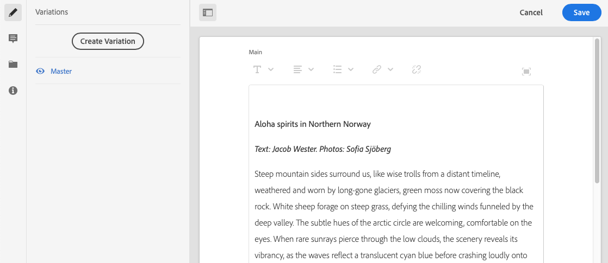

# Variações - Criação de conteúdo do fragmento{#variations-authoring-fragment-content}

[As variações](/help/assets/content-fragments/content-fragments.md#constituent-parts-of-a-content-fragment) são um recurso significativo de fragmentos de conteúdo, pois permitem criar e editar cópias do conteúdo mestre para uso em canais específicos e/ou cenários.

Na guia **Variações** , é possível:

* [Insira o conteúdo](#authoring-your-content) do fragmento
* [Criar e gerenciar variações](#managing-variations) do conteúdo **mestre**

Executar várias outras ações, dependendo do tipo de dados que está sendo editado; por exemplo:

* [Inserir ativos visuais no fragmento](#inserting-assets-into-your-fragment) (imagens)

* Selecione entre [Rich Text](#rich-text), [Plain Text](#plain-text) e [Markdown](#markdown) para edição

* [Fazer upload de conteúdo](#uploading-content)

* [Exibir estatísticas](#viewing-key-statistics) principais (sobre texto de várias linhas)

* [Resumir texto](#summarizing-text)

* [Sincronizar variações com conteúdo mestre](#synchronizing-with-master)

>[!CAUTION]
>
>Após a publicação e/ou referência de um fragmento, o AEM exibirá um aviso quando um autor abrir o fragmento para edição novamente. Isso serve para avisar que as alterações no fragmento também afetarão as páginas referenciadas.

## Criação de seu conteúdo {#authoring-your-content}

Quando você abre seu fragmento de conteúdo para edição, a guia **Variações** será aberta por padrão. Aqui você pode criar o conteúdo, para Mestre ou quaisquer variações que tenha. É possível:

* faça edições diretamente na guia **Variações**
* abra o editor [de tela](#full-screen-editor) cheia para:

   * selecione o [Formato](#formats)
   * consulte mais opções de edição (para o formato [Rich Text](#rich-text) )

   * acessar uma variedade de [ações](#actions)

Por exemplo:

* Editar um fragmento simples

   Um fragmento simples consiste em um campo de texto de várias linhas (ativos visuais podem ser adicionados pelo editor de tela cheia).

   

* Editar um fragmento com conteúdo estruturado

   Um fragmento estruturado contém vários campos, de vários tipos de dados, que foram definidos no modelo de conteúdo. Para qualquer campo de várias linhas, o editor [de tela](#full-screen-editor) cheia está disponível.

   

### Editor de tela cheia {#full-screen-editor}

Ao editar um campo de texto de várias linhas, você pode abrir o editor de tela cheia; toque ou clique no texto real e selecione o seguinte ícone de ação:

O editor de tela cheia fornece:

* Acesso a várias [ações](#actions)
* Dependendo do [formato](#formats), opções adicionais de formatação ([Rich Text](#rich-text))

### Ações {#actions}

As seguintes ações também estão disponíveis (para todos os [formatos](#formats)) quando o editor de tela cheia (ou seja, texto de várias linhas) está aberto:

* Selecione o [formato](#formats) ([Rich Text](#rich-text), [Plain Text,](#plain-text) [Markdown](#markdown))

* [Carregar conteúdo](#uploading-content)

* [Anotar](/help/assets/content-fragments/content-fragments-variations.md#annotating-a-content-fragment) seu texto

* [Inserir ativos visuais no fragmento](#inserting-assets-into-your-fragment) (imagens)

* [Mostrar estatísticas de texto](#viewing-key-statistics)

* [Sincronizar com Mestre](#synchronizing-with-master) (ao editar uma variação)

* [Resumir texto](#summarizing-text)

### Formatos {#formats}

As opções para editar texto de várias linhas dependem do formato selecionado:

* [Texto formatado](#rich-text)
* [Texto sem formatação](#plain-text)
* [Markdown](#markdown)

O formato pode ser selecionado no editor de tela cheia.

### Texto formatado {#rich-text}

A edição de rich text permite formatar:

* Negrito
* Itálico
* Sublinhado
* Alinhamento: esquerda, centro, direita
* Lista com marcadores
* Lista numerada
* Recuo: aumento, diminuição
* Criar/quebrar hiperlinks
* Abra o editor de tela cheia, onde as seguintes opções de formatação estão disponíveis:

   * Colar texto/do Word
   * Inserir uma tabela
   * Estilo do parágrafo: Parágrafo, Título 1/2/3
   * [Inserir ativos visuais](#inserting-assets-into-your-fragment)
   * Pesquisar
   * Localizar/substituir
   * Verificador ortográfico
   * [Anotações](/help/assets/content-fragments/content-fragments-variations.md#annotating-a-content-fragment)

As [ações](#actions) também podem ser acessadas pelo editor de tela cheia.

### Texto sem formatação {#plain-text}

Texto simples permite a entrada rápida de conteúdo sem formatação ou informações de marcação. Você também pode abrir o editor de tela cheia para obter mais [ações](#actions).

>[!CAUTION]
>
>Se você selecionar Texto **** simples, poderá perder qualquer formatação, marcação e/ou ativos inseridos em **Rich Text** ou **Markdown**.

### Markdown {#markdown}

>[!NOTE]
>
>Para obter informações completas, consulte a documentação de [Markdown](/help/assets/content-fragments/content-fragments-markdown.md) .

Isso permite que você formate o texto usando a marcação. Você pode definir:

* Cabeçalhos
* Quebras de parágrafos e linhas
* Links
* Imagens
* Bloquear aspas
* Listas
* Ênfase
* Blocos de código
* Escapas de barra invertida

Você também pode abrir o editor de tela cheia para obter mais [ações](#actions).

>[!CAUTION]
>
>Se você alternar entre **Rich Text** e **Markdown** , você poderá sentir efeitos inesperados com Cotas em Bloco e Blocos de Código, já que esses dois formatos podem ter diferenças na maneira como são tratados.

### Exibindo Estatísticas-Chave {#viewing-key-statistics}

Quando o editor de tela cheia estiver aberto, a ação Estatísticas **de** texto exibirá uma variedade de informações sobre o texto.

Por exemplo:

### Carregar conteúdo {#uploading-content}

Para facilitar o processo de criação de fragmentos de conteúdo, é possível carregar texto, preparado em um editor externo e adicioná-lo diretamente ao fragmento.

### Resumo de texto {#summarizing-text}

O texto de resumo foi projetado para ajudar os usuários a reduzir o comprimento do texto para um número predefinido de palavras, mantendo os pontos principais e o significado geral.

>[!NOTE]
>
>A um nível mais técnico, o sistema mantém as frases que classifica como proporcionando a *melhor relação de densidade e exclusividade* da informação, de acordo com algoritmos específicos.

>[!CAUTION]
>
>O fragmento de conteúdo deve ter uma pasta de idioma válida (Código ISO) como ancestral; isso é usado para determinar o modelo de idioma a ser usado.
>
>Por exemplo, `en/` como no seguinte caminho:
>
>  `/content/dam/my-brand/en/path-down/my-content-fragment`

>[!CAUTION]
O inglês está disponível prontamente.
Outros idiomas estão disponíveis como Pacotes de modelo de idioma no Compartilhamento de pacotes:
* [Francês (França)](https://www.adobeaemcloud.com/content/marketplace/marketplaceProxy.html?packagePath=/content/companies/public/adobe/packages/cq630/product/smartcontent-model-fr)
* [Alemão (Alemanha)](https://www.adobeaemcloud.com/content/marketplace/marketplaceProxy.html?packagePath=/content/companies/public/adobe/packages/cq630/product/smartcontent-model-de)
* [Italiano (Itália)](https://www.adobeaemcloud.com/content/marketplace/marketplaceProxy.html?packagePath=/content/companies/public/adobe/packages/cq630/product/smartcontent-model-it)
* [Espanhol (Espanha)](https://www.adobeaemcloud.com/content/marketplace/marketplaceProxy.html?packagePath=/content/companies/public/adobe/packages/cq630/product/smartcontent-model-es)

1. Selecione **Mestre** ou a variação necessária.
2. Abra o editor de tela cheia.

3. Selecione **Resumir texto** na barra de ferramentas.

   

4. Especifique o número alvo de palavras e selecione **Iniciar**:
5. O texto original é exibido lado a lado com a sumariação proposta:

   * Todas as frases a serem eliminadas são destacadas em vermelho, com greve.
   * Clique em qualquer frase destacada para mantê-la no conteúdo resumido.
   * Clique em qualquer frase não realçada para eliminá-la.
   

6. Selecione **Resumir** para confirmar as alterações.

### Anotar em um fragmento de conteúdo {#annotating-a-content-fragment}

Para anotar um fragmento:

1. Selecione **Mestre** ou a variação necessária.
1. Abra o editor de tela cheia.
1. Selecione algum texto. O ícone **Anotar** fica disponível.

   

1. Uma caixa de diálogo abrirá. Aqui você pode inserir sua anotação.

1. Feche o editor de tela cheia e **Salve** o fragmento.

### Exibição, Edição, Exclusão de Anotações {#viewing-editing-deleting-annotations}

Anotações:

* São indicados pelo realce do texto, em tela cheia e no modo normal do editor. Os detalhes completos de uma anotação podem ser exibidos, editados e/ou excluídos clicando-se no texto realçado, que reabrirá a caixa de diálogo.

   >[!NOTE]
   Um seletor suspenso é fornecido se várias anotações tiverem sido aplicadas a uma parte do texto.

* Quando você exclui o texto inteiro ao qual a anotação foi aplicada, a anotação também é excluída.

* É possível listar e excluir selecionando a guia **Anotações** no editor de fragmentos.

   

* Pode ser exibido e excluído na [Linha do tempo](/help/assets/content-fragments/content-fragments-managing.md#timeline-for-content-fragments) do fragmento selecionado.

### Inserir ativos no fragmento {#inserting-assets-into-your-fragment}

Para facilitar o processo de criação de fragmentos de conteúdo, é possível adicionar [Ativos](/help/assets/manage-digital-assets.md) (imagens) diretamente ao fragmento.

Eles serão adicionados à sequência de parágrafo do fragmento sem qualquer formatação; a formatação pode ser feita quando o [fragmento é usado/referenciado em uma página](/help/sites-cloud/authoring/fundamentals/content-fragments.md).

>[!CAUTION]
Esses ativos não podem ser movidos ou excluídos em uma página de referência, isso deve ser feito no editor de fragmentos.
No entanto, a formatação do ativo (por exemplo, tamanho) deve ser feita no editor [de](/help/sites-cloud/authoring/fundamentals/content-fragments.md)páginas. A representação do ativo no editor de fragmentos é meramente para criação do fluxo de conteúdo.

>[!NOTE]
There are various methods of adding [images](/help/assets/content-fragments/content-fragments.md#fragments-with-visual-assets) to the fragment and/or page.

1. Posicione o cursor na posição que deseja adicionar a imagem.
2. Use o ícone **Inserir ativo** para abrir a caixa de diálogo de pesquisa.

   

3. Na caixa de diálogo, é possível:

   * navegue até o ativo necessário no DAM
   * procurar o ativo no DAM
   Depois de localizado, selecione o ativo desejado clicando na miniatura.

4. Use **Selecionar** para adicionar o ativo ao sistema de parágrafo do fragmento de conteúdo no local atual.

   >[!CAUTION]
   Se, após adicionar um ativo, você alterar o formato para:
   * **Texto** simples: o ativo será completamente perdido do fragmento.
   * **Marcação**: o ativo não estará visível, mas ainda estará lá quando você retornar para Texto **rico**.

## Gerenciamento de variações {#managing-variations}

### Criação de uma variação {#creating-a-variation}

As variações permitem que você pegue o conteúdo **mestre** e varie de acordo com a finalidade (se necessário).

Para criar uma nova variação:

1. Abra o fragmento e verifique se o painel lateral está visível.
1. Selecione **Variações** na barra de ícones no painel lateral.
1. Selecione **Criar variação**.
1. Uma caixa de diálogo será aberta, especifique o **Título** e a **Descrição** para a nova variação.
1. Selecione **Adicionar**; o fragmento **Mestre** será copiado para a nova variação, que agora está aberta para [edição](#editing-a-variation).

   >[!NOTE]
   Ao criar uma nova variação, é sempre o **Mestre** que é copiado, não a variação que está aberta no momento.

### Edição de uma variação {#editing-a-variation}

É possível fazer alterações no conteúdo de variação após:

* [Criando sua variação](#creating-a-variation).
* Abrindo um fragmento existente e selecionando a variação necessária no painel lateral.

### Renomeação de uma variação {#renaming-a-variation}

Para renomear uma variação existente:

1. Abra o fragmento e selecione **Variações** no painel lateral.
1. Selecione a variação necessária.
1. Selecione **Renomear** no menu suspenso **Ações** .

1. Digite o novo **Título** e/ou **Descrição** na caixa de diálogo resultante.

1. Confirme a ação **Renomear** .

>[!NOTE]
Isso só afeta a variação **Título**.

### Excluindo uma variação {#deleting-a-variation}

Para excluir uma variação existente:

1. Abra o fragmento e selecione **Variações** no painel lateral.
1. Selecione a variação necessária.
1. Selecione **Excluir** no menu suspenso **Ações** .

1. Confirme a ação **Excluir** na caixa de diálogo.

>[!NOTE]
Não é possível excluir o **Master**.

### Sincronizar com o Mestre {#synchronizing-with-master}

**Master** é parte integrante de um fragmento de conteúdo e, por definição, contém a cópia mestre do conteúdo, enquanto as variações contêm as versões individuais atualizadas e personalizadas desse conteúdo. Quando o Master é atualizado, é possível que essas alterações também sejam relevantes para as variações e, portanto, precisem ser propagadas para elas.

Ao editar uma variação, você tem acesso à ação para sincronizar o elemento atual da variação com Mestre. Isso permite que você copie automaticamente as alterações feitas no Mestre para a variação necessária.

>[!CAUTION]
A sincronização só está disponível para copiar alterações *do **Master**para a variação*.
Somente o elemento atual da variação será sincronizado.
A sincronização só funciona no tipo de dados de texto **** de várias linhas.
A transferência *de alterações de uma variação para **Mestre ***não está disponível como uma opção.

1. Abra o fragmento do conteúdo no editor de fragmentos. Certifique-se de que o **Mestre** foi editado.
1. Selecione uma variação específica e, em seguida, a ação de sincronização apropriada de:

   * o seletor suspenso **Ações** - **Sincronizar o elemento atual com o mestre**

   * a barra de ferramentas do editor de tela cheia - **Sincronizar com o mestre**

1. O capitão e a variação serão apresentados lado a lado:

   * verde indica o conteúdo adicionado (à variação)
   * vermelho indica o conteúdo removido (da variação)
   * azul indica texto substituído
   

1. Selecione **Sincronizar**, a variação será atualizada e mostrada.
