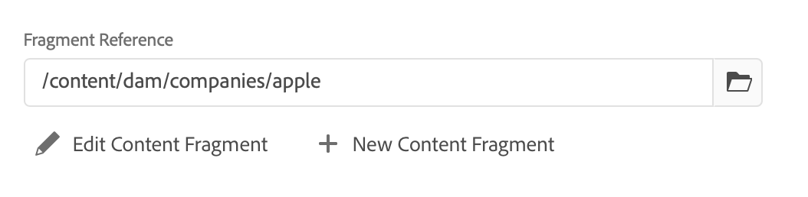

# Variações - Criação dos fragmentos de conteúdo{#variations-authoring-fragment-content}

[Variações](/help/assets/content-fragments/content-fragments.md#constituent-parts-of-a-content-fragment) são um recurso importante de fragmentos de conteúdo AEM, pois permitem criar e editar cópias do conteúdo principal para uso em canais e/ou cenários específicos, tornando a entrega de conteúdo sem cabeçalho ainda mais flexível.

No **Variações** é possível:

* [Insira o conteúdo](#authoring-your-content) para o fragmento,
* [Criar e gerenciar variações](#managing-variations) do **Principal** conteúdo,

Executar uma variedade de outras ações, dependendo do tipo de dados que está sendo editado; por exemplo:

* [Inserir ativos visuais no fragmento](#inserting-assets-into-your-fragment) (imagens)

* Selecionar entre [Texto formatado](#rich-text), [Texto sem formatação](#plain-text) e [Markdown](#markdown) para edição

* [Fazer upload de conteúdo](#uploading-content)

* [Exibir estatísticas da chave](#viewing-key-statistics) (sobre texto de várias linhas)

* [Resumir texto](#summarizing-text)

* [Sincronizar variações com conteúdo Principal](#synchronizing-with-master)

>[!CAUTION]
>
>Depois que um fragmento tiver sido publicado e/ou referenciado, AEM exibirá um aviso quando um autor abrir o fragmento para edição novamente. Isso serve para avisar que as alterações no fragmento também afetarão as páginas referenciadas.

## Criação de conteúdo {#authoring-your-content}

Ao abrir o fragmento de conteúdo para edição, a variável **Variações** será aberta por padrão. Aqui você pode criar o conteúdo, para Principais variações ou quaisquer variações que tenha. O fragmento estruturado contém vários campos, de vários tipos de dados, que foram definidos no modelo de conteúdo.

Por exemplo:

É possível:

* faça edições diretamente no **Variações** guia

   * cada tipo de dados fornece opções de edição diferentes

* para **Texto de várias linhas** campos que também podem ser abertos [editor de tela cheia](#full-screen-editor) para:

   * selecione o [Formato](#formats)
   * consulte mais opções de edição (para [Texto formatado](#rich-text) format)
   * acesse um intervalo de [ações](#actions)

* Para **Referência do fragmento** os campos **[Editar fragmento do conteúdo](#fragment-references-edit-content-fragment)** pode estar disponível, dependendo da definição do modelo.

### Editor de Tela cheia {#full-screen-editor}

Ao editar um campo de texto de várias linhas, você pode abrir o editor de tela cheia; toque ou clique no texto real e selecione o seguinte ícone de ação:

Isso abrirá o editor de texto em tela cheia:

O editor de texto em tela cheia fornece:

* Acesso a vários [ações](#actions)
* Dependendo do [format](#formats), opções adicionais de formatação ([Texto formatado](#rich-text))

### Ações {#actions}

As seguintes ações também estão disponíveis (para todas as [formatos](#formats)) quando o editor de tela cheia (ou seja, texto de várias linhas) estiver aberto:

* Selecione o [format](#formats) ([Texto formatado](#rich-text), [Texto simples,](#plain-text) [Markdown](#markdown))

* [Upload de conteúdo](#uploading-content)

* [Mostrar estatísticas de texto](#viewing-key-statistics)

* [Sincronizar com Principal](#synchronizing-with-master) (ao editar uma variação)

* [Resumir texto](#summarizing-text)

### Formatos {#formats}

As opções para editar texto de várias linhas dependem do formato selecionado:

* [Texto formatado](#rich-text)
* [Texto sem formatação](#plain-text)
* [Markdown](#markdown)

O formato pode ser selecionado no editor de tela cheia.

### Texto formatado {#rich-text}

A edição de rich text permite formatar:

* Negrito
* Itálico
* Sublinhado
* Alinhamento: esquerda, centro, direita
* Lista com marcadores
* Lista numerada
* Recuo: aumento, diminuição
* Criar/quebrar hiperlinks
* Colar texto/do Word
* Inserir uma tabela
* Estilo do parágrafo: Parágrafo, Cabeçalho 1/2/3
* [Inserir ativo](#inserting-assets-into-your-fragment)
* Abra o editor de tela cheia, onde as seguintes opções de formatação estão disponíveis:
   * Pesquisar
   * Localizar/substituir
   * Verificador Ortográfico
   * [Anotações](/help/assets/content-fragments/content-fragments-variations.md#annotating-a-content-fragment)
* [Inserir fragmento de conteúdo](#inserting-content-fragment-into-your-fragment); disponível quando a **Texto de várias linhas** é configurado com **Permitir referência de fragmento**.

O [ações](#actions) também podem ser acessadas pelo editor de tela cheia.

### Texto sem formatação {#plain-text}

Texto simples permite a entrada rápida de conteúdo sem formatação ou informações de marcação. Você também pode abrir o editor de tela cheia para obter mais informações [ações](#actions).

>[!CAUTION]
>
>Se selecionar **Texto simples**, poderá perder qualquer formatação, marcação e/ou ativos inseridos no **Rich Text** ou na **Marcação**.

### Markdown {#markdown}

>[!NOTE]
>
>Para obter informações completas, consulte [Markdown](/help/assets/content-fragments/content-fragments-markdown.md) documentação.

Isso permite que você formate o texto usando a marcação. Você pode definir:

* Cabeçalhos
* Parágrafos e quebras de linha
* Links
* Imagens
* Bloquear aspas
* Listas
* Ênfase
* Blocos de código
* Barra invertida - Escapes

Você também pode abrir o editor de tela cheia para obter mais informações [ações](#actions).

>[!CAUTION]
>
>Se você alternar entre **Rich Text** e **Marcação**, poderá ver efeitos inesperados com Cotas de bloqueio e Bloqueios de código, já que esses dois formatos podem ter diferenças na maneira como são tratados.

### Referências de fragmento {#fragment-references}

Se o Modelo do fragmento de conteúdo contiver Referências de fragmento, os autores do fragmento podem ter opções adicionais:

* [Editar fragmento de conteúdo](#fragment-references-edit-content-fragment)
* [Novo fragmento de conteúdo](#fragment-references-new-content-fragment)

#### Editar fragmento de conteúdo {#fragment-references-edit-content-fragment}

A opção **Editar fragmento do conteúdo** abrirá o fragmento em uma nova guia do editor (na mesma guia do navegador).

Selecionar a guia original novamente (por exemplo, **Little Pony Inc.**), fechará essa guia secundária (nesse caso, **Adam Smith**).

#### Novo fragmento de conteúdo {#fragment-references-new-content-fragment}

A opção **Novo fragmento de conteúdo** permitirá criar um fragmento totalmente novo. Para isso, uma variação do assistente para criar fragmento de conteúdo será aberta no editor.

É possível criar um novo fragmento ao:

1. Navegar para e selecionar a pasta desejada.
1. Selecionar **Próximo**.
1. Especificação de propriedades; por exemplo **Título**.
1. Selecionar **Criar**.
1. Finalmente:
   1. **Concluído** retornará (para o fragmento original) e referenciará o novo fragmento.
   1. **Abrir** referenciará o novo fragmento, bem como a abertura do novo fragmento, para edição, em uma nova guia do navegador.

### Exibindo Estatísticas-Chave {#viewing-key-statistics}

Quando o editor de tela cheia estiver aberto, a ação **Estatísticas de texto** exibirá uma variedade de informações sobre o texto.

Por exemplo:

### Upload de conteúdo {#uploading-content}

Para facilitar o processo de criação de fragmentos de conteúdo, é possível fazer upload de texto, preparado em um editor externo e adicioná-lo diretamente ao fragmento.

### Resumo de texto {#summarizing-text}

O resumo do texto foi projetado para ajudar os usuários a reduzir o comprimento do texto para um número predefinido de palavras, mantendo os pontos principais e o significado geral.

>[!NOTE]
>
>A um nível mais técnico, o sistema mantém as frases que classifica como fornecendo *melhor relação entre densidade e exclusividade das informações* de acordo com algoritmos específicos.

>[!CAUTION]
>
>O fragmento de conteúdo deve ter uma pasta de idioma válida (Código ISO) como ancestral; isso é usado para determinar o modelo de idioma a ser usado.
>
>Por exemplo, `en/` como no seguinte caminho:
>
>  `/content/dam/my-brand/en/path-down/my-content-fragment`

>[!CAUTION]
O inglês está disponível imediatamente.
Outros idiomas estão disponíveis como Pacotes de modelo de idioma na Distribuição de software:
* [Francês (França)](https://experience.adobe.com/#/downloads/content/software-distribution/en/aem.html?package=/content/software-distribution/en/details.html/content/dam/aem/public/adobe/packages/cq630/product/smartcontent-model-fr)
* [Alemão (Alemanha)](https://experience.adobe.com/#/downloads/content/software-distribution/en/aem.html?package=/content/software-distribution/en/details.html/content/dam/aem/public/adobe/packages/cq630/product/smartcontent-model-de)
* [Italiano (Itália)](https://experience.adobe.com/#/downloads/content/software-distribution/en/aem.html?package=/content/software-distribution/en/details.html/content/dam/aem/public/adobe/packages/cq630/product/smartcontent-model-it)
* [Espanhol (Espanha)](https://experience.adobe.com/#/downloads/content/software-distribution/en/aem.html?package=/content/software-distribution/en/details.html/content/dam/aem/public/adobe/packages/cq630/product/smartcontent-model-es)
>

1. Selecionar **Principal** ou a variação exigida.
1. Abra o editor de tela cheia.

1. Selecionar **Resumir texto** na barra de ferramentas.

   

1. Especifique o número de palavras-alvo e selecione **Iniciar**:
1. O texto original é apresentado lado a lado com o resumo proposto:

   * Qualquer frase a ser eliminada é destacada em vermelho, com greve.
   * Clique em qualquer frase destacada para mantê-la no conteúdo resumido.
   * Clique em qualquer frase não realçada para eliminá-la.

1. Selecionar **Resumir** para confirmar as alterações.

1. O texto original é apresentado lado a lado com o resumo proposto:

   * Qualquer frase a ser eliminada é destacada em vermelho, com greve.
   * Clique em qualquer frase destacada para mantê-la no conteúdo resumido.
   * Clique em qualquer frase não realçada para eliminá-la.
   * As estatísticas resumidas são apresentadas: **Real** e **Target**-
   * Você pode **Visualizar** as alterações.

   

### Anotar um fragmento de conteúdo {#annotating-a-content-fragment}

Para anotar um fragmento:

1. Selecionar **Principal** ou a variação exigida.

1. Abra o editor de tela cheia.

1. O **Anotar** está disponível na barra de ferramentas superior. Você pode selecionar algum texto, se necessário.

   

1. Uma caixa de diálogo abrirá. Aqui você pode inserir sua anotação.

   

1. Selecionar **Aplicar** na caixa de diálogo.

   

   Se a anotação tiver sido aplicada ao texto selecionado, esse texto permanecerá destacado.

   

1. Feche o editor de tela cheia, as anotações ainda são destacadas. Se selecionada, uma caixa de diálogo será aberta para que você possa editar a anotação ainda mais.

1. Selecione **Salvar**.

1. Feche o editor de tela cheia, as anotações ainda são destacadas. Se selecionada, uma caixa de diálogo será aberta para que você possa editar a anotação ainda mais.

   

### Visualização, edição, exclusão de anotações {#viewing-editing-deleting-annotations}

Anotações:

* São indicados pelo destaque no texto, no modo de tela cheia e no modo normal do editor. Detalhes completos de uma anotação podem ser exibidos, editados e/ou excluídos ao clicar no texto destacado, o que abrirá novamente a caixa de diálogo.

   >[!NOTE]
   Um seletor suspenso é fornecido se várias anotações tiverem sido aplicadas a um texto.

* Quando você exclui o texto inteiro ao qual a anotação foi aplicada, a anotação também é excluída.

* Pode ser listado e excluído, selecionando o **Anotações** no editor de fragmentos.

   

* Pode ser exibido e excluído em [Linha do tempo](/help/assets/content-fragments/content-fragments-managing.md#timeline-for-content-fragments) para o fragmento selecionado.

### Inserir ativos no fragmento {#inserting-assets-into-your-fragment}

Para facilitar o processo de criação de fragmentos de conteúdo, você pode adicionar [Ativos](/help/assets/manage-digital-assets.md) (imagens) diretamente no fragmento.

Eles serão adicionados à sequência de parágrafo do fragmento sem qualquer formatação; a formatação pode ser feita quando a variável [fragmento é usado/referenciado em uma página](/help/sites-cloud/authoring/fundamentals/content-fragments.md).

>[!CAUTION]
Esses ativos não podem ser movidos ou excluídos em uma página de referência. Isso deve ser feito no editor de fragmentos.
No entanto, a formatação do ativo (por exemplo, tamanho) deve ser feita na variável [editor de páginas](/help/sites-cloud/authoring/fundamentals/content-fragments.md). A representação do ativo no editor de fragmentos é meramente para criação do fluxo de conteúdo.

>[!NOTE]
Existem vários métodos de adição [imagens](/help/assets/content-fragments/content-fragments.md#fragments-with-visual-assets) ao fragmento e/ou página.

1. Posicione o cursor na posição que deseja adicionar a imagem.
1. Use o ícone **Inserir ativo** para abrir a caixa de diálogo de pesquisa.

   

1. Na caixa de diálogo, é possível:

   * navegue até o ativo necessário no DAM
   * pesquise o ativo no DAM

   Depois de localizado, selecione o ativo necessário clicando na miniatura.

1. Use **Selecionar** para adicionar o ativo ao sistema de parágrafo do fragmento de conteúdo no local atual.

   >[!CAUTION]
   Se, após adicionar um ativo, você alterar o formato para:
   * **Texto simples:** o ativo será completamente perdido do fragmento.
   * **Marcação**: o ativo não estará visível, mas ainda estará lá ao retornar para **Rich Text**.

### Inserir um fragmento de conteúdo no fragmento {#inserting-content-fragment-into-your-fragment}

Para facilitar o processo de criação de fragmentos de conteúdo, também é possível adicionar outro Fragmento de conteúdo ao fragmento.

Eles serão adicionados como referência, no local atual no fragmento.

>[!NOTE]
Essa opção está disponível quando seu **Texto de várias linhas** é configurado com **Permitir referência de fragmento**.

>[!CAUTION]
Esses ativos não podem ser movidos ou excluídos em uma página de referência. Isso deve ser feito no editor de fragmentos.
No entanto, a formatação do ativo (por exemplo, tamanho) deve ser feita na variável [editor de páginas](/help/sites-cloud/authoring/fundamentals/content-fragments.md). A representação do ativo no editor de fragmentos é meramente para criação do fluxo de conteúdo.

>[!NOTE]
Existem vários métodos de adição [imagens](/help/assets/content-fragments/content-fragments.md#fragments-with-visual-assets) ao fragmento e/ou página.

1. Posicione o cursor na posição que deseja adicionar o fragmento.
1. Use o **Inserir fragmento de conteúdo** para abrir a caixa de diálogo de pesquisa.

   

1. Na caixa de diálogo, é possível:

   * navegue até o fragmento necessário na pasta Ativos
   * pesquisar o fragmento

   Depois de localizado, selecione o fragmento necessário clicando na miniatura.

1. Use **Selecionar** para adicionar uma referência ao Fragmento de conteúdo selecionado ao seu fragmento de conteúdo atual (no local atual).

   >[!CAUTION]
   Se, após adicionar uma referência a outro fragmento, você alterar o formato para:
   * **Texto sem formatação**: a referência será totalmente perdida do fragmento.
   * **Markdown**: a referência permanecerá.

## Gerenciamento de variações {#managing-variations}

### Criação de uma variação {#creating-a-variation}

As variações permitem usar a variável **Principal** conteúdo e alterá-lo de acordo com a finalidade (se necessário).

Para criar uma nova variação:

1. Abra o fragmento e verifique se o painel lateral está visível.
1. Selecionar **Variações** na barra de ícones, no painel lateral.
1. Selecionar **Criar variação**.
1. Uma caixa de diálogo será aberta, especifique o **Título** e a **Descrição** da nova variação.
1. Selecione **Adicionar**; o fragmento **Mestre** será copiado para a nova variação, que agora está aberta para [edição](#editing-a-variation).

   >[!NOTE]
   Ao criar uma nova variação, é sempre **Principal** que é copiada, não a variação que está aberta no momento.

### Editar uma variação {#editing-a-variation}

Você pode fazer alterações no conteúdo de variação após:

* [Criação da variação](#creating-a-variation).
* Abrir um fragmento existente e, em seguida, selecionar a variação necessária no painel lateral.

### Renomear uma variação {#renaming-a-variation}

Para renomear uma variação existente:

1. Abra o fragmento e selecione **Variações** no painel lateral.
1. Selecione a variação necessária.
1. Selecionar **Renomear** do **Ações** menu suspenso.

1. Digite o novo **Título** e/ou **Descrição** na caixa de diálogo resultante.

1. Confirme o **Renomear** ação.

>[!NOTE]
Isso só afeta a variação **Título**.

### Excluindo uma Variação {#deleting-a-variation}

Para excluir uma variação existente:

1. Abra o fragmento e selecione **Variações** no painel lateral.
1. Selecione a variação necessária.
1. Selecionar **Excluir** do **Ações** menu suspenso.

1. Confirme o **Excluir** na caixa de diálogo.

>[!NOTE]
Não é possível excluir **Principal**.

### Sincronização com Principal {#synchronizing-with-master}

**Principal** é parte integral de um fragmento de conteúdo e, por definição, contém a cópia principal do conteúdo, enquanto as variações contêm as versões individuais atualizadas e personalizadas desse conteúdo. Quando o Principal é atualizado, é possível que essas alterações também sejam relevantes para as variações e, portanto, precisam ser propagadas para elas.

Ao editar uma variação, você tem acesso à ação para sincronizar o elemento atual da variação com o Principal. Isso permite copiar automaticamente as alterações feitas no Principal para a variação necessária.

>[!CAUTION]
A sincronização só está disponível para copiar alterações *do **Master**para a variação*.
Somente o elemento atual da variação será sincronizado.
A sincronização só funciona no tipo de dados **Texto de várias linhas**.
A transferência de alterações *de uma variação para **Mestre*** não está disponível como uma opção.

1. Abra o fragmento de conteúdo no editor de fragmentos. Certifique-se de que **Principal** foi editado.

1. Selecione uma variação específica e, em seguida, a ação de sincronização apropriada em:

   * o **Ações** seletor suspenso - **Sincronizar elemento atual com principal**

      

   * a barra de ferramentas do editor de tela cheia - **Sincronizar com principal**

      

1. Principal e a variação será mostrada lado a lado:

   * verde indica conteúdo adicionado (à variação)
   * vermelho indica conteúdo removido (da variação)
   * azul indica texto substituído

   

1. Selecionar **Sincronizar**, a variação será atualizada e mostrada.
