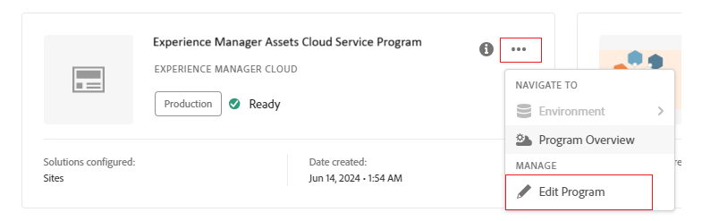
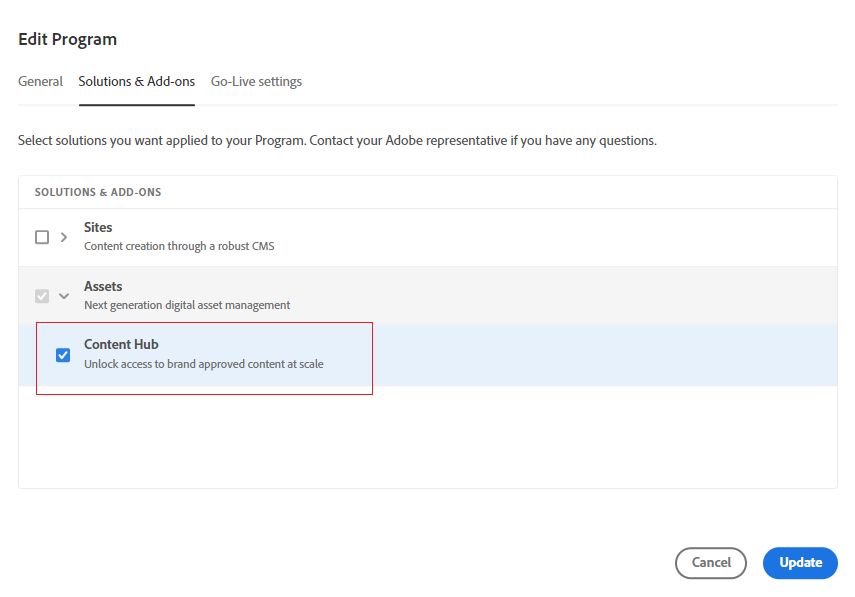
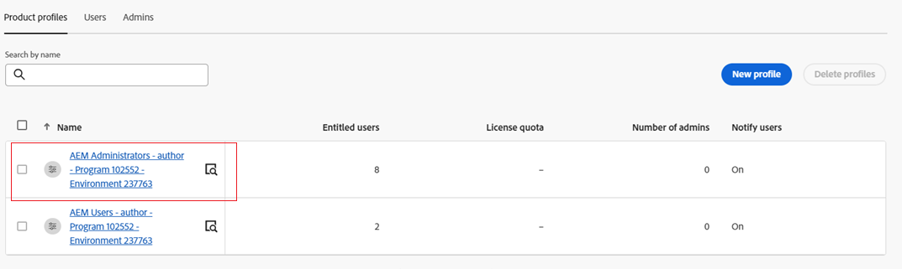

# Implantar o Centro de conteúdo {#deploy-content-hub}

O Content Hub está disponível como parte do Experience Manager Assets as a Cloud Service para democratizar o acesso a conteúdo sobre a marca para organizações e seus parceiros de negócios.

Os ativos marcados como Aprovado no Experience Manager Assets as a Cloud Service estão disponíveis para distribuição de ativos no Content Hub.

Este artigo fornece um fluxo de trabalho completo para fornecer aos usuários acesso ao Content Hub, incluindo as variações de privilégios com base em suas necessidades.

Assista a este vídeo para saber como ativar o Content Hub para Experience Manager Assets:

>[!VIDEO](https://video.tv.adobe.com/v/3472940/?captions=por_br&learn=on){transcript=true}

As variações de privilégios no Content Hub incluem:

* [Usuários do Content Hub](#onboard-content-hub-users): acessem ativos aprovados pela marca no portal do Content Hub.

* [Administradores do Content Hub](#onboard-content-hub-administrator): acesso à [Interface do Usuário de Configuração](/help/assets/configure-content-hub-ui-options.md) no Content Hub, além de acessar ativos aprovados pela marca, carregar ativos no Content Hub, integração com o Adobe Express para editar imagens (se você tiver direitos ao Adobe Express).

* [Usuários do Content Hub com direitos de adicionar ativos](#onboard-content-hub-users-add-assets): capacidade de [carregar ativos para o Content Hub](/help/assets/upload-brand-approved-assets.md) além de acessar ativos aprovados por marca no portal do Content Hub.

* [Usuários do Content Hub com direitos de remixar ativos para novas variações](#onboard-content-hub-users-remix-assets): [Integração do Adobe Express](/help/assets/edit-images-content-hub.md) (se você tiver direitos ao Adobe Express) além de acessar ativos aprovados pela marca no portal do Content Hub.

* [Usuários do Experience Manager Assets](#experience-manager-assets-users): capacidade de aprovar ativos no Experience Manager Assets as a Cloud Service para disponibilizá-los no Content Hub.

>[!NOTE]
>
>Você pode acessar e usar o Content Hub com até 250 usuários limitados da Content Hub para o Assets Ultimate e 50 usuários do Content Hub para o Assets Prime. Entre em contato com o representante da Adobe em caso de dúvidas adicionais.

A tabela a seguir resume os tipos de usuários disponíveis do Content Hub, os privilégios que eles têm e os perfis de produtos necessários para obter esses privilégios:

| Função do usuário | Usuários do Content Hub | Usuários do Content Hub com direito de adicionar ativos | Usuários do Content Hub com direitos de remixar ativos | Administradores do Content Hub |
|---------------|----------|----------|-------------------------|---|
| **Recursos** |  |  |  |  |
| Acessar ativos aprovados pela marca no portal do Content Hub | ✓ | ✓ | ✓ | ✓ |
| Fazer upload de ativos do portal do Content Hub | − | ✓ | ✓ | ✓ |
| Usar a integração do Adobe Express para editar imagens | − | − | ✓ | − |
| Acessar a interface de configuração do Content Hub | − | − | − | ✓ |
| **O usuário precisa estar nesses perfis de produto (Admin Console)** |  |  |  |  |
| AEM > Instância de entrega > Usuários limitados da AEM Assets | ✓ | ✓ | ✓ | ✓ |
| AEM > Instância do autor de produção > Usuários do AEM | − | ✓ | ✓ | − |
| AEM > Instância do autor de produção > Administradores do AEM | − | − | − | ✓ |
| Adobe Express | − | − | ✓ | − |
| **Mais informações** | Consulte [usuários do Content Hub](#onboard-content-hub-users) | Consulte [Usuários do Content Hub com direitos para adicionar ativos](#onboard-content-hub-users-add-assets) | Consulte [usuários do Content Hub com direitos para remixar ativos para novas variações](#onboard-content-hub-users-remix-assets) | Consulte [Administradores do Content Hub](#onboard-content-hub-administrator) |

>[!NOTE]
>
>[Os usuários do Experience Manager Assets](#experience-manager-assets-users) podem aprovar ativos em um ambiente do Experience Manager Assets as a Cloud Service para torná-los disponíveis no Content Hub. Esses usuários devem ser adicionados ao perfil de produto AEM > Instância do autor de produção > Usuários do AEM usando o Admin Console.

## Etapa 1: Ativar o Content Hub para Experience Manager Assets usando o Cloud Manager {#enable-content-hub}

Para acessar o portal Content Hub, primeiro os administradores precisam ativar o Content Hub para Experience Manager Assets as a Cloud Service usando o Cloud Manager.

### Permissões {#permissions-edit-program}

Você deve ter a função Proprietário da empresa para editar programas no Cloud Manager. Para obter mais informações, consulte [Editar Programas](/help/implementing/cloud-manager/getting-access-to-aem-in-cloud/editing-programs.md).

Para ativar o Content Hub para Experience Manager Assets:

1. Faça logon no Cloud Manager. Certifique-se de selecionar a organização correta ao fazer logon. O Cloud Manager lista todos os seus programas.

1. Navegue até o programa Experience Manager Assets as a Cloud Service, clique no ícone Mais opções (...) e selecione **[!UICONTROL Editar programa]**.

   

1. Na caixa de diálogo [!UICONTROL Editar programa], selecione a guia **[!UICONTROL Soluções e complementos]**.

1. Expanda **[!UICONTROL Assets]** e selecione **[!UICONTROL Content Hub]**.
   

   >[!NOTE]
   >
   >Se a **[!UICONTROL Atualização]** não estiver habilitada para você depois de selecionar o Content Hub, verifique se você especificou as configurações de ativação do programa.

1. Clique em **[!UICONTROL Atualizar]**.

O Content Hub agora está ativado para o Experience Manager Assets as a Cloud Service. Depois de ativar o Content Hub em um ambiente de Produção, não é possível desativá-lo no autoatendimento.

Se você é novo no Experience Manager Assets, clique em **[!UICONTROL Adicionar programa]**, forneça os detalhes do programa (Nome do programa, configurar para produção) e clique em **[!UICONTROL Continuar]**. Você pode selecionar **[!UICONTROL Assets]** e **[!UICONTROL Content Hub]** na guia **[!UICONTROL Soluções e Complementos]**.

### Ativar o Content Hub para ambientes inferiores {#enable-content-hub-lower-environments}

Os seguintes créditos do Content Hub estão disponíveis para você com base na licença da AEM Assets:

* Assets Ultimate: 3 créditos do Content Hub

* Assets Prime: 1 crédito do Content Hub

* Clientes existentes do Assets as a Cloud Service: 1 crédito do Content Hub

Você utiliza um crédito para habilitar o Content Hub em cada ambiente, como produção, desenvolvimento ou preparo.

Para ativar o Content Hub para ambientes inferiores:

1. [Habilite o Content Hub para Experience Manager Assets usando o Cloud Manager](#enable-content-hub).

1. Clique no cartão do programa para exibir a lista de ambientes disponíveis (Produção, Desenvolvimento ou Preparo).

1. Clique no ambiente que você precisa ativar. A seção **[!UICONTROL Content Hub]** exibe `Content Hub is available for activation`.

   

1. Clique em **[!UICONTROL Clique para ativar]**. Clique em **[!UICONTROL Ativar]** novamente para confirmar.

   O Content Hub está ativado para o ambiente selecionado.

### Instância do Content Hub e perfil de produto no Admin Console{#content-hub-instance-product-profile}

Depois de [habilitar o Content Hub para o Assets as a Cloud Service usando o Cloud Manager](#enable-content-hub), há uma nova instância criada no AEM Assets as a Cloud Service no Admin Console com `delivery` como sufixo:

>[!NOTE]
>
>Se você tiver provisionado o Content Hub antes de 14 de agosto de 2024, a nova instância será criada com `contenthub` como sufixo.

Observe que não há `author` ou `publish` no nome da instância do Content Hub.

Clique no nome da instância para exibir o perfil de produto do Content Hub.

>[!NOTE]
>
>Se você tiver provisionado o Content Hub antes de 14 de agosto de 2024, o perfil de produto do Content Hub terá `contenthub` mencionado depois de `Limited Users` em vez de `delivery`.

## Etapa 2: integrar o administrador do Content Hub {#onboard-content-hub-administrator}

Os administradores do Content Hub podem acessar a [Interface do usuário de configuração](/help/assets/configure-content-hub-ui-options.md) no Content Hub, além de acessar ativos aprovados pela marca, carregar ativos para o Content Hub, integrar o Adobe Express para editar imagens (se você tiver direitos ao Adobe Express).

Para integrar o administrador do Content Hub:

1. [Acesse e clique no perfil de produto de usuário do Content Hub](#content-hub-instance-product-profile).

1. Clique em **[!UICONTROL Adicionar usuários]** para adicionar usuários ou grupos de usuários ao perfil de produto.

1. Clique em **[!UICONTROL Salvar]** para salvar as alterações.

1. Depois de adicionar o usuário ao perfil de produto do Content Hub, acesse os perfis de produto do Experience Manager Assets clicando no nome de produto do AEM as a Cloud Service na lista de produtos do Admin Console.

1. Clique na instância do autor de produção para o AEM as a Cloud Service:
   

   O Admin Console exibe dois perfis de produto para o AEM as a Cloud Service: administradores e usuários.
1. Clique no perfil de produto Administradores e em **[!UICONTROL Adicionar usuários]** para adicionar o usuário ao perfil de produto.
   

1. Clique em **[!UICONTROL Salvar]** para salvar as alterações.

## Etapa 3: integrar usuários do Content Hub {#onboard-content-hub-users}

Os usuários do Content Hub podem acessar ativos disponíveis no portal, mas não podem adicionar novos ativos ou modificar ativos existentes.

Para integrar usuários do Content Hub:

1. [Acesse e clique no perfil de produto de usuário do Content Hub](#content-hub-instance-product-profile).

1. Clique em **[!UICONTROL Adicionar usuários]** para adicionar usuários ou grupos de usuários ao perfil de produto.

1. Clique em **[!UICONTROL Salvar]** para salvar as alterações.

Esses usuários agora podem acessar os ativos disponíveis no portal do Content Hub.

>[!NOTE]
>
>Você pode usar todos os recursos avançados da empresa, como a sincronização com Provedores de identidade externos.

### Como acessar o Content Hub? {#access-content-hub}

O Content Hub pode ser acessado das seguintes maneiras:

* Acesse o Content Hub usando o seguinte link:

  `https://experience.adobe.com/#/assets/contenthub`

* Faça logon em `experience.adobe com` e clique em **[!UICONTROL Experience Manager Assets Content Hub]**, disponível na seção **[!UICONTROL Acesso rápido]**:
  

* Faça logon em `experience.adobe com` e clique em **[!UICONTROL Experience Manager Assets Content Hub]** disponível no alternador de produto:
  

### Desabilitar notificações por email para usuários {#disable-email-notifications}

Se os administradores precisarem desativar as notificações por email enviadas aos usuários quando eles forem adicionados ao perfil de produto do Content Hub:

Clique no ícone de pesquisa adjacente ao nome do perfil do produto e desative a opção **[!UICONTROL Notificar usuários por email]**.

## Etapa 4: integrar usuários do Content Hub com direitos para adicionar ativos (opcional) {#onboard-content-hub-users-add-assets}

Os usuários da Content Hub com direitos para adicionar ativos podem [carregar novos ativos aprovados pela marca para a Content Hub](/help/assets/upload-brand-approved-assets.md).

Para integrar usuários do Content Hub com direitos para adicionar usuários:

1. [Depois de adicionar o usuário ao perfil de produto do Content Hub](#onboard-content-hub-users), acesse os perfis de produto do Experience Manager Assets clicando no nome de produto do AEM as a Cloud Service na lista de produtos do Admin Console.

1. Clique na instância do autor de produção para o AEM as a Cloud Service:
   

   O Admin Console exibe dois perfis de produto para o AEM as a Cloud Service: administradores e usuários.
1. Clique no perfil de produto Usuários e em **[!UICONTROL Adicionar usuários]** para adicionar o usuário ao perfil de produto.
   

1. Clique em **[!UICONTROL Salvar]** para salvar as alterações.

## Etapa 4: integrar usuários do Content Hub com direitos de remix de ativos a novas variações (Opcional) {#onboard-content-hub-users-remix-assets}

Os usuários do Content Hub com direitos para remixar ativos para novas variações podem [modificar ativos existentes usando o Adobe Express e salvar o ativo no repositório](/help/assets/edit-images-content-hub.md). A edição de ativos usando o Adobe Express só estará disponível se o usuário tiver direitos ao Adobe Express.

Para integrar usuários do Content Hub com direitos de remixar ativos a novas variações:

1. [Depois de adicionar o usuário ao perfil de produto do Content Hub](#onboard-content-hub-users), acesse os perfis de produto do Experience Manager Assets clicando no nome de produto do AEM as a Cloud Service na lista de produtos do Admin Console.

1. Clique na instância do autor de produção para o AEM as a Cloud Service:
   

   O Admin Console exibe dois perfis de produto para o AEM as a Cloud Service: administradores e usuários.
1. Clique no perfil de produto Usuários e em **[!UICONTROL Adicionar usuários]** para adicionar o usuário ao perfil de produto.
   

1. Clique em **[!UICONTROL Salvar]** para salvar as alterações.

## Usuários do Experience Manager Assets {#experience-manager-assets-users}

Os usuários do Experience Manager Assets podem aprovar ativos no AEM as a Cloud Service para que eles fiquem disponíveis no Content Hub.

Para configurar usuários do Experience Manager Assets:

1. Acesse os perfis de produto do Experience Manager Assets clicando no nome de produto do AEM as a Cloud Service na lista de produtos do Admin Console.

1. Clique na instância do autor de produção para o AEM as a Cloud Service:
   

   O Admin Console exibe dois perfis de produto para o AEM as a Cloud Service: administradores e usuários.
1. Clique no perfil de produto Usuários e em **[!UICONTROL Adicionar usuários]** para adicionar o usuário ao perfil de produto.
   

1. Clique em **[!UICONTROL Salvar]** para salvar as alterações.

   >[!NOTE]
   >
   > Você não precisa ser adicionado ao [perfil de produto do Content Hub](#onboard-content-hub-users) para os usuários do Experience Manager Assets.

## Ativar o Content Hub para clientes existentes do Assets as a Cloud Service {#enable-content-hub-exisitng-cs-customers}

Os clientes existentes do Assets as a Cloud Service têm 250 usuários da Content Hub Limited incluídos na licença. Execute as seguintes etapas para habilitar o Content Hub:

1. [Habilite o Content Hub para Experience Manager Assets usando o Cloud Manager](#enable-content-hub).

1. [Integrar usuários limitados da Content Hub](#onboard-content-hub-users). Esses usuários podem acessar ativos disponíveis no portal, mas não podem adicionar novos ativos ou modificar ativos existentes.

1. Se os usuários precisarem adicionar ativos ao portal do Content Hub, adicione-os ao perfil de produto `AEM Users`. Para obter mais informações, consulte [Integração de usuários do Content Hub com direitos para adicionar ativos](#onboard-content-hub-users-add-assets).

1. Se os usuários precisarem acessar a Interface do Usuário da Configuração do Content Hub, adicione-os ao perfil de produto `AEM Administrators`. Para obter mais informações, consulte [Integrar administrador do Content Hub](#onboard-content-hub-administrator).

Se os usuários não obtiverem os privilégios apropriados mesmo depois de adicioná-los aos perfis de produto relevantes, entre em contato com o representante da Adobe.

## Perguntas frequentes {#faqs-deploy-content-hub}

### Como os usuários obtêm acesso ao Content Hub e quais privilégios podem ser atribuídos?

Os usuários podem ser adicionados ao Content Hub por meio da Adobe Admin Console, atribuindo-os ao perfil de produto relevante para o Content Hub.

Os seguintes privilégios estão disponíveis para os usuários:

* Os usuários da Content Hub podem acessar ativos aprovados pela marca no portal da Content Hub.

* Os administradores do Content Hub têm acesso à interface do usuário de configuração no Content Hub, além de acessar ativos aprovados pela marca, fazer upload de ativos para o Content Hub e integrar o Adobe Express para editar imagens (se você tiver direitos ao Adobe Express).

* Os usuários do Content Hub com direitos para adicionar ativos podem fazer upload de ativos para o Content Hub, além de acessar ativos aprovados pela marca no portal do Content Hub.

* Os usuários do Content Hub com direitos de remixar ativos têm acesso ao Adobe Express (se você tiver direitos ao Adobe Express), além de acessar ativos aprovados pela marca no portal do Content Hub.

### Quais são os diferentes perfis de produto disponíveis para diferentes tipos de usuários no Content Hub?

Os perfis de produto estão disponíveis para diferentes tipos de usuários no Content Hub:

* Usuários do Content Hub: AEM Assets Limited Users

* Administradores do Content Hub: usuários limitados da AEM Assets + administradores do AEM

* Usuários do Content Hub com direito de adicionar ativos: Usuários limitados do AEM Assets + Usuários do AEM

* Usuários do Content Hub com direitos de remix de ativos: Usuários limitados do AEM Assets + Usuários do AEM

### Como os administradores podem habilitar o Content Hub para sua organização?

Os administradores devem fazer logon no Cloud Manager, selecionar (ou criar) o programa, habilitar o Assets e o Content Hub na guia Soluções e complementos e atualizar o programa. Isso cria uma instância do Content Hub na Adobe Admin Console, na qual o acesso do usuário pode ser gerenciado.

### Quantos usuários do Content Hub Limited estão incluídos no AEM Assets? {#content-hub-limited-users-with-aem-assets}

O [Assets Ultimate](/help/assets/assets-ultimate-overview.md) e o Assets as a Cloud Service incluem 250 usuários limitados da Content Hub, enquanto o [Assets Prime](/help/assets/assets-prime.md) inclui 50 usuários limitados da Content Hub.

### Quantos créditos do Content Hub estão disponíveis com minha licença do AEM Assets?

O número de créditos disponíveis do Content Hub depende da sua licença do AEM Assets:

* O Assets Ultimate inclui três créditos do Content Hub.

* O Assets Prime inclui um crédito do Content Hub.

* Os clientes existentes do Assets as a Cloud Service recebem um crédito do Content Hub.

### Como os créditos do Content Hub são usados?

Um crédito do Content Hub é consumido para cada ambiente em que o Content Hub está habilitado. Por exemplo, habilitar o Content Hub em ambientes de Produção, Desenvolvimento e Preparo requer três créditos.

### Posso ativar o Content Hub em ambientes inferiores?

Sim. Você pode ativar o Content Hub em ambientes inferiores, como Desenvolvimento ou Preparo, desde que tenha créditos do Content Hub disponíveis. Cada ambiente inferior ativado consome um crédito.

### Como posso ter os direitos de acesso a ativos aprovados no Content Hub?

Os usuários da Content Hub podem acessar ativos aprovados pela marca no portal da Content Hub. Você deve ser adicionado ao perfil de produto Usuários limitados da AEM para ser um usuário do Content Hub.

### Como posso ter os direitos de fazer upload de ativos no Content Hub?

Os usuários do Content Hub com direitos para adicionar ativos podem fazer upload de ativos para o Content Hub, além de acessar ativos aprovados pela marca no portal do Content Hub. Você deve ser adicionado aos perfis de produto Usuários limitados da AEM e Usuários da AEM para ser um usuário da Content Hub com direito a adicionar ativos.

### Como posso ter os direitos de acesso à interface do usuário de configuração no Content Hub?

Os administradores do Content Hub têm acesso à interface do usuário de configuração no Content Hub, além de acessar ativos aprovados pela marca, fazer upload de ativos para o Content Hub e integrar o Adobe Express para editar imagens (se você tiver direitos ao Adobe Express). Você deve ser adicionado aos perfis de produto Usuários limitados da AEM e Administradores da AEM para ser um administrador da Content Hub.

### Como posso ter os direitos para editar imagens usando o Adobe Express no Content Hub?

Os usuários do Content Hub com direitos de remixar ativos têm acesso ao Adobe Express (se você tiver direitos ao Adobe Express), além de acessar ativos aprovados pela marca no portal do Content Hub. Você deve ser adicionado aos perfis de produto Usuários limitados do AEM e Usuários do AEM para ser um usuário do Content Hub com direitos de remix de ativos.

