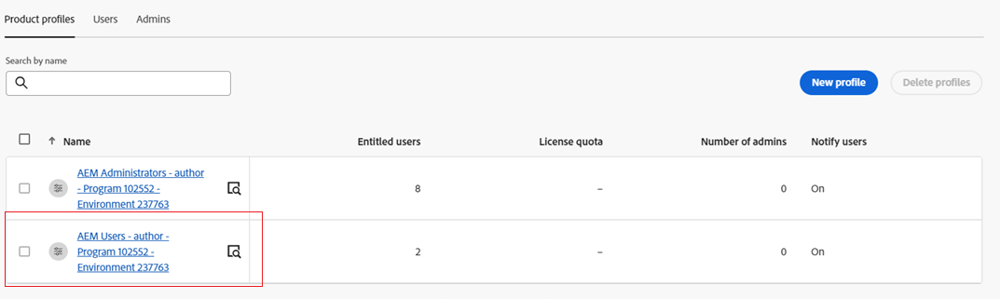

# Implantar o Content Hub {#deploy-content-hub}

O Content Hub está disponível como parte do Experience Manager Assets as a Cloud Service para democratizar o acesso a conteúdo sobre a marca para organizações e seus parceiros de negócios.

Os ativos marcados como Aprovado no Experience Manager Assets as a Cloud Service estão disponíveis para distribuição de ativos no Content Hub.

Este artigo fornece um fluxo de trabalho completo para fornecer aos usuários acesso ao Content Hub, incluindo as variações de privilégios com base em suas necessidades.

As variações de privilégios no Content Hub incluem:

* [Consumidores de ativos](#onboard-content-hub-consumer-users): acesse os ativos aprovados pela marca no portal do Content Hub.

* [Administradores](#onboard-content-hub-administrator): Acesso à [Interface do usuário de configuração](/help/assets/configure-content-hub-ui-options.md) no Content Hub, além do consumidor do Assets com direitos de envio.

* [Consumidores de ativos com direitos de envio](#onboard-content-hub-consumer-users-submission-rights): Capacidade de [fazer upload de ativos para o Content Hub](/help/assets/upload-brand-approved-assets.md) e [Integração do Adobe Express](/help/assets/edit-images-content-hub.md) além de acessar ativos aprovados pela marca no portal Content Hub.

* [Distribuidores de ativos](#content-hub-asset-distributors): capacidade de aprovar ativos no Experience Manager Assets as a Cloud Service para disponibilizá-los no Content Hub.

## Etapa 1: Ativar o Content Hub para Experience Manager Assets usando o Cloud Manager {#enable-content-hub}

Para acessar o portal Content Hub, primeiro os administradores precisam ativar o Content Hub para Experience Manager Assets as a Cloud Service Cloud Manager. Execute as seguintes etapas:

1. Faça logon no Cloud Manager. Certifique-se de selecionar a organização correta ao fazer logon. O Cloud Manager lista todos os seus programas.

1. Navegue até o programa as a Cloud Service do Experience Manager Assets, clique no ícone Mais opções (...) e selecione **[!UICONTROL Editar programa]**.

   

1. No [!UICONTROL Editar programa] , selecione a **[!UICONTROL Soluções e complementos]** guia.

1. Expandir **[!UICONTROL Assets]** e selecione **[!UICONTROL Content Hub]**.
   

1. Clique em **[!UICONTROL Atualizar]**.

O Content Hub agora está ativado para o Experience Manager Assets as a Cloud Service.

Se você nunca usou o Experience Manager Assets, clique em **[!UICONTROL Adicionar programa]** e forneça os detalhes do programa (Nome do programa, configurado para produção) e clique em **[!UICONTROL Continuar]**. É possível selecionar **[!UICONTROL Assets]** e **[!UICONTROL Content Hub]** no **[!UICONTROL Soluções e complementos]** guia.

### Instância do Content Hub e perfil de produto no Admin Console{#content-hub-instance-product-profile}

Depois [habilitar o Content Hub para o Assets as a Cloud Service Cloud Manager](#enable-content-hub), há uma nova instância criada no as a Cloud Service Admin Console do AEM Assets com `contenthub` como o sufixo:

Observe que não há `author` ou `publish` no nome da instância do Content Hub.

Clique no nome da instância para exibir o perfil de produto do Content Hub.

## Etapa 2: integrar o administrador do Content Hub {#onboard-content-hub-administrator}

Os administradores do Content Hub podem adicionar ativos ao Content Hub e também definir a [Opções de configuração](/help/assets/configure-content-hub-ui-options.md) para outros usuários em sua organização.

Para integrar o administrador do Content Hub:

1. [Acesse e clique no perfil de produto do usuário do Content Hub](#content-hub-instance-product-profile).

1. Clique em **[!UICONTROL Adicionar usuários]** para adicionar usuários ou grupos de usuários ao perfil de produto.

1. Clique em **[!UICONTROL Salvar]** para salvar as alterações.

1. Depois de adicionar o usuário ao perfil de produto do Content Hub, acesse os perfis de produto do Experience Manager Assets clicando no nome de produto do AEM as a Cloud Service na lista de produtos no Admin Console.

1. Clique na instância do autor de produção para o AEM as a Cloud Service:
   

   O Admin Console exibe dois perfis de produto para o AEM as a Cloud Service: Administradores e Usuários.
1. Clique no perfil de produto Administrators e clique em **[!UICONTROL Adicionar usuários]** para adicionar o usuário ao perfil de produto.
   

1. Clique em **[!UICONTROL Salvar]** para salvar as alterações.

## Etapa 3: integrar usuários consumidores de ativos da Content Hub {#onboard-content-hub-consumer-users}

Os usuários consumidores do Content Hub podem acessar ativos disponíveis no portal, mas não podem adicionar novos ativos ou modificar ativos existentes.

Para integrar usuários consumidores ao Content Hub:

1. [Acesse e clique no perfil de produto do usuário do Content Hub](#content-hub-instance-product-profile).

1. Clique em **[!UICONTROL Adicionar usuários]** para adicionar usuários ou grupos de usuários ao perfil de produto.

1. Clique em **[!UICONTROL Salvar]** para salvar as alterações.

Esses usuários agora podem acessar os ativos disponíveis no portal do Content Hub.

>[!NOTE]
>
>Você pode usar todos os recursos avançados da empresa, como a sincronização com Provedores de identidade externos.

Depois de adicionar os usuários apropriados usando o Admin Console, os usuários podem acessar o Content Hub usando o seguinte link:

`https://experience.adobe.com/#/assets/contenthub`

### Desabilitar notificações por email para usuários {#disable-email-notifications}

Se os administradores precisarem desativar as notificações por email enviadas aos usuários quando eles forem adicionados ao perfil de produto do Content Hub:

Clique no ícone de pesquisa ao lado do nome do perfil do produto e desative a opção **[!UICONTROL Notificar usuários por email]** alternar.

## Etapa 4: integrar usuários consumidores de ativos do Content Hub com permissões de envio (opcional) {#onboard-content-hub-consumer-users-submission-rights}

Os usuários consumidores de ativos do Content Hub com permissões de envio podem:

* [Fazer upload dos novos ativos aprovados pela marca para o Content Hub](/help/assets/upload-brand-approved-assets.md).

* [Modificar ativos existentes usando o Adobe Express e salvar o ativo no repositório](/help/assets/edit-images-content-hub.md). A edição de ativos usando o Adobe Express só estará disponível se o usuário tiver direitos de Adobe Express.

Para integrar o usuário consumidor do Content Hub com direitos de envio:

1. [Depois de adicionar o usuário ao perfil de produto do Content Hub](#onboard-content-hub-consumer-users), acesse os perfis de produto do Experience Manager Assets clicando no nome de produto do AEM as a Cloud Service na lista de produtos no Admin Console.

1. Clique na instância do autor de produção para o AEM as a Cloud Service:
   

   O Admin Console exibe dois perfis de produto para o AEM as a Cloud Service: Administradores e Usuários.
1. Clique no perfil de produto Usuários e clique em **[!UICONTROL Adicionar usuários]** para adicionar o usuário ao perfil de produto.
   

1. Clique em **[!UICONTROL Salvar]** para salvar as alterações.

## distribuidores de ativos Content Hub {#content-hub-asset-distributors}

Os distribuidores de ativos podem aprovar ativos no AEM as a Cloud Service para que eles fiquem disponíveis no Content Hub.

Para configurar a função de distribuidor de ativos:

1. Para acessar os perfis de produto do Experience Manager Assets, clique no nome de produto do AEM as a Cloud Service na lista de produtos do Admin Console.

1. Clique na instância do autor de produção para o AEM as a Cloud Service:
   

   O Admin Console exibe dois perfis de produto para o AEM as a Cloud Service: Administradores e Usuários.
1. Clique no perfil de produto Usuários e clique em **[!UICONTROL Adicionar usuários]** para adicionar o usuário ao perfil de produto.
   

1. Clique em **[!UICONTROL Salvar]** para salvar as alterações.

   >[!NOTE]
   >
   > Não é necessário adicionar à [Perfil de produto do Content Hub](#onboard-content-hub-consumer-users) para a função de distribuição de ativos.

