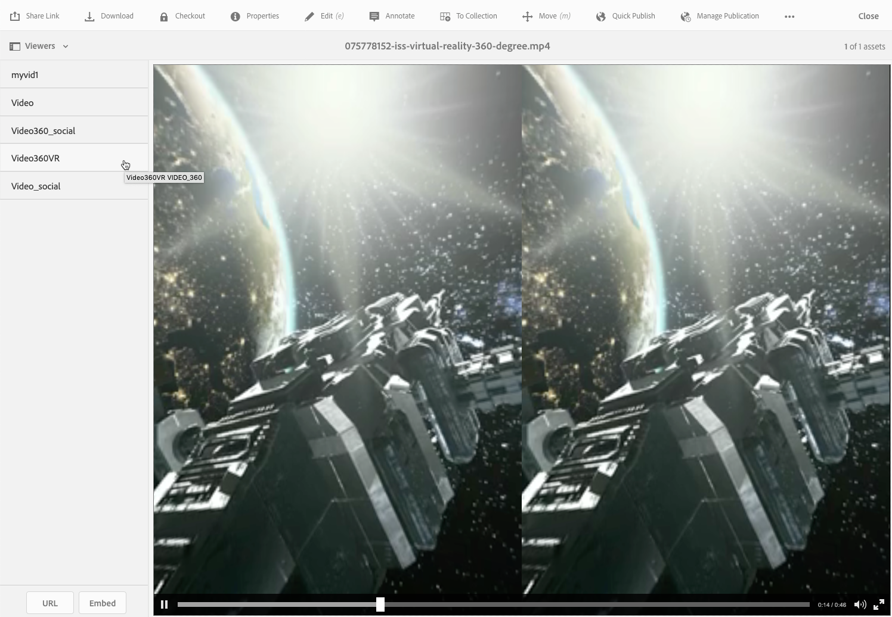

# 360/VR Video {#vr-video}

Vídeos de 360 graus gravam uma visualização em todas as direções ao mesmo tempo. They are shot using an omnidirectional camera or a collection of cameras. Durante a reprodução num visor plano, o utilizador controla o ângulo de visualização; a reprodução em dispositivos móveis normalmente aproveita seus controles giroscópicos incorporados.

O Dynamic Media inclui suporte nativo para o delivery de 360 ativos de vídeo. Por padrão, nenhuma configuração adicional é necessária para exibir ou reproduzir. Você fornece 360 vídeos usando extensões de vídeo padrão, como .mp4, .mkv e .mov. O codec mais comum é H.264.

This section describes working with the 360/VR Video viewer to render equirectangular video for an immersive viewing experience of a room, property, location, landscape, medical procedure, and so on.

Spatial audio is not currently supported; if audio is mixed in stereo, the balance (L/R) does not change as the customer changes the camera viewing angle.

See [Using Dynamic Media 360 Videos and Custom Video thumbnail with AEM Assets](https://docs.adobe.com/content/help/en/experience-manager-learn/assets/dynamic-media/dynamic-media-360-video-custom-thumbnail-feature-video-use.html).

See also [Managing Viewer Presets](/help/assets/dynamic-media/managing-viewer-presets.md).

## 360 Video in action {#video-in-action}

Tap [Space Station 360](http://mobiletest.scene7.com/s7viewers/html5/Video360Viewer.html?asset=Viewers/space_station_360-AVS) to open a browser window and watch a 360-degree video. During video playback, drag the mouse pointer to a new location to change the viewing angle.

*Video frame from Space Station 360*

## 360/VR Video and Adobe Premiere Pro {#vr-video-and-adobe-premiere-pro}

You can use Adobe Premier Pro to view and edit 360/VR footage. For example, you can place logos and text properly in a scene and apply effects and transitions that are designed specifically for equirectangular media.

Consulte [Editar vídeo](https://helpx.adobe.com/premiere-pro/how-to/edit-360-vr-video.html)360/VR.

## Fazer upload de ativos para uso com o visualizador de vídeo 360 {#uploading-assets-for-use-with-the-video-viewer}

Os ativos de vídeo 360 que são carregados no AEM são rotulados como **Multimídia** em uma página Ativo, similar ao ativo de vídeo normal.

*Um ativo de vídeo 360 carregado visto na visualização de cartão. O ativo é rotulado como Multimídia.*

**Para fazer upload de ativos para uso com o visualizador de vídeo 360:**

1. Criada uma pasta dedicada ao seu ativo de vídeo 360.
1. [Aplique um perfil de vídeo adaptável à pasta](/help/assets/dynamic-media/video-profiles.md#applying-a-video-profile-to-folders).

   A renderização de conteúdo de vídeo 360 coloca requisitos mais altos para a resolução de vídeo de origem e para a resolução de execuções codificadas do que o conteúdo de vídeo padrão não-360.

   Você pode usar o Perfil de vídeo adaptável pronto para uso que já vem com o Dynamic Media. No entanto, lembre-se de que isso resultará em uma qualidade de vídeo 360 nitidamente menor do que a obtida para vídeos não-360 codificados com as mesmas configurações renderizadas com um visualizador de vídeo não-360. Portanto, se for necessário um vídeo 360 de alta qualidade, faça o seguinte:

   * Idealmente, seu conteúdo original de vídeo 360 deve ter uma das seguintes resoluções:

      * 1080p - 1920 x 1080, conhecida como resolução Full HD ou FHD ou
      * 2160p - 3840 x 2160, conhecida como resolução 4K, UHD ou Ultra HD. Essa resolução de tela muito grande é encontrada na maioria das vezes em televisores premium e monitores de computador. The 2160p resolution is often called &quot;4K&quot; because the width is close to 4000 pixels. In other words, it offers four times the pixels of 1080p.
   * [Create a custom Adaptive Video Profile](/help/assets/dynamic-media/video-profiles.md#creating-a-video-encoding-profile-for-adaptive-streaming) with higher quality renditions. For example, you may want to create an Adaptive Video Profile that contains the following three settings:

      * width=auto; height=720; bitrate=2500 kbps
      * width=auto; height=1080; bitrate=5000 kbps
      * width=auto; height=1440; bitrate=6600 kbps
   * Process 360 video content in a folder that is dedicated exclusively to 360 video assets.

   Be aware that this approach will also place greater demands on the network and CPU of the end user.

1. [Carregue seu vídeo na pasta](/help/assets/manage-video-assets.md#upload-and-preview-video-assets).

<!--

## Overriding the default aspect ratio of 360 videos  {#overriding-the-default-aspect-ratio-of-videos}

For an uploaded asset to qualify as a 360 video that you intend to use with the 360 Video viewer, the asset must have an aspect ratio of 2.

By default, AEM detects video as "360" if its aspect ratio (width/height) is 2.0. If you are an Administrator, you can override the default aspect ratio setting of 2 by setting the optional `s7video360AR` property in CRXDE Lite at the following:

* `/conf/global/settings/cloudconfigs/dmscene7/jcr:content`

  * **Property type**: Double
  * **Value**: floating-point aspect ratio, default 2.0.

After you set this property, it takes effect immediately on both existing videos and newly uploaded videos.

The aspect ratio applies to 360 video assets for the asset details page and the [Video 360 Media WCM component](/help/assets/dynamic-media/adding-dynamic-media-assets-to-pages.md#dynamic-media-components).

Start by uploading 360 Videos.

-->

## Previewing 360 Video {#previewing-video}

You can use Preview to see what your 360 Video looks like to customers and ensure it is behaving as expected.

Consulte também [Edição de predefinições](/help/assets/dynamic-media/managing-viewer-presets.md#editing-viewer-presets)do visualizador.

Quando estiver satisfeito com o vídeo 360, você poderá publicá-lo.

See [Embedding the Video or Image Viewer on a Web Page](/help/assets/dynamic-media/embed-code.md).
See [Linking URLs to your web application](/help/assets/dynamic-media/linking-urls-to-yourwebapplication.md). Observe que o método baseado em URL de vinculação não é possível se o conteúdo interativo tiver links com URLs relativos, principalmente links para páginas do AEM Sites.
See [Adding Dynamic Media Assets to pages.](/help/assets/dynamic-media/adding-dynamic-media-assets-to-pages.md)

**Para a pré-visualização 360 vídeos**

1. Em **[!UICONTROL Ativos]**, navegue até um vídeo 360 existente que você criou. Toque no recurso Vídeo 360 para abri-lo no modo de pré-visualização.

   

   Toque no ativo de vídeo 360 para pré-visualização do vídeo.

1. Na página pré-visualização, próximo ao canto superior esquerdo da página, toque na lista suspensa e selecione **[!UICONTROL Visualizadores]**.

   

   Na lista Visualizadores, toque em **[!UICONTROL Video360_social]** e execute um dos procedimentos a seguir:

   * Arraste o ponteiro do mouse sobre o vídeo para alterar o ângulo de visualização da cena estática.
   * Toque no botão **[!UICONTROL Reproduzir]** do vídeo para iniciar a reprodução; à medida que o vídeo é reproduzido, arraste o ponteiro do mouse pelo vídeo para alterar seu ângulo de visualização.

   *socialA 360.*

   * Na lista Visualizadores, toque em **[!UICONTROL Video360VR]**.

      O vídeo Virtual Reality (VR) é um conteúdo de vídeo imersivo que é acessado através do uso de headsets de realidade virtual. Assim como acontece com os vídeos comuns, você cria vídeos VR no início quando um vídeo está sendo gravado ou capturado com câmeras de vídeo de 360 graus.
   
   *Uma imagem de vídeo de 360 VR.*

1. Near the upper-right of the preview page, tap **[!UICONTROL Close]**.

## Publicação de vídeo 360 {#publishing-video}

Você precisa publicar o vídeo 360 para usá-lo. A publicação de um vídeo 360 ativa o URL e o código incorporado. Ele também publica o vídeo 360 na nuvem Dynamic Media, que é integrada a um CDN para delivery escaláveis e com desempenho.

Consulte [Publicação de ativos](/help/assets/dynamic-media/publishing-dynamicmedia-assets.md) de mídia dinâmica para obter detalhes sobre como publicar vídeos 360.
See also [Embedding the Video or Image Viewer on a Web Page](/help/assets/dynamic-media/embed-code.md).
See also [Linking URLs to your web application](/help/assets/dynamic-media/linking-urls-to-yourwebapplication.md). Observe que o método baseado em URL de vinculação não é possível se o conteúdo interativo tiver links com URLs relativos, principalmente links para páginas do AEM Sites.
See also [Adding Dynamic Media Assets to pages.](/help/assets/dynamic-media/adding-dynamic-media-assets-to-pages.md)
