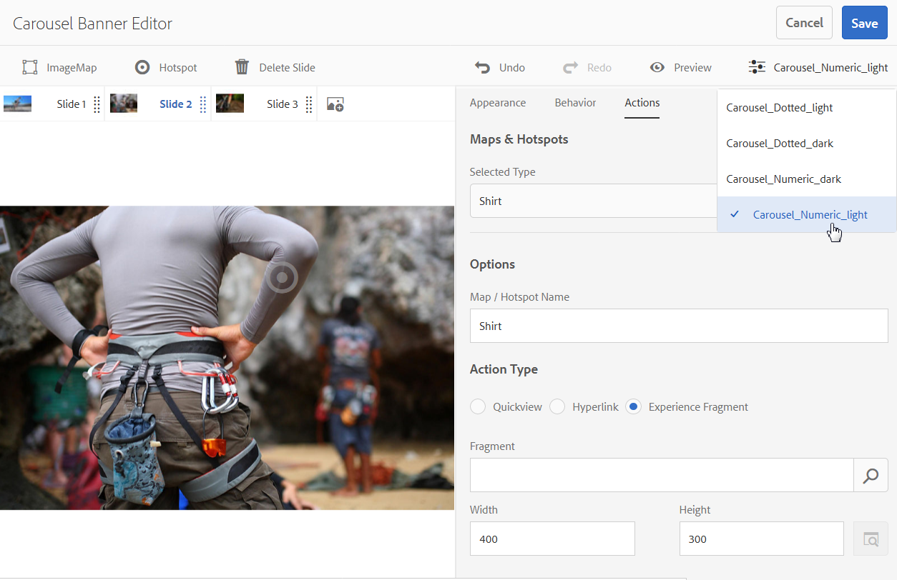

# Banners em carrossel{#carousel-banners}

Os banners em carrossel permitem que os profissionais de marketing determinem a conversão, criando facilmente conteúdo promocional giratório interativo e o entregando a qualquer tela.

Criar e modificar o conteúdo em destaque em banners promocionais pode ser demorado, limitando sua capacidade de publicar rapidamente novo conteúdo ou torná-lo mais direcionado. Os banners em carrossel permitem que você crie ou modifique rapidamente banners giratórios e adicione interatividade, como links de hotspots para detalhes do produto ou recursos relacionados. Você pode entregá-los a qualquer tela, permitindo que você coloque o novo conteúdo promocional no mercado mais rapidamente.

Os banners de carrossel são designados por um banner com a palavra **[!UICONTROL CAROUSELSET]**:

Em seu site, um banner de carrossel pode ter a seguinte aparência:

Aqui você pode navegar pelas imagens selecionando os números. Além disso, os slides giram automaticamente com base em um intervalo de tempo que você pode personalizar. As imagens em um banner de carrossel são compatíveis com hotspots e mapas de imagem. Os usuários podem selecionar ou acessar um hiperlink ou uma janela do Quickview.

Neste exemplo, um usuário selecionou um mapa de imagem e acessou a janela do Quickview para obter luvas:

## Veja como os banners em carrossel são criados {#watch-how-carousel-banners-are-created}

Assista a uma apresentação em [como os banners de carrossel são criados](https://s7d5.scene7.com/s7viewers/html5/VideoViewer.html?videoserverurl=https://s7d5.scene7.com/is/content/&amp;emailurl=https://s7d5.scene7.com/s7/emailFriend&amp;serverUrl=https://s7d5.scene7.com/is/image/&amp;config=Scene7SharedAssets/Universal_HTML5_Video_social&amp;contenturl=https://s7d5.scene7.com/skins/&amp;asset=S7tutorials/InteractiveCarouselBanner) (Duração: 10 minutos e 33 segundos). Você também aprenderá sobre como visualizar, editar e fornecer banners em carrossel.

>[!NOTE]
>
>Usuários não administrativos devem ser adicionados ao grupo **[!UICONTROL dam-users]** para poderem criar ou editar banners de carrossel. Se tiver problemas ao criar ou editar, consulte o administrador do sistema que pode adicioná-lo ao grupo **d[!UICONTROL am-users]**.

## Início rápido: Banners em carrossel {#quick-start-carousel-banners}

Para ativar e executar rapidamente:

1. [Identificar o ponto de acesso e as variáveis de mapa de imagem](#identifying-hotspot-and-image-map-variables)  (somente para clientes que usam o Adobe Experience Manager Assets + Dynamic Media)

   Comece identificando as variáveis dinâmicas usadas pela implementação da Exibição rápida existente. Isso o ajuda a inserir os pontos de acesso e os dados do mapa de imagem corretamente durante o processo de criação do banner de carrossel no Experience Manager Assets.

<!-- LEAVE; COMMERCE BEING ADDED AGAIN IN THE FUTURE

   >[!NOTE]
   >
   >If you are an Experience Manager Sites or Ecommerce customer, you can use the built-in feature to navigate to product pages and lookup the existing skus in the product catalog. You do not need to manually enter hotspot or image map variables.
   >
   >
   >If you are an Experience ManagerAssets and Dynamic Media customer, you will manually enter data for hotspots and image maps, and then integrate the published URL or Embed code with your third-party content management system.

-->

1. Opcional: [crie uma predefinição do visualizador Conjunto de carrossel](/help/assets/dynamic-media/managing-viewer-presets.md), conforme necessário.

   Se você for um administrador, poderá personalizar o comportamento e a aparência do carrossel criando sua própria predefinição do visualizador do carrossel. O principal benefício é que você pode reutilizar essa predefinição do visualizador personalizado para vários carrosséis. No entanto, os usuários podem, opcionalmente, personalizar o comportamento e a aparência do carrossel diretamente durante a criação do carrossel. Essa abordagem é preferível quando você deseja um design específico para um determinado carrossel.

1. [Faça upload de um banner de imagem](#uploading-image-banners).

   Carregue banners de imagem que você deseja tornar interativos.

1. [Criar um conjunto de carrossel](#creating-carousel-sets).

   Em Conjuntos de carrosséis, os usuários navegam por imagens de banner e selecionam pontos de acesso ou mapas de imagem para acessar conteúdo relevante.

   Para criar um Conjunto de carrossel no Assets, selecione **[!UICONTROL Criar]** e selecione **[!UICONTROL Conjuntos de carrossel]**. Adicione ativos a slides e selecione **[!UICONTROL Salvar]**. Além disso, edite a aparência e o comportamento do carrossel diretamente no editor.

1. [Adicione pontos de acesso ou mapas de imagem a um banner](#adding-hotspots-or-image-maps-to-an-image-banner) de imagem.

   Adicione um ou mais pontos de acesso ou mapas de imagem a um banner de imagem. Em seguida, associe cada um a uma ação, como um link, uma Exibição rápida ou um Fragmento de experiência. Após adicionar pontos de acesso ou mapas de imagem, conclua esta tarefa publicando o conjunto de carrossel. A publicação cria o código incorporado que pode ser usado para copiar e aplicar à página de aterrissagem do site.

   Consulte [(Opcional) Visualizar banners do carrossel](#optional-previewing-carousel-banners) - Opcional. Se desejar, é possível visualizar uma representação do conjunto de carrossel e testar sua interatividade.

1. [Publique banners no carrossel](#publishing-carousel-banners).

   Você publica um Conjunto de carrossel como faria com qualquer ativo. No Assets, navegue até o Conjunto de carrossel, selecione-o e selecione **[!UICONTROL Publicar]**. A publicação de um Conjunto de carrossel ativa o URL e a cadeia de caracteres de inserção.

1. Faça uma das seguintes opções:

   * [Adicionar um banner de carrossel à ](#adding-a-carousel-banner-to-your-website-page)página do site. Você pode adicionar a URL do banner de carrossel ou incorporar o código que você copiou na página do site.

      * [Integre o banner do carrossel a uma visualização](#integrating-the-carousel-banner-with-an-existing-quickview) rápida existente. Se você estiver usando um sistema de gerenciamento de conteúdo da Web de terceiros, é necessário integrar o novo banner de carrossel com a implementação do Quick View existente no seu site.
   * [Adicione um banner de carrossel ao seu site no Experience Manager](/help/assets/dynamic-media/adding-dynamic-media-assets-to-pages.md). Se você for um cliente do Experience Manager Sites , é possível adicionar o conjunto de carrossel diretamente à página usando o componente Mídia interativa .

Se precisar editar Conjuntos de carrossel, consulte [Editar conjuntos de carrossel](#editing-carousel-sets). Além disso, você pode visualizar e editar [Propriedades do Conjunto de carrossel](/help/assets/manage-digital-assets.md#editing-properties).

## Identificar os pontos de acesso e as variáveis do mapa de imagem {#identifying-hotspot-and-image-map-variables}

Comece identificando as variáveis dinâmicas usadas pela implementação da Exibição rápida existente. Este método ajuda a inserir pontos de acesso ou dados de mapa de imagem adequadamente durante o processo de criação do conjunto de carrossel nos Ativos do Experience Manager.

Quando você adiciona pontos de acesso ou mapas de imagem a uma imagem de banner, você atribui um SKU (Stock Keeping Unit). Também é possível atribuir variáveis adicionais opcionais a cada ponto de acesso ou mapa de imagem. Essas variáveis são usadas posteriormente para corresponder pontos de acesso ou mapas de imagem com conteúdo de exibição rápida.

<!-- LEAVE; COMMERCE BEING ADDED LATER

>[!NOTE]
>
>If you are an Experience Manager Sites and/or Experience Manager Ecommerce customer, skip this step. You do not need to manually identify hotspot or image map variables; you can use the integration with Ecommerce for product integration. See information on [setting up eCommerce](/help/sites-cloud/administering/generic.md). In addition, you can use the Interactive component and add it to your web page.
>
>If you are an Experience Manager Assets or Media customer, you publish the URL or Embed code and then integrate with your third-party content management system and identify hotspots and image maps manually.

-->

É importante identificar corretamente o número e o tipo de variáveis a serem associadas ao ponto de acesso ou aos dados do mapa de imagem. Cada ponto de acesso ou mapa de imagem adicionado a uma imagem de banner deve ter informações suficientes para identificar inequivocamente o produto no sistema back-end existente. Ao mesmo tempo, verifique se cada ponto de acesso ou mapa de imagem não inclui mais dados do que o necessário. O motivo é que isso tornaria o processo de entrada de dados excessivamente complexo e o gerenciamento contínuo de hotspots ou mapas de imagem mais propenso a erros.

Há diferentes maneiras de identificar um conjunto de variáveis a serem usadas para pontos de acesso ou dados de mapa de imagem.

Às vezes, basta consultar especialistas de TI responsáveis pela implementação atual do Quickview. Eles provavelmente saberão qual é o conjunto mínimo de dados para identificar a visualização rápida no sistema. No entanto, é possível simplesmente analisar o comportamento existente do código front-end.

A maioria das implementações do Quickview usa o seguinte paradigma:

* O usuário ativa um elemento da interface do usuário no site. Por exemplo, selecionar um botão **[!UICONTROL Quickview]**.
* O site envia uma solicitação do Ajax para o back-end para carregar os dados ou o conteúdo do Quickview, se necessário.
* Os dados do Quickview são traduzidos para o conteúdo em preparação para renderização na página da Web.
* Por fim, o código front-end renderiza visualmente esse conteúdo na tela.

A abordagem é então visitar diferentes áreas do site existente, onde o recurso Quickview é implementado. Em seguida, acione o Quickview e adquira o URL Ajax enviado pela página da Web para carregar os dados ou o conteúdo do Quickview.

Normalmente, não há necessidade de usar ferramentas de depuração especializadas. Os navegadores modernos da Web apresentam inspetores da Web que fazem um trabalho adequado. A seguir estão alguns exemplos de navegadores da Web que incluem inspetores da Web:

* Para ver todas as solicitações HTTP de saída no Google Chrome, pressione F12 (Windows®) ou Command-Option-I (Mac) para abrir o painel de ferramentas do Desenvolvedor. Selecione a guia Rede.
* No Firefox, é possível ativar o plug-in do Firebug pressionando F12 (Windows®) ou Command-Option-I (Mac). Use a guia Rede ou a ferramenta Inspetor integrada e a guia Rede.

Quando o monitoramento de rede estiver ativado no navegador, acione o Quickview na página.

Agora, encontre o URL Ajax de exibição rápida no log da rede e copie o URL registrado para análise futura. Geralmente, quando você aciona o Quickview, há várias solicitações que são enviadas ao servidor. Normalmente, o URL de Ajax do Quickview é um dos primeiros na lista. Ela tem uma parte ou um caminho complexo da sequência de consulta e seu tipo MIME de resposta é `text/html`, `text/xml` ou `text/javascript`.

Durante esse processo, é importante visitar diferentes áreas de seu site, com diferentes categorias e tipos de produtos. O motivo é que os URLs de visualização rápida têm partes comuns para uma determinada categoria de site, mas são alteradas somente se você visitar uma área diferente do site.

No caso mais simples, a única parte variável no URL do Quickview é o SKU do produto. Nesse caso, o valor SKU é o único dado necessário para adicionar pontos de acesso ou mapas de imagem à imagem do banner.

No entanto, em casos complexos, o URL do Quickview tem elementos variáveis diferentes além do SKU. Alguns desses elementos incluem ID de categoria, código de cor, código de tamanho e assim por diante. Nesses casos, cada elemento é uma variável separada no ponto de acesso ou na definição de dados do mapa de imagem no recurso de banner do carrossel.

Considere os exemplos a seguir de URLs do Quickview e seus pontos de acesso ou variáveis de mapa de imagem resultantes:

<table>
 <tbody>
  <tr>
   <td>SKU único, encontrado na string de consulta.</td>
   <td>
Os URLs de visualização rápida gravados incluem o seguinte:

    <ul>
     <li>
<code>https://server/json?productId=866558&amp;source=100</code>
 </li>
     <li>
<code>https://server/json?productId=1196184&amp;source=100</code>
 </li>
     <li>
<code>https://server/json?productId=1081492&amp;source=100</code>
 </li>
     <li>
<code>https://server/json?productId=1898294&amp;source=100</code>
 </li>
    </ul> 
A única parte variável no URL é o valor do parâmetro da string de consulta <code>productId=</code> e é claramente um valor SKU. Portanto, os pontos de acesso ou mapas de imagem precisam apenas de campos SKU preenchidos com valores como <code>866558,</code> <code>1196184,</code> <code>1081492,</code> <code>1898294.</code>
 </td>
  </tr>
  <tr>
   <td>SKU único, encontrado no caminho do URL.</td>
   <td>
Os URLs do Quickview registrados incluem o seguinte:

    <ul>
     <li>
<code>https://server/product/6422350843</code>
 </li>
     <li>
<code>https://server/product/1607745002</code>
 </li>
     <li>
<code>https://server/product/0086724882</code>
 </li>
    </ul> 
A parte variável está na última parte do caminho e se torna o valor SKU dos pontos de acesso/mapas de imagem:<strong><code>6422350843</code>, <code>1607745002,</code> </strong><code>0086724882.</code>
 </td>
  </tr>
  <tr>
   <td>SKU e ID de categoria na sequência de consulta.</td>
   <td>
Os URLs de visualização rápida gravados incluem o seguinte:

    <ul>
     <li>
<code>https://server/quickView/product/?category=1100004&amp;prodId=305466</code>
 </li>
     <li>
<code>https://server/quickView/product/?category=1100004&amp;prodId=310181</code>
 </li>
     <li>
<code>https://server/quickView/product/?category=1740148&amp;prodId=308706</code>
 </li>
    </ul> 
Nesse caso, há duas partes variáveis no URL. O SKU é armazenado no parâmetro <code>prodId</code> e a ID da categoria é armazenada no parâmetro <code>category=</code>.
 
Dessa forma, as definições de ponto de acesso/mapa de imagem são pares. Ou seja, um valor SKU e uma variável extra chamada <code>categoryId</code>. Os pares resultantes são os seguintes:

    <ul>
     <li>
O SKU é <strong><code>305466</code></strong> e <code>categoryId</code> é <code>1100004</code>.
 </li>
     <li>
O SKU é <strong><code>310181</code></strong> e <code>categoryId</code> é <strong><code>1100004</code></strong>.
 </li>
     <li>
O SKU é <strong><code>308706</code></strong> e <code>categoryId</code> é <strong><code>1740148</code></strong>.
 </li>
    </ul> </td>
  </tr>
 </tbody>
</table>

## Fazer upload de banners de imagem {#uploading-image-banners}

Se você já tiver carregado as imagens que deseja usar, avance para a próxima etapa, [Criar conjuntos de carrossel](#creating-carousel-sets). As imagens usadas no carrossel devem ser carregadas após a ativação do Dynamic Media.

Para fazer upload de banners de imagem, consulte [Fazer upload de ativos](/help/assets/manage-digital-assets.md).

## Criar conjuntos de carrossel {#creating-carousel-sets}

>[!NOTE]
>
>Usuários não administrativos devem ser adicionados ao grupo **[!UICONTROL dam-users]** para poderem criar ou editar banners de carrossel. Se tiver problemas ao criar ou editar, consulte o administrador do sistema que pode adicioná-lo ao grupo **[!UICONTROL dam-users]**.

**Para criar Conjuntos de carrossel:**

1. No Assets, navegue até a pasta onde deseja criar o Conjunto de carrossel e vá para **[!UICONTROL Criar > Conjunto de carrossel]**.
1. Na página Editor de banner de carrossel , selecione **[!UICONTROL Toque para abrir o Seletor de ativo]** para selecionar a imagem do primeiro slide.

   Na página Editor de banner de carrossel , siga um destes procedimentos:

   * Próximo ao canto superior esquerdo da página, selecione o ícone **[!UICONTROL Adicionar slide]**.

   * Próximo ao meio da página, selecione **[!UICONTROL Toque para abrir o Seletor de ativos]**.
   Selecione para selecionar os ativos que deseja incluir no Conjunto de carrossel. Os ativos selecionados têm um ícone de marca de seleção sobre eles. Quando terminar, próximo ao canto superior direito da página, selecione **[!UICONTROL Select]**.

   Com o Seletor de ativos, procure por ativos ao digitar uma palavra-chave e selecionar **[!UICONTROL Retornar]**. Aplique filtros para refinar os resultados da pesquisa. Filtre por caminho, coleção, tipo de arquivo e tag. Selecione o filtro e depois selecione o ícone **[!UICONTROL Filter]** na barra de ferramentas. Altere a exibição ao selecionar o ícone Exibir e selecionar **[!UICONTROL Exibição de coluna]**, **[!UICONTROL Exibição de cartão]** ou **[!UICONTROL Exibição de lista]**.

   Consulte [Trabalhar com seletores](/help/assets/dynamic-media/working-with-selectors.md) para obter mais informações.

1. Continue a adicionar slides até ter adicionado todas as imagens que deseja girar no Conjunto de carrossel.
1. (Opcional) Siga um destes procedimentos:

   * Se necessário, arraste os slides para reorganizar as imagens na lista de conjuntos.
   * Para excluir uma imagem, selecione a imagem e selecione **[!UICONTROL Excluir slide]** na barra de ferramentas.

   * Para aplicar uma predefinição, próximo ao canto superior direito da página, selecione a lista suspensa predefinição e selecione uma predefinição para aplicar ao conjunto ao mesmo tempo.
   Para excluir um slide, selecione o slide. Na barra de ferramentas, selecione **[!UICONTROL Delete Slide]** na barra de ferramentas. Para mover um slide, selecione o ícone de reordenação e mova para o local desejado.

1. Depois de ter adicionado as imagens nos slides, você pode adicionar um ponto de acesso, mapa de imagem ou ambos à sua imagem. Consulte [Adicionar pontos de acesso ou mapas de imagem a um Banner de imagem](#adding-hotspots-or-image-maps-to-an-image-banner).
1. Você pode alterar o design visual e o comportamento dos conjuntos de carrossel. Selecione as guias **[!UICONTROL Behavior]** e **[!UICONTROL Aparência]** se desejar ajustar a forma como o banner do carrossel é exibido ou como os componentes específicos se comportam. Consulte [Gerenciar predefinições do visualizador](/help/assets/dynamic-media/viewer-presets.md) para obter mais informações sobre como usar o editor do visualizador.

   >[!NOTE]
   >
   >Para banners de carrossel, você pode ajustar o seguinte:
   >
   >* Duração que uma imagem exibe. Por padrão, cada imagem é exibida por 9 segundos.
   >* Animação. Por padrão, cada transição de slide está esmaecida. Você pode alterá-lo para uma transição de slide.
   >* Estilo dos botões. Os usuários podem girar pelos banners selecionando cada ponto ou número. Você pode alterar o local em que os botões de indicador definidos são exibidos (e se são numéricos ou de estilo pontilhado) e o tamanho deles.
   >* Altere o estilo de realce de um mapa de imagem ou o ícone usado para pontos de acesso.
   >* Antes de editar uma predefinição do visualizador, escolha o estilo no qual deseja basear a predefinição. Se você não escolher um estilo, ao começar a editar a predefinição do visualizador, perderá todas as suas alterações se alterar para uma predefinição diferente.

   Você também pode visualizar a aparência do banner do carrossel. Consulte [(Opcional) Visualizar banners do carrossel](#optional-previewing-carousel-banners).

1. Selecione **[!UICONTROL Salvar]** quando terminar.

## Adicionar pontos de acesso ou mapas de imagem a um banner de imagem {#adding-hotspots-or-image-maps-to-an-image-banner}

Você pode adicionar pontos de acesso ou mapas de imagem a um banner usando o editor Conjunto de carrossel.

Ao adicionar pontos de acesso ou mapas de imagem, você pode defini-los como uma exibição pop-up Exibição rápida, como um hiperlink ou um Fragmento de experiência.

Consulte [Fragmento de experiência](/help/sites-cloud/authoring/fundamentals/experience-fragments.md).

>[!NOTE]
>
>As ferramentas de compartilhamento de mídia social no Banner do carrossel não são compatíveis quando você incorpora o visualizador a um Fragmento de experiência.
>
>Para contornar esse problema, você pode usar ou criar predefinições do visualizador que não tenham ferramentas de compartilhamento de redes sociais. Essas predefinições do visualizador permitem que você as incorpore com êxito aos Fragmentos de experiência.

À medida que você adiciona pontos de acesso ou mapas de imagem a uma imagem, lembre-se de salvar seu trabalho. As opções Desfazer e Refazer, próximo ao canto superior direito da página, são compatíveis durante a sessão de criação/edição atual.

Quando terminar de criar o banner do carrossel, você pode usar a opção Visualizar para ver uma representação de como o banner do carrossel aparece para os clientes.

Consulte [(Opcional) Visualizar banners do carrossel](#optional-previewing-carousel-banners).

>[!NOTE]
>
>Quando você adiciona pontos de acesso a um banner de imagem, as informações do ponto de acesso são armazenadas no mesmo local de metadados - em relação ao local da imagem. Esse ponto é verdadeiro independentemente de ser uma Imagem interativa ou um Banner de carrossel. Essa funcionalidade significa que você pode reutilizar facilmente a mesma imagem - juntamente com seus dados de ponto de acesso definidos - em qualquer um dos visualizadores.
Esteja ciente, no entanto, de que os carrossel Banners suportam mapas de imagens em imagens que também podem conter pontos de acesso; uma Imagem interativa não. Lembre-se dessa dica se você pretende criar uma Imagem interativa ou um Banner de carrossel que use a mesma imagem. Considere a criação de Imagens interativas e Banners de carrossel usando cópias separadas da mesma imagem.

>[!NOTE]
Se você estiver editando imagens interativas com pontos de acesso e recortar a imagem, seus pontos de acesso serão removidos.

<!-- See also [Adding Image Maps](/help/assets/image-maps.md). -->

**Para adicionar pontos de acesso ou mapas de imagem a um banner de imagem:**

1. Em Ativos, navegue até o conjunto de carrossel que deseja tornar interativo.
1. Selecione o conjunto de carrossel e selecione **[!UICONTROL Editar]**. O Editor do visualizador de carrossel é aberto.
1. Selecione o slide que deseja tornar interativo.
1. Próximo ao canto superior esquerdo da página, selecione **[!UICONTROL Ponto de acesso]** ou **[!UICONTROL Mapa de imagem]**.
1. Siga um destes procedimentos:

   * Para pontos de conexão: Na imagem, selecione um local onde deseja que o ponto de acesso apareça.
   * Para mapas de imagem: Na imagem, arraste do canto superior esquerdo para o canto inferior direito para criar a área do mapa de imagem. É possível ajustar o tamanho do mapa de imagem arrastando os cantos.

   Se necessário, arraste o ponto de acesso ou o mapa de imagem para um novo local. Ou use as teclas de seta do teclado para controlar a posição de um ponto de acesso selecionado. Adicione mais pontos de acesso ou mapas de imagem, conforme necessário.

   Para excluir um ponto de acesso ou mapa de imagem, selecione a guia **[!UICONTROL Actions]**. No cabeçalho **[!UICONTROL Mapas e pontos de acesso]**, na lista suspensa **[!UICONTROL Tipo selecionado]**, selecione o nome do ponto de acesso ou mapa de imagem que deseja remover. Selecione o ícone **[!UICONTROL Lixeira]** ao lado do menu e selecione **[!UICONTROL Excluir]**.

1. No campo de texto Nome , digite o nome do ponto de acesso ou do mapa de imagem. Esse nome também aparece na lista suspensa **[!UICONTROL Mapas e hotspot]**. Fornecer um nome facilita a identificação do ponto de acesso ou mapa de imagem se você decidir alterá-lo no futuro.
1. Siga um destes procedimentos na guia **[!UICONTROL Actions]**:

   * Selecione **[!UICONTROL Quickview]**.

      * Se você for um cliente do Experience Manager Sites <!-- and Ecommerce--> , selecione o ícone Seletor de produto (lupa) para abrir a página Selecionar produto . Para retornar ao Editor de banner do carrossel, selecione o produto que deseja usar e selecione a marca de seleção no canto superior direito da página.
      * Se você não for um cliente do Experience Manager Sites <!-- or Ecommerce -->:

         * Defina variáveis. Consulte [Identificar variáveis de ponto de acesso](#identifying-hotspot-and-image-map-variables).
         * Em seguida, insira manualmente o valor de SKU. No campo de texto Valor SKU , digite o SKU (Stock Keeping Unit) do produto, que é um identificador exclusivo para cada produto ou serviço distinto que você oferece. O valor SKU inserido preenche automaticamente a parte variável do modelo de Exibição rápida. O sistema agora sabe associar o ponto de acesso selecionado à exibição rápida de um SKU específico.
         * (Opcional) Se houver outras variáveis na exibição Rápida que você deve usar para identificar ainda mais um produto, selecione **[!UICONTROL Adicionar variável genérica]**. No campo de texto, especifique uma variável extra. Por exemplo, category=Mens é uma variável adicionada.

         * Consulte [Trabalhar com seletores](/help/assets/dynamic-media/working-with-selectors.md) para obter mais informações.
   * Selecione **[!UICONTROL Hiperlink]**.

      * Se você for um cliente do Experience Manager Sites , selecione o ícone do Seletor de site (pasta) para navegar até um URL.

         >[!NOTE]
         O método de vinculação baseado em URL não é possível se o conteúdo interativo tiver links com URLs relativos, especialmente links para páginas de Experience Manager Sites .

      * Se você for um cliente independente, no campo de texto href , especifique o caminho do URL completo para uma página da Web vinculada.

   Certifique-se de especificar se deseja abrir o link em uma nova guia do navegador (padrão recomendado) ou na mesma guia.

   Consulte [Trabalhar com seletores](/help/assets/dynamic-media/working-with-selectors.md) para obter mais informações.

   * Selecione **[!UICONTROL Fragmento de experiência]**.

      * Se você for um cliente do Experience Manager Sites , selecione o ícone de Pesquisa (lupa) para abrir a página Fragmento de experiência . Para retornar à página Gerenciamento de ponto de acesso, selecione o Fragmento de experiência que deseja usar e, no canto superior direito da página, selecione **[!UICONTROL Selecionar]**.
Consulte [Fragmentos de experiência](/help/sites-cloud/authoring/fundamentals/experience-fragments.md).

      * Especifique a largura e a altura do Fragmento de experiência como ele aparece no banner.

         >[!NOTE]
         As ferramentas de compartilhamento de mídia social no Banner do carrossel não são compatíveis quando você incorpora o visualizador a um Fragmento de experiência.
         Para contornar esse problema, você pode usar ou criar predefinições do visualizador que não tenham ferramentas de compartilhamento de redes sociais. Essas predefinições do visualizador permitem que você as incorpore com êxito aos Fragmentos de experiência.
   

   Você também pode visualizar a aparência do banner do carrossel. Consulte [(Opcional) Visualizar banners do carrossel](#optional-previewing-carousel-banners).

1. Selecione **[!UICONTROL Salvar]**.
1. Publique o conjunto de carrossel. A publicação cria o código incorporado ou URL que você pode usar na página do site. Se você for um cliente do Experience Manager Sites , adicione o conjunto de carrossel diretamente à sua página da Web.

   Consulte [Publicar ativos](/help/assets/dynamic-media/publishing-dynamicmedia-assets.md).

   Consulte [Adicionar um conjunto de carrossel à página de aterrissagem do site](#adding-a-carousel-banner-to-your-website-page)

## Editar conjuntos de carrossel {#editing-carousel-sets}

>[!NOTE]
Usuários não administrativos devem ser adicionados ao grupo **[!UICONTROL dam-users]** para poderem criar ou editar banners de carrossel. Se tiver problemas ao criar ou editar, consulte o administrador do sistema que pode adicioná-lo ao grupo **[!UICONTROL dam-users]**.

Você pode executar várias tarefas de edição em Conjuntos de carrossel, como as seguintes:

* Adicione slides a um conjunto de carrossel. Consulte também [Trabalhar com seletores](/help/assets/dynamic-media/working-with-selectors.md).
* Reorganize os slides no Conjunto de carrossel.
* Exclua ativos no Conjunto de carrossel.
* Aplique uma predefinição do visualizador.
* Exclua o Conjunto de carrossel.
* Adicione ou edite pontos de acesso e mapas de imagem. Consulte também [Trabalhar com seletores](/help/assets/dynamic-media/working-with-selectors.md).

**Para editar Conjuntos de carrossel:**

1. Siga um destes procedimentos:

   * Passe o mouse sobre um ativo Conjunto de carrossel e selecione **[!UICONTROL Editar]** (ícone de lápis).
   * Passe o mouse sobre um ativo Conjunto de carrossel, selecione **[!UICONTROL Selecionar]** (ícone de marca de seleção) e, na barra de ferramentas, selecione **[!UICONTROL Editar]**.

   * Selecione um ativo Conjunto de carrossel e, no canto superior esquerdo da página, selecione **[!UICONTROL Editar]** (ícone de lápis).

1. Para editar o Conjunto de carrossel, siga um destes procedimentos:

   * Para adicionar um slide, selecione o ícone **[!UICONTROL Adicionar slide]**. Navegue até o ativo que deseja adicionar ao slide e selecione a marca de seleção.
   * Para reorganizar os slides, arraste um slide para um novo local (selecione o ícone de reordenação para mover itens).
   * Para adicionar um ponto de acesso ou mapa de imagem, selecione os ícones de ponto de acesso ou mapa de imagem e consulte [Adicionar pontos de acesso e mapas de imagem a um banner de imagem](#adding-hotspots-or-image-maps-to-an-image-banner).
   * Para editar a aparência ou o comportamento do conjunto de carrossel, selecione a guia **[!UICONTROL Aparência]** ou a guia **[!UICONTROL Comportamento]** e defina as opções desejadas.
   * Para editar pontos de acesso ou mapas de imagem, no slide apropriado, selecione um ponto de acesso ou mapa de imagem. Na guia **[!UICONTROL Actions]**, faça as alterações.
   * Para excluir um slide, selecione-o e, em seguida, selecione **[!UICONTROL Excluir Slide]** na barra de ferramentas.
   * Para aplicar uma predefinição, próximo ao canto superior direito da página, selecione a lista suspensa **[!UICONTROL Predefinição]** e selecione uma predefinição do visualizador.
   * Para excluir um Conjunto de carrossel inteiro, navegue até o Conjunto de carrossel, selecione-o e depois selecione **[!UICONTROL Excluir]**.

   >[!NOTE]
   Se você estiver editando imagens interativas com pontos de acesso e recortar a imagem, seus pontos de acesso serão removidos.

## (Opcional) Visualizar banners do carrossel {#optional-previewing-carousel-banners}

Você pode usar a Visualização para ver como o banner do carrossel é exibido para os clientes. Usar a Visualização também permite testar os pontos de acesso e mapas de imagem do banner de carrossel para garantir que eles se comportem conforme esperado.

Quando estiver satisfeito com o banner do carrossel, você pode publicá-lo.
Consulte [Incorporar o visualizador de vídeo ou imagem em uma página da Web](/help/assets/dynamic-media/embed-code.md).
Consulte [Vincular URLs ao seu aplicativo Web](/help/assets/dynamic-media/linking-urls-to-yourwebapplication.md). O método de vinculação baseado em URL não é possível se o conteúdo interativo tiver links com URLs relativos, especialmente links para páginas de Experience Manager Sites .
Consulte [Adicionar ativos Dynamic Media às páginas](/help/assets/dynamic-media/adding-dynamic-media-assets-to-pages.md).

Você pode visualizar banners de carrossel no Editor de carrossel (método preferencial) ou na lista **[!UICONTROL Visualizadores]**.

**Para visualizar opcionalmente os banners do carrossel:**

1. Em **[!UICONTROL Assets]**, navegue até um banner de carrossel existente que você criou e selecione para abri-lo.
1. Selecione **[!UICONTROL Editar]**.
1. Na lista de predefinições do visualizador, no canto direito da barra de ferramentas, selecione um visualizador para visualizar o banner do carrossel.

   

1. Selecione **[!UICONTROL Visualizar]**.
1. Para testar as ações associadas, selecione os pontos de acesso ou mapas de imagem na imagem.

**Para visualizar banners de carrossel na lista Visualizadores:**

1. Em **[!UICONTROL Assets]**, navegue até um banner de carrossel existente que você criou e selecione para abri-lo.
1. Próximo ao canto superior esquerdo da página Visualização, selecione o ícone Conteúdo.
1. Na lista **[!UICONTROL Visualizadores]** no painel à esquerda da página, selecione o nome da predefinição do visualizador de banner de carrossel que deseja usar.
1. Para testar as ações associadas, selecione os pontos de acesso ou mapas de imagem na imagem.

## Publicar banners em carrossel {#publishing-carousel-banners}

Para usar o carrossel, você deve publicá-lo. A publicação de um Conjunto de carrossel ativa o URL e o Código incorporado. Ele também publica o carrossel para a nuvem do Dynamic Media, que é integrada a uma CDN para entrega escalável e com desempenho.

>[!NOTE]
Se você usar uma imagem interativa existente com pontos de acesso para o seu banner de carrossel, deverá publicar a imagem interativa separadamente depois de publicar o banner de carrossel.
Além disso, se você modificar uma imagem interativa publicada pré-existente usada em um banner de carrossel, publique a imagem interativa para que essas alterações sejam refletidas no banner de carrossel.

Consulte [Publicar ativos Dynamic Media](/help/assets/dynamic-media/publishing-dynamicmedia-assets.md) para obter informações sobre como publicar banners de carrossel.

## Adicionar um banner do carrossel à página do site {#adding-a-carousel-banner-to-your-website-page}

Depois de fazer upload de imagens de banner para criar um carrossel, pontos de acesso adicionados ou mapas de imagem, ou ambos, para o banner. Publicação do conjunto de carrossel. Agora você está pronto para adicioná-lo à página de seu site existente.

>[!NOTE]
Se você for um cliente do Experience Manager Sites , é possível adicionar o banner do carrossel diretamente à página, arrastando o componente Mídia interativa para a página. Consulte [Adicionar ativos Dynamic Media às páginas](/help/assets/dynamic-media/adding-dynamic-media-assets-to-pages.md).

No entanto, se você for um cliente independente do Experience Manager Assets, poderá adicionar manualmente o banner do carrossel à página de aterrissagem do site.

1. Copie o código incorporado do conjunto de carrossel publicado.
Consulte [Incorporar o visualizador de vídeo ou imagem em uma página da Web](/help/assets/dynamic-media/embed-code.md).

1. Adicione o código incorporado que você copiou dos Ativos do Experience Manager na página da Web.
O código incorporado copiado é responsivo para se ajustar automaticamente à área de incorporação da página.

## Integre o banner do carrossel a um Quickview existente {#integrating-the-carousel-banner-with-an-existing-quickview}

Observação: essa etapa se aplica somente se você for um cliente independente do Experience Manager Assets.

A última etapa desse processo é integrar o banner do carrossel a uma implementação existente do Quickview em seu site. Cada implementação do Quick View é única e é necessária uma abordagem específica que geralmente envolva a assistência de uma pessoa de TI front-end.

A implementação existente do Quickview normalmente representa uma cadeia de ações inter-relacionadas que ocorrem na página da Web na seguinte ordem:

1. Um usuário aciona um elemento na interface do usuário do site.
1. O código front-end obtém um URL de visualização rápida com base no elemento da interface do usuário acionado na etapa 1.
1. O código de front-end envia uma solicitação Ajax usando o URL obtido na etapa 2.
1. A lógica de back-end retorna os dados ou o conteúdo da visualização rápida correspondentes ao código de front-end.
1. O código front-end carrega os dados ou o conteúdo da visualização rápida.
1. Como opção, o código front-end converte os dados de visualização rápida carregados em uma representação HTML.
1. O código front-end exibe uma caixa de diálogo ou painel modal e renderiza o conteúdo HTML na tela do usuário final.

Essas chamadas não representam chamadas de API públicas independentes que podem ser chamadas pela lógica da página da Web de uma etapa arbitrária. Em vez disso, é uma chamada encadeada em que cada próxima etapa está oculta na última fase (retorno de chamada) da etapa anterior.

Ao mesmo tempo em que o banner do carrossel substitui a etapa 1 e parcialmente a etapa 2, quando um usuário seleciona um ponto de acesso ou mapa de imagem, essa interação é tratada pelo visualizador. O visualizador retorna um evento para a página da Web que contém todos os pontos de acesso ou dados de mapa de imagem adicionados anteriormente.

Nesse manipulador de evento, o código front-end faz o seguinte:

* Escuta um evento emitido pelo banner do carrossel.
* Constrói um URL de exibição rápida com base no ponto de acesso ou nos dados do mapa de imagem.
* Aciona o processo de carregamento da visualização Rápida do back-end e renderização dela na tela para exibição.

O código incorporado retornado pelo Experience Manager Assets já tem um manipulador de eventos pronto para uso em vigor, que é comentado.

Portanto, é necessário remover o comentário do código e substituir o corpo do manipulador de teste pelo código específico da página da Web em particular.

O processo de construção do URL de visualização rápida é oposto do processo usado para identificar o ponto de acesso e as variáveis de mapa de imagem abordadas anteriormente.

Consulte [Identificar o ponto de acesso e as variáveis do mapa de imagem](#identifying-hotspot-and-image-map-variables).

A última etapa para acionar o URL de visualização rápida e ativar o painel de visualização rápida provavelmente requer a assistência de uma pessoa de TI front-end do seu departamento de TI. Eles têm o conhecimento de saber mais sobre como acionar com precisão a implementação da visualização rápida a partir da etapa adequada, com um URL de visualização rápida pronto para uso.

## Criar janelas pop-up personalizadas usando o Quickview {#using-quickviews-to-create-custom-pop-ups}

Consulte [Criar janelas pop-up personalizadas usando o Quickview](/help/assets/dynamic-media/custom-pop-ups.md).
