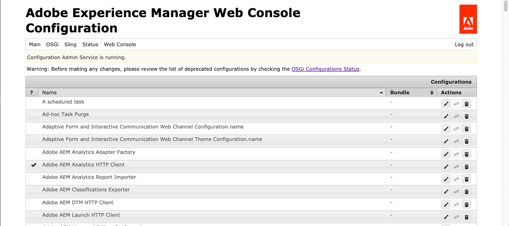

# Sobre a configuração do Cloud Service Dynamic Media {#configuring-dynamic-media}

Se você usar o Adobe Experience Manager para ambientes diferentes, como desenvolvimento, armazenamento temporário e produção em tempo real, configure o Dynamic Media Cloud Service para cada um desses ambientes.

Consulte também [Configurar uma conta de alias da empresa no Dynamic Media](/help/assets/dynamic-media/dm-alias-account.md)

## Diagrama de arquitetura do Dynamic Media {#architecture-diagram-of-dynamic-media}

O diagrama de arquitetura a seguir descreve como o Dynamic Media funciona.

Com a nova arquitetura, o Experience Manager é responsável pelos ativos de origem principal e sincroniza com o Dynamic Media para o processamento e a publicação de ativos:

1. Quando o ativo de origem principal é carregado para o Adobe Experience Manager as a Cloud Service, ele é replicado para o Dynamic Media. Nesse ponto, o Dynamic Media lida com todo o processamento de ativos e a geração de representações, como a codificação de vídeo e as variantes dinâmicas de uma imagem.
1. Depois que as representações são geradas, o Experience Manager as a Cloud Service pode acessar e pré-visualizar com segurança as representações remotas do Dynamic Media (nenhum binário é enviado de volta para a instância as a Cloud Service do Experience Manager).
1. Depois que o conteúdo está pronto para publicação e aprovação, ele aciona o serviço do Dynamic Media para enviar conteúdo aos servidores de entrega e armazenar em cache o conteúdo na CDN (Content Delivery Network).

>[!NOTE]
>
>A lista de recursos a seguir requer que você use a CDN integrada fornecida com o Adobe Experience Manager - Dynamic Media. Nenhum outro CDN personalizado é compatível com esses recursos.
>
>* [Imagem inteligente](/help/assets/dynamic-media/imaging-faq.md)
>* [Invalidação de cache](/help/assets/dynamic-media/invalidate-cdn-cache-dynamic-media.md)
>* [Proteção de hotlink](/help/assets/dynamic-media/hotlink-protection.md)
>* [Entrega de conteúdo HTTP/2](/help/assets/dynamic-media/http2faq.md)
>* Redirecionamento de URL no nível da CDN
>* Akamai ChinaCDN (para entrega ideal na China)

<!-- OBSOLETE CONTENT

## (Optional) Migrating Dynamic Media presets and configurations from 6.3 to 6.5 Zero Downtime {#optional-migrating-dynamic-media-presets-and-configurations-from-to-zero-downtime}

If you are upgrading Experience Manager as a Cloud Service Dynamic Media from 6.3 to 6.4 or 6.5 (which now includes the ability for zero downtime deployments), you are required to run the following curl command to migrate all your presets and configurations from `/etc` to `/conf` in CRXDE Lite.

>[!NOTE]
>
>If you run your Experience Manager as a Cloud Service instance in compatibility mode--that is, you have the compatibility packaged installed--you do not need to run these commands.

For all upgrades, either with or without the compatibility package, you can copy the default, out-of-the-box viewer presets that originally came with Dynamic Media by running the following Linux curl command:

`curl -u admin:admin -X POST https://<server_address>:<server_port>/libs/settings/dam/dm/presets/viewer.pushviewerpresets.json`

To migrate any custom viewer presets and configurations that you have created from `/etc` to `/conf`, run the following Linux curl command:

`curl -u admin:admin -X POST https://<server_address>:<server_port>/libs/settings/dam/dm/presets.migratedmcontent.json`

-->

## Criar uma configuração do Dynamic Media no Cloud Service {#configuring-dynamic-media-cloud-services}

<!-- **Before you creating a Dynamic Media Configuration in Cloud Services**: After you receive your provisioning email with Dynamic Media credentials, you must open the [Dynamic Media Classic desktop application](https://experienceleague.adobe.com/docs/dynamic-media-classic/using/getting-started/signing-out.html#getting-started), then sign in to your account to change your password. The password provided in the provisioning email is system-generated and intended to be a temporary password only. It is important that you update the password so that Dynamic Media Cloud Service is set up with the correct credentials. -->

1. Em Experience Manager as a Cloud Service, selecione o logotipo Experience Manager as a Cloud Service para acessar o console de navegação global.
1. À esquerda do console, selecione o ícone Ferramentas e vá para **[!UICONTROL Cloud Service > Configuração do Dynamic Media]**.
1. Na página Navegador de configuração do Dynamic Media, no painel esquerdo, selecione **[!UICONTROL global]** (não selecione o ícone de pasta à esquerda de **[!UICONTROL global]**). Em seguida, selecione **[!UICONTROL Criar]**.
1. No **[!UICONTROL Criar configuração do Dynamic Media]** , digite o título, o endereço de email da conta da Dynamic Media e a senha do administrador da empresa da conta da Dynamic Media e selecione sua região. Essas informações são fornecidas pelo Adobe no e-mail de provisionamento. Entre em contato com o Suporte ao cliente do Adobe se não receber esse email.
1. Selecionar **[!UICONTROL Conectar-se ao Dynamic Media]**.
1. No **[!UICONTROL Alterar senha]** caixa de diálogo, no campo **[!UICONTROL Nova senha]** insira uma nova senha que contenha de 8 a 25 caracteres. A senha deve conter pelo menos um dos seguintes itens:

   * Letra maiúscula
   * Letra minúscula
   * Número
   * Caractere especial: `# $ & . - _ : { }`

   A variável **[!UICONTROL Senha atual]** O campo é intencionalmente pré-preenchido e ocultado da interação.

   Se necessário, você pode verificar a ortografia de uma senha digitada ou digitada novamente selecionando o ícone de olho da senha para revelar a senha. Selecione o ícone novamente para ocultar a senha.

1. No **[!UICONTROL Repetir senha]** , digite novamente a nova senha e selecione **[!UICONTROL Concluído]**.

   A nova senha é salva ao selecionar **[!UICONTROL Salvar]** no canto superior direito da **[!UICONTROL Criar configuração do Dynamic Media]** página.

   Se você selecionou **[!UICONTROL Cancelar]** no **[!UICONTROL Alterar senha]** , você ainda deverá digitar uma nova senha ao salvar a configuração do Dynamic Media criada.

   Consulte também [Altere a senha para Dynamic Media](#change-dm-password).

1. Quando a conexão for bem-sucedida, você poderá definir o seguinte:

   | Propriedade | Descrição |
   |---|---|
   | Empresa | O nome da conta do Dynamic Media. **Importante**: somente uma configuração Dynamic Media no Cloud Service é compatível em uma instância de Experience Manager; não adicione mais de uma configuração. Várias configurações do Dynamic Media em uma instância do Experience Manager são _não_ suportado ou recomendado pelo Adobe.<!-- CQDOC-19579 and CQDOC-19612 --> Consulte também [Configurar uma conta de alias da empresa no Dynamic Media](/help/assets/dynamic-media/dm-alias-account.md). |
   | Caminho da pasta raiz da empresa | Caminho da pasta raiz da sua empresa. |
   | Publicar ativos | Você pode escolher entre as três opções a seguir: **[!UICONTROL Imediatamente ]**- Quando os ativos são carregados, o sistema assimila os ativos e fornece o URL/Incorporar instantaneamente. Não há necessidade de intervenção do usuário para publicar ativos. **[!UICONTROL Na ativação]** - Primeiro, publique explicitamente o ativo antes que um link de URL/Incorporação seja fornecido. **[!UICONTROL Publicação seletiva ]**- Os ativos são publicados automaticamente apenas para visualização segura. Eles também podem ser publicados explicitamente no Experience Manager as a Cloud Service sem publicação no DMS7 para entrega no domínio público. No futuro, essa opção pretende publicar ativos no Experience Manager as a Cloud Service e publicar ativos na Dynamic Media, mutuamente exclusivos entre si. Ou seja, você pode publicar ativos no DMS7 para usar recursos como Recorte inteligente ou representações dinâmicas. Ou você pode publicar ativos exclusivamente no Experience Manager as a Cloud Service para visualização; esses mesmos ativos não são publicados no DMS7 para entrega no domínio público. |
   | Servidor de visualização seguro | Permite especificar o caminho do URL para o servidor de visualização de representações seguras. Ou seja, depois que as representações são geradas, o Experience Manager as a Cloud Service pode acessar e pré-visualizar com segurança as representações remotas do Dynamic Media (nenhum binário é enviado de volta para a instância as a Cloud Service do Experience Manager). A menos que você tenha uma organização especial para usar o servidor de sua própria empresa ou um servidor especial, a Adobe recomenda que você deixe essa configuração conforme especificado. |
   | Sincronizar todo o conteúdo | Selecionado por padrão. Desmarque essa opção se desejar incluir ou excluir seletivamente ativos da sincronização com o Dynamic Media. Desmarcar essa opção permite escolher entre os dois modos de sincronização do Dynamic Media a seguir: **[!UICONTROL Modo de sincronização do Dynamic Media]** **[!UICONTROL Ativar por padrão ]**- A configuração é aplicada a todas as pastas por padrão, a menos que você marque uma pasta especificamente para exclusão. <!-- you can then deselect the folders that you do not want the configuration applied to.--> **[!UICONTROL Desabilitado por padrão]** - A configuração não é aplicada a nenhuma pasta até que você marque explicitamente uma pasta selecionada para sincronização com o Dynamic Media. Para marcar uma pasta selecionada para sincronização com o Dynamic Media, selecione uma pasta de ativos e, na barra de ferramentas, selecione **[!UICONTROL Propriedades]**. No **[!UICONTROL Detalhes]** , na guia **[!UICONTROL Modo de sincronização do Dynamic Media]** escolha entre as três opções a seguir. Quando terminar, selecione **[!UICONTROL Salvar]**. _Lembre-se: essas três opções não estarão disponíveis se você tiver selecionado **Sincronizar todo o conteúdo**anterior._ Consulte também [Trabalhar com publicação seletiva no nível da pasta no Dynamic Media](/help/assets/dynamic-media/selective-publishing.md). **[!UICONTROL Herdado ]**- Nenhum valor de sincronização explícito na pasta. Em vez disso, a pasta herda o valor de sincronização de uma de suas pastas ancestrais ou o modo padrão na configuração da nuvem. O status detalhado de herdado é exibido por meio de uma dica de ferramenta. **[!UICONTROL Ativar para subpastas]** - Incluir tudo nesta subárvore para sincronização com o Dynamic Media. As configurações específicas da pasta substituem o modo padrão na configuração da nuvem. **[!UICONTROL Desativado para subpastas ]**- Excluir tudo nesta subárvore da sincronização com o Dynamic Media. |

   >[!NOTE]
   >
   >Não há suporte para o controle de versão no Dynamic Media. Além disso, a ativação atrasada se aplica somente se **[!UICONTROL Publicar ativos]** na página Editar configuração do Dynamic Media estiver definida como **[!UICONTROL Na ativação]**. E, em seguida, somente até a primeira vez que o ativo for ativado.
   >
   >
   >Depois que um ativo é ativado, todas as atualizações são publicadas imediatamente no Delivery S7.

   

1. Selecionar **[!UICONTROL Salvar]**. A nova senha e configuração do Dynamic Media são salvas. Se você selecionou **[!UICONTROL Cancelar]** em vez disso, não ocorre atualização de senha.
1. No **[!UICONTROL Configuração do Dynamic Media]** caixa de diálogo, selecione **[!UICONTROL OK]** para iniciar a configuração.

   >[!IMPORTANT]
   >
   >Quando a nova configuração do Dynamic Media é concluída, você recebe uma notificação de status na Caixa de entrada do Experience Manager as a Cloud Service.
   >
   >Essa notificação da Caixa de entrada informa se a configuração foi bem-sucedida ou não.
   > Consulte [Solução de problemas de uma nova configuração do Dynamic Media](#troubleshoot-dm-config) e [Sua Caixa de entrada](/help/sites-cloud/authoring/getting-started/inbox.md) para obter mais informações.

1. Para visualizar com segurança o conteúdo do Dynamic Media antes de ele ser publicado, o Experience Manager as a Cloud Service usa a validação baseada em token e, portanto, o Experience Manager Author visualiza o conteúdo do Dynamic Media por padrão. No entanto, é possível *➡ incluir na lista de permissões* Mais IPs para fornecer aos usuários acesso a visualizações seguras de conteúdo. Para configurar esta ação no Experience Manager as a Cloud Service, consulte [Configurar o Dynamic Media Publish Setup para o Servidor de imagens - Guia Segurança](/help/assets/dynamic-media/dm-publish-settings.md#security-tab). <!-- To securely preview Dynamic Media content before it gets published, you must "allowlist" the Experience Manager as a Cloud Service author instance to connect to Dynamic Media. To set up this action, do the following: -->

<!--
    * Open the [Dynamic Media Classic desktop application](https://experienceleague.adobe.com/docs/dynamic-media-classic/using/getting-started/signing-out.html#getting-started), then sign in to your account. Your credentials and sign-in details were provided by Adobe at the time of provisioning. If you do not have this information, contact Adobe Customer Support.
    * On the navigation bar near the upper right corner of the page, go to **[!UICONTROL Setup]** > **[!UICONTROL Application Setup]** > **[!UICONTROL Publish Setup]** > **[!UICONTROL Image Server]**.
    * On the Image Server Publish page, in the **[!UICONTROL Publish Context]** drop-down list, select **[!UICONTROL Test Image Serving]**.
    * For the Client Address Filter, select **[!UICONTROL Add]**.
    * To enable (turn on) the address, select the check box, then enter the IP address of the Experience Manager Author instance (not Dispatcher IP).
    * Select **[!UICONTROL Save]**. -->

Agora você concluiu a configuração básica; você está pronto para usar o Dynamic Media.

Se quiser personalizar ainda mais sua configuração, como ativar permissões de ACL (Access Control List, Lista de controle de acesso), você poderá, opcionalmente, concluir qualquer uma das tarefas em [Definir configurações avançadas no Dynamic Media](#optional-configuring-advanced-settings-in-dynamic-media-scene-mode).

### Solução de problemas de uma nova configuração do Dynamic Media {#troubleshoot-dm-config}

Quando uma nova configuração do Dynamic Media é concluída, você recebe uma notificação de status na Caixa de entrada do Experience Manager as a Cloud Service. Essa notificação informa se a configuração foi bem-sucedida ou não, como é visto nas respectivas imagens da Caixa de entrada a seguir.

Consulte também [Sua Caixa de entrada](/help/sites-cloud/authoring/getting-started/inbox.md).

**Para solucionar problemas de uma nova configuração do Dynamic Media:**

1. Próximo ao canto superior direito da página do Experience Manager as a Cloud Service, selecione o ícone de sino e **[!UICONTROL Exibir todos]**.
1. Na página Caixa de entrada, selecione a notificação de sucesso para ler uma visão geral do status e dos logs da configuração.

   Se a configuração falhar, selecione a notificação de falha semelhante à seguinte captura de tela.

   

1. No **[!UICONTROL DMSETUP]** revise os detalhes de configuração que descrevem a falha. Em particular, tome nota de qualquer mensagem de erro ou código de erro. Entre em contato com o Suporte ao cliente da Adobe com essa informação.

   

### Altere a senha para Dynamic Media {#change-dm-password}

A expiração da senha no Dynamic Media está definida como 100 anos a partir da data atual do sistema.

A senha deve conter pelo menos um dos seguintes itens:

* Letra maiúscula
* Letra minúscula
* Número
* Caractere especial: `# $ & . - _ : { }`

Se necessário, você pode verificar a ortografia de uma senha digitada ou digitada novamente selecionando o ícone de olho da senha para revelar a senha. Selecione o ícone novamente para ocultar a senha.

A senha alterada é salva ao selecionar **[!UICONTROL Salvar]** no canto superior direito da **[!UICONTROL Editar configuração do Dynamic Media]** página.

1. Em Experience Manager as a Cloud Service, selecione o logotipo Experience Manager as a Cloud Service para acessar o console de navegação global.
1. À esquerda do console, selecione o ícone Ferramentas e vá para **[!UICONTROL Cloud Service > Configuração do Dynamic Media]**.
1. Na página Navegador de configuração do Dynamic Media, no painel esquerdo, selecione **[!UICONTROL global]**. Não selecione o ícone de pasta à esquerda de **[!UICONTROL global]**. Em seguida, selecione **[!UICONTROL Editar]**.
1. No **[!UICONTROL Editar configuração do Dynamic Media]** página, logo abaixo do **[!UICONTROL Senha]** selecione **[!UICONTROL Alterar senha]**.
1. No **[!UICONTROL Alterar senha]** faça o seguinte:

   * No **[!UICONTROL Nova senha]** insira uma nova senha.

     A variável **[!UICONTROL Senha atual]** O campo é intencionalmente pré-preenchido e ocultado da interação.

   * No **[!UICONTROL Repetir senha]** , digite novamente a nova senha e selecione **[!UICONTROL Concluído]**.

1. No canto superior direito da **[!UICONTROL Editar configuração do Dynamic Media]** selecione **[!UICONTROL Salvar]** e selecione **[!UICONTROL OK]**.

## (Opcional) Definir configurações avançadas no Dynamic Media{#optional-configuring-advanced-settings-in-dynamic-media-scene-mode}

Para personalizar ainda mais a configuração do Dynamic Media ou otimizar seu desempenho, você pode concluir um ou mais dos seguintes procedimentos _opcional_ tarefas:

* [(Opcional) Ativar permissões de ACL no Dynamic Media](#optional-enable-acl)
* [(Opcional) Definição e configuração das configurações do Dynamic Media](#optional-setup-and-configuration-of-dynamic-media-scene-mode-settings)
* [(Opcional) Ajuste o desempenho do Dynamic Media](#optional-tuning-the-performance-of-dynamic-media-scene-mode)

<!--

* [(Optional) Filtering assets for replication](#optional-filtering-assets-for-replication)

-->

### (Opcional) Ativar permissões da Lista de controle de acesso no Dynamic Media {#optional-enable-acl}

Quando você executa o Dynamic Media no AEM, ele é encaminhado no momento `/is/image` Solicitações para o Secure Preview Image Serving sem verificar as permissões da ACL (Access Control List, Lista de Controle de Acesso) no PlatformServerServlet. Você pode, no entanto, _habilitar_ Permissões de ACL. Ao fazê-lo, a autoridade `/is/image` solicitações. Se um usuário não estiver autorizado a acessar o ativo, um erro &quot;403 - Proibido&quot; será exibido.

**Para ativar permissões de ACL no Dynamic Media:**

1. No Experience Manager, navegue até **[!UICONTROL Ferramentas]** > **[!UICONTROL Operações]** > **[!UICONTROL Console da Web]**.

   

1. Uma nova guia do navegador é aberta na guia **[!UICONTROL Configuração do console da Web do Adobe Experience Manager]** página.

   

1. Na página, role até o nome _Adobe CQ Scene7 PlatformServer_.

1. À direita do nome, selecione o ícone de lápis (**[!UICONTROL Editar os valores de configuração]**).

1. No **com.adobe.cq.dam.s7imaging.impl.ps.PlatformServerServlet.name** marque a caixa de seleção das duas configurações a seguir:

   * `com.adobe.cq.dam.s7imaging.impl.ps.PlatformServerServlet.cache.enable.name` - Quando ativada, essa configuração armazena em cache os resultados da permissão por dois minutos (padrão) para salvar.
   * `com.adobe.cq.dam.s7imaging.impl.ps.PlatformServerServlet.validate.userAccess.name` - Quando ativada, essa configuração valida o acesso de um usuário enquanto ele visualiza ativos por meio do Dynamic Media Image Server.

   

1. Próximo ao canto inferior direito da página, selecione **[!UICONTROL Salvar]**.

### (Opcional) Definição e configuração das configurações do Dynamic Media {#optional-setup-and-configuration-of-dynamic-media-scene-mode-settings}

Use a interface do Dynamic Media Classic para alterar as configurações do Dynamic Media.

<!-- Some of the tasks above require that you open the [Dynamic Media Classic desktop application](https://experienceleague.adobe.com/docs/dynamic-media-classic/using/getting-started/signing-out.html#getting-started), then sign in to your account. -->

As tarefas de instalação e configuração incluem o seguinte:

* [Configurar o Dynamic Media Publish para o servidor de imagens](#publishing-setup-for-image-server)
* [Definir configurações gerais do Dynamic Media](#configuring-application-general-settings)
* [Configurar gerenciamento de cores](#configuring-color-management)
* [Editar tipos MIME para formatos compatíveis](#editing-mime-types-for-supported-formats)
* [Adicionar tipos MIME para formatos não suportados](#adding-mime-types-for-unsupported-formats)
<!-- OBSOLETE BUT LEAVE FOR POSSIBLE FUTURE* [Creating batch set presets to auto-generate Image Sets and Spin Sets](#creating-batch-set-presets-to-auto-generate-image-sets-and-spin-sets) -->

#### Configurar o Dynamic Media Publish para o servidor de imagens {#publishing-setup-for-image-server}

A página Configuração de publicação do Dynamic Media estabelece configurações padrão que determinam como os ativos são entregues dos servidores Adobe Dynamic Media para sites ou aplicativos.

Consulte [Configurar o Dynamic Media Publish para o servidor de imagens](/help/assets/dynamic-media/dm-publish-settings.md).

#### Definir configurações gerais do Dynamic Media {#configuring-application-general-settings}

Configurar o Dynamic Media **[!UICONTROL Nome do servidor de publicação]** O URL e o **[!UICONTROL Nome do servidor de origem]** URL. Você também pode especificar **[!UICONTROL Carregar no aplicativo]** configurações e **[!UICONTROL Opções de upload padrão]** tudo com base em seu caso de uso específico.

Consulte [Definir configurações gerais do Dynamic Media](/help/assets/dynamic-media/dm-general-settings.md).

#### Configurar gerenciamento de cores {#configuring-color-management}

O gerenciamento de cores do Dynamic Media permite corrigir as cores dos ativos. Com a correção de cores, os ativos assimilados mantêm o espaço de cores (RGB, CMYK, Cinza) e o perfil de cores incorporado. Quando você solicita uma representação dinâmica, a cor da imagem é corrigida no espaço de cores de destino usando a saída CMYK, RGB ou Cinza.

Consulte [Configurar predefinições da imagem](/help/assets/dynamic-media/managing-image-presets.md).

Para configurar as propriedades de cor padrão para ativar a correção de cores ao solicitar imagens:

1. Abra o [aplicativo de desktop do Dynamic Media Classic](https://experienceleague.adobe.com/docs/dynamic-media-classic/using/getting-started/signing-out.html#getting-started), em seguida, faça logon em sua conta usando as credenciais fornecidas durante o provisionamento.
1. Ir para **[!UICONTROL Configuração > Configuração do aplicativo]**.
1. Expanda a área **[!UICONTROL Publicar configuração]** e selecione **[!UICONTROL Servidor de imagens]**. Defina **[!UICONTROL Publicar contexto]** como **[!UICONTROL Serviço de imagem]** ao definir padrões para instâncias de publicação.
1. Role até a propriedade que você deve alterar, por exemplo, uma propriedade na **[!UICONTROL Atributos de gerenciamento de cores]** área.
É possível definir as seguintes propriedades de correção de cores:

   | Propriedade | Descrição |
   |---|---|
   | Espaço de cor padrão CMYK | Nome do perfil de cores CMYK padrão. |
   | Espaço de cor padrão de escala de cinza | Nome do perfil de cor cinza padrão. |
   | Espaço de cor padrão do RGB | Nome do perfil de cores de RGB padrão. |
   | Tentativa de renderização da conversão de cores | Especifica a intenção de renderização. Os valores aceitáveis são: **[!UICONTROL perceptivo]**, **[!UICONTROL colométrica relativa]**, **[!UICONTROL saturação]**, **[!UICONTROL colométrica absoluta]**. Adobe recomenda **[!UICONTROL relativo]** como padrão. |

1. Selecione **[!UICONTROL Salvar]**.

Por exemplo, você pode definir o **[!UICONTROL Espaço de cor padrão RGB]** como *sRGB* e o **[!UICONTROL Espaço de cor padrão CMYK]** como *WebCoated*.

Isso faria o seguinte:

* Ativa a correção de cores para imagens RGB e CMYK.
* Supõe-se que as imagens de RGB que não têm um perfil de cores estejam no estado *sRGB* espaço de cores.
* Supõe-se que as imagens CMYK que não têm um perfil de cores estejam em *Revestido pela Web* espaço de cores.
* Representações dinâmicas que retornam a saída de RGB, retornam na variável *sRGB* espaço de cores.
* Representações dinâmicas que retornam saída CMYK, retornam na variável *Revestido pela Web* espaço de cores.

#### Editar tipos MIME para formatos compatíveis {#editing-mime-types-for-supported-formats}

Você pode definir quais tipos de ativos são processados pelo Dynamic Media e personalizar os parâmetros avançados de processamento de ativos. Por exemplo, você pode especificar parâmetros de processamento de ativos para fazer o seguinte:

* Converter um Adobe PDF em um ativo de eCatalog.
* Converta um documento do Adobe Photoshop (.PSD) em um ativo de modelo de banner para personalização.
* Rasterize um arquivo Adobe Illustrator (.AI) ou um arquivo PostScript® encapsulado Adobe Photoshop (.EPS).
* [Perfis de vídeo](/help/assets/dynamic-media/video-profiles.md) e [Perfis de imagem](/help/assets/dynamic-media/image-profiles.md) pode ser usado para definir o processamento de vídeos e imagens, respectivamente.

Consulte [Fazer upload de ativos](/help/assets/add-assets.md).

**Para editar tipos MIME para formatos compatíveis:**

1. Faça logon no Experience Manager as a Cloud Service como administrador de produto.
1. Em Experience Manager as a Cloud Service , selecione o logotipo do Experience Manager as a Cloud Service para acessar o console de navegação global e, em seguida, vá para **[!UICONTROL Geral > CRXDE Lite]**.

   Se você não tiver acesso ao CRXDE Lite, consulte [Utilização do CRXDE Lite](/help/implementing/developing/tools/crxde.md).

1. No painel à esquerda, navegue até o seguinte:

   `/conf/global/settings/cloudconfigs/dmscene7/jcr:content/mimeTypes`

   

1. Na pasta mimeTypes, selecione um tipo MIME.
1. No lado direito da página de CRXDE Lite, na parte inferior:

   * Selecione duas vezes a variável **[!UICONTROL habilitado]** campo. Por padrão, todos os tipos MIME do ativo são ativados (definidos como **[!UICONTROL true]**), o que significa que os ativos são sincronizados com o Dynamic Media para processamento. Se quiser excluir esse tipo de ativo MIME de ser processado, altere essa configuração para **[!UICONTROL false]**.

   * Seleção dupla **[!UICONTROL jobParam]** para abrir o campo de texto associado. Consulte [Tipos MIME suportados](/help/assets/file-format-support.md) para obter uma lista de valores de parâmetro de processamento permitidos que você pode usar para determinado tipo MIME.

1. Siga uma das seguintes opções:
   * Repita as etapas 3 a 4 para editar mais tipos MIME.
   * Na barra de menus da página do CRXDE Lite, selecione **[!UICONTROL Salvar tudo]**.

1. No canto superior esquerdo da página, selecione **[!UICONTROL CRXDE Lite]** para retornar ao Experience Manager as a Cloud Service.

#### Adicionar tipos MIME para formatos não suportados {#adding-mime-types-for-unsupported-formats}

Você pode adicionar tipos MIME personalizados para formatos não compatíveis com o Experience Manager Assets. Para garantir que qualquer novo nó adicionado no CRXDE Lite não seja excluído pelo Experience Manager, mova o tipo MIME antes de `image_`. Além disso, verifique se o valor ativado está definido como **[!UICONTROL false]**.

**Para adicionar tipos MIME para formatos não suportados:**

1. Faça logon no Experience Manager as a Cloud Service como administrador de produto.
1. No Experience Manager as a Cloud Service, acesse **[!UICONTROL Ferramentas > Operações > Console da Web]**.

   

1. Uma nova guia do navegador é aberta na guia **[!UICONTROL Configuração do console da Web do Adobe Experience Manager]** página.

   

1. Na página, role para baixo até o nome *Adobe CQ Scene7 Asset MIME type Service*, como visto na seguinte captura de tela. À direita do nome, selecione a variável **[!UICONTROL Editar os valores de configuração]** (lápis).

   

1. No **Serviço de tipo MIME do ativo do Adobe CQ Scene7** selecione qualquer ícone de sinal de mais &lt;+>. O local na tabela em que você seleciona o sinal de adição para adicionar o novo tipo MIME é trivial.

   

1. Tipo `DWG=image/vnd.dwg` no campo de texto vazio que você acabou de adicionar.

   A variável `DWG=image/vnd.dwg` O tipo MIME é somente para fins de amostra. O tipo MIME adicionado aqui pode ser qualquer outro formato não suportado.

   

1. No canto inferior direito da página, selecione **[!UICONTROL Salvar]**.

   Nesse ponto, é possível fechar a guia do navegador que tem a página aberta Configuração do console da Web do Adobe Experience Manager.

1. Retorne à guia do navegador que tem o console Experience Manager as a Cloud Service aberto.
1. No Experience Manager as a Cloud Service, acesse **[!UICONTROL Ferramentas > Geral > CRXDE Lite]**.

   Se você não tiver acesso ao CRXDE Lite, consulte [Utilização do CRXDE Lite](/help/implementing/developing/tools/crxde.md).

   

1. No painel à esquerda, navegue até o seguinte:

   `conf/global/settings/cloudconfigs/dmscene7/jcr:content/mimeTypes`

1. Arraste o tipo MIME `image_vnd.dwg` e solte-o diretamente acima `image_` na árvore, como visto na captura de tela a seguir.

   

1. Com o tipo MIME `image_vnd.dwg` ainda selecionado, no **[!UICONTROL Propriedades]** , na guia **[!UICONTROL habilitado]** linha, abaixo de **[!UICONTROL Valor]** cabeçalho da coluna, selecione o valor duas vezes. A variável **[!UICONTROL Valor]** é aberta.
1. Tipo `false` no campo (ou selecione **[!UICONTROL false]** na lista suspensa).

   

1. Próximo ao canto superior esquerdo da página CRXDE Lite, selecione **[!UICONTROL Salvar tudo]**.

### (Opcional) Ajuste o desempenho do Dynamic Media {#optional-tuning-the-performance-of-dynamic-media-scene-mode}

Para manter o Dynamic Media <!--(with `dynamicmedia_scene7` run mode)--> sem problemas, o Adobe recomenda as seguintes dicas de ajuste de desempenho/escalabilidade de sincronização:

* [Atualizar os parâmetros de Trabalho predefinidos para processamento de diferentes formatos de arquivo](#update-job-para).
* [Atualizar as threads de trabalho predefinidas da Fila de fluxo de trabalho do Granite (ativos de vídeo)](#update-granite-workflow-queue-worker-threads-video)
* [Atualizar as threads de trabalho predefinidas da Fila de fluxo de trabalho transitório do Granite (imagens e ativos que não sejam de vídeo)](#update-granite-transient-workflow-queue-worker-threads-images).
* [Atualizar o máximo de conexões de upload para o servidor do Dynamic Media Classic (Scene7)](#update-max-s7-upload-connections).

#### Atualizar os parâmetros de Trabalho predefinidos para processamento de diferentes formatos de arquivo {#update-job-para}

Você pode ajustar parâmetros de job para um processamento mais rápido ao fazer upload de arquivos. Por exemplo, se você fizer upload de arquivos PSD, mas não quiser processá-los como modelos, poderá definir a extração de camada como false (desativado). Nesse caso, o parâmetro de job ajustado aparece da seguinte maneira: `process=None&createTemplate=false`.

Caso deseje ativar a criação de template, use os seguintes parâmetros: `process=MaintainLayers&layerNaming=AppendName&createTemplate=true`.

<!-- THIS PARAGRAPH WAS REPLACED WITH THE TWO PARAGRAPHS DIRECTLY ABOVE BASED ON CQDOC-17657 You can tune job parameters for faster processing when you upload files. For example, if you are uploading PSD files, but do not want to process them as templates, you can set layer extraction to false (off). In such case, the tuned job parameter would appear as `process=None&createTemplate=false`. -->

O Adobe recomenda o uso dos seguintes parâmetros de job &quot;ajustados&quot; para arquivos PDF, PostScript® e PSD:

| Tipo de arquivo | Parâmetros de processo recomendados |
| ---| ---|
| PDF | `pdfprocess=Rasterize&resolution=150&colorspace=Auto&pdfbrochure=false&keywords=false&links=false` |
| PostScript® | `psprocess=Rasterize&psresolution=150&pscolorspace=Auto&psalpha=false&psextractsearchwords=false&aiprocess=Rasterize&airesolution=150&aicolorspace=Auto&aialpha=false` |
| PSD | `process=None&layerNaming=AppendName&anchor=Center&createTemplate=false&extractText=false&extendLayers=false` |

<!-- CQDOC-17657 for PSD entry in table above -->

Para atualizar qualquer um desses parâmetros, consulte [Edição de tipos MIME para formatos compatíveis](#editing-mime-types-for-supported-formats).

Consulte também [Adição de tipos MIME para formatos não compatíveis](#adding-mime-types-for-unsupported-formats).

#### Atualizar as threads de trabalho predefinidas da Fila de fluxo de trabalho do Granite (ativos de vídeo) {#update-granite-workflow-queue-worker-threads-video}

A fila de Fluxo de trabalho do Granite é usada para fluxos de trabalho não transitórios. No Dynamic Media, ele processava vídeos com o **[!UICONTROL Codificação de vídeo Dynamic Media]** fluxo de trabalho.

>[!NOTE]
>
>Você deve estar conectado ao Experience Manager as a Cloud Service como administrador do produto para concluir essa tarefa.

Se você não tiver acesso ao OSGi, consulte [Configuração OSGi](/help/implementing/developing/components/overview.md#osgi-configuration).

**Para atualizar as threads de trabalho predefinidas da Fila de fluxo de trabalho do Granite (ativos de vídeo):**

1. Navegue até `https://<server>/system/console/configMgr` e pesquisar **Fila: Fila de fluxo de trabalho do Granite**.

   >[!NOTE]
   >
   >Uma pesquisa de texto é necessária em vez de um URL direto, pois o PID OSGi é gerado dinamicamente.

1. No **[!UICONTROL Máximo de Trabalhos Paralelos]** altere o número para o valor desejado.

   Por padrão, o número máximo de trabalhos paralelos depende do número de núcleos de CPU disponíveis. Por exemplo, em um servidor de 4 núcleos, ele atribui dois threads de trabalho. (Um valor entre 0,0 e 1,0 é baseado em proporção ou qualquer número maior que um atribui o número de threads de trabalho.)

   Para a maioria dos casos de uso, a configuração padrão 0.5 é suficiente.

   

1. Selecione **[!UICONTROL Salvar]**.

#### Atualizar os threads de trabalho predefinidos da Fila de Fluxo de Trabalho Transitório do Granite {#update-granite-transient-workflow-queue-worker-threads-images}

A fila de Fluxo de trabalho de trânsito do Granite é usada para o **[!UICONTROL Ativo de atualização DAM]** fluxo de trabalho. No Dynamic Media, é usado para assimilação e processamento de ativos de imagem e não de vídeo.

>[!NOTE]
>
>Você deve estar conectado ao Experience Manager as a Cloud Service como administrador do produto para concluir essa tarefa.

**Para atualizar as threads de trabalho da fila de Fluxo de trabalho transitório do Granite predefinidas:**

1. Navegue até a **Configuração do console da Web do Adobe Experience Manager** em `http://<host>:<port>/system/console/configMgr`
1. Pesquisar por **Fila: Fila de fluxo de trabalho transitório do Granite**.

   >[!NOTE]
   >
   >Uma pesquisa de texto é necessária em vez de um URL direto, pois o PID OSGi é gerado dinamicamente.

1. No **[!UICONTROL Máximo de Trabalhos Paralelos]** altere o número para o valor desejado.

   Você pode aumentar **[!UICONTROL Máximo de Trabalhos Paralelos]** para oferecer suporte adequado ao upload pesado de arquivos para o Dynamic Media. O valor exato depende da capacidade do hardware. Em determinados cenários, como uma migração inicial ou um upload em massa único, você pode usar um valor grande. No entanto, esteja ciente de que usar um valor alto (como o dobro do número de núcleos) pode ter efeitos negativos em outras atividades simultâneas. Dessa forma, teste e ajuste o valor com base em seu caso de uso específico.

<!--    By default, the maximum number of parallel jobs depends on the number of available CPU cores. For example, on a 4-core server, it assigns 2 worker threads. (A value between 0.0 and 1.0 is ratio based, or any numbers greater than 1 will assign the number of worker threads.)

   Adobe recommends that 32 **[!UICONTROL Maximum Parallel Jobs]** be configured to adequately support heavy upload of files to Dynamic Media Classic. -->

1. Selecione **[!UICONTROL Salvar]**.

#### Atualizar o máximo de conexões de upload para o servidor do Dynamic Media Classic (Scene7) {#update-max-s7-upload-connections}

A configuração Fazer upload de conexão do Dynamic Media Classic (Scene7) sincroniza ativos Experience Manager com servidores Dynamic Media Classic.

>[!NOTE]
>
>Você deve estar conectado ao Experience Manager as a Cloud Service como administrador do produto para concluir essa tarefa.

**Para atualizar o máximo de conexões de upload para o servidor do Dynamic Media Classic (Scene7):**

1. Navegue até `https://<server>/system/console/configMgr/com.day.cq.dam.scene7.impl.Scene7UploadServiceImpl`
1. No **[!UICONTROL Número de conexões]** ou o campo **[!UICONTROL Tempo limite do trabalho ativo]** ou ambos, altere o número conforme desejado.

   A variável **[!UICONTROL Número de conexões]** a configuração controla o número máximo de conexões HTTP permitidas para o upload de Experience Manager para Dynamic Media. Normalmente, o valor predefinido de dez conexões é suficiente.

   A variável **[!UICONTROL Tempo limite do trabalho ativo]** determina o tempo de espera para que os ativos carregados do Dynamic Media sejam publicados no servidor de entrega. Esse valor é de 2100 segundos ou 35 minutos por padrão.

   Para a maioria dos casos de uso, a configuração de 2100 é suficiente.

   

1. Selecione **[!UICONTROL Salvar]**.

<!-- NOTE - OBSOLETE that customisations to replication agents to transform content are no longer used; the following content is obsolete now 

### (Optional) Filtering assets for replication {#optional-filtering-assets-for-replication}

In non-Dynamic Media deployments, you replicate *all* assets (both images and video) from your Experience Manager as a Cloud Service author environment to the Experience Manager as a Cloud Service publish node. This workflow is necessary because the Experience Manager as a Cloud Service publish servers also deliver the assets.

However, in Dynamic Media deployments, because assets are delivered by way of the cloud service, there is no need to replicate those same assets to Experience Manager as a Cloud Service publish nodes. Such a "hybrid publishing" workflow avoids extra storage costs and longer processing times to replicate assets. Other content, such as Site pages, continue to be served from the Experience Manager as a Cloud Service publish nodes.

The filters provide a way for you to *exclude* assets from being replicated to the Experience Manager as a Cloud Service publish node.

#### Using default asset filters for replication {#using-default-asset-filters-for-replication}

If you are using Dynamic Media for imaging and/or video, then you can use the default filters that we provide as-is. The following filters are active by default:

<table>
 <tbody>
  <tr>
   <td> </td>
   <td><strong>Filter</strong></td>
   <td><strong>Mimetype</strong></td>
   <td><strong>Renditions</strong></td>
  </tr>
  <tr>
   <td>Dynamic Media Image Delivery</td>
   <td>
filter-images
 
filter-sets
 
 
 </td>
   <td>
Starts with <strong>image/</strong>
 
Contains <strong>application/</strong> and ends with <strong>set</strong>.
 </td>
   <td>The out-of-the-box "filter-images" (applies to single images assets, including interactive images) and "filter-sets" (applies to Spin Sets, Image Sets, Mixed Media Sets, and Carousel Sets) will:
    <ul>
     <li>Exclude from replication the original image and static image renditions.</li>
    </ul> </td>
  </tr>
  <tr>
   <td>Dynamic Media Video Delivery</td>
   <td>filter-video</td>
   <td>Starts with <strong>video/</strong></td>
   <td>The out-of-the-box "filter-video" will:
    <ul>
     <li>Exclude from replication the original video and static thumbnail renditions.    </li>
    </ul> </td>
  </tr>
 </tbody>
</table>

>[!NOTE]
>
>Filters apply to mime types and cannot be path specific.

#### Customizing asset filters for replication {#customizing-asset-filters-for-replication}

1. In Experience Manager as a Cloud Service, select the Experience Manager as a Cloud Service logo to access the global navigation console and select the **[!UICONTROL Tools > General > CRXDE Lite]**.
1. In the left folder tree, navigate to `/etc/replication/agents.author/publish/jcr:content/damRenditionFilters` to review the filters.

   

1. To define the Mime Type for the filter, you can locate the Mime Type as follows:

   In the left rail, expand `content > dam > <locate_your_asset> > jcr:content > metadata`, and then in the table, locate `dc:format`.

   The following graphic is an example of an asset's path to `dc:format`.

   

   Notice that the `dc:format` for the asset `Fiji Red.jpg` is `image/jpeg`.

   To have this filter apply to all images, regardless of their format, set the value to `image/*` where `*` is a regular expression that is applied to all images of any format.

   To have the filter apply only to images of the type JPEG, enter a value of `image/jpeg`.

1. Define what renditions you want to include or exclude from replication.

   Characters that you can use to filter for replication include the following:

<table>
 <tbody>
  <tr>
   <td><strong>Character to use</strong></td>
   <td><strong>How it filters assets for replication</strong></td>
  </tr>
  <tr>
   <td>*</td>
   <td>Wildcard character  </td>
  </tr>
  <tr>
   <td>+</td>
   <td>Includes assets for replication.</td>
  </tr>
  <tr>
   <td>-</td>
   <td>Excludes assets from replication.</td>
  </tr>
 </tbody>
</table>

   Navigate to `content/dam/<locate your asset>/jcr:content/renditions`.

   The following graphic is an example of an asset's renditions.

   

   If you only wanted to replicate the original, then you would enter `+original`.

   -->
