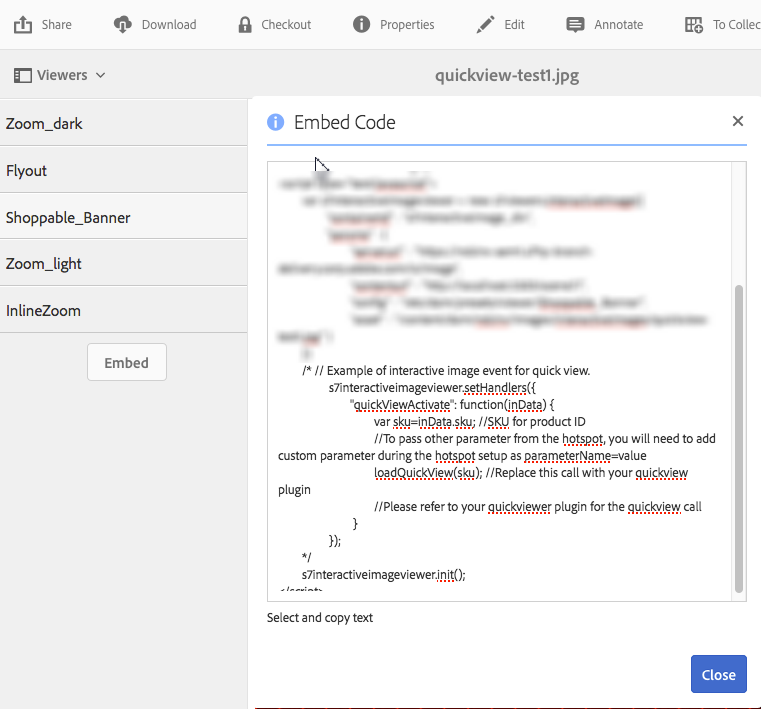

# Criar pop-ups personalizados usando o Quickview {#using-quickviews-to-create-custom-pop-ups}

O Quickview padrão é usado em experiências de comércio eletrônico, nas quais um pop-up é exibido com as informações do produto para impulsionar uma compra. No entanto, é possível acionar a exibição do conteúdo personalizado nas janelas pop-up. Dependendo do visualizador usado, os clientes podem selecionar um ponto de acesso, uma imagem em miniatura ou um mapa de imagem para ver informações ou conteúdo relacionado.

O Quickview é compatível com os seguintes visualizadores no Dynamic Media:

* Imagens interativas (pontos de acesso selecionáveis)
* Vídeo interativo (imagens em miniatura selecionáveis durante a reprodução do vídeo)
* Banners em carrossel (pontos de acesso selecionáveis ou mapas de imagem)

Embora a funcionalidade de cada visualizador seja diferente, o processo de criação de uma Visualização rápida é o mesmo em todos os três visualizadores compatíveis.

**Para criar pop-ups personalizados usando o Quickview:**

1. Crie uma visualização rápida para um ativo carregado.

   Normalmente, você cria uma Visualização rápida ao mesmo tempo em que edita um ativo para uso com o visualizador que está usando.

   <table>
    <tbody>
    <tr>
    <td><strong>Visualizador que você está usando</strong></td>
    <td><strong>Para criar a visualização rápida, conclua estas etapas</strong></td>
    </tr>
    <tr>
    <td>Imagens interativas</td>
    <td><a href="/help/assets/dynamic-media/interactive-images.md#adding-hotspots-to-an-image-banner" target="_blank">Adicionando hotspots a um banner de imagem</a>.</td>
    </tr>
    <tr>
    <td>Vídeos interativos</td>
    <td><a href="/help/assets/dynamic-media/interactive-videos.md#adding-interactivity-to-your-video" target="_blank">Adicionando interatividade ao seu vídeo</a>.</td>
    </tr>
    <tr>
    <td>Banners em carrossel</td>
    <td><a href="/help/assets/dynamic-media/carousel-banners.md#adding-hotspots-or-image-maps-to-an-image-banner" target="_blank">Adicionando pontos de acesso ou mapas de imagem a um banner</a>.<br /> </td>
    </tr>
    </tbody>
   </table>

1. Obtenha o código de inserção do visualizador para Integrar o visualizador no seu site.

   <table>
    <tbody>
    <tr>
    <td><strong>Visualizador que você está usando</strong><br /> </td>
    <td><strong>Para integrar o visualizador ao seu site, conclua estas etapas</strong></td>
    </tr>
    <tr>
    <td>Imagem interativa</td>
    <td><a href="/help/assets/dynamic-media/interactive-images.md#integrating-an-interactive-image-with-your-website" target="_blank">Integrando uma imagem interativa com seu site</a>.<br /> </td>
    </tr>
    <tr>
    <td>Vídeo interativo<br /> </td>
    <td><a href="/help/assets/dynamic-media/interactive-videos.md#integrating-an-interactive-video-with-your-website" target="_blank">Integrando um vídeo interativo ao seu site</a>.<br /> </td>
    </tr>
    <tr>
    <td>Banner do carrossel</td>
    <td><a href="/help/assets/dynamic-media/carousel-banners.md#adding-a-carousel-banner-to-your-website-page" target="_blank">Adicionando um banner de carrossel à página do seu site</a>.<br /> </td>
    </tr>
    </tbody>
   </table>

1. O visualizador usado precisa saber como usar o Quickview.

   O visualizador usa um manipulador chamado `QuickViewActive`.

   **Exemplo**
Suponha que você estava usando o seguinte exemplo de código incorporado na página da Web para uma imagem interativa:

   

   O manipulador é carregado no visualizador usando `setHandlers`:

   `*viewerInstance*.setHandlers({ *handler 1*, *handler 2*}, ...`

   **Usando o exemplo de código incorporado de exemplo acima, você tem o seguinte código:**

   ```xml {.line-numbers}
   s7interactiveimageviewer.setHandlers({
       quickViewActivate": function(inData) {
           var sku=inData.sku;
           var genericVariable1=inData.genericVariable1;
           var genericVariable2=inData.genericVariable2;
          loadQuickView(sku,genericVariable1,genericVariable2);
       }
   })
   ```

   Saiba mais sobre o método `setHandlers()` em:

   * Visualizador de imagens interativo - [sethandlers](https://experienceleague.adobe.com/docs/dynamic-media-developer-resources/library/viewers-for-aem-assets-only/interactive-images/jsapi-interactive-image/r-html5-aem-int-image-viewer-javascriptapiref-sethandlers.html?lang=pt-BR)
   * Visualizador de Vídeo Interativo - [sethandlers](https://experienceleague.adobe.com/docs/dynamic-media-developer-resources/library/viewers-for-aem-assets-only/interactive-video/jsapi-interactive-video/r-html5-aem-int-video-javascriptapiref-sethandlers.html?lang=pt-BR)

1. Agora configure o manipulador `quickViewActivate`.

   O manipulador `quickViewActivate` controla o Quickview no visualizador. O manipulador contém a lista de variáveis e chamadas de função para uso com o Quickview. O código incorporado fornece o mapeamento para a variável SKU definida na visualização rápida. Também faz uma chamada de função de exemplo `loadQuickView`.

   **Mapeamento de variáveis**
Mapeie as variáveis a serem usadas na página da Web para o valor SKU e as variáveis genéricas contidas na exibição rápida:

   `var *variable1*= inData.*quickviewVariable*`

   O código incorporado fornecido tem uma amostra de mapeamento para a variável SKU:

   `var sku=inData.sku`

   Mapeie outras variáveis da exibição rápida também, como no exemplo a seguir:

   ```xml {.line-numbers}
   var <i>variable2</i>= inData.<i>quickviewVariable2</i>
    var <i>variable3</i>= inData.<i>quickviewVariable3</i>
   ```

   **Chamada de função**
O manipulador também requer uma chamada de função para que o Quickview funcione. Supõe-se que a função esteja acessível pela página do host. O código incorporado fornece um exemplo de chamada de função:

   `loadQuickView(sku)`

   A chamada de função de exemplo presume que a função `loadQuickView()` existe e está acessível.

   Saiba mais sobre o método `quickViewActivate` em:

   * Visualizador de imagens interativo - [Retornos de chamada de evento](https://experienceleague.adobe.com/docs/dynamic-media-developer-resources/library/viewers-for-aem-assets-only/interactive-images/c-html5-aem-interactive-image-event-callbacks.html?lang=pt-BR)
   * Visualizador de Vídeo Interativo - [Retornos de chamada de evento](https://experienceleague.adobe.com/docs/dynamic-media-developer-resources/library/viewers-for-aem-assets-only/interactive-video/c-html5-aem-int-video-event-callbacks.html?lang=pt-BR)
   * Suporte a dados interativos no visualizador de Vídeo Interativo - [Suporte a dados interativos](https://experienceleague.adobe.com/docs/dynamic-media-developer-resources/library/viewers-for-aem-assets-only/interactive-video/c-html5-aem-int-video-int-data-support.html?lang=pt-BR)

1. Faça o seguinte:

   * Remova o comentário da seção setHandlers do código incorporado.
   * Mapeie quaisquer variáveis adicionais contidas na Quickview.

      * Atualize a chamada `loadQuickView(sku,*var1*,*var2*)` se você adicionar mais variáveis.

   * Crie uma função simples `loadQuickView` () na página, fora do visualizador.

     Por exemplo, o código a seguir grava o valor do SKU no console do navegador:

   ```xml {.line-numbers}
   function loadQuickView(sku){
       console.log ("quickview sku value is " + sku);
   }
   ```

   * Carregue uma página de teste do HTML em um servidor da Web e abra.

     As variáveis do Quickview são mapeadas. A chamada de função está em vigor. E o console do navegador grava o valor da variável no console do navegador. Ele faz isso usando a função de amostra fornecida.

1. Agora você pode usar uma função para chamar um pop-up simples no Quickview. O exemplo a seguir usa um `DIV` para um pop-up.
1. Estilize o pop-up `DIV` da seguinte maneira. Adicione um estilo extra, conforme desejado.

   ```xml {.line-numbers}
   <style type="text/css">
       #quickview_div{
           position: absolute;
           z-index: 99999999;
           display: none;
       }
   </style>
   ```

1. Coloque o pop-up `DIV` no corpo da página do HTML.

   Um dos elementos é definido com uma ID que é atualizada com o valor da SKU quando o usuário chama uma Quickview. O exemplo também inclui um botão simples para ocultar o pop-up novamente depois que ele se tornar visível.

   ```xml {.line-numbers}
   <div id="quickview_div" >
       <table>
           <tr><td><input id="btnClosePopup" type="button" value="Close"        onclick='document.getElementById("quickview_div").style.display="none"' /><br /></td></tr>
           <tr><td>SKU</td><td><input type="text" id="txtSku" name="txtSku"></td></tr>
       </table>
   </div>
   ```

1. Para atualizar o valor do SKU na janela pop-up, adicione uma função. Torne a janela pop-up visível substituindo a função simples criada na etapa 5 pela seguinte:

   ```xml {.line-numbers}
   <script type="text/javascript">
       function loadQuickView(sku){
           document.getElementById("txtSku").setAttribute("value",sku); // write sku value
           document.getElementById("quickview_div").style.display="block"; // show pop-up
       }
   </script>
   ```

1. Carregue uma página de teste do HTML no servidor da Web e abra. O visualizador exibe o pop-up `DIV` quando um usuário invoca uma Quickview.
1. **Como exibir a janela pop-up personalizada no modo de tela cheia**

   Alguns visualizadores, como o visualizador de Vídeo interativo, oferecem suporte à exibição no modo de tela cheia. Entretanto, usar o pop-up conforme descrito nas etapas anteriores faz com que ele seja exibido atrás do visualizador enquanto está no modo de tela cheia.

   Para que a janela pop-up seja exibida nos modos padrão e de tela cheia, anexe a janela pop-up ao contêiner do visualizador. Nesse caso, use um segundo método de manipulador, `initComplete`.

   O manipulador `initComplete` é chamado depois que o visualizador é inicializado.

   ```xml {.line-numbers}
   "initComplete":function() { code block }
   ```

   Saiba mais sobre o método `init()` em:

   * Visualizador de imagens interativo - [init](https://experienceleague.adobe.com/docs/dynamic-media-developer-resources/library/viewers-for-aem-assets-only/interactive-images/jsapi-interactive-image/r-html5-aem-int-image-viewer-javascriptapiref-init.html?lang=pt-BR)
   * Visualizador de vídeo interativo - [init](https://experienceleague.adobe.com/docs/dynamic-media-developer-resources/library/viewers-for-aem-assets-only/interactive-video/jsapi-interactive-video/r-html5-aem-int-video-javascriptapiref-init.html?lang=pt-BR)

1. Para anexar o pop-up, descrito nas etapas anteriores, ao visualizador, use o seguinte código:

   ```xml {.line-numbers}
   "initComplete":function() {
       var popup = document.getElementById('quickview_div');
       popup.parentNode.removeChild(popup);
       var sdkContainerId = s7interactivevideoviewer.getComponent("container").getInnerContainerId();
       var inner_container = document.getElementById(sdkContainerId);
       inner_container.appendChild(popup);
   }
   ```

   No código acima, você fez o seguinte:

   * Identificada a janela pop-up personalizada.
   * Removido do DOM.
   * Identificado o contêiner do visualizador.
   * Anexado o pop-up ao contêiner do visualizador.

1. Seu código setHandlers inteiro é semelhante ao seguinte (o visualizador de Vídeo interativo foi usado):

   ```xml {.line-numbers}
   s7interactivevideoviewer.setHandlers({
       "quickViewActivate": function(inData) {
           var sku=inData.sku;
           loadQuickView(sku);
   
       },
       "initComplete":function() {
           var popup = document.getElementById('quickview_div'); // get custom quick view container
           popup.parentNode.removeChild(popup); // remove it from current DOM
           var sdkContainerId = s7interactivevideoviewer.getComponent("container").getInnerContainerId();
           var inner_container = document.getElementById(sdkContainerId);
           inner_container.appendChild(popup);
       }
   });
   ```

1. Após carregar os manipuladores, você inicializa o visualizador:

   `*viewerInstance.*init()`

   **Exemplo**
Este exemplo usa o Visualizador de imagem interativo.

   `s7interactiveimageviewer.init()`

   Depois de incorporar o visualizador à página do host, certifique-se de que a instância do visualizador foi criada. Além disso, verifique se os manipuladores foram carregados antes que o visualizador seja chamado usando `init()`.
