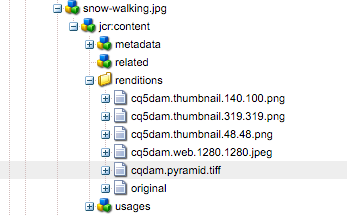

# Trabalhar com o Dynamic Media {#working-with-dynamic-media}

[Dynamic Media](https://business.adobe.com/br/products/experience-manager/assets/dynamic-media.html) ajuda a fornecer ativos avançados de merchandising e marketing visuais sob demanda, dimensionados automaticamente para consumo em sites da Web, móveis e sociais. Usando um conjunto de ativos de origem primária, o Dynamic Media gera e fornece várias variações de conteúdo avançado em tempo real por meio de sua rede global, dimensionável e com desempenho otimizado.

O Dynamic Media oferece experiências de visualização interativa, incluindo zoom, rotação de 360° e vídeo. O Dynamic Media incorpora exclusivamente os fluxos de trabalho da solução Adobe Experience Manager de gerenciamento de ativos digitais (Assets) para simplificar e simplificar o processo de gerenciamento de campanhas digitais.

<!-- 
>[!NOTE]
>
>A Community article is available on [Working with Adobe Experience Manager and Dynamic Media](https://helpx.adobe.com/experience-manager/using/aem_dynamic_media.html). 
-->

## O que é o Dynamic Media?

O Dynamic Media no Adobe Experience Manager (AEM) as a Cloud Service é uma solução poderosa projetada para ajudá-lo a gerenciar, fornecer e otimizar ativos de mídia avançada como imagens e vídeos em plataformas digitais. Ela transforma mídia estática em experiências dinâmicas e envolventes, permitindo modificações em tempo real, como redimensionamento, recorte e ajuste de qualidade com base no dispositivo do usuário ou no tamanho da tela. Com o Dynamic Media, seus ativos se adaptam automaticamente para fornecer a melhor experiência visual, independentemente de os usuários estarem em um desktop, dispositivo móvel ou tablet.

Um benefício importante do Dynamic Media é sua capacidade de simplificar o gerenciamento de mídia. Não é necessário criar várias versões de imagens ou vídeos. O Dynamic Media lida com tudo isso fornecendo o formato mais apropriado para cada situação. Por exemplo, as empresas de comércio eletrônico podem aproveitar as visualizações de produto de 360 graus ou imagens com zoom para criar experiências interativas, enquanto sites com conteúdo intensivo podem garantir um streaming de vídeo rápido e de alta qualidade. Isso resulta em tempos de carregamento mais rápidos e experiências de usuário mais envolventes, o que resulta em maior satisfação do cliente e melhores taxas de conversão.

O Dynamic Media se integra perfeitamente ao seu sistema de gerenciamento de ativos digitais (DAM) no AEM, fornecendo uma única plataforma para armazenar, organizar e implantar sua mídia. Essa abordagem centralizada simplifica a colaboração entre as equipes e fornece insights em tempo real sobre o desempenho dos ativos. Esteja você focado em fornecer visuais cativantes ou melhorar as interações do usuário orientadas por mídia, o Dynamic Media ajuda a otimizar seu conteúdo para qualquer canal, tornando-o uma ferramenta essencial para as empresas que visam elevar sua presença digital.

## O que você pode fazer com o Dynamic Media {#what-you-can-do-with-dynamic-media}

O Dynamic Media permite gerenciar os ativos antes de publicá-los. Como trabalhar com ativos em geral é abordado em detalhes em [Trabalhar com o Digital Assets](/help/assets/manage-digital-assets.md). Os tópicos gerais incluem upload, download, edição e publicação de ativos, visualização e edição de propriedades e pesquisa de ativos.

Os recursos exclusivos do Dynamic Media incluem o seguinte:

* [Banners em carrossel](carousel-banners.md)
* [Conjuntos de imagem](image-sets.md)
* [Imagens interativas](interactive-images.md)
* [Vídeos interativos](interactive-videos.md)
* [Conjuntos de mídia mista](mixed-media-sets.md)
* [Imagens panorâmicas](panoramic-images.md)
* [Conjuntos de rotação](spin-sets.md)
* [Vídeo](video.md)
* [Entrega do Dynamic Media Assets](delivering-dynamic-media-assets.md)
* [Gerenciamento do Assets](managing-assets.md)
* [Utilização de visualizações rápidas para criar janelas pop-up personalizadas](custom-pop-ups.md)

Consulte também [Configurar Dynamic Media](administering-dynamic-media.md).

<!-- 

OBSOLETE UNTIL INTEGRATING SCENE7 TOPIC GETS A MAJOR UPDATE
>[!NOTE]
>
>To understand the differences between using Dynamic Media and integrating Dynamic Media Classic with AEM, see [Dynamic Media Classic integration versus Dynamic Media](/help/sites-cloud/administering/integrating-scene7.md#aem-scene-integration-versus-dynamic-media).

-->

## Dynamic Media ativada ou Dynamic Media desativada {#dynamic-media-on-versus-dynamic-media-off}

Você pode saber se o Dynamic Media está ativado (ativado) pelas seguintes características:

* As representações dinâmicas estão disponíveis ao baixar ou visualizar ativos.
* Conjuntos de imagens, conjuntos de rotação e conjuntos de mídia mista estão disponíveis.
* As representações PTIFF são criadas.

Ao clicar em um ativo de imagem, a exibição do ativo é diferente com o Dynamic Media ativado. O Dynamic Media usa visualizadores HTML5 sob demanda.

### Representações dinâmicas {#dynamic-renditions}

Representações dinâmicas, como imagem e predefinições do visualizador (em **[!UICONTROL Dynamic]**), estarão disponíveis quando o Dynamic Media estiver habilitado.

### Conjuntos de imagens do Dynamic Media, conjuntos de rotação, conjuntos de mídia mista {#image-sets-spins-sets-mixed-media-sets}

Conjuntos de imagens, conjuntos de rotação e conjuntos de mídia mista estarão disponíveis se o Dynamic Media estiver habilitado.

### Representações PTIFF habilitadas para Dynamic Media {#ptiff-renditions}

Os ativos habilitados para Dynamic Media incluem `pyramid.tiffs`.

### Alteração nas visualizações de ativos da Dynamic Media {#asset-views-change}

Com o Dynamic Media habilitado, você pode ampliar e reduzir clicando nos botões `+` e `-`. Você também pode optar por ampliar para uma determinada área. Reverter leva à versão original e você pode tornar a imagem em tela cheia clicando nas setas diagonais. O Dynamic Media ativado é exibido da seguinte maneira:

Com o Dynamic Media desativado, é possível aumentar e diminuir o zoom e reverter para o tamanho original:

