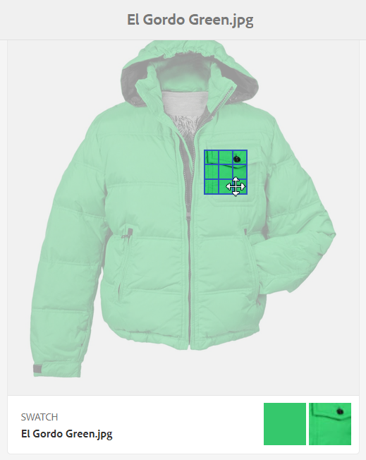

# Perfis de imagem de mídia dinâmica {#image-profiles}

Ao fazer upload de imagens, você pode cortar automaticamente a imagem após o upload aplicando um Perfil de imagem à pasta.

>[!IMPORTANT]
>
>Os perfis de imagem não se aplicam a arquivos PDF, GIF animado ou INDD (Adobe InDesign).

## Opção Tirar nitidez da máscara {#unsharp-mask}

Ao criar um Perfil de Imagem, você pode usar a opção **[!UICONTROL Tirar nitidez da máscara]** para ajustar um efeito de filtro de nitidez na imagem final com resolução reduzida. É possível controlar a intensidade do efeito, o raio do efeito (medido em pixels) e um limite de contraste que é ignorado. Esse efeito usa as mesmas opções do filtro &quot;Tirar nitidez da máscara&quot; do Adobe Photoshop.

>[!NOTE]
>
>A máscara de nitidez só é aplicada a representações em menor escala no PTIFF (tiff de pirâmide) com uma resolução reduzida de mais de 50%. A máscara de nitidez não afeta as representações de maior tamanho dentro do ptiff. Enquanto as representações de menor tamanho, como miniaturas, são alteradas (e mostram a máscara não nítida).

Em **[!UICONTROL Tirar nitidez da máscara]**, você tem as seguintes opções de filtro:

<table>
 <tbody>
  <tr>
   <td><strong>Opção</strong></td>
   <td><strong>Descrição</strong></td>
  </tr>
  <tr>
   <td>Quantidade</td>
   <td>Controla a quantidade de contraste aplicada aos pixels de borda. O padrão é 1,75. Para imagens de alta resolução, é possível aumentá-las para até 5. Pense na Quantidade como uma medida da intensidade do filtro. O intervalo é de 0 a 5.</td>
  </tr>
  <tr>
   <td>Raio</td>
   <td>Determina o número de pixels em torno dos pixels da borda que afetam a nitidez. Para imagens de alta resolução, insira de 1 a 2. Um valor baixo aplica nitidez apenas aos pixels da borda; um valor alto aplica nitidez a uma faixa mais ampla de pixels. O valor correto depende do tamanho da imagem. O valor padrão é 0,2. O intervalo é de 0 a 250.</td>
  </tr>
  <tr>
   <td>Limite</td>
   <td>
Determina o intervalo de contraste que deve ser ignorado quando o filtro Tirar nitidez da máscara é aplicado. Essa opção controla como os pixels com nitidez devem ser diferentes dos adjacentes para serem considerados pixels de borda. Somente os pixels que atingirem esse limite serão nitidez. Para evitar a introdução de ruídos, experimente valores entre 0 e 255.
 </td>
  </tr>
 </tbody>
</table>

A nitidez está descrita em [Nitidez de imagens](/help/assets/dynamic-media/assets/sharpening_images.pdf).

## Opções de corte {#crop-options}

Ao implementar o recorte inteligente em imagens, o Adobe recomenda a seguinte prática recomendada e impõe o seguinte limite:

| Ativo - Tipo de limite | Prática recomendada | Limite imposto |
| --- | --- | --- |
| **Imagem** - Número de Recortes Inteligentes por imagem | 5 | 100 |

Consulte também [limitações do Dynamic Media](/help/assets/dynamic-media/limitations.md).

<!-- CQDOC-16069 for the paragraph directly below -->

As coordenadas de corte inteligente dependem da taxa de proporção. Para as configurações de recorte inteligente em um Perfil de imagem, se a proporção for a mesma para as dimensões adicionadas no Perfil de imagem, a mesma proporção será enviada para o Dynamic Media. A Adobe recomenda usar a mesma área de corte. Isso garante que não haja impacto em diferentes dimensões usadas no Perfil de imagem.

Cada geração de corte inteligente criada requer processamento extra. Por exemplo, adicionar mais de cinco taxas de proporção de corte inteligente pode resultar em uma taxa de assimilação de ativos lenta. Isso também pode causar um aumento de carga nos sistemas. Como o recorte inteligente pode ser aplicado no nível da pasta, a Adobe recomenda usá-lo somente para pastas em que for necessário.

**Diretrizes para definir o Corte inteligente em um Perfil de Imagem**
Para manter o uso do Corte inteligente sob controle e otimizar o tempo de processamento e o armazenamento de cultivos, a Adobe recomenda as seguintes diretrizes e dicas:

* Os ativos de imagem que terão um recorte inteligente aplicado a eles devem ter no mínimo 50 x 50 pixels ou mais.
* Idealmente, tenha de 10 a 15 recortes inteligentes por imagem para otimizar as taxas de tela e o tempo de processamento.
* Nomeie os cortes inteligentes com base nas dimensões do corte, não no uso final. Isso ajuda a otimizar para duplicatas em que uma única dimensão é usada em várias páginas.
* Crie perfis de imagem para pastas e subpastas específicas em nível de página/tipo de ativo, em vez de um perfil de recorte inteligente comum aplicado a todas as pastas ou a todos os ativos.
* Um Perfil de imagem que você aplica a subpastas substitui um Perfil de imagem que é aplicado à pasta.
* Um Perfil de Imagem que contém dimensões de corte inteligente duplicadas não é permitido.
* Perfis de imagem nomeados duplicados com opções de corte inteligente definidas não são permitidos.

Você tem duas opções de corte de imagem para escolher: corte de pixel e corte inteligente. Também é possível optar por automatizar a criação de amostras de cores e imagens ou preservar o conteúdo do recorte nas resoluções de destino.

>[!IMPORTANT]
>
>A Adobe recomenda que você analise todas as culturas e amostras geradas para garantir que elas sejam apropriadas e relevantes para sua marca e seus valores.

| Opção | Quando usar | Descrição |
| --- | --- | --- |
| **[!UICONTROL Recorte de pixels]** | Imagens de corte em massa somente com base em dimensões. | Na lista suspensa **[!UICONTROL Opções de Corte]**, selecione **[!UICONTROL Recorte de Pixel]**. Para recortar das laterais de uma imagem, digite o número de pixels a serem recortados de qualquer lado ou de cada lado da imagem. O quanto da imagem é cortada depende da configuração ppi (pixels por polegada) no arquivo de imagem. Um corte de pixel do Perfil de Imagem é renderizado da seguinte maneira: · Os valores são Superior, Inferior, Esquerdo e Direito. · O canto superior esquerdo é considerado `0,0` e o recorte de pixels é calculado a partir desse ponto. · Ponto inicial do recorte: Esquerda é X e Superior é Y · Cálculo horizontal: tamanho de pixel horizontal da imagem original menos Esquerda e menos Direita. · Cálculo vertical: altura vertical do pixel menos Superior e menos Inferior. Por exemplo, suponha que você tenha uma imagem de 4000 x 3000 pixels. Você usa valores: Top=250, Bottom=500, Left=300, Right=700. Do canto superior esquerdo (300.250), recorte usando o espaço de preenchimento de (4000-300-700, 3000-250-500 ou 3000.2250). |
| **[!UICONTROL Corte inteligente]** | Recorte de imagens em massa com base em seu ponto focal visual. | O Recorte inteligente usa o potencial da inteligência artificial na IA do Adobe para automatizar o recorte de imagens rapidamente em massa. O Corte inteligente detecta automaticamente e recorta até o ponto focal em qualquer imagem para adquirir o ponto de interesse desejado, independentemente do tamanho da tela. Na lista suspensa **[!UICONTROL Opções de Corte]**, selecione **[!UICONTROL Recorte Inteligente]** e, à direita de **[!UICONTROL Recorte de Imagem Responsivo]**, habilite (ative) o recurso. Os tamanhos padrão de pontos de interrupção (**[!UICONTROL Large]**, **[!UICONTROL Medium]**, **[!UICONTROL Small]**) cobrem a gama completa de tamanhos que a maioria das imagens em dispositivos móveis e tablets, áreas de trabalho e banners usa. Se desejar, você pode editar os nomes padrão Grande, Medium e Pequeno. Para adicionar mais pontos de interrupção, selecione **[!UICONTROL Adicionar Corte]**; para excluir um corte, selecione o ícone Lixeira. |
| **[!UICONTROL Amostra de Cores e Imagens]** | O gera em massa uma Amostra de imagem para cada imagem. | **Observação**: a amostra inteligente não é suportada no Dynamic Media Classic. Localize e gere automaticamente amostras de alta qualidade a partir de imagens de produtos que mostram cor ou textura. Na lista suspensa **[!UICONTROL Opções de Corte]**, selecione **[!UICONTROL Recorte Inteligente]**. À direita de **[!UICONTROL Amostra de cor e imagem]**, habilite (ative) o recurso. Insira um valor de pixel nas caixas de texto **[!UICONTROL Largura]** e **[!UICONTROL Altura]**. Embora todos os recortes de imagem estejam disponíveis no painel Representações, as amostras são usadas somente por meio do recurso **[!UICONTROL Copiar URL]**. Use seu próprio componente de visualização para renderizar a amostra em seu site. A exceção a essa regra são os banners do carrossel. O Dynamic Media fornece o componente de visualização para a amostra usada nos banners do carrossel.  **Uso de amostras de imagem**  A URL para amostras de imagem é simples: `/is/image/company/&lt;asset_name&gt;:Swatch` Onde `:Swatch` é anexado à solicitação de ativo.  **Usando amostras de cores**  Para usar amostras de cores, você faz uma solicitação `req=userdata` com o seguinte: `/is/image/&lt;company_name&gt;/&lt;swatch_asset_name&gt;:Swatch?req=userdata`  Por exemplo, este é um ativo de amostra no Dynamic Media Classic: `https://my.company.com:8080/is/image/DemoCo/Sleek:Swatch` E aqui está a URL `req=userdata` correspondente do ativo de amostra: `https://my.company.com:8080/is/image/DemoCo/Sleek:Swatch?req=userdata` A resposta do `req=userdata` é a seguinte: `SmartCropDef=Swatch` `SmartCropHeight=200.0` `SmartCropRect=0.421671,0.389815,0.0848564,0.0592593,200,200` `SmartCropType=Swatch` `SmartCropWidth=200.0` `SmartSwatchColor=0xA56DB2` Você também pode solicitar uma resposta do `req=userdata` no formato XML ou JSON, como nos seguintes exemplos de URL: ·`https://my.company.com</code>:8080/is/image/DemoCo/Sleek:Swatch?req=userdata,json` ·`https://my.company.com:8080/is/image/DemoCo/Sleek:Swatch?req=userdata,xml`  **Observação**: você deve criar seu próprio componente WCM para solicitar uma amostra de cor e analisar o atributo `SmartSwatchColor`, representado por um valor hexadecimal RGB de 24 bits. Consulte também [`userdata`](https://experienceleague.adobe.com/pt-br/docs/dynamic-media-developer-resources/image-serving-api/image-serving-api/http-protocol-reference/command-reference/req/r-userdata) no Guia de Referência de Visualizadores. |
| **[!UICONTROL Preservar conteúdo de corte nas resoluções de destino]** | Para manter o conteúdo do corte na mesma proporção | Use quando criar um perfil de recorte inteligente. Para gerar novo conteúdo de recorte - mantendo o ponto focal - para uma determinada taxa de proporção em diferentes resoluções, desmarque esta opção  Se você decidir desmarcar esta caixa, verifique se a resolução da imagem original é maior do que as resoluções definidas para o seu perfil de recorte inteligente.  Por exemplo, suponha que você tenha definido as taxas de proporção como 600 x 600 (Grande), 400 x 400 (Medium) e 300 x 300 (Pequeno). Quando a opção **[!UICONTROL Preservar conteúdo de recorte nas resoluções de destino]** estiver *marcada*, você verá o mesmo recorte em todas as três resoluções, semelhante à seguinte saída de exemplo de imagens (somente para fins ilustrativos):   Quando a opção **[!UICONTROL Preservar conteúdo de recorte nas resoluções de destino]** estiver *desmarcada*, o conteúdo de recorte será novo para todas as três resoluções, semelhante à seguinte saída de exemplo de imagens (somente para fins ilustrativos):  |

### Formatos de arquivo de imagem compatíveis com Recorte inteligente e Amostras de cor

A resolução máxima de tamanho de arquivo de entrada é de 16K.

>[!NOTE]
>
>A resolução de 16K é uma resolução de tela com aproximadamente 16.000 pixels horizontalmente. A resolução de 16 K mais comumente discutida é 15360 × 8640, o que dobra a contagem de pixels de 8K UHD em cada dimensão, para um total de quatro vezes mais pixels. Essa resolução tem 132,7 megapixels, 16 vezes mais pixels do que a resolução 4K e 64 vezes mais pixels do que a resolução 1080p.

| Formato da imagem | Extensão de arquivo que não diferencia maiúsculas de minúsculas | Tipo MIME | Espaço de cor de entrada compatível | Tamanho máximo de arquivo de entrada com suporte | Formato de imagem compatível? |
| --- | --- | --- | --- | --- | --- |
| BMP | `.bmp` | image/bmp | sRGB | 4 GB | Sim |
| CMYK | | | | | Sim |
| EPS | | | | | Não |
| GIF | `.gif` | image/gif | sRGB | 15 GB | Sim; o primeiro quadro do GIF animado é usado para a representação. Não é possível configurar ou alterar o primeiro quadro. |
| JPEG | `.jpg` e `.jpeg` | image/jpeg | sRGB | 15 GB | Sim |
| PNG | `.png` | image/png | sRGB | 15 GB | Sim |
| PSD | `.psd` | image/vnd.adobe.photoshop | sRGB CMYK | 2 GB | Sim |
| SVG | | | | | Não |
| TIFF | `.tif` e `.tiff` | image/tiff | sRGB CMYK | 4 GB | Sim |
| WebP/WebP animado | | | | | Não |

## Criar perfis de imagem do Dynamic Media {#creating-image-profiles}

Para definir parâmetros de processamento avançado para outros tipos de ativos, consulte [Configuração do processamento de ativos](config-dm.md#configuring-asset-processing).

Consulte [Sobre perfis de imagem e perfis de vídeo do Dynamic Media](/help/assets/dynamic-media/about-image-video-profiles.md).

Consulte também [Práticas recomendadas para organizar sua Assets digital para usar Perfis de processamento](/help/assets/organize-assets.md).

**Para criar Perfis de Imagem de Mídia Dinâmica:**

1. Selecione o logotipo do Adobe Experience Manager e navegue até **[!UICONTROL Ferramentas]** > **[!UICONTROL Assets]** > **[!UICONTROL Perfis de imagem]**.
1. Para adicionar um Perfil de Imagem, selecione **[!UICONTROL Criar]**.
1. Insira um nome de perfil e valores para Tirar nitidez da máscara, do recorte ou da amostra, ou ambos.

   >[!TIP]
   >
   >Use um nome de perfil específico para a finalidade pretendida. Por exemplo, suponha que você queira criar um perfil que gere apenas amostras. Ou seja, o recorte inteligente está desativado (desativado) e a Amostra de cor e imagem está ativada (ativada). Nesses casos, você pode usar o nome de perfil &quot;Amostra inteligente&quot;.

   Consulte também [Opções de recorte inteligente e amostra inteligente](#crop-options) e [Tirar nitidez da máscara](#unsharp-mask).

   

1. Selecione **[!UICONTROL Salvar]**. O perfil criado aparece na lista de perfis disponíveis.

## Editar ou excluir perfis de imagem do Dynamic Media {#editing-or-deleting-image-profiles}

1. Selecione o logotipo do Experience Manager e navegue até **[!UICONTROL Ferramentas]** > **[!UICONTROL Assets]** > **[!UICONTROL Perfis de imagem]**.
1. Selecione o Perfil de imagem que deseja editar ou remover. Para editá-lo, selecione **[!UICONTROL Editar Perfil de Processamento de Imagem]**. Para removê-lo, selecione **[!UICONTROL Excluir Perfil de Processamento de Imagem]**.

   

1. Se estiver editando, salve as alterações. Se estiver excluindo, confirme se deseja remover o perfil.

## Aplicar um perfil de imagem do Dynamic Media a pastas {#applying-an-image-profile-to-folders}

Quando você atribui um Perfil de imagem a uma pasta, todas as subpastas herdam automaticamente o perfil da pasta principal. Dessa forma, você pode atribuir apenas um Perfil de imagem a uma pasta. Dessa forma, considere cuidadosamente a estrutura de pastas de onde você faz upload, armazena, usa e arquiva ativos.

Se você atribuiu um Perfil de imagem diferente a uma pasta, o novo perfil substituirá o perfil anterior. Os ativos de pasta existentes anteriormente permanecem inalterados. O novo perfil é aplicado aos ativos que são adicionados à pasta posteriormente.

As pastas com um perfil atribuído exibem o nome do perfil no cartão.

<!-- When you add smart crop to an existing Image Profile, you need to re-trigger the [DAM Update Asset workflow](assets-workflow.md) if you want to generate crops for existing assets in your asset repository. -->

Aplique Perfis de imagem a pastas específicas ou globalmente a todos os ativos.

É possível reprocessar ativos em uma pasta que já tenha um Perfil de imagem existente que você alterou posteriormente. Consulte [Reprocessar ativos em uma pasta depois de editar seu perfil de processamento](/help/assets/dynamic-media/about-image-video-profiles.md#reprocessing-assets).

### Aplicar perfis de imagem do Dynamic Media a pastas específicas {#applying-image-profiles-to-specific-folders}

Aplique um Perfil de Imagem a uma pasta no menu **[!UICONTROL Ferramentas]** ou, se estiver na pasta, em **[!UICONTROL Propriedades]**.

As pastas com um perfil atribuído exibem o nome do perfil logo abaixo do nome da pasta.

Você pode reprocessar ativos em uma pasta que já tenha um perfil de vídeo existente que você alterou posteriormente. Consulte [Reprocessar ativos em uma pasta depois de editar seu perfil de processamento](/help/assets/dynamic-media/about-image-video-profiles.md#reprocessing-assets).

#### Aplicar Perfis de imagem do Dynamic Media a pastas da interface do usuário Perfis {#applying-image-profiles-to-folders-from-profiles-user-interface}

1. Selecione o logotipo do Experience Manager e navegue até **[!UICONTROL Ferramentas]** > **[!UICONTROL Assets]** > **[!UICONTROL Perfis de imagem]**.
1. Selecione o Perfil de imagem que deseja aplicar a uma ou várias pastas.

   

1. Selecione **[!UICONTROL Aplicar perfil de processamento às pastas]** e selecione uma ou várias pastas que deseja usar para receber os ativos carregados recentemente e selecione **[!UICONTROL Aplicar]**. As pastas com um perfil atribuído exibem o nome do perfil logo abaixo do nome da pasta.

#### Aplicar perfis de imagem do Dynamic Media a pastas de propriedades {#applying-image-profiles-to-folders-from-properties}

1. Selecione o logotipo do Experience Manager e navegue até **[!UICONTROL Assets]**.
1. Navegue até uma *pasta* (não um ativo) à qual deseja aplicar um Perfil de imagem.
1. Dependendo da exibição em que você estiver, execute um dos procedimentos a seguir:
   * Na Exibição de cartão, passe o mouse sobre o ponteiro na pasta e selecione a marca de seleção para selecioná-lo.
   * Na Exibição de coluna ou na Exibição de lista, marque a caixa de seleção à esquerda do nome da pasta.
1. Na barra de ferramentas, selecione **[!UICONTROL Propriedades]**.
1. Selecione a guia **[!UICONTROL Processamento de Dynamic Media]**.
1. Em **[!UICONTROL Perfil de Imagem]**, na lista suspensa **[!UICONTROL Nome do Perfil]**, selecione o perfil a ser aplicado.
1. Próximo ao canto superior direito da página, selecione **[!UICONTROL Salvar e fechar]**. As pastas com um perfil atribuído exibem o nome do perfil logo abaixo do nome da pasta.

   

### Aplicar um perfil de imagem do Dynamic Media globalmente {#applying-an-image-profile-globally}

Além de aplicar um perfil a uma pasta, você também pode aplicar um globalmente. Qualquer conteúdo carregado no Experience Manager Assets em qualquer pasta tem o perfil selecionado aplicado.

Você pode reprocessar ativos em uma pasta que já tenha um perfil de vídeo existente que você alterou posteriormente. Consulte [Reprocessar ativos em uma pasta depois de editar seu perfil de processamento](/help/assets/dynamic-media/about-image-video-profiles.md#reprocessing-assets).

**Para aplicar globalmente um Perfil de Imagem de Mídia Dinâmica:**

1. Siga uma das seguintes opções:

   * Navegue até `https://&lt;AEM server&gt;/mnt/overlay/dam/gui/content/assets/foldersharewizard.html/content/dam`, aplique o perfil apropriado e selecione **[!UICONTROL Salvar]**.

     

   * Navegue até o CRXDE Lite para o seguinte nó: `/content/dam/jcr:content`.

     Adicione a propriedade `imageProfile:/conf/global/settings/dam/adminui-extension/imageprofile/<name of image profile>` e selecione **[!UICONTROL Salvar tudo]**.

     

## Editar o recorte inteligente ou a amostra inteligente de uma única imagem {#editing-the-smart-crop-or-smart-swatch-of-a-single-image}

>[!IMPORTANT]
>
>A Adobe recomenda que você analise todos os recortes inteligentes e amostras inteligentes gerados para garantir que eles sejam apropriados e relevantes para sua marca e valores.

Para refinar o ponto focal de uma imagem, é possível ajustar manualmente o alinhamento ou redimensionar a janela de recorte inteligente.

Depois de editar um recorte inteligente e salvar, a alteração é propagada em todos os lugares em que você usa o recorte para as imagens específicas.

>[!IMPORTANT]
>
>Ao ajustar manualmente a janela de recorte inteligente de um ativo, suas alterações são salvas. Essas edições permanecem intactas mesmo que você reprocesse o ativo posteriormente. No entanto, se você editar a largura, a altura ou ambos na área **[!UICONTROL Recorte de imagem responsivo]** do Perfil de imagem, esse ativo estará sujeito a reprocessamento.
>Consulte [Reprocessar ativos do Dynamic Media em uma pasta](/help/assets/dynamic-media/about-image-video-profiles.md#reprocessing-assets).

Execute novamente o corte inteligente para gerar os cortes adicionais novamente, se necessário.

Consulte também [Editar o recorte inteligente ou a amostra inteligente de várias imagens](#editing-the-smart-crop-or-smart-swatch-of-multiple-images).

**Para editar o recorte inteligente ou a amostra inteligente de uma única imagem:**

1. Selecione o logotipo do Experience Manager e navegue até o **[!UICONTROL Assets]**, em seguida, acesse a pasta que tem um Recorte inteligente ou um Perfil de Imagem de amostra inteligente aplicado a ela.
1. Para abrir o conteúdo, selecione a pasta.
1. Selecione a imagem cujo corte inteligente ou amostra inteligente você deseja ajustar.
1. Na barra de ferramentas, selecione **[!UICONTROL Recorte inteligente]**.

   >[!TIP]
   >
   >Use a tecla de atalho `s` para editar os recortes inteligentes ou as amostras inteligentes.

1. Siga um destes procedimentos:

   * Próximo ao canto superior direito da página, arraste a barra deslizante para a esquerda ou direita para aumentar ou diminuir a exibição da imagem, respectivamente.
   * Na imagem, arraste uma alça de canto para ajustar o tamanho da área visível do corte ou da amostra.
   * Na imagem, arraste a caixa/amostra para um novo local. Só é possível editar amostras de imagens; as amostras de cores são estáticas.
   * Próximo ao canto superior direito da imagem, selecione **[!UICONTROL Reverter]** para desfazer todas as edições e restaurar o recorte ou a amostra original.
   * Use as teclas de seta do teclado para recortar o tamanho do quadro ou reposicionar a imagem, ou ambos.

1. Próximo ao canto superior direito da página, selecione **[!UICONTROL Salvar]** e **[!UICONTROL Fechar]** para retornar à pasta de ativos.

## Editar o recorte inteligente ou a amostra inteligente de várias imagens {#editing-the-smart-crop-or-smart-swatch-of-multiple-images}

>[!IMPORTANT]
>
>A Adobe recomenda que você analise todos os recortes inteligentes e amostras inteligentes gerados para garantir que eles sejam apropriados e relevantes para sua marca e valores.

Depois de aplicar um Perfil de imagem - contendo corte inteligente - a uma pasta, todas as imagens nessa pasta terão um corte aplicado a elas. Se necessário, é possível ajustar manualmente o alinhamento ou redimensionar a janela de recorte inteligente em várias imagens para ajustar ainda mais seus pontos focais.

Depois de editar um recorte inteligente e salvar, a alteração é propagada em todos os lugares em que você usa o recorte para as imagens específicas.

>[!IMPORTANT]
>
>Ao ajustar manualmente a janela de recorte inteligente de vários ativos, suas alterações são salvas. Essas edições permanecem intactas mesmo que você reprocesse os ativos posteriormente. No entanto, se você editar a largura, a altura ou ambos na área **[!UICONTROL Recorte de imagem responsivo]** do Perfil de imagem, esses ativos estarão sujeitos a reprocessamento.
>Consulte [Reprocessar ativos do Dynamic Media em uma pasta](/help/assets/dynamic-media/about-image-video-profiles.md#reprocessing-assets).

Execute novamente o corte inteligente para gerar os cortes adicionais novamente, se necessário.

**Para editar o recorte inteligente ou a amostra inteligente de várias imagens:**

1. Selecione o logotipo do Experience Manager e navegue até o **[!UICONTROL Assets]** e, em seguida, acesse uma pasta que tenha um Perfil de Imagem de corte inteligente ou de amostra inteligente aplicado a ela.
1. Na pasta, selecione o ícone **[!UICONTROL Mais Ações]** (...) e selecione **[!UICONTROL Recorte Inteligente]**.

1. Na página **[!UICONTROL Editar cortes inteligentes]**, siga um destes procedimentos:

   * Ajuste o tamanho de exibição das imagens na página.

     À direita da lista suspensa de nomes dos pontos de interrupção, arraste a barra deslizante para a esquerda ou direita para alterar o tamanho da exibição da imagem visível.

     

   * Filtrar a lista de imagens visualizáveis com base nos nomes dos pontos de interrupção. No exemplo abaixo, as imagens são filtradas no nome do ponto de interrupção &quot;Medium&quot;.

     Próximo ao canto superior direito da página, na lista suspensa, selecione um nome de ponto de interrupção para filtrar em quais imagens você vê. (Veja a imagem acima.)

     

   * Redimensionar a caixa de corte inteligente. Siga um destes procedimentos:

      * Se a imagem tiver apenas um recorte inteligente ou uma amostra inteligente, arraste a alça do canto da caixa de recorte. Ajuste o tamanho da área visível do corte.
      * Se a imagem tiver um recorte inteligente e uma amostra inteligente, arraste a alça de canto da caixa de recorte. Ajuste o tamanho da área visível do corte. Ou selecione a amostra inteligente abaixo da imagem (as amostras de cores são estáticas) e arraste a alça do canto da caixa de corte. Ajuste o tamanho da área visível da amostra.

     .

   * Mova a caixa de corte inteligente. Siga um destes procedimentos:

      * Se a imagem tiver apenas um recorte inteligente ou uma amostra inteligente, arraste a caixa de recorte para um novo local na imagem.
      * Se a imagem tiver um recorte inteligente e uma amostra inteligente, arraste a caixa de recorte inteligente para um novo local na imagem. Ou selecione a amostra inteligente abaixo da imagem (as amostras de cores são estáticas) e arraste a caixa de recorte da amostra inteligente para um novo local.

     

   * Desfazer todas as edições e restaurar o recorte inteligente original ou a amostra inteligente (aplica-se somente à sessão de edição atual).

     Selecione **[!UICONTROL Reverter]** acima da imagem.

     

1. Próximo ao canto superior direito da página, selecione **[!UICONTROL Salvar]** e **[!UICONTROL Fechar]** para retornar à pasta de ativos.

## Remover um perfil de imagem das pastas {#removing-an-image-profile-from-folders}

Ao remover um Perfil de imagem de uma pasta, todas as subpastas herdam automaticamente a remoção do perfil da pasta principal. No entanto, qualquer processamento de arquivos que tenha ocorrido nas pastas permanece intacto.

Remova um Perfil de Imagem de uma pasta no menu **[!UICONTROL Ferramentas]** ou, se estiver na pasta, em **[!UICONTROL Propriedades]**.

### Remover perfis de imagem do Dynamic Media das pastas por meio da interface do usuário Perfis {#removing-image-profiles-from-folders-via-profiles-user-interface}

1. Selecione o logotipo do Experience Manager e navegue até **[!UICONTROL Ferramentas]** > **[!UICONTROL Assets]** > **[!UICONTROL Perfis de imagem]**.
1. Selecione o Perfil de imagem que deseja remover de uma ou várias pastas.
1. Selecione **[!UICONTROL Remover Perfil de Processamento das Pastas]**, selecione uma ou várias pastas que deseja usar para remover o perfil e selecione **[!UICONTROL Remover]**.

   É possível confirmar que o Perfil de imagem não é mais aplicado a uma pasta porque o nome não aparece mais abaixo do nome da pasta.

### Remova perfis de imagem do Dynamic Media das pastas por meio de Propriedades {#removing-image-profiles-from-folders-via-properties}

1. Selecione o logotipo do Experience Manager, navegue até a **[!UICONTROL Assets]** e, em seguida, acesse a pasta da qual deseja remover um Perfil de Imagem.
1. Na pasta, marque a marca de seleção para selecioná-la e selecione **[!UICONTROL Propriedades]**.
1. Selecione a guia **[!UICONTROL Perfis de imagem]**.
1. Na lista suspensa **[!UICONTROL Nome do Perfil]**, selecione **[!UICONTROL Nenhum]** e **[!UICONTROL Salvar e Fechar]**.

   As pastas com um perfil atribuído exibem o nome do perfil logo abaixo do nome da pasta.
