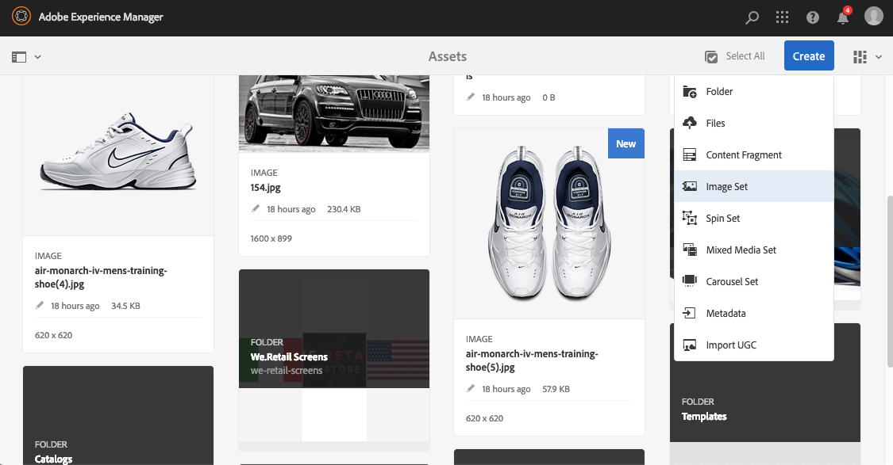
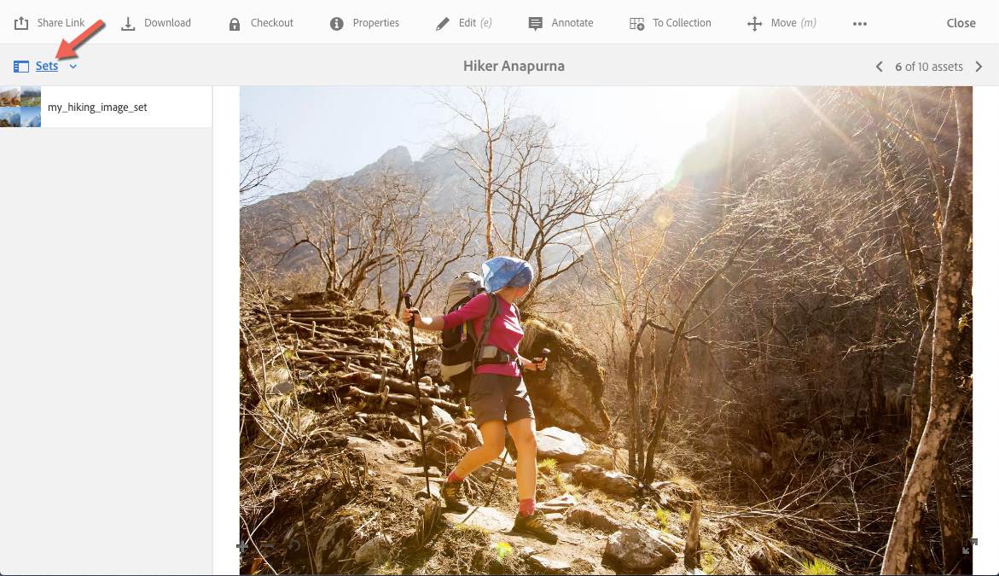

# Conjuntos de imagem {#image-sets}

Os conjuntos de imagens oferecem aos usuários uma experiência de visualização integrada, em que os usuários podem ver diferentes visualizações de um item clicando em uma imagem em miniatura. Os Conjuntos de imagens permitem apresentar visualizações alternativas de um item e o visualizador oferece ferramentas de zoom para examinar as imagens de perto.

Os conjuntos de imagens são designados por um banner com a palavra `IMAGESET`. Além disso, se o Conjunto de imagens for publicado, a data de publicação, indicada pela variável **[!UICONTROL Mundo]** está no banner. Além disso, a última data de modificação, indicada pelo **[!UICONTROL Lápis]** é exibido.

No conjunto de imagens, também é possível criar amostras criando um Conjunto de imagens e adicionando miniaturas.

Esse aplicativo é útil para quando você deseja mostrar um item em uma cor, padrão ou fim diferente. Para criar um Conjunto de imagens com amostras de cores, é necessário ter uma imagem para cada cor, padrão ou acabamento diferente que você deseja apresentar aos usuários. Você também precisa de uma amostra de cor, padrão ou fim para cada cor, padrão ou fim.

Por exemplo, suponha que você queira apresentar imagens de tampas com diferentes listas de cores; as listas são vermelha, verde e azul. Neste caso, você precisa de três doses do mesmo boné. Você precisa de uma foto com um vermelho, uma com verde e outra com uma nota azul. Você também precisa de uma amostra de cor vermelha, verde e azul. As amostras de cores servem como miniaturas clicadas pelos usuários no Visualizador de conjuntos de amostras para ver a tampa de faturamento vermelho, verde ou azul.

>[!NOTE]
>
>Para obter informações sobre a interface do Assets, consulte [Gerenciar ativos com a interface para toque](/help/assets/manage-digital-assets.md).

Ao criar um Conjunto de imagens, o Adobe recomenda as seguintes práticas recomendadas e impõe os seguintes limites:

| Tipo de limite | Prática recomendada | Limite imposto |
| --- | --- | --- |
| Número de ativos duplicados por conjunto | Sem duplicatas | 20 |
| Número máximo de imagens por conjunto | De 5 a 10 imagens por conjunto | 1000 |

Consulte também [Limitações do Dynamic Media](/help/assets/dynamic-media/limitations.md).

## Início rápido: conjuntos de imagens {#quick-start-image-sets}

Para começar a usar o com rapidez:

1. Opcional. [Criar uma predefinição de conjunto de lotes](/help/assets/dynamic-media/batch-set-presets-dm.md) e aplique-a a uma nova pasta na qual as imagens do conjunto de rotação são carregadas.

   Uma predefinição de conjunto de lotes pode ajudar a automatizar a criação do conjunto de imagens.

   >[!IMPORTANT]
   >
   >Os conjuntos em lotes são criados pelo IPS (Sistema de produção de imagem) como parte da assimilação de ativos.

1. [Fazer upload das imagens de origem principais para várias exibições](#uploading-assets-in-image-sets).

   Faça upload das imagens para os seus Conjuntos de imagens. Lembre-se de que os usuários podem ampliar imagens no Visualizador de conjunto de imagens. Assim, escolha suas imagens com cuidado. Verifique se as imagens têm pelo menos 2000 pixels no maior tamanho.

   Consulte [Dynamic Media - Formatos de imagem rasterizada compatíveis](/help/assets/file-format-support.md#image-support-dynamic-media) para obter uma lista de formatos compatíveis com Conjuntos de imagens.

1. [Criar conjuntos de imagens](#creating-image-sets).

   Em Conjuntos de imagens, os usuários clicam em miniaturas de imagens no Visualizador do conjunto de imagens.

   Para criar um Conjunto de imagens no Assets, selecione **[!UICONTROL Criar]** > **[!UICONTROL Conjuntos de imagem]**. Em seguida, adicione imagens e clique em **[!UICONTROL Salvar]**.

   Consulte [Preparar ativos do conjunto de imagens para fazer upload e fazer upload de arquivos](#uploading-assets-in-image-sets).

   Consulte [Trabalhar com seletores](/help/assets/dynamic-media/working-with-selectors.md).

1. Adicionar [Predefinições do visualizador do conjunto de imagens](/help/assets/dynamic-media/managing-viewer-presets.md), conforme necessário.

   Os administradores podem criar ou modificar as Predefinições do visualizador de conjunto de imagens. Para ver seu conjunto de imagens com uma predefinição do visualizador, selecione o conjunto de imagens e, na lista suspensa do painel à esquerda, selecione **[!UICONTROL Visualizadores]**.

   Para criar ou editar predefinições do visualizador, consulte **[!UICONTROL Ferramentas]** > **[!UICONTROL Assets]** > **[!UICONTROL Predefinições do visualizador]**.

1. (Opcional) [Exibir conjuntos de imagens](/help/assets/dynamic-media/image-sets.md#viewing-image-sets) que foram criados usando predefinições de conjunto de lotes.
1. [Visualizar conjuntos de imagens](/help/assets/dynamic-media/previewing-assets.md).

   Selecione o Conjunto de imagens para poder visualizá-lo. Para examinar o Conjunto de imagens no Visualizador selecionado, selecione os ícones de miniatura. Você pode escolher visualizadores diferentes da **[!UICONTROL Visualizadores]** disponível na lista suspensa do painel esquerdo.

1. [Publicar conjuntos de imagens](/help/assets/dynamic-media/publishing-dynamicmedia-assets.md).

   A publicação de um Conjunto de imagens ativa o URL e a Sequência de caracteres incorporada. Além disso, você deve [publicar qualquer predefinição do visualizador personalizado](/help/assets/dynamic-media/managing-viewer-presets.md) que você criou. As predefinições do visualizador pronto para uso já estão publicadas.

1. [Vincular URLs ao aplicativo web](/help/assets/dynamic-media/linking-urls-to-yourwebapplication.md) ou [Incorporar o visualizador de vídeo ou imagem](/help/assets/dynamic-media/embed-code.md).

   O Experience Manager Assets cria chamadas de URL para Conjuntos de imagens e as ativa após a publicação dos conjuntos de imagens. É possível copiar esses URLs ao visualizar ativos. Como alternativa, você pode incorporá-los ao seu site.

   Selecione o Conjunto de imagens e, na lista suspensa do painel à esquerda, selecione **[!UICONTROL Visualizadores]**.

   Consulte [Vincular um conjunto de imagens a uma página da Web](/help/assets/dynamic-media/linking-urls-to-yourwebapplication.md) e [Incorporar o visualizador de vídeo ou imagem](/help/assets/dynamic-media/embed-code.md).

Para editar Conjuntos de imagens, consulte [editar conjuntos de imagens](#editing-image-sets). Além disso, é possível exibir e editar [Propriedades do conjunto de imagens](/help/assets/manage-digital-assets.md#editing-properties).

Se tiver problemas ao criar conjuntos, consulte Imagens e conjuntos em [Solução de problemas do Dynamic Media](/help/assets/dynamic-media/troubleshoot-dm.md#images-and-sets).

## Fazer upload de ativos para conjuntos de imagens {#uploading-assets-in-image-sets}

Comece fazendo upload dos ativos de imagem para seus Conjuntos de imagens. Lembre-se de que os usuários podem ampliar imagens no Visualizador de conjunto de imagens. Assim, escolha suas imagens com cuidado. Verifique se as imagens têm pelo menos 2000 pixels no maior tamanho para obter os detalhes de zoom ideais. O Dynamic Media pode renderizar imagens de até 25 megapixels cada. Por exemplo, você pode usar uma imagem de 5000x5000 megapixels ou qualquer outra combinação de tamanho de até 25 megapixels.

<!-- Image Sets supports many image file formats, but lossless TIFF, PNG, and EPS images are recommended. -->

Consulte [Dynamic Media - Formatos de imagem rasterizada compatíveis](/help/assets/file-format-support.md#image-support-dynamic-media) para obter uma lista de formatos compatíveis com Conjuntos de imagens.

É possível fazer upload de imagens para Conjuntos de imagens da mesma maneira [fazer upload de qualquer outro ativo no Assets](/help/assets/manage-digital-assets.md#uploading-assets).

### Preparar ativos do conjunto de imagens para upload {#preparing-image-set-assets-for-upload}

Antes de criar Conjuntos de imagens, verifique se as imagens têm o tamanho e o formato corretos.

Para criar um Conjunto de imagens com várias visualizações, você precisa de imagens que mostrem um item de diferentes pontos de vista ou mostrem diferentes aspectos do mesmo item. O objetivo é destacar os recursos importantes de um item para que os visualizadores tenham uma imagem completa de como ele aparece ou o que ele faz.

Como os usuários podem ampliar imagens em Conjuntos de imagens, verifique se as imagens têm pelo menos 2000 pixels de tamanho maior. O Experience Manager Assets é compatível com muitos formatos de arquivo de imagem, mas são recomendados TIFF, PNG e imagens EPS sem perdas.

>[!NOTE]
>
>Se você usar miniaturas para indicar amostras de produtos, faça o seguinte:
>
>Crie vinhetas ou diferentes capturas da mesma imagem mostrando-a em cores, padrões ou acabamentos diferentes. Você também precisa de arquivos de miniatura que correspondam às diferentes cores, padrões ou acabamentos. Por exemplo, para apresentar miniaturas com um Conjunto de imagens mostrando a mesma jaqueta em preto, marrom e verde, é necessário:
>
>* Um tiro preto, marrom e verde do mesmo casaco.
>* Uma miniatura de cor preta, marrom e verde.

## Criar conjuntos de imagens {#creating-image-sets}

É possível criar Conjuntos de imagens por meio da interface do usuário ou da API.

>[!NOTE]
>
>Também é possível criar conjuntos de imagens automaticamente por meio do [predefinições de conjunto de lotes](/help/assets/dynamic-media/batch-set-presets-dm.md).
>**Importante:** os conjuntos em lotes são criados pelo IPS (Sistema de produção de imagem) como parte da ingestão de ativos.

Ao adicionar ativos ao conjunto, eles são automaticamente adicionados em ordem alfanumérica. É possível reordenar ou classificar manualmente os ativos depois de adicionados.

>[!NOTE]
>
>Os conjuntos de imagens não são compatíveis com ativos com &quot;,&quot; (vírgula) no nome do arquivo.

Ao criar um Conjunto de imagens, o Adobe recomenda as seguintes práticas recomendadas e impõe os seguintes limites:

| Tipo de limite | Prática recomendada | Limite imposto |
| --- | --- | --- |
| Número de ativos duplicados por conjunto | Sem duplicatas | 20 |
| Número máximo de imagens por conjunto | De 5 a 10 imagens por conjunto | 1000 |

Consulte também [Limitações do Dynamic Media](/help/assets/dynamic-media/limitations.md).

**Para criar Conjuntos de imagens:**

1. No Adobe Experience Manager, selecione o logotipo Experience Manager para acessar o console de navegação global.
1. Toque **[!UICONTROL Navegação]** > **[!UICONTROL Assets]**. Navegue até o local em que deseja criar um conjunto de imagens, em seguida, vá para **[!UICONTROL Criar]** > **[!UICONTROL Conjunto de imagens]** para abrir a página Editor do conjunto de imagens.

   Além disso, crie o conjunto de dentro de uma pasta que contenha seus ativos.

   

1. Na página Editor do conjunto de imagens, no campo **[!UICONTROL Título]** insira um nome para o conjunto de imagens. O nome aparece no banner no Conjunto de imagens. Opcionalmente, informe uma descrição.

   

1. Siga um destes procedimentos:

   * Próximo ao canto superior esquerdo da página Editor do conjunto de imagens, selecione **[!UICONTROL Adicionar ativo]**.

   * Próximo ao meio da página Editor do conjunto de imagens, selecione **[!UICONTROL Toque para abrir o Seletor de ativos]**.

   Toque para selecionar os ativos que deseja incluir no conjunto de imagens. Os ativos selecionados têm um ícone de marca de seleção sobre eles. Quando terminar, próximo ao canto superior direito da página, selecione **[!UICONTROL Selecionar]**.

   Com o Seletor de ativos, procure por ativos ao digitar uma palavra-chave e selecionar **[!UICONTROL Retornar]**. Aplique filtros para refinar os resultados da pesquisa. Filtre por caminho, coleção, tipo de arquivo e tag. Selecione o filtro e, em seguida, selecione a variável **[!UICONTROL Filtro]** na barra de ferramentas. Alterar a exibição ao clicar no ícone Exibir e selecionar **[!UICONTROL Exibição de coluna]**, **[!UICONTROL Exibição de cartão]** ou **[!UICONTROL Exibição de lista]**.

   Consulte [Trabalho com seletores](/help/assets/dynamic-media/working-with-selectors.md).

   

1. Ao adicionar ativos ao conjunto, eles são automaticamente adicionados em ordem alfanumérica. Você pode reordenar ou classificar manualmente os ativos depois de adicioná-los.

   Se necessário, arraste o ícone Reordenar de um ativo à direita do nome do arquivo do ativo para reordenar imagens para cima ou para baixo na lista definida.

   

   Se quiser alterar uma miniatura ou amostra, clique no ícone de **miniatura** **+** ao lado da imagem e navegue até a miniatura ou a amostra desejada. Quando terminar de selecionar todas as imagens, clique em **[!UICONTROL Salvar]**.

1. (Opcional) Siga qualquer um destes procedimentos:

   * Para excluir uma imagem, selecione-a e **[!UICONTROL Excluir ativo]**.

   * Para aplicar uma predefinição, próximo ao canto superior direito da página, selecione **[!UICONTROL Predefinição]**, em seguida, selecione uma predefinição para aplicar a todos os ativos de uma só vez.

   >[!NOTE]
   >
   >Ao criar o conjunto de imagens, você pode alterar a miniatura do conjunto de imagens. Ou você pode permitir que o Experience Manager selecione a miniatura automaticamente com base nos ativos no conjunto de imagens. Para selecionar uma miniatura, selecione **[!UICONTROL Alterar miniatura]** acima do campo Título na página Editor do conjunto de imagens. Em seguida, selecione qualquer imagem (você também pode navegar para outras pastas para localizar imagens). Experience Manager Se você selecionou uma miniatura e decidiu que deseja gerar uma do conjunto de imagens, selecione **[!UICONTROL Alternar para]** **[!UICONTROL Miniatura automática]**.

1. Clique em **[!UICONTROL Salvar]**. O conjunto de imagens criado aparece na pasta em que você o criou.

## Exibir conjuntos de imagens {#viewing-image-sets}

É possível criar conjuntos de imagens na interface do usuário ou automaticamente usando [predefinições de conjunto de lotes](/help/assets/dynamic-media/batch-set-presets-dm.md).

>[!IMPORTANT]
>
>Os conjuntos de lotes são criados pelo IPS [Sistema de produção de imagens] como parte da assimilação de ativos.

No entanto, os conjuntos criados usando predefinições de conjunto de lotes, *não* aparecerão na interface do usuário. Você pode visualizar esses conjuntos de três maneiras diferentes. (Esses métodos estão disponíveis mesmo se você tiver criado os conjuntos de imagens na interface do usuário do ).

* Abra as propriedades de um ativo. As propriedades indicam quais conjuntos o ativo selecionado é referenciado ou um membro de. Para ver o conjunto inteiro, selecione o nome do conjunto.

  

* A partir de uma imagem de membro de qualquer conjunto. Selecione o **[!UICONTROL Conjuntos]** para exibir os conjuntos dos quais o ativo é membro.

  

* Na pesquisa, é possível selecionar **[!UICONTROL Filtro]**, em seguida, expandir **[!UICONTROL Dynamic Media]** e selecione **[!UICONTROL Conjuntos]**.

  A pesquisa retorna conjuntos correspondentes que foram criados manualmente na interface do usuário ou criados automaticamente por meio de predefinições de conjunto de lotes. Para conjuntos automatizados, a consulta de pesquisa é realizada usando &quot;Inicia com&quot;. Esse critério de pesquisa é diferente do Experience Manager que se baseia no uso de &quot;Contém&quot;. Definir o filtro como **[!UICONTROL Conjuntos]** O é a única maneira de pesquisar conjuntos automatizados.

  

>[!NOTE]
>
>É possível exibir conjuntos por meio da interface do usuário, conforme descrito em [Editar conjuntos de imagens](#editing-image-sets).

## Editar conjuntos de imagens {#editing-image-sets}

É possível executar várias tarefas de edição em Conjuntos de imagens, como as seguintes:

* Adicionar imagens ao conjunto de imagens.
* Reordenar imagens no Conjunto de imagens.
* Excluir ativos no Conjunto de imagens.
* Aplicar predefinições do visualizador.
* Exclua o conjunto de imagens.

**Para editar Conjuntos de imagens:**

1. Siga um destes procedimentos:

   * Passe o mouse sobre um ativo Conjunto de imagens e selecione **[!UICONTROL Editar]** (lápis).
   * Passe o mouse sobre um ativo Conjunto de imagens, selecione **[!UICONTROL Selecionar]** (ícone de marca de seleção), selecione **[!UICONTROL Editar]** na barra de ferramentas.
   * Toque em um ativo Conjunto de imagens e selecione **[!UICONTROL Editar]** (lápis) na barra de ferramentas.

1. Para editar as imagens no Conjunto de imagens, siga um destes procedimentos:

   * Para reordenar ativos, arraste uma imagem para um novo local (selecione o ícone reordenar para mover itens).
   * Para classificar itens em ordem crescente ou decrescente, clique no cabeçalho da coluna.
   * Para adicionar um ativo ou atualizar um ativo existente, clique no **[!UICONTROL Adicionar ativo]**. Navegue até um ativo, selecione-o e selecione **[!UICONTROL Selecionar]** próximo ao canto superior direito da página.
     >[!NOTE]
     >
     >Se você excluir a imagem que o Experience Manager usa para a miniatura substituindo-a por outra imagem, o ativo original ainda será exibido.
   * Para excluir um ativo, selecione-o e **[!UICONTROL Excluir ativo]**.
   * Para aplicar uma predefinição, próximo ao canto superior direito da página, selecione **[!UICONTROL Predefinição]**, em seguida, selecione uma predefinição do visualizador.
   * Para adicionar ou alterar uma miniatura, selecione o ícone de miniatura à direita do ativo. Navegue até a nova miniatura ou ativo de amostra, selecione-o e, em seguida, **[!UICONTROL Selecionar]**.
   * Para excluir um Conjunto de imagens inteiro, navegue até o Conjunto de imagens, selecione-o e **[!UICONTROL Excluir]**.

   >[!NOTE]
   >
   >É possível editar as imagens em um Conjunto de imagens. Navegue até o conjunto e selecione **[!UICONTROL Definir membros]** no painel esquerdo. Para abrir a janela de edição, selecione o ícone Lápis em um ativo.

1. Toque **[!UICONTROL Salvar]** quando terminar de editar.

## Visualizar conjuntos de imagens {#previewing-image-sets}

Consulte [Visualizar ativos](/help/assets/dynamic-media/previewing-assets.md).

## Publicar conjuntos de imagens {#publishing-image-sets}

Consulte [Publicar ativos](/help/assets/dynamic-media/publishing-dynamicmedia-assets.md).
