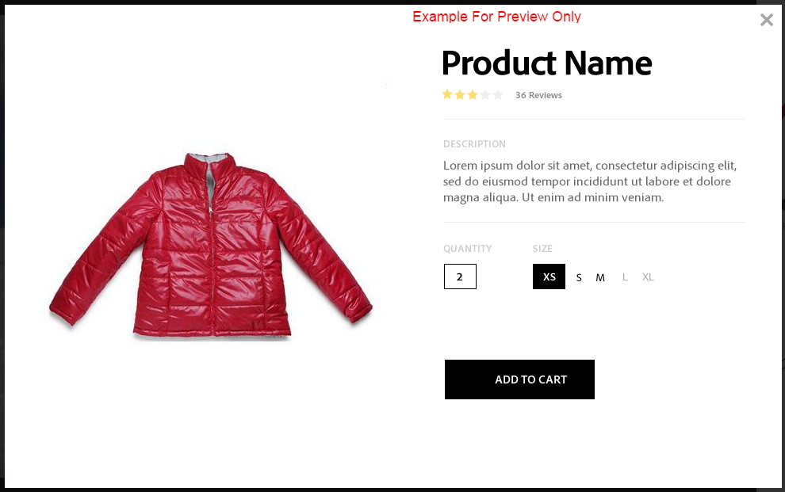

# Vídeos interativos{#interactive-videos}

Você pode criar vídeos interativos com facilidade (também conhecidos como vídeos que podem ser comprados), que impulsionam a conversão diretamente do vídeo. Os visualizadores se envolvem por um painel lateral ao lado do reprodutor de vídeo. À medida que o vídeo destaca um item, o painel rola as miniaturas de serviços, informações ou produtos relacionadas até a visualização. Os clientes podem selecionar uma miniatura para acessar diretamente o serviço ou uma página da Web detalhada. Eles também podem adicionar o item ao carrinho para compra imediata.

Quando o vídeo termina, um resumo visual de todas as ofertas é exibido para orientar um call to action. Os clientes têm outra oportunidade de selecionar o item que desejam. Experiências acionáveis e específicas como essas aumentam os envolvimentos e as conversões do cliente.

Consulte também [Imagens interativas](/help/assets/dynamic-media/interactive-images.md).

## Vídeo interativo em ação {#interactive-video-in-action}

Para ver um vídeo interativo e que pode ser comprado, selecione [Demonstrações ao Vivo](https://landing.adobe.com/en/na/dynamic-media/ctir-2755/live-demos.html), role até o cabeçalho **[!UICONTROL Mídia que pode ser comprada]** da página e selecione o vídeo que pode ser comprado para iniciar a reprodução.

* Durante a reprodução, à medida que os produtos são usados no vídeo, o produto idêntico é exibido à direita como uma imagem em miniatura.

* Para pausar o vídeo e abrir a exibição rápida do produto, selecione a miniatura. Por exemplo, selecione a imagem em miniatura KitchenAid no vídeo para ver uma exibição de rotação de 360° do mixer ou amplie para ver os detalhes do mixer.

Consulte também [Usar Vídeo Interativo com Dynamic Media](https://experienceleague.adobe.com/en/docs/experience-manager-cloud-service/content/assets/dynamicmedia/interactive-videos#dynamic-media)

<!-- 

There was a link here that showed the video frame of an interactive video and when the reader selected the frame the video would play https://experienceleague.adobe.com/tools/dynamic-media-demo/shoppable-video/AXIS/index.html. This must now call a new interactive video

-->

<!-- 

[A frame from an interactive, shoppable video](assets/chlimage_1-126.png) *A video frame capture from an interactive, shoppable video.*

-->

>[!NOTE]
>
>Se você criar um vídeo interativo para iniciar uma página da Web quando um usuário selecionar uma imagem em miniatura, alguns dispositivos impedirão que a página da Web pop-up seja aberta. Nesses casos, altere a configuração do bloqueador de pop-ups no dispositivo. Por exemplo, em um Apple iPhone 6, vá para **[!UICONTROL Configurações]** > **[!UICONTROL Safari]** > **[!UICONTROL Bloquear Pop-ups]** e deslize o controle para **[!UICONTROL Desativado]**. Agora, ao reproduzir um vídeo interativo e selecionar uma miniatura, você será avisado se quiser abrir o pop-up. Se você aceitar, a página da Web será aberta.

### Veja como os vídeos interativos são criados {#watch-how-interactive-videos-are-created}

Assista a uma apresentação sobre [como os vídeos interativos são criados](https://s7d5.scene7.com/s7viewers/html5/VideoViewer.html?videoserverurl=https://s7d5.scene7.com/is/content/&emailurl=https://s7d5.scene7.com/s7/emailFriend&serverUrl=https://s7d5.scene7.com/is/image/&config=Scene7SharedAssets/Universal_HTML5_Video_social&contenturl=https://s7d5.scene7.com/skins/&asset=S7tutorials/InteractiveVideo)&#x200B;(7 minutos e 30 segundos).
(Embora a apresentação em vídeo tenha a marca Assets on Demand, os princípios e etapas ainda se aplicam a Vídeo interativo no Adobe Experience Manager Assets.)

<!-- NOT FOUND ANYMORE. FIND REPLACEMENT
### Adobe customer success webinar {#adobe-customer-success-webinar}

The [Use Interactive Video, Link Sharing, and YouTube sharing in Experience Manager Assets](https://adobecustomersuccess.adobeconnect.com/p1yxzdo4aec/) webinar teaches you how to use interactive video and other features to tie conversion driven events into your video marketing content. -->

## Início rápido: vídeos interativos {#quick-start-interactive-videos}

A descrição do fluxo de trabalho passo a passo a seguir foi projetada para ajudar você a começar a usar os vídeos interativos no Dynamic Media com rapidez.

Procure o cabeçalho **Exemplo** em algumas tarefas do Início rápido. Ele contém um breve tutorial baseado nesta [página da Web de demonstração inicial que *ainda não* adicionou interatividade a ela](https://experienceleague.adobe.com/tools/dynamic-media-demo/shoppable-video/john-lewis/landing-0.html).

Os **Exemplos** ajudam a ilustrar as etapas da integração de vídeos interativos em seu próprio site.

Quando você terminar o tutorial na última seção de Exemplo, [sua página da Web de demonstração final com o vídeo interativo totalmente integrado aparecerá desta forma](https://experienceleague.adobe.com/tools/dynamic-media-demo/shoppable-video/john-lewis/landing-3.html).

Etapas de vídeo interativo:

1. **(Opcional) Identificar variáveis do Quickview** - Comece identificando variáveis dinâmicas usadas pela implementação do Quickview existente. As variáveis são usadas para mapear miniaturas de produtos ao Quickview do produto correspondente quando você cria o vídeo interativo. Consulte [(Opcional) Identificando as variáveis do Quickview](#optional-identifying-quickview-variables).
   **Esta etapa só será necessária se todos os itens a seguir forem verdadeiros:**
   * Você deseja adicionar interatividade ao vídeo acionando as Exibições rápidas.
   * Sua implementação do Experience Manager *não* usa uma estrutura de integração de comércio eletrônico. Ele não extrai dados de produtos para a Experience Manager de soluções como o IBM® WebSphere® Commerce, Elastic Path, SAP Hybris ou Intershop.

1. **(Opcional) Criar uma predefinição do visualizador de Vídeo Interativo** - Personalize a aparência e o comportamento de vários componentes que compõem o reprodutor, como o depurador de vídeo e as miniaturas interativas.
Criar sua própria predefinição do visualizador de vídeo interativo não é necessário se você pretende usar as predefinições do visualizador de vídeo interativo predefinidas `Shoppable_Video_Light` ou `Shoppable_Video_Dark`.
Consulte [Criar uma Predefinição do Visualizador](/help/assets/dynamic-media/managing-viewer-presets.md#creating-a-new-viewer-preset) (opcional) e [Considerações especiais para criar uma predefinição do Visualizador Interativo](/help/assets/dynamic-media/managing-viewer-presets.md#special-considerations-for-creating-an-interactive-viewer-preset).

1. **Carregar um vídeo e seus ativos de imagem associados** - Carregue um vídeo e imagens associadas que você deseja tornar interativos.
Consulte [Carregar um vídeo e seus ativos em miniatura associados](#uploading-a-video-and-its-associated-thumbnail-assets).

   >[!NOTE]
   >
   >O formato de vídeo MXF ainda não é compatível com o uso de vídeos interativos no Dynamic Media.

1. **Adicionar interatividade ao vídeo** - Adicione um ou mais segmentos de tempo ao vídeo. Em seguida, associe as miniaturas de imagem nesses segmentos de tempo. Atribua cada miniatura de imagem a uma ação, como um hiperlink, um Quickview ou um Fragmento de experiência.
(O método de vinculação baseado em URL não é possível se o conteúdo interativo tiver links com URLs relativos, especialmente links para páginas do Experience Manager Sites.)
Conclua o publicando os ativos de vídeo interativos. A publicação cria o código ou URL de incorporação que você eventualmente copia e aplica à página de aterrissagem do site. Consulte [Adicionar interatividade ao seu vídeo](#adding-interactivity-to-your-video).
Consulte [Publicar Assets](/help/assets/dynamic-media/publishing-dynamicmedia-assets.md).

1. **Adicionar um vídeo interativo ao seu site ou ao seu site no Experience Manager** - Se você usa o Experience Manager Sites ou o eCommerce, ou ambos, adicione o vídeo interativo a uma página da Web no Experience Manager. Arraste o componente Mídia interativa para a página. Consulte [Adicionar o Dynamic Media Assets às páginas](/help/assets/dynamic-media/adding-dynamic-media-assets-to-pages.md).
Use o código de incorporação ou o URL para integrar o vídeo interativo às experiências do site. Consulte [Integrar um vídeo interativo ao seu site](#integrating-an-interactive-video-with-your-website).
Se você estiver usando um WCM (Web Content Manager, gerenciador de conteúdo da Web) de terceiros, é necessário integrar o novo vídeo interativo à implementação existente do Quickview usada em seu site. Consulte [Integrar um vídeo interativo a um Quickview existente](#integrating-an-interactive-video-with-an-existing-quickview).
   [Adicionar o Dynamic Media Assets às páginas](/help/assets/dynamic-media/adding-dynamic-media-assets-to-pages.md)

## (Opcional) Identificar variáveis do Quickview {#optional-identifying-quickview-variables}

>[!NOTE]
>
>Essa tarefa só será necessária se o seguinte for verdadeiro:
>
>* Você deseja adicionar interatividade ao vídeo acionando as Exibições rápidas.
>* A configuração do Experience Manager não usa uma estrutura de integração de comércio eletrônico. Ele não extrai dados de produtos do IBM® WebSphere® Commerce, Elastic Path, SAP Hybris ou Intershop.
>
>Se sua implementação do Experience Manager usar comércio eletrônico, você poderá ignorar essa tarefa e prosseguir para a próxima tarefa.

Comece identificando as variáveis dinâmicas usadas pela sua implementação do Quickview existente, para que você possa mapear as miniaturas de produtos para o Quickview do produto correspondente durante o processo de criação interativo de vídeos.

Ao adicionar segmentos de tempo a um vídeo, você atribui uma SKU (Stock Keeping Unit, Unidade de manutenção de estoque) e quaisquer variáveis adicionais a cada miniatura adicionada a um segmento. Essas variáveis são usadas posteriormente para exibir o produto Quickview correto.

É importante identificar corretamente quais variáveis são necessárias para acionar exclusivamente uma Quickview do produto.

Às vezes, basta consultar especialistas de TI responsáveis pela implementação existente do Quickview. Eles provavelmente conhecerão o conjunto mínimo de dados que identifica o Quickview no sistema. No entanto, é possível analisar simplesmente o comportamento existente do código front-end.

A maioria das implementações do Quickview usa o seguinte paradigma:

* O usuário ativa um elemento da interface do usuário no site. Por exemplo, selecionar um botão &quot;Quickview&quot;.
* O site envia uma solicitação de Ajax para o backend a fim de carregar os dados ou o conteúdo da Visualização rápida, se necessário.
* Os dados do Quickview são traduzidos no conteúdo como preparação para renderização na página da Web.
* Por fim, o código de front-end renderiza visualmente esse conteúdo na tela.

A abordagem, portanto, é visitar diferentes áreas do site existente onde o Quickview é implementado. Em seguida, acione o Quickview e adquira o URL do Ajax enviado pela página da Web para carregar os dados ou conteúdo do Quickview.

Normalmente, não há necessidade de usar ferramentas de depuração especializadas. Navegadores da Web modernos possuem inspetores da Web que fazem um trabalho adequado. A seguir estão alguns exemplos de navegadores da Web que incluem inspetores da Web:

* Para ver todas as solicitações HTTP de saída no Google Chrome, pressione **F12** (Windows®) ou **Command+Options+I** (Mac) para abrir o painel Ferramentas do Desenvolvedor e selecione a guia **Rede**.

* No Firefox, ative o plug-in do Firebug com o **F12** (Windows®) ou o **Command+Option+I** (Mac) e use a guia **[!UICONTROL Net]**. Como alternativa, use o Inspetor interno e sua guia **Rede**.

* No Internet Explorer, ative a ferramenta de depuração pressionando **F12**.

Quando o monitoramento de rede estiver ativado no navegador, acione o Quickview na página.

Agora, localize o URL do Ajax Quickview no log de rede e copie o URL gravado para análise futura. Geralmente, quando você aciona a Visualização rápida, várias solicitações são enviadas para o servidor. Normalmente, o URL do Ajax Quickview é um dos primeiros na lista. Ele tem uma parte ou um caminho de cadeia de caracteres de consulta complexo e seu tipo MIME de resposta é `text/html`, `text/xml` ou `text/javascript`.

Durante esse processo, é importante visitar diferentes áreas do site, com diferentes categorias e tipos de produtos. O motivo é que os URLs do Quickview têm partes comuns em determinada categoria de site, mas só são alterados se você visitar outra área do site.

No caso mais simples, a única parte variável no URL do Quickview é o SKU do produto. Nesse caso, o valor do SKU do produto é a única parte de dados necessária para adicionar miniaturas a um segmento de tempo no vídeo interativo no Experience Manager.

Para cenários mais complexos, o URL do Quickview adiciona campos além do SKU do produto, como ID de categoria e código de cor. Nesses casos, cada elemento se torna uma variável separada na definição de dados em miniatura no Experience Manager.

Considere os seguintes exemplos de URLs do Quickview e as variáveis de miniatura resultantes:

<table>
  <tbody>
  <tr>
    <td><p>SKU única. Encontrado na sequência de consulta.</p> </td>
    <td><p>Os URLs de Quickview gravados incluem o seguinte:</p>
    <ul>
      <li><p><code>https://server/json?productId=866558&source=100</code></p> </li>
      <li><p><code>https://server/json?productId=1196184&source=100</code></p> </li>
      <li><p><code>https://server/json?productId=1081492&source=100</code></p> </li>
      <li><p><code>https://server/json?productId=1898294&source=100</code></p> </li>
    </ul> <p>A única parte variável na URL é o valor do parâmetro da cadeia de caracteres de consulta <code>productId=</code>, e é claramente um valor de SKU. Portanto, as miniaturas só precisam de campos SKU preenchidos com valores como <strong><code>866558</code></strong>, <strong><code>1196184</code></strong>, <strong><code>1081492</code></strong>, <strong><code>1898294</code></strong>.</p> </td>
  </tr>
  <tr>
    <td><p>SKU única. Encontrado no caminho do URL.</p> </td>
    <td><p>Os URLs de Quickview gravados incluem o seguinte:</p>
    <ul>
      <li><p><code>https://server/product/6422350843</code></p> </li>
      <li><p><code>https://server/product/1607745002</code></p> </li>
      <li><p><code>https://server/product/0086724882</code></p> </li>
    </ul> <p>A parte variável está na última parte do caminho e se torna o valor SKU das miniaturas do Experience Manager: <strong><code>6422350843</code></strong>, <strong><code>1607745002</code></strong>, <strong><code>0086724882</code></strong>.</p> </td>
  </tr>
  <tr>
    <td><p>SKU e ID de categoria na cadeia de caracteres de consulta.</p> </td>
    <td><p>Os URLs de Quickview gravados incluem o seguinte:</p>
    <ul>
      <li><p><code>https://server/quickView/product/?category=1100004&prodId=305466</code></p> </li>
      <li><p><code>https://server/quickView/product/?category=1100004&prodId=310181</code></p> </li>
      <li><p><code>https://server/quickView/product/?category=1740148&prodId=308706</code></p> </li>
    </ul> <p>Nesse caso, há duas partes variáveis no URL. A SKU está armazenada no parâmetro <code>prodId</code> e a ID da categoria está armazenada no parâmetro <code>category=</code>.</p> <p>Dessa forma, as definições de miniatura são pares. Isto é, um valor de SKU e uma variável extra chamada <code>categoryId</code>. Os pares resultantes são os seguintes:</p>
    <ul>
      <li>A SKU é <code>305466</code> e <code>categoryId</code> é <code>1100004</code></li>
      <li>A SKU é <code>310181</code> e <code>categoryId</code> é <code>1100004</code></li>
      <li>A SKU é <code>308706</code> e <code>categoryId</code> é <code>1740148</code></li>
    </ul> <p> </p> </td>
  </tr>
  </tbody>
</table>

**Exemplo**

Quando a abordagem acima é aplicada ao site Exemplo, você tem uma página da Web com várias miniaturas de produtos, cada uma com um botão &quot;VEJA MAIS&quot;:

[https://experienceleague.adobe.com/tools/dynamic-media-demo/shoppable-video/john-lewis/landing-0.html](https://experienceleague.adobe.com/tools/dynamic-media-demo/shoppable-video/john-lewis/landing-0.html)

Depois de ativar todas as Visualizações rápidas de produto disponíveis na página, você obterá a seguinte lista de solicitações de Visualização rápida feitas no back-end:

* datafeed/candles-233396346.json
* datafeed/candles-233978050.json
* datafeed/candles-234024346.json
* datafeed/candles-234024356.json
* datafeed/candles-234024359.json
* datafeed/cushions-233939848.json
* datafeed/cushions-234019477.json
* datafeed/cushions-234019483.json
* datafeed/furniture-231747479.json
* datafeed/furniture-232625621.json
* datafeed/furniture-232625626.json
* datafeed/furniture-233939810.json
* datafeed/furniture-233939825.json
* datafeed/furniture-233939828.json
* datafeed/furniture-233939853.json
* datafeed/furniture-233940334.json
* datafeed/glassware-000064007.json
* datafeed/glassware-230722193.json
* datafeed/glassware-233916550.json
* datafeed/glassware-233916597.json

Observando as chamadas do servidor, informações específicas do produto estão presentes somente no caminho da solicitação. Você também percebe que a sequência de consulta não é usada e que há dois tipos distintos de dados envolvidos:

* O primeiro tipo são velas, almofadas, móveis e utensílios de vidro. Você pode chamar isso de &quot;categoria de produto&quot;.
* O segundo tipo é o código do produto, como 233916597. Você pode supor que seja &quot;SKU do produto&quot;.

Dadas essas informações, todo o URL do Quickview tem o seguinte padrão:

`/datafeed/$categoryId$-$SKU$.json`

Com base nessa análise, você conclui que pode usar as duas variáveis a seguir para as miniaturas: `categoryId` e `SKU`.

Agora você está pronto para fazer upload de um vídeo e de seus ativos em miniatura associados.

## (Opcional) Criar uma predefinição do visualizador de vídeo interativo {#optional-creating-an-interactive-video-viewer-preset}

Ignore essa tarefa e vá para a próxima se quiser usar qualquer um dos tipos de predefinição de visualizador de vídeo interativo, padrão e pronto para uso, `Shoppable_Video_dark` ou `Shoppable_Video_light`.

Quando uma miniatura é selecionada no ambiente de criação, é exibida uma pré-visualização da caixa de diálogo Visualização rápida.



Opcionalmente, é possível criar sua própria predefinição do visualizador de vídeo interativo personalizado. É possível determinar, entre outras coisas, o estilo do reprodutor de vídeo, as miniaturas interativas e a exibição da grade de miniaturas que aparece no final do vídeo.

Uma predefinição interativa do visualizador de vídeo renderiza corretamente o vídeo e todos os segmentos de linha do tempo adicionados. Ela também usa um exemplo de Quickview padrão ao selecionar uma miniatura de produto no modo de Visualização, para que você possa testar a interatividade antes de publicar.

Após salvar a predefinição do visualizador, seu estado é automaticamente definido como **Ativado &#x200B;** in na página Predefinições do visualizador. Esse estado significa que está visível no componente do Dynamic Media e sempre que você visualiza um vídeo com ele. Certifique-se de publicar manualmente a nova predefinição do visualizador.

Consulte [Criar uma predefinição do visualizador](/help/assets/dynamic-media/managing-viewer-presets.md#creating-a-new-viewer-preset) para criar sua própria predefinição interativa do visualizador de vídeo.

## Carregar um vídeo e seus ativos em miniatura associados {#uploading-a-video-and-its-associated-thumbnail-assets}

Se você já carregou os ativos de vídeo e miniatura, prossiga para [Adicionar interatividade ao vídeo](#adding-interactivity-to-your-video).

>[!NOTE]
>
>O formato de vídeo MXF ainda não é compatível com o uso de vídeos interativos no Dynamic Media.

Se você carregou os vídeos ou imagens errados, ou se deseja excluir os vídeos ou imagens carregados que não são mais necessários, consulte [Excluir Assets](/help/assets/manage-digital-assets.md#delete-assets).

Para fazer upload de um vídeo e de seus ativos em miniatura associados:

1. Carregue o vídeo e os ativos em miniatura associados na pasta ou pastas desejadas.

   Consulte [Carregar ativos](/help/assets/manage-digital-assets.md).
Consulte [Fazer upload de ativos usando o agendamento de trabalhos FTP](/help/assets/manage-digital-assets.md).

   Agora, adicione interatividade ao vídeo.

## Adicionar interatividade ao vídeo {#adding-interactivity-to-your-video}

Adicione segmentos de linha do tempo a um vídeo usando o editor visual no local na página Criar vídeo interativo.

Depois de adicionar segmentos de linha do tempo, você adiciona imagens em miniatura em cada segmento. Para cada miniatura adicionada, aplique uma ação a ela. Por exemplo, você pode aplicar uma Visualização rápida à miniatura, atribuir um hiperlink a ela ou um Fragmento de experiência.

Consulte [Fragmentos de experiência](/help/sites-cloud/authoring/fragments/content-fragments.md).

>[!NOTE]
>
>As ferramentas de compartilhamento de redes sociais em vídeo interativo não são compatíveis quando você incorpora o visualizador em um Fragmento de experiência. Em vez disso, você pode usar ou criar predefinições do visualizador que não tenham ferramentas de compartilhamento de redes sociais. Essas predefinições do visualizador permitem incorporá-lo com sucesso aos Fragmentos de experiência.

>[!NOTE]
>
>O método de vinculação baseado em URL não é possível se o conteúdo interativo tiver links com URLs relativos, principalmente links para páginas do Experience Manager Sites.

As opções Desfazer e Refazer, próximas ao canto superior direito da página, são compatíveis durante a sessão de criação/edição atual.

Depois de salvar o vídeo interativo, ele é aberto imediatamente na Pré-visualização. Ali, é possível selecionar uma predefinição interativa do visualizador de vídeo e reproduzir o vídeo para ver uma representação aproximada de como ele é exibido para os clientes.

**Para adicionar interatividade ao seu vídeo:**

1. Na visualização do Assets, navegue até o vídeo que você carregou e deseja tornar interativo.
1. Siga uma das seguintes opções:

   * Passe o mouse sobre a imagem e selecione **[!UICONTROL Selecionar]** (ícone de marca de seleção). Na barra de ferramentas, selecione **[!UICONTROL Editar]**.

   * Passe o mouse sobre a imagem e selecione **[!UICONTROL Mais ações]** (ícone de três pontos) **[!UICONTROL > Editar]**.

   * Para abri-la na página Exibição de detalhes, selecione a imagem. Na barra de ferramentas, selecione **[!UICONTROL Editar]**.

1. Na página Criar vídeo interativo, siga um destes procedimentos:

   * Para começar a reproduzir o vídeo, selecione o botão **[!UICONTROL Reproduzir]**. Quando um produto, serviço ou detalhe específico que você deseja realçar for exibido, selecione **[!UICONTROL Adicionar segmento]** na barra de ferramentas. Repita até chegar ao fim do vídeo.

     Para cada segmento de tempo adicionado, é possível atribuir uma ou mais imagens em miniatura a ele. Em seguida, é possível vincular essas miniaturas às páginas de produto do Quickview para os clientes comprarem ou às páginas da Web para obter mais informações.

   * Para começar a reproduzir o vídeo, selecione o botão **[!UICONTROL Reproduzir]**. Quando um produto, serviço ou detalhe específico que você deseja destacar aparecer na exibição, selecione **[!UICONTROL Pausar]**. Selecione **[!UICONTROL Adicionar segmento]**.

     Continue a reproduzir e pausar o vídeo em pontos ao longo da linha do tempo em que deseja adicionar um segmento até chegar ao fim do vídeo.

1. (Opcional) Arraste a barra no **[!UICONTROL Controle deslizante Escala da linha do tempo]** para a esquerda para aumentar ou diminuir o zoom e para direita para diminuir o zoom. Essa ação permite controlar quantos detalhes você vê dos segmentos adicionados.

   

   Dependendo da duração do vídeo, a Duração do segmento assume os seguintes valores como padrão:

   <table>
      <tbody>
        <tr>
        <td><strong>Se a duração do vídeo for...</strong></td>
        <td><strong>A configuração padrão de Duração do segmento é...</strong></td>
        </tr>
        <tr>
        <td>3 minutos ou mais</td>
        <td>60 segundos</td>
        </tr>
        <tr>
        <td>2-3 minutos</td>
        <td>30 segundos</td>
        </tr>
        <tr>
        <td>1-2 minutos</td>
        <td>20 segundos<br /> </td>
        </tr>
        <tr>
        <td>30 a 60 segundos</td>
        <td>10 segundos</td>
        </tr>
        <tr>
        <td>30 segundos ou menos</td>
        <td>5 segundos</td>
        </tr>
      </tbody>
    </table>

   A linha do tempo do vídeo usa tanto espaço na tela quanto o que é disponibilizado para ele. Dessa forma, ao redimensionar o navegador, os segmentos adicionados mantêm a largura correta.

   Para ilustrar, as três capturas de tela a seguir estão usando o mesmo vídeo. Observe que a largura de cada segmento muda dependendo da configuração de Escala da linha do tempo.

   

   Captura de tela A

   A captura de tela A acima mostra a exibição padrão de um vídeo de produto de 29 segundos. A Escala da linha do tempo é definida como o padrão de 5 segundos.

   

   Captura de tela B

   Na Captura de tela B acima, o controle deslizante Escala da linha do tempo foi arrastado do padrão de 5 segundos para 3 segundos. Observe que os carimbos de data e hora individuais da Escala da linha do tempo agora estão todos definidos em intervalos de 3 segundos.

   

   Captura C

   Na Captura de tela C acima, a configuração Escala da linha do tempo foi movida para 8 segundos. Observe como os segmentos que contêm miniaturas de produtos encolheram. Para vídeos longos, reduza o zoom para ter uma visão geral de mais segmentos do que a largura da página normalmente mostra.

1. (Opcional) Siga qualquer um destes procedimentos:

   * Para ajustar a hora inicial e a hora final de um segmento.

     Selecione um segmento e arraste o oval azul à esquerda ou à direita para ajustar a hora inicial ou final, respectivamente. O quadro do vídeo exibido se move para o momento apropriado no vídeo, com base nos ajustes. O movimento do segmento da linha do tempo é restrito com base em quaisquer segmentos adjacentes na linha do tempo. O tempo mínimo de segmento permitido é de um segundo.

     Use os seguintes atalhos de navegação para verificar rapidamente e ajustar os segmentos de vídeo:

      * Para buscar o vídeo diretamente no início desse segmento, selecione a oval azul à esquerda.
      * Para buscar o vídeo diretamente no final desse segmento, selecione o oval azul à direita.
      * Para retornar a reprodução de vídeo para o início desse segmento, selecione o segmento inteiro.

   

   Reposicionamento do final de um segmento da linha do tempo

   * Para excluir um segmento

     Selecione o último segmento na linha do tempo e, na barra de ferramentas, selecione **[!UICONTROL Excluir segmento]**. Se dois ou mais segmentos forem selecionados, o recurso `Delete Segment` será desabilitado.

     Você só pode excluir o último segmento. Por exemplo, se você deseja excluir todos os segmentos na linha do tempo, sempre selecione o último e selecione **[!UICONTROL Excluir segmento]**.

1. Selecione um segmento de tempo ao qual você deseja associar uma ou mais imagens em miniatura.
1. À direita do vídeo, selecione a guia **[!UICONTROL Content]**.
1. Na guia Conteúdo, selecione **[!UICONTROL Selecionar Assets]**, procure e selecione todos os ativos de imagem que deseja usar com seu vídeo. Os ativos selecionados são adicionados ao painel Seletor de ativos na guia Conteúdo.

1. No seletor de ativos abaixo da guia Conteúdo, siga um destes procedimentos:

   <table>
      <tbody>
        <tr>
        <td>Para associar uma miniatura ao segmento de linha do tempo selecionado</td>
        <td><p>Selecione a imagem no painel seletor de ativos à direita.</p> <p>Você pode adicionar quantas miniaturas desejar a um segmento da linha do tempo. Para cada imagem selecionada, uma marca de seleção aparece sobre a imagem no seletor de ativos.</p> </td>
        </tr>
        <tr>
        <td>Para remover uma miniatura do segmento de linha do tempo selecionado</td>
        <td><p>Siga um destes procedimentos:</p>
          <ul>
          <li>No painel do seletor de ativos, selecione uma imagem com uma marca de seleção para desmarcá-la. O ativo de imagem foi removido do segmento da linha do tempo.<br /> </li>
          <li>No segmento da linha do tempo selecionado, selecione uma imagem e, na barra de ferramentas, selecione <strong>Excluir produto</strong>.</li>
          </ul> </td>
        </tr>
      </tbody>
    </table>

   

   Selecionar uma imagem no painel seletor de ativos a adiciona ao segmento da linha do tempo selecionado.

1. Selecione uma única imagem em miniatura dentro de um dos segmentos da linha do tempo e selecione a guia **[!UICONTROL Ações]**.
1. Siga um destes procedimentos:
   <table> 
    <tbody> 
      <tr> 
      <td>Para associar a imagem em miniatura selecionada a uma visualização rápida</td> 
      <td><p>Em Tipo de ação, selecione <strong>Quickview</strong>.</p> <p>Se você for um cliente do Experience Manager Sites e do Ecommerce:</p> 
       <ul> 
       <li>Observe que o campo de texto Valor do SKU é pré-preenchido com o SKU (Unidade de manutenção de estoque) do produto selecionado. O SKU é um identificador exclusivo para cada produto ou serviço distinto que você oferece. Esse campo é preenchido automaticamente quando a imagem é associada a um produto no Experience Manager Commerce.</li> 
       <li>Se o SKU pré-preenchido estiver incorreto, selecione o ícone Seletor de produto (lupa) para abrir a página Selecionar produto. Selecione o produto que deseja usar e marque a marca de seleção no canto superior direito da página. Você volta ao Editor de vídeo interativo.</li> 
       </ul> <p> Se você for <em>não</em> um cliente do Experience Manager Sites ou do Ecommerce</p> 
       <ul> 
       <li>Consulte <a href="/help/assets/dynamic-media/carousel-banners.md#identifying-hotspot-and-image-map-variables">Identificação de variáveis de ponto de acesso</a>. Essas variáveis devem ser definidas.</li> 
       <li>Por padrão, esse campo SKU usa o nome de arquivo do ativo de imagem sem a extensão. Se você seguir uma convenção de nomenclatura padrão para seus arquivos com base no SKU, esse campo normalmente não exigirá edições adicionais. </li> 
       <li>Caso contrário, edite o valor padrão e insira o valor SKU correto. No campo de texto Valor do SKU, digite o SKU (Unidade de manutenção de estoque) do produto, que é um identificador exclusivo para cada produto ou serviço distinto que você oferece. O valor SKU inserido preenche automaticamente a parte variável do modelo Quickview para que o sistema saiba como associar a imagem selecionada a uma Quickview de SKU específica.</li> 
       </ul> <p>(Opcional) Se houver outras variáveis no Quickview que você deve usar para identificar um produto adicional, selecione <strong>Adicionar variável genérica</strong>. No campo de texto, especifique uma variável extra. Por exemplo, <code>category=Womens</code> é uma variável adicionada.</p> <p> </p> </td> 
      </tr> 
      <tr> 
      <td>Para associar a imagem em miniatura selecionada a um hiperlink</td> 
      <td><p>Em Tipo de ação, selecione <strong>Hiperlink</strong> e siga um destes procedimentos:</p> 
       <ul> 
       <li>Se você for um cliente do Experience Manager Sites, selecione o ícone Seletor de sites (pasta) para navegar até uma página da Web. O método de vinculação baseado em URL não é possível se o conteúdo interativo tiver links com URLs relativos, principalmente links para páginas do Experience Manager Sites.</li> 
       <li>Se você for um cliente independente do Dynamic Media, no campo de texto HREF, especifique o caminho completo do URL para uma página da Web vinculada.</li> 
       </ul> <p>Certifique-se de especificar se o link deve ser aberto em uma nova guia do navegador ou na guia atual.</p> </td> 
      </tr> 
      <tr> 
      <td>Para associar a imagem em miniatura selecionada a um Fragmento de experiência</td> 
      <td><p>Em Tipo de ação, selecione <strong>Fragmento de experiência</strong> e faça o seguinte:<p> 
       <ul> 
       <li>Se você for um cliente do Experience Manager Sites, selecione o ícone Pesquisar (lupa) para abrir a página Fragmento de experiência. Selecione o Fragmento de experiência que deseja usar e selecione <strong>Para retornar ao painel Ações na página anterior, selecione </strong>no canto superior direito da página.<br /> Consulte <a href="/help/sites-cloud/authoring/fragments/content-fragments.md">Fragmentos de experiência</a>.</li> 
      </ul> 
       <ul> 
       <li>Especifique a largura e a altura do Fragmento de experiência conforme ele é exibido no vídeo.</li>
       </ul><strong>Observação</strong>: as ferramentas de compartilhamento de redes sociais em vídeo interativo não têm suporte quando você incorpora o visualizador em um Fragmento de experiência. Em vez disso, você pode usar ou criar predefinições do visualizador que não tenham ferramentas de compartilhamento de redes sociais. Essas predefinições do visualizador permitem incorporá-lo com sucesso aos Fragmentos de experiência.</p></tr>&lt; 
      <tr> 
      <td>Para editar uma ação já atribuída a uma imagem em miniatura</td> 
      <td>Em um segmento de linha do tempo, selecione uma imagem em miniatura que tenha um link em cadeia à direita do rótulo de texto. O vínculo de cadeia indica que uma ação está atribuída a ela. Para fazer suas alterações, selecione a guia <strong>Ações</strong>.</td> 
      </tr> 
      <tr> 
      <td>Para alterar o rótulo do texto de uma imagem em miniatura</td> 
      <td><p>Por padrão, o rótulo de texto usa o campo de metadados <code>Title</code> da imagem em miniatura. Se <code>Title</code> não estiver presente, o nome de arquivo da imagem em miniatura será usado, mas sem a extensão.</p> <p>Para alterar o rótulo do texto de uma imagem de miniatura, na guia <strong>Ações </strong>, logo abaixo do ativo de imagem que é exibido, insira o texto desejado. Veja a imagem abaixo.</p> <p>O novo rótulo de texto é usado somente pelo próprio reprodutor de vídeo e pelo texto em miniatura exibido no segmento da linha do tempo. A alteração do rótulo não afeta o campo de metadados Título da imagem em miniatura ou seu nome de arquivo.</p> </td> 
      </tr> 
      <tr> 
      <td>Reverter uma alteração</td> 
      <td>Próximo ao canto superior direito da página, selecione <strong>Desfazer</strong> ou <strong>Refazer</strong>.</td> 
      </tr> 
    </tbody> 
   </table>

   

   Um novo rótulo de texto é adicionado à imagem em miniatura.

1. Siga uma das seguintes opções:

   * Repita as etapas 6 a 11 para adicionar mais imagens em miniatura a segmentos da linha do tempo em seu vídeo.
   * Prossiga para a etapa opcional 13.

1. (Opcional) Siga um destes procedimentos:

   * **[!UICONTROL Mesclar segmento]** - Você pode combinar dois segmentos adjacentes (com ou sem miniaturas de produto atribuídas a eles) em um segmento.

     Na linha do tempo, selecione dois ou mais segmentos contíguos que você deseja mesclar em um. Não há alças de arrastar ovais azuis nos dois segmentos selecionados na imagem abaixo.

     Selecione **[!UICONTROL Mesclar segmento]** na barra de ferramentas.

   

   Mesclar dois segmentos de cinco segundos selecionados em um segmento de dez segundos.

   * **[!UICONTROL Dividir segmento]** - Você pode dividir um único segmento em dois segmentos de tempo igual. Se houver miniaturas de produtos já atribuídas ao segmento, as miniaturas serão combinadas no segmento esquerdo.

     Na linha do tempo, selecione um segmento que você deseja dividir pela metade e selecione **[!UICONTROL Dividir segmento]** na barra de ferramentas.

     Selecionar dois ou mais segmentos desabilita o recurso **[!UICONTROL Dividir Segmento]**.

   

   Dividir um segmento de dez segundos selecionado em dois segmentos de cinco segundos cada.

1. Próximo ao canto superior direito da página **[!UICONTROL Criar vídeo interativo]**, o nome da predefinição do visualizador selecionada no momento usada com o vídeo é exibido. Para selecionar outra predefinição do visualizador, selecione o nome.

   Por exemplo, a predefinição do visualizador `Shoppable_Video_light` permite reproduzir o vídeo com uma área de exibição branca ao lado do vídeo. A área de exibição é onde as imagens em miniatura selecionáveis são exibidas durante a reprodução. A predefinição do visualizador `Shoppable_Video_dark` permite reproduzir o vídeo com uma área de exibição preta ao lado do vídeo.

   Se você criou sua própria predefinição interativa do visualizador de vídeo, poderá vê-la na lista de predefinições disponíveis.

   Quando terminar, selecione **[!UICONTROL Salvar]**.

   >[!NOTE]
   >
   >Ao salvar o vídeo interativo, um arquivo associado é automaticamente salvo com ele. `.vtt` O arquivo `.vtt` está salvo na pasta `_VTT`, na raiz da **[!UICONTROL Assets]**. O arquivo e a pasta são necessários para que o vídeo interativo seja reproduzido corretamente no site. Sendo assim, não mova, edite ou exclua a pasta `_VTT` ou seu conteúdo.

1. Publique o vídeo interativo. A publicação cria o código ou URL de incorporação que você eventualmente copia e cola no site.

   Se você tiver adicionado interatividade com as Visualizações rápidas, use apenas o código de incorporação; se tiver adicionado interatividade com páginas da Web com hiperlink, você também poderá usar o URL publicado. Observe, no entanto, que o método de vinculação baseado em URL não é possível se o conteúdo interativo tiver links com URLs relativos, principalmente links para páginas do Experience Manager Sites.

   Consulte [Publicar ativos](publishing-dynamicmedia-assets.md).

   >[!NOTE]
   >
   >Para publicar um vídeo que pode ser comprado com as Visualizações rápidas, certifique-se de publicar separadamente cada um dos ativos de imagem relacionados ao vídeo na sua área de comércio.

   Depois de adicionar segmentos de linha do tempo e publicar o vídeo interativo, você está pronto para adicioná-lo à página de aterrissagem existente do site. Consulte [Integrar um vídeo interativo ao seu site](#integrating-an-interactive-video-with-your-website).

## Publicar ativos de vídeo interativos {#publishing-interactive-video-assets}

Consulte [Publicar Assets](/help/assets/dynamic-media/publishing-dynamicmedia-assets.md) para obter detalhes sobre como publicar ativos de vídeo interativos.

## Integre um vídeo interativo ao seu site {#integrating-an-interactive-video-with-your-website}

Após carregar um vídeo, adicionar segmentos de linha do tempo a ele e publicar o vídeo interativo, você está pronto para adicioná-lo ao seu site existente.

Se você for um cliente do Experience Manager Sites, poderá adicionar o vídeo interativo arrastando o componente de Mídia interativa para sua página. Consulte [Adicionar o Dynamic Media Assets às páginas](/help/assets/dynamic-media/adding-dynamic-media-assets-to-pages.md).

Se você for um cliente independente do Experience Manager Assets, poderá adicionar manualmente o vídeo interativo ao seu site, conforme descrito nesta seção.

1. Copie o código ou URL incorporado do vídeo interativo publicado.
Consulte [Incorporar o Visualizador de Vídeo ou Imagem a uma Página da Web](/help/assets/dynamic-media/embed-code.md).
Se você tiver adicionado interatividade com as Visualizações rápidas, use apenas o código de incorporação; se tiver adicionado interatividade com páginas da Web com hiperlink, você também poderá usar o URL publicado. Observe, no entanto, que o método de vinculação baseado em URL não é possível se o conteúdo interativo tiver links com URLs relativos, principalmente links para páginas do Experience Manager Sites.

1. No código da página da Web do público-alvo, identifique onde o vídeo estático está localizado.
1. Remova o vídeo estático e substitua o código pelo código incorporado ou URL que você copiou do Experience Manager Assets, como está.
O código incorporado copiado é definido para um ambiente responsivo, de modo que se ajuste automaticamente à área ocupada anteriormente pelo vídeo estático.

>[!NOTE]
>
>Neste ponto, se você adicionou interatividade somente com páginas da Web com hiperlink, está concluído.
>
>No entanto, se você adicionou qualquer interatividade para acionar uma Visualização rápida, as miniaturas ao lado do vídeo interativo serão somente para exibição; elas ainda não estão integradas às Visualizações rápidas existentes. Nesse caso, você deve integrar o vídeo interativo com as Exibições rápidas existentes no site.

**Exemplo**

Usando o site de demonstração como exemplo:

[https://experienceleague.adobe.com/tools/dynamic-media-demo/shoppable-video/john-lewis/landing-0.html](https://experienceleague.adobe.com/tools/dynamic-media-demo/shoppable-video/john-lewis/landing-0.html)

Observe que o código de inserção do vídeo é padrão:

```js {.line-numbers}
<style type="text/css">
 #s7video_div.s7videoviewer{
   width:100%;
   height:auto;
 }
</style>

<script type="text/javascript" src="https://demos-pub.assetsadobe.com/etc/dam/viewers/s7viewers/html5/js/VideoViewer.js"></script>
<div id="s7video_div"></div>
<script type="text/javascript">
 var s7videoviewer = new s7viewers.VideoViewer({
  "containerId" : "s7video_div",
  "params" : {
   "serverurl" : "https://adobedemo62-h.assetsadobe.com/is/image",
   "contenturl" : "https://demos-pub.assetsadobe.com/",
   "config" : "/etc/dam/presets/viewer/Video",
   "config2": "/etc/dam/presets/analytics",
   "videoserverurl": "https://gateway-na.assetsadobe.com/DMGateway/public/demoCo",
   "posterimage": "/content/dam/marketing/shoppable-video/john-lewis/shoppable-video-john-lewis-2014.mp4",
   "asset" : "/content/dam/marketing/shoppable-video/john-lewis/shoppable-video-john-lewis-2014.mp4" }
 }).init();
</script>
```

A integração é tão simples quanto remover o código de inserção do vídeo e substituí-lo pelo código de inserção interativo do vídeo do Experience Manager. Você pode ver o resultado no URL a seguir. Embora ele mostre um Vídeo interativo presente na página, ainda não está integrado às Exibições rápidas existentes:

[https://experienceleague.adobe.com/tools/dynamic-media-demo/shoppable-video/john-lewis/landing-1.html](https://experienceleague.adobe.com/tools/dynamic-media-demo/shoppable-video/john-lewis/landing-1.html)

## Integrar um vídeo interativo a uma visualização rápida existente {#integrating-an-interactive-video-with-an-existing-quickview}

>[!NOTE]
>
>Essa tarefa só se aplica se você for um cliente independente do Experience Manager Assets.

A última etapa desse processo é integrar seu vídeo interativo a uma implementação do Quickview existente usada em seu site. Não há solução para a integração que funcione para todos os casos. Cada implementação do Quickview é exclusiva. Dessa forma, é necessária uma abordagem específica que envolva a assistência de um profissional de TI de front-end.

A implementação existente do Quickview normalmente representa uma cadeia de ações inter-relacionadas que ocorrem na página da Web na seguinte ordem:

1. Um usuário aciona um elemento na interface do usuário do seu site.
1. O código de front-end obtém um URL do Quickview com base no elemento de interface do usuário que foi acionado na etapa 1.
1. O código de front-end envia uma solicitação AJAX usando o URL obtido na etapa 2.
1. A lógica de back-end retorna os dados ou o conteúdo correspondentes do Quickview ao código de front-end.
1. O código de front-end carrega os dados ou o conteúdo da visualização rápida.
1. Como opção, o código de front-end converte os dados do Quickview carregados em uma representação do HTML.
1. O código de front-end exibe uma caixa de diálogo ou painel modal e renderiza o conteúdo do HTML na tela para o usuário.

A lógica da página não chama essas coisas diretamente como endpoints de API públicos em pontos arbitrários. Em vez disso, é uma chamada encadeada em que cada próxima etapa é ocultada na última fase (retorno de chamada) da etapa anterior.

Enquanto o vídeo interativo substitui as etapas 1 e 2, o visualizador manipula as seleções de miniaturas no vídeo. O visualizador retorna um evento à página da Web que contém todos os dados de miniatura adicionados anteriormente ao Experience Manager.

Nesse manipulador de eventos, o código de front-end faz o seguinte:

* Escuta um evento emitido pelo vídeo interativo.
* Constrói um URL do Quickview com base nos dados de miniatura.
* Aciona o processo de carregar o Quickview do back-end; ele é renderizado na tela para exibição.

Além disso, o visualizador de vídeo interativo oferece suporte ao modo de operação de tela cheia. O usuário aciona Visualizações rápidas selecionando uma miniatura sem sair da tela cheia. Para obter essa funcionalidade, altere o código de front-end para que a caixa de diálogo modal do Quickview seja anexada ao contêiner do visualizador. Não adicione um BODY de documento ou algum outro elemento de página da Web que não esteja disponível quando o visualizador estiver no modo de tela cheia. O código que executa esse trabalho escuta uma ou mais chamadas de retorno do visualizador enviadas após o carregamento do visualizador na página.

O código de incorporação retornado pelo Experience Manager já tem um manipulador de eventos pronto para uso em vigor. Ele é comentado como visto no seguinte trecho de código destacado:

```js {.line-numbers}
<style type="text/css">
 #s7interactivevideo_div.s7interactivevideoviewer{
   width:100%;
   height:auto;
 }
</style>
<script type="text/javascript" src="https://demos-pub.assetsadobe.com/etc/dam/viewers/s7viewers/html5/js/InteractiveVideoViewer.js"></script>

<div id="s7interactivevideo_div"></div>
<script type="text/javascript">
 var s7interactivevideoviewer = new s7viewers.InteractiveVideoViewer({
  "containerId" : "s7interactivevideo_div",
  "params" : {
   "serverurl" : "https://adobedemo62-h.assetsadobe.com/is/image",
   "contenturl" : "https://demos-pub.assetsadobe.com/",
   "config" : "/etc/dam/presets/viewer/Shoppable_Video_light",
   "config2": "/etc/dam/presets/analytics",
   "videoserverurl": "https://gateway-na.assetsadobe.com/DMGateway/public/demoCo",
   "interactivedata": "content/dam/_VTT/marketing/shoppable-video/john-lewis/shoppable-video-john-lewis-2014.mp4.svideo.vtt",
   "VideoPlayer.contenturl": "https://adobedemo62-h.assetsadobe.com/is/content",
   "asset" : "/content/dam/marketing/shoppable-video/john-lewis/shoppable-video-john-lewis-2014.mp4" }
 })
 /* // Example of interactive video event for quickview.
   s7interactivevideoviewer.setHandlers({
   "quickViewActivate": function(inData) {
     var sku=inData.sku; //SKU for product ID
    //To pass other parameter from the hotspot, you need to add custom parameter during the hotspot setup as parameterName=value
    loadQuickView(sku); //Replace this call with your quickview plugin
    //See your quickviewer plugin for the quickview call
    },
"initComplete":function() {
    //--- Attach quickview pop-up to viewer container so pop-up works in fullscreen mode ---
    var popup = document.getElementById('quickview_div'); // get custom quickview container
    popup.parentNode.removeChild(popup); // remove it from current DOM
    var sdkContainerId = s7interactivevideoviewer.getComponent("container").getInnerContainerId(); // get viewer container component
    var inner_container = document.getElementById(sdkContainerId);
    inner_container.appendChild(popup); //Attach custom quickview container to viewer
    }
   });
 */
 s7interactivevideoviewer.init();
</script>
```

Portanto, é necessário apenas remover o comentário do trecho de código destacado acima e substituir o corpo dos manipuladores fictícios pelo código específico da página da Web.

Há dois manipuladores de retorno de chamada padrão presentes no código incorporado padrão: `quickViewActivate` e `initComplete`. O manipulador `quickViewActivate` é acionado quando uma miniatura é selecionada no visualizador. Use-o para integrar o visualizador à lógica de ativação do Quickview. O manipulador `initComplete` é acionado apenas uma vez quando o visualizador é carregado na página. Esse manipulador é usado para ajustar a localização da caixa de diálogo de Visualização rápida no DOM da página da Web.

O processo de construção do URL do Quickview é oposto ao processo de identificação das variáveis de miniatura abordadas anteriormente neste tópico. Usando os exemplos de URL do Quickview identificados anteriormente, você pode ver como o URL do Quickview é construído em cada caso:

<table>
  <tbody>
  <tr>
    <td><p>SKU única, encontrada na sequência de consulta</p> </td>
    <td><code class="code">s7interactivevideoviewer.setHandlers(&lbrace;
      "quickViewActivate": function(inData) &lbrace;
      var quickViewUrl = "https://server/json?productId=" + inData.sku + "&amp;source=100";
      &rbrace;,
      &rbrace;);</code></td>
  </tr>
  <tr>
    <td>SKU única, encontrada no caminho do URL</td>
    <td><code class="code">s7interactivevideoviewer.setHandlers(&lbrace;
      "quickViewActivate": function(inData) &lbrace;
      var quickViewUrl = "https://server/product/" + inData.sku;
      &rbrace;,
      &rbrace;);</code></td>
  </tr>
  <tr>
    <td><p>SKU e ID de categoria na cadeia de caracteres de consulta</p> </td>
    <td><code class="code">s7interactivevideoviewer.setHandlers(&lbrace;
      "quickViewActivate": function(inData) &lbrace;
      var quickViewUrl = "https://server/quickView/product/?category=" + inData.categoryId + "&amp;prodId=" + inData.sku;
      &rbrace;,
      &rbrace;);</code></td>
  </tr>
  </tbody>
</table>

A última etapa para acionar o URL do Quickview e ativar o painel do Quickview provavelmente requer a assistência de um profissional de TI de front-end do seu departamento de TI. Eles têm o conhecimento para saber melhor como acionar com precisão a implementação do Quickview a partir da etapa apropriada, tendo um URL do Quickview pronto para uso.

Você pode ver como essas etapas são aplicadas ao site de demonstração para integrar completamente um vídeo interativo ao código do Quickview. Anteriormente neste tópico, a estrutura do URL do Quickview foi identificada como a seguinte:

```xml {.line-numbers}
/datafeed/$CategoryId$-$SKU$.json
```

Em `quickViewActivate`, reconstrua a URL dos campos `inData.categoryId` e `inData.sku` que o visualizador fornece, como no seguinte:

```js {.line-numbers}
var sku=inData.sku;
var categoryId=inData.categoryId;
var quickViewUrl = "datafeed/" + categoryId + "-" + sku + ".json";
```

O site de demonstração está acionando a caixa de diálogo Quickview usando uma simples chamada de função `loadQuickView()`. Essa função aceita apenas um argumento, que é o URL de dados do Quickview. Portanto, a última etapa para integrar o vídeo interativo é adicionar a seguinte linha de código ao manipulador `quickViewActivate`:

```xml {.line-numbers}
loadQuickView(quickViewUrl);
```

Por fim, verifique se a caixa de diálogo Quickview está anexada ao elemento de contêiner do visualizador. O código de incorporação padrão fornece exemplos de etapas para obter essa funcionalidade. Para obter uma referência para o elemento de contêiner do visualizador, você pode usar as seguintes linhas de código:

```js {.line-numbers}
var sdkContainerId = s7interactivevideoviewer.getComponent("container").getInnerContainerId(); // get viewer container component
var inner_container = document.getElementById(sdkContainerId);
```

Onde `inner_container` é uma referência a um elemento `DIV` gerenciado pelo visualizador. Você deseja que a caixa de diálogo seja filha desse `DIV`.

As etapas para localizar o elemento de caixa de diálogo modal e anexá-lo ao contêiner acima são específicas de caso. Novamente, você pode buscar a ajuda de seu desenvolvedor de front-end familiarizado com a implementação do Quickview necessária.

Para o site de exemplo, a caixa de diálogo modal do Quickview é implementada como um `DIV` com a ID modal do quickview anexada diretamente ao documento `BODY`. Portanto, o código para mover essa caixa de diálogo para o contêiner do visualizador é tão simples quanto o seguinte:

```js {.line-numbers}
var sdkContainerId = s7interactivevideoviewer.getComponent("container").getInnerContainerId(); // get viewer container component
var inner_container = document.getElementById(sdkContainerId);
inner_container.appendChild(document.getElementById("quickview-modal"));
```

O código-fonte completo é o seguinte:

```javascript {.line-numbers}
<style type="text/css">
 #s7interactivevideo_div.s7interactivevideoviewer{
   width:100%;
   height:auto;
 }
</style>
<script type="text/javascript" src="https://demos-pub.assetsadobe.com/etc/dam/viewers/s7viewers/html5/js/InteractiveVideoViewer.js"></script>

<div id="s7interactivevideo_div"></div>
<script type="text/javascript">
 var s7interactivevideoviewer = new s7viewers.InteractiveVideoViewer({
  "containerId" : "s7interactivevideo_div",
  "params" : {
   "serverurl" : "https://adobedemo62-h.assetsadobe.com/is/image",
   "contenturl" : "https://demos-pub.assetsadobe.com/",
   "config" : "/etc/dam/presets/viewer/Shoppable_Video_light",
   "videoserverurl": "https://gateway-na.assetsadobe.com/DMGateway/public/demoCo",
   "interactivedata": "content/dam/_VTT/marketing/shoppable-video/john-lewis/shoppable-video-john-lewis-2014.mp4.svideo.vtt",
   "VideoPlayer.contenturl": "https://adobedemo62-h.assetsadobe.com/is/content",
   "asset" : "/content/dam/marketing/shoppable-video/john-lewis/shoppable-video-john-lewis-2014.mp4" }
 })
 // Example of interactive video event for quickview.
   s7interactivevideoviewer.setHandlers({
   "quickViewActivate": function(inData) {
     var sku=inData.sku; //SKU for product ID
     var categoryId=inData.categoryId; //categoryId
    var quickViewUrl = "datafeed/" + categoryId + "-" + sku + ".json";
    loadQuickView(quickViewUrl);
    },
   "initComplete":function() {
    //--- Attach quickview pop-up to viewer container so pop-up works in fullscreen mode ---
    var sdkContainerId = s7interactivevideoviewer.getComponent("container").getInnerContainerId(); // get viewer container component
    var inner_container = document.getElementById(sdkContainerId);
    inner_container.appendChild(document.getElementById("quickview-modal"));
    }
   });
 s7interactivevideoviewer.init();
</script>
```

O site final de demonstração com vídeo interativo totalmente integrado é exibido da seguinte maneira:

[https://experienceleague.adobe.com/tools/dynamic-media-demo/shoppable-video/john-lewis/landing-3.html](https://experienceleague.adobe.com/tools/dynamic-media-demo/shoppable-video/john-lewis/landing-3.html)

## Crie um pop-up personalizado do Windows® usando o Quickview {#using-quickviews-to-create-custom-pop-ups}

Consulte [Criar uma janela pop-up personalizada usando o Quickview](/help/assets/dynamic-media/custom-pop-ups.md).
