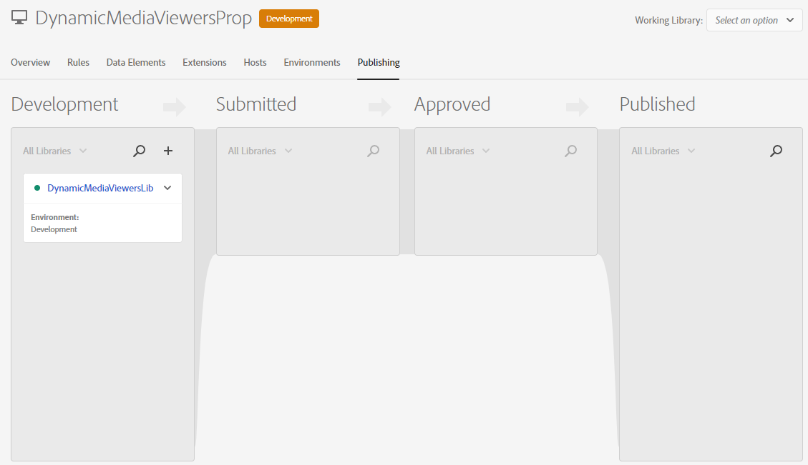
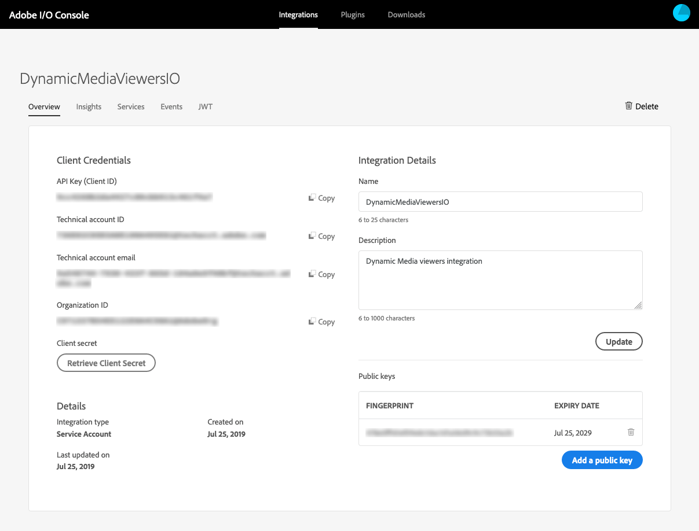

# Integração dos visualizadores do Dynamic Media com o Adobe Analytics e o Experience Platform Launch {#integrating-dynamic-media-viewers-with-adobe-analytics-and-adobe-launch}

## O que é a integração dos visualizadores do Dynamic Media com o Adobe Analytics e o Experience Platform Launch? {#what-is-dynamic-media-viewers-integration-with-adobe-analytics-and-adobe-launch}

<!-- Leave this hidden path here; it points to the topic source from Sasha https://wiki.corp.adobe.com/pages/viewpage.action?spaceKey=~oufimtse&title=Dynamic+Media+Viewers+integration+with+Adobe+Launch 

name used to be Experience Platform Launch. Changed to Experience Platform Data Collection-->

A nova extensão *Dynamic Media Viewers* para Platform launch e Dynamic Media Viewers 5.13 permite que os clientes do Adobe Analytics e do Platform launch usem eventos e dados específicos para os Visualizadores em suas configurações do Platform launch.

Essa integração significa que você pode rastrear o uso de visualizadores do Dynamic Media no seu site com o Adobe Analytics. Ao mesmo tempo, você pode usar os eventos e dados expostos pelos visualizadores com qualquer outra extensão de Platform launch que venha do Adobe ou de terceiros.

Para saber mais sobre extensões, consulte [extensões do Adobe](https://experienceleague.adobe.com/docs/launch/using/extensions-ref/overview.html#adobe-extension) no Guia do Usuário do Experience Platform Launch.

**Este tópico foi criado para o seguinte:** administradores de site, desenvolvedores no programa Adobe Experience Manager e pessoas em Operações.

### Limitações da integração {#limitations-of-the-integration}

* A integração do Experience Platform Launch para visualizadores Dynamic Media não funciona no nó Experience Manager author . Não é possível ver nenhum rastreamento de uma página do WCM até que ela seja publicada.
* A integração do Experience Platform Launch para visualizadores do Dynamic Media não é compatível com o modo de operação &quot;pop-up&quot;, onde o URL do visualizador é obtido usando o botão &quot;URL&quot; na página Detalhes do ativo.
* A integração do Experience Platform Launch não pode ser usada simultaneamente com a integração do Analytics de visualizadores herdados (por meio do parâmetro `config2=` ).
* O suporte para rastreamento de vídeo é limitado somente ao rastreamento de reprodução principal, conforme descrito em [Visão geral do rastreamento](https://experienceleague.adobe.com/docs/media-analytics/using/sdk-implement/track-av-playback/track-core-overview.html#player-events). Especificamente, o rastreamento de QoS, Anúncios, Capítulo/Segmentos ou Erros não é suportado.
* A configuração de Duração de armazenamento para Elementos de dados não é compatível com Elementos de dados que usam a extensão *Dynamic Media Viewers*. A Duração do Armazenamento deve ser definida como **[!UICONTROL None]**.

### Casos de uso da integração {#use-cases-for-the-integration}

O principal caso de uso da integração com o Experience Platform Launch são os clientes que usam os Ativos do Experience Manager e os Sites do Experience Manager. Nesses cenários, você pode configurar uma integração padrão entre o nó Experience Manager author e o Experience Platform Launch e, em seguida, associar a instância do Sites à propriedade Experience Platform Launch. Depois disso, qualquer componente WCM do Dynamic Media adicionado a uma página do Sites rastreará os dados e eventos dos visualizadores.

Consulte [Rastreamento de visualizadores Dynamic Media no Experience Manager Sites](#tracking-dynamic-media-viewers-in-aem-sites).

Um caso de uso secundário suportado pela integração são os clientes que usam somente o Experience Manager Assets ou o Dynamic Media Classic. Nesses casos, você obtém o código de inserção do visualizador e o adiciona à página do site. Em seguida, obtenha o URL de produção da biblioteca de Experience Platform Launch do Experience Platform Launch e adicione-o manualmente ao código da página da Web.

Consulte [Rastreamento de visualizadores Dynamic Media usando o código incorporado](#tracking-dynamic-media-viewers-using-embed-code).

## Como o rastreamento de dados e eventos funciona na integração {#how-data-and-event-tracking-works-in-the-integration}

A integração aproveita dois tipos separados e independentes de rastreamento de visualizadores do Dynamic Media: *Adobe Analytics* e *Adobe Analytics para áudio e vídeo*.

### Sobre o rastreamento usando o Adobe Analytics  {#about-tracking-using-adobe-analytics}

O Adobe Analytics permite que você rastreie ações executadas pelo usuário final quando elas interagem com os Visualizadores do Dynamic Media em seu site. O Adobe Analytics também permite rastrear dados específicos do visualizador. Por exemplo, você pode rastrear e registrar eventos de carregamento de exibição junto com o nome do ativo, quaisquer ações de zoom que ocorreram e as ações de reprodução de vídeo.

No Experience Platform Launch, os conceitos de *Elementos de dados* e *Regras* trabalham juntos para ativar o rastreamento do Adobe Analytics.

#### Sobre elementos de dados no Experience Platform Launch {#about-data-elements-in-adobe-launch}

Um Elemento de dados no Experience Platform Launch é uma propriedade nomeada cujo valor é definido estaticamente ou calculado dinamicamente com base no estado de uma página da Web ou nos dados do Dynamic Media Viewers.

As opções disponíveis para uma definição de Elemento de dados dependem da lista de Extensões instaladas na Propriedade do Experience Platform Launch. A extensão &quot;Core&quot; é pré-instalada e está disponível para uso imediato em qualquer configuração. Essa extensão &quot;Core&quot; permite definir um Elemento de dados, que valor provém de cookie, código JavaScript™, sequência de consulta e muitas outras fontes.

Para o rastreamento do Adobe Analytics, várias outras extensões devem ser instaladas, conforme descrito em [Instalação e configuração de extensões](#installing-and-setup-of-extensions). A extensão Visualizadores do Dynamic Media adiciona uma capacidade de definir um Elemento de dados que é um argumento do evento Visualizador dinâmico. Por exemplo, é possível fazer referência ao tipo de visualizador ou ao nome do ativo relatado pelo visualizador quando carregado, o nível de zoom relatado quando o usuário final faz zoom e muito mais.

A extensão Visualizador do Dynamic Media mantém os valores de seus Elementos de dados atualizados automaticamente.

Depois de defini-lo, um Elemento de dados pode ser usado em outros locais da interface do usuário do Experience Platform Launch, usando o widget seletor de elementos de dados. Especificamente, os Elementos de dados definidos para as finalidades do rastreamento de Visualizadores do Dynamic Media são referenciados pela Ação Definir variáveis da extensão Adobe Analytics na Regra (veja abaixo).

Consulte [Data elements](https://experienceleague.adobe.com/docs/launch/using/ui/data-elements.html#ui) no Guia do Usuário do Experience Platform Launch.

#### Sobre regras no Experience Platform Launch {#about-rules-in-adobe-launch}

Uma Regra no Experience Platform Launch é uma configuração agnóstica que define três áreas que compõem uma regra: *Eventos*, *Condições* e *Ações*:

* *Os eventos*  (if) informam ao Experience Platform Launch quando acionar uma regra.
* *As condições*  (if) informam o Experience Platform Launch sobre quais outras restrições permitir ou não permitir ao acionar uma Regra.
* *As ações*  (then) informam o Experience Platform Launch sobre o que fazer quando uma Regra é acionada.

As opções disponíveis na seção Eventos, Condições e Ações dependem das extensões instaladas na Propriedade do Experience Platform Launch. A extensão *Core* é pré-instalada e está disponível e pronta para uso em qualquer configuração. A extensão fornece várias opções para Eventos, como ações básicas no nível do navegador que incluem alteração de foco, pressionamentos de tecla e envios de formulário. Também inclui opções para Condições, como valor do cookie, tipo de navegador e muito mais. Para Ações, somente a opção Código personalizado está disponível.

Para o rastreamento do Adobe Analytics, várias outras extensões devem ser instaladas, conforme descrito em [Instalação e configuração de extensões](#installing-and-setup-of-extensions). Especificamente:

* A extensão Visualizadores do Dynamic Media estende a lista de Eventos suportados para eventos específicos dos visualizadores do Dynamic Media, como carregamento do visualizador, troca de ativos, zoom e reprodução de vídeo.
* A extensão Adobe Analytics estende a lista de ações compatíveis com duas ações necessárias para enviar dados para servidores de rastreamento: *Definir variáveis* e *Enviar beacon*.

Para rastrear visualizadores do Dynamic Media, é possível usar qualquer tipo de um dos seguintes itens:

* Eventos da extensão do Dynamic Media Viewers, da extensão principal ou de qualquer outra extensão.
* Condições na definição da regra. Ou você pode deixar a área de condições vazia.

Na seção Ações , é necessário que você tenha uma ação *Definir variáveis*. Essa ação informa ao Adobe Analytics como preencher variáveis de rastreamento com dados. Ao mesmo tempo, a ação *Definir variáveis* não envia nada para o servidor de rastreamento.

A ação *Definir variáveis* deve ser seguida por uma ação *Enviar beacon*. A ação *Send Beacon* envia dados ao servidor de rastreamento de análise. Ambas as ações, *Definir variáveis* e *Enviar beacon*, vêm da extensão Adobe Analytics.

Consulte [Rules](https://experienceleague.adobe.com/docs/launch/using/ui/rules.html#ui) no Guia do Usuário do Experience Platform Launch.

#### Exemplo de configuração {#sample-configuration}

A seguinte configuração de exemplo no Experience Platform Launch demonstra como rastrear um nome de ativo no carregamento do visualizador.

1. Na guia **[!UICONTROL Elementos de dados]** , defina um elemento de dados `AssetName` que faça referência ao parâmetro `asset` do evento `LOAD` da extensão Visualizadores do Dynamic Media.

   

1. Na guia **[!UICONTROL Rules]**, defina uma regra *TrackAssetOnLoad*.

   Nesta regra, o campo **[!UICONTROL Event]** usa o evento **[!UICONTROL LOAD]** da extensão Visualizadores do Dynamic Media.

   

1. A configuração Ação tem dois tipos de Ação da extensão Adobe Analytics:

   *Defina Variáveis*, que mapeiam uma variável de análise de sua escolha para o valor do Elemento de  `AssetName` dados.

   *Envie o Beacon*, que envia informações de rastreamento para o Adobe Analytics.

   

1. A configuração de regra resultante aparece como a seguinte:

   

### Sobre o Adobe Analytics para áudio e vídeo {#about-adobe-analytics-for-audio-and-video}

Quando uma conta do Experience Cloud é inscrita para usar o Adobe Analytics para áudio e vídeo, é suficiente ativar o rastreamento de vídeo nas configurações de extensão *Dynamic Media Viewers*. As métricas de vídeo se tornam disponíveis no Adobe Analytics. O rastreamento de vídeo depende da presença da extensão Adobe Medium Analytics for Audio and Video.

Consulte [Instalação e configuração de extensões](#installing-and-setup-of-extensions).

Atualmente, o suporte para rastreamento de vídeo está limitado somente ao rastreamento de &quot;reprodução principal&quot;, conforme descrito em [Visão geral do rastreamento](https://experienceleague.adobe.com/docs/media-analytics/using/sdk-implement/track-av-playback/track-core-overview.html#player-events). Especificamente, o rastreamento de QoS, Anúncios, Capítulo/Segmentos ou Erros não é suportado.

## Uso da extensão Visualizadores do Dynamic Media {#using-the-dynamic-media-viewers-extension}

Conforme mencionado em [Use cases for the integration](#use-cases-for-the-integration), é possível rastrear os visualizadores do Dynamic Media com a nova integração do Experience Platform Launch no Experience Manager Sites e usando o código incorporado.

### Rastreamento de visualizadores do Dynamic Media no Experience Manager Sites {#tracking-dynamic-media-viewers-in-aem-sites}

Para rastrear visualizadores do Dynamic Media no Experience Manager Sites, todas as etapas listadas na seção [Configuração de todas as partes de integração](#configuring-all-the-integration-pieces) devem ser executadas. Especificamente, você deve criar a configuração IMS e a configuração da Experience Platform Launch Cloud.

Após a configuração correta, qualquer visualizador do Dynamic Media adicionado a uma página Sites, usando um componente WCM suportado pelo Dynamic Media, rastreia automaticamente os dados para o Adobe Analytics ou Adobe Analytics para Vídeo, ou ambos.

Consulte [Adicionar ativos Dynamic Media às páginas usando Adobe Sites](/help/assets/dynamic-media/adding-dynamic-media-assets-to-pages.md).

### Rastreamento de visualizadores do Dynamic Media usando o código incorporado {#tracking-dynamic-media-viewers-using-embed-code}

Os clientes que não usam Sites Experience Manager ou incorporam visualizadores Dynamic Media em páginas da Web fora do Experience Manager Sites, ou ambos, ainda podem usar a integração do Experience Platform Launch.

Complete as etapas de configuração nas seções [Configuração do Adobe Analytics](#configuring-adobe-analytics-for-the-integration) e [Configuração do Experience Platform Launch](#configuring-adobe-launch-for-the-integration) . No entanto, as etapas de configuração relacionadas ao Experience Manager não são necessárias.

Após a configuração adequada, você pode adicionar suporte ao Experience Platform Launch a uma página da Web com um visualizador do Dynamic Media.

Consulte [Adicionar o código incorporado do Experience Platform Launch](https://experienceleague.adobe.com/docs/launch-learn/implementing-in-websites-with-launch/configure-launch/launch-add-embed.html#configure-launch) para saber mais sobre como usar o código incorporado da biblioteca de Experience Platform Launch.

Para saber mais sobre como usar o recurso de código incorporado do Experience Manager Dynamic Media, consulte [Incorporando o visualizador de vídeo ou imagem em uma página da Web](/help/assets/dynamic-media/embed-code.md).

**Para rastrear visualizadores do Dynamic Media usando o código incorporado:**

1. Ter uma página da Web pronta para incorporar um visualizador do Dynamic Media.
1. Obtenha o código incorporado da biblioteca do Experience Platform Launch fazendo primeiro o logon no Experience Platform Launch (consulte [Configuração do Experience Platform Launch](#configuring-adobe-launch-for-the-integration)).
1. Clique em **[!UICONTROL Propriedade]**, em seguida, clique na guia **[!UICONTROL Ambientes]**.
1. Escolha o nível de Ambiente que seja relevante para o ambiente da página da Web. Em seguida, na coluna **[!UICONTROL Install]**, clique no ícone da caixa.
1. **[!UICONTROL Na caixa de diálogo]** Instruções de instalação da Web , copie o código incorporado completo da biblioteca de Experience Platform Launch, juntamente com as  `<script/>` tags subjacentes.

## Guia de referência para a extensão Visualizadores do Dynamic Media {#reference-guide-for-the-dynamic-media-viewers-extension}

### Sobre a configuração dos visualizadores do Dynamic Media {#about-the-dynamic-media-viewers-configuration}

A extensão Visualizador do Dynamic Media integra-se automaticamente à biblioteca de Experience Platform Launch se as seguintes condições forem verdadeiras:

* O objeto global da biblioteca de Experience Platform Launch ( `_satellite`) está presente na página.
* A função de extensão `_dmviewers_v001()` do Dynamic Media Viewers é definida em `_satellite`.

* `config2=` O parâmetro do visualizador não é especificado, o que significa que o visualizador não usa a integração herdada do Analytics.

Além disso, há uma opção para desativar explicitamente a integração do Experience Platform Launch no visualizador, especificando o parâmetro `launch=0` na configuração do visualizador. O valor padrão desse parâmetro é `1`.

### Configurar a extensão Visualizadores do Dynamic Media {#configuring-the-dynamic-media-viewers-extension}

A única opção de configuração para a extensão Visualizadores do Dynamic Media é **[!UICONTROL Ativar o Adobe Medium Analytics para áudio e vídeo]**.

Ao marcar (habilitar) essa opção e a extensão Adobe Medium Analytics for Audio and Video estiver instalada e configurada, as métricas de reprodução de vídeo serão enviadas à solução Adobe Analytics para áudio e vídeo. Desativar esta opção desativa o rastreamento de vídeo.

Se você ativar essa opção *sem* ter a extensão Adobe Medium Analytics for Audio and Video instalada, a opção não terá efeito.

### Sobre elementos de dados na extensão Visualizadores do Dynamic Media {#about-data-elements-in-the-dynamic-media-viewers-extension}

O único tipo de Elemento de dados fornecido pela extensão Visualizadores do Dynamic Media é o **[!UICONTROL Evento do visualizador]** na lista suspensa **[!UICONTROL Tipo de elemento de dados]**.

Quando selecionado, o editor de Elemento de dados renderiza um formulário com dois campos:

* **[!UICONTROL Tipo de dados do evento de visualizadores do DM]** - uma lista suspensa que identifica todos os eventos do visualizador compatíveis com a extensão do Visualizador do Dynamic Media que têm argumentos, além de um item **[!UICONTROL COMMON]** especial. Um item **[!UICONTROL COMUM]** representa uma lista de parâmetros de evento comuns a todos os tipos de eventos enviados pelos visualizadores.
* **[!UICONTROL Parâmetro de rastreamento]**  - um argumento do evento do visualizador do Dynamic Media selecionado.

Consulte o [Guia de referência de visualizadores do Dynamic Media](https://experienceleague.adobe.com/docs/dynamic-media-developer-resources/library/viewers-aem-assets-dmc/c-html5-s7-aem-asset-viewers.html) para obter a lista de eventos suportados por cada tipo de visualizador; vá para a seção visualizador específico e clique em Suporte para a subseção de rastreamento do Adobe Analytics . No momento, o guia de referência Visualizadores do Dynamic Media não documenta argumentos de evento.

Agora vamos considerar o ciclo de vida dos Visualizadores do Dynamic Media *Elemento de dados*. O valor desse Elemento de dados é preenchido depois que o evento do visualizador do Dynamic Media correspondente ocorre na página. Por exemplo, suponha que o Elemento de dados aponte para o evento **[!UICONTROL LOAD]** e seu argumento &quot;ativo&quot;. O valor desse Elemento de dados recebe dados válidos depois que o visualizador executa o evento LOAD pela primeira vez. Se o Elemento de dados apontar para o evento **[!UICONTROL ZOOM]** e seu argumento &quot;scale&quot;, o valor desse Elemento de dados permanecerá vazio até que o visualizador envie um evento **[!UICONTROL ZOOM]** pela primeira vez.

Da mesma forma, os valores dos Elementos de dados são atualizados automaticamente quando o visualizador envia um evento correspondente na página. A atualização de valor acontece mesmo se o evento específico não for definido na configuração Regra. Por exemplo, suponha que o Elemento de Dados **[!UICONTROL ZoomScale]** esteja definido para o parâmetro &quot;scale&quot; do evento ZOOM. No entanto, a única regra presente na configuração Regra é acionada pelo evento **[!UICONTROL LOAD]**. O valor de **[!UICONTROL ZoomScale]** ainda é atualizado sempre que um usuário executa o zoom dentro do visualizador.

Qualquer visualizador do Dynamic Media tem um identificador exclusivo na página da Web. O Elemento de dados rastreia o próprio valor e o visualizador o preencheu. Por exemplo, suponha que haja vários visualizadores na mesma página e um elemento de dados **[!UICONTROL AssetName]** que aponte para o evento **[!UICONTROL LOAD]** e seu argumento &quot;asset&quot;. O Elemento de dados **[!UICONTROL AssetName]** mantém uma coleção de nomes de ativos que estão associados a cada visualizador carregado na página.

O valor exato retornado pelo Elemento de dados depende do contexto. Se o Elemento de dados for solicitado em uma Regra que foi acionada por um evento do visualizador do Dynamic Media, o valor do Elemento de dados será retornado para o visualizador que iniciou a Regra. E o Elemento de dados é solicitado em uma Regra que foi acionado por um Evento de alguma outra extensão do Platform launch. Nesse momento, o valor do Elemento de dados vem do visualizador que foi o último a atualizar esse Elemento de dados.

**Considere a seguinte configuração de exemplo:**

* Uma página da Web que tem dois visualizadores de zoom do Dynamic Media: *viewer1* e *viewer2*.

* **** O elemento ZoomScaleData aponta para o evento  **** ZOOM e seu argumento &quot;scale&quot;.
* **** TrackPanRule com o seguinte:

   * Usa o evento **[!UICONTROL PAN]** do Visualizador do Dynamic Media como disparador.
   * Envia o valor do elemento de dados **[!UICONTROL ZoomScale]** para Adobe Analytics.

* **** TrackKeyRule com o seguinte:

   * Usa o evento de pressionamento de tecla da extensão Experience Platform Launch principal como disparador.
   * Envia o valor do elemento de dados **[!UICONTROL ZoomScale]** para Adobe Analytics.

Agora, suponha que o usuário final carregue a página da Web com os dois visualizadores. Em *viewer1*, aproximam o zoom para uma escala de 50%; em seguida, em *viewer2*, ampliam para 25% de escala. Em *viewer1*, eles deslocam a imagem e finalmente pressionam uma tecla no teclado.

A atividade do usuário final resulta nas duas chamadas de rastreamento a seguir feitas para o Adobe Analytics:

* A primeira chamada ocorre porque a Regra **[!UICONTROL TrackPan]** é acionada quando o usuário é ativado em *viewer1*. Essa chamada envia 50% como um valor do Elemento de Dados **[!UICONTROL ZoomScale]** porque o Elemento de Dados sabe que a Regra é acionada por *viewer1* e busca o valor de escala correspondente;
* A segunda chamada ocorre porque a Regra **[!UICONTROL TrackKey]** é acionada quando o usuário pressiona uma tecla no teclado. Essa chamada envia 25% como um valor de **[!UICONTROL ZoomScale]** Elemento de dados, pois a Regra não foi acionada pelo visualizador. Dessa forma, o Elemento de dados retorna o valor mais atualizado.

A amostra configurada acima também afeta a duração do valor do Elemento de dados. O valor do Elemento de dados gerenciado pelo Visualizador do Dynamic Media é armazenado no código da biblioteca de Experience Platform Launch, mesmo depois que o próprio visualizador é descartado na página da Web. Essa funcionalidade significa que, se houver uma Regra que é acionada por uma extensão de Visualizador que não é da Dynamic Media e faz referência a esse Elemento de dados, o Elemento de dados retornará o último valor conhecido. Mesmo se o visualizador não estiver mais presente na página da Web.

Em qualquer caso, os valores dos Elementos de dados orientados pelos Visualizadores do Dynamic Media não são armazenados no armazenamento local ou no servidor; em vez disso, eles são mantidos somente na biblioteca Experience Platform Launch do lado do cliente. Os valores desse Elemento de dados desaparecem quando a página da Web é recarregada.

Geralmente, o Editor de Elemento de Dados suporta [seleção de duração do armazenamento](https://experienceleague.adobe.com/docs/launch/using/ui/data-elements.html?lang=en#create-a-data-element). No entanto, os Elementos de dados que usam a extensão Visualizadores do Dynamic Media oferecem suporte apenas à opção de duração de armazenamento de **[!UICONTROL None]**. A configuração de qualquer outro valor é possível na interface do usuário, mas o comportamento do Elemento de dados não é definido nesse caso. A extensão gerencia o valor do Elemento de dados sozinho: o Elemento de dados que mantém o valor do argumento de evento do visualizador durante todo o ciclo de vida do visualizador.

### Sobre regras na extensão Visualizadores do Dynamic Media {#about-rules-in-the-dynamic-media-viewers-extension}

No editor de Regras, a extensão adiciona novas opções de configuração para o editor de Eventos. Além disso, o editor fornece uma opção para fazer referência manual aos parâmetros de evento no editor de Ação como uma opção de mão curta, em vez de usar elementos de dados pré-configurados.

#### Sobre o Editor de eventos {#about-the-events-editor}

No Editor de eventos, a extensão Visualizadores do Dynamic Media adiciona um **[!UICONTROL Tipo de evento]** chamado **[!UICONTROL Evento do visualizador]**.

Quando selecionado, o Editor de eventos renderiza o menu suspenso **[!UICONTROL Dynamic Media Viewer events]**, listando todos os eventos disponíveis compatíveis com os visualizadores do Dynamic Media.

#### Sobre o editor de Ações {#about-the-actions-editor}

A extensão Visualizadores do Dynamic Media permite usar parâmetros de evento de visualizadores do Dynamic Media para mapear variáveis de análise no editor Definir variáveis da extensão Adobe Analytics.

O método mais simples de fazer isso é concluir o seguinte processo de duas etapas:

* Primeiro, defina um ou mais Elementos de dados, onde cada Elemento de dados representa um parâmetro de um evento do Visualizador do Dynamic Media.
* Finalmente, no editor Definir variáveis da extensão do Adobe Analytics, clique no ícone do seletor de elementos de dados (três discos empilhados) para abrir a caixa de diálogo Selecionar elemento de dados e, em seguida, selecione um elemento de dados a partir dele.

No entanto, é possível usar uma abordagem alternativa e ignorar a criação do Elemento de dados. Você pode fazer referência diretamente a um argumento de um evento do Visualizador do Dynamic Media. Insira o nome totalmente qualificado do argumento de evento no campo de entrada **[!UICONTROL value]** da atribuição de variável do Analytics. Certifique-se de rodar por sinais de porcentagem (%). Por exemplo,

`%event.detail.dm.LOAD.asset%`

Há uma diferença importante entre o uso de Elementos de dados e a referência do argumento de evento direto. Para o Elemento de dados, não importa qual evento aciona a ação Definir variáveis . O evento que aciona a Regra pode não estar relacionado ao Visualizador dinâmico (como clicar na página da Web da extensão principal). Mas, ao usar uma referência de argumento direto, é importante garantir que o evento que aciona a regra corresponda ao argumento de evento que ela faz referência.

Por exemplo, a referência `%event.detail.dm.LOAD.asset%` retornará o nome correto do ativo se Regra for acionado pelo evento **[!UICONTROL LOAD]** da extensão do Visualizador do Dynamic Media. No entanto, retorna um valor vazio para qualquer outro evento.

A tabela a seguir lista os eventos do Visualizador do Dynamic Media e seus argumentos compatíveis:

<table>
 <tbody>
  <tr>
   <td>Nome do evento do visualizador</td>
   <td>Referência do argumento</td>
  </tr>
  <tr>
   <td><code>COMMON</code></td>
   <td><code>%event.detail.dm.objID%</code></td>
  </tr>
  <tr>
   <td> </td>
   <td><code>%event.detail.dm.compClass%</code></td>
  </tr>
  <tr>
   <td> </td>
   <td><code>%event.detail.dm.instName%</code></td>
  </tr>
  <tr>
   <td> </td>
   <td><code>%event.detail.dm.timeStamp%</code></td>
  </tr>
  <tr>
   <td><code>BANNER</code> </td>
   <td><code>%event.detail.dm.BANNER.asset%</code></td>
  </tr>
  <tr>
   <td> </td>
   <td><code>%event.detail.dm.BANNER.frame%</code></td>
  </tr>
  <tr>
   <td> </td>
   <td><code>%event.detail.dm.BANNER.label%</code></td>
  </tr>
  <tr>
   <td><code>HREF</code></td>
   <td><code>%event.detail.dm.HREF.rollover%</code></td>
  </tr>
  <tr>
   <td><code>ITEM</code></td>
   <td><code>%event.detail.dm.ITEM.rollover%</code></td>
  </tr>
  <tr>
   <td><code>LOAD</code></td>
   <td><code>%event.detail.dm.LOAD.applicationname%</code></td>
  </tr>
  <tr>
   <td><strong> </strong></td>
   <td><code>%event.detail.dm.LOAD.asset%</code></td>
  </tr>
  <tr>
   <td><strong> </strong></td>
   <td><code>%event.detail.dm.LOAD.company%</code></td>
  </tr>
  <tr>
   <td><strong> </strong></td>
   <td><code>%event.detail.dm.LOAD.sdkversion%</code></td>
  </tr>
  <tr>
   <td><strong> </strong></td>
   <td><code>%event.detail.dm.LOAD.viewertype%</code></td>
  </tr>
  <tr>
   <td><strong> </strong></td>
   <td><code>%event.detail.dm.LOAD.viewerversion%</code></td>
  </tr>
  <tr>
   <td><code>METADATA</code></td>
   <td><code>%event.detail.dm.METADATA.length%</code></td>
  </tr>
  <tr>
   <td> </td>
   <td><code>%event.detail.dm.METADATA.type%</code></td>
  </tr>
  <tr>
   <td><code>MILESTONE</code></td>
   <td><code>%event.detail.dm.MILESTONE.milestone%</code></td>
  </tr>
  <tr>
   <td><code>PAGE</code></td>
   <td><code>%event.detail.dm.PAGE.frame%</code></td>
  </tr>
  <tr>
   <td> </td>
   <td><code>%event.detail.dm.PAGE.label%</code></td>
  </tr>
  <tr>
   <td><code>PAUSE</code></td>
   <td><code>%event.detail.dm.PAUSE.timestamp%</code></td>
  </tr>
  <tr>
   <td><code>PLAY</code></td>
   <td><code>%event.detail.dm.PLAY.timestamp%</code></td>
  </tr>
  <tr>
   <td><code>SPIN</code></td>
   <td><code>%event.detail.dm.SPIN.framenumber%</code></td>
  </tr>
  <tr>
   <td><code>STOP</code></td>
   <td><code>%event.detail.dm.STOP.timestamp%</code></td>
  </tr>
  <tr>
   <td><code>SWAP</code></td>
   <td><code>%event.detail.dm.SWAP.asset%</code></td>
  </tr>
  <tr>
   <td><code>SWATCH</code></td>
   <td><code>%event.detail.dm.SWATCH.frame%</code></td>
  </tr>
  <tr>
   <td> </td>
   <td><code>%event.detail.dm.SWATCH.label%</code></td>
  </tr>
  <tr>
   <td><code>TARG</code></td>
   <td><code>%event.detail.dm.TARG.frame%</code></td>
  </tr>
  <tr>
   <td> </td>
   <td><code>%event.detail.dm.TARG.label%</code></td>
  </tr>
  <tr>
   <td><code>ZOOM</code></td>
   <td><code>%event.detail.dm.ZOOM.scale%</code></td>
  </tr>
 </tbody>
</table>

## Configurar todas as partes da integração {#configuring-all-the-integration-pieces}

**ANTES DE COMEÇAR**

O Adobe recomenda que você analise toda a documentação antes desta seção para entender a integração completa.

Esta seção explica as etapas de configuração necessárias para integrar os visualizadores do Dynamic Media com o Adobe Analytics e o Adobe Analytics para áudio e vídeo. Embora o uso da extensão Visualizadores do Dynamic Media para outros fins no Experience Platform Launch seja possível, esses cenários não são abordados nesta documentação.

Você usará os seguintes produtos do Adobe para configurar a integração:

* Adobe Analytics - usado para configurar variáveis e relatórios de rastreamento.
* Experience Platform Launch - usado para definir uma Propriedade, uma ou mais Regras e um ou mais Elementos de dados para ativar o rastreamento do visualizador.

Além disso, se essa solução de integração for usada com o Experience Manager Sites, a seguinte configuração deve ser feita:

* Console Adobe I/O - a integração é criada para o Experience Platform Launch.
* Nó Experience Manager author - Configuração IMS e configuração da nuvem Experience Platform Launch.

Como parte da configuração, verifique se você tem acesso a uma empresa no Adobe Experience Cloud que já tenha o Adobe Analytics e o Experience Platform Launch ativado.

## Configuração do Adobe Analytics para a integração {#configuring-adobe-analytics-for-the-integration}

Após configurar o Adobe Analytics, as seguintes etapas serão configuradas para a integração:

* Um Conjunto de relatórios está no lugar e está selecionado.
* As Variáveis do Analytics estão disponíveis para receber dados de rastreamento.
* Os relatórios estão disponíveis para exibir dados coletados dentro do Adobe Analytics.

Consulte também [Guia de implementação do Analytics](https://experienceleague.adobe.com/docs/analytics/implementation/home.html).

**Para configurar o Adobe Analytics para a integração:**

1. Comece acessando o Adobe Analytics a partir do Experience Cloud [home page](https://exc-home.experiencecloud.adobe.com/exc-home/home.html#/). Na barra de menus, clique no ícone Soluções (uma tabela de três por três pontos) próximo ao canto superior direito da página, em seguida, clique em **[!UICONTROL Analytics]**.

   

   Em seguida, selecione um conjunto de relatórios.

### Seleção de um conjunto de relatórios {#selecting-a-report-suite}

1. Próximo ao canto superior direito da página do Adobe Analytics, à direita do campo **[!UICONTROL Pesquisar relatórios]**, selecione o conjunto de relatórios correto na lista suspensa. Se houver vários conjuntos de relatórios disponíveis e você não tiver certeza de qual usar, entre em contato com o administrador do Adobe Analytics, que pode ajudá-lo a selecionar qual usar.

   No exemplo abaixo, um usuário criou um conjunto de relatórios chamado *DynamicMediaViewersExtensionDoc* e o selecionou na lista suspensa. O nome do conjunto de relatórios é apenas um exemplo. O nome do conjunto de relatórios que você selecionar dependerá de você.

   Se nenhum conjunto de relatórios estiver disponível, você ou o administrador da Adobe Analytics devem criar um antes de continuar com a configuração.

   Consulte [Relatórios e conjuntos de relatórios](https://experienceleague.adobe.com/docs/analytics/admin/manage-report-suites/report-suites-admin.html#manage-report-suites) e [Criar um conjunto de relatórios](https://experienceleague.adobe.com/docs/analytics/admin/manage-report-suites/new-report-suite/t-create-a-report-suite.html?lang=en#manage-report-suites).

   No Adobe Analytics, os conjuntos de relatórios são gerenciados em **[!UICONTROL Admin > Conjuntos de relatórios]**.

   

   Agora, configure as variáveis do Adobe Analytics.

### Configuração de variáveis do Adobe Analytics {#setting-up-adobe-analytics-variables}

1. Atribua uma ou mais variáveis do Adobe Analytics que você deseja usar para rastrear o comportamento dos Visualizadores do Dynamic Media na página da Web.

   É possível usar qualquer tipo de variável compatível com o Adobe Analytics. A decisão sobre o tipo de variável (como Tráfego personalizado [props], Conversão [eVar]) é orientada por necessidades específicas da implementação do Analytics.

   Consulte [Visão geral de props e eVars](https://experienceleague.adobe.com/docs/analytics/implementation/vars/page-vars/evar.html#vars).

   Para os fins desta documentação, somente uma variável de Tráfego personalizado (props) será usada porque se tornam disponíveis em um Relatório do Analytics alguns minutos depois que uma ação ocorre em uma página da Web.

   Para ativar uma nova variável de Tráfego personalizado, no Adobe Analytics, na barra de ferramentas, clique em **[!UICONTROL Admin > Conjuntos de relatórios]**.

1. Na página **[!UICONTROL Gerenciador do conjunto de relatórios]**, selecione o relatório correto e, na barra de ferramentas, clique em **[!UICONTROL Editar configurações]** > **[!UICONTROL Tráfego]** > **[!UICONTROL Variáveis de tráfego]**.
1. Escolha uma variável não usada, atribua a ela um nome descritivo ( **[!UICONTROL Ativo do visualizador (prop 30)]**) e altere a caixa de combinação para &quot;Ativado&quot; na coluna Ativado .

   A captura de tela a seguir é um exemplo de uma variável de Tráfego personalizado ( **[!UICONTROL prop30]**) para rastrear um nome de ativo usado pelo visualizador:

   

1. Na parte inferior da lista de variáveis, clique em **[!UICONTROL Save]**.

### Configuração de um relatório {#setting-up-a-report}

1. Geralmente, a configuração de um Relatório no Adobe Analytics é orientada por necessidades específicas do projeto. Dessa forma, a configuração detalhada do relatório está além do escopo dessa integração.

   No entanto, é suficiente saber que os relatórios de Tráfego personalizado ficam automaticamente disponíveis no Adobe Analytics depois que você configura variáveis de Tráfego personalizado em **[Configuração de variáveis do Adobe Analytics](#setting-up-adobe-analytics-variables)**.

   Por exemplo, o relatório da variável **[!UICONTROL Ativo do visualizador (prop 30)]** está disponível no menu Relatórios, em **[!UICONTROL Tráfego personalizado > Tráfego personalizado 21-30 > Ativo do visualizador (prop 30)]**.

   Visitar este relatório logo após a criação do **[!UICONTROL Ativo do visualizador (prop 30)]**, não mostra dados; o que é esperado neste momento da integração.

   

## Configuração do Experience Platform Launch para a integração {#configuring-adobe-launch-for-the-integration}

Após configurar o Experience Platform Launch, o seguinte será configurado para a integração:

* A criação de uma nova propriedade para manter todas as configurações juntas.
* A instalação e configuração das extensões. O código do lado do cliente de todas as extensões instaladas na Propriedade é compilado em conjunto em uma biblioteca. Essa biblioteca é usada posteriormente pela página da Web.
* Configuração de elementos de dados e regras. Essa configuração define quais dados adquirir dos visualizadores do Dynamic Media, quando acionar a lógica de rastreamento e onde enviar os dados do visualizador no Adobe Analytics.
* Publicação da biblioteca.

**Para configurar o Experience Platform Launch para a integração:**

1. Comece acessando o Experience Platform Launch a partir do Experience Cloud [home page](https://exc-home.experiencecloud.adobe.com/exc-home/home.html#/). Na barra de menu, clique no ícone Soluções (três por três tabelas de pontos) próximo ao canto superior direito da página, em seguida, clique em **[!UICONTROL Iniciar]**.

   Você também pode [abrir Experience Platform Launch diretamente](https://launch.adobe.com/).

   

### Criação de uma propriedade no Experience Platform Launch {#creating-a-property-in-adobe-launch}

Uma propriedade no Experience Platform Launch é uma configuração nomeada que mantém todas as configurações juntas. Uma biblioteca das configurações é gerada e publicada em diferentes níveis de ambiente (desenvolvimento, armazenamento temporário e produção).

Consulte também [Criar uma propriedade do Launch](https://experienceleague.adobe.com/docs/launch-learn/implementing-in-mobile-android-apps-with-launch/configure-launch/launch-create-a-property.html#configure-launch).

1. No Experience Platform Launch, clique em **[!UICONTROL Nova propriedade]**.
1. Na caixa de diálogo **[!UICONTROL Criar propriedade]**, no campo **[!UICONTROL Nome]**, digite um nome descritivo, como o título do site. Por exemplo, `DynamicMediaViewersProp.`
1. No campo **[!UICONTROL Domains]**, digite o domínio do site.
1. Na lista suspensa **[!UICONTROL Opções avançadas]**, ative **[!UICONTROL Configurar para desenvolvimento de extensão (não pode ser modificado posteriormente)]** caso a extensão que você deseja usar (neste caso, *Visualizadores do Dynamic Media*) ainda não tenha sido lançada.

   

1. Clique em **[!UICONTROL Salvar]**.

   Clique na propriedade recém-criada e prossiga para *Instalação e configuração de extensões*.

### Instalação e configuração de extensões {#installing-and-setup-of-extensions}

Todas as extensões disponíveis no Experience Platform Launch são listadas em **[!UICONTROL Extensões > Catálogo]**.

Para instalar uma extensão, clique em **[!UICONTROL Instalar]**. Se necessário, execute uma configuração de extensão única e clique em **[!UICONTROL Save]**.

Quando necessário, as seguintes extensões devem ser instaladas e configuradas:

* (Obrigatório) Extensão *Experience Cloud ID Service*

Nenhuma configuração adicional é necessária, aceite para qualquer valor proposto. Quando terminar, clique em **[!UICONTROL Salvar]**.

Consulte [Extensão do Experience Cloud ID Service](https://experienceleague.adobe.com/docs/launch/using/extensions-ref/adobe-extension/id-service-extension/overview.html#extensions-ref).

* (Obrigatório) Extensão *Adobe Analytics*

Para configurar essa extensão, você precisa da ID do conjunto de relatórios encontrada no Adobe Analytics, em **[!UICONTROL Admin > Conjunto de relatórios]**, no cabeçalho da coluna **[!UICONTROL ID do conjunto de relatórios]**.

(Para fins de demonstração, a ID do Conjunto de relatórios do **[!UICONTROL DynamicMediaViewersExtensionDoc]** Conjunto de relatórios é usada nas seguintes capturas de tela. Esta ID foi criada e usada em [Selecionar um conjunto de relatórios](#selecting-a-report-suite) anteriormente.)

Na página Instalar extensão, digite a ID do conjunto de relatórios no campo **[!UICONTROL Conjuntos de relatórios]**, no campo **[!UICONTROL Conjuntos de relatórios de preparo]** e no campo **[!UICONTROL Conjuntos de relatórios de produção]**.

*Configure o seguinte item somente se você pretende usar o rastreamento de vídeo:*

Na página **[!UICONTROL Instalar extensão]**, expanda **[!UICONTROL Geral]** e especifique o Servidor de rastreamento. O Servidor de rastreamento segue o modelo `<trackingNamespace>.sc.omtrdc.net`, onde `<trackingNamespace>` são as informações obtidas no email de provisionamento.

Clique em **[!UICONTROL Salvar]**.

Consulte [Extensão do Adobe Analytics](https://experienceleague.adobe.com/docs/launch/using/extensions-ref/adobe-extension/analytics-extension/overview.html#extensions-ref).

* (Opcional. Obrigatório somente se o rastreamento de vídeo for necessário) *Adobe Medium Analytics for Audio and Video* extensão

Preencha o campo do servidor de rastreamento. O servidor de rastreamento da extensão *Adobe Medium Analytics for Audio and Video* é diferente do servidor de rastreamento usado para o Adobe Analytics. Ele segue o modelo `<trackingNamespace>.hb.omtrdc.net`, onde `<trackingNamespace>` são as informações do email de provisionamento.

Todos os outros campos são opcionais.

Consulte [Extensão Adobe Medium Analytics for Audio and Video](https://experienceleague.adobe.com/docs/launch/using/extensions-ref/adobe-extension/media-analytics-extension/overview.html#extensions-ref).

* (Obrigatório) Extensão *Dynamic Media Viewers*

Selecione **[!UICONTROL ativar o Adobe Analytics para Vídeo]** para habilitar (ativar) o rastreamento do Video Heartbeat.

A partir dessa gravação, a extensão *Dynamic Media Viewers* só estará disponível se a propriedade Experience Platform Launch for criada para desenvolvimento.

Consulte [Criação de uma propriedade no Experience Platform Launch](#creating-a-property-in-adobe-launch).

Depois que as extensões forem instaladas e configuradas, no mínimo, as cinco extensões a seguir (quatro se você não estiver rastreando vídeo) serão listadas na área Extensões > Instalado.

### Configuração de elementos e regras de dados {#setting-up-data-elements-and-rules}

No Experience Platform Launch, crie os Elementos de dados e as Regras necessários para rastrear os visualizadores do Dynamic Media.

Consulte [Como os dados e o rastreamento de eventos funcionam na integração](#how-data-and-event-tracking-works-in-the-integration) para obter uma visão geral do rastreamento com o Experience Platform Launch.

Consulte [Exemplo de configuração](#sample-configuration) para obter uma configuração de amostra no Experience Platform Launch que demonstra como rastrear um nome de ativo no carregamento do visualizador.

Consulte [Configurar a extensão do Dynamic Media Viewers](#configuring-the-dynamic-media-viewers-extension) para obter informações detalhadas sobre os recursos da extensão.

### Publicação de uma biblioteca {#publishing-a-library}

Para alterar a configuração do Experience Platform Launch (incluindo Propriedade, Extensões, Regras e Elementos de Dados configurados), você deve *publicar* essas alterações. A publicação no Experience Platform Launch é executada a partir da guia Publicação na configuração Propriedade.

O Platform launch pode ter vários ambientes de desenvolvimento, um ambiente de preparo e um ambiente de produção. Por padrão, a Configuração da nuvem do Platform launch no Experience Manager aponta o nó Experience Manager author para o ambiente Stage do Platform launch. O nó Experience Manager Publish aponta para o ambiente de produção do Platform launch. Esse arranjo significa que, com as configurações padrão do Experience Manager, é necessário publicar a biblioteca do Platform launch no ambiente de preparo. Isso permite usá-lo no Experience Manager author. Em seguida, você pode publicá-lo no ambiente de Produção para que ele possa ser usado na publicação do Experience Manager.

Consulte [Ambientes](https://experienceleague.adobe.com/docs/launch/using/publish/environments/environments.html#environment-types) para obter mais informações sobre ambientes Experience Platform Launch.

A publicação de uma biblioteca envolve as duas etapas a seguir:

* Adicionar e criar uma nova biblioteca incluindo todas as alterações necessárias (novas e atualizações) na biblioteca.
* Migração da biblioteca para níveis de ambiente diferentes (de desenvolvimento para armazenamento temporário e produção).

#### Adição e criação de uma nova biblioteca {#adding-and-building-a-new-library}

1. Na primeira vez que você abre a guia Publicação no Experience Platform Launch, a lista da biblioteca fica vazia.

   Na coluna da esquerda, clique em **[!UICONTROL Adicionar nova biblioteca]**.

   

1. Na página Criar nova biblioteca , no campo **[!UICONTROL Nome]**, digite o nome descritivo da nova biblioteca. Por exemplo,

   *DynamicMediaViewersLib*

   Na lista suspensa Ambiente , escolha o nível Ambiente . Inicialmente, somente o nível de Desenvolvimento está disponível para seleção. Próximo ao lado inferior esquerdo da página, clique em **[!UICONTROL Adicionar todos os recursos alterados]**.

   

1. Próximo ao canto superior direito da página, clique em **[!UICONTROL Salvar e criar para desenvolvimento]**.

   Em alguns minutos, a biblioteca é criada e pronta para ser usada.

   

   >[!NOTE]
   >
   >Na próxima vez que você alterar a configuração do Experience Platform Launch, vá para a guia **[!UICONTROL Publicação]** na configuração **[!UICONTROL Propriedade]** e clique na biblioteca criada anteriormente.
   >
   >
   >Na tela de publicação da biblioteca, clique em **[!UICONTROL Adicionar todos os recursos alterados]** e, em seguida, clique em **[!UICONTROL Salvar e criar para desenvolvimento]**.

#### Migração de uma biblioteca para níveis de ambiente {#moving-a-library-up-through-environment-levels}

1. Após a adição de uma nova biblioteca, ela é encontrada no ambiente de desenvolvimento. Para movê-lo para o nível de ambiente de preparo (que corresponde à coluna Enviado ), no menu suspenso da biblioteca, clique em **[!UICONTROL Enviar para aprovação]**.

   

1. Na caixa de diálogo de confirmação, clique em **[!UICONTROL Enviar]**.

   Depois que a biblioteca for movida para a coluna Enviado, no menu suspenso da biblioteca, clique em **[!UICONTROL Criar para preparo]**.

   

1. Para mover a biblioteca do ambiente de preparo para o ambiente de produção (que é a coluna Publicado ), siga um processo semelhante.

   Primeiro, no menu suspenso, clique em **[!UICONTROL Aprovar para publicação]**.

   

1. No menu suspenso, clique em **[!UICONTROL Criar e publicar na produção]**.

   

   Consulte [Publicação](https://experienceleague.adobe.com/docs/launch/using/publish/overview.html#publish) para obter mais informações sobre o processo de publicação no Experience Platform Launch.

## Configuração do Adobe Experience Manager para a integração {#configuring-adobe-experience-manager-for-the-integration}

<!-- Prerequisites list below should be verified by Sasha -->

Pré-requisitos:

* O Experience Manager executa as instâncias Autor e Publicação.
* O nó Experience Manager author é configurado no Dynamic Media. <!-- Scene7 run mode (dynamicmedia_s7) -->
* Os componentes WCM do Dynamic Media são ativados no Experience Manager Sites.

A configuração de Experience Manager consiste nas duas etapas principais a seguir:

* Configuração do Experience Manager IMS.
* Configuração da Experience Platform Launch Cloud.

### Configuração de Experience Manager IMS {#configuring-aem-ims}

1. No Experience Manager author, clique no ícone Tools (martelo) e, em seguida, clique em **[!UICONTROL Security > Adobe IMS Configurations]**.

   

1. Na página Configuração IMC do Adobe, próximo ao canto superior esquerdo, clique em **[!UICONTROL Criar]**.
1. Na página **[!UICONTROL Adobe IMS Technical Account Configuration]**, na lista suspensa **[!UICONTROL Cloud Solution]**, clique em **[!UICONTROL Experience Platform Data Collection]**.
1. Habilite **[!UICONTROL Criar novo certificado]**, em seguida, no campo de texto, insira qualquer valor significativo para seu certificado. Por exemplo, *AdobeLaunchIMSCert*. Clique em **[!UICONTROL Criar certificado]**.

   A seguinte mensagem de Informações é exibida:

   *Para recuperar um token de acesso válido, a chave pública do novo certificado deve ser adicionada à conta técnica no Adobe I/O!*

   Para fechar a caixa de diálogo Informações, clique em **[!UICONTROL OK]**.

   

1. Clique em **[!UICONTROL Baixar chave pública]** para baixar um arquivo de chave pública (`*.crt`) no sistema local.

   >[!NOTE]
   >
   >Nesse momento, ***deixe aberta*** a página **[!UICONTROL Configuração da conta técnica do Adobe IMS]**; ***não*** feche a página e ***não*** clique em Avançar. Você retornará a esta página mais tarde nas etapas.

   

1. Em uma nova guia do navegador, navegue até [Console Adobe I/O](https://console.adobe.io/integrations).

1. Na página **[!UICONTROL Integrações do console do Adobe I/O]** , próximo ao canto superior direito, clique em **[!UICONTROL Nova integração]**.
1. Na caixa de diálogo **[!UICONTROL Criar uma nova integração]**, verifique se o botão de opção **[!UICONTROL Acessar uma API]** está selecionado e clique em **[!UICONTROL Continuar]**.

   

1. Na segunda página **[!UICONTROL Criar uma nova integração]**, habilite (ative) o botão de opção **[!UICONTROL API do Experience Platform Launch]**. No canto inferior direito da página, clique em **[!UICONTROL Continuar]**.

   

1. Na terceira página **[!UICONTROL Criar uma nova integração]**, faça o seguinte:

   * No campo **[!UICONTROL Name]**, digite o nome descritivo. Por exemplo, *DynamicMediaViewersIO*.

   * No campo **[!UICONTROL Description]**, insira a descrição da integração.

   * Na área **[!UICONTROL Public key certificates]**, carregue o arquivo de chave pública (`*.crt`) que você baixou anteriormente nessas etapas.

   * No cabeçalho **[!UICONTROL Selecione uma função para a API do Experience Platform Launch]**, selecione **[!UICONTROL Admin]**.

   * No cabeçalho **[!UICONTROL Selecione um ou mais perfis de produto para a API do Experience Platform Launch]**, selecione o perfil de produto chamado **[!UICONTROL Launch - &lt;nome_da_empresa>]**.

   

1. Clique em **[!UICONTROL Criar integração]**.
1. Na página **[!UICONTROL Integração criada]**, clique em **[!UICONTROL Continuar para detalhes de integração]**.

   

1. Uma página de detalhes de Integrações é exibida, semelhante ao seguinte:

   >[!NOTE]
   >
   >***Deixe aberta esta página de Detalhes da integração***. Você precisará de várias informações das guias **[!UICONTROL Visão geral]** e **[!UICONTROL JWT]** em apenas um momento.

   
   _Página de detalhes da integração_

1. Retorne à página **[!UICONTROL Configuração de conta técnica do Adobe IMS]** que você deixou aberta anteriormente. No canto superior direito da página, clique em **[!UICONTROL Avançar]** para abrir a página **[!UICONTROL Conta]** na janela **[!UICONTROL Configuração de conta técnica do Adobe IMS]**.

   (Se você tiver fechado a página anterior, volte para o autor do Experience Manager e clique em **[!UICONTROL Ferramentas > Segurança > Configurações do Adobe IMS]**. Clique em **[!UICONTROL Criar]**. Na lista suspensa **[!UICONTROL Cloud Solution]**, selecione **[!UICONTROL Experience Platform Launch]**. Na lista suspensa **[!UICONTROL Certificado]**, selecione o nome do certificado criado anteriormente.

   
   _Configuração de conta técnica do Adobe IMS - Página Certificado_

1. A página **[!UICONTROL Account]** tem cinco campos que exigem que você preencha usando as informações da página Detalhes da integração da etapa anterior.

   
   _Configuração de conta técnica do Adobe IMS - Página Conta_

1. Na página **[!UICONTROL Account]**, preencha os seguintes campos:

   * **[!UICONTROL Título]**  - Insira um título de conta descritiva.
   * **[!UICONTROL Servidor de autorização]**  - Retorne à página Detalhes da integração que você abriu anteriormente. Clique na guia **[!UICONTROL JWT]**. Copie o nome do servidor, sem o caminho, conforme destacado abaixo.

(o nome de servidor de exemplo é somente para fins de explicação)   Retorne à página **[!UICONTROL Conta]** e cole o nome no respectivo campo.
Por exemplo, `https://ims-na1.adobelogin.com/`
(o nome de servidor de exemplo é somente para fins de explicação)

   
   _Página de detalhes da integração - guia JWT_

1. **[!UICONTROL Chave da API]** - Retorne à página de detalhes da integração. Clique na guia **[!UICONTROL Visão geral]** e, à direita do campo **[!UICONTROL Chave da API (ID do cliente)]**, clique em **[!UICONTROL Copiar]**.

   Retorne à página **[!UICONTROL Conta]** e cole a chave no respectivo campo.

   
   _Página de detalhes da integração_

1. **[!UICONTROL Segredo do cliente]** - Retorne à página Detalhes da integração. Na guia **[!UICONTROL Visão geral]**, clique em **[!UICONTROL Recuperar segredo do cliente]**. À direita do campo **[!UICONTROL Segredo do cliente]**, clique em **[!UICONTROL Copiar]**.

   Retorne à página **[!UICONTROL Conta]** e cole a chave no respectivo campo.

1. **[!UICONTROL Carga]**  - Retorne à página de detalhes da integração. Na guia **[!UICONTROL JWT]**, no campo Carga JWT, copie todo o código do objeto JSON.

   Retorne à página **[!UICONTROL Conta]** e cole o código no respectivo campo.

   
   _Página de detalhes da integração - Guia JWT_

   A página Conta, com todos os campos preenchidos, é semelhante ao seguinte:

   

1. Próximo ao canto superior direito da página **[!UICONTROL Conta]**, clique em **[!UICONTROL Criar]**.

   Com o Experience Manager IMS configurado, agora você tem um novo IMSAccount listado em **[!UICONTROL Adobe IMS Configurations]**.

   

## Configuração da Experience Platform Launch Cloud para integração {#configuring-adobe-launch-cloud-for-the-integration}

1. No Experience Manager author, próximo ao canto superior esquerdo, clique no ícone Tools (martelo) e, em seguida, clique em **[!UICONTROL Cloud Services > Experience Platform Launch Configurations]**.

   

1. Na página **[!UICONTROL Experience Platform Launch Configurations]**, no painel esquerdo, selecione um Experience Manager Site para o qual deseja aplicar a sua Configuração de Experience Platform Launch.

   Somente para fins de explicação, o Site **[!UICONTROL We.Retail]** é selecionado na captura de tela abaixo.

   

1. Ao lado do canto superior esquerdo da página, clique em **[!UICONTROL Criar]**.
1. Na página **[!UICONTROL General]** (1/3 páginas) da janela **[!UICONTROL Criar configuração do Experience Platform Launch]**, preencha os seguintes campos:

   * **[!UICONTROL Título]**  - insira um título de configuração descritivo. Por exemplo, `We.Retail Launch cloud configuration`.

   * **[!UICONTROL Configuração associada do Adobe IMS]**  - selecione a configuração IMS criada anteriormente em  [Configuração do Experience Manager IMS](#configuring-aem-ims).

   * **[!UICONTROL Empresa]**  - Na lista  **** suspensa Empresa, selecione sua empresa do Experience Cloud. A lista é preenchida automaticamente.

   * **[!UICONTROL Propriedade]**  - Na lista suspensa Propriedade, selecione a propriedade Experience Platform Launch que você criou anteriormente. A lista é preenchida automaticamente.
   Depois de concluir todos os campos, sua página **[!UICONTROL Geral]** será semelhante ao seguinte:

   

1. Próximo ao canto superior esquerdo, clique em **[!UICONTROL Próximo]**.
1. Na página **[!UICONTROL Preparo]** (2/3 páginas) da janela **[!UICONTROL Criar configuração do Experience Platform Launch]**, preencha o seguinte campo:

   No campo **[!UICONTROL URI da biblioteca]**, verifique o local da versão de preparo da biblioteca de Experience Platform Launch. Experience Manager preenche este campo automaticamente.

   Somente para fins de explicação, essa etapa usa bibliotecas Experience Platform Launch que são implantadas no Adobe CDN.

   >[!NOTE]
   >
   >Verifique se o URI da biblioteca preenchido automaticamente (Uniform Resource Identifier) não está malformado. Se necessário, corrija-o para que o URI represente um URI relativo ao protocolo. Ou seja, começa com uma barra dupla.
   >
   >
   >Por exemplo: `//assets.adobetm.com/launch-xxxx`.

   Sua página **[!UICONTROL Preparando]** provavelmente aparecerá semelhante ao seguinte. As opções **[!UICONTROL Arquivar]** e **[!UICONTROL Carregar biblioteca de forma assíncrona]** são ***não*** definidas:

   

1. Próximo ao canto superior direito, clique em **[!UICONTROL Próximo]**.
1. Na página **[!UICONTROL Production]** (3/3 páginas) da janela **[!UICONTROL Create Experience Platform Launch Configuration]**, se necessário, corrija o URI de produção preenchido automaticamente de modo semelhante ao que foi feito na página anterior **[!UICONTROL Staging]**.
1. Próximo ao canto superior direito, clique em **[!UICONTROL Criar]**.

   A nova configuração da Experience Platform Launch Cloud foi criada e listada ao lado do site.

1. Selecione a nova Configuração da nuvem do Experience Platform Launch (uma marca de seleção é exibida à esquerda do título da configuração quando ela é selecionada). Na barra de ferramentas, clique em **[!UICONTROL Publish]**.

   

Atualmente, o autor do Experience Manager não suporta a integração dos Visualizadores do Dynamic Media com o Experience Platform Launch.

No entanto, ele é compatível com o nó de publicação do Experience Manager. Usando as configurações padrão da Configuração da Experience Platform Launch Cloud, a publicação do Experience Manager usa o ambiente de produção do Experience Platform Launch. Dessa forma, é necessário enviar as atualizações da biblioteca de Experience Platform Launch do Desenvolvimento para o ambiente de Produção sempre durante o teste.

É possível contornar essa limitação. Especifique o URL de preparo ou desenvolvimento da biblioteca do Experience Platform Launch na configuração da Experience Platform Launch Cloud para publicação do Experience Manager acima. Isso faz com que o nó de publicação do Experience Manager use a versão de Desenvolvimento ou Armazenamento temporário da biblioteca do Experience Platform Launch.

Consulte [Integrar o Experience Platform Launch e o Experience Manager](https://experienceleague.adobe.com/docs/experience-manager-learn/sites/integrations/experience-platform-launch/overview.html#integrations) para obter mais informações sobre como configurar a Configuração do Experience Platform Launch Cloud.
